# EDMV4 -- ECC Integration: Ticket Pack

Generated From: srd.md v1.5.0

**Initiative**: EDMV4 -- ECC Integration
**Tickets**: 55 (`EDMV4-T01`, `EDMV4-T04`, `EDMV4-T05`, `EDMV4-T06` .. `EDMV4-T57`)
**Epics**: 8
**Requirements covered**: 63 IDs (`EDMV4-01` .. `EDMV4-63`), 61 substantive plus 2 merged
**Mode**: standard / lifecycle standard / compliance off

---

## Inherited ticket IDs -- read before renumbering anything

`EDMV4-T01`, `EDMV4-T04` and `EDMV4-T05` are **pre-claimed with fixed meanings**, assigned by
EDMV3's `decisions.md` (D29, D34, D62) and cited by ID in `plugins/edm/CLAUDE.md` and in EDMV3's
archived ticket coverage map. Each covers its inherited scope **and nothing else**:

| Ticket | Inherited scope, fixed |
|---|---|
| `EDMV4-T01` | The Mermaid-class `edm-lint-artifacts` budget re-framing |
| `EDMV4-T04` | By-name reference anchoring for the unanchored prompt surfaces |
| `EDMV4-T05` | Eval-baseline verification plus the scope-boundary record |

**`EDMV4-T02` and `EDMV4-T03` were closed inside EDMV3 and are retired. They must never be reused.**
Reusing them would make two different pieces of work share one ID across the archived and live
ledgers.

**The gap between `EDMV4-T01` and `EDMV4-T04` in this pack is correct and intentional.** It is not a
numbering mistake -- do not "fix" it. New tickets are numbered from `EDMV4-T06` upward, which is the
opposite of the usual "number tickets from T01" convention.

---

## Ticket Size Legend

| Size | Duration | Story Points | Guidance |
|------|----------|-------------|---------|
| XS | < 1 day | 1 pt | Trivial change: single-file fix, config tweak, doc update |
| S | 1-3 days | 2-3 pt | Small feature: one component, 1-3 tests, clear path |
| M | 3-5 days | 5 pt | Medium feature: multiple components, integration work |
| L | 1-2 weeks | 8-13 pt | Large feature: cross-cutting, architectural impact |
| XL | > 2 weeks | -- | **DECOMPOSE** -- must be split before implementation |

### Rules

- No XL tickets may enter a wave. Decompose before starting Phase 6.
- L tickets require explicit justification of why decomposition would add overhead.
- Size is based on implementation effort, not complexity of the problem statement.
- When in doubt, size up (S -> M) rather than down.

---

## Cross-Cutting Acceptance Criteria

Every ticket in the pack MUST include these acceptance criteria where applicable:

### Tests (apply to all tickets unless ticket is docs-only)

- [ ] At least one smoke test exercises the main code path
- [ ] Error/edge cases handled and tested
- [ ] Existing tests still pass after the change

### Documentation (apply when the ticket changes user-visible behavior or public API)

- [ ] Project conventions doc (CLAUDE.md, CONTRIBUTING.md, or equivalent) updated if conventions change
- [ ] Public API changes documented with examples
- [ ] Changelog entry written if initiative has a CHANGELOG

### Logging and Observability (apply to tickets that add/change server-side behavior)

- [ ] Errors logged with structured data (correlation ID, context)
- [ ] New metrics/traces added if performance is critical
- [ ] Health check updated if new dependencies are introduced

### CI / Integration (apply to tickets that change the deployment surface)

- [ ] CI passes with the change
- [ ] No new linter warnings introduced
- [ ] Migrations are reversible and tested

Source: `docs/templates/cross-cutting-ac.md`
Authority: EDMV2-77 (WS-K) -- single source of truth; do not copy inline

**Initiative-specific note on the Changelog AC (CA-117).** "Changelog entry written if initiative
has a CHANGELOG" is a **cross-cutting** AC, but a ticket can only satisfy it by writing to
`CHANGELOG.md`, and an implementer writing outside its own Target Components is a contract
violation this initiative already recorded and upheld (`decisions.md` D34 -- an implementer that
refused to do so was correct to refuse). So the AC was **unassignable by construction** for every
ticket that does not name `CHANGELOG.md`: it could not be satisfied, and it read as satisfied
anyway because no single ticket failed on it. That is the mechanism behind CA-025, where the
`[3.3.0]` entry omitted every new executable and blocking hook.

Ownership is therefore explicit, and stated as a **rule rather than a ticket list** so it cannot
go stale the way a pinned list would:

- A ticket whose Target Components name `CHANGELOG.md` owns its own changelog entry, and its
  Changelog AC is a real, checkable obligation.
- For **every other ticket**, the Changelog AC is **not the implementer's**. It is a coordinator
  obligation discharged at wave close, on the D34 precedent: the coordinator merging the wave
  writes the entry covering that wave's user-visible changes. An implementer must not write to
  `CHANGELOG.md` to satisfy it, and must not mark it satisfied either -- it is out of scope for
  that ticket, and saying so is the correct outcome.

To find which tickets own an entry, grep the epic files for `CHANGELOG.md` in Target Components;
do not rely on any list written down here.

**Initiative-specific note on the CI block.** Constraint C8 records that **no CI pipeline exists**
for this plugin. `bash plugins/edm/bin/tests/run-all.sh` plus the `PreToolUse` git-commit hook are
the entire enforcement surface. Read "CI passes with the change" as "the local smoke suite passes",
and see `EDMV4-T53`.

---

## Ticket Index

### Phase 1 -- Preconditions, ratifications and the inherited tickets

| ID | Title | Epic | Size | Priority | Depends On | SRD Refs |
|---|---|---|---|---|---|---|
| `EDMV4-T01` | Re-derive the Mermaid lint budget as an absolute ceiling plus a sized ratio | 07 Inherited Tickets | S | Should Have | none | `EDMV4-47`, `EDMV4-48` |
| `EDMV4-T04` | Anchor all 14 by-name reference files, after enumerating and resolving every orphan | 07 Inherited Tickets | M | Must Have | none | `EDMV4-49`, `EDMV4-50`, `EDMV4-51` |
| `EDMV4-T05` | Verify the CA-532 and CA-490 fixes and record the eval-baseline scope boundary | 07 Inherited Tickets | S | Must Have | none | `EDMV4-52`, `EDMV4-53` |
| `EDMV4-T06` | Run Spike A and record multi-hook-per-event combination semantics | 01 Preconditions | S | Must Have | none | `EDMV4-01` |
| `EDMV4-T07` | Run Spike B and set the GateGuard deny-mode default from evidence | 01 Preconditions | S | Must Have | none | `EDMV4-02` |
| `EDMV4-T08` | Reconcile the D4 residual `plugin.json` version divergence at merge time | 01 Preconditions | S | Must Have | none | `EDMV4-03` |
| `EDMV4-T09` | Enforce the inherited T01-T05 ticket-ID constraints and fix the stale `CLAUDE.md` reference | 01 Preconditions | XS | Must Have | none | `EDMV4-04` |
| `EDMV4-T10` | Record and propagate the three Gate 2 ratifications (D14, D15, D16) | 01 Preconditions | S | Must Have | none | `EDMV4-05`, `EDMV4-06`, `EDMV4-59` |
| `EDMV4-T49` | Write the eleven verified corrections back into `ecc-integration-analysis.md` | 07 Inherited Tickets | S | Must Have | none | `EDMV4-54` |
| `EDMV4-T54` | Map `audit-tickets` to the gate it consumes, not the one it produces | 01 Preconditions | XS | Must Have | none | `EDMV4-60` |
| `EDMV4-T55` | Fix Phase 6's agent capacity and QC wiring, found by running EDM on itself | 01 Preconditions | S | Must Have | none | `EDMV4-61` |
| `EDMV4-T56` | Document the three plugin locations and the push-to-observe constraint | 01 Preconditions | XS | Should Have | none | `EDMV4-62` |

### Phase 2 -- GateGuard and the pattern-harvest fix

| ID | Title | Epic | Size | Priority | Depends On | SRD Refs |
|---|---|---|---|---|---|---|
| `EDMV4-T11` | Build `bin/edm-gateguard` and register its `Edit`/`Write`/`MultiEdit` matcher block | 02 GateGuard | M | Must Have | `EDMV4-T06`, `EDMV4-T07`, `EDMV4-T10`, `EDMV4-T17` | `EDMV4-07` |
| `EDMV4-T12` | Add the Phase-6 marker primitive with SessionStart reconciliation | 02 GateGuard | M | Must Have | `EDMV4-T17` | `EDMV4-08` |
| `EDMV4-T13` | Route every GateGuard decision through one `emit_decision` with two back-ends | 02 GateGuard | S | Must Have | `EDMV4-T07`, `EDMV4-T11` | `EDMV4-09` |
| `EDMV4-T14` | Write the fact-forcing denial content and the per-file `MultiEdit` loop | 02 GateGuard | S | Must Have | `EDMV4-T11`, `EDMV4-T13` | `EDMV4-10` |
| `EDMV4-T15` | Add GateGuard's operational safety controls | 02 GateGuard | M | Must Have | `EDMV4-T11`, `EDMV4-T13`, `EDMV4-T17` | `EDMV4-11` |
| `EDMV4-T16` | Record ECC and GateGuard provenance in the house-style attribution section | 02 GateGuard | XS | Should Have | `EDMV4-T10` | `EDMV4-12` |
| `EDMV4-T17` | Build the shared data-directory resolver library | 03 Pattern Harvest | S | Must Have | none | `EDMV4-13` |
| `EDMV4-T18` | Land the 4.2 fix -- writable harvested delta and `get-patterns` read side, in one commit | 03 Pattern Harvest | L | Must Have | `EDMV4-T17` | `EDMV4-14`, `EDMV4-15` (merged), `EDMV4-16` (merged) |
| `EDMV4-T19` | Correct the stale caller-count comment in `cmd_update_patterns` | 03 Pattern Harvest | XS | Should Have | `EDMV4-T18` | `EDMV4-17` |
| `EDMV4-T20` | Lay regression coverage over every branch of the 4.2 write and read paths | 03 Pattern Harvest | S | Must Have | `EDMV4-T18` | `EDMV4-18` |

### Phase 3 -- Audit lenses, size classifier and readiness scorecard

| ID | Title | Epic | Size | Priority | Depends On | SRD Refs |
|---|---|---|---|---|---|---|
| `EDMV4-T21` | Grow `ALL_LENS_IDS` to fourteen and add the `CONDITIONAL_LENS_IDS` sibling | 04 Audit Lenses | XS | Must Have | none | `EDMV4-23` |
| `EDMV4-T22` | Materialize `lenses` and derive `round_type` from the lenses-union-`lenses_na` rule | 04 Audit Lenses | M | Must Have | `EDMV4-T21` | `EDMV4-24` |
| `EDMV4-T23` | Teach the CA-471 completeness backstop to distinguish N/A from missing JSONL | 04 Audit Lenses | M | Must Have | `EDMV4-T22` | `EDMV4-25` |
| `EDMV4-T24` | Make code-audit Step 1 the sole authority for L13 applicability | 04 Audit Lenses | M | Must Have | `EDMV4-T22` | `EDMV4-26` |
| `EDMV4-T25` | Write lens L12 -- Silent Failures | 04 Audit Lenses | S | Must Have | `EDMV4-T21` | `EDMV4-27` |
| `EDMV4-T26` | Write lens L13 -- Type Design, with auto-N/A on an untyped stack | 04 Audit Lenses | S | Must Have | `EDMV4-T21`, `EDMV4-T24` | `EDMV4-28` |
| `EDMV4-T27` | Write lens L14 -- Behavioral Test Coverage, with an explicit mandate boundary | 04 Audit Lenses | S | Must Have | `EDMV4-T21` | `EDMV4-29` |
| `EDMV4-T28` | Specify and enforce the house lens contract for the three new lens agents | 04 Audit Lenses | S | Must Have | `EDMV4-T25`, `EDMV4-T26`, `EDMV4-T27` | `EDMV4-30` |
| `EDMV4-T29` | Sweep `skills/code-audit/SKILL.md`'s twelve lens-count sites | 04 Audit Lenses | S | Must Have | `EDMV4-T21` | `EDMV4-31` |
| `EDMV4-T30` | Rewrite the smoke-suite lens-count assertions | 04 Audit Lenses | L | Must Have | `EDMV4-T22` | `EDMV4-32` |
| `EDMV4-T31` | Re-inventory the lens-count sites and honour the do-not-touch list | 04 Audit Lenses | S | Must Have | `EDMV4-T21` | `EDMV4-33` |
| `EDMV4-T32` | Grow the code-audit test fixtures from 11 to 14 lens pairs | 04 Audit Lenses | S | Must Have | `EDMV4-T21` | `EDMV4-34` |
| `EDMV4-T33` | Sweep the documentation and user-facing surfaces for the lens count | 04 Audit Lenses | S | Must Have | `EDMV4-T21` | `EDMV4-35` |
| `EDMV4-T34` | Add a size-classifier pre-step and a `lifecycle_mode` write path to the orchestrator dialog | 05 Classifier and Scorecard | S | Must Have | none | `EDMV4-19` |
| `EDMV4-T35` | Pin the classifier to the eight existing mode enum values | 05 Classifier and Scorecard | S | Must Have | `EDMV4-T34` | `EDMV4-20` |
| `EDMV4-T36` | Implement the security-trigger tie-breaker and pre-select the compliance dialog | 05 Classifier and Scorecard | S | Should Have | `EDMV4-T34` | `EDMV4-21` |
| `EDMV4-T37` | Enforce guard D6 so the classifier never restates the mode matrix | 05 Classifier and Scorecard | S | Must Have | `EDMV4-T34` | `EDMV4-22` |
| `EDMV4-T38` | Create `bin/edm-repo-readiness` following `bin/` house conventions | 05 Classifier and Scorecard | S | Should Have | none | `EDMV4-36` |
| `EDMV4-T39` | Implement the six-category rubric with 0-10 normalization and a version constant | 05 Classifier and Scorecard | M | Should Have | `EDMV4-T38` | `EDMV4-37` |
| `EDMV4-T40` | Wire the scorecard to the readiness signals EDM already computes | 05 Classifier and Scorecard | M | Should Have | `EDMV4-T38` | `EDMV4-38` |
| `EDMV4-T41` | Feed the readiness score into the classifier and into `planning.md` | 05 Classifier and Scorecard | S | Could Have | `EDMV4-T34`, `EDMV4-T38`, `EDMV4-T39` | `EDMV4-39` |

### Phase 4 -- Hookify, Stop-hook gate and codemaps

| ID | Title | Epic | Size | Priority | Depends On | SRD Refs |
|---|---|---|---|---|---|---|
| `EDMV4-T42` | Define the JSON hookify rule format and its rule directory | 06 Hooks and Codemaps | S | Should Have | none | `EDMV4-40` |
| `EDMV4-T43` | Build the hookify evaluator from nothing, with one classify pass and N projections | 06 Hooks and Codemaps | M | Should Have | `EDMV4-T42` | `EDMV4-41` |
| `EDMV4-T44` | Make `action: block` explicit opt-in behind a two-tier exit contract | 06 Hooks and Codemaps | S | Should Have | `EDMV4-T43`, `EDMV4-T11`, `EDMV4-T46` | `EDMV4-42` |
| `EDMV4-T45` | Wire hookify events to their single owners, with `bash` gated on Spike A | 06 Hooks and Codemaps | S | Should Have | `EDMV4-T43`, `EDMV4-T06`, `EDMV4-T11`, `EDMV4-T44`, `EDMV4-T46` | `EDMV4-43` |
| `EDMV4-T46` | Build `edm-stop-gate` and add it as a second entry in the existing `Stop` block | 06 Hooks and Codemaps | M | Should Have | `EDMV4-T06`, `EDMV4-T10` | `EDMV4-44` |
| `EDMV4-T47` | Block only on the unambiguous subset, read from the existing class field | 06 Hooks and Codemaps | S | Should Have | `EDMV4-T46`, `EDMV4-T10` | `EDMV4-45` |
| `EDMV4-T48` | Have the first explorer write and refresh `SRD/.codemap.md` | 06 Hooks and Codemaps | XS | Should Have | none | `EDMV4-46` |

### Phase 5 -- Cross-cutting verification (gates the Definition of Done)

| ID | Title | Epic | Size | Priority | Depends On | SRD Refs |
|---|---|---|---|---|---|---|
| `EDMV4-T50` | Extend the tree-wide bash-4 construct ban to cover every new script and the new smoke suite | 08 Cross-Cutting | S | Must Have | `EDMV4-T13`, `EDMV4-T15`, `EDMV4-T20`, `EDMV4-T28`, `EDMV4-T30`, `EDMV4-T33`, `EDMV4-T41`, `EDMV4-T44`, `EDMV4-T47`, `EDMV4-T04`, `EDMV4-T05`, `EDMV4-T49` | `EDMV4-55` |
| `EDMV4-T51` | Verify the required-binary set is still `bash`, `jq`, `git` | 08 Cross-Cutting | S | Must Have | `EDMV4-T10`, `EDMV4-T13`, `EDMV4-T15`, `EDMV4-T20`, `EDMV4-T28`, `EDMV4-T30`, `EDMV4-T33`, `EDMV4-T41`, `EDMV4-T44`, `EDMV4-T47`, `EDMV4-T04`, `EDMV4-T05`, `EDMV4-T49` | `EDMV4-56` |
| `EDMV4-T52` | Verify ASCII-only artifacts by a manual `--path` sweep plus an explicit byte scan | 08 Cross-Cutting | M | Must Have | `EDMV4-T13`, `EDMV4-T15`, `EDMV4-T20`, `EDMV4-T28`, `EDMV4-T30`, `EDMV4-T33`, `EDMV4-T41`, `EDMV4-T44`, `EDMV4-T47`, `EDMV4-T04`, `EDMV4-T05`, `EDMV4-T49` | `EDMV4-57` |
| `EDMV4-T53` | Land `wave8-smoke.sh` in `run-all.sh` and run the Definition-of-Done verification pass | 08 Cross-Cutting | M | Must Have | `EDMV4-T13`, `EDMV4-T15`, `EDMV4-T20`, `EDMV4-T28`, `EDMV4-T30`, `EDMV4-T33`, `EDMV4-T41`, `EDMV4-T44`, `EDMV4-T47`, `EDMV4-T04`, `EDMV4-T05`, `EDMV4-T49` | `EDMV4-58` |
| `EDMV4-T57` | Retarget wave7's pattern-harvest assertions at the delta `EDMV4-T18` introduced | 08 Cross-Cutting | M | Must Have | none | `EDMV4-63` |

---

## Critical Path

Edges are blocking dependencies. Nodes are coloured by priority: Must Have (blue), Should Have
(amber), Could Have (grey).

**One drawing convention, applied once.** `EDMV4-T50`, `T51`, `T52` and `T53` are Phase-5
verification passes that each depend on all twelve terminal implementation tickets (audit P0-1,
P1-5). Drawn literally that is 49 edges into four nodes, which is unreadable, so they route through
the `TERM` junction node. **The junction is a drawing device, not a ticket** -- it carries no ID and
appears in no index. Every one of the 49 dependencies it stands for is declared in full in the
`Depends On` field of the four tickets and in the Ticket Index above; the junction never adds or
removes one. Every other edge in the diagram is literal and one-to-one with a declared
`Depends On`.

```mermaid
flowchart TD
    subgraph P1["Phase 1 -- preconditions and inherited"]
        T06["T06 Spike A"]
        T07["T07 Spike B"]
        T10["T10 Gate 2 ratifications"]
        T08["T08 D4 residual"]
        T09["T09 ID constraints"]
        T01["T01 lint budget"]
        T04["T04 anchor 14 files"]
        T05["T05 eval baseline"]
        T49["T49 source corrections"]
        T54["T54 gate mapping"]
    end

    subgraph P2["Phase 2 -- GateGuard and pattern harvest"]
        T17["T17 datadir lib"]
        T11["T11 edm-gateguard"]
        T12["T12 phase-6 marker"]
        T13["T13 emit_decision"]
        T14["T14 fact-forcing content"]
        T15["T15 safety controls"]
        T16["T16 provenance"]
        T18["T18 4.2 fix, one commit"]
        T19["T19 stale comment"]
        T20["T20 regression coverage"]
    end

    subgraph P3["Phase 3 -- lenses, classifier, scorecard"]
        T21["T21 ALL_LENS_IDS to 14"]
        T22["T22 materialize lenses"]
        T23["T23 CA-471 backstop"]
        T24["T24 Step 1 sole authority"]
        T25["T25 lens L12"]
        T26["T26 lens L13"]
        T27["T27 lens L14"]
        T28["T28 house lens contract"]
        T29["T29 sweep code-audit skill"]
        T30["T30 smoke lens assertions"]
        T31["T31 re-inventory sites"]
        T32["T32 fixtures 11 to 14"]
        T33["T33 docs sweep"]
        T34["T34 size classifier"]
        T35["T35 pin enum values"]
        T36["T36 security tie-breaker"]
        T37["T37 guard D6"]
        T38["T38 edm-repo-readiness"]
        T39["T39 rubric"]
        T40["T40 reuse signals"]
        T41["T41 feed classifier"]
    end

    subgraph P4["Phase 4 -- hookify, Stop gate, codemaps"]
        T42["T42 JSON rule format"]
        T43["T43 evaluator"]
        T44["T44 block opt-in"]
        T45["T45 event wiring"]
        T46["T46 edm-stop-gate"]
        T47["T47 unambiguous subset"]
        T48["T48 codemap interim"]
    end

    subgraph P5["Phase 5 -- cross-cutting verification"]
        TERM(["all 12 terminal implementation tickets"])
        T50["T50 bash 3.2 floor"]
        T51["T51 required binaries"]
        T52["T52 ASCII sweep"]
        T53["T53 run-all.sh and DoD"]
    end

    T06 --> T11
    T07 --> T11
    T10 --> T11
    T11 --> T13
    T07 --> T13
    T11 --> T14
    T11 --> T15
    T13 --> T14
    T13 --> T15
    T10 --> T16
    T17 --> T11
    T17 --> T12
    T17 --> T15
    T17 --> T18
    T18 --> T19
    T18 --> T20
    T21 --> T22
    T22 --> T23
    T22 --> T24
    T21 --> T25
    T21 --> T26
    T24 --> T26
    T21 --> T27
    T25 --> T28
    T26 --> T28
    T27 --> T28
    T21 --> T29
    T22 --> T30
    T21 --> T31
    T21 --> T32
    T21 --> T33
    T34 --> T35
    T34 --> T36
    T34 --> T37
    T38 --> T39
    T38 --> T40
    T34 --> T41
    T38 --> T41
    T39 --> T41
    T42 --> T43
    T43 --> T44
    T43 --> T45
    T46 --> T44
    T11 --> T44
    T11 --> T45
    T44 --> T45
    T46 --> T45
    T06 --> T45
    T06 --> T46
    T10 --> T46
    T46 --> T47
    T10 --> T47
    T13 --> TERM
    T15 --> TERM
    T20 --> TERM
    T28 --> TERM
    T30 --> TERM
    T33 --> TERM
    T41 --> TERM
    T44 --> TERM
    T47 --> TERM
    T04 --> TERM
    T05 --> TERM
    T49 --> TERM
    TERM --> T50
    TERM --> T51
    TERM --> T52
    TERM --> T53
    T10 --> T51

    classDef must fill:#1e3a8a,stroke:#1e40af,color:#ffffff
    classDef should fill:#b45309,stroke:#92400e,color:#ffffff
    classDef could fill:#4b5563,stroke:#374151,color:#ffffff
    classDef junction fill:#0f172a,stroke:#475569,color:#e2e8f0

    class T04,T05,T06,T07,T08,T09,T10,T49,T54,T11,T12,T13,T14,T15,T17,T18,T20,T21,T22,T23,T24,T25,T26,T27,T28,T29,T30,T31,T32,T33,T34,T35,T37,T50,T51,T52,T53 must
    class T01,T16,T19,T36,T38,T39,T40,T42,T43,T44,T45,T46,T47,T48 should
    class T41 could
    class TERM junction
```

### Longest chains

| Chain | Length |
|---|---|
| `T06`/`T07`/`T10` -> `T11` -> `T13` | 3 |
| `T17` -> `T18` -> `T19`/`T20` | 3 |
| `T21` -> `T22` -> `T23`/`T24` -> `T26` -> `T28` | 5 |
| `T34`/`T38` -> `T39` -> `T41` | 3 |
| `T42` -> `T43` -> `T44`/`T45` | 3 |
| `T06`/`T10` -> `T46` -> `T47` | 3 |

**The longest chain is the hookify / Stop-gate stream terminating in the Definition-of-Done pass**:
`T42 -> T43 -> T46 -> T44 -> T45 -> ... -> T53` (length 6+). The lens chain
`T21 -> T22 -> T24 -> T26 -> T28 -> T53` also reaches 6. Before the audit's dependency fixes the
table above showed the lens chain at 5 as the longest, which was an artifact of `T53` and its three
epic-08 siblings declaring no dependencies at all.

Three roots are worth starting first, not one: **`T21`** (XS, unblocks the whole lens epic),
**`T42`** (heads the new longest chain) and **`T17`** (unblocks `T11`, `T12`, `T15` and `T18`).

### Serialization constraints not expressible as edges

- **`EDMV4-T30` blocks any other work touching `bin/tests/wave7-smoke.sh`.** This is a file-level
  lock, not a dependency edge. `EDMV4-T31`'s read-only greps may run before `T30`; its writes
  serialize behind it.
- **`EDMV4-T18` must land as a single commit.** Its write side, read side and coupling cannot be
  scheduled apart -- see risk R9. Splitting it silently loses all harvested content while
  `update-patterns` keeps reporting success.
- **`EDMV4-T04` has a mandatory internal order**: `EDMV4-50` -> `EDMV4-51` -> `EDMV4-49`. Orphan
  enumeration completes before anything is anchored.
- **`bin/tests/wave8-smoke.sh` is a shared new file with one designated creator: `EDMV4-T53`**
  (its AC1 defines the file's contract). Seventeen tickets name it in Target Components. Every
  other writer **appends its own clearly banded section header** and never overwrites. Before this
  was written down, four separate tickets each said "whichever lands first creates it", which is
  four tickets believing they may be the creator (audit P1-7).
- **`run-all.sh` registration belongs to `EDMV4-T53` AC2 alone.** `EDMV4-T20` AC8 and
  `EDMV4-T05` AC3 assert the registration is *present*; they do not perform it (audit P1-3).

### Unblocked at wave 1

`T01`, `T04`, `T05`, `T06`, `T07`, `T08`, `T09`, `T10`, `T17`, `T21`, `T34`, `T38`, `T42`, `T48`,
`T49`, `T54` -- **sixteen** tickets with no inbound dependency.

`T50`, `T52` and `T53` were listed here until the ticket-pack audit (P0-1, P1-5). They are Phase-5
verification passes whose acceptance criteria enumerate scripts, hooks and exit codes that do not
exist at wave 1 -- `srd.md` declares `EDMV4-58`'s dependencies as "every implementation requirement
in Sec.6". The list was arithmetically correct against the declared fields and operationally false;
they now carry real dependencies.

**`EDMV4-T54` was already implemented before Phase 5 ran**, because Phase 5 could not start
otherwise -- see the scope-addition note below. It carries a ticket and an SRD requirement so the
change is reviewable at Gate 3 rather than landing as an untracked side edit.

**`EDMV4-T08` blocks nothing.** Per `decisions.md` D4 as amended, the revert hazard is closed and
the residual is a merge-time `plugin.json` reconciliation the decision itself calls non-blocking.
SRD v1.0.0 claimed it blocked "everything"; that was wrong and is corrected here.

---

## Epics Summary

| # | Epic | Tickets | Count | Scope items |
|---|---|---|---|---|
| 01 | [Preconditions and Change Control](epics/01-preconditions-and-change-control.md) | `T06` .. `T10`, `T54` .. `T56` | 8 | Spikes A/B, D4 residual, ID constraint, Gate 2 ratifications, circular gate mapping, Phase 6 agent capacity, plugin refresh model |
| 02 | [GateGuard](epics/02-gateguard.md) | `T11` .. `T16` | 6 | 4.1 fact-forcing edit gate |
| 03 | [Pattern Harvest](epics/03-pattern-harvest.md) | `T17` .. `T20` | 4 | 4.2 `update-patterns` read-only-install defect |
| 04 | [Audit Lenses](epics/04-audit-lenses.md) | `T21` .. `T33` | 13 | 4.4 lenses L12, L13, L14 |
| 05 | [Classifier and Scorecard](epics/05-classifier-and-scorecard.md) | `T34` .. `T41` | 8 | 4.3 size classifier, 5.2 repo-readiness scorecard |
| 06 | [Hooks and Codemaps](epics/06-hooks-and-codemaps.md) | `T42` .. `T48` | 7 | 5.3 hookify, 5.4 Stop-hook gate, 5.5 codemaps |
| 07 | [Inherited Tickets](epics/07-inherited-tickets.md) | `T01`, `T04`, `T05`, `T49` | 4 | `EDMV4-T01`/`T04`/`T05` inherited scope, D12 source correction |
| 08 | [Cross-Cutting](epics/08-cross-cutting.md) | `T50` .. `T53`, `T57` | 5 | bash floor, binary set, ASCII, smoke coverage, wave7 pattern-assertion retarget |
| | **Total** | | **55** | |

### Size distribution

| Size | Count |
|---|---|
| XS | 7 |
| S | 32 |
| M | 14 |
| L | 2 |
| XL | **0** |

Both `L` tickets carry explicit decomposition justifications: `EDMV4-T18` because its three merged
requirements cannot be scheduled apart (risk R9), and `EDMV4-T30` because it holds the
`wave7-smoke.sh` file lock.

### Priority distribution

| Priority | Count |
|---|---|
| Must Have | 38 |
| Should Have | 14 |
| Could Have | 1 |

---

## SRD Coverage Map

Every requirement `EDMV4-01` .. `EDMV4-61` maps to at least one ticket. No orphans, no gaps.

| Requirement | Ticket | Scope item |
|---|---|---|
| `EDMV4-01` | `EDMV4-T06` | Preconditions |
| `EDMV4-02` | `EDMV4-T07` | Preconditions |
| `EDMV4-03` | `EDMV4-T08` | Preconditions |
| `EDMV4-04` | `EDMV4-T09` | Preconditions |
| `EDMV4-05` | `EDMV4-T10` | Preconditions (Gate 2 ratification) |
| `EDMV4-06` | `EDMV4-T10` | Preconditions (Gate 2 ratification) |
| `EDMV4-07` | `EDMV4-T11` | 4.1 GateGuard |
| `EDMV4-08` | `EDMV4-T12` | 4.1 GateGuard |
| `EDMV4-09` | `EDMV4-T13` | 4.1 GateGuard |
| `EDMV4-10` | `EDMV4-T14` | 4.1 GateGuard |
| `EDMV4-11` | `EDMV4-T15` | 4.1 GateGuard |
| `EDMV4-12` | `EDMV4-T16` | 4.1 GateGuard |
| `EDMV4-13` | `EDMV4-T17` | 4.2 `update-patterns` |
| `EDMV4-14` | `EDMV4-T18` | 4.2 `update-patterns` |
| `EDMV4-15` | `EDMV4-T18` | 4.2 -- **merged into `EDMV4-14`**, no independent AC |
| `EDMV4-16` | `EDMV4-T18` | 4.2 -- **merged into `EDMV4-14`**, no independent AC |
| `EDMV4-17` | `EDMV4-T19` | 4.2 `update-patterns` |
| `EDMV4-18` | `EDMV4-T20` | 4.2 `update-patterns` |
| `EDMV4-19` | `EDMV4-T34` | 4.3 size classifier |
| `EDMV4-20` | `EDMV4-T35` | 4.3 size classifier |
| `EDMV4-21` | `EDMV4-T36` | 4.3 size classifier |
| `EDMV4-22` | `EDMV4-T37` | 4.3 size classifier |
| `EDMV4-23` | `EDMV4-T21` | 4.4 lenses |
| `EDMV4-24` | `EDMV4-T22` | 4.4 lenses |
| `EDMV4-25` | `EDMV4-T23` | 4.4 lenses |
| `EDMV4-26` | `EDMV4-T24` | 4.4 lenses |
| `EDMV4-27` | `EDMV4-T25` | 4.4 lenses |
| `EDMV4-28` | `EDMV4-T26` | 4.4 lenses |
| `EDMV4-29` | `EDMV4-T27` | 4.4 lenses |
| `EDMV4-30` | `EDMV4-T28` | 4.4 lenses |
| `EDMV4-31` | `EDMV4-T29` | 4.4 lenses |
| `EDMV4-32` | `EDMV4-T30` | 4.4 lenses |
| `EDMV4-33` | `EDMV4-T31` | 4.4 lenses |
| `EDMV4-34` | `EDMV4-T32` | 4.4 lenses |
| `EDMV4-35` | `EDMV4-T33` | 4.4 lenses |
| `EDMV4-36` | `EDMV4-T38` | 5.2 readiness scorecard |
| `EDMV4-37` | `EDMV4-T39` | 5.2 readiness scorecard |
| `EDMV4-38` | `EDMV4-T40` | 5.2 readiness scorecard |
| `EDMV4-39` | `EDMV4-T41` | 5.2 readiness scorecard |
| `EDMV4-40` | `EDMV4-T42` | 5.3 hookify |
| `EDMV4-41` | `EDMV4-T43` | 5.3 hookify |
| `EDMV4-42` | `EDMV4-T44` | 5.3 hookify |
| `EDMV4-43` | `EDMV4-T45` | 5.3 hookify |
| `EDMV4-44` | `EDMV4-T46` | 5.4 Stop-hook gate |
| `EDMV4-45` | `EDMV4-T47` | 5.4 Stop-hook gate |
| `EDMV4-46` | `EDMV4-T48` | 5.5 codemaps interim |
| `EDMV4-47` | `EDMV4-T01` | `EDMV4-T01` inherited |
| `EDMV4-48` | `EDMV4-T01` | `EDMV4-T01` inherited |
| `EDMV4-49` | `EDMV4-T04` | `EDMV4-T04` inherited |
| `EDMV4-50` | `EDMV4-T04` | `EDMV4-T04` inherited |
| `EDMV4-51` | `EDMV4-T04` | `EDMV4-T04` inherited |
| `EDMV4-52` | `EDMV4-T05` | `EDMV4-T05` inherited |
| `EDMV4-53` | `EDMV4-T05` | `EDMV4-T05` inherited |
| `EDMV4-54` | `EDMV4-T49` | D12 source correction |
| `EDMV4-55` | `EDMV4-T50` | Cross-cutting |
| `EDMV4-56` | `EDMV4-T51` | Cross-cutting |
| `EDMV4-57` | `EDMV4-T52` | Cross-cutting |
| `EDMV4-58` | `EDMV4-T53` | Cross-cutting |
| `EDMV4-59` | `EDMV4-T10` | Preconditions (Gate 2 ratification, AD1) |
| `EDMV4-60` | `EDMV4-T54` | Preconditions (Gate 3 scope addition -- circular gate mapping) |
| `EDMV4-61` | `EDMV4-T55` | Preconditions (Phase 6 wave-1 scope addition -- agent capacity and QC wiring) |
| `EDMV4-62` | `EDMV4-T56` | Preconditions (Phase 6 wave-2 scope addition -- plugin refresh reaches no working tree) |
| `EDMV4-63` | `EDMV4-T57` | Cross-cutting (Phase 6 wave-3 scope addition -- wave7 pattern assertions stale against T18) |

**Reverse check**: all 55 tickets carry at least one SRD Ref. No ticket exists without a
requirement behind it.

---

## Branch reconciliation note (added at Phase 4 close)

The SRD's constraint C9 and `decisions.md` D4 describe this initiative's branch as **3 commits
behind `origin/main`**, with the only divergence being a one-line `plugin.json` version bump.
**That premise was stale by the time Phase 4 ran.** The branch was 25 commits behind and a strict
ancestor of `origin/main`; the whole VERIF initiative, plugin version 3.2.2, and
`plugins/edm/docs/ecc-integration-analysis.md` itself were all missing. `EDMV4-T49` was
un-executable against that tree, since the document it exists to correct was not present.

The branch was fast-forwarded to `origin/main` at Phase 4 close. Consequences for the ticket pack:

1. **`plugin.json` now reads `3.2.2`, not `3.2.0`.** `EDMV4-T08`'s version-reconciliation scope
   shrinks accordingly -- re-read it against the reconciled tree before implementing.
2. **`bin/edm-state` line citations shifted.** Every epic writer independently found the SRD's
   `bin/edm-state` citations stale by roughly four lines *before* the fast-forward; the
   fast-forward moves them again. Each epic file records its verified positions in Technical Notes
   and anchors ACs on function names and literal strings rather than line numbers. Treat any bare
   `bin/edm-state:NNNN` citation in the SRD as advisory.
3. **`SRD/.archived/` now exists.** `EDMV4-04`'s Target Components cite
   `SRD/.archived/edm/EDMV3__prompt-streamline/decisions.md`; that path is now correct.
4. **VERIF already shipped a fix in EDMV4's problem space.** `VERIF-T09` raised the four read-only
   verifiers from `maxTurns` 25 to 50 -- the same defect EDMV4's SRD audit harvested as a pattern.
   Check for overlap before implementing anything in that area.

This note exists because the SRD's own audit harvested "an SRD premise describing repository state
went stale mid-phase when the branch it described was updated underneath the document" as a
reusable pattern. This is that pattern, recurring inside the same initiative.
