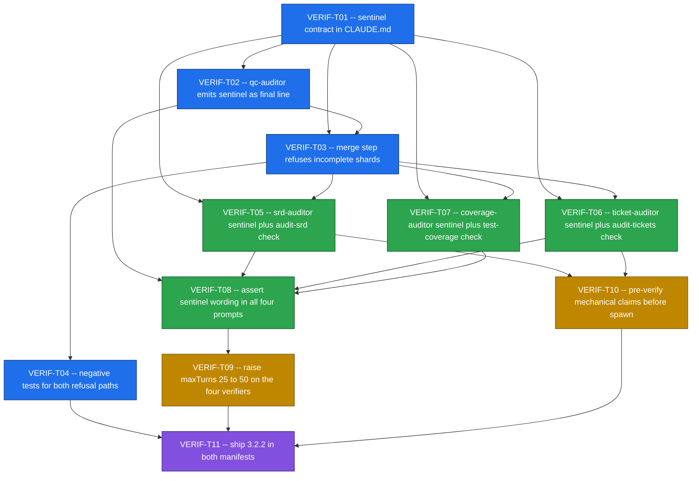

# VERIF Ticket Pack -- Verifier truncation and budget parity

Generated From: analysis.md (fix-pack, no SRD)

**Initiative**: `SRD/edm/VERIF__verifier-truncation`
**Lifecycle mode**: `fix-pack`
**Target release**: EDM 3.2.2 (patch -- bug fix, no methodology change)
**Tickets**: 11, one epic
**Requirements source**: `analysis.md` (its "Affected files" and "Acceptance" sections in particular)

## Fix-pack phase record

There is no SRD and no SRD version, so this pack carries no `srd.md v{version}` linkage header.
Under `lifecycle_mode=fix-pack`, **Phases 1, 2, 3 and 5 are recorded as skipped**: tickets are
generated directly from an analysis document, and a single ticket-pack review gate (headed
"Gate 3") replaces the normal Gate 2 -> Phase 4 -> Gate 3 sequence. No code-audit convergence gate
is required to archive.

Consequently the coverage map below maps tickets to **`analysis.md` sections** rather than to
`VERIF-NN` requirement IDs. There are no requirement IDs to map to.

## What this pack fixes

Two defects, described in full in `analysis.md`.

1. **A truncated verifier agent is silent, and its partial output is consumed as complete.** The
   dangerous instance is `edm-qc-auditor`: hook-spawned by `SubagentStop`
   (`plugins/edm/hooks/hooks.json:111-121`), it writes a verdict shard, and `/edm:implement` merges
   every shard into `qc/qc-summary.md` (`plugins/edm/skills/implement/SKILL.md:39`, `:96-127`) with
   no completeness check. A ticket can therefore be recorded PASS because the auditor ran out of
   turns before reaching its acceptance criteria, not because the criteria were met.
2. **The four read-only verifiers are budgeted at `maxTurns: 25`** while the producers whose output
   they check get 50 to 60.

## Ordering is load-bearing

**Fix 1 (sentinel) lands before Fix 2 (budget raise).** A higher budget reduces how often
truncation happens but never reveals when it did. If the budget were raised first, the remaining
truncations would become rarer and therefore harder to notice -- strictly worse than the status quo
for diagnosis. This is encoded in the `Depends On` fields, not merely stated: VERIF-T09 (the raise)
depends on VERIF-T08, which depends on the whole of the Fix 1 prompt set.

---

## Legend

<!-- Inlined verbatim from the EDM plugin root's docs/templates/ticket-size-legend.md -->

# Ticket Size Legend

| Size | Duration | Story Points | Guidance |
|------|----------|-------------|---------|
| XS | < 1 day | 1 pt | Trivial change: single-file fix, config tweak, doc update |
| S | 1-3 days | 2-3 pt | Small feature: one component, 1-3 tests, clear path |
| M | 3-5 days | 5 pt | Medium feature: multiple components, integration work |
| L | 1-2 weeks | 8-13 pt | Large feature: cross-cutting, architectural impact |
| XL | > 2 weeks | -- | **DECOMPOSE** -- must be split before implementation |

## Rules

- No XL tickets may enter a wave. Decompose before starting Phase 6.
- L tickets require explicit justification of why decomposition would add overhead.
- Size is based on implementation effort, not complexity of the problem statement.
- When in doubt, size up (S -> M) rather than down.

<!-- end inlined ticket-size-legend.md -->

---

## Cross-Cutting Requirements

<!-- Inlined verbatim from the EDM plugin root's docs/templates/cross-cutting-ac.md -->

# Cross-Cutting Acceptance Criteria

Every ticket in the pack MUST include these acceptance criteria where applicable:

## Tests (apply to all tickets unless ticket is docs-only)

- [ ] At least one smoke test exercises the main code path
- [ ] Error/edge cases handled and tested
- [ ] Existing tests still pass after the change

## Documentation (apply when the ticket changes user-visible behavior or public API)

- [ ] Project conventions doc (CLAUDE.md, CONTRIBUTING.md, or equivalent) updated if conventions change
- [ ] Public API changes documented with examples
- [ ] Changelog entry written if initiative has a CHANGELOG

## Logging and Observability (apply to tickets that add/change server-side behavior)

- [ ] Errors logged with structured data (correlation ID, context)
- [ ] New metrics/traces added if performance is critical
- [ ] Health check updated if new dependencies are introduced

## CI / Integration (apply to tickets that change the deployment surface)

- [ ] CI passes with the change
- [ ] No new linter warnings introduced
- [ ] Migrations are reversible and tested

## Source: `docs/templates/cross-cutting-ac.md`
## Authority: EDMV2-77 (WS-K) -- single source of truth; do not copy inline

<!-- end inlined cross-cutting-ac.md -->

### How the cross-cutting block resolves for this initiative

- **CI / Integration**: this plugin has **no CI pipeline**. "CI passes" resolves to
  `bash plugins/edm/bin/tests/run-all.sh` exiting 0 plus a clean pass through the `PreToolUse`
  git-commit hook (`edm-lint-staged-artifacts` -> `edm-lint-artifacts`). Those two are the entire
  enforcement surface, so an assertion that does not land in a smoke suite is not enforced at all.
  "Migrations are reversible" is N/A -- there is no database and no schema migration in this
  initiative.
- **Logging and Observability**: N/A for every ticket. Nothing here is server-side; the only
  "logging" is the stderr refusal message, which each relevant AC specifies by content.
- **Tests**: VERIF-T01 is docs-only and carries no smoke test of its own. Every other ticket lands
  its assertions in `plugins/edm/bin/tests/wave7-smoke.sh`.

### Note on prompt-text acceptance criteria

Seven tickets edit agent prompts or skill prose. "The agent reliably emits the sentinel" is model
behaviour and is **not** statically verifiable, so no AC in this pack asserts it -- an AC of that
shape would sit PARTIAL forever and land in `partial_verdict_map` with no runtime environment able
to close it. What the ACs assert instead is (a) that the instruction exists and is unambiguous
about the final-line requirement, verifiable by `grep`, and (b) that the consumer refuses input
lacking the sentinel, verifiable by running `bin/edm-check-verifier-sentinel` against a fixture.
The prompt asks; the consumer refuses. Only the second half needs to be reliable.

---

## Ticket Index

### Phase 1 -- Sentinel contract and QC enforcement (the unwatched path)

| ID | Title | Epic | Size | Priority | Depends On | Analysis Refs |
|---|---|---|---|---|---|---|
| VERIF-T01 | Specify the verifier completion-sentinel contract | verifier-completion-sentinel | XS | Must Have | -- | Fix 1; Affected files: `CLAUDE.md` |
| VERIF-T02 | Emit the QC completion sentinel as the shard's final line | verifier-completion-sentinel | S | Must Have | VERIF-T01 | Part 1; Affected files: `agents/edm-qc-auditor.md` |
| VERIF-T03 | Refuse incomplete QC shards at the qc-summary merge step | verifier-completion-sentinel | M | Must Have | VERIF-T01, VERIF-T02 | Fix 1; Acceptance 1, 2; Affected files: `skills/implement/SKILL.md` |
| VERIF-T04 | Negative smoke tests for both QC refusal paths | verifier-completion-sentinel | M | Must Have | VERIF-T03 | Fix 1 ("Negative test required"); Acceptance 4, 5 |

### Phase 2 -- Extend the sentinel to the remaining three verifiers

| ID | Title | Epic | Size | Priority | Depends On | Analysis Refs |
|---|---|---|---|---|---|---|
| VERIF-T05 | Terminate edm-srd-auditor findings with a sentinel and check it in /edm:audit-srd | verifier-completion-sentinel | S | Must Have | VERIF-T01, VERIF-T03 | Fix 1 (returned-text form); Affected files: `agents/edm-srd-auditor.md`, `skills/audit-srd/SKILL.md` |
| VERIF-T06 | Terminate edm-ticket-auditor findings with a sentinel and check it in /edm:audit-tickets | verifier-completion-sentinel | S | Must Have | VERIF-T01, VERIF-T03 | Fix 1 (returned-text form); Affected files: `agents/edm-ticket-auditor.md`, `skills/audit-tickets/SKILL.md` |
| VERIF-T07 | Sentinel-terminate test-coverage.md and check it in /edm:test-coverage | verifier-completion-sentinel | S | Must Have | VERIF-T01, VERIF-T03 | Fix 1 (file form); Affected files: `agents/edm-test-coverage-auditor.md`, `skills/test-coverage/SKILL.md` |
| VERIF-T08 | Assert the sentinel instruction in all four verifier prompts | verifier-completion-sentinel | S | Must Have | VERIF-T02, VERIF-T05, VERIF-T06, VERIF-T07 | Affected files: `bin/tests/wave7-smoke.sh` (row 1) |

### Phase 3 -- Budget parity and procedural hardening

| ID | Title | Epic | Size | Priority | Depends On | Analysis Refs |
|---|---|---|---|---|---|---|
| VERIF-T09 | Raise the four verifiers from maxTurns 25 to 50 | verifier-completion-sentinel | S | Must Have | VERIF-T08 | Part 2; Fix 2; Acceptance 3; Affected files: four `agents/*.md`, `CLAUDE.md`, `bin/tests/wave7-smoke.sh` |
| VERIF-T10 | Pre-verify mechanical claims before spawning auditors | verifier-completion-sentinel | S | Should Have | VERIF-T05, VERIF-T06 | Fix 3; Affected files: `skills/audit-srd/SKILL.md`, `skills/audit-tickets/SKILL.md` |

### Phase 4 -- Release

| ID | Title | Epic | Size | Priority | Depends On | Analysis Refs |
|---|---|---|---|---|---|---|
| VERIF-T11 | Ship 3.2.2 in both manifests and the changelog | verifier-completion-sentinel | XS | Must Have | VERIF-T04, VERIF-T09, VERIF-T10 | Acceptance 6; Affected files: `CHANGELOG.md`, `.claude-plugin/plugin.json`, `../../.claude-plugin/marketplace.json` |

**Sizing distribution**: XS 2, S 7, M 2, L 0, XL 0.

---

## Critical Path

**The longest path is the ordering constraint made structural**:
`T01 -> T03 -> T05 -> T08 -> T09 -> T11`. VERIF-T09 is the budget raise and it cannot start until
VERIF-T08 has proved the sentinel instruction is present in all four verifier prompts. That edge
exists for one reason: a higher budget makes truncation rarer without ever making it visible, so
raising the budget before the sentinel lands would leave the remaining truncations harder to
diagnose than they are today. The dependency is not a scheduling preference -- reversing it
degrades diagnosis.

VERIF-T05, T06 and T07 depend on VERIF-T03 rather than only on VERIF-T01 because T03 establishes
the refusal shape (two conditions, named artifact, no partial consumption) that the other three
consumers mirror. VERIF-T10 depends on T05 and T06 because all four edits land in the same two
`## Operational Orchestration` step lists.

---

## Epics Summary

| # | Epic | Tickets | File |
|---|---|---|---|
| 01 | verifier-completion-sentinel | 11 (VERIF-T01 .. VERIF-T11) | [epics/01-verifier-completion-sentinel.md](epics/01-verifier-completion-sentinel.md) |

One epic. The two defects share a single contract, a single consumer-side mechanism, and a single
release, and splitting them across epics would put an ordering constraint that must hold across an
epic boundary -- the exact place a dependency gets lost.

---

## Coverage Map -- analysis.md sections to tickets

### By analysis section

| `analysis.md` section | Ticket(s) | Status |
|---|---|---|
| Part 1 -- a truncated verifier is silent, and its partial output is consumed as complete | VERIF-T02, T03, T04, T05, T06, T07, T08 | PASS |
| Part 2 -- verifiers are budgeted below the producers they check | VERIF-T09 | PASS |
| Evidence (EDMV4 Phase 3 cap events) | VERIF-T05 (Description), VERIF-T09 (sizing rationale) | PASS |
| Fix 1 -- completion sentinel (do this first) | VERIF-T01, T02, T03, T05, T06, T07 | PASS |
| Fix 1 -- property 1: `tail -1` is the whole check | VERIF-T01 AC5, VERIF-T03 AC5, VERIF-T04 AC3 | PASS |
| Fix 1 -- property 2: `audited=` against `range=` | VERIF-T01 AC4/AC6, VERIF-T03 AC6, VERIF-T04 AC4/AC5/AC8 | PASS |
| Fix 1 -- "Negative test required" | VERIF-T04 AC7, AC8 | PASS |
| Fix 2 -- budget parity | VERIF-T09 | PASS |
| Fix 2 -- ordering (Fix 1 lands before Fix 2) | Encoded as VERIF-T08 -> VERIF-T09 in `Depends On` and in the critical path | PASS |
| Fix 3 -- pre-verify mechanical claims before spawning auditors | VERIF-T10 | PASS |
| Out of scope (fan-out, producer budgets, lens `maxTurns: 30`) | Recorded below and in VERIF-T09 / VERIF-T11 AC7 | PASS |

### By "Affected files" row

| File (analysis row) | Ticket(s) | Status |
|---|---|---|
| `agents/edm-qc-auditor.md` -- sentinel as final line | VERIF-T02 | PASS |
| `agents/edm-qc-auditor.md` -- `maxTurns` 25 -> 50 | VERIF-T09 | PASS |
| `agents/edm-srd-auditor.md` -- sentinel; `maxTurns` 25 -> 50 | VERIF-T05, VERIF-T09 | PASS |
| `agents/edm-ticket-auditor.md` -- sentinel; `maxTurns` 25 -> 50 | VERIF-T06, VERIF-T09 | PASS |
| `agents/edm-test-coverage-auditor.md` -- sentinel; `maxTurns` 25 -> 50 | VERIF-T07, VERIF-T09 | PASS |
| `skills/implement/SKILL.md` -- merge refuses a shard without a valid sentinel | VERIF-T03 | PASS |
| `skills/audit-srd/SKILL.md` -- check the sentinel | VERIF-T05 | PASS |
| `skills/audit-srd/SKILL.md` -- add the pre-verification step | VERIF-T10 | PASS |
| `skills/audit-tickets/SKILL.md` -- check the sentinel | VERIF-T06 | PASS |
| `skills/test-coverage/SKILL.md` -- check the sentinel | VERIF-T07 | PASS |
| `bin/tests/wave7-smoke.sh` -- sentinel present in all four agent prompts | VERIF-T08 | PASS |
| `bin/tests/wave7-smoke.sh` -- all four at `maxTurns: 50` | VERIF-T09 AC7 | PASS |
| `bin/tests/wave7-smoke.sh` -- negative test that a stripped sentinel makes the merge refuse | VERIF-T04 | PASS |
| `CLAUDE.md` -- document the sentinel contract | VERIF-T01 | PASS |
| `CLAUDE.md` -- update the testing-layer inventory `maxTurns` column | VERIF-T09 AC5 | PASS |
| `CHANGELOG.md` -- `[3.2.2]` entry | VERIF-T11 | PASS |
| `.claude-plugin/plugin.json` -- `3.2.2` | VERIF-T11 AC1 | PASS |
| `../../.claude-plugin/marketplace.json` -- edm version `3.2.2` | VERIF-T11 AC2, AC4 | PASS |

### By "Acceptance" item

| # | Acceptance item | Ticket(s) | Status |
|---|---|---|---|
| 1 | A truncated QC shard **blocks** the merge with a named error rather than being merged silently | VERIF-T03 AC4, AC8, AC9; VERIF-T04 AC2 | PASS |
| 2 | A shard whose `audited=` count is below its assigned `range=` is refused the same way | VERIF-T03 AC6; VERIF-T04 AC4, AC5 | PASS |
| 3 | All four verifiers run at `maxTurns: 50` | VERIF-T09 AC1, AC2 | PASS |
| 4 | Negative tests exist for both refusal paths and fail if the check is removed | VERIF-T04 AC7, AC8 (mutation guards) | PASS |
| 5 | `bash plugins/edm/bin/tests/run-all.sh` passes | Final AC of every ticket | PASS |
| 6 | Version is `3.2.2` in both the plugin manifest and the marketplace manifest | VERIF-T11 AC1, AC2, AC3 | PASS |

Every ticket carries at least one `Analysis Refs` entry, and every analysis section, affected-file
row and acceptance item maps to at least one ticket. There are no orphans in either direction.

---

## Design decisions taken in this pack

**The check is a real executable, not a bash snippet embedded in skill prose.** The analysis shows
the check as an inline `for` loop in `/edm:implement`'s merge step. VERIF-T03 instead creates
`plugins/edm/bin/edm-check-verifier-sentinel` and has the skill call it. Rationale: acceptance item
4 requires a negative test that fails if the check is removed, and prose inside a `SKILL.md` cannot
be executed, mutated, or asserted against. This follows the existing CA-436 precedent, where the
inline `PreToolUse` hook one-liner was extracted into `bin/edm-lint-staged-artifacts` for exactly
this reason. It adds one file beyond the analysis's 13, plus a row in `CLAUDE.md`'s `bin/` table
(VERIF-T03 AC11). It introduces no new binary dependency -- `bash`, `grep`, `sed` and `tail` only.

**One sentinel grammar for all four verifiers, with a per-artifact marker token.** `range=` and
`audited=` are the same two keys everywhere, so `edm-check-verifier-sentinel` is parameterized by
marker and the two file-writing verifiers (`edm-qc-auditor`, `edm-test-coverage-auditor`) share one
implementation. The two returned-text verifiers cannot use the script -- there is no file to
`tail` -- so their skills carry a prose check that mirrors the same two refusal conditions.

**Version discrepancy, flagged rather than silently resolved.** The analysis states the bump is
`3.2.1 -> 3.2.2`. The working tree read during ticket authoring has `3.2.0` in
`plugins/edm/.claude-plugin/plugin.json:4`, `3.2.0` in the edm entry of
`.claude-plugin/marketplace.json:35`, and `## [3.2.0]` as the newest changelog heading. VERIF-T11's
ACs pin the **end state** (`3.2.2` in both manifests, compared programmatically) rather than the
delta, so they hold either way, and its Technical Notes tell the implementer not to fabricate a
`3.2.1` changelog entry for a release that was never cut.

---

## Out of Scope

Explicitly not done in this initiative. Each is deferred on the reasoning `analysis.md` gives, not
merely omitted.

- **Proportional auditor fan-out** -- scaling auditor count to document size instead of the fixed
  "2-3" in `skills/audit-srd/SKILL.md:43`. A real improvement that would also help wall-clock time,
  but Fix 2 likely makes it unnecessary, and with Fix 1 in place the sentinel will show whether it
  is still needed. Revisit only if truncation recurs after VERIF-T09.
- **Raising producer budgets.** `edm-srd-writer` capped twice during EDMV4 remediation, so 50 is
  arguably low for producers too. Out of scope here because this initiative is about the verifier
  asymmetry, and raising both sides preserves the gap rather than closing it. Record as a named
  follow-on if it recurs.
- **Any change to the code-audit lenses' `maxTurns: 30`.** No evidence of truncation there.
  VERIF-T09 AC3 asserts they stay at 30, so this boundary is enforced rather than trusted.

Each of these is named in the `[3.2.2]` changelog entry (VERIF-T11 AC7) so a reader does not infer
they were overlooked.
