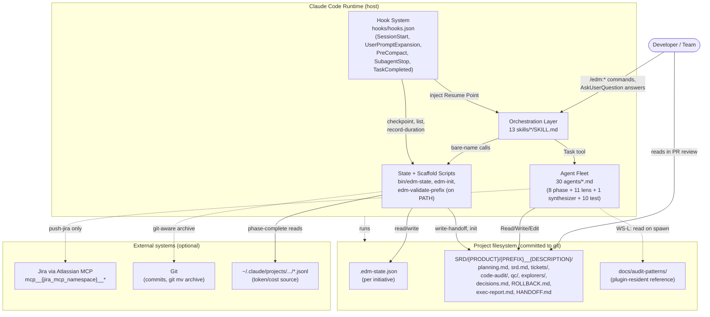
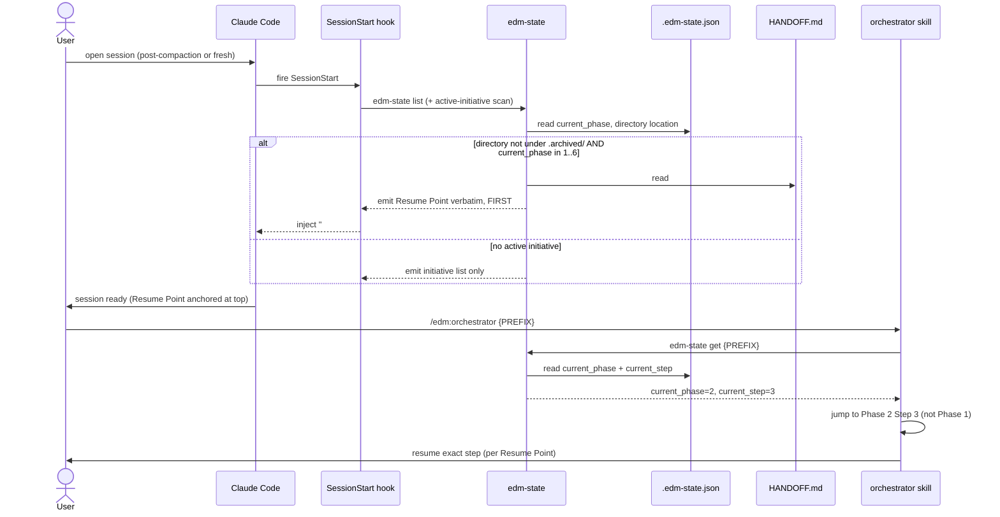
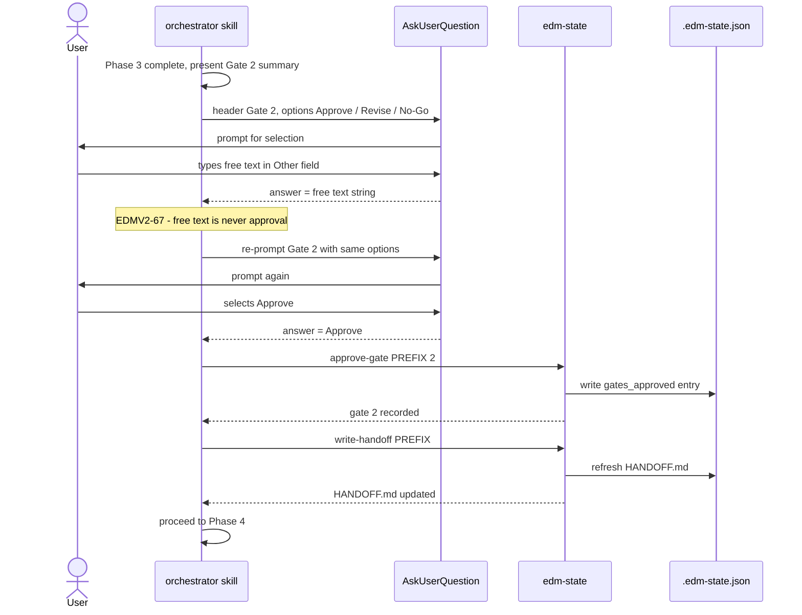
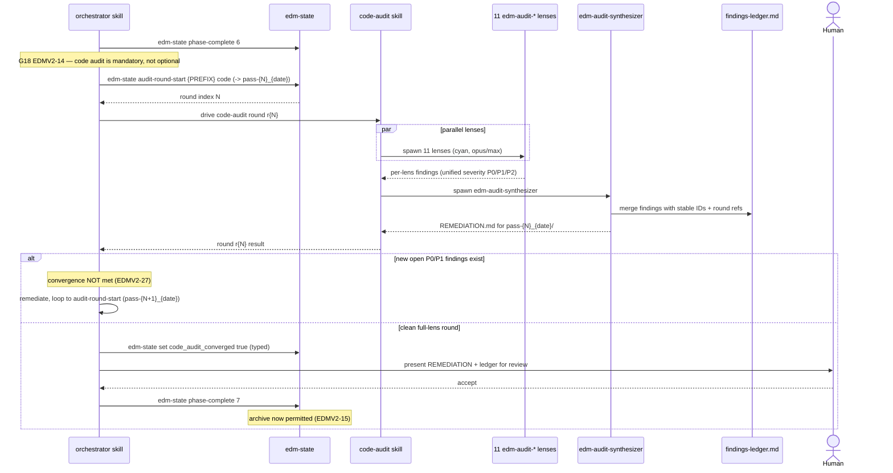
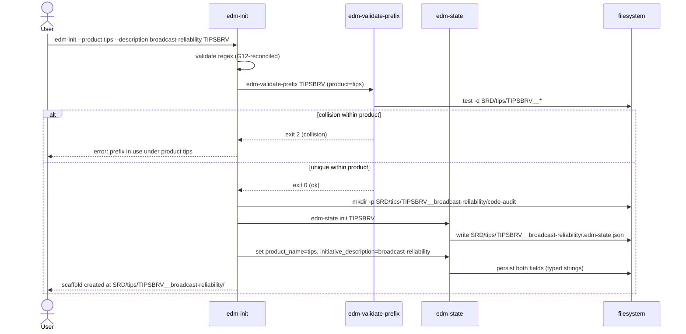

# EDMV2 Software Requirements Document

## Document Info

- Prefix: EDMV2
- Version: 1.0.7
- Status: Draft
- Date: 2026-06-08
- Authors: EDM Orchestrator + edm-srd-writer
- Generated from: planning.md (Gate 1 approved 2026-06-08)

| Field | Value |
|---|---|
| Initiative | Enhance the `edm-ai-development` Claude Code plugin |
| Plugin internal name | `edm` |
| Current version | 1.3.0 |
| Target version | 2.0.0 |
| Initiative size | Large (~95-115 tickets (revised up from Gate-1 baseline of ~75-90 by WS-L/M/N additions approved post-Gate-1)) |
| Workstreams in scope | WS-A, WS-B, WS-C, WS-D, WS-E, WS-F, WS-G, WS-H, WS-J, WS-K, WS-L, WS-M, WS-N |
| Workstreams excluded | WS-I (legacy migration) |

### Revision History

| Version | Date | Author | Summary |
|---|---|---|---|
| 1.0.0 | 2026-06-08 | EDM Orchestrator + edm-srd-writer | Initial SRD generated from Gate-1-approved planning.md |
| 1.0.1 | 2026-06-08 | edm-srd-auditor remediation | Added post-Gate-1 workstreams WS-L/M/N; revised ticket estimate from ~75-90 to ~95-115 |
| 1.0.1 | 2026-06-08 | edm-srd-auditor remediation | Phase 3 audit remediation: 6 P0 + 24 P1 findings fixed. Added EDMV2-104 (marketplace.json bump), EDMV2-105 (self-hosting backup). Post-Gate-1 scope additions (WS-L/M/N, G18, gate false-positive) reflected in ticket estimate revision. |
| 1.0.2 | 2026-06-08 | Gate 2 revision | Added EDMV2-106: TDD implementation mode option at Phase 6 start (WS-E). Added §9.6, `implementation_mode` state field, userConfig key. Total requirements: 106. |
| 1.0.3 | 2026-06-08 | Gate 2 revision | Added EDMV2-107 (branch created at init, per-gate artifact commits, simultaneous-initiative detection) and EDMV2-108 (stale git lock remediation) to WS-J. Added `initiative_branch` state field. Total requirements: 108. |
| 1.0.4 | 2026-06-08 | Gate 2 revision | Revised WS-L to living feedback system: EDMV2-80 (seed from real corpus), EDMV2-80a (auto-update after each audit), EDMV2-80b (manual update-patterns subcommand), EDMV2-81/82/83 updated to load from living library. Seed pattern documents created in `docs/audit-patterns/` from 16-initiative corpus analysis. Total requirements: 110. |
| 1.0.5 | 2026-06-08 | Gate 2 revision | Fixed WS-M/WS-G conflict: EDMV2-87 changed from per-product to global prefix uniqueness (PREFIX used in commit scopes, ticket IDs, edm-state commands — must be globally unambiguous). EDMV2-57 updated to confirm bare PREFIX sufficient. EDMV2-61 cross-references WS-M product directory as baseline home. |
| 1.0.6 | 2026-06-08 | Gate 2 revision | Added EDMV2-109: plugin staging copy as primary C-5 mitigation (all Phase 6 work in staging copy; live plugin untouched; single cutover at completion). Updated C-5 constraint, §5.6 Risk 1, §10.4, EDMV2-103. Additive-only constraint retained for C-4 only. Fixed §5.3.B diagram: removed curly-brace Mermaid syntax errors, corrected write-handoff as separate orchestrator call, fixed return-message sequence. |
| 1.0.7 | 2026-06-08 | Gate 2 revision | Added EDMV2-110: EDM_Plugin_Presentation.pptx and EDM_Plugin_User_Guide.docx must be updated to reflect v2.0.0 before initiative is declared complete. Total requirements: 112. |

---

## 1. Executive Summary

The `edm-ai-development` plugin (internal name `edm`, v1.3.0) implements the Enterprise Development Methodology: a six-phase, three-HITL-gate process (Planning -> SRD -> SRD Audit -> Tickets -> Ticket Audit -> Implementation), augmented by an 11-lens code audit and a multi-layer testing layer. It produces source-controlled artifacts in a project's `SRD/` directory and tracks per-phase cost, duration, and gate approvals in `.edm-state.json`. EDMV2 is a meta-initiative: it uses EDM to improve EDM. The enhancement set is evidence-based, derived from a systematic analysis of approximately 30 real EDM initiatives (active and archived) in the separate `scripps-mcp/SRD/` repository, plus the foundational methodology document `ai-assisted-development-methodology.md` v2.0.0. Four parallel `edm-explorer` agents mapped the plugin surface, the DC/control-plane cohort, the TIPS product-line cohort, and the methodology doc plus legacy initiatives. Their findings converged on a consistent set of systemic gaps, organized into fourteen workstreams (WS-A through WS-N, with WS-I excluded).

EDMV2 fixes 18 concrete correctness and consistency defects (WS-A, tracked as Epic 1), the most severe being G1 (the `edm-test-coverage-auditor` agent is denied the `Write` tool yet is mandated to write `test-coverage.md`, structurally breaking the headline v1.3.0 testing feature), G3 (the `/edm:metrics` skill advertises features `edm-state metrics-report` never computes), G4 (two divergent Phase-1 `planning.md` templates), and G18 (the mandatory 11-lens code audit is currently positioned as an optional post-Phase-6 suggestion). Beyond defect repair, EDMV2 makes the methodology scale to the real workloads observed in the corpus: convergence-guaranteed multi-round audits with a findings ledger (WS-B), sharded QC with a canonical artifact home and PARTIAL/deferred-runtime verdicts (WS-C), canonical filesystem homes for architecture docs, explorer findings, decision ledgers, rollback runbooks, and execution reports (WS-D), and audit-informed writer-agent prompts that reduce audit churn by encoding what auditors repeatedly flag (WS-L).

EDMV2 also adds first-class adaptation and lifecycle modes from the methodology doc that the plugin currently implements as none: mini-SRD, a compliance review gate (Gate 3.5), an Infrastructure-as-Code profile, a Data/ML profile, and a prototype path (Phases 1-2 only) (WS-E); partial-EDM/phase-skip, analysis fast-track/fix-pack, and supersede/fork lifecycle modes (WS-F); product-line and multi-initiative linkage via parent/related fields and a shared baseline (WS-G); per-epic test plans and coverage for multi-stack initiatives (WS-H); state-integrity and determinism fixes including a deterministic gate, typed state values, file locking, git-aware archiving, and a fix for the HITL gate false-positive where free-text input is misrouted as approval (WS-J); convention enforcement that strips AI-attribution trailers and Unicode glyphs and lints artifacts (WS-K); a new `SRD/{PRODUCT}/{PREFIX}__{DESCRIPTION}/` directory layout (WS-M, sequenced first due to highest blast radius); and compaction resilience via a `current_step` state field, a `## Resume Point` section in `HANDOFF.md`, and `SessionStart` injection (WS-N). For users, the visible changes are: the testing feature actually produces its coverage report; metrics report only what is computed; initiatives become discoverable on the filesystem by product and description; long sessions survive context compaction without losing position; gate approvals can no longer be triggered accidentally by free-text; and the plugin no longer emits banned Unicode or AI-attribution content into committed artifacts. The plugin version bumps from 1.3.0 to 2.0.0; all existing `.edm-state.json` files continue to work unchanged via additive, defaulted fields.

---

## 2. Goals

### 2.1 Objectives

- Fix all 18 WS-A correctness/consistency defects (G1-G18) so that every advertised v1.x feature behaves as documented, verifiable by inspection of each cited `file:line`.
- Restore the v1.3.0 testing feature by granting `edm-test-coverage-auditor` the `Write` tool (G1), verifiable by the agent successfully writing `SRD/{PREFIX}/test-coverage.md` in a sandbox run.
- Make the audit phases converge: introduce a round/pass index, a persistent findings ledger, a convergence gate, and version-drift detection (WS-B), verifiable by re-running an audit and observing deterministic round directory names and a non-colliding ledger.
- Make QC scale: shard the QC auditor across large ticket sets, define a canonical QC artifact home, and preserve PARTIAL / deferred-to-runtime AC verdicts in state (WS-C).
- Provide canonical filesystem homes for the recurring real artifacts that currently leak into sidecars or HANDOFF prose (WS-D).
- Implement four adaptation profiles (mini-SRD, IaC, data/ML, prototype) selected via the `mode` field, plus an orthogonal `compliance_enabled` flag that inserts Gate 3.5 for regulated-industry projects (WS-E), verifiable by selecting each mode in the orchestrator and observing the documented behavior.
- Implement partial/fast-track/supersede lifecycle modes (WS-F) and product-line linkage (WS-G), verifiable by state-field presence and HANDOFF rendering.
- Support multi-stack/multi-epic test plans and coverage (WS-H).
- Harden state integrity: deterministic gate enforcement, typed state values, file locking, git-aware archive, and the gate false-positive fix (WS-J).
- Enforce marketplace conventions in the plugin's own output: zero AI-attribution trailers, zero Unicode glyphs in committed artifacts, plus an artifact lint (WS-K).
- Reduce audit churn by encoding audit patterns into writer-agent prompts (WS-L).
- Adopt the `SRD/{PRODUCT}/{PREFIX}__{DESCRIPTION}/` directory layout with product-scoped prefix validation and state-derived path construction (WS-M).
- Make EDM resilient to context compaction via `current_step`, `## Resume Point`, and `SessionStart` injection (WS-N).
- Ship the enhancement as plugin v2.0.0 with full backward compatibility for existing initiatives.

### 2.2 Non-Goals

- WS-I (legacy migration) is excluded. No `/edm:import` skill is built in this initiative. The approximately 15 legacy initiatives remain frozen in their current formats. This is a candidate for a future version.
- This is not a methodology redesign. The six-phase / three-gate core, the agent color scheme, the model/effort assignments, and the source-controlled-artifact philosophy are retained. New modes augment the core; they do not replace it.
- No new external service dependencies are introduced. EDMV2 remains markdown + POSIX bash + JSON. The only external tooling assumed is `jq` (already required) and optionally git and an MCP server for Jira (already optional).
- EDMV2 does not modify any initiative in the `scripps-mcp/SRD/` corpus. That corpus is read-only evidence.
- The plugin's "Enterprise" rebrand and its web-stack testing focus are intentional, retained divergences from the methodology doc, not defects.

---

## 3. Scope

### 3.1 In Scope

All thirteen in-scope workstreams and the files they touch:

| Workstream | Summary | Primary files |
|---|---|---|
| WS-A | 18 correctness/consistency defects (Epic 1) | `agents/edm-test-coverage-auditor.md`, `skills/metrics/SKILL.md`, `bin/edm-state`, `skills/plan/SKILL.md`, `skills/orchestrator/SKILL.md`, `skills/srd/SKILL.md`, `skills/audit-srd/SKILL.md`, `skills/push-jira/SKILL.md`, `bin/edm-init`, `bin/edm-validate-prefix`, all 30 `agents/*.md`, `plugin.json`, `README.md`, `CHANGELOG.md` |
| WS-B | Audit scalability and convergence | `skills/code-audit/SKILL.md`, `skills/audit-srd/SKILL.md`, `skills/audit-tickets/SKILL.md`, `agents/edm-audit-*.md`, `agents/edm-audit-synthesizer.md`, `bin/edm-state` |
| WS-C | QC scale and verdict fidelity | `skills/implement/SKILL.md`, `agents/edm-qc-auditor.md`, `hooks/hooks.json`, `bin/edm-state` |
| WS-D | Canonical artifact homes | `agents/edm-architect.md`, `agents/edm-explorer.md`, `bin/edm-state`, `CLAUDE.md` |
| WS-E | Adaptation modes (mini-SRD, compliance gate, IaC, data/ML, prototype) | `skills/orchestrator/SKILL.md`, `skills/srd/SKILL.md`, `bin/edm-init`, `bin/edm-state`, `plugin.json`, new compliance/IaC/data-ML QC agents |
| WS-F | Lifecycle modes (partial/fast-track/supersede) | `skills/orchestrator/SKILL.md`, `bin/edm-state` |
| WS-G | Product-line / multi-initiative linkage | `skills/orchestrator/SKILL.md`, `skills/srd/SKILL.md`, `bin/edm-state` |
| WS-H | Multi-stack / multi-epic test support | `skills/test-plan/SKILL.md`, `skills/test-coverage/SKILL.md`, `agents/edm-test-planner.md`, `agents/edm-test-coverage-auditor.md` |
| WS-J | State integrity and determinism | `bin/edm-state`, `hooks/hooks.json`, `skills/orchestrator/SKILL.md` |
| WS-K | Convention enforcement and templates | `skills/push-jira/SKILL.md`, `skills/tickets/SKILL.md`, `skills/audit-tickets/SKILL.md`, `bin/edm-state`, `hooks/hooks.json`, new shared templates |
| WS-L | Audit-informed artifact quality | `agents/edm-srd-writer.md`, `agents/edm-ticket-writer.md`, `agents/edm-implementer.md`, new `docs/audit-patterns/` |
| WS-M | Initiative directory structure | `bin/edm-init`, `bin/edm-validate-prefix`, `bin/edm-state`, all skills/agents that construct paths, `CLAUDE.md` |
| WS-N | Compaction resilience | `bin/edm-state`, `hooks/hooks.json`, `skills/orchestrator/SKILL.md` |

### 3.2 Out of Scope

- WS-I legacy migration and the `/edm:import` skill.
- Any modification of the `scripps-mcp/SRD/` corpus initiatives.
- Adding a build, test, or CI/CD system to the marketplace repo (none exists; "tests" for EDMV2 are `claude plugin validate`, sandbox runs, and bash unit checks).
- Rewriting the six-phase core methodology or changing the agent color scheme / model assignments.
- Introducing any new external service dependency beyond what already exists.
- Confluence integration for `push-jira` (only the MCP-namespace parameterization is in scope; the Confluence path remains out of scope).

### 3.3 Constraints

- C-1 (Marketplace hard rules): gitmoji shortcodes only, never Unicode emoji; no AI-attribution trailers in commits or artifacts; git commands run as separate parallel Bash calls (never chained with `&&`); explicit `git add` by name (never `git add -A` / `git add .`); do not add `requires:{mcp:[]}` to `marketplace.json`. EDMV2 must both obey these rules and fix the plugin's own violations of them (WS-K, G15).
- C-2 (No build/test/CI): the plugin is markdown + bash + JSON. Verification is limited to `claude plugin validate`, sandbox runs (`claude --plugin-dir`), and bash unit checks for `bin/edm-state`.
- C-3 (POSIX bash): all `bin/` scripts must be POSIX-compatible bash (`#!/usr/bin/env bash`) and operate on the project CWD with no plugin-relative artifact paths.
- C-4 (Backward compatibility): existing in-flight initiatives (DCAUTHZ, DCHELP, etc.) and their `.edm-state.json` files must keep working unchanged. All state-schema changes must be additive and migratable with safe defaults.
- C-5 (Self-hosting risk): EDMV2 is built with the plugin it modifies. Primary mitigation: all Phase 6 implementation work is performed in a staging copy (`plugins/edm-ai-development-staging/`); the live plugin is never touched during Phase 6, so EDMV2's own running `edm-state` and hooks are never disrupted. At completion, the staging copy is swapped in as a single cutover step (EDMV2-109).
- C-6 (Source-doc authority): the methodology doc `ai-assisted-development-methodology.md` v2.0.0 is the canonical reference for WS-E adaptation modes. The plugin's "Enterprise" rebrand and web-stack testing focus are intentional retained divergences, not defects.
- C-7 (Corpus is a separate, read-only repo): `scripps-mcp/SRD/` is read for evidence only; EDMV2 never writes to it.

---

## 4. Functional Requirements

Priority legend: Must (required for v2.0.0 release), Should (strongly desired; defer only under schedule pressure), Could (opportunistic), Won't (explicitly excluded this release). Each requirement is one testable statement. Workstream and defect codes appear in brackets.

### 4.1 WS-A — Correctness and Consistency Defects (Epic 1)

#### EDMV2-01 [WS-A][G1] Grant Write to the coverage auditor
- Priority: Must
- The `edm-test-coverage-auditor` agent must be able to write `test-coverage.md`. Its frontmatter at `agents/edm-test-coverage-auditor.md:8-9` must include `Write` in `tools` and must not list `Write` in `disallowedTools`.
- Verification: in a sandbox run, the agent writes `SRD/{PREFIX}/test-coverage.md` without a permission error.

#### EDMV2-02 [WS-A][G1] Coverage-auditor write-permission regression check
- Priority: Must
- A documented sandbox check must confirm the coverage auditor produces `test-coverage.md` end-to-end after EDMV2-01, recorded in the testing layer's verification notes.
- Verification: the check exists and passes; removing `Write` again causes it to fail.

#### EDMV2-03 [WS-A][G3] Metrics skill claims match implementation
- Priority: Must
- The `/edm:metrics` skill (`skills/metrics/SKILL.md`) must not advertise any feature that `edm-state metrics-report` does not compute. Specifically the claimed `gate_review_seconds`, p95 figures, bottleneck highlighting, and guideline comparison (skill lines 31, 33, 43-45, 64; p95 is at line 43, not 44-46) must either be implemented in `bin/edm-state` or removed from the skill text.
- Default outcome: p95, bottleneck-highlighting, and guideline-comparison claims are removed from the skill text (implementation deferred). `gate_review_seconds` is implemented per EDMV2-04 if EDMV2-04 lands; if EDMV2-04 is deferred, it is also removed. EDMV2-03 passes only when no advertised metric lacks a code path.
- Verification: every metric named in the skill maps to a code path in `cmd_metrics_report`; the EDMV2-04 decision (implement vs. defer) is applied before this check.

#### EDMV2-04 [WS-A][G3] Implement gate_review_seconds
- Priority: Should
- `edm-state metrics-report <PREFIX>` should compute `gate_review_seconds` per gate from the interval between phase-complete of the gated phase and the gate's `approved_at` timestamp.
- Verification: a state file with known timestamps yields the expected per-gate review seconds.

#### EDMV2-05 [WS-A][G4] Unify the Phase-1 planning template
- Priority: Must
- The Phase-1 `planning.md` template in `skills/plan/SKILL.md` and the one in `skills/orchestrator/SKILL.md` must be identical and must include all four sections: `## Go/No-Go`, `## Riskiest Assumptions`, `## Open Questions`, and `## Decisions Made`. The `## Open Questions` and `## Decisions Made` headings must match exactly what `write_handoff_internal` parses (`bin/edm-state:719-720`).
- Verification: diff of the two templates is empty for the section headings; `write-handoff` extracts a non-empty Decisions Made block from a planning.md produced by either skill.

#### EDMV2-06 [WS-A][G4] Handoff parser robustness for unified template
- Priority: Must
- `write_handoff_internal` must extract the `## Decisions Made` block from a `planning.md` produced by either the `plan` skill or the orchestrator without producing the empty-fallback placeholder when decisions are present.
- Verification: a planning.md with recorded decisions yields those decisions in HANDOFF.md.

#### EDMV2-07 [WS-A][G2] Remove or fulfill the example-block claim
- Priority: Must
- The CHANGELOG claim that all agents contain `<example>` blocks must be made true or removed. Either every `agents/*.md` gains an `<example>` block, or the CHANGELOG (`CHANGELOG.md`) is corrected to remove the claim.
- Verification: if the claim remains, `grep -L '<example>' agents/*.md` returns no files; if removed, the claim no longer appears in CHANGELOG.

#### EDMV2-08 [WS-A][G5] /edm:plan creates HANDOFF.md
- Priority: Must
- The `/edm:plan` skill must call `edm-state write-handoff <PREFIX>` after writing `planning.md`, so HANDOFF.md exists even when the user runs `plan` directly rather than via the orchestrator.
- Verification: running `/edm:plan` on a fresh prefix produces both `planning.md` and `HANDOFF.md`.

#### EDMV2-09 [WS-A][G6] Route SRD versioning through srd-version
- Priority: Must
- The `srd` and `audit-srd` skills must set the SRD version via `edm-state srd-version <PREFIX> <version>` (which refreshes HANDOFF) rather than `edm-state set <PREFIX> srd_version <value>` (which skips the handoff refresh).
- Verification: setting the version via these skills updates both `srd_version` in state and the HANDOFF.md timestamp.

#### EDMV2-10 [WS-A][G7] Reconcile record-task-duration documentation with behavior
- Priority: Must
- The documented no-op `record-task-duration` (`bin/edm-state:403-411`) must be reconciled with the `TaskCompleted` hook and docs: either implement per-task duration accumulation by parsing the hook stdin JSON, or document it explicitly as a reserved no-op and remove any claim that it is live.
- Verification: docs and behavior agree; if implemented, a simulated `TaskCompleted` payload records a duration; if deferred, no doc claims it is active.

#### EDMV2-11 [WS-A][G8] Parameterize the push-jira MCP namespace
- Priority: Must
- The `push-jira` skill must read the MCP server namespace from a userConfig value `jira_mcp_namespace` (default `plugin_jira_atlassian-mcp-server`) instead of hardcoding `mcp__MCP_DOCKER__*`. The skill must construct tool names as `mcp__{jira_mcp_namespace}__{tool}`.
- Verification: with the default config, the skill references `mcp__plugin_jira_atlassian-mcp-server__atlassianUserInfo`; overriding the config changes the referenced namespace.

#### EDMV2-12 [WS-A][G8] push-jira graceful skip on missing MCP
- Priority: Must
- When the configured Jira MCP namespace is unavailable, `push-jira` must skip with a friendly message and exit cleanly (no error), preserving the strictly opt-in behavior.
- Verification: with no MCP connected, the skill prints a skip message and does not fail.

#### EDMV2-13 [WS-A][G9] Unify severity vocabulary
- Priority: Must
- A single severity vocabulary must be defined and used across all audit types. The code-audit vocabulary (P1/P2/P3 + NOTED) and the SRD/ticket/QC vocabulary (P0/P1/P2) must be reconciled into one documented scale referenced by every auditor agent and the synthesizer, including `edm-test-coverage-auditor`.
- Verification: every `edm-audit-*`, `edm-srd-auditor`, `edm-ticket-auditor`, `edm-qc-auditor`, and `edm-test-coverage-auditor` agent references the same documented severity scale; no two scales remain.

#### EDMV2-14 [WS-A][G18] Make code-audit a mandatory orchestrated phase
- Priority: Must
- The orchestrator skill (`skills/orchestrator/SKILL.md:279`) must position the 11-lens code audit as a mandatory phase in the flow, not an "Optional: invoke `/edm:code-audit`" suggestion. The orchestrator must drive the code audit and block initiative completion until it has run and reached convergence.
- Verification: the word "Optional" no longer precedes the code-audit step; the orchestrator's completion logic requires a converged code-audit round.

#### EDMV2-15 [WS-A][G18] Code-audit phase gating in state
- Priority: Must
- `.edm-state.json` must record code-audit completion such that a v2 initiative cannot be archived (marked complete) without at least one converged code-audit round on record. The gating rule must be backward-safe for the existing corpus: when `code_audit_converged` is explicitly `false` AND `product_name` is set (indicating a v2 initiative), `edm-state archive` refuses. When `code_audit_converged` is absent (legacy/v1 initiative) OR when `mode` is `prototype`, archive proceeds with a warning. When `code_audit_converged` is `true`, archive proceeds silently.
- Verification: archiving a v2 initiative (with `product_name` set) and `code_audit_converged` explicitly `false` is refused; archiving a legacy initiative with `code_audit_converged` absent proceeds with a warning; archiving with `code_audit_converged` true proceeds silently.

#### EDMV2-16 [WS-A][G10] Parse --dry-run
- Priority: Should
- The `--dry-run` flag must be parsed and honored where it is documented (e.g., `push-jira`): when set, the skill reports the actions it would take without performing writes.
- Verification: invoking with `--dry-run` produces a plan and performs no external mutation.

#### EDMV2-17 [WS-A][G11] Resolve --fill-gaps contradiction
- Priority: Must
- The `--fill-gaps` semantics must be made consistent between the `test` skill and `CLAUDE.md` (skill says ALL gaps, CLAUDE.md says P1-only). The `test` skill definition is correct, There should not be an option to only P1 gaps.
- Verification: skill text and CLAUDE.md describe identical `--fill-gaps` behavior.

#### EDMV2-18 [WS-A][G12] Reconcile prefix regex with documented format
- Priority: Must
- The prefix validation regex in `bin/edm-validate-prefix` must match the documented "3-6 uppercase characters" format, or the documentation must be updated to match the implemented regex (currently 2-8 chars allowing `_`/`-`). Implementation and docs must agree.
- Verification: the regex and the documented format string (`prefix_format_hint`, CLAUDE.md naming section) describe the same character set and length.

#### EDMV2-19 [WS-A][G13] Fix the stale next-step message in edm-init
- Priority: Should
- `bin/edm-init` must print a next-step message that matches the actual current orchestrator entry point and the new directory layout (WS-M).
- Verification: the printed message references a valid, current command and path.

#### EDMV2-20 [WS-A][G14] Scope Bash in skill allowed-tools
- Priority: Should
- Each skill's `allowed-tools` `Bash` entry should be scoped to the command families the skill actually invokes (e.g., `Bash(edm-state *)`, `Bash(git *)`) rather than unscoped `Bash`.
- Verification: no skill frontmatter contains a bare unscoped `Bash` where a scoped form is sufficient.

#### EDMV2-21 [WS-A][G15] Remove Unicode glyphs from generated artifacts
- Priority: Must
- All artifacts the plugin generates (HANDOFF.md, drift warnings, etc.) must use ASCII only. The Unicode glyphs currently emitted must be replaced with ASCII equivalents (e.g., `[present]`/`[absent]`, `(!)`). Specifically: `bin/edm-state:368` (the `(!)` glyph in the drift header), `:380` and `:390` (the two `->` arrows -- currently Unicode -- in the drift body), and `:711-715` (the present/not-yet markers in `write_handoff_internal`).
- Verification: `grep -P '[^\x00-\x7F]'` over generated HANDOFF.md and drift output returns nothing.

#### EDMV2-22 [WS-A][G16] De-duplicate plugin.json and fix README install paths
- Priority: Must
- The duplicate plugin manifest (`plugin.json` and `.claude-plugin/plugin.json`) must be resolved to a single source of truth, and the README install paths must be corrected to match the actual layout.
- Verification: there is one authoritative manifest; README install commands reference paths that exist.

#### EDMV2-23 [WS-A][G17] Resolve scaffold asymmetry
- Priority: Could
- The asymmetry in what `edm-init` scaffolds versus what later phases expect must be resolved so the initial directory shape matches the documented artifact layout.
- Verification: a freshly scaffolded initiative directory matches the documented layout with no missing or extra expected slots.

### 4.2 WS-B — Audit Scalability and Convergence

#### EDMV2-24 [WS-B] Round/pass index for code-audit
- Priority: Must
- The code-audit phase must use the directory naming scheme `code-audit/pass-{N}_{YYYY-MM-DD}/` where `{N}` is the initiative-wide, monotonically incrementing pass counter stored in `.edm-state.json` (`audit_rounds.code`) and `{YYYY-MM-DD}` is the date the round started. The counter never resets for the lifetime of the initiative regardless of date, re-run, or day boundary (e.g., `pass-1_2026-06-01/`, `pass-2_2026-06-08/`, `pass-3_2026-06-08/`). The pass number is the primary unique identifier; the date is informational only.
- Verification: three code-audit rounds run across two different days produce `pass-1_{date-a}/`, `pass-2_{date-b}/`, `pass-3_{date-b}/` with `N` always incrementing; the counter in state after round 3 reads `3`; no reset to `1` occurs on a new day.

#### EDMV2-25 [WS-B] audit-round-start subcommand
- Priority: Must
- `bin/edm-state` must provide `audit-round-start <PREFIX> <audit-type>` that increments the initiative-wide `audit_rounds.<type>` counter in state and echoes the new value. The counter is persisted in `.edm-state.json` and is never reset — it increases monotonically across all days for the lifetime of the initiative.
- Verification: calling it three times for the same initiative (across separate runs on different days) returns `1`, `2`, `3` in order; `jq .audit_rounds.code .edm-state.json` reflects the current value after each call; the counter does not reset between sessions or on a new calendar day.

#### EDMV2-26 [WS-B] Persistent findings ledger
- Priority: Must
- The code-audit phase must maintain a persistent findings ledger that accumulates findings across rounds with stable IDs, severity, status (open/fixed/deferred), and the round in which each was raised and resolved.
- Verification: a finding raised in round 1 and fixed in round 2 appears once in the ledger with both round references.

#### EDMV2-27 [WS-B] Convergence gate
- Priority: Must
- The code-audit phase must define a convergence condition (e.g., a full-lens round with zero new open P1-or-higher findings) and must not declare the audit converged until that condition is met.
- Verification: a round that surfaces a new blocking finding does not satisfy convergence; a clean full-lens round does.

#### EDMV2-28 [WS-B] Stable lens set across rounds
- Priority: Must
- Each code-audit round must record which lenses ran; a round that drops lenses must be marked as a partial/scoped round and must not by itself satisfy the convergence gate.
- Verification: a scoped round records its lens subset and is flagged non-convergent.

#### EDMV2-29 [WS-B] Version-drift detection between audit artifact and audited artifact
- Priority: Must
- SRD and ticket audits must record the version of the SRD/pack they audited, and the plugin must detect and flag drift when the audited artifact's version is stale relative to the current SRD/pack version.
- Verification: auditing pack v1.1 against SRD v1.2 produces a drift flag.

#### EDMV2-30 [WS-B] Scoped re-audit support
- Priority: Should
- The code-audit phase should support re-auditing a lens subset (scoped re-audit) for targeted follow-up while preserving the full ledger.
- Verification: a scoped re-audit runs only the requested lenses and appends to the existing ledger.

#### EDMV2-31 [WS-B] Findings ledger canonical home
- Priority: Should
- The findings ledger must have a canonical artifact path within the initiative directory (coordinated with WS-D) rather than being reconstructed from per-round REMEDIATION files.
- Verification: the ledger exists at its canonical path after the first round.

### 4.3 WS-C — QC Scale and Verdict Fidelity

#### EDMV2-32 [WS-C] QC sharding for large ticket sets
- Priority: Must
- The QC flow must shard across large ticket sets, spawning multiple `edm-qc-auditor` instances over ticket ranges and producing a merged summary, rather than relying on a single auditor pass. Shard when ticket count exceeds 20; each shard covers at most 12 tickets; shard boundaries follow epic boundaries where possible. The threshold is configurable via the `qc_shard_threshold` userConfig key (default 20).
- Verification: a ticket set of 25 tickets produces at least 2 shard files (`qc/qc-shard-01.md`, `qc/qc-shard-02.md`) and a `qc/qc-summary.md`.

#### EDMV2-33 [WS-C] Canonical QC artifact home
- Priority: Must
- Phase-6 QC output must have a canonical artifact path within the initiative directory (not ad-hoc `qc-audit.md` or HANDOFF tables).
- Verification: after QC runs, the report exists at the canonical path; per-shard files and a summary live in defined locations.

#### EDMV2-34 [WS-C] PARTIAL and deferred-to-runtime verdicts
- Priority: Must
- The QC auditor must support PASS / PARTIAL / FAIL verdicts (per methodology doc lines 356, 370, 390), where PARTIAL captures ACs that cannot be verified statically and require a runtime environment.
- Verification: an AC requiring a running service is recorded as PARTIAL with a deferred-to-runtime note, not invented or marked FAIL.

#### EDMV2-35 [WS-C] record-partial-verdict subcommand
- Priority: Must
- `bin/edm-state` must provide `record-partial-verdict <PREFIX> <ticket> <verdict> [note]` that persists per-ticket PASS/PARTIAL/FAIL into a `partial_verdict_map` in state.
- Verification: recording a PARTIAL verdict for a ticket persists it and surfaces it in HANDOFF/metrics.

#### EDMV2-36 [WS-C] PARTIAL preserved in state and HANDOFF
- Priority: Must
- PARTIAL verdicts and their deferred-to-runtime reasons must be preserved in `.edm-state.json` and rendered in HANDOFF.md so a teammate sees what still needs runtime verification.
- Verification: HANDOFF.md lists outstanding PARTIAL ACs after QC.

#### EDMV2-37 [WS-C] QC sharding hook coordination
- Priority: Should
- The `SubagentStop` auto-QC hook should remain coherent with sharded QC so that auto-triggered QC does not conflict with explicit sharded QC runs.
- Verification: an implementer subagent stop triggers QC without producing duplicate or conflicting artifacts.

### 4.4 WS-D — Canonical Artifact Homes

#### EDMV2-38 [WS-D] Canonical architecture-doc home
- Priority: Must
- `edm-architect` output must have a canonical artifact path: the canonical path `architecture.md` within the initiative directory, rather than `arch-section5.md` sidecars or inconsistent inline sections.
- Verification: `edm-architect` writes to `architecture.md`; the path is documented in CLAUDE.md.

#### EDMV2-39 [WS-D] Canonical explorer-findings home
- Priority: Must
- Parallel `edm-explorer` outputs must have a canonical home (e.g., an `explorers/` slot) plus a defined synthesis step into `planning.md`, rather than ad-hoc `explorer-*.md` sidecars.
- Verification: multiple explorers write to the canonical location; synthesis is documented.

#### EDMV2-40 [WS-D] Decision/audit ledger artifact
- Priority: Must
- A canonical decision/audit ledger artifact must exist for finding-to-commit tables and key-decisions lists, so these stop overloading HANDOFF.md.
- Verification: the ledger has a defined path; HANDOFF references it rather than embedding large tables.

#### EDMV2-41 [WS-D] Rollback runbook artifact slot
- Priority: Should
- A canonical rollback-runbook artifact slot `ROLLBACK.md` must be defined for initiatives that need one.
- Verification: the path is documented; an initiative can produce it without inventing a location.

#### EDMV2-42 [WS-D] Execution-report artifact slot
- Priority: Should
- A canonical live-run execution-report artifact slot `exec-report.md` must be defined (per-epic execution reports with a mode field such as `live-db`).
- Verification: the path convention is documented and derivable from state.

#### EDMV2-43 [WS-D] Post-deploy verification and analysis-input slots
- Priority: Could
- Canonical slots should be defined for post-deploy verification reports and analysis-input documents (rate-limit analysis, source triage, cost analysis).
- Verification: each slot has a documented path convention.

### 4.5 WS-E — Methodology Adaptation Modes

#### EDMV2-44 [WS-E] Mode concept in state and orchestrator
- Priority: Must
- Two orthogonal mode fields must exist in `.edm-state.json` and the orchestrator: `mode` (adaptation profile: standard/mini-srd/iac/data-ml/prototype) and `lifecycle_mode` (lifecycle variant: standard/partial/fast-track/fix-pack) — both written by `set-mode <PREFIX> <kind> <value>`. They are orthogonal: an initiative can be both `iac` and `fast-track`. The `compliance_enabled` boolean is a separate flag, not a mode.
- Verification: `edm-state set-mode <PREFIX> mode iac` and `edm-state set-mode <PREFIX> lifecycle_mode fast-track` each persist independently; the orchestrator reads and branches on both.

#### EDMV2-45 [WS-E] mini-SRD mode
- Priority: Must
- A mini-SRD mode must fuse Phases 2-5 into a single file and skip the separate ticket pack while still requiring an audit, per the methodology doc lines 446-468.
- Verification: selecting mini-SRD produces one fused file and still runs an audit; no separate ticket pack is required.

#### EDMV2-46 [WS-E] Compliance review gate (Gate 3.5)
- Priority: Must
- A compliance review gate must be insertable between Phase 5 and Phase 6 (Gate 3.5) when `compliance_enabled` is set, with regulatory-traceability columns added to the ticket/AC artifacts.
- Verification: with compliance enabled, the orchestrator presents Gate 3.5 before Phase 6 and the artifacts include traceability columns.

#### EDMV2-47 [WS-E] IaC profile
- Priority: Must
- An Infrastructure-as-Code profile must use "resource paths" rather than "file paths" in SRD/tickets and direct QC to check `terraform plan` / drift instead of source-file ACs.
- Verification: selecting the IaC profile changes the artifact vocabulary and QC checks as documented.

#### EDMV2-48 [WS-E] Data/ML profile
- Priority: Must
- A Data/ML profile must require a Data Requirements section in the SRD and direct QC to validate model metrics.
- Verification: selecting Data/ML requires the Data Requirements section and adds model-metric QC checks.

#### EDMV2-49 [WS-E] Prototype path (Phases 1-2 only)
- Priority: Must
- A prototype mode must run only Phases 1-2 and stop cleanly, with state reflecting the truncated lifecycle.
- Verification: selecting prototype runs planning and SRD only and does not advance to tickets.

#### EDMV2-50 [WS-E] Mode selection UX in orchestrator
- Priority: Should
- The orchestrator should present mode/profile selection at initiative start (or via a command) and record the choice, so users do not have to hand-edit state.
- Verification: the orchestrator offers the mode choices and persists the selection.

#### EDMV2-51 [WS-E] Mode-aware scaffold in edm-init
- Priority: Should
- `bin/edm-init` should scaffold the directory according to the selected mode (e.g., mini-SRD does not scaffold a separate `tickets/`).
- Verification: scaffolding under each mode produces the documented shape.

#### EDMV2-106 [WS-E] TDD implementation mode
- Priority: Should
- The orchestrator must offer a TDD implementation mode (`implementation_mode: "tdd"`) at the start of Phase 6, as an alternative to the default `"standard"` mode. In TDD mode, each `edm-implementer` agent must follow the Red-Green-Refactor cycle **per ticket**: (1) write the failing test(s) for the ticket's ACs, (2) run the suite and confirm the new test(s) fail, (3) write the minimum implementation code to pass them, (4) run the suite and confirm they pass, (5) refactor while keeping tests green, then proceed to the next ticket. Tests are written ticket-by-ticket as implementation proceeds — not all upfront before any code is written. Once a test is written for a ticket, the implementer must not modify that test to achieve a pass; only implementation code may change. If the implementation cannot satisfy the tests without modifying them, the agent escalates rather than retrofitting the tests to match the code. Standard mode preserves current behavior (implementers write basic smoke tests per ticket; a comprehensive suite is built separately via `/edm:test`). The user selects the mode via `AskUserQuestion` at Phase 6 start if `implementation_mode` is not already set in state, or by calling `set-mode <PREFIX> implementation_mode tdd` before Phase 6. The `set-mode` subcommand (EDMV2-55) must accept `implementation_mode` as a valid `kind`. In TDD mode, the `edm-qc-auditor` adds a TDD compliance pass: for each ticket it verifies that the test file predates the implementation change (by agent-stated ordering) and flags any test content that appears retrofitted to match behavior rather than defining it.
- Verification: in TDD mode, for each ticket a failing test exists before any implementation file for that ticket is modified; the QC pass reports a TDD compliance result per ticket; no test file is modified after implementation begins; in standard mode, behavior is unchanged from v1.x.

### 4.6 WS-F — Lifecycle Modes

#### EDMV2-52 [WS-F] First-class partial-EDM / phase-skip
- Priority: Must
- Phase-skip must be first-class: state must record which phases were intentionally skipped (rather than recording "N/A (partial EDM)" only as prose), and gates for skipped phases must be handled without false blocking.
- Verification: skipping Phases 4-5 records skipped phases in state and does not block completion on their gates.

#### EDMV2-53 [WS-F] Analysis fast-track / fix-pack mode
- Priority: Must
- A fast-track/fix-pack mode must support generating tickets directly from an analysis document with a valid (minimal) `.edm-state.json`, so this common workflow is not indistinguishable from a broken EDM run.
- Verification: a fix-pack initiative has a valid state file and is recognized as fast-track, not flagged as incomplete.

#### EDMV2-54 [WS-F] Supersede / fork provenance
- Priority: Must
- Supersede and fork relationships must be recordable (e.g., a `supersedes`/`forked_from` field) so a re-scope of an existing initiative carries a provenance link rather than appearing as an orphan.
- Verification: a forked initiative records its origin prefix; HANDOFF surfaces the link.

#### EDMV2-55 [WS-F] set-mode subcommand
- Priority: Must
- `bin/edm-state` must provide `set-mode <PREFIX> <kind> <value>` to set either the adaptation profile (`kind` = `mode`) or the lifecycle mode (`kind` = `lifecycle_mode`), shared with WS-E.
- Verification: setting and reading both `mode` and `lifecycle_mode` round-trips independently.

#### EDMV2-56 [WS-F] Lifecycle-mode rendering in HANDOFF
- Priority: Should
- HANDOFF.md should render the active lifecycle mode and any skipped phases so resuming teammates understand the deviation from the standard flow.
- Verification: HANDOFF shows the mode and skipped phases for a partial-EDM initiative.

### 4.7 WS-G — Product-Line / Multi-Initiative Linkage

#### EDMV2-57 [WS-G] parent_prefix and related_prefixes state fields
- Priority: Must
- `.edm-state.json` must support a `parent_prefix` field and a `related_prefixes` array so an initiative can declare its parent product-line initiative and related siblings. Because PREFIX is globally unique across all products (EDMV2-87), these fields store bare prefix strings (e.g., `"AUTH01"`) — no product qualification is needed to resolve them unambiguously.
- Verification: setting parent and related links persists them; `edm-state` can resolve the linked initiative's directory from the bare prefix alone.

#### EDMV2-58 [WS-G] set-parent and add-related subcommands
- Priority: Must
- `bin/edm-state` must provide `set-parent <PREFIX> <parent>` and `add-related <PREFIX> <related>` to manage linkage fields.
- Verification: each subcommand updates the corresponding field idempotently.

#### EDMV2-59 [WS-G] Linkage surfaced in SRD and HANDOFF
- Priority: Must
- The SRD skill and HANDOFF must surface parent/related linkage (a "Related Initiatives" section) so cross-references are not re-derived from scratch.
- Verification: an initiative with linkage renders a Related Initiatives section in SRD and HANDOFF.

#### EDMV2-60 [WS-G] Multiple ticket packs with custom prefix in one directory
- Priority: Should
- The plugin should support multiple ticket-pack subdirectories within one initiative directory using a distinct ticket prefix per pack (as seen with `tickets-gui/` + `tickets-platform-expansion/`).
- Verification: two ticket packs coexist with distinct prefixes and both are recognized.

#### EDMV2-61 [WS-G] Shared product baseline reference
- Priority: Could
- A product-level shared-baseline document should be supported so baseline facts are stated once and referenced by member initiatives. The canonical path is `SRD/{PRODUCT}/BASELINE.md`, using the product directory created by WS-M (EDMV2-85/86). No additional directory structure is needed — the product subdirectory introduced by WS-M is the natural home.
- Verification: a `BASELINE.md` placed at `SRD/{PRODUCT}/` can be referenced from a member initiative's SRD; `edm-init` notes the baseline path when one exists in the product directory.

### 4.8 WS-H — Multi-Stack / Multi-Epic Test Support

#### EDMV2-62 [WS-H] Per-epic / per-stack test plans
- Priority: Must
- The test-plan layer must support per-epic (per-stack) test plans rather than a single `test-plan.md`, so a Python epic and a Nuxt epic each get a correct plan.
- Verification: a two-stack initiative produces two epic-scoped test plans without one wrongly marking the other "N/A out-of-tree".

#### EDMV2-63 [WS-H] Per-epic coverage reporting
- Priority: Must
- `test-coverage.md` reporting must support per-epic coverage so each stack's coverage is reported against its own targets.
- Verification: per-epic coverage figures are reported separately.

#### EDMV2-64 [WS-H] Per-epic stack auto-detection
- Priority: Must
- `edm-test-planner` must auto-detect the stack per epic rather than assuming a single stack for the whole initiative.
- Verification: the planner reports the correct stack for each epic in a multi-stack initiative.

#### EDMV2-65 [WS-H] Remove stale N/A coverage artifact behavior
- Priority: Should
- The coverage layer must not carry forward a stale "N/A" designation for an epic that a superseding plan corrected.
- Verification: after a plan correction, coverage reflects the corrected scope, not the original N/A.

### 4.9 WS-J — State Integrity and Determinism

#### EDMV2-66 [WS-J] Deterministic gate enforcement
- Priority: Must
- Gate enforcement must be deterministic: the `UserPromptExpansion` gate must be backed by a hard-failing script check of `gates_approved` rather than relying solely on an LLM prompt hook.
- Verification: invoking a gated phase without the prerequisite gate is blocked by a script that exits non-zero, independent of model behavior.

#### EDMV2-67 [WS-J] Gate false-positive fix (free-text not approval)
- Priority: Must
- The orchestrator HITL gate handler must call `edm-state approve-gate` only when the user explicitly selects "Approve". Free-text entered in the `AskUserQuestion` "Other" field must be treated as a no-op or escalated to a re-prompt, never as approval.
- Verification: submitting arbitrary text in the Other field does not record a gate approval; only an explicit Approve selection does.

#### EDMV2-68 [WS-J] Typed state values
- Priority: Must
- `edm-state set` must store values with correct JSON types (booleans, numbers, timestamps) rather than coercing everything to strings, and must provide a typed-set path for known-typed fields.
- Verification: setting a boolean field yields a JSON boolean, not a string, in the state file.

#### EDMV2-69 [WS-J] State-anomaly guards
- Priority: Must
- `edm-state` must guard against the observed anomalies: `completed_at` earlier than `started_at`, `estimated_size` left "Unknown" for a sized initiative, and zeroed tokens/`model_used` where data exists. At minimum these must be detectable via a validation subcommand.
- Verification: a state file with `completed_at < started_at` is flagged by validation.

#### EDMV2-70 [WS-J] File locking on state writes
- Priority: Must
- `edm-state` write operations must use file locking (advisory lock) to prevent concurrent-write corruption of `.edm-state.json`.
- Verification: two concurrent writes serialize without corrupting the file.

#### EDMV2-71 [WS-J] Git-aware archive
- Priority: Must
- `edm-state archive` must be git-aware: when the initiative directory is git-tracked, it must move via `git mv` (or stage the move) rather than a bare `mv`, so the archive is reflected in version control.
- Verification: archiving a tracked initiative produces a staged rename rather than an untracked move.

#### EDMV2-72 [WS-J] current_phase consistency with HANDOFF
- Priority: Should
- The plugin should ensure `current_phase` in state stays consistent with the phase rendered in HANDOFF.md (no lag).
- Verification: after a phase transition, state and HANDOFF report the same phase.

#### EDMV2-73 [WS-J] State validation subcommand
- Priority: Must
- `bin/edm-state` must provide a `validate <PREFIX>` (or equivalent) subcommand that checks the state file for the anomalies in EDMV2-69 and reports findings.
- Verification: running validation on a known-bad state file reports the specific anomalies.

#### EDMV2-107 [WS-J] Initiative branch isolation and per-gate commits
- Priority: Must
- Each initiative must be worked on in a dedicated git branch created at `edm-init` time (naming convention: `edm/{PREFIX}`), so that all artifacts — planning.md, srd.md, audit-srd.md, tickets/, implementation code, test artifacts, and code-audit outputs — are committed on the initiative branch from the start. The branch name is recorded in `.edm-state.json` as `initiative_branch`.
- At each HITL gate approval, the orchestrator must stage and commit the artifacts produced in the preceding phase(s) to the initiative branch before recording the gate in state: Gate 1 approves → commit `planning.md`; Gate 2 approves → commit `srd.md` and `audit-srd.md`; Gate 3 approves → commit `tickets/`; Phase 6 completes → commit implementation artifacts, test artifacts, and code-audit outputs.
- If two initiatives in the same repository are simultaneously active (both have `current_phase` in 1-6, neither archived), the orchestrator must detect this on any phase start, warn the user, and verify that each is on its own branch before proceeding — a branch mismatch between `initiative_branch` in state and the current working branch is surfaced as a blocking error with instructions to switch.
- Verification: `edm-init` creates and checks out the initiative branch; after each gate approval the corresponding artifacts appear in a new commit on that branch; running two active initiatives sharing the same branch is detected and blocked with an actionable message.

#### EDMV2-108 [WS-J] Stale git lock detection and remediation
- Priority: Must
- Before any git write operation (commit, add, merge, etc.), the orchestrator must check for a stale `.git/index.lock` file. A lock file with no corresponding live git process holding it must be removed automatically before the operation proceeds. If a live process holds the lock, the orchestrator must wait with a bounded timeout and then report an actionable error identifying the holding process rather than failing silently. The check may be implemented as a pre-git helper in `bin/edm-state`, a `PreToolUse` hook on Bash calls containing `git`, or both.
- Verification: a stale `.git/index.lock` left by a terminated agent is automatically removed and the subsequent git write succeeds; a lock held by a live process is not removed and instead produces a named-process error message.

### 4.10 WS-K — Convention Enforcement and Templates

#### EDMV2-74 [WS-K] Strip AI-attribution from generated content
- Priority: Must
- No artifact, template, or PR-body the plugin generates may contain AI-attribution trailers (e.g., "Generated with", "Co-Authored-By", tool-branded attributions). Any such template content must be removed.
- Verification: `grep -i 'generated with\|co-authored-by\|claude-flow'` over generated templates and outputs returns nothing.

#### EDMV2-75 [WS-K] No Unicode in committed artifacts (plugin-wide)
- Priority: Must
- All committed artifacts and templates the plugin emits must be ASCII-only, extending EDMV2-21 across PR-body templates, ticket templates, and any other generated content.
- Verification: an ASCII check over all generated artifacts passes.

#### EDMV2-76 [WS-K] Artifact lint for leaked tool tags
- Priority: Must
- An artifact lint must detect and prevent committing leaked tool/markup tags (e.g., stray closing tags) and Unicode/attribution violations into EDM artifacts.
- Verification: an artifact containing a stray tool tag is flagged by the lint.

#### EDMV2-77 [WS-K] Shared size legend and cross-cutting-AC template
- Priority: Must
- The XS/S/M/L "no XL - decompose" size legend and the "Every ticket MUST include" cross-cutting-AC block must be owned by the plugin as a shared template referenced by the ticket skills, not re-authored per `README.md`.
- Verification: the ticket skills reference a single shared source for the legend and cross-cutting ACs.

#### EDMV2-78 [WS-K] Built-in two-lane ticket audit
- Priority: Must
- The two-lane ticket audit (structural lane + content-quality lane) must be built into the `audit-tickets` flow rather than run manually.
- Verification: running `/edm:audit-tickets` produces both structural and content-quality findings automatically.

#### EDMV2-79 [WS-K] Lint hook integration
- Priority: Should
- The artifact lint (EDMV2-76) should be wired into a hook so violations are surfaced before commit.
- Verification: a hook surfaces lint violations on the relevant event.

### 4.11 WS-L — Audit-Informed Artifact Quality (Living Feedback System)

#### EDMV2-80 [WS-L] Per-audit-type pattern library (seed + living)
- Priority: Must
- A `docs/audit-patterns/` reference must be created as a **living library** with one document per audit type (SRD audit, ticket audit, QC audit, code audit, test-coverage audit). Each document describes: top recurring findings (with observed frequency), anti-patterns (specific mistakes that get flagged), a pre-flight checklist (what a writer self-checks before submission), and what a passing first draft looks like.
- The EDMV2 implementation must create the initial seed documents by analyzing the real audit artifacts from prior initiatives (the `scripps-mcp/SRD` corpus), so the library starts data-driven rather than theorized.
- Verification: `docs/audit-patterns/` contains one doc per audit type with those four subsections; the seed content references patterns observed in real audit reports, not invented examples.

#### EDMV2-80a [WS-L] Automatic pattern update after each audit round
- Priority: Must
- After each audit phase completes (SRD audit, ticket audit, QC audit, code audit, test-coverage audit), the orchestrator must automatically spawn a pattern-extraction step that: reads the new audit report, identifies findings not yet represented in the corresponding `docs/audit-patterns/` document, and appends them (de-duplicated and categorized). The update must include the source initiative prefix and date so the library remains traceable.
- Verification: running an audit round on a new initiative appends any novel finding categories to the pattern library; re-running on the same findings does not create duplicates.

#### EDMV2-80b [WS-L] Manual pattern update subcommand
- Priority: Must
- `bin/edm-state` must provide an `update-patterns <PREFIX> <audit-type>` subcommand that triggers the same pattern-extraction and append as the automatic step, so operators can re-run it on demand (e.g., after manually editing an audit report or backfilling from a historical initiative).
- Verification: calling `update-patterns` on an initiative with an audit report produces the same output as the automatic post-audit step.

#### EDMV2-81 [WS-L] SRD-writer prompt encodes SRD-audit patterns
- Priority: Must
- The `edm-srd-writer` agent prompt must embed guidance derived from the SRD-audit pattern document, including the pre-flight checklist and top anti-patterns. The guidance is loaded from the living library at write time, not hard-coded, so it improves automatically as the library grows.
- Verification: the agent prompt references the SRD-audit patterns and addresses the named top findings; after a library update, a new write session reflects the updated guidance.

#### EDMV2-82 [WS-L] Ticket-writer prompt encodes ticket-audit patterns
- Priority: Must
- The `edm-ticket-writer` agent prompt must embed guidance derived from the ticket-audit pattern document (including version-alignment, cross-cutting ACs, and the pre-flight checklist) loaded from the living library at write time.
- Verification: the agent prompt references the ticket-audit patterns and version-alignment requirement; library updates are reflected in subsequent write sessions.

#### EDMV2-83 [WS-L] Implementer prompt encodes QC and code-audit patterns
- Priority: Must
- The `edm-implementer` agent prompt must embed guidance derived from the QC-audit and code-audit pattern documents loaded from the living library at write time, so implementations pre-empt the most commonly flagged findings.
- Verification: the implementer prompt references the QC and code-audit patterns; library updates are reflected in subsequent implementation sessions.

#### EDMV2-84 [WS-L] Planning-template pre-emption guidance
- Priority: Should
- The unified Phase-1 planning template (EDMV2-05) should include guidance derived from the pattern library that pre-empts downstream audit findings (e.g., explicit decisions and assumptions reduce later SRD-audit churn).
- Verification: the planning template includes pre-emption guidance traceable to the pattern library.

### 4.12 WS-M — Initiative Directory Structure

#### EDMV2-85 [WS-M] New canonical directory layout
- Priority: Must
- The canonical initiative directory layout must become `SRD/{PRODUCT}/{PREFIX}__{DESCRIPTION}/` (double underscore separator), e.g., `SRD/edm/EDMV2__enhance-edm-plugin/`.
- Verification: a new initiative created via the plugin lands at the new path; CLAUDE.md documents it.

#### EDMV2-86 [WS-M] edm-init accepts --product and --description
- Priority: Must
- `bin/edm-init` must accept `--product <name>` and `--description <slug>` (or prompt interactively), create the product subdirectory if absent, and write `product_name` and `initiative_description` into `.edm-state.json` at init time.
- Verification: `edm-init --product edm --description enhance-edm-plugin EDMV2` creates `SRD/edm/EDMV2__enhance-edm-plugin/` with both fields populated in state.

#### EDMV2-87 [WS-M] Global prefix uniqueness across all products
- Priority: Must
- `bin/edm-validate-prefix` must validate prefix uniqueness **globally** across all `SRD/{PRODUCT}/` subdirectories, not just within one product. The PREFIX is used as a unique identifier in commit message scopes, ticket IDs, `edm-state` commands, HANDOFF references, and Jira ticket scopes — two products sharing the same PREFIX would make all of these contexts ambiguous. The product directory `SRD/{PRODUCT}/` provides organized discoverability; the PREFIX provides a globally unambiguous identifier.
- Verification: attempting to create `SRD/web/AUTH01__x/` when `SRD/edm/AUTH01__y/` already exists is rejected; a prefix that is unique across all product subdirectories is accepted.

#### EDMV2-88 [WS-M] State-derived path construction
- Priority: Must
- All skills, agents, and `bin/` scripts that construct artifact paths must derive the full initiative directory from state (`product_name` + `prefix` + `initiative_description`) rather than assuming a flat `SRD/{PREFIX}` layout.
- Verification: with the new layout, every path-constructing component resolves the correct directory from state.

#### EDMV2-89 [WS-M] migrate-path helper
- Priority: Must
- `bin/edm-state` must provide `migrate-path --product <name> --description <slug> <PREFIX>` as an opt-in helper that relocates an existing flat initiative into the new layout and updates state.
- Verification: running migrate-path on a flat initiative moves it to the new path and records `product_name`/`initiative_description`.

#### EDMV2-90 [WS-M] Backward-compatible old-layout operation
- Priority: Must
- Existing in-flight flat-layout initiatives must remain functional unmodified, including via `EDM_SRD_ROOT` pointing at the old path; the new layout must not be forced on them.
- Verification: a pre-existing flat initiative continues to work without migration.

#### EDMV2-91 [WS-M] product_name and initiative_description surfaced
- Priority: Should
- `metrics-report`, `write-handoff`, and the `list` subcommand must surface `product_name` and `initiative_description`.
- Verification: each of those outputs shows both fields when present.

### 4.13 WS-N — Compaction Resilience

#### EDMV2-92 [WS-N] current_step state field
- Priority: Must
- `.edm-state.json` must support an optional `current_step` field updated by the orchestrator at each step boundary within a phase.
- Verification: setting `current_step` persists it; absence defaults safely.

#### EDMV2-93 [WS-N] current-step subcommand
- Priority: Must
- `bin/edm-state` must provide a `current-step <PREFIX> <step>` subcommand (and read path) so the orchestrator can record and read the step.
- Verification: setting and reading the step round-trips.

#### EDMV2-94 [WS-N] Resume Point section in HANDOFF
- Priority: Must
- `write-handoff` must write a `## Resume Point` section containing: current phase + step number, the last bash command executed with exact args, the last decision recorded, any pending agents, and the literal next action as a copy-paste-ready instruction.
- Verification: after a `write-handoff` with populated state, HANDOFF.md contains a `## Resume Point` with all listed fields.

#### EDMV2-95 [WS-N] Resume Point populated from state
- Priority: Must
- The `## Resume Point` content must be derived from state fields (`current_phase`, `current_step`, `last_cmd`, `last_decision`, pending artifact list), not hand-written.
- Verification: changing `current_step` in state and re-running write-handoff changes the Resume Point accordingly.

#### EDMV2-96 [WS-N] SessionStart injects Resume Point
- Priority: Must
- The `SessionStart` hook must, when an active initiative is detected (active initiative = initiative directory exists AND NOT under `.archived/` AND `current_phase` between 1 and 6 inclusive), inject the `## Resume Point` block verbatim at the top of the injected session payload, before any broader context.
- Verification: starting a session with an active initiative injects the Resume Point first.

#### EDMV2-97 [WS-N] Orchestrator resume branch reads current_step
- Priority: Must
- The orchestrator skill's resume branch must read `current_step` from state and jump to the correct step rather than restarting Phase 1.
- Verification: resuming an initiative at Phase 2 Step 3 continues from that step.

#### EDMV2-98 [WS-N] last_cmd and last_decision capture
- Priority: Should
- The orchestrator should record `last_cmd` and `last_decision` into state at step boundaries so the Resume Point is accurate after compaction.
- Verification: after a step, state holds the last command and decision; HANDOFF reflects them.

#### EDMV2-99 [WS-N] PreCompact captures step
- Priority: Should
- The `PreCompact` hook should ensure `current_step` and Resume Point are written before compaction occurs.
- Verification: a simulated PreCompact event results in an up-to-date Resume Point.

### 4.14 Cross-Cutting Release Requirements

#### EDMV2-100 [WS-A][release] Version bump to 2.0.0
- Priority: Must
- The plugin `version` must be set to `2.0.0` in the authoritative manifest, and CHANGELOG.md must document the 2.0.0 entry.
- Verification: `plugin.json` reports `2.0.0`; CHANGELOG has a 2.0.0 section.

#### EDMV2-101 [release] plugin validate passes
- Priority: Must
- `claude plugin validate` must pass on the modified plugin (schema and frontmatter), since this is the primary available verification mechanism (C-2).
- Verification: the validate command exits successfully.

#### EDMV2-102 [release] New userConfig keys defined with defaults
- Priority: Must
- `plugin.json` must define the new userConfig keys `mode`, `jira_mcp_namespace`, `compliance_enabled`, and `qc_shard_threshold`, each with a safe default that preserves existing behavior. `product_name` is intentionally not a userConfig key (per-initiative only, F-B-05).
- Verification: each key exists with a documented default; omitting all keys reproduces v1.x behavior.

#### EDMV2-103 [release] Self-hosting-safe sequencing recorded
- Priority: Must
- The implementation plan must sequence WS-M, WS-N, and WS-J before workstreams that add new path references or new state consumers. The primary self-hosting protection is the staging copy (EDMV2-109); sequencing is a secondary concern but still governs which tickets can be written in parallel without logical dependency conflicts.
- Verification: the ticket dependency graph orders these workstreams first.

#### EDMV2-109 [release] Plugin staging copy for self-hosting safety
- Priority: Must
- At EDMV2 Phase 6 start, the live plugin directory (`plugins/edm-ai-development/`) must be copied in full to a staging directory (`plugins/edm-ai-development-staging/`). All Phase 6 implementation work modifies only the staging copy. The live plugin remains untouched throughout Phase 6, ensuring the running EDMV2 initiative's own `edm-state`, hooks, and skills are never disrupted mid-flight. At initiative completion, the staging directory replaces the live directory in a single cutover step. The staging directory must NOT be registered in `marketplace.json` as a separate plugin entry.
- Verification: during Phase 6, `git diff plugins/edm-ai-development/` is empty (no changes to the live plugin); all EDMV2 changes exist only in `plugins/edm-ai-development-staging/`; the cutover produces a `plugins/edm-ai-development/` that matches the staging copy; `marketplace.json` contains no staging entry.

#### EDMV2-110 [release] Documentation updated to reflect v2.0.0
- Priority: Must
- Before the initiative is declared complete, both user-facing documentation files must be updated to reflect v2.0.0:
  - `plugins/edm-ai-development/EDM_Plugin_Presentation.pptx` — update version number on title/cover slide; add slides (or update existing) covering: new workstreams (WS-B through WS-N), new adaptation modes (mini-SRD, IaC, data/ML, prototype, compliance gate), TDD mode (EDMV2-106), initiative branch isolation (EDMV2-107), the new `SRD/{PRODUCT}/{PREFIX}__{DESCRIPTION}/` directory layout (WS-M), the living audit pattern library (WS-L), compaction resilience (WS-N), and the updated CLI subcommand set.
  - `plugins/edm-ai-development/EDM_Plugin_User_Guide.docx` — update version number in header/title; add or revise sections covering the same topics as the presentation above, plus: new `edm-state` subcommands added by WS-J/N/L, updated `userConfig` keys and defaults, the per-gate commit schedule (EDMV2-107), stale git lock remediation (EDMV2-108), and the staging-copy cutover procedure (EDMV2-109).
- Both documents must be consistent with the shipped `CHANGELOG.md` 2.0.0 entry and the updated `README.md`.
- Verification: both files exist with updated version numbers; the presentation includes at minimum one new or updated slide for each of the 13 in-scope workstreams; the user guide includes a section for each new mode and each new `edm-state` subcommand introduced in v2.0.0.

---

## 5. Target Architecture

### 5.0 Architecture Decision

**Decision: extend the existing four-layer architecture in place (skills -> agents -> `bin/edm-state` -> hooks) with additive state-schema fields and new `edm-state` subcommands. Do not introduce a new runtime, a daemon, a database, or a config-driven mode engine.**

The plugin today is four cooperating layers, each with a clear seam (current code, cited):

1. **Orchestration** — 13 `skills/*/SKILL.md` markdown prompts. The orchestrator (`skills/orchestrator/SKILL.md`) is the only one that drives the full phase graph; the rest are single-phase entry points. Skills invoke agents via the `Task` tool and call `bin/` helpers by bare name on PATH (`skills/orchestrator/SKILL.md:53`).
2. **Agent fleet** — 30 `agents/*.md` (8 phase agents, 11 code-audit lenses, 1 synthesizer, 10 test agents) with per-agent `model`/`effort`/`color`/`tools`/`disallowedTools` frontmatter (color scheme: `CLAUDE.md:107-119`; model/effort: `CLAUDE.md:121-131`).
3. **State machine** — `bin/edm-state`, an 802-line POSIX-bash script that owns `.edm-state.json` reads/writes and `HANDOFF.md` generation, dispatched by a single `case` block (`bin/edm-state:776-801`).
4. **Hook system** — `hooks/hooks.json`, five event handlers that wire `edm-state` and prompt-based checks into the Claude Code runtime lifecycle.

Every one of the 13 in-scope workstreams maps cleanly onto exactly one or two of these existing seams (Section 3.1 table). No workstream requires a fifth layer. Three architectural alternatives were considered and rejected:

| Alternative | Why rejected |
|---|---|
| **Config-driven mode/profile engine** (a declarative `modes.yaml` interpreted at runtime) | The orchestration layer is markdown prompts read by an LLM, not a code interpreter. A declarative engine would need a new interpreter component with no existing host. Modes are better expressed as `mode`-keyed branches in the orchestrator prompt (the layer that already branches on gate state) plus a single `mode` state field. Accepted trade-off: mode logic is distributed across the orchestrator prompt rather than centralized, which is consistent with how gate logic already lives in the prompt. |
| **Rewrite `edm-state` in a typed language (Python/Go)** to get real types and locking | Violates C-3 (POSIX bash) and the Non-Goal of no new dependencies. `jq` already gives typed JSON output (`--argjson` vs `--arg`), and `flock`/`mkdir`-lock give advisory locking in pure bash. Accepted trade-off: bash type-handling is more verbose than a typed language, isolated to a typed-set helper. |
| **External state service / sidecar daemon** for locking and concurrency | Violates the Non-Goal of no new external service. The corpus shows single-developer-at-a-time write patterns; advisory file locking (EDMV2-70) is sufficient. Accepted trade-off: no cross-machine coordination, which the methodology never needed. |

The decisive constraint is **C-5 (self-hosting)**: EDMV2 modifies `edm-state` and the hooks while the EDMV2 initiative is itself tracked by that same `edm-state` and those same hooks. A ground-up rewrite of any layer would risk corrupting the running initiative's own `.edm-state.json`. Extending in place, with additive-only schema changes and backward-compatible subcommand behavior, is the only approach that lets the plugin safely modify itself. This is why WS-M, WS-N, and WS-J are sequenced first (EDMV2-103, Section 10.4): they harden the foundation the running initiative depends on before any workstream adds new consumers of that foundation.

### 5.1 System Context Diagram



### 5.2 Component Architecture

Each component below lists its file path, single-sentence responsibility, interface, and dependencies. Paths are relative to the plugin root `/Users/darryl.porter/projects/marketplace/plugins/edm-ai-development/`.

#### 5.2.1 Orchestration layer (skills)

**`skills/orchestrator/SKILL.md`** (modified)
- Responsibility: drive the full six-phase, three-gate (plus optional Gate 3.5) flow, branching on `mode`/`lifecycle_mode` and resuming from `current_step`.
- Interface: input `$ARGUMENTS` (plain text, file path, or Jira key, resolved in Step 1a, line 57); output is orchestration side effects (agent spawns via `Task`, `edm-state` calls, `AskUserQuestion` gate prompts).
- Dependencies: every phase agent (Task tool, frontmatter line 8); `bin/edm-state` (phase-start/phase-complete/approve-gate/set-mode/current-step); `bin/edm-init`, `bin/edm-validate-prefix`.
- EDMV2 changes: G18 makes code-audit mandatory (replace the `Optional:` line at `:279` with a driven phase + completion block on `code_audit_converged`); WS-J fixes the gate handler so only an explicit "Approve" selection calls `approve-gate` (Steps 6/7/8 at `:160-179`, mirrored at `:196-212` and `:231-248`); WS-N adds a resume branch reading `current_step`; WS-E/F add a mode-selection step after Step 1b; WS-G adds parent/related capture.

The other 12 skills are single-phase entry points invoked either directly by the user or implicitly by the orchestrator's documented flow. They never load each other (`CLAUDE.md:22-23` — skills do not load other skills). Modified set and reason:

| Skill | File | EDMV2 responsibility change |
|---|---|---|
| `plan` | `skills/plan/SKILL.md` | Unify Phase-1 template with orchestrator (G4/EDMV2-05); call `write-handoff` after writing `planning.md` (G5/EDMV2-08) |
| `srd`, `audit-srd` | `skills/{srd,audit-srd}/SKILL.md` | Route versioning through `srd-version` not `set` (G6/EDMV2-09); mode-aware SRD sections (WS-E); record audited version for drift (WS-B) |
| `tickets`, `audit-tickets` | `skills/{tickets,audit-tickets}/SKILL.md` | Reference shared size-legend + cross-cutting-AC template (WS-K); built-in two-lane audit (EDMV2-78); version-drift detection (EDMV2-29) |
| `code-audit` | `skills/code-audit/SKILL.md` | Round/pass index, findings ledger, convergence gate, scoped re-audit (WS-B); single severity vocabulary (G9) |
| `implement` | `skills/implement/SKILL.md` | QC sharding, canonical `qc/` home, PARTIAL/deferred verdicts (WS-C); exec-report slot (WS-D) |
| `test`, `test-plan`, `test-coverage` | `skills/test*/SKILL.md` | Per-epic plans + coverage (WS-H); resolve `--fill-gaps` contradiction (G11/EDMV2-17) |
| `metrics` | `skills/metrics/SKILL.md` | Advertise only computed metrics (G3/EDMV2-03) |
| `push-jira` | `skills/push-jira/SKILL.md` | Read `jira_mcp_namespace` userConfig (G8/EDMV2-11); graceful skip (EDMV2-12); honor `--dry-run` (EDMV2-16); strip attribution/Unicode from templates (WS-K) |

#### 5.2.2 State machine (`bin/edm-state`)

- Responsibility: the single source of truth for reading and writing `.edm-state.json` and for generating `HANDOFF.md`; all other layers go through it for state.
- Interface: subcommand dispatch (`bin/edm-state:776-801`), each subcommand taking `<PREFIX>` plus args and reading/writing the JSON via `jq`. Path is computed by `state_file_for()` (`:71-74`).
- Dependencies: `jq` (hard, `:30-32`); the project filesystem; `git` (optional, for the new git-aware archive); session JSONL files for cost (`:82-113`).
- Subcommand contract (current 16 + 8 new):

| New subcommand | Signature | Workstream | Backed by |
|---|---|---|---|
| `current-step` | `current-step <PREFIX> <step>` | WS-N | EDMV2-93 |
| `set-mode` | `set-mode <PREFIX> <kind> <value>` (kind = `mode` \| `lifecycle_mode`) | WS-E/F | EDMV2-55 |
| `set-parent` | `set-parent <PREFIX> <parent>` | WS-G | EDMV2-58 |
| `add-related` | `add-related <PREFIX> <related>` | WS-G | EDMV2-58 |
| `record-partial-verdict` | `record-partial-verdict <PREFIX> <ticket> <verdict> [note]` | WS-C | EDMV2-35 |
| `audit-round-start` | `audit-round-start <PREFIX> <audit-type>` | WS-B | EDMV2-25 |
| `validate` | `validate <PREFIX>` | WS-J | EDMV2-73 |
| `migrate-path` | `migrate-path --product <name> --description <slug> <PREFIX>` | WS-M | EDMV2-89 |

- Changed behavior:
  - `state_file_for()` (`:71-74`) becomes state-derived: when `product_name`/`initiative_description` are present it resolves `SRD/{PRODUCT}/{PREFIX}__{DESCRIPTION}/.edm-state.json`; when absent it resolves the legacy `SRD/{PREFIX}/` path (WS-M backward compatibility, EDMV2-90). Because every command reads the path through this one helper, the layout change is concentrated in a single function (a deliberate seam).
  - `cmd_set()` (`:197-205`) currently coerces every value to a string via `--arg` at `:203`. A new typed-set path uses `--argjson` for known boolean/number/timestamp fields (WS-J/EDMV2-68).
  - `write_state()` (`:179-186`) gains an advisory lock (`flock` on a lockfile, or `mkdir` lockdir fallback for portability) to serialize concurrent writes (WS-J/EDMV2-70).
  - `cmd_archive()` (`:488-498`) replaces the bare `mv` at `:496` with `git mv` when the directory is git-tracked, and applies the three-case gating rule (refuse when `code_audit_converged` explicitly `false` and `product_name` set; warn when `code_audit_converged` absent or `mode` is `prototype`; proceed silently when `true`) (WS-J/EDMV2-71, WS-A/EDMV2-15).
  - `write_handoff_internal()` (`:631-766`) replaces the Unicode markers at `:711-715` with ASCII (`[present]`/`[absent]`), adds the `## Resume Point` section (WS-N), and renders mode/skipped-phases/linkage/PARTIAL (WS-F/G/C). The drift marker at `:368` becomes `(!)` (G15).
  - `cmd_checkpoint()` (`:343-401`) keeps its drift-detection role; `PreCompact` reuses it (WS-N adds `current_step`/Resume-Point freshness).
  - `cmd_record_task_duration()` (`:403-411`), currently a documented no-op, is either implemented (parse hook stdin JSON) or explicitly documented as a reserved no-op (G7/EDMV2-10).

#### 5.2.3 Hook system (`hooks/hooks.json`)

- Responsibility: bind `edm-state` and prompt-based checks to the Claude Code event lifecycle.
- Interface: a JSON object keyed by event name; `command` hooks run shell (`hooks.json:8`), `prompt` hooks inject an LLM instruction (`hooks.json:18-19`).
- Dependencies: `edm-state` on PATH; the matcher strings.

| Event | Current behavior (line) | EDMV2 change |
|---|---|---|
| `SessionStart` | `edm-state list` (`:8`) | When an active initiative is detected (active initiative = initiative directory exists AND NOT under `.archived/` AND `current_phase` between 1 and 6 inclusive), inject the `## Resume Point` block verbatim at the top of the payload before the list (WS-N/EDMV2-96) |
| `UserPromptExpansion` | prompt-only gate check on `edm:(srd\|tickets\|implement)` (`:15-19`) | Add a deterministic `command` hook that runs an `edm-state`-backed gate check and exits non-zero to hard-block, complementing the prompt (WS-J/EDMV2-66) |
| `PreCompact` | `checkpoint-if-active` (`:38-39`) | Ensure `current_step`/Resume Point are written before compaction (WS-N/EDMV2-99) |
| `Stop` | `checkpoint-if-active` (`:28-29`) | Unchanged (drift checkpoint) |
| `SubagentStop` (`edm-implementer`) | prompt spawns `edm-qc-auditor` (`:49-50`) | Stay coherent with sharded QC; emit PASS/PARTIAL/FAIL into the canonical `qc/` home (WS-C/EDMV2-37) |
| `TaskCompleted` | `record-task-duration` (`:59-60`) | Reconciled with G7 decision (implement or document as reserved) |
| New lint hook | n/a | Surface artifact-lint violations on the relevant event (WS-K/EDMV2-79) |

#### 5.2.4 Agent fleet (`agents/*.md`)

- Responsibility: do the actual phase work (discovery, writing, auditing, implementing, testing); each is a single-purpose subagent with a constrained tool grant.
- Interface: spawned via the `Task` tool from a skill; frontmatter declares `model`, `effort`, `color`, `tools`, `disallowedTools`, `maxTurns`; the body is the agent prompt.
- Dependencies: the artifact filesystem (Read/Write/Edit) within its tool grant.
- Model/effort/color policy is retained unchanged (Non-Goal: no color or model reassignment) and is the contract new agents must follow:

| Cohort | Model / Effort | Color | Source |
|---|---|---|---|
| Planning, audits, QC | opus / max | yellow (explorer), orange (SRD/ticket auditors), red (QC) | `CLAUDE.md:123-131` |
| Writing (SRD, tickets) | opus / high | blue (architect/srd-writer), magenta (ticket-writer) | `CLAUDE.md:113-114,126` |
| Implementation | sonnet / high | green | `CLAUDE.md:115,127` |
| Code-audit lenses + synthesizer | opus / max | cyan | `CLAUDE.md:117,128` |
| Test writers / planner / scaffold / coverage | sonnet|opus per role | green/yellow/blue/cyan | `CLAUDE.md:182-197` |

- EDMV2 changes:
  - **G1 (P0):** `agents/edm-test-coverage-auditor.md` frontmatter (`:8-9`) must add `Write` and drop it from `disallowedTools` (EDMV2-01) so the agent can write `test-coverage.md` (its mandate at `:6,19`).
  - **WS-D:** `edm-architect` writes to a canonical architecture-doc slot, not `arch-section5.md` sidecars (EDMV2-38); `edm-explorer` writes to a canonical `explorers/` home with a documented synthesis step into `planning.md` (EDMV2-39).
  - **WS-C:** `edm-qc-auditor` gains sharding, PARTIAL, and deferred-to-runtime semantics (EDMV2-32/34).
  - **WS-B/G9:** all 11 `edm-audit-*` lenses + `edm-audit-synthesizer` adopt the single unified severity scale and round/lens-subset awareness.
  - **WS-L:** `edm-srd-writer`, `edm-ticket-writer`, `edm-implementer` embed audit-pattern guidance from `docs/audit-patterns/` (EDMV2-81/82/83).
  - **WS-E:** new compliance / IaC / data-ML QC agent(s) follow the red (QC) color and opus/max policy.
  - **G2:** if the CHANGELOG `<example>`-block claim is retained, every `agents/*.md` gains an `<example>` block (EDMV2-07).
  - `disallowedTools` policy: each agent's tool grant remains least-privilege; the only correction is G1 (the coverage auditor was over-restricted relative to its mandate).

#### 5.2.5 Scaffold scripts

**`bin/edm-init`** (modified)
- Responsibility: scaffold a new initiative directory and write the initial state file.
- Interface: current `edm-init <PREFIX>` (`:7`); target `edm-init --product <name> --description <slug> <PREFIX>` (or interactive prompt) (WS-M/EDMV2-86).
- Dependencies: `edm-state init` (`:20`); `bin/edm-validate-prefix` (via orchestrator).
- Changes: the flat `DIR="${SRD_ROOT}/${PREFIX}"` at `:14` becomes `SRD/{PRODUCT}/{PREFIX}__{DESCRIPTION}/`, creating the product subdirectory if absent; writes `product_name` + `initiative_description` into state at init time; the regex at `:12` reconciles with the documented format (G12/EDMV2-18); the stale next-step message at `:35` is corrected (G13/EDMV2-19); mode-aware scaffold so e.g. mini-SRD omits `tickets/` (WS-E/EDMV2-51).

**`bin/edm-validate-prefix`** (modified)
- Responsibility: verify a proposed prefix is valid and not already in use.
- Interface: `edm-validate-prefix <PREFIX>`; exit 0 valid, 1 invalid format, 2 collision (`:4-7`).
- Dependencies: the filesystem under `SRD_ROOT`.
- Changes: the collision check at `:21` (`SRD/{PREFIX}`) is extended to scan globally across all `SRD/{PRODUCT}/` subdirectories (`SRD/*/{PREFIX}__*`), so the same prefix is unique across all products, not just within one (WS-M/EDMV2-87); regex at `:17` reconciled with docs (G12/EDMV2-18).

#### 5.2.6 Artifact layout (current vs. target)

Current canonical layout (flat, `CLAUDE.md:46-64`):

```
SRD/{PREFIX}/
  planning.md  srd.md  audit-srd.md
  tickets/{README.md, audit.md, epics/}
  code-audit/{YYYY-MM-DD}/{lens-L1..L11, REMEDIATION}.md
  HANDOFF.md  .edm-state.json
```

Target layout (WS-M product-scoped + WS-B/C/D canonical homes):

```
SRD/{PRODUCT}/{PREFIX}__{DESCRIPTION}/
  planning.md  srd.md  audit-srd.md
  architecture.md                         <- WS-D EDMV2-38 (canonical architecture-doc home)
  explorers/                              <- WS-D EDMV2-39 (canonical explorer-findings home)
  decisions.md                            <- WS-D EDMV2-40 (finding-to-commit + key-decisions ledger)
  tickets/{README.md, audit.md, epics/}
  test-plan-{epic}.md / test-coverage(-{epic}).md  <- WS-H EDMV2-62/63 (per-epic)
  qc/{qc-shard-*.md, qc-summary.md}       <- WS-C EDMV2-33 (canonical sharded QC home)
  code-audit/
    pass-{N}_{YYYY-MM-DD}/{lens-*, REMEDIATION}.md  <- WS-B EDMV2-24 (round-indexed)
    findings-ledger.md                    <- WS-B EDMV2-31 (cross-round ledger)
  ROLLBACK.md                             <- WS-D EDMV2-41 (when needed)
  exec-report.md / epicN-execution-report.md  <- WS-D EDMV2-42 (live-run, mode field)
  HANDOFF.md  .edm-state.json
```

Plus a plugin-resident reference (not per-initiative): `docs/audit-patterns/` with one document per audit type (WS-L/EDMV2-80). Every per-initiative path above is derived from state via `state_file_for()`-style resolution, never hardcoded (EDMV2-88).

### 5.3 Key Sequence Diagrams

#### 5.3.A Compaction recovery (WS-N)



#### 5.3.B HITL gate with free-text guard (WS-J)



#### 5.3.C Mandatory code-audit phase (G18 / WS-B)



#### 5.3.D Multi-product directory init (WS-M)



### 5.4 Data Flow: `.edm-state.json` Schema (target)

Data enters state through three writers only — `edm-init`/`edm-state init` (creation), `bin/edm-state` subcommands (mutation), and the hooks that call them — and exits through three readers — `metrics-report`/`get`/`list` (display), `write_handoff_internal()` (HANDOFF rendering), and the `SessionStart` hook (Resume Point injection). All writes pass through `write_state()` (`bin/edm-state:179-186`), which is the single point where the WS-J advisory lock is added. All path resolution passes through `state_file_for()` (`:71-74`), the single point where the WS-M layout switch lives.

Current schema, as written by `cmd_init` (`bin/edm-state:218-230`):

```json
{
  "prefix": "EDMV2",
  "current_phase": 0,
  "gates_approved": [],
  "artifacts": {},
  "artifact_hashes": {},
  "srd_version": "0.0.0",
  "estimated_size": "Unknown",
  "phase_durations": {},
  "test_frameworks_detected": {},
  "coverage_by_layer": {},
  "last_updated": "2026-06-08T00:00:00Z"
}
```

Target schema (every added field is additive and defaulted; an existing v1.x file with none of these still validates and behaves as v1.x — C-4, EDMV2-90). New fields are annotated with their workstream. This is a logical schema — fields marked "lazy" are absent from the init payload; they are created on first write and read with a `// null` fallback (F-C-06):

```json
{
  "prefix": "EDMV2",
  "current_phase": 0,
  "gates_approved": [],
  "artifacts": {},
  "artifact_hashes": {},
  "srd_version": "0.0.0",
  "estimated_size": "Unknown",
  "phase_durations": {},
  "test_frameworks_detected": {},
  "coverage_by_layer": {},
  "last_updated": "2026-06-08T00:00:00Z",

  "product_name": "",                  // WS-M EDMV2-86  string,  default ""   — product dir
  "initiative_description": "",        // WS-M EDMV2-86  string,  default ""   — {PREFIX}__{DESC} slug

  "current_step": null,                // WS-N EDMV2-92  string|number, LAZY (absent from init payload; created on first write; read with // null fallback)
  "last_cmd": "",                      // WS-N EDMV2-98  string,  default ""   — last bash cmd + args
  "last_decision": "",                 // WS-N EDMV2-98  string,  default ""

  "mode": "standard",                  // WS-E/F EDMV2-44/55  enum standard|mini-srd|iac|data-ml|prototype
  "compliance_enabled": false,         // WS-E EDMV2-46  boolean (TYPED, WS-J), default false  — Gate 3.5
  "lifecycle_mode": "standard",        // WS-F            enum standard|partial|fast-track|fix-pack
  "implementation_mode": "standard",   // WS-E EDMV2-106  enum standard|tdd, default standard — TDD runs test-planner/scaffold before implementer
  "initiative_branch": "",             // WS-J EDMV2-107  string, default "" — dedicated git branch for this initiative (e.g., edm/PREFIX)
  "skipped_phases": [],                // WS-F EDMV2-52  array<number>, default []

  "parent_prefix": "",                 // WS-G EDMV2-57  string,  default ""
  "related_prefixes": [],              // WS-G EDMV2-57  array<string>, default []
  "supersedes": "",                    // WS-F EDMV2-54  string,  default ""
  "forked_from": "",                   // WS-F EDMV2-54  string,  default ""

  "audit_rounds": {                    // WS-B EDMV2-25  object,  default {}
    "code": 0, "srd": 0, "tickets": 0  //   per-audit-type pass counter; monotonically incrementing for the initiative lifetime; never resets
  },
  "findings_ledger": [                 // WS-B EDMV2-26  array<object>, default []
    { "id": "CA-001", "severity": "P1", "status": "open",
      "raised_round": 1, "resolved_round": null }
  ],
  "code_audit_converged": false,       // WS-A/B EDMV2-15  boolean (TYPED), default false — gates archive

  "partial_verdict_map": {             // WS-C EDMV2-35  object,  default {}
    "EDMV2-T07": { "verdict": "PARTIAL", "note": "needs running service" }
  }
}
```

Type-handling note (WS-J/EDMV2-68): `cmd_set` today stores all values as strings via `--arg` (`bin/edm-state:203`). The fields above marked `(TYPED)` plus numbers and ISO timestamps use a typed-set path with `--argjson`, so `compliance_enabled` and `code_audit_converged` serialize as JSON booleans, not the strings `"false"`. On read, previously string-typed known fields are coerced without rewriting unrelated state (Section 6.2). The `validate` subcommand (EDMV2-73) reports anomalies (`completed_at < started_at`, `estimated_size == "Unknown"` for a sized initiative, zeroed tokens with a known `model_used`) but never auto-mutates.

**Error paths in the data flow:**
- Missing state file: `read_state()` calls `die` (`:175`) and exits non-zero; callers surface the message. WS-M adds graceful fallback in `state_file_for()` so a legacy flat path still resolves.
- `jq` absent: `require_jq` calls `die` (`:30-32`) before any write.
- Concurrent write: WS-J advisory lock in `write_state()` serializes; the second writer waits rather than clobbering.
- Drift on checkpoint: `cmd_checkpoint` (`:343-401`) compares stored vs. on-disk artifact hashes and emits an ASCII `(!)` warning plus a re-audit instruction (G15-fixed at `:368`); state is not rolled back, only flagged.
- Stale audit version (WS-B/EDMV2-29): when an audit records a version older than current `srd_version`, the audit skill flags drift rather than recording a false pass.

### 5.5 Integration Patterns

| Integration | Protocol | Auth | Error-handling strategy |
|---|---|---|---|
| **Skills -> `edm-state`** | Process exec on PATH (bare name, `CLAUDE.md:288`); args + stdout/stderr; exit codes | None (local) | Non-zero exit + `die` message on stderr (`bin/edm-state:28`); skills must not assume success. `set -euo pipefail` (`:21`) fails fast. C-3 forbids plugin-relative paths — scripts run against project CWD. |
| **Skills -> agents** | `Task` tool spawn (orchestrator frontmatter `:8`); agent frontmatter declares model/effort/tools | Inherited Claude Code session | Agent runs in its own context; `disallowedTools` enforces least privilege; a denied tool (e.g., G1 coverage auditor before fix) surfaces a permission error — EDMV2-01 removes that failure mode. |
| **Hooks -> `edm-state`** | Shell `command` hooks (`hooks.json:8`) guarded by `command -v edm-state ... \|\| true` so a missing binary never breaks the session; `prompt` hooks inject LLM instructions | None | Command hooks are best-effort (`\|\| true`); WS-J adds a deterministic gate `command` hook that intentionally exits non-zero to hard-block a premature gated phase (EDMV2-66) — the one place a hook is allowed to fail the action. |
| **`SessionStart` injection** | Hook stdout becomes injected session context | None | Current: `edm-state list` output (`hooks.json:8`). Target (WS-N/EDMV2-96): when active initiative detected, the `## Resume Point` block is emitted first, before the list, so it anchors position. Empty/no-initiative case still emits the list only. |
| **`push-jira` -> Jira (Atlassian MCP)** | MCP tool calls `mcp__{jira_mcp_namespace}__{tool}` | MCP server's own OAuth (Atlassian); plugin holds no credentials | Strictly opt-in: probe `mcp__{jira_mcp_namespace}__atlassianUserInfo` first; if the namespace is unavailable, print a friendly skip and exit 0 — never error (G8/EDMV2-11, EDMV2-12). `jira_mcp_namespace` userConfig (default `plugin_jira_atlassian-mcp-server`) routes to the correct server, replacing the hardcoded `mcp__MCP_DOCKER__*`. `--dry-run` reports intended actions with no writes (EDMV2-16). Idempotent re-sync via `edm-{prefix}-t{nn}` labels (`CLAUDE.md:261`). |
| **`edm-state` -> Git** | `git` CLI (optional) | Local git config | `cmd_archive` (`:488-498`) and `cmd_watch_impl` (`:500-516`) guard with `command -v git`; WS-J makes archive use `git mv` when tracked, falling back to plain `mv` when not (EDMV2-71). |
| **`edm-state` -> session JSONL** | Read `~/.claude/projects/<encoded-cwd>/*.jsonl` (`:82-113`) | Local filesystem | Missing dir/files yields a zeroed token object (`:98-101`) rather than failing `phase-complete`; cost simply reports zero. |

**Mode selection and the phase graph (WS-E/F):** mode is chosen at initiative start (orchestrator step after Step 1b, EDMV2-50) and persisted via `set-mode` into the `mode` field; `compliance_enabled` is set independently (EDMV2-46). The orchestrator prompt reads `mode` on resume and branches its documented phase graph accordingly: `mini-srd` fuses Phases 2-5 into one audited file and skips the separate ticket pack (EDMV2-45); `iac` switches SRD/ticket vocabulary to resource paths and directs QC to `terraform plan`/drift (EDMV2-47); `data-ml` requires a Data Requirements SRD section and model-metric QC (EDMV2-48); `prototype` runs Phases 1-2 only and stops cleanly with `skipped_phases` reflecting the truncation (EDMV2-49); `compliance_enabled` inserts Gate 3.5 between Phase 5 and Phase 6 with regulatory-traceability columns (EDMV2-46). Because the orchestration layer is a prompt rather than a code interpreter, "branching on mode" means the orchestrator reads `mode` from state and follows the matching documented sub-flow — the same mechanism it already uses to branch on `gates_approved`.

### 5.6 Architectural Risks

**Risk 1 — Self-hosting: EDMV2 modifies `edm-state`/hooks while running on them (C-5).**
A breaking change to `state_file_for()`, `write_state()`, or the dispatch block mid-initiative could corrupt EDMV2's own `.edm-state.json` or wedge its hooks.
Mitigation: all Phase 6 work is performed in a staging copy (`plugins/edm-ai-development-staging/`); the live plugin is never modified during Phase 6, so EDMV2's running state and hooks cannot be disrupted (EDMV2-109). The staging copy is swapped in at cutover. This eliminates the need for the "additive-only during flight" constraint for C-5 purposes — breaking changes are safe in the staging copy. The additive-only constraint remains in force for C-4 (backward compatibility of existing initiatives' `.edm-state.json` files).

**Risk 2 — WS-M blast radius: the path change touches every skill, agent, and hook (Section 3.1).**
`SRD/{PREFIX}/` is assumed in skill prose, agent prompts, `write_handoff_internal` (`:704-708` path vars, `:726` handoff path, `:751-755` rendered checklist paths), `cmd_archive` (`:492-493`), `cmd_list` (`:237`), `metrics-report` globs (`:528,569`), and `edm-init`/`edm-validate-prefix`. A missed reference leaves an artifact written to the wrong directory. Assumption: all path construction can be funneled through state-derived resolution (EDMV2-88).
Mitigation: concentrate the switch in `state_file_for()` and a parallel directory-resolver helper so most callers change one call site, not many; keep both layouts working simultaneously (EDMV2-90) so migration is opt-in per initiative via `migrate-path` (EDMV2-89) rather than a flag day; grep the whole plugin for the literal `SRD/${prefix}`/`SRD_ROOT}/${prefix` patterns as an audit step; `EDM_SRD_ROOT` continues to let an existing initiative pin its old root (Section 11.3 glossary).

**Risk 3 — Deterministic gate enforcement is bounded by what a hook can see (WS-J/EDMV2-66).**
The gate is enforced at `UserPromptExpansion` (`hooks.json:13-23`), which can block `/edm:srd|tickets|implement`. A truly deterministic guarantee is only as strong as the matcher: work invoked by a path the matcher does not cover, or direct agent spawns that bypass the skill, are not caught by the prompt hook alone. Assumption: the gated phases are always entered through the matched skill prefixes.
Mitigation: back the prompt with a `command` hook that runs an `edm-state`-based check and exits non-zero (a real, model-independent block) for the matched commands; keep the deterministic check authoritative and the prompt advisory; document that the determinism guarantee covers the three matched gated commands, and that the orchestrator additionally refuses to call `approve-gate` on anything but an explicit "Approve" (EDMV2-67) so the gate cannot be falsely satisfied from the other direction either.

**Risk 4 — State schema backward compatibility under additive growth (C-4).**
Fourteen-plus new fields (Section 5.4) risk a reader assuming a field exists. A v1.x file has none of them; a partially-migrated file has some. Assumption: every reader uses a defaulted access (`// default` in jq) and never hard-requires a new field.
Mitigation: all new reads use jq `//` defaults (the pattern already used at `:305`, `:642`, `:657`); new fields are created lazily on first write rather than required at init for old files; the `validate` subcommand (EDMV2-73) detects anomalies without mutating, so a stale file is flagged, not silently broken; typed-set (EDMV2-68) coerces known fields on read so a legacy stringified boolean still compares correctly.

**Risk 5 — Convergence may not terminate (WS-B/EDMV2-27).**
The corpus shows audits that ran 4 passes (DEEPCHAT, 151 findings) and a P1 surviving three prior passes (DCRBAC pass 4). A naive convergence loop could oscillate if remediation introduces new findings. Assumption: a full-lens round with zero new open P0/P1 findings is a reachable fixed point.
Mitigation: the convergence condition is a clean full-lens round (EDMV2-27), and a round that drops lenses is marked non-convergent (EDMV2-28) so convergence cannot be claimed by silently narrowing scope; the findings ledger (EDMV2-26) gives stable IDs so oscillation is visible as a finding reopening across rounds; the round index (EDMV2-24) makes each pass a distinct on-disk artifact, so a human can halt a non-converging loop with full history rather than the loop running unbounded.

### 5.7 Build Sequence

The order is dictated by C-5 (protect the running self-hosted initiative) and the Section 3.1 / Dependency-Map analysis: foundations that other workstreams consume must land first, in backward-compatible steps.

1. **Phase A — Foundation plumbing (must precede all new consumers).** WS-M (directory layout: `state_file_for()` resolver, `edm-init`/`edm-validate-prefix` product scoping, `migrate-path`, backward-compatible fallback) and WS-N (`current_step`, `## Resume Point`, `SessionStart` injection, `PreCompact` capture) and WS-J (typed-set, file locking, `validate`, deterministic gate, git-aware archive, gate false-positive fix). These three change the shared state machinery and the running initiative depends on them — land them first and in additive steps (EDMV2-103).
2. **Phase B — Schema-dependent infrastructure.** WS-D (canonical artifact homes: architecture slot, `explorers/`, `decisions.md`, `ROLLBACK.md`, `exec-report.md`) and the state-schema fields for WS-B (`audit_rounds`, `findings_ledger`, `code_audit_converged`), WS-C (`partial_verdict_map`), WS-F (`mode`, `lifecycle_mode`, `skipped_phases`, `supersedes`/`forked_from`), and WS-G (`parent_prefix`, `related_prefixes`). Coordinate the schema once on top of Phase A's typed-set.
3. **Phase C — Correctness defects (Epic 1 / WS-A).** Land G1 (coverage-auditor Write, P0) early so the testing layer is trustworthy; G3 (metrics), G4 (unified planning template + parser), G5-G9, and the conventions work (WS-K: attribution/Unicode strip, artifact lint, shared templates, two-lane audit) which is low-risk and cross-cutting. G18 (mandatory code-audit) lands here as it depends on the WS-B convergence flag from Phase B.
4. **Phase D — Behavior on the foundations.** WS-B (audit convergence loop, scoped re-audit), WS-C (QC sharding + PARTIAL flow), WS-E (adaptation modes + Gate 3.5 + new QC agents), WS-F (lifecycle modes in orchestrator), WS-G (linkage surfaced in SRD/HANDOFF), WS-H (per-epic test plans/coverage). Each consumes Phase B's schema and Phase A's resolver.
5. **Phase E — Audit-informed quality (WS-L).** The read-only analysis can begin in parallel with any phase, but the writer-agent prompt updates (`edm-srd-writer`, `edm-ticket-writer`, `edm-implementer`) land last, after WS-B/C audit-artifact contracts settle, so the embedded guidance matches the final auditor behavior.
6. **Phase F — Release.** Version bump to 2.0.0, manifest de-dup, new userConfig keys with defaults, `claude plugin validate`, sandbox runs, bash unit checks (EDMV2-100/101/102).

---

## 6. Data Model

### 6.1 `.edm-state.json` schema changes

All changes are additive and defaulted. Existing files remain valid; missing fields are treated as their defaults (C-4).

| Field | Type | Default | Introduced by | Purpose |
|---|---|---|---|---|
| `product_name` | string | `""` | WS-M (EDMV2-86) | Product directory name for the new layout |
| `initiative_description` | string | `""` | WS-M (EDMV2-86) | Human-readable slug in `{PREFIX}__{DESCRIPTION}` |
| `current_step` | string or number | absent (not written at init; created on first `current-step` write) | WS-N (EDMV2-92) | Step within the current phase for resume. All readers must use `// null` or equivalent fallback. The field is never pre-initialized to `null` by `edm-state init` (F-C-06). |
| `last_cmd` | string | `""` | WS-N (EDMV2-98) | Last bash command run (WS-N) |
| `last_decision` | string | `""` | WS-N (EDMV2-98) | Last decision recorded (WS-N) |
| `mode` | string enum | `"standard"` | WS-E (EDMV2-44) | Adaptation profile: standard / mini-srd / iac / data-ml / prototype |
| `lifecycle_mode` | string enum | `"standard"` | WS-F (EDMV2-55) | standard / partial / fast-track / fix-pack (WS-F) |
| `compliance_enabled` | boolean | `false` | WS-E (EDMV2-46) | Enables Gate 3.5 |
| `parent_prefix` | string | `""` | WS-G (EDMV2-57) | Parent product-line initiative |
| `related_prefixes` | array of string | `[]` | WS-G (EDMV2-57) | Related sibling initiatives |
| `supersedes` | string | `""` | WS-F (EDMV2-54) | Prefix of superseded initiative (WS-F) |
| `forked_from` | string | `""` | WS-F (EDMV2-54) | Prefix of forked-from initiative (WS-F) |
| `skipped_phases` | array of number | `[]` | WS-F (EDMV2-52) | Intentionally skipped phases |
| `audit_rounds` | object | `{}` | WS-B (EDMV2-25) | Per-audit-type round index |
| `findings_ledger` | array of object | `[]` | WS-B (EDMV2-26) | Accumulated findings with status/round |
| `partial_verdict_map` | object | `{}` | WS-C (EDMV2-35) | Per-ticket PASS/PARTIAL/FAIL + notes |
| `code_audit_converged` | boolean | `false` | WS-A/WS-B (EDMV2-15) | Convergence flag gating completion |

Note: there is no top-level `completed_at` field. Completion is inferred from directory location: an initiative whose directory resides under `.archived/` is complete; an initiative whose directory exists, is not under `.archived/`, and whose `current_phase` is between 1 and 6 inclusive is active. The `archive` command relocates the directory under `.archived/`; the relocation itself is the completion marker (F-B-01).

### 6.2 Typed-value migration notes (WS-J)

- `edm-state set` currently stores every value as a string (`bin/edm-state:203`). EDMV2 introduces typed handling so booleans, numbers, and ISO timestamps serialize as their JSON types (EDMV2-68). A migration path must coerce previously string-typed known fields on read without rewriting unrelated state.
- A `validate` subcommand (EDMV2-73) reports anomalies (`completed_at < started_at`, `estimated_size == "Unknown"` for a sized initiative, zeroed tokens with a known model) but does not auto-mutate state.

### 6.3 New artifact paths (WS-D and WS-M)

Within each initiative directory `SRD/{PRODUCT}/{PREFIX}__{DESCRIPTION}/`:

| Artifact | Introduced by | Notes |
|---|---|---|
| Architecture document slot | WS-D (EDMV2-38) | Canonical home for `edm-architect` output |
| `explorers/` (explorer findings) | WS-D (EDMV2-39) | Canonical home for parallel explorer reports |
| Decision/audit ledger | WS-D (EDMV2-40) | Finding-to-commit and key-decisions ledger |
| Findings ledger | WS-B (EDMV2-31) | Cross-round code-audit findings |
| `ROLLBACK.md` | WS-D (EDMV2-41) | Rollback runbook (when needed) |
| Execution report(s) | WS-D (EDMV2-42) | Per-epic live-run reports with mode field |
| Canonical QC artifact + shards + summary | WS-C (EDMV2-32, EDMV2-33) | Sharded QC home |
| `code-audit/pass-{N}_{YYYY-MM-DD}/` | WS-B (EDMV2-24) | Round-indexed code-audit directories (e.g., `pass-1_2026-06-08/`) |
| Per-epic `test-plan-{epic}.md` / coverage | WS-H (EDMV2-62, EDMV2-63) | Multi-stack test artifacts |

All artifact paths must be derivable from state (EDMV2-88), never hardcoded to the flat `SRD/{PREFIX}` layout.

---

## 7. Security and Convention Compliance

EDMV2 must both obey the marketplace hard rules and remediate the plugin's own violations of them.

| Requirement | Source rule | Enforced by |
|---|---|---|
| No AI-attribution trailers in any generated artifact, template, or PR-body | C-1 | EDMV2-74, EDMV2-76 |
| No Unicode glyphs in any committed artifact (HANDOFF, drift, PR-body, tickets) | C-1, G15 | EDMV2-21, EDMV2-75, EDMV2-76 |
| Gitmoji shortcodes only in commit guidance the plugin emits | C-1 | EDMV2-74 (template review) |
| Git commands as separate parallel Bash calls, never `&&`; explicit `git add` by name | C-1 | Reviewed in skills that emit git guidance |
| No `requires:{mcp:[]}` added to marketplace.json | C-1 | Manifest review (EDMV2-22, EDMV2-100) |
| Artifact lint detects leaked tool tags and convention violations | C-1, WS-K | EDMV2-76, EDMV2-79 |
| Gate false-positive prevention (free-text != approval) | WS-J | EDMV2-67 |
| Deterministic, script-backed gate enforcement | WS-J | EDMV2-66 |
| File locking to prevent state corruption | WS-J | EDMV2-70 |
| MCP namespace parameterized, no hardcoded `MCP_DOCKER` leak | G8 | EDMV2-11 |

Security posture is otherwise unchanged: the plugin introduces no new external service dependency (Non-Goal), `push-jira` remains strictly opt-in and skips cleanly when the MCP is absent (EDMV2-12), and all artifacts remain source-controlled project deliverables under the project `SRD/` directory.

---

## 8. API and Interface Changes

### 8.1 New `bin/edm-state` subcommands

| Subcommand | Signature | Requirement | Purpose |
|---|---|---|---|
| `current-step` | `current-step <PREFIX> <step>` | EDMV2-93 | Set/read the step within the current phase (WS-N) |
| `migrate-path` | `migrate-path --product <name> --description <slug> <PREFIX>` | EDMV2-89 | Opt-in relocation to the new layout (WS-M) |
| `set-mode` | `set-mode <PREFIX> <kind> <value>` | EDMV2-55 | Set adaptation profile or lifecycle mode (WS-E/F); kind = `mode` \| `lifecycle_mode` |
| `set-parent` | `set-parent <PREFIX> <parent>` | EDMV2-58 | Set parent product-line initiative (WS-G) |
| `add-related` | `add-related <PREFIX> <related>` | EDMV2-58 | Append a related sibling initiative (WS-G) |
| `record-partial-verdict` | `record-partial-verdict <PREFIX> <ticket> <verdict> [note]` | EDMV2-35 | Persist per-ticket PASS/PARTIAL/FAIL (WS-C) |
| `audit-round-start` | `audit-round-start <PREFIX> <audit-type>` | EDMV2-25 | Increment/return audit round index (WS-B) |
| `validate` | `validate <PREFIX>` | EDMV2-73 | Report state anomalies (WS-J) |

`list` already exists (`bin/edm-state:234`) but must be extended to surface `product_name` and `initiative_description` (EDMV2-91).

### 8.2 Changed subcommand behavior

| Subcommand | Change | Requirement |
|---|---|---|
| `write-handoff` | Adds and populates a `## Resume Point` section; renders mode, skipped phases, linkage, and outstanding PARTIAL ACs | EDMV2-94, EDMV2-95, EDMV2-36, EDMV2-56, EDMV2-59 |
| `metrics-report` | Implements (or trims to) only the metrics it computes; optionally adds `gate_review_seconds` | EDMV2-03, EDMV2-04 |
| `archive` | Git-aware move; three-case gating: refuses when `code_audit_converged` is explicitly `false` AND `product_name` is set (v2 initiative); proceeds with a warning when `code_audit_converged` is absent (legacy/v1) OR `mode` is `prototype`; proceeds silently when `code_audit_converged` is `true` | EDMV2-71, EDMV2-15 |
| `set` | Typed-value handling for known-typed fields | EDMV2-68 |
| `init` | Writes `product_name` and `initiative_description`; mode-aware defaults | EDMV2-86, EDMV2-44 |
| `srd-version` | Remains the only versioning path used by `srd`/`audit-srd` skills | EDMV2-09 |

### 8.3 Skill changes

- No new user-facing skill is added in EDMV2. The `/edm:import` skill is explicitly N/A for this scope (WS-I excluded). The Section-4 mode behaviors are delivered through the existing `orchestrator`, `srd`, `tickets`, `audit-tickets`, `code-audit`, `implement`, `test-plan`, `test-coverage`, `metrics`, and `push-jira` skills.

### 8.4 Hook contract changes

| Hook | Change | Requirement |
|---|---|---|
| `SessionStart` | Inject `## Resume Point` at top of payload when an active initiative is detected; continue to list initiatives | EDMV2-96 |
| `UserPromptExpansion` | Back the gate check with a deterministic, hard-failing script in addition to the prompt | EDMV2-66 |
| `PreCompact` | Ensure `current_step`/Resume Point are written before compaction | EDMV2-99 |
| `SubagentStop` (edm-implementer) | Stay coherent with sharded QC | EDMV2-37 |
| New lint hook event | Surface artifact-lint violations | EDMV2-79 |

### 8.5 New userConfig keys

| Key | Type | Default | Requirement |
|---|---|---|---|
| `mode` | string | `"standard"` | EDMV2-44, EDMV2-102 |
| `jira_mcp_namespace` | string | `"plugin_jira_atlassian-mcp-server"` | EDMV2-11, EDMV2-102 |
| `compliance_enabled` | boolean | `false` | EDMV2-46, EDMV2-102 |
| `qc_shard_threshold` | number | `20` | EDMV2-32 |
| `implementation_mode` | string | `"standard"` | EDMV2-106 |

Note (F-B-05): these are install-time *defaults* only. The per-initiative `.edm-state.json` fields take precedence. The precedence rule is: per-initiative state > userConfig default > built-in default. `product_name` is intentionally NOT a userConfig key: it is per-initiative only, since it is not a meaningful global default in multi-product projects. `mode` (default `"standard"`) and `compliance_enabled` (default `false`) are kept as userConfig defaults, subject to the precedence note above.

---

## 9. UX and Operator-Facing Changes

### 9.1 HITL gate flow (WS-J)

At each HITL gate the orchestrator presents an `AskUserQuestion` with an explicit "Approve" option. Only selecting "Approve" records the gate via `edm-state approve-gate`. Any free-text typed into the "Other" field is treated as a no-op and triggers a re-prompt that restates the gate and the available choices. Users can no longer accidentally approve a gate by typing an unrelated comment (EDMV2-67).

### 9.2 Directory-structure UX (WS-M)

`edm-init` prompts for `--product` and `--description` (or accepts them as flags). A new initiative lands at `SRD/{PRODUCT}/{PREFIX}__{DESCRIPTION}/`, so `ls SRD/{PRODUCT}/` enumerates all initiatives for a product and each directory name states the initiative's purpose. Existing flat initiatives continue to work unchanged; teams opt in to the new layout per initiative via `edm-state migrate-path` (EDMV2-85, EDMV2-86, EDMV2-89, EDMV2-90).

### 9.3 Resume Point experience (WS-N)

After a context compaction (or on a fresh session with an active initiative, where active initiative = initiative directory exists AND NOT under `.archived/` AND `current_phase` between 1 and 6 inclusive), the user sees a `## Resume Point` block injected first: current phase and step, the exact last command run, the last decision, any pending agents, and a copy-paste-ready next action. Running `/edm:orchestrator {PREFIX}` resumes from the recorded `current_step` rather than restarting Phase 1 (EDMV2-94, EDMV2-96, EDMV2-97).

### 9.4 Code-audit now mandatory (G18)

The orchestrator presents the 11-lens code audit as a required phase after Phase 6 implementation, not an optional suggestion. The initiative cannot be marked complete until a converged code-audit round is on record (EDMV2-14, EDMV2-15).

### 9.5 Adaptation-mode selection (WS-E)

At initiative start the orchestrator offers a mode/profile choice: standard, mini-SRD, IaC, data/ML, or prototype, plus a compliance toggle. The selection is recorded via `set-mode` (and `compliance_enabled`), and the orchestrator branches accordingly: mini-SRD fuses Phases 2-5 and skips the separate ticket pack while still auditing; IaC switches to resource-path vocabulary and `terraform plan`/drift QC; data/ML requires a Data Requirements section and model-metric QC; prototype runs Phases 1-2 only; compliance inserts Gate 3.5 before Phase 6 with regulatory-traceability columns (EDMV2-44 through EDMV2-51).

### 9.6 TDD implementation mode (WS-E)

At the start of Phase 6, if `implementation_mode` is not already set in state, the orchestrator presents an `AskUserQuestion` offering **Standard** (default — implementers write basic smoke tests per ticket; full suite built via `/edm:test` afterward) or **TDD** (each implementer follows Red-Green-Refactor per ticket: failing test written, confirmed red, implementation written to pass, confirmed green — tests are not retrofitted to match code). The user can also preset the choice with `edm-state set-mode <PREFIX> implementation_mode tdd` before entering Phase 6. The selection persists in state so it survives compaction. In TDD mode, the QC auditor reports a TDD compliance result per ticket in addition to the standard AC verdict (EDMV2-106).

---

## 10. Operations and Compatibility

### 10.1 Version

The plugin version bumps from v1.3.0 to v2.0.0 (EDMV2-100). The major bump reflects new modes, new state fields, and the directory-layout change, even though all changes are backward compatible.

### 10.2 Backward compatibility

- All existing `.edm-state.json` files remain valid. New fields are additive and defaulted (Section 6); missing fields behave as v1.x (C-4, EDMV2-90).
- Existing flat-layout initiatives continue to operate without migration; the new layout is opt-in via `migrate-path` (EDMV2-89, EDMV2-90).
- Legacy initiatives (those with `code_audit_converged` absent) are explicitly not blocked from archiving; archive proceeds with a warning for them (EDMV2-15, F-C-01). Only v2 initiatives (with `product_name` set) whose `code_audit_converged` is explicitly `false` are refused.
- The `marketplace.json` version field must be updated (the entry structure requires no other changes); only `plugin.json` (version + new userConfig keys + manifest de-duplication) changes structurally (EDMV2-22, EDMV2-100, EDMV2-102, EDMV2-104).

### 10.3 Install

- No new external dependency is added (Non-Goal). `jq` remains required; git and an MCP server remain optional.
- Verification is via `claude plugin validate`, sandbox runs, and bash unit checks for `bin/edm-state` (C-2, EDMV2-101).

### 10.4 Self-hosting risk mitigation (C-5)

Because EDMV2 is built with the plugin it modifies, all Phase 6 implementation work is performed in a staging copy of the plugin (`plugins/edm-ai-development-staging/`), not the live directory. The live plugin is never touched during Phase 6, so EDMV2's own `.edm-state.json`, hooks, and skills remain fully operational throughout implementation. At initiative completion, the staging copy replaces the live directory in a single cutover step (EDMV2-109).

This approach eliminates the prior C-5 mitigation (sequence WS-M/N/J first; additive-only schema changes mid-flight). That sequencing constraint is retained only as a logical dependency ordering concern, not a self-hosting safety requirement. The additive-only constraint on state-schema fields (C-4) remains in effect to protect other in-flight initiatives' `.edm-state.json` files, which the staging copy does not insulate.

---

## 11. Appendix

### 11.1 Requirement Traceability Matrix

| ID | Workstream | Priority | Planning.md evidence |
|---|---|---|---|
| EDMV2-01 | WS-A | Must | G1; `agents/edm-test-coverage-auditor.md:8-9` vs `:6,19` |
| EDMV2-02 | WS-A | Must | G1 regression coverage |
| EDMV2-03 | WS-A | Must | G3; `skills/metrics/SKILL.md:31,33,43-45,64` vs `bin/edm-state:518-623` |
| EDMV2-04 | WS-A | Should | G3 gate_review_seconds |
| EDMV2-05 | WS-A | Must | G4; `bin/edm-state:719-720` |
| EDMV2-06 | WS-A | Must | G4 handoff parser |
| EDMV2-07 | WS-A | Must | G2 example-block claim |
| EDMV2-08 | WS-A | Must | G5 plan never writes HANDOFF |
| EDMV2-09 | WS-A | Must | G6 dead srd-version path |
| EDMV2-10 | WS-A | Must | G7; `bin/edm-state:403-411` |
| EDMV2-11 | WS-A | Must | G8; hardcoded `mcp__MCP_DOCKER__*` |
| EDMV2-12 | WS-A | Must | G8 graceful skip |
| EDMV2-13 | WS-A | Must | G9 two severity vocabularies |
| EDMV2-14 | WS-A | Must | G18; orchestrator `:279` "Optional" |
| EDMV2-15 | WS-A | Must | G18 completion gating |
| EDMV2-16 | WS-A | Should | G10 --dry-run unparsed |
| EDMV2-17 | WS-A | Must | G11 --fill-gaps contradiction |
| EDMV2-18 | WS-A | Must | G12 prefix regex mismatch |
| EDMV2-19 | WS-A | Should | G13 stale next-step |
| EDMV2-20 | WS-A | Should | G14 unscoped Bash |
| EDMV2-21 | WS-A | Must | G15; `bin/edm-state:368,380,390,711-715` |
| EDMV2-22 | WS-A | Must | G16 duplicate manifest + README paths |
| EDMV2-23 | WS-A | Could | G17 scaffold asymmetry |
| EDMV2-24 | WS-B | Must | ad-hoc round names; date-only collision |
| EDMV2-25 | WS-B | Must | round index subcommand |
| EDMV2-26 | WS-B | Must | DEEPCHAT 151 findings; ledger need |
| EDMV2-27 | WS-B | Must | DCRBAC pass-4 P1 survived 3 passes |
| EDMV2-28 | WS-B | Must | lenses silently dropped across rounds |
| EDMV2-29 | WS-B | Must | "pack v1.1 stale vs SRD v1.2" |
| EDMV2-30 | WS-B | Should | scoped re-audit (TIPSMORE) |
| EDMV2-31 | WS-B | Should | ledger canonical home |
| EDMV2-32 | WS-C | Must | TIPSCONF manual qc-audit shards |
| EDMV2-33 | WS-C | Must | QC has no canonical home |
| EDMV2-34 | WS-C | Must | doc:356,370,390 PASS/PARTIAL/FAIL |
| EDMV2-35 | WS-C | Must | RBT invented PARTIAL `qc-audit.md:9-17` |
| EDMV2-36 | WS-C | Must | PARTIAL not preserved in state |
| EDMV2-37 | WS-C | Should | SubagentStop auto-QC coherence |
| EDMV2-38 | WS-D | Must | `arch-section5.md` sidecars |
| EDMV2-39 | WS-D | Must | `explorer-*.md` sidecars |
| EDMV2-40 | WS-D | Must | 78-finding HANDOFF table overload |
| EDMV2-41 | WS-D | Should | `TIPSBRV/ROLLBACK.md` |
| EDMV2-42 | WS-D | Should | `TIPSMORE/epic9-execution-report.md` |
| EDMV2-43 | WS-D | Could | verification.md, analysis inputs |
| EDMV2-44 | WS-E | Must | shared mode concept |
| EDMV2-45 | WS-E | Must | doc:446-468 mini-SRD |
| EDMV2-46 | WS-E | Must | compliance gate between Phase 5 and 6 |
| EDMV2-47 | WS-E | Must | IaC resource paths + terraform drift |
| EDMV2-48 | WS-E | Must | Data/ML Data Requirements + metrics |
| EDMV2-49 | WS-E | Must | prototype Phase 1-2 only |
| EDMV2-50 | WS-E | Should | mode selection UX |
| EDMV2-51 | WS-E | Should | mode-aware scaffold |
| EDMV2-52 | WS-F | Must | CONV "Gate 3 N/A (partial EDM)" |
| EDMV2-53 | WS-F | Must | TIPSFIX analysis-to-tickets, no state |
| EDMV2-54 | WS-F | Must | REBOOT_SURVIVAL orphan re-scope |
| EDMV2-55 | WS-F | Must | set-mode subcommand |
| EDMV2-56 | WS-F | Should | mode/skip rendering in HANDOFF |
| EDMV2-57 | WS-G | Must | TIPS cross-references re-derived |
| EDMV2-58 | WS-G | Must | set-parent/add-related |
| EDMV2-59 | WS-G | Must | "Related Documents" contract lost |
| EDMV2-60 | WS-G | Should | deep-chat-gui DCXT- multi-pack |
| EDMV2-61 | WS-G | Could | tips.stations shared baseline |
| EDMV2-62 | WS-H | Must | TIPSCONF Epic A/B two stacks |
| EDMV2-63 | WS-H | Must | per-epic coverage |
| EDMV2-64 | WS-H | Must | per-epic stack auto-detection |
| EDMV2-65 | WS-H | Should | stale N/A in `test-coverage.md:4` |
| EDMV2-66 | WS-J | Must | prompt-based (not hard) gate |
| EDMV2-67 | WS-J | Must | gate false-positive (free-text) |
| EDMV2-68 | WS-J | Must | `set` stores all values as strings |
| EDMV2-69 | WS-J | Must | completed_at < started_at; Unknown size |
| EDMV2-70 | WS-J | Must | no file locking |
| EDMV2-71 | WS-J | Must | archive is bare `mv` |
| EDMV2-72 | WS-J | Should | current_phase lagging HANDOFF |
| EDMV2-73 | WS-J | Must | state validation need |
| EDMV2-74 | WS-K | Must | DEEPCHAT HANDOFF:92 attribution |
| EDMV2-75 | WS-K | Must | Unicode in shipped artifacts |
| EDMV2-76 | WS-K | Must | DCRBAC HANDOFF:58-59 leaked tags |
| EDMV2-77 | WS-K | Must | duplicated size legend / cross-cutting AC |
| EDMV2-78 | WS-K | Must | DCAUTHZ manual two-lane audit |
| EDMV2-79 | WS-K | Should | lint hook integration |
| EDMV2-80 | WS-L | Must | living pattern library seed from real corpus |
| EDMV2-80a | WS-L | Must | automatic pattern update after each audit round |
| EDMV2-80b | WS-L | Must | manual update-patterns subcommand |
| EDMV2-81 | WS-L | Must | SRD-writer pre-emption (loaded from living library) |
| EDMV2-82 | WS-L | Must | ticket-writer pre-emption (loaded from living library) |
| EDMV2-83 | WS-L | Must | implementer pre-emption (loaded from living library) |
| EDMV2-84 | WS-L | Should | planning-template pre-emption |
| EDMV2-85 | WS-M | Must | new `{PRODUCT}/{PREFIX}__{DESC}` layout |
| EDMV2-86 | WS-M | Must | edm-init --product/--description |
| EDMV2-87 | WS-M | Must | global prefix uniqueness across all products |
| EDMV2-88 | WS-M | Must | state-derived path construction |
| EDMV2-89 | WS-M | Must | migrate-path helper |
| EDMV2-90 | WS-M | Must | existing initiatives unmodified |
| EDMV2-91 | WS-M | Should | surface product/description |
| EDMV2-92 | WS-N | Must | current_step field |
| EDMV2-93 | WS-N | Must | current-step subcommand |
| EDMV2-94 | WS-N | Must | ## Resume Point section |
| EDMV2-95 | WS-N | Must | Resume Point from state |
| EDMV2-96 | WS-N | Must | SessionStart injection |
| EDMV2-97 | WS-N | Must | orchestrator resume branch |
| EDMV2-98 | WS-N | Should | last_cmd/last_decision capture |
| EDMV2-99 | WS-N | Should | PreCompact step capture |
| EDMV2-100 | WS-A | Must | version bump v1.3.0 -> v2.0.0 |
| EDMV2-101 | release | Must | plugin validate (C-2) |
| EDMV2-102 | release | Must | new userConfig keys + defaults |
| EDMV2-103 | release | Must | self-hosting sequencing (logical dependency ordering) |
| EDMV2-109 | release | Must | plugin staging copy — primary C-5 mitigation |
| EDMV2-110 | release | Must | update EDM_Plugin_Presentation.pptx and EDM_Plugin_User_Guide.docx to v2.0.0 |
| EDMV2-104 | release | Must | marketplace.json version bump to 2.0.0 |
| EDMV2-105 | §10.5 | Must | state backup before edm-state mutations |
| EDMV2-106 | WS-E | Should | TDD implementation mode at Phase 6 start |
| EDMV2-107 | WS-J | Must | initiative branch at init; per-gate artifact commits; simultaneous-initiative detection |
| EDMV2-108 | WS-J | Must | stale git lock detection and remediation |

### 11.2 Defect Register (WS-A)

| Defect | Severity | Location | Fix (requirement) |
|---|---|---|---|
| G1 | P0 | `agents/edm-test-coverage-auditor.md:8-9` (Write denied) vs `:6,19` (must write) | EDMV2-01, EDMV2-02 |
| G2 | P0 | `CHANGELOG.md` claims `<example>` blocks; zero exist | EDMV2-07 |
| G3 | P0 | `skills/metrics/SKILL.md:31,33,43-45,64` vs `bin/edm-state:518-623` | EDMV2-03, EDMV2-04 |
| G4 | P0 | `skills/plan/SKILL.md` vs `skills/orchestrator/SKILL.md`; `bin/edm-state:719-720` | EDMV2-05, EDMV2-06 |
| G5 | P1 | `/edm:plan` never creates HANDOFF.md | EDMV2-08 |
| G6 | P1 | `srd-version` subcommand dead; skills use `set` | EDMV2-09 |
| G7 | P1 | `bin/edm-state:403-411` documented no-op called by hook | EDMV2-10 |
| G8 | P1 | `push-jira` hardcodes `mcp__MCP_DOCKER__*` | EDMV2-11, EDMV2-12 |
| G9 | P1 | two severity vocabularies (P0/P1/P2 vs P1/P2/P3+NOTED) | EDMV2-13 |
| G10 | P2 | `--dry-run` unparsed | EDMV2-16 |
| G11 | P2 | `--fill-gaps` skill vs CLAUDE.md (ALL vs P1-only) | EDMV2-17 |
| G12 | P2 | prefix regex (2-8, allows `_`/`-`) vs documented 3-6 uppercase | EDMV2-18 |
| G13 | P2 | `edm-init` prints stale next-step | EDMV2-19 |
| G14 | P2 | unscoped `Bash` in all skill `allowed-tools` | EDMV2-20 |
| G15 | P2 | Unicode glyphs in committed HANDOFF/drift (`bin/edm-state:368,380,390,711-715`) | EDMV2-21 |
| G16 | P2 | duplicate `plugin.json` + wrong README install paths | EDMV2-22 |
| G17 | P2 | scaffold asymmetry | EDMV2-23 |
| G18 | P1 | `/edm:code-audit` positioned optional (`orchestrator:279`) | EDMV2-14, EDMV2-15 |

### 11.3 Glossary

| Term | Definition |
|---|---|
| EDM | Enterprise Development Methodology; the six-phase process the plugin implements |
| HITL gate | Human-in-the-loop approval gate; the plugin defines three (and adds Gate 3.5 for compliance) |
| Convergence | The code-audit state where a full-lens round surfaces no new blocking findings (EDMV2-27) |
| Findings ledger | Persistent cross-round record of code-audit findings with status and round references (WS-B) |
| PARTIAL | A QC verdict for an AC that cannot be verified statically and is deferred to runtime (WS-C) |
| Mode / profile | The active adaptation profiles selected via the `mode` field: standard, mini-SRD, IaC, data/ML, prototype (adaptation); `compliance_enabled` is a separate boolean flag, not a mode. The orthogonal `lifecycle_mode` field carries the lifecycle variant: standard, partial, fast-track, fix-pack (WS-E/F) |
| Compliance gate (Gate 3.5) | Optional review gate between Phase 5 and Phase 6 for regulated work (WS-E) |
| Product line | A group of related initiatives sharing a baseline, linked via parent/related fields (WS-G) |
| Resume Point | The `## Resume Point` HANDOFF section that anchors Claude's position after compaction (WS-N) |
| `current_step` | State field recording the step within the current phase, for compaction resilience (WS-N) |
| Artifact lint | A check that prevents committing leaked tool tags, Unicode, or attribution into artifacts (WS-K) |
| Mini-SRD | Fused small-initiative mode combining Phases 2-5 into one audited file (WS-E) |
| New layout | `SRD/{PRODUCT}/{PREFIX}__{DESCRIPTION}/` directory structure (WS-M) |
| `EDM_SRD_ROOT` | Environment variable overriding the SRD output root, used for backward compatibility (WS-M) |
