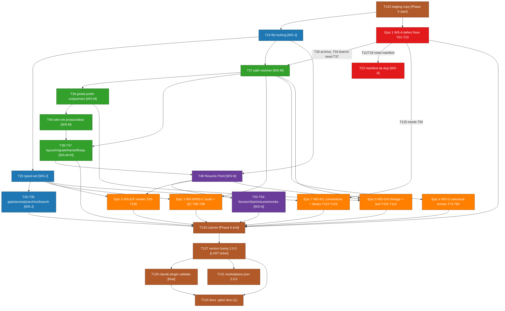

# EDMV2 Ticket Pack

Generated From: srd.md v1.0.7

EDMV2 is a meta-initiative that uses EDM to improve the `edm-ai-development` Claude Code plugin (v1.3.0 -> v2.0.0). This pack decomposes the 112-requirement SRD (110 numbered requirements EDMV2-01..EDMV2-110, of which all in-scope requirements map to tickets below) into 130 developer-ready tickets across 8 epics and 13 workstreams. All Phase 6 implementation work lands in the staging copy `plugins/edm-ai-development-staging/` per constraint C-5 (EDMV2-109); the live `plugins/edm-ai-development/` is untouched until a single cutover step (EDMV2-T133).

---

## Legend

### Size

| Size | Effort | Points |
|---|---|---|
| XS | < 1d (often < 1h for this corpus) | 1 |
| S | 1-3d | 2-3 |
| M | 3-5d | 5 |
| L | 1-2wk | 8-13 |
| XL | DECOMPOSE (not permitted) | n/a |

### Priority

| Priority | Meaning |
|---|---|
| Must | Required for v2.0.0; blocks completion if unmet |
| Should | High-value; included unless explicitly deferred |
| Could | Nice-to-have; path conventions only where deferred |

### Workstream (WS code -> name)

| WS | Workstream Name | SRD Section |
|---|---|---|
| WS-A | Correctness and Consistency Defects (G1-G18) | 4.1 |
| WS-B | Audit Convergence | 4.2 |
| WS-C | QC Scale + Verdict Fidelity | 4.3 |
| WS-D | Canonical Artifact Homes | 4.4 |
| WS-E | Adaptation Modes | 4.5 |
| WS-F | Lifecycle Modes | 4.6 |
| WS-G | Product-Line / Multi-Initiative Linkage | 4.7 |
| WS-H | Multi-Stack / Multi-Epic Test Support | 4.8 |
| WS-J | State Integrity and Determinism | 4.10 |
| WS-K | Convention Enforcement | 4.11 |
| WS-L | Living Audit Pattern Library | 4.12 |
| WS-M | Initiative Directory Structure | 4.13 |
| WS-N | Compaction Resilience | 4.9 |
| Release | Cross-cutting v2.0.0 ship requirements | 4.14 |

WS-I is intentionally excluded from the v2.0.0 scope (see SRD). Ticket IDs are cross-referenced throughout as `EDMV2-T{NN}`.

### Reserved ticket numbers

Eight ticket numbers are intentionally reserved-and-unused to preserve block ordering. They are not defects and not orphans:

- `EDMV2-T31` — reserved (EDMV2-72 current_phase/HANDOFF consistency is delivered solely by EDMV2-T28).
- `EDMV2-T49` — reserved (Resume-Point freshness is delivered jointly by EDMV2-T48 + EDMV2-T28).
- `EDMV2-T55` — Epic 2 / Epic 3 boundary reserve; no requirement mapped to this range.
- `EDMV2-T69` — Epic 3 / Epic 4 boundary reserve; WS-B/C covered in T56-T68 and WS-D starts at T73.
- `EDMV2-T70` — Epic 3 / Epic 4 boundary reserve; WS-B/C covered in T56-T68 and WS-D starts at T73.
- `EDMV2-T71` — Epic 3 / Epic 4 boundary reserve; WS-B/C covered in T56-T68 and WS-D starts at T73.
- `EDMV2-T72` — Epic 3 / Epic 4 boundary reserve; WS-B/C covered in T56-T68 and WS-D starts at T73.
- `EDMV2-T87` — reserved (mini-SRD decomposed into EDMV2-T86 + EDMV2-T88; EDMV2-45 fully covered).

---

## Cross-Cutting Requirements

Every ticket in this pack must satisfy these constraints (SRD section 5.6, constraints C-1..C-5):

- **Staging-only (C-5 / EDMV2-109):** all Phase 6 edits land in `plugins/edm-ai-development-staging/`; `git diff plugins/edm-ai-development/` must stay empty until the single cutover (EDMV2-T133).
- **ASCII-only (C-1 / EDMV2-21, EDMV2-75):** no Unicode glyphs in any emitted/committed artifact; use `[present]`/`[absent]`, `(!)`, `->`, `--`.
- **No AI-attribution (C-1 / EDMV2-74):** no `Co-Authored-By`, `Generated with`, or tool-branded trailers in committed content.
- **POSIX bash (C-3):** all `bin/` script changes are `#!/usr/bin/env bash`, pass `bash -n`, use `jq` for JSON (and optional `git`); no new external dependency (C-2).
- **Additive + defaulted (C-4 / EDMV2-90):** state-schema changes are additive with safe defaults; v1.x state files and flat-layout initiatives keep working.
- **Verification (C-2):** each new/changed `bin/edm-state` path carries a bash unit check; `claude plugin validate` passes (EDMV2-101); the repo has no CI, so sandbox runs + bash checks are the verification mechanism.
- **Gitmoji shortcodes only** for any commit emitted by the plugin; git calls run as separate parallel Bash calls, never `git add -A`/`.` (C-1).

---

## Ticket Index

### Epic 1 — WS-A: Correctness and Consistency Defects (23 tickets)

| Ticket | Epic | Workstream | Title | Priority | Size | Depends On |
|---|---|---|---|---|---|---|
| EDMV2-T01 | 1 | WS-A | Grant the Write tool to edm-test-coverage-auditor | Must | XS | - |
| EDMV2-T02 | 1 | WS-A | Add a coverage-auditor write-permission regression check | Must | S | T01 |
| EDMV2-T03 | 1 | WS-A | Reconcile /edm:metrics skill claims with metrics-report | Must | S | T04 |
| EDMV2-T04 | 1 | WS-A | Implement gate_review_seconds in metrics-report | Should | M | - |
| EDMV2-T05 | 1 | WS-A | Unify the Phase-1 planning template across plan/orchestrator | Must | M | - |
| EDMV2-T06 | 1 | WS-A | Harden write_handoff_internal Decisions-Made parsing | Must | S | T05 |
| EDMV2-T07 | 1 | WS-A | Remove or fulfill the CHANGELOG example-block claim | Must | S | - |
| EDMV2-T08 | 1 | WS-A | Make /edm:plan write HANDOFF.md after planning.md | Must | XS | T05 |
| EDMV2-T09 | 1 | WS-A | Route SRD versioning through the srd-version subcommand | Must | S | - |
| EDMV2-T10 | 1 | WS-A | Reconcile record-task-duration docs with no-op behavior | Must | M | - |
| EDMV2-T11 | 1 | WS-A | Parameterize push-jira MCP namespace via userConfig | Must | M | T22 |
| EDMV2-T12 | 1 | WS-A | push-jira graceful skip when Jira MCP unavailable | Must | S | T11 |
| EDMV2-T13 | 1 | WS-A | Unify the severity vocabulary across all audit agents | Must | L | - |
| EDMV2-T14 | 1 | WS-A | Make the 11-lens code audit a mandatory orchestrated phase | Must | M | T15 |
| EDMV2-T15 | 1 | WS-A | Code-audit phase gating in .edm-state.json | Must | M | - |
| EDMV2-T16 | 1 | WS-A | Parse and honor the --dry-run flag in push-jira | Should | S | T11 |
| EDMV2-T17 | 1 | WS-A | Resolve the --fill-gaps contradiction (test vs CLAUDE.md) | Must | XS | - |
| EDMV2-T18 | 1 | WS-A | Reconcile prefix validation regex with documented format | Must | S | T22 |
| EDMV2-T19 | 1 | WS-A | Fix the stale next-step message in edm-init | Should | XS | - |
| EDMV2-T20 | 1 | WS-A | Scope the Bash entry in skill allowed-tools | Should | M | - |
| EDMV2-T21 | 1 | WS-A | Remove Unicode glyphs from generated artifacts (edm-state) | Must | S | - |
| EDMV2-T22 | 1 | WS-A | De-duplicate plugin.json and fix README install paths | Must | M | - |
| EDMV2-T23 | 1 | WS-A | Resolve scaffold asymmetry edm-init vs later phases | Could | M | T19, T15 |

### Epic 2 — Foundation Plumbing: WS-J / WS-M / WS-N (29 tickets; T31 reserved)

| Ticket | Epic | Workstream | Title | Priority | Size | Depends On |
|---|---|---|---|---|---|---|
| EDMV2-T24 | 2 | WS-J | Add advisory file locking to all state writes | Must | M | - |
| EDMV2-T25 | 2 | WS-J | Add typed-set path for boolean/number/timestamp fields | Must | M | T24 |
| EDMV2-T26 | 2 | WS-J | Gate false-positive fix -- free-text is never approval | Must | S | - |
| EDMV2-T27 | 2 | WS-J | Deterministic script-backed gate enforcement hook | Must | M | T24 |
| EDMV2-T28 | 2 | WS-J | current_phase / HANDOFF consistency | Should | S | T24 |
| EDMV2-T29 | 2 | WS-J | State-anomaly guards (detection rules) | Must | M | T25 |
| EDMV2-T30 | 2 | WS-J | Git-aware archive with three-case completion gating | Must | M | T25, T37 |
| EDMV2-T32 | 2 | WS-J | edm-state validate subcommand | Must | S | T29 |
| EDMV2-T33 | 2 | WS-J | Read-side type coercion for legacy stringified fields | Must | S | T25 |
| EDMV2-T34 | 2 | WS-J | Initiative branch creation + per-gate artifact commits | Must | L | T25, T39 |
| EDMV2-T35 | 2 | WS-J | Simultaneous-initiative detection + branch-mismatch block | Must | M | T34 |
| EDMV2-T36 | 2 | WS-J | Stale git lock detection and remediation | Must | M | - |
| EDMV2-T37 | 2 | WS-M | state_file_for() state-derived path resolution | Must | M | T24 |
| EDMV2-T38 | 2 | WS-M | New canonical directory layout documented and adopted | Must | S | T37 |
| EDMV2-T39 | 2 | WS-M | Global prefix uniqueness across all products | Must | M | T37 |
| EDMV2-T40 | 2 | WS-M | edm-init accepts --product/--description, writes to state | Must | M | T37, T39 |
| EDMV2-T41 | 2 | WS-M | edm-validate-prefix product-aware invocation from edm-init | Must | S | T39, T40 |
| EDMV2-T42 | 2 | WS-M | migrate-path helper for opt-in relocation | Must | M | T37, T40 |
| EDMV2-T43 | 2 | WS-M | Surface product_name/description in list/metrics/handoff | Should | S | T40 |
| EDMV2-T44 | 2 | WS-M | Route HANDOFF artifact paths through directory resolver | Must | M | T37 |
| EDMV2-T45 | 2 | WS-M | Mode-aware scaffold + corrected next-step msg in edm-init | Should | S | T40 |
| EDMV2-T46 | 2 | WS-N | current_step state field (lazy, null-default) | Must | XS | T24 |
| EDMV2-T47 | 2 | WS-N | current-step subcommand (write + read) | Must | S | T46 |
| EDMV2-T48 | 2 | WS-N | Resume Point section in HANDOFF, populated from state | Must | M | T44, T47 |
| EDMV2-T50 | 2 | WS-N | SessionStart injects Resume Point for active initiatives | Must | M | T48 |
| EDMV2-T51 | 2 | WS-N | Orchestrator resume branch reads current_step | Must | S | T47 |
| EDMV2-T52 | 2 | WS-N | Capture last_cmd and last_decision at step boundaries | Should | S | T47, T48 |
| EDMV2-T53 | 2 | WS-N | PreCompact captures current_step / Resume Point freshness | Should | S | T48, T47 |
| EDMV2-T54 | 2 | WS-N | WS-N integration smoke check (compaction recovery e2e) | Should | S | T47, T48, T50, T51 |

> Reserved in Epic 2: **EDMV2-T31** (EDMV2-72 -> T28 alone) and **EDMV2-T49** (Resume-Point freshness -> T48 + T28). Both intentionally omitted.

### Epic 3 — WS-B Audit Convergence + WS-C QC Scale (13 tickets)

| Ticket | Epic | Workstream | Title | Priority | Size | Depends On |
|---|---|---|---|---|---|---|
| EDMV2-T56 | 3 | WS-B | audit-round-start subcommand + audit_rounds counter | Must | S | T25, T24, T37 |
| EDMV2-T57 | 3 | WS-B | Round/pass-indexed code-audit directory layout | Must | S | T56 |
| EDMV2-T58 | 3 | WS-B | Persistent cross-round findings ledger with stable IDs | Must | M | T57, T63 |
| EDMV2-T59 | 3 | WS-B | Convergence gate for the code-audit loop | Must | M | T58, T60, T25, T15 |
| EDMV2-T60 | 3 | WS-B | Stable lens set + per-round lens recording | Must | S | T57, T58 |
| EDMV2-T61 | 3 | WS-B | Version-drift detection between audit and audited artifact | Must | M | T56, T09 |
| EDMV2-T62 | 3 | WS-B | Scoped re-audit support (--lenses subset) | Should | S | T57, T58, T60 |
| EDMV2-T63 | 3 | WS-B | Findings-ledger canonical home | Should | XS | T58 |
| EDMV2-T64 | 3 | WS-C | QC sharding for large ticket sets | Must | M | T65, T129 |
| EDMV2-T65 | 3 | WS-C | Canonical QC artifact home | Must | S | T37 |
| EDMV2-T66 | 3 | WS-C | PASS/PARTIAL/FAIL verdicts with deferred-to-runtime | Must | S | T65 |
| EDMV2-T67 | 3 | WS-C | record-partial-verdict subcommand + HANDOFF rendering | Must | M | T66, T24, T48 |
| EDMV2-T68 | 3 | WS-C | QC sharding hook coordination (SubagentStop) | Should | S | T64, T65, T66, T67 |

### Epic 4 — WS-D: Canonical Artifact Homes (10 tickets)

| Ticket | Epic | Workstream | Title | Priority | Size | Depends On |
|---|---|---|---|---|---|---|
| EDMV2-T73 | 4 | WS-D | Shared state-derived initiative-directory resolver | Must | S | T37 |
| EDMV2-T74 | 4 | WS-D | Canonical architecture-doc home (architecture.md) | Must | S | T73 |
| EDMV2-T75 | 4 | WS-D | Explorer-findings home (explorers/) + synthesis step | Must | M | T73 |
| EDMV2-T76 | 4 | WS-D | Decision/audit ledger artifact (decisions.md) | Must | M | T73 |
| EDMV2-T77 | 4 | WS-D | Rollback-runbook artifact slot (ROLLBACK.md) | Should | S | T73 |
| EDMV2-T78 | 4 | WS-D | Execution-report artifact slot (exec-report.md) + mode | Should | M | T73 |
| EDMV2-T79 | 4 | WS-D | Post-deploy verification + analysis-input slots | Could | S | T73 |
| EDMV2-T80 | 4 | WS-D | edm-init scaffold creates always-present WS-D slots | Must | S | T75, T76, T73 |
| EDMV2-T81 | 4 | WS-D | Render WS-D slots in HANDOFF, reference ledger | Must | M | T73, T74, T76, T77, T78 |
| EDMV2-T82 | 4 | WS-D | Document all WS-D canonical homes in CLAUDE.md | Must | S | T74-T79 |

### Epic 5 — WS-E Adaptation Modes + WS-F Lifecycle Modes (17 tickets; T87 reserved)

| Ticket | Epic | Workstream | Title | Priority | Size | Depends On |
|---|---|---|---|---|---|---|
| EDMV2-T83 | 5 | WS-E/F | set-mode subcommand + four mode state fields | Must | M | T25, T24 |
| EDMV2-T84 | 5 | WS-E/F | Mode-selection step + mode-branch dispatch (orchestrator) | Must | M | T83 |
| EDMV2-T85 | 5 | WS-E/F | WS-E/F userConfig keys + mode-family schema docs | Must | S | T83, T22 |
| EDMV2-T86 | 5 | WS-E | mini-SRD mode -- fused-artifact state/scaffold contract | Must | M | T83, T37 |
| EDMV2-T88 | 5 | WS-E | mini-SRD mode -- orchestrator fused-flow + audit | Must | M | T84, T86 |
| EDMV2-T89 | 5 | WS-E | IaC profile -- resource-path vocab + terraform-plan QC | Must | M | T84 |
| EDMV2-T90 | 5 | WS-E | Data/ML profile -- Data Requirements section + metric QC | Must | M | T84 |
| EDMV2-T91 | 5 | WS-E | Compliance review gate (Gate 3.5) + traceability columns | Must | M | T83, T84 |
| EDMV2-T92 | 5 | WS-E | Prototype path -- Phases 1-2 only with clean stop | Must | S | T84, T96 |
| EDMV2-T93 | 5 | WS-E | TDD implementation mode -- Red-Green-Refactor implementer | Should | L | T83, T84 |
| EDMV2-T94 | 5 | WS-E | TDD implementation mode -- QC per-ticket compliance pass | Should | M | T93 |
| EDMV2-T95 | 5 | WS-E | Mode-aware scaffold in edm-init for all profiles | Should | M | T83, T86, T37 |
| EDMV2-T96 | 5 | WS-F | First-class phase-skip -- skipped_phases + gate-skip | Must | M | T83, T48 |
| EDMV2-T97 | 5 | WS-F | Fast-track / fix-pack lifecycle -- tickets-from-analysis | Must | M | T83, T96 |
| EDMV2-T98 | 5 | WS-F | Supersede / fork provenance (supersedes/forked_from) | Must | S | T83, T48 |
| EDMV2-T99 | 5 | WS-F | Lifecycle-mode, skipped-phases, provenance in HANDOFF | Should | M | T48, T96, T98, T83 |
| EDMV2-T100 | 5 | WS-E/F | WS-E/F integration + mode-matrix sandbox checks | Must | S | T83-T99 |

> Reserved in Epic 5: **EDMV2-T87** (mini-SRD decomposed into T86 + T88; EDMV2-45 fully covered).

### Epic 6 — WS-G Product-Line Linkage + WS-H Multi-Stack Testing (12 tickets)

| Ticket | Epic | Workstream | Title | Priority | Size | Depends On |
|---|---|---|---|---|---|---|
| EDMV2-T101 | 6 | WS-G | parent_prefix/related_prefixes fields + bare-prefix resolve | Must | S | T37, T39, T42 |
| EDMV2-T102 | 6 | WS-G | set-parent and add-related edm-state subcommands | Must | S | T101 |
| EDMV2-T103 | 6 | WS-G | Surface parent/related linkage in SRD and HANDOFF | Must | S | T101, T102 |
| EDMV2-T104 | 6 | WS-G | Multiple custom-prefix ticket packs in one initiative dir | Should | M | T101, T42 |
| EDMV2-T105 | 6 | WS-G | Shared product baseline reference document (BASELINE.md) | Could | S | T37, T38 |
| EDMV2-T106 | 6 | WS-H | Per-epic / per-stack test plans in the test-plan layer | Must | M | T101, T42, T108 |
| EDMV2-T107 | 6 | WS-H | Per-epic coverage reporting in the coverage layer | Must | M | T106 |
| EDMV2-T108 | 6 | WS-H | Per-epic stack auto-detection in edm-test-planner | Must | M | T101 |
| EDMV2-T109 | 6 | WS-H | Remove stale N/A coverage behavior (absence authoritative) | Should | S | T106, T107 |
| EDMV2-T110 | 6 | WS-G/H | Document WS-G/WS-H conventions in CLAUDE.md + docs | Should | S | T101, T104, T105, T106, T107 |
| EDMV2-T111 | 6 | WS-G | WS-G linkage integration sandbox check | Must | S | T101, T102, T103 |
| EDMV2-T112 | 6 | WS-H | WS-H multi-stack test-layer integration sandbox check | Must | S | T106, T107, T108, T109 |

### Epic 7 — WS-K Convention Enforcement + WS-L Living Pattern Library (14 tickets)

| Ticket | Epic | Workstream | Title | Priority | Size | Depends On |
|---|---|---|---|---|---|---|
| EDMV2-T113 | 7 | WS-K | Strip AI-attribution trailers from templates and PR bodies | Must | S | - |
| EDMV2-T114 | 7 | WS-K | Make all generated artifacts/templates ASCII-only | Must | S | - |
| EDMV2-T115 | 7 | WS-K | Build the artifact lint script (attribution/Unicode/tags) | Must | M | T113, T114 |
| EDMV2-T116 | 7 | WS-K | Wire the artifact lint into a hook (pre-commit surface) | Should | S | T115 |
| EDMV2-T117 | 7 | WS-K | Own size legend + cross-cutting-AC block as shared template | Must | S | - |
| EDMV2-T118 | 7 | WS-K | Build the two-lane ticket audit into the flow | Must | M | T117 |
| EDMV2-T119 | 7 | WS-L | Validate seed pattern library + document living contract | Must | S | - |
| EDMV2-T120 | 7 | WS-L | Auto-update the pattern library after each audit round | Must | M | T119, T121 |
| EDMV2-T121 | 7 | WS-L | Add the update-patterns subcommand to edm-state | Must | M | T119 |
| EDMV2-T122 | 7 | WS-L | Load SRD-audit patterns into the SRD-writer prompt | Must | S | T119 |
| EDMV2-T123 | 7 | WS-L | Load ticket-audit patterns into the ticket-writer prompt | Must | S | T119, T117 |
| EDMV2-T124 | 7 | WS-L | Load QC/code-audit patterns into the implementer prompt | Must | S | T119 |
| EDMV2-T125 | 7 | WS-L | Add pattern-derived pre-emption to the planning template | Should | S | T119 |
| EDMV2-T126 | 7 | WS-L/K | Verify end-to-end living-feedback loop + lint in sandbox | Must | S | T120, T121, T122, T123, T124, T116 |

### Epic 8 — Release (8 tickets)

| Ticket | Epic | Workstream | Title | Priority | Size | Depends On |
|---|---|---|---|---|---|---|
| EDMV2-T127 | 8 | Release | Bump plugin version to 2.0.0 + CHANGELOG 2.0.0 entry | Must | S | ALL prior tickets (T128 excepted) |
| EDMV2-T128 | 8 | Release | Confirm claude plugin validate passes on modified plugin | Must | S | T127 |
| EDMV2-T129 | 8 | Release | Define new userConfig keys with safe defaults | Must | S | WS-E/C/A consumers |
| EDMV2-T130 | 8 | Release | Record + verify self-hosting-safe ticket sequencing | Must | XS | foundation epics |
| EDMV2-T131 | 8 | Release | Bump marketplace.json edm-ai-development entry to 2.0.0 | Must | XS | T127, T133 |
| EDMV2-T132 | 8 | Release | Auto-backup .edm-state.json before any state mutation | Must | M | T24 |
| EDMV2-T133 | 8 | Release | Create plugin staging copy + single-step cutover | Must | M | Gate 3 approval (brackets Phase 6) |
| EDMV2-T134 | 8 | Release | Update .pptx and .docx user docs to v2.0.0 | Must | L | T127, T22 (README) |

---

## Critical Path

The blocking chain runs from the Epic 2 foundation through the consumer epics to release. WS-J locking (T24) and the WS-M path resolver (T37) are the substrate everything rides on; T127 (version bump) is the last substantive ticket and T128 (validate) is the final verification. T133 brackets all of Phase 6 (staging at start, cutover at end).

---

## Epics Summary

| Epic | File | Workstreams | Active Tickets |
|---|---|---|---|
| 1 | [epics/01-defect-remediation.md](epics/01-defect-remediation.md) | WS-A | 23 |
| 2 | [epics/02-foundation-plumbing.md](epics/02-foundation-plumbing.md) | WS-J, WS-M, WS-N | 29 |
| 3 | [epics/03-audit-convergence-qc.md](epics/03-audit-convergence-qc.md) | WS-B, WS-C | 13 |
| 4 | [epics/04-canonical-homes.md](epics/04-canonical-homes.md) | WS-D | 10 |
| 5 | [epics/05-adaptation-lifecycle-modes.md](epics/05-adaptation-lifecycle-modes.md) | WS-E, WS-F | 17 |
| 6 | [epics/06-product-line-testing.md](epics/06-product-line-testing.md) | WS-G, WS-H | 12 |
| 7 | [epics/07-convention-patterns.md](epics/07-convention-patterns.md) | WS-K, WS-L | 14 |
| 8 | [epics/08-release.md](epics/08-release.md) | Release | 8 |
| **Total** | | **13 workstreams** | **126** |

(T31, T49, T55, T69, T70, T71, T72, T87 are reserved-and-unused; the highest ticket number is T134.)

---

## Self-hosting sequencing (EDMV2-103)

WS-M (directory layout), WS-N (compaction resilience), and WS-J (state integrity) are sequenced foundation-first in Epic 2, ahead of every path-consuming (WS-D, WS-G) and state-consuming (WS-E, WS-C, WS-N) ticket. Every artifact-path ticket depends transitively on the WS-M resolver (EDMV2-T37); every new state consumer depends transitively on the relevant WS-J ticket. The dependency graph above is acyclic (a topological order exists). This logical ordering is the **secondary** self-hosting safeguard; the **primary** C-5 protection is the staging copy (EDMV2-T133 / EDMV2-109), with `.edm-state.json` auto-backup (EDMV2-T132) as the recovery layer.

---

## SRD Coverage Map

Every numbered SRD requirement maps to at least one ticket; every ticket maps to at least one requirement. EDMV2-106, EDMV2-107, and EDMV2-108 appear in both their workstream epic and the release epic narrative; their **canonical home** (the ticket that owns implementation) is marked below, with the release epic only referencing them (no double-coverage).

| SRD Req | Description | Ticket(s) | Epic | Priority |
|---|---|---|---|---|
| EDMV2-01 | Grant Write to test-coverage-auditor | T01 | 1 | Must |
| EDMV2-02 | Coverage-auditor write regression check | T02 | 1 | Must |
| EDMV2-03 | Reconcile /edm:metrics skill claims | T03 | 1 | Must |
| EDMV2-04 | Implement gate_review_seconds | T04 | 1 | Should |
| EDMV2-05 | Unify Phase-1 planning template | T05 | 1 | Must |
| EDMV2-06 | Harden Decisions-Made parsing | T06 | 1 | Must |
| EDMV2-07 | CHANGELOG example-block claim | T07 | 1 | Must |
| EDMV2-08 | /edm:plan writes HANDOFF.md | T08 | 1 | Must |
| EDMV2-09 | Route SRD versioning via srd-version | T09 | 1 | Must |
| EDMV2-10 | Reconcile record-task-duration docs | T10 | 1 | Must |
| EDMV2-11 | Parameterize push-jira MCP namespace | T11 | 1 | Must |
| EDMV2-12 | push-jira graceful skip | T12 | 1 | Must |
| EDMV2-13 | Unify severity vocabulary | T13 | 1 | Must |
| EDMV2-14 | Mandatory orchestrated code audit | T14 | 1 | Must |
| EDMV2-15 | Code-audit phase gating in state | T15 (canonical), referenced by T30, T59 | 1 | Must |
| EDMV2-16 | --dry-run flag in push-jira | T16 | 1 | Should |
| EDMV2-17 | --fill-gaps contradiction | T17 | 1 | Must |
| EDMV2-18 | Prefix regex vs documented format | T18 | 1 | Must |
| EDMV2-19 | Stale next-step message in edm-init | T19 (canonical), referenced by T45 | 1 | Should |
| EDMV2-20 | Scope Bash in skill allowed-tools | T20 | 1 | Should |
| EDMV2-21 | Remove Unicode from edm-state artifacts | T21 | 1 | Must |
| EDMV2-22 | De-duplicate plugin.json + README paths | T22 | 1 | Must |
| EDMV2-23 | Scaffold asymmetry edm-init | T23 (canonical), referenced by T80 | 1 | Could |
| EDMV2-24 | Round/pass-indexed code-audit layout | T57 (+ T56 counter source) | 3 | Must |
| EDMV2-25 | audit-round-start + audit_rounds counter | T56 | 3 | Must |
| EDMV2-26 | Persistent cross-round findings ledger | T58 | 3 | Must |
| EDMV2-27 | Convergence gate for code-audit loop | T59 | 3 | Must |
| EDMV2-28 | Stable lens set + per-round recording | T60 | 3 | Must |
| EDMV2-29 | Version-drift detection (SRD/ticket audit) | T61 | 3 | Must |
| EDMV2-30 | Scoped re-audit (--lenses) | T62 | 3 | Should |
| EDMV2-31 | Findings-ledger canonical home | T63 | 3 | Should |
| EDMV2-32 | QC sharding for large ticket sets | T64 | 3 | Must |
| EDMV2-33 | Canonical QC artifact home | T65 | 3 | Must |
| EDMV2-34 | PASS/PARTIAL/FAIL deferred-to-runtime | T66 | 3 | Must |
| EDMV2-35 | record-partial-verdict subcommand | T67 | 3 | Must |
| EDMV2-36 | PARTIAL preservation in HANDOFF | T67 | 3 | Must |
| EDMV2-37 | QC sharding hook coordination | T68 | 3 | Should |
| EDMV2-38 | Canonical architecture.md home | T74 (+ T73, T82) | 4 | Must |
| EDMV2-39 | Explorer-findings home (explorers/) | T75 (+ T73, T80, T82) | 4 | Must |
| EDMV2-40 | Decision/audit ledger (decisions.md) | T76 (+ T73, T80, T81, T82) | 4 | Must |
| EDMV2-41 | Rollback-runbook slot (ROLLBACK.md) | T77 (+ T81, T82) | 4 | Should |
| EDMV2-42 | Execution-report slot (exec-report.md) | T78 (+ T81, T82) | 4 | Should |
| EDMV2-43 | Post-deploy + analysis-input slots | T79 (+ T82) | 4 | Could |
| EDMV2-44 | Mode concept in state + orchestrator | T83 + T84 (+ T100 verify) | 5 | Must |
| EDMV2-45 | mini-SRD mode | T86 + T88 | 5 | Must |
| EDMV2-46 | Compliance review gate (Gate 3.5) | T91 | 5 | Must |
| EDMV2-47 | IaC adaptation profile | T89 | 5 | Must |
| EDMV2-48 | Data/ML adaptation profile | T90 | 5 | Must |
| EDMV2-49 | Prototype path (Phases 1-2) | T92 | 5 | Must |
| EDMV2-50 | Mode-selection UX | T84 | 5 | Should |
| EDMV2-51 | Mode-aware scaffold | T95 (+ T45, T86) | 5 | Should |
| EDMV2-52 | First-class phase-skip | T96 | 5 | Must |
| EDMV2-53 | Fast-track / fix-pack lifecycle | T97 | 5 | Must |
| EDMV2-54 | Supersede / fork provenance | T98 | 5 | Must |
| EDMV2-55 | set-mode subcommand | T83 (+ T100 verify) | 5 | Must |
| EDMV2-56 | Lifecycle-mode HANDOFF rendering | T99 | 5 | Should |
| EDMV2-57 | parent_prefix/related_prefixes fields | T101 (+ T110, T111) | 6 | Must |
| EDMV2-58 | set-parent / add-related subcommands | T102 (+ T111) | 6 | Must |
| EDMV2-59 | Surface linkage in SRD and HANDOFF | T103 (+ T111) | 6 | Must |
| EDMV2-60 | Multiple custom-prefix ticket packs | T104 (+ T110) | 6 | Should |
| EDMV2-61 | Shared product baseline (BASELINE.md) | T105 (+ T110) | 6 | Could |
| EDMV2-62 | Per-epic / per-stack test plans | T106 (+ T110, T112) | 6 | Must |
| EDMV2-63 | Per-epic coverage reporting | T107 (+ T110, T112) | 6 | Must |
| EDMV2-64 | Per-epic stack auto-detection | T108 (+ T112) | 6 | Must |
| EDMV2-65 | Remove stale N/A coverage behavior | T109 (+ T112) | 6 | Should |
| EDMV2-66 | Deterministic gate enforcement hook | T27 | 2 | Must |
| EDMV2-67 | Gate false-positive (free-text != approval) | T26 | 2 | Must |
| EDMV2-68 | Typed-set + read-side coercion | T25 + T33 | 2 | Must |
| EDMV2-69 | State-anomaly detection rules | T29 | 2 | Must |
| EDMV2-70 | Advisory file locking on state writes | T24 | 2 | Must |
| EDMV2-71 | Git-aware archive | T30 | 2 | Must |
| EDMV2-72 | current_phase / HANDOFF consistency | T28 (T31 reserved) | 2 | Should |
| EDMV2-73 | edm-state validate subcommand | T32 (+ T97 allow-list) | 2 | Must |
| EDMV2-74 | Strip AI-attribution trailers | T113 | 7 | Must |
| EDMV2-75 | ASCII-only generated artifacts (plugin-wide) | T114 | 7 | Must |
| EDMV2-76 | Artifact lint script | T115 | 7 | Must |
| EDMV2-77 | Shared size legend + cross-cutting-AC | T117 | 7 | Must |
| EDMV2-78 | Two-lane ticket audit | T118 | 7 | Must |
| EDMV2-79 | Wire artifact lint into a hook | T116 | 7 | Should |
| EDMV2-80 | Validate seed pattern library + contract | T119 | 7 | Must |
| EDMV2-80a | Auto-update pattern library after audit | T120 (+ T126 verify) | 7 | Must |
| EDMV2-80b | update-patterns subcommand | T121 (+ T126 verify) | 7 | Must |
| EDMV2-81 | Load SRD-audit patterns into SRD-writer | T122 (+ T126 verify) | 7 | Must |
| EDMV2-82 | Load ticket-audit patterns into ticket-writer | T123 (+ T126 verify) | 7 | Must |
| EDMV2-83 | Load QC/code-audit patterns into implementer | T124 (+ T126 verify) | 7 | Must |
| EDMV2-84 | Pattern pre-emption in planning template | T125 | 7 | Should |
| EDMV2-85 | New canonical directory layout | T38 (+ T37 code) | 2 | Must |
| EDMV2-86 | edm-init --product/--description | T40 (+ T41) | 2 | Must |
| EDMV2-87 | Global prefix uniqueness | T39 (+ T41) | 2 | Must |
| EDMV2-88 | State-derived path construction | T37 + T44 (+ T73) | 2 | Must |
| EDMV2-89 | migrate-path helper | T42 | 2 | Must |
| EDMV2-90 | Backward-compatible flat layout | T37 (resolver fallback) | 2 | Must |
| EDMV2-91 | Surface product/description in list/metrics/handoff | T43 (+ T40 seed) | 2 | Should |
| EDMV2-92 | current_step state field | T46 (+ T54 smoke) | 2 | Must |
| EDMV2-93 | current-step subcommand | T47 (+ T54 smoke) | 2 | Must |
| EDMV2-94 | Resume Point section in HANDOFF | T48 (+ T54 smoke) | 2 | Must |
| EDMV2-95 | Resume Point derived from state | T48 (+ T54 smoke) | 2 | Must |
| EDMV2-96 | SessionStart injects Resume Point | T50 (+ T54 smoke) | 2 | Must |
| EDMV2-97 | Orchestrator resume reads current_step | T51 (+ T54 smoke; T49 reserved) | 2 | Must |
| EDMV2-98 | Capture last_cmd / last_decision | T52 | 2 | Should |
| EDMV2-99 | PreCompact Resume Point freshness | T53 | 2 | Should |
| EDMV2-100 | Version bump to 2.0.0 + CHANGELOG | T127 | 8 | Must |
| EDMV2-101 | claude plugin validate passes | T128 | 8 | Must |
| EDMV2-102 | New userConfig keys with defaults | T129 (+ slices T11, T64, T85) | 8 | Must |
| EDMV2-103 | Self-hosting-safe ticket sequencing | T130 | 8 | Must |
| EDMV2-104 | marketplace.json bump to 2.0.0 | T131 | 8 | Must |
| EDMV2-105 | Auto-backup .edm-state.json | T132 | 8 | Must |
| EDMV2-106 | TDD implementation mode | **T93 + T94 (canonical, Epic 5)**; referenced by T129/T134 | 5 | Should |
| EDMV2-107 | Branch isolation / per-gate commits | **T34 + T35 (canonical, Epic 2/WS-J)**; referenced by T134 | 2 | Must |
| EDMV2-108 | Stale git lock remediation | **T36 (canonical, Epic 2/WS-J)**; referenced by T116/T134 | 2 | Must |
| EDMV2-109 | Plugin staging copy + cutover | T133 (+ cross-cutting in every ticket) | 8 | Must |
| EDMV2-110 | Update .pptx / .docx user docs to 2.0.0 | T134 | 8 | Must |

No orphan requirements; no orphan tickets.

---

## Initiative Summary

### Totals

- **Total active tickets: 126** (T01-T134 minus eight reserved numbers: T31, T49, T55, T69, T70, T71, T72, T87; the index runs T01-T23, T24-T54 less T31/T49, T56-T68, T73-T134 less T87).
- **Requirements covered: 110** numbered SRD requirements (EDMV2-01..EDMV2-110, plus EDMV2-80a/80b), with the 112-requirement total reflecting sub-lettered items.

### Tickets by epic

| Epic | Workstreams | Tickets |
|---|---|---|
| 1 | WS-A | 23 |
| 2 | WS-J, WS-M, WS-N | 29 |
| 3 | WS-B, WS-C | 13 |
| 4 | WS-D | 10 |
| 5 | WS-E, WS-F | 17 |
| 6 | WS-G, WS-H | 12 |
| 7 | WS-K, WS-L | 14 |
| 8 | Release | 8 |
| **Total** | | **126** |

### Tickets by size

| Size | Count | Per-ticket hours (est.) |
|---|---|---|
| XS | 8 | 0.5h |
| S | 60 | 2h |
| M | 54 | 5h |
| L | 4 | 12h |
| XL | 0 | (none — no XL permitted) |
| **Total** | **126** | |

### Estimated effort

Using XS = 0.5h, S = 2h, M = 5h, L = 12h:

- XS: 8 x 0.5h = 4h
- S: 60 x 2h = 120h
- M: 54 x 5h = 270h
- L: 4 x 12h = 48h
- **Mid-point total: ~442h** (approx. 55 engineer-days at 8h/day).
- **Low estimate (favorable, ~0.7x): ~309h**
- **High estimate (with QC re-rounds and audit churn, ~1.4x): ~619h**

### Workstreams covered

WS-A, WS-B, WS-C, WS-D, WS-E, WS-F, WS-G, WS-H, WS-J, WS-K, WS-L, WS-M, WS-N, plus the cross-cutting Release workstream (13 feature workstreams + Release; WS-I excluded from v2.0.0 scope).

### Gate

**Gate 3 approval is required before Phase 6 may begin.** Phase 6 opens with EDMV2-T133 (staging copy creation) and closes with EDMV2-T133 cutover followed by EDMV2-T127 (version bump) and EDMV2-T128 (validate). No live-plugin edits occur until cutover (C-5 / EDMV2-109).
