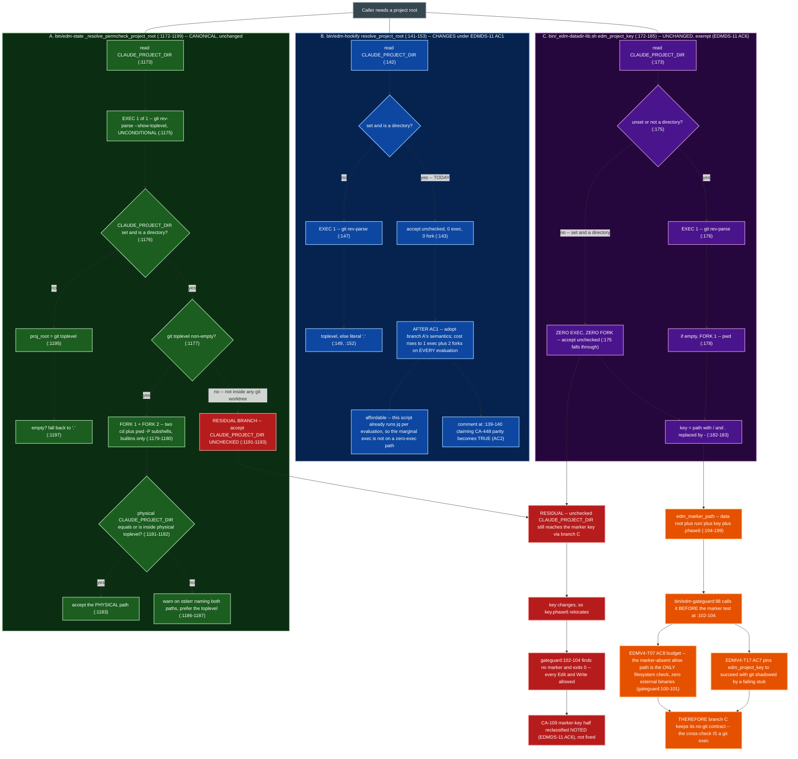
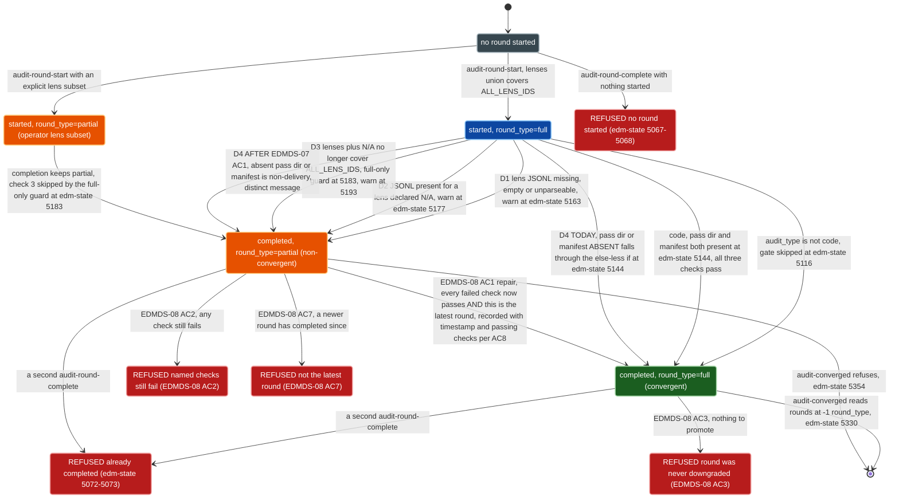
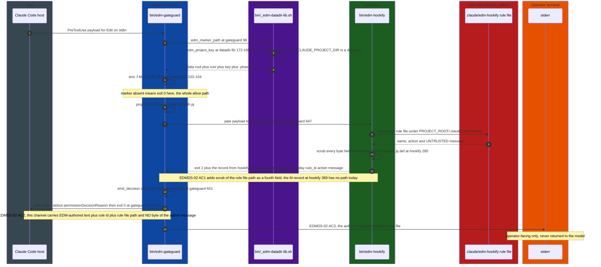

# Target Architecture: EDMDS

Companion to `srd.md` v1.1.0 Section 4. The SRD states the five decisions AD-DS1 through AD-DS5 in
prose; this file carries the two structures prose could not: the project-root resolver chain
(AD-DS2) and the code-audit round-record state machine (AD-DS3, EDMDS-07, EDMDS-08). It does not
restate the decisions -- it diagrams their consequences and names the component boundaries the
twenty-one requirements cut across.

Every code claim below carries a `file:line` citation re-derived against the working tree at the
time of writing. Where a claim could not be verified it is marked UNVERIFIED inline rather than
asserted.

## Architecture Decision

**Decision: remediate in place, at the existing seams, with the hook fast-path exec budget as the
binding constraint on convergence.** EDMDS introduces no new binary, no new process boundary and no
new state schema version. It introduces exactly one new file -- a small shared sanitizer library
(see below) -- and lands otherwise as edits to seven existing files plus the two smoke suites.

The one structural choice available was whether to converge the three project-root resolvers behind
a single shared function in `bin/_edm-datadir-lib.sh`, the library `bin/edm-gateguard` already
sources (`bin/edm-gateguard:89-91`). That is the obvious consolidation and it is rejected. The
canonical resolver's cross-check IS a `git rev-parse --show-toplevel`, unconditional, at
`bin/edm-state:1175`. `edm_project_key()` at `bin/_edm-datadir-lib.sh:172-185` spawns `git` only
when `CLAUDE_PROJECT_DIR` is unset or not a directory (`:175-176`), and it is reached from
`edm_marker_path()` (`bin/_edm-datadir-lib.sh:194-199`), which `bin/edm-gateguard:98` calls before
its marker test at `bin/edm-gateguard:102-104` -- the allow path whose own comment at
`bin/edm-gateguard:100-101` names it "the ONLY filesystem check when no initiative is in Phase 6".
Putting the cross-check in the shared library would put a `git` exec on that path for every Edit and
Write in every session.

**The accepted trade-off**: two of three resolvers converge, the third stays divergent, and the
divergence is named as a residual rather than closed. That is a worse architecture than one resolver
and a better one than a fast path that costs an exec. AD-DS4 supplies the second, independent reason
-- adopting canonical semantics inside `edm_project_key()` would rename `<key>.phase6` for any
project whose resolvers disagree, which is the marker-absent failure EDMDS-10 exists to fix,
delivered by upgrade.

Two smaller decisions follow from the same in-place posture:

- **The repair path (EDMDS-08) is a new `bin/edm-state` subcommand, not a flag on
  `audit-round-complete`.** `_cmd_audit_round_complete_body` refuses a second completion at
  `bin/edm-state:5072-5073` on a check that runs inside the single `with_state_lock` acquisition
  (see the comment at `bin/edm-state:5055-5056`). A flag would have to weaken that refusal for the
  repair case and the normal case indistinguishably. A separate subcommand leaves the refusal intact
  and narrows only its scope, which is what EDMDS-08 AC4 requires.
- **The ASCII sanitizer (EDMDS-14) is extracted into a NEW `bin/_edm-sanitize-lib.sh`, not into
  `bin/_edm-datadir-lib.sh`.** The three copies are `bin/edm-gateguard:213`, `bin/edm-hookify:226`
  and `bin/edm-stop-gate:123`, all carrying the identical character set
  `'\011\012\015\040-\176'` -- which confirms the SRD's correction of the finding's recorded five
  copies down to three, and confirms `bin/edm-bash-gate` has none (EDMDS-14 AC5). Only
  `bin/edm-gateguard` (`:89-91`) and `bin/edm-state` (`:74`) source `_edm-datadir-lib.sh` at all:
  `edm-hookify`, `edm-bash-gate` and `edm-stop-gate` source nothing today. **No option avoids adding
  a sourcing statement to two or three scripts**, so the question is only which library they take on.
  A dedicated sanitizer file has no data-directory resolution and no `git` fallback
  (`bin/_edm-datadir-lib.sh:176`), so a load failure there has exactly one consequence instead of
  pulling root resolution into two scripts that need neither. Load failure must be fail-closed on
  the untrusted half: each consumer checks `declare -F` for the sanitizer and, if absent, emits the
  EDM-authored label alone and drops the untrusted text, rather than emitting it unsanitized. That
  keeps the existing fail-open posture on the gate DECISION while refusing to fail open on the
  sanitizer itself. No new binary, so CC4 holds.

## Component Design

| Component | Path | Responsibility | Interface | Dependencies | Requirements |
|---|---|---|---|---|---|
| GateGuard | `plugins/edm/bin/edm-gateguard` | `PreToolUse` hook for Edit/Write/MultiEdit -- allows silently unless a Phase-6 marker exists, then enforces fact-forcing and evaluates `file`-event hookify rules | in: hook JSON on stdin, `EDM_GATEGUARD_DENY_MODE`, `EDM_GATEGUARD_STATE_DIR`. out: `json` mode stdout `hookSpecificOutput.permissionDecisionReason` + exit 0 (`:229-234`), or `exit-code` mode stderr + exit 2 (`:236-240`) | `_edm-datadir-lib.sh` (guarded, `:89-91`), `edm-hookify eval file` (`:647`), `jq`, `git` | EDMDS-02 AC2-AC7, EDMDS-04 AC5-AC6, EDMDS-14 AC4, EDMDS-16 AC1/AC3/AC4 |
| BashGate | `plugins/edm/bin/edm-bash-gate` | `PreToolUse` hook for Bash -- projects the command out of the payload and delegates to hookify's `bash` event | in: hook JSON on stdin. out: stderr + exit 2 on block (`:135-138`), exit 0 otherwise (`:139`) | `edm-hookify eval bash` (`:131`), `jq` (`:127`) | EDMDS-01 AC3, EDMDS-02 AC6, EDMDS-05 AC1-AC3, EDMDS-14 AC5, EDMDS-16 AC1/AC5 |
| StopGate | `plugins/edm/bin/edm-stop-gate` | `Stop` hook -- blocks session stop on a blocking `edm-state validate` anomaly or a matched `stop`-event rule, via the one labelled emitter | in: Stop payload on stdin, `stop_hook_active`. out: `stop_gate_emit_blocking <label> <text>` to stderr (`:120-124`), exit 2. Every internal error exits 0 (`soft_exit`, `:107-111`) | `edm-state validate`, `edm-hookify eval stop` | EDMDS-02 AC6 (confirm only, no change), EDMDS-04 AC3, EDMDS-16 AC1/AC5 |
| Hookify evaluator | `plugins/edm/bin/edm-hookify` | Discovers and evaluates project rule files, emitting one match record or one setup-error record per rule file | in: projected payload on stdin, `eval <bash\|file\|stop>`. out: `hookify_emit_match` (`:414`) prints `<rule_id> <action> <message>`. Exit ladder block 2 > error 1 (`:479`) > clean 0 | `jq`, `git`, rule files under `${PROJECT_ROOT}/.claude/edm-hookify` (`:155-156`) | EDMDS-01 AC1/AC2/AC4-AC7, EDMDS-02 AC1, EDMDS-11 AC1-AC5, EDMDS-16 AC1/AC5 |
| State layer | `plugins/edm/bin/edm-state` | Owns `.edm-state.json`, the round record, the completeness gate, marker reconciliation and the permission-rule resolver | subcommands `audit-round-start`, `audit-round-complete`, `audit-converged`, `session-start`, `validate`, `approve-gate`, `active-initiatives`, plus EDMDS-08's new repair subcommand and EDMDS-19's `migrate-data-dir` | `jq`, `git`, `_edm-datadir-lib.sh`, `with_state_lock` | EDMDS-06, EDMDS-07, EDMDS-08, EDMDS-09, EDMDS-10, EDMDS-11 AC1/AC3/AC5, EDMDS-12, EDMDS-19 |
| Data-directory library | `plugins/edm/bin/_edm-datadir-lib.sh` | Resolves EDM's data root with an ownership test, derives the project key and the marker path -- on a zero-external-binary contract when `CLAUDE_PROJECT_DIR` is a directory | `edm_data_dir()`, `edm_data_dir_claim()`, `_edm_datadir_owned()`, `edm_project_key()` (`:172-185`), `edm_marker_path()` (`:194-199`). All exit 0 | `git` only on the fallback branch (`:176`) | EDMDS-11 AC6 (unchanged, pinned), EDMDS-13, EDMDS-19 AC5, EDMDS-20 |
| Sanitizer library (NEW) | `plugins/edm/bin/_edm-sanitize-lib.sh` | Sole owner of the ASCII sanitization character set, replacing the three copies at `bin/edm-gateguard:213`, `bin/edm-hookify:226` and `bin/edm-stop-gate:123` | `edm_sanitize_ascii` reading stdin or `$1`, writing the `LC_ALL=C tr -c '\011\012\015\040-\176' '?'` result. Sourced guarded by all four consumers, each checking `declare -F` and dropping untrusted text rather than emitting it unsanitized when absent | `tr` (already in use, no new binary) | EDMDS-14 AC1-AC5, EDMDS-02 AC6/AC7 |
| Readiness reporter | `plugins/edm/bin/edm-repo-readiness` | Reports repository readiness including the active-initiative set | out: human report. Change: calls `edm-state active-initiatives` instead of scraping `edm-state list` | `edm-state` | EDMDS-12 AC1-AC4 |
| Wave-6 suite | `plugins/edm/bin/tests/wave6-smoke.sh` | Round-record, completeness-gate and convergence assertions | `bash wave6-smoke.sh`, `Results:` + exit | `edm-state`, `jq` | EDMDS-06 AC3/AC5, EDMDS-07 AC4 (`CA471NODIR` band at `:1132-1140`) / AC5, EDMDS-08 AC6, EDMDS-09, EDMDS-10, EDMDS-21 |
| Wave-8 suite | `plugins/edm/bin/tests/wave8-smoke.sh` | Hook-consumer, sanitizer-ordering and data-directory-ownership assertions | `bash wave8-smoke.sh`, `Results:` + exit | all four consumers, `_edm-datadir-lib.sh` | EDMDS-02 AC4/AC5/AC7, EDMDS-05 AC2/AC3, EDMDS-11 AC8, EDMDS-14 AC2-AC4, EDMDS-16 AC3-AC5, EDMDS-19 AC6 |
| Hook registration | `plugins/edm/hooks/hooks.json` | Registers the four consumers and the five `UserPromptExpansion` gate-enforcement command hooks whose blocks EDMDS-15 collapses | Claude Code hook manifest -- matcher plus `command` shell string per entry | `edm-state`'s gate-check exit contract (`bin/edm-state:4267`, `:4288`) | EDMDS-15 AC1-AC4 |
| Plugin contract doc | `plugins/edm/CLAUDE.md` | Authoritative statement of hookify behaviour, round types, kill switches and the CA-500 record | read by contributors -- not loaded at runtime (D22) | `edm-sync-canonical-sections` for the seven generated sections | EDMDS-01 AC7, EDMDS-02 AC9, EDMDS-04 AC3/AC4, EDMDS-07 AC6, EDMDS-11 AC7, EDMDS-16 AC2, EDMDS-20 AC1 |
| User-facing doc | `plugins/edm/README.md` | Rule format, deny modes, fast-path performance claim | read by users | none | EDMDS-02 AC9, EDMDS-04 AC1-AC3 |
| Decision ledger | `SRD/edm/EDMDS__design-docket/decisions.md` | Records every `NOTED` reclassification and each finding's `resolved_commit` | append-only prose + ledger rows | none | EDMDS-01 AC7, EDMDS-02 AC8, EDMDS-03, EDMDS-05 AC1, EDMDS-13 AC6, EDMDS-17 AC4, EDMDS-18 |

## Diagrams

### Diagram 1 -- Resolver chain (AD-DS2)

Three resolvers, their exec cost per path, and what EDMDS-11 changes. Exec cost is stated as
external-binary execs plus subshell forks, because those are different budgets: `EDMV4-T07 AC8`
constrains external binaries on the marker-absent path, and `cd` and `pwd` are bash builtins so the
canonical resolver's two cross-check subshells fork without exec'ing anything.

**Residual, annotated (AD-DS2, EDMDS-11 AC6).** After AC1 lands, branches A and B agree on the
in-git case and disagree with branch C only where branch C accepts an unchecked
`CLAUDE_PROJECT_DIR`. Branch A's `:1191-1193` sub-case is the one place all three still behave
identically-lax after the fix: with no git toplevel there is nothing to cross-check against, so the
canonical resolver accepts the variable as-is by design. An unchecked value therefore still
redirects `edm_project_key()`'s output (`bin/_edm-datadir-lib.sh:182-183`), which relocates
`<key>.phase6` (`bin/_edm-datadir-lib.sh:199`), which makes `bin/edm-gateguard:102-104` find no
marker and `exit 0` -- allowing every Edit and Write with no further checks. That half of CA-109 is
`NOTED`, not remediated. Two facts bound it and both are stated in AD-DS2: `CLAUDE_PROJECT_DIR` is
host-set rather than project content, so it sits outside AD-DS1's trust boundary; and the failure is
fail-open toward a state the operator reaches anyway by not enabling the plugin.

**Correction to the brief.** The canonical resolver's cross-check is one external-binary exec plus
two subshell forks, not three execs: `bin/edm-state:1179-1180` runs `cd` and `pwd -P`, both bash
builtins, inside `$( )`. The distinction matters because `EDMV4-T07 AC8`'s budget is stated in
external binaries, so the forks alone would not have breached it -- the `git rev-parse` at `:1175`
is what does.

### Diagram 2 -- Round-record state transitions (AD-DS3, EDMDS-07, EDMDS-08)

`round_type` is set at round-start from the lenses-union rule (`bin/edm-state:5028-5048`) and can be
downgraded to `partial` at completion, never upgraded -- until EDMDS-08 adds the one reverse edge.
Line numbers appear in labels without the leading colon so no Mermaid label carries a colon; the
`file:line` citations are in the prose below.

**The three existing downgrade paths (D1, D2, D3).** All three set `ca471_downgrade="partial"` and
all three sit inside the `audit_type == "code"` guard at `bin/edm-state:5116` and inside the
manifest-existence trigger at `bin/edm-state:5144`. D1 is the original CA-471 check -- per lens in
state-recorded `lenses`, the file must be non-empty and parse (`bin/edm-state:5158`), warned at
`bin/edm-state:5163`. D2 requires no JSONL for any lens in `lenses_na`, warned at
`bin/edm-state:5177`. D3 is scoped to rounds whose recorded type is already `full`
(`bin/edm-state:5183`) and requires `lenses` union `lenses_na` to still cover the current
`ALL_LENS_IDS`, warned at `bin/edm-state:5193`. Each of the three messages currently ends with a
statement that the round cannot be re-completed -- which EDMDS-08 AC5 makes false and sweeps.

**The fourth downgrade path (D4, EDMDS-07 AC1).** `bin/edm-state:5144` is
`if [[ -n "$_pass_dir" && -f "$_manifest" ]]` with no `else`. Today a `code` round with no pass
directory and no `lenses-run.txt` completes `full` in silence -- the C-4 backward-compatibility
behaviour the comment at `bin/edm-state:5093-5094` describes as deliberate. EDMDS-07 adds the `else`
arm, with a message distinguishable from D1, D2 and D3. This is the transition that makes
`bin/tests/wave6-smoke.sh:1132-1140` fail as written -- that band asserts silence plus
`round_type=full` for exactly this shape, reading `.audit_rounds.code.rounds[-1].round_type` at
`bin/tests/wave6-smoke.sh:1137`.

**The reverse edge (EDMDS-08).** It cannot self-certify because it re-runs the same three (soon
four) checks against the same round: promotion is conditional on the checks that produced the
downgrade now passing, so there is no state in which a caller both fails a check and obtains `full`.
The protection is against accidental non-delivery, not against fabrication -- under EDMDS-06 the bar
per line is one JSON object with a matching `lens`, a legal `sev` and the correct `round`, which is
forgeable in one `printf`. EDMDS-08 AC6 records that limit; no file-content check can close it.

**Why the reverse edge is inert off the head of the round list.** `cmd_audit_converged` reads the
LATEST round only: `bin/edm-state:5330` projects `$e.rounds[-1].round_type`, and
`bin/edm-state:5354` refuses when that value is `partial` (with `bin/edm-state:5350` refusing on
`unknown`). Promoting round N while round N+1 exists therefore changes nothing observable at the
convergence gate. EDMDS-08 AC7 makes that a real refusal (`RNL` above) with a message saying why,
rather than a silent successful promotion whose effect is zero -- which is the same fact the
requirement's own rationale uses to rule out fixing the problem with a fresh round.

**The double-completion refusal.** `bin/edm-state:5072-5073` refuses when `completed_at` is already
set, and the comment at `bin/edm-state:5055-5056` records that this check runs inside the single
`with_state_lock` acquisition so a refused double completion mutates nothing. EDMDS-08 AC4 narrows
it -- the repair subcommand must reach a completed round -- without re-opening double completion,
because the repair path never writes `completed_at`, never recomputes token or cost fields
(`bin/edm-state:5075-5084`) and only ever moves `round_type` in the `partial` to `full` direction on
a round that already carries `completed_at`. `CF --> RND` above is what keeps that narrowing honest:
the repair path refuses a round that was never downgraded, so it cannot be used as a generic
re-completion.

### Diagram 3 -- Primary happy path, and the channel split (AD-DS1, EDMDS-02)

The primary path this initiative changes: an Edit tool call in Phase 6, a matching `file`-event
hookify rule, and GateGuard denying in the default `json` mode. Participants are grouped in coloured
boxes -- `sequenceDiagram` has no `classDef`, and `box` is the styling mechanism it does provide.

**The `exit-code` variant of the same path.** `emit_decision`'s other arm prints `$reason` to stderr
and exits 2 (`bin/edm-gateguard:236-240`). For a `PreToolUse` hook that is the model-facing refusal
channel, so there is no second channel to move the author's text into -- steps 12 and 13 above
collapse into one. `bin/edm-bash-gate:136-137` is the same single-channel shape. Both adopt
`stop_gate_emit_blocking`'s label-then-sanitize split (EDMDS-02 AC6) instead.

## Data Flow

### The untrusted `message` field, traced end to end (AD-DS1)

**Entry point.** A JSON rule file under `${PROJECT_ROOT}/.claude/edm-hookify`
(`bin/edm-hookify:155-156`). `PROJECT_ROOT` comes from `resolve_project_root`
(`bin/edm-hookify:141-153`), which is branch B of Diagram 1. The file is source-controlled project
content, so its `message` is authored by anyone with commit access -- not necessarily the operator
running the session.

**Transformation 1, in jq.** The match record is built at `bin/edm-hookify:369` as
`"M\t" + scrub($parsed.name // "unnamed") + "\t" + scrub($parsed.action // "warn") + "\t" +
scrub($parsed.message // "")`. `scrub` is defined at `bin/edm-hookify:285` and maps every code point
below 32, plus 127, to a space. Three fields. **There is no path field**, while the setup-error `E`
records at `bin/edm-hookify:357`, `:361` and `:392` each carry `scrub($path)`. This asymmetry is the
reason EDMDS-02 AC1 has to run before AC2 and AC3 can be implemented at all: the rule file path
does not currently cross the process boundary.

**Transformation 2, in bash.** `hookify_emit_match` (`bin/edm-hookify:414-425`) re-sanitizes all
three fields through `hookify_scrub` (`bin/edm-hookify:225`) and prints
`"${clean_id} ${clean_action} ${clean_message}"` to stdout for a block
(`bin/edm-hookify:421`) or stderr for a warn (`bin/edm-hookify:423`), selected by the caller at
`bin/edm-hookify:467` and `:470`. The header comment at `bin/edm-hookify:409-413` states the
contract explicitly -- neither downstream consumer sanitizes a second time.

**Exit ladder.** `HAD_ERROR` is seeded from the pre-scan at `bin/edm-hookify:429` and set at
`:444`; `bin/edm-hookify:479` exits 1 when it is set. Block (2) outranks error (1) outranks clean
(0).

**Output, per deny surface.** One entry point, four exits, and the channel differs at each:

| Surface | Site | Channel(s) | What the model sees today | EDMDS-02 target |
|---|---|---|---|---|
| GateGuard, `json` (default) | `bin/edm-gateguard:229-234` | two -- stdout JSON to the model, stderr to the operator | the author's `message` verbatim inside `permissionDecisionReason`, via the capture at `bin/edm-gateguard:647` and `emit_decision deny` at `:651` | AC2 -- EDM-authored text plus rule id plus rule file path, zero bytes of `message`. AC3 -- `message` to stderr, attributed to its file |
| GateGuard, `exit-code` | `bin/edm-gateguard:236-240` | one -- `printf '%s\n' "$reason" >&2` then `exit 2`, which for a `PreToolUse` hook IS the refusal reason returned to the model | the author's `message`, unlabelled, indistinguishable from EDM's own prose | AC6 -- label line then sanitized text, `stop_gate_emit_blocking` shape |
| BashGate | `bin/edm-bash-gate:136-137` | one, same reason | same | AC6, same shape. AC5 of EDMDS-14 gives this script the sanitizer it lacks |
| StopGate | `bin/edm-stop-gate:216` and `:244` | one | already labelled -- `stop_gate_emit_blocking "[EDM] a stop-event hookify rule matched:" "$_hookify_out"` at `:244` | none. This is the precedent, confirmed not changed |

**The mechanism the other two adopt.** `stop_gate_emit_blocking`
(`bin/edm-stop-gate:120-124`) is three lines: `echo "$label" >&2` with the label never sanitized
because it is this script's own literal, then the untrusted half piped through
`LC_ALL=C tr -c '\011\012\015\040-\176' '?'`. The comment at `bin/edm-stop-gate:117-119` states
which half is which. Both existing call sites use the shape `[EDM] <what happened>:`.

**Error paths.**

- **Library missing or partial.** `bin/edm-gateguard:89-92` sources the library only if readable and
  `:94-96` exits 0 when `edm_marker_path` is undeclared. A broken library degrades to no gate --
  fail-open by design, per EDMV4-T17's stated contract.
- **Marker path unresolvable.** `edm_marker_path` returns the empty string when `edm_data_dir()` is
  unresolvable (`bin/_edm-datadir-lib.sh:194-199`, with the rationale at `:187-193`), and
  `bin/edm-gateguard:102` treats empty exactly like absent -- exit 0.
- **Payload projection failure.** `bin/edm-gateguard:643-644` prints one stderr line and skips
  hookify evaluation rather than turning an already-allowed call into an exit-1 setup error.
  `bin/edm-bash-gate:127-128` instead exits 0 outright.
- **Rule evaluation error.** Becomes an `E` record with `scrub($path)`
  (`bin/edm-hookify:357`, `:361`, `:392`), sets `HAD_ERROR`, and exits 1. `bin/edm-bash-gate:133-138`
  translates exit 1 into exit 0 -- allow. EDMDS-01 AC2 and AC3 pin the two halves of that
  translation at the two different scripts, which is where v1.0.0 of the SRD misattributed the
  `exit 0` observed by explorer 04.
- **StopGate internal error.** `soft_exit` (`bin/edm-stop-gate:107-111`) exits 0 for every internal
  condition, optionally naming it on stderr.
- **Completion-gate error paths.** No round started refuses at `bin/edm-state:5067-5068`; already
  completed refuses at `:5072-5073`; ambiguous pass directory warns and selects newest by mtime at
  `bin/edm-state:5133-5139` (CA-479) rather than resolving by glob order.

### Round-completion data flow

`audit-round-complete <PREFIX> code` reads `.edm-state.json` (`bin/edm-state:5064`), coerces the
round list (`:5065`), takes `rounds[-1]` (`:5066`), and reads `round`, `started_at` and
`completed_at` (`:5069-5071`). Token and cost fields are computed from `started_at`
(`:5076-5084`). The completeness gate then runs under the `code` guard (`:5116`), resolves the pass
directory (`:5129-5142`), and -- only if both the directory and `lenses-run.txt` exist (`:5144`) --
reads the state-recorded `lenses` and `lenses_na` through `LENS_READ_JQ_DEF`
(`bin/edm-state:4933`, applied at `:5148-5150`). `read_round_lenses($all)` substitutes the full
`ALL_LENS_IDS` set for a historical record carrying `lenses: []` with `round_type: "full"`, which is
the C-4 path the comment at `:5111-5114` describes. The result is `ca471_downgrade`, folded into the
write at `bin/edm-state:5214` as `+ (if $rt471 != "" then {round_type: $rt471} else {} end)`.

EDMDS-06 inserts its per-line schema check inside the D1 loop at `bin/edm-state:5155-5161`, where
today the only test is `[[ ! -s "$_lens_file" ]] || ! jq empty "$_lens_file"` (`:5158`). EDMDS-07
adds the `else` arm to `:5144`. EDMDS-08's subcommand re-enters the same check block against a
completed round and writes `round_type` plus a promotion record, without touching `completed_at`.

## Integration Points

No network integration. EDMDS adds no external service, no message queue and no database. The
integration surface is four local channels.

| System | Protocol | Auth | Error handling |
|---|---|---|---|
| Claude Code hook runtime | JSON on stdin. `PreToolUse` returns either `hookSpecificOutput.permissionDecision` on stdout with exit 0 (`bin/edm-gateguard:229-234`) or exit 2 with stderr as the refusal reason (`:236-240`). `Stop` returns exit 2 with stderr (`bin/edm-stop-gate:216`, `:244`). `UserPromptExpansion` entries in `plugins/edm/hooks/hooks.json` shell out to `edm-state` and read its exit code (`bin/edm-state:4267`, `:4288`) | None. The host is the parent process. `CLAUDE_PROJECT_DIR` and `CLAUDE_PLUGIN_DATA` are host-set, which is why AD-DS2 places them outside AD-DS1's trust boundary | Every consumer fails open. GateGuard exits 0 on a missing library (`:94-96`) and on an unresolvable or absent marker (`:102-104`). StopGate's `soft_exit` (`:107-111`) exits 0 for every internal condition. BashGate exits 0 on a payload projection failure (`:127-128`). EDMDS-16 AC3 pins that GateGuard still emits a DECISION under an injected internal error, which is stronger than "never blocks" |
| `git` | `git rev-parse --show-toplevel`, subprocess, stdout captured | Inherited filesystem permissions | Every call is `2>/dev/null || <fallback>`: empty string then git toplevel then `.` in `bin/edm-state:1175`/`:1197`, `.` in `bin/edm-hookify:147`/`:152`, `pwd` in `bin/_edm-datadir-lib.sh:176`/`:178`. `EDMV4-T17 AC7` shadows `git` with a failing stub and requires `edm_project_key()` to succeed anyway, which is what makes branch C of Diagram 1 exempt from the cross-check |
| `jq` | Subprocess, JSON on stdin or via `-n`/`--arg`. Version floor: none, by contract | Inherited filesystem permissions | A parse failure inside hookify becomes an `E` record plus exit 1 (`bin/edm-hookify:357`, `:361`, `:392`, `:479`), which consumers translate to allow. Deny JSON is built with `jq -cn --arg` (`bin/edm-gateguard:232-233`), never string concatenation, so quotes, backslashes and newlines in `$reason` escape correctly. EDMDS-01 records that Oniguruma's `retry-limit-in-match` -- not any EDM guard -- is what bounds `regex_match`, and that CC4's required-binary contract names `jq` with no version floor |
| Project state file | `SRD/{PRODUCT}/{PREFIX}__{DESC}/.edm-state.json`, read-modify-write under `with_state_lock` (`_rmw_state_body`, applied at `bin/edm-state:5200`) | Filesystem | The double-completion check runs inside the single lock acquisition, so a refused completion mutates nothing (`bin/edm-state:5055-5056`, `:5072-5073`). EDMDS-10 AC4 adds a **project-scoped** lock for `SessionStart` marker reconciliation, because `with_state_lock` is per-initiative and cannot serialize against a `phase-start 6` on a different initiative |
| EDM data directory | Filesystem. Resolution order `${CLAUDE_PLUGIN_DATA}` then `${XDG_DATA_HOME}` then `${HOME}/.local/share/edm` (`bin/_edm-datadir-lib.sh:143-165`), each candidate gated by `_edm_datadir_creatable` and `_edm_datadir_owned` (`:146-147`) | Ownership test, not auth: sentinel `.edm-owned` (`:115`), else the C-4 footprint clause `[[ -d "${p}/run" \|\| -d "${p}/patterns" ]]` (`:127`), else empty | An unresolvable root returns the empty string and every consumer treats non-empty as the single usability condition (`:187-193`). EDMDS-19 AC5 tightens `:127` to accept the footprint only when EDM's names are the directory's *only* content. EDMDS-20 AC4 forbids removing `run/` itself, because `:127` is the ownership proof |

## Architectural Risks

**R-A1 -- `bin/edm-gateguard` has one line of headroom, and three requirements modify it.** The file
is **659 lines** (verified by line count of `plugins/edm/bin/edm-gateguard`, last statement
`emit_decision allow ""` at `:659`) against `EDMV4-T11` AC1's CLOSED 200-660 bound. That bound is
CC7 and Definition of Done item 6. Three requirements touch the file:

- **EDMDS-16** (drop `set -e`) is net **zero in code**: `bin/edm-gateguard:49` is
  `set -euo pipefail` and becomes `set -uo pipefail`, an in-place single-line edit matching
  `bin/edm-hookify:101` and `bin/edm-lint-staged-artifacts:42`. AC2's record of the choice goes in
  `CLAUDE.md`, not here. If an inline rationale comment is added at `:49` it costs one to three
  lines, and at 659 that is already over the bound -- so **the comment goes in CLAUDE.md and the
  code line carries no new comment**.
- **EDMDS-14 AC1** is **net zero to slightly positive** for this file. GateGuard's copy of the
  literal is the single line `bin/edm-gateguard:213`,
  `reason="$(printf '%s' "$reason" | LC_ALL=C tr -c '\011\012\015\040-\176' '?')"`, which becomes a
  one-line call to `edm_sanitize_ascii` -- net zero. But GateGuard already sources
  `_edm-datadir-lib.sh` at `:89-91` and now needs a second guarded source plus a `declare -F`
  fallback for the sanitizer, which is roughly four to six lines. Sequencing this second means that
  cost is measured in isolation. AC4's four dependent sites
  (`bin/tests/wave8-smoke.sh:7877`, `:7891`, `:8996`, `:9027`) are in the suite, not in this file.
- **EDMDS-02** (AC2, AC3, AC6, AC7) is the only net **positive**: it must build an EDM-authored
  reason string, route the author's `message` to a second stream in `json` mode, and add a
  label-then-sanitize emission in `exit-code` mode. That is plausibly ten to thirty lines.

**The honest arithmetic: the bound will be breached, and no ordering avoids it.** EDMDS-16 is net
zero. EDMDS-14 is net plus four to six (the second guarded source and its `declare -F` fallback).
EDMDS-02 is net plus ten to thirty. Against one line of headroom, the sum crosses 660 at EDMDS-14
and stays crossed. The sequence therefore exists to make the breach attributable and to force the
gate decision once, early, rather than three times:

**EDMDS-16 first, EDMDS-14 second, EDMDS-02 last, with the line count measured after each.**
EDMDS-16 confirms the 659 baseline against the current tree at zero cost. EDMDS-14 is then the
first crossing, and the R-A1 decision below is taken at that point -- before EDMDS-02, the largest
change, is written under an unresolved bound.

Two responses are available, and the choice is a gate decision, not an implementer's:

1. **Amend `EDMV4-T11` AC1's upper bound by a recorded decision** -- never nudged (D42, D47, D49
   precedent). Definition of Done item 6 already anticipates this and notes that the amendment edits
   a file under `.archived/`, which `edm-lint-artifacts` excludes from every scan, so the edit is
   verified by reading rather than by the linter.
2. **Relocate EDMDS-02's new code into `bin/_edm-sanitize-lib.sh`.** The reason-string construction
   is a pure function of rule id, rule file path and deny mode, and the label-then-sanitize emitter
   is the `stop_gate_emit_blocking` shape (`bin/edm-stop-gate:120-124`). Both belong next to the
   sanitizer, and EDMDS-14 has already added the sourcing statement by the time EDMDS-02 lands, so
   relocation costs GateGuard only the call sites. The objection is that the file stops being a
   sanitizer library and becomes a refusal-emission library, and that `EDMV4-T11`'s size reasoning
   about GateGuard does not transfer to a file that has no bound of its own.

Option 1 is preferred on the grounds that a 660-line bound on a hook consumer was calibrated
against a smaller feature set, and that option 2 moves the breach out of sight rather than
resolving it. Whichever is chosen, the decision is recorded before EDMDS-02 is written.

**R-A2 -- the strict gate and its repair path must ship together.** EDMDS-06 AC4 makes one malformed
line fail a whole lens file, and a failed file downgrades a round the SRD prices at $105.28 and
3h15m. EDMDS-08 is the only recovery. If EDMDS-06 lands and EDMDS-08 slips, the initiative has made
an expensive irreversible failure *more* reachable. The assumption this rests on is that
`bin/edm-state:5144`'s check block is re-enterable against an already-completed round without
recomputing token or cost fields (`:5075-5084`) -- true as read, but only because those fields are
computed before the gate rather than inside it.

**R-A3 -- the six unowned `code`-round completion sites.** EDMDS-07 AC5 names
`bin/tests/wave6-smoke.sh:681`, `:697`, `:738`, `:750`, `:778` and `:790` as `code` rounds completing
with no pass directory, which the new `else` arm turns `partial`, changing their downstream
`--accept-p2-debt` and `audit-converged` expectations. **UNVERIFIED**: this document did not
re-derive those six line numbers -- it verified only the `CA471NODIR` band at
`bin/tests/wave6-smoke.sh:1132-1140`, whose `round_type` read at `:1137` confirms the shape. AC5
requires each of the six to be amended or shown unaffected one by one, by line, so the numbers are
re-derived there rather than trusted here.

**R-A4 -- the resolver residual is load-bearing on an assumption about the host.** AD-DS2's
reclassification of the marker-key half of CA-109 to `NOTED` rests on `CLAUDE_PROJECT_DIR` being
host-set rather than project-controlled. If a future Claude Code release lets project configuration
set that variable, the residual moves inside AD-DS1's trust boundary and the reclassification must be
revisited. Nothing in the code enforces the assumption.

**R-A5 -- fail-open is the design, in both directions.** Every consumer allows on internal error.
That is deliberate (EDMV4-T17's stated contract, and EDMDS-16's whole rationale) but it means every
defect in this initiative's own changes to those four scripts degrades toward permitting the edit,
not toward blocking it. EDMDS-16 AC3's assertion -- a DECISION must still be emitted under an
injected error -- is the only mechanism that distinguishes "allowed deliberately" from "aborted
before deciding". It is a `Should` and it should not be treated as optional.

**R-A6 -- CC2 self-matching, twice.** EDMDS-14 AC2 scans for the character set
`'\011\012\015\040-\176'` and must not match its own source; EDMDS-05 AC2 derives `bin/` membership
live and must not match the test file. Both are scans written inside the file being scanned. A
self-match makes the assertion pass unconditionally, which is Goal 3's defect class. Both carry
explicit controls (EDMDS-14 AC3, EDMDS-05 AC3) and both controls must fail before amendment to be
worth anything.

**R-A7 -- the test suite writes to the real host data directory.** EDMDS-21's finding is that
`bin/tests/wave6-smoke.sh`'s T06 isolation band isolates `HOME` and `CLAUDE_PROJECT_DIR` but not
`CLAUDE_PLUGIN_DATA`, so runs of the suite accumulate markers in the operator's live root. Until
that lands, every run of the Definition of Done suite mutates the state EDMDS-19 and EDMDS-20 are
measured against. **UNVERIFIED**: this document did not re-derive the T06 band's variable list.

## Build Sequence

Five phases. The ordering constraints are real dependencies, not preference -- each is named.

**Phase 0 -- Re-anchor the baseline.** Definition of Done item 2's 4048 figure is anchored to no
commit and two `bin/`-touching commits have landed since. Run
`/bin/bash plugins/edm/bin/tests/run-all.sh`, record the measured figure and the commit sha in
`decisions.md`. **Blocks everything**: without it no later phase can claim "at or above the
baseline". Do this before EDMDS-21, so the pre-isolation figure is on record.

**Phase 1 -- Contract changes that later phases depend on.**

1. **EDMDS-21** -- isolate `CLAUDE_PLUGIN_DATA` in the wave-6 test band. First real work, because
   every later phase runs the suite and every run currently mutates the host root that EDMDS-19 and
   EDMDS-20 are measured against.
2. **EDMDS-02 AC1** -- add `scrub($path)` as a fourth field on hookify's `M` record
   (`bin/edm-hookify:369`), emit it from `hookify_emit_match` (`:414-425`), amend `EDMV4-T44`'s
   exit/output contract, sweep both CLAUDE.md copies of the field shape. **Blocks EDMDS-02 AC2, AC3,
   AC6, AC7** -- the path does not cross the process boundary until this lands.
3. **EDMDS-02 AC10** -- amend the reused MIT text in `NOTICE` before any claim about it changes.
   D49's ordering, stated as never-after.
4. **EDMDS-09** -- subtract `lenses_na` at `audit-round-start`. Ahead of all of Epic 2 because every
   completeness-gate change reads the `lenses` set this requirement fixes, and AC2 must assert the
   `lenses` array itself rather than `round_type`, which is invariant under the fix.
5. **EDMDS-11 AC7** and **EDMDS-04 AC3/AC4** -- the documentation sweeps (`CLAUDE.md:1345`'s stale
   CA-500 record, `README.md:342`'s kill-switch falsehood, the self-contradicting `EDM_HOOKIFY_*`
   closing paragraph). Cheap, independent, and AD-DS2 ships contradicted without the first.

**Phase 2 -- The gate and its recovery path, together.**

6. **EDMDS-06** -- per-line `lens`, `sev` and `round` schema check inside the D1 loop
   (`bin/edm-state:5155-5161`), plus AC6's atomic update of all 14 lens agent prompts.
7. **EDMDS-08** -- the repair subcommand, the AC4 narrowing of `bin/edm-state:5072-5073`, the AC7
   not-latest refusal, and the AC5 sweep of the three downgrade messages at `bin/edm-state:5163`,
   `:5177`, `:5193`.
8. **EDMDS-07** -- the `else` arm on `bin/edm-state:5144`, plus AC4's amendment of the `CA471NODIR`
   band (`bin/tests/wave6-smoke.sh:1132-1140`) and AC5's one-by-one treatment of the six further
   sites.

Items 6, 7 and 8 are **one atomic landing**. EDMDS-06 AC4's coupling note is explicit: the strict
gate and its repair path ship together or neither ships (R-A2). EDMDS-08 must be implemented before
EDMDS-07 adds a fourth downgrade cause, so the repair path is written against three causes and
extended to four rather than retrofitted. AC5's sweep of the three messages happens in this window
because EDMDS-07 adds a fourth message that must be worded consistently with the swept three.

**Phase 3 -- Resolvers and the data-directory lifecycle.**

9. **EDMDS-11 AC1-AC6, AC8** -- hookify adopts the canonical semantics; `_edm-datadir-lib.sh`
   unchanged and pinned; AC8's assertion that no marker changes name.
10. **EDMDS-10** -- single-pass `SessionStart` reconciliation under a project-scoped lock. After
    EDMDS-11 AC8, so the marker-name invariant is already pinned when reconciliation starts creating
    markers.
11. **EDMDS-19**, in its own internally-fixed order (detect, then migrate on request, then tighten
    `bin/_edm-datadir-lib.sh:127`). AD-DS4: tightening first makes an affected user's data vanish
    from view.
12. **EDMDS-20** -- the `run/` sweep, with AC4's "never remove `run/` itself" as the hard
    constraint. **After EDMDS-19 AC5**, because the tightened ownership clause changes what emptying
    `run/` costs.
13. **EDMDS-13** -- project-keyed, capped pattern delta with the read-in-place compatibility path.
    Independent of 11 and 12 but shares AD-DS4, so it lands in the same review.

**Phase 4 -- GateGuard, in the fixed line-budget order (R-A1).**

14. **EDMDS-16** -- `bin/edm-gateguard:49` to `set -uo pipefail`, plus AC3's error-injection
    assertion and AC5's parity checks on the other three. Measure the line count.
15. **EDMDS-14** -- create `bin/_edm-sanitize-lib.sh`, replace the three copies at
    `bin/edm-gateguard:213`, `bin/edm-hookify:226` and `bin/edm-stop-gate:123` with calls, add the
    guarded source plus `declare -F` fallback to all four consumers, retarget
    `bin/tests/wave8-smoke.sh:7877`, `:7891`, `:8996`, `:9027`, and give `bin/edm-bash-gate` the
    sanitizer it lacks (AC5). Measure the line count -- **this is where the 660 bound is expected to
    break, and where the R-A1 decision is taken.**
16. **EDMDS-02 AC2-AC9** -- the channel split. Measure the line count and take the R-A1 decision if
    it crosses 660.
17. **EDMDS-01** -- the hookify header correction and the catastrophic-pattern assertions. After 16
    because AC2's assertion checks that the offending rule FILE is named on stderr, which is the
    contract EDMDS-02 AC1 established and AC6's labelling shape formats.
18. **EDMDS-04 AC1/AC2/AC5/AC6** -- `README.md`'s `file`-event scoping and the pinning assertions.

**Phase 5 -- Consolidation and closure.**

19. **EDMDS-12** (accessor), **EDMDS-15** (one `UserPromptExpansion` block in
    `plugins/edm/hooks/hooks.json`), **EDMDS-05** (derived `bin/` membership). Independent of
    everything above. EDMDS-05 AC2 goes last of the three because it derives the `bin/` set live and
    every earlier phase that adds or removes a `bin/` file would otherwise invalidate its fixture.
20. **EDMDS-03**, **EDMDS-17**, **EDMDS-18** -- record-keeping. Last by construction: EDMDS-17 AC4
    records a `resolved_commit` per finding, which requires every other requirement's commit to
    exist. EDMDS-18 disposes of the four reserved prefixes, and `EDMRT`'s retention is EDMDS-03
    AC3's, not EDMDS-18's.
21. Definition of Done items 3, 4 and 5 -- `edm-check-grants`, `edm-check-vocabulary`,
    `edm-check-skill-sync`, `edm-sync-canonical-sections --check`, `claude plugin validate`, and
    `edm-lint-artifacts --path plugins/edm/` reporting zero violations across `skills/`, `agents/`
    and `docs/`. `edm-sync-canonical-sections` must be re-run because EDMDS-01 AC7, EDMDS-02 AC9,
    EDMDS-04 AC3/AC4, EDMDS-07 AC6, EDMDS-11 AC7, EDMDS-16 AC2 and EDMDS-20 AC1 all edit
    `CLAUDE.md`, and seven of its sections are generated byte-identical into
    `docs/canonical-sections.md`.

## Rejected Alternatives

| Alternative | Rejected because |
|---|---|
| One shared project-root resolver in `bin/_edm-datadir-lib.sh` | The cross-check is a `git rev-parse` (`bin/edm-state:1175`) and the library is reached from the marker-absent fast path (`bin/edm-gateguard:98` before `:102-104`), which `EDMV4-T07 AC8` budgets at zero external binaries and `EDMV4-T17 AC7` pins with a failing `git` stub. |
| Apply the cross-check in `edm_project_key()` and accept the exec cost | AD-DS4's second reason: canonical semantics would rename `<key>.phase6`, `<key>.checked` and `<key>.denials` for any project whose resolvers disagree, delivering the exact marker-absent failure EDMDS-10 exists to fix, on upgrade. |
| Fix the `:1191-1193` no-toplevel sub-case by refusing `CLAUDE_PROJECT_DIR` outright | There is no repository boundary to cross-check against outside a git worktree, so refusal would break every non-git project rather than closing a bypass. EDMDS-11 AC5 pins the behaviour instead. |
| A `--repair` flag on `audit-round-complete` | Would have to weaken the double-completion refusal at `bin/edm-state:5072-5073` for the repair case and the ordinary case indistinguishably. A separate subcommand narrows scope without weakening the check (EDMDS-08 AC4). |
| A repair *round* instead of a repair path | `cmd_audit_converged` reads `rounds[-1].round_type` (`bin/edm-state:5330`), so a new round is the only thing that would help -- at $105.28 and 3h15m, to recover from a missing file. That cost is the finding. |
| Promote a non-latest round silently | The promotion would be inert against `bin/edm-state:5330`. EDMDS-08 AC7 refuses and says why, so the caller learns the promotion would not have helped. |
| Full JSON-schema validation of `lens-L{N}.jsonl` (AD-DS3 option C) | Acquires a drift surface tracking a schema every lens prompt carries verbatim, across 14 files on every round close. The `round` field alone is exempt -- it is already in state. |
| Status quo on the completeness gate (AD-DS3 option A) | A file of `{}` converges a round. A gate whose only check is "the file parses" is a gate in name only. |
| Route the author's `message` to stderr at all four surfaces (SRD v1.0.0's choice) | For a `PreToolUse` hook, exit 2 plus stderr IS the model-facing refusal channel (`bin/edm-gateguard:236-240`, `bin/edm-bash-gate:136-137`). At three of four surfaces that relocates the text *within* the model-facing channel while reporting the boundary closed. |
| Accept the `message`-injection risk as `NOTED` (EDMDS-02 option 4) | Would make a two-site pattern with `bin/edm-lint-staged-artifacts:151` (CA-196), whose own acceptance was never revisited. EDMDS-02 AC8 revisits it instead. |
| An EDM-side time or complexity bound on `regex_match` | A pattern-complexity heuristic rejects legitimate patterns -- a worse failure than the one it prevents -- and a `sleep`-plus-`kill` watchdog puts asynchronous process management in three hook consumers, one with a zero-exec fast path. Both solve a hang that does not occur on the pinned engine. |
| Extracting the sanitizer into `bin/_edm-datadir-lib.sh` | Only `bin/edm-gateguard:89-91` and `bin/edm-state:74` source it -- `edm-hookify`, `edm-bash-gate` and `edm-stop-gate` source nothing, so a sourcing statement must be added either way. Reusing the datadir library would pull data-directory resolution and its `git` fallback (`bin/_edm-datadir-lib.sh:176`) into two scripts that need neither, for a three-line `tr` pipeline. |
| Leaving the sanitizer duplicated and asserting byte-identity across the three copies | An identity assertion on three copies still passes when all three drift together, which is the character-set drift EDMDS-14 AC2 exists to catch (v1.0.0 asserted a marker string, which passes on a drifted character set today). |
| Keep the `file`-event example in `README.md` with a caveat added | AD-DS5 disallows the disjunction. EDMDS-04 AC2 switches the worked example to a `bash`-event rule, which is unconditional. |
| Migrate the host-global pattern delta rather than reading it in place | A delta is append-only harvest data with no schema change, so a read-path fallback is strictly cheaper than a move and cannot half-fail (EDMDS-13 AC2). |
| Sentinel-only data-directory ownership | Tried in EDMV4 and abandoned -- 58 failing assertions (D46), caught pre-ship. The C-4 footprint clause at `bin/_edm-datadir-lib.sh:127` exists for exactly that reason and EDMDS-19 AC5 tightens it rather than removing it. |
| Sweep `run/` by removing the directory | `bin/_edm-datadir-lib.sh:127` makes `run/` half of the ownership proof, so removing it relocates the data root of any pre-D46 install whose only footprint is markers (EDMDS-20 AC4). |
| Reduce `bin/tests/wave8-smoke.sh`'s assertion count to absorb amended expectations | Out of scope per SRD 3.3. Amending an expectation is in scope, deleting an assertion is not. |
