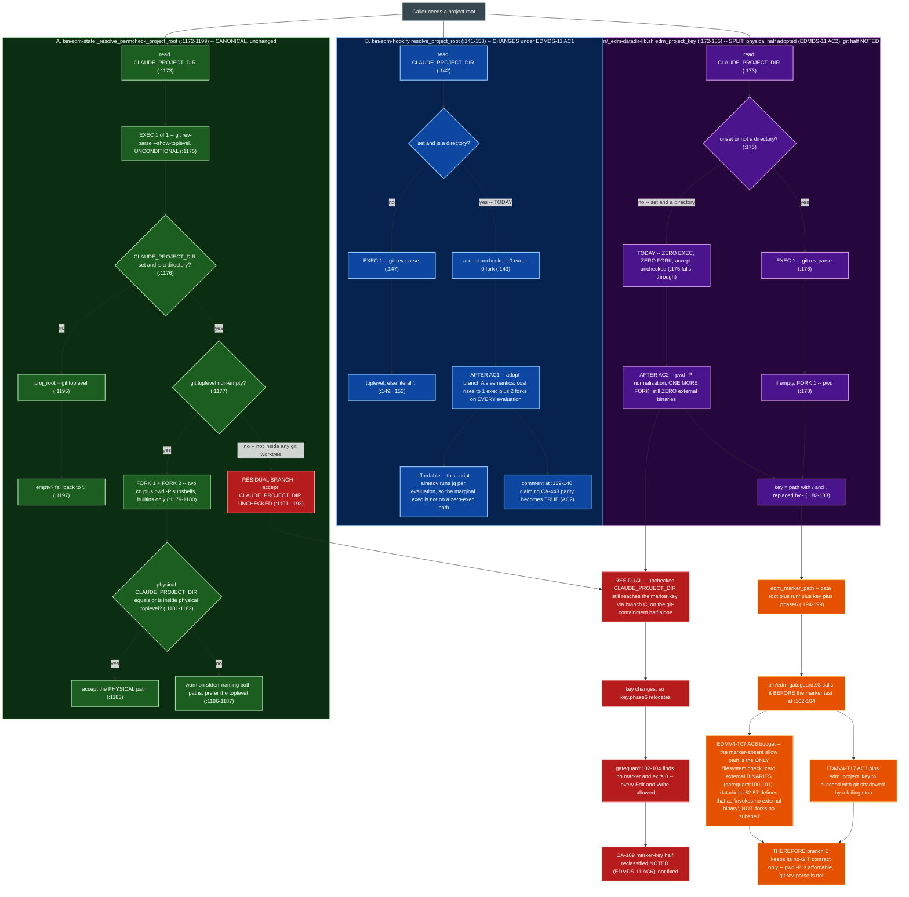
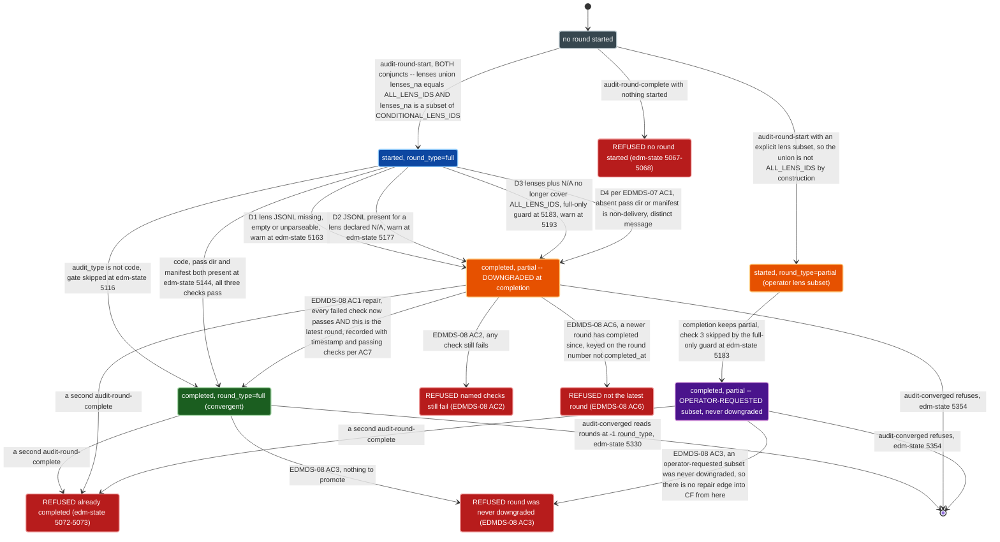
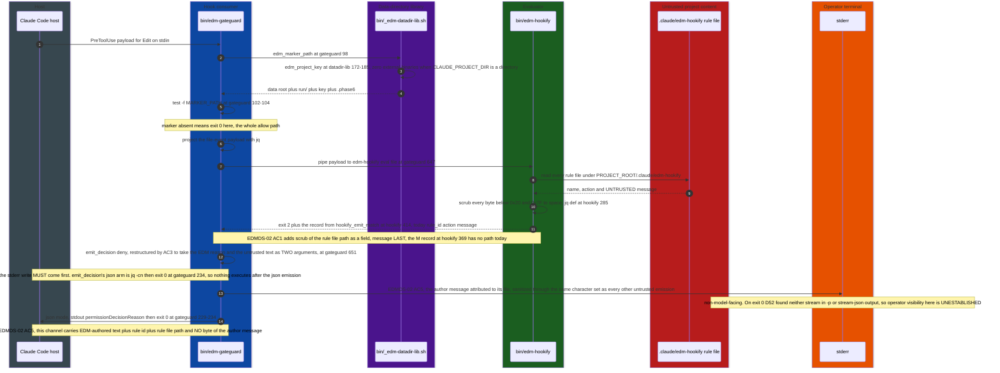

# Target Architecture: EDMDS

Companion to `srd.md` v1.3.0 Section 4. The SRD states the six decisions AD-DS1 through AD-DS6 in
prose; this file carries the two structures prose could not: the project-root resolver chain
(AD-DS2) and the code-audit round-record state machine (AD-DS3, EDMDS-07, EDMDS-08). It does not
restate the decisions -- it diagrams their consequences and names the component boundaries the
twenty-two requirements cut across.

Every code claim below carries a `file:line` citation re-derived against the working tree at the
time of writing. Where a claim could not be verified it is marked UNVERIFIED inline rather than
asserted.

## Architecture Decision

**Decision: remediate in place, at the existing seams, with the hook fast-path exec budget as the
binding constraint on convergence.** EDMDS introduces no new binary, no new process boundary and no
new state schema version. **It introduces no new file**: every change lands as an edit to a file
that already exists, plus the two smoke suites.

The one structural choice available was whether to converge the three project-root resolvers behind
a single shared function in `bin/_edm-datadir-lib.sh`, the library `bin/edm-gateguard` already
sources (`bin/edm-gateguard:89-91`). **The cross-check is divisible, so the answer is "half of it".**
The canonical resolver's containment cross-check IS a `git rev-parse --show-toplevel`, unconditional,
at `bin/edm-state:1175`. `edm_project_key()` at `bin/_edm-datadir-lib.sh:172-185` spawns `git` only
when `CLAUDE_PROJECT_DIR` is unset or not a directory (`:175-176`), and it is reached from
`edm_marker_path()` (`bin/_edm-datadir-lib.sh:194-199`), which `bin/edm-gateguard:98` calls before
its marker test at `bin/edm-gateguard:102-104` -- the allow path whose own comment at
`bin/edm-gateguard:100-101` names it "the ONLY filesystem check when no initiative is in Phase 6".
Putting the *git-containment* half in the shared library would put a `git` exec on that path for
every Edit and Write in every session. The *physical-path* half costs no external binary, so it goes
in (AD-DS2, EDMDS-11 AC2) -- see the budget note under Diagram 1.

**The accepted trade-off**: the resolvers converge on the physical-path half and stay divergent on
the git-containment half, and that divergence is named as a residual rather than closed. That is a
worse architecture than one resolver and a better one than a fast path that costs an exec. AD-DS4
supplies the second, independent reason -- adopting canonical semantics *wholesale* inside
`edm_project_key()` would rename `<key>.phase6` for any project whose resolvers disagree, which is
the marker-absent failure EDMDS-10 exists to fix, delivered by upgrade. That is why EDMDS-11 AC2's
physical-path half must be proven key-stable rather than assumed so, and why the git-containment
half stays `NOTED`.

Two smaller decisions follow from the same in-place posture:

- **The repair path (EDMDS-08) is a new `bin/edm-state` subcommand, not a flag on
  `audit-round-complete`.** `_cmd_audit_round_complete_body` refuses a second completion at
  `bin/edm-state:5072-5073` on a check that runs inside the single `with_state_lock` acquisition
  (see the comment at `bin/edm-state:5055-5056`). A flag would have to weaken that refusal for the
  repair case and the normal case indistinguishably. A separate subcommand leaves the refusal
  **entirely untouched** -- which is what EDMDS-08 AC4 now decides, and it is a change of position
  worth stating: v1.1.0 required "narrowing" that refusal while also specifying a subcommand, which
  were incompatible readings, because a new verb never reaches `cmd_audit_round_complete` at all and
  the narrowing would have been vacuous. AC4 settles it as no narrowing, and AC3 carries the
  protection instead (a round that was never downgraded cannot be promoted, and no other round is
  altered).
- **The ASCII sanitizer (EDMDS-14) is extracted into `bin/_edm-cli-lib.sh`, the library every
  consumer already sources.** The three copies are `bin/edm-gateguard:213`, `bin/edm-hookify:226`
  and `bin/edm-stop-gate:123`, all carrying the identical character set
  `'\011\012\015\040-\176'` -- which confirms the SRD's correction of the finding's recorded five
  copies down to three, and confirms `bin/edm-bash-gate` has none (EDMDS-14 AC6).

  **A prior revision of this document got this wrong, and the correction cascades.** It observed
  that only `bin/edm-gateguard` (`:89-91`) and `bin/edm-state` (`:74`) source `_edm-datadir-lib.sh`
  -- true -- and generalised from that one library to conclude that `edm-hookify`, `edm-bash-gate`
  and `edm-stop-gate` "source nothing today", therefore that no option avoids adding a `source`
  statement, therefore that a dedicated new file was the cheapest home. Every step after the first
  is false. `_edm-cli-lib.sh` is sourced **unguarded** by all four hook consumers --
  `bin/edm-gateguard:52`, `bin/edm-hookify:104`, `bin/edm-bash-gate:69`, `bin/edm-stop-gate:65` --
  and by `bin/edm-state:65`, by most of the remaining `bin/` helpers, and by the `evals/` drivers
  through the `${SCRIPT_DIR}/../bin/` form. **No count is written here** (D15): the set is derived
  with `rg 'source .*_edm-cli-lib\.sh' plugins/edm`, which is how it was re-derived for this
  correction, and `bin/tests/wave7-smoke.sh:6935-6960` already asserts the membership live.

  So: **no new file, and no new `source` line at any consumer.** The extraction deletes
  `bin/edm-gateguard:213` and adds nothing to that file, which is why EDMDS-14 is net negative on
  the line budget rather than net positive (R-A1). `_edm-cli-lib.sh` is already a general-purpose
  CLI library (its own header at `:2` describes it as "shared `--help` extractor for every `bin/`
  helper and `evals/` driver"), so the objection that a sanitizer function would change what the
  file *is* does not apply to it -- that objection was specific to a dedicated sanitizer file
  acquiring refusal-emission duties, and it is recorded against option 2 of R-A1 for that reason.

  **Sourcing stays unguarded, deliberately (EDMDS-14 AC2).** This is the one place the plugin's
  in-tree guarded-sourcing precedent is the wrong pattern: `bin/edm-gateguard:88-96` degrades
  silently to no gate at all when `_edm-datadir-lib.sh` is unreadable, and for a *sanitizer* that
  posture means untrusted rule text reaching a model-facing channel unsanitized -- AD-DS1's boundary
  undone by a missing file. All five sites already source `_edm-cli-lib.sh` unguarded, so AC2 pins
  existing behaviour rather than changing it, and a missing library aborts. The `declare -F`
  fail-closed design survives as the second layer, for a library that loads but is *partial*: each
  consumer checks `declare -F` for the sanitizer and, if absent, emits the EDM-authored label alone
  and drops the untrusted text rather than emitting it unsanitized. That keeps the existing
  fail-open posture on the gate DECISION while refusing to fail open on the sanitizer itself. No new
  binary, so CC4 holds.

  One ordering fact worth recording, because it constrains where the function may live in the file:
  `bin/edm-gateguard:52`'s `source` precedes the `EDM_GATEGUARD*` kill switches at `:81-86`, and
  `bin/tests/wave8-smoke.sh:5164-5191` asserts exactly that -- `EDMV4-T15 AC3`'s "zero filesystem
  reads" before the kill switches means zero *beyond* this source. Extending a file already read
  there adds no new read, so that assertion is unaffected.

## Component Design

| Component | Path | Responsibility | Interface | Dependencies | Requirements |
|---|---|---|---|---|---|
| GateGuard | `plugins/edm/bin/edm-gateguard` | `PreToolUse` hook for Edit/Write/MultiEdit -- allows silently unless a Phase-6 marker exists, then enforces fact-forcing and evaluates `file`-event hookify rules | in: hook JSON on stdin, `EDM_GATEGUARD_DENY_MODE`, `EDM_GATEGUARD_STATE_DIR`. out: `json` mode stdout `hookSpecificOutput.permissionDecisionReason` + exit 0 (`:229-234`), or `exit-code` mode stderr + exit 2 (`:236-240`) | `_edm-cli-lib.sh` (**unguarded**, `:52`), `_edm-datadir-lib.sh` (guarded, `:89-91`), `edm-hookify eval file` (`:647`), `jq`, `git` | EDMDS-02 AC2-AC8, EDMDS-04 AC6/AC7, EDMDS-14 AC1, EDMDS-16 AC1/AC2/AC3/AC5/AC6 |
| BashGate | `plugins/edm/bin/edm-bash-gate` | `PreToolUse` hook for Bash -- projects the command out of the payload and delegates to hookify's `bash` event | in: hook JSON on stdin. out: stderr + exit 2 on block (`:135-138`), exit 0 otherwise (`:139`) | `_edm-cli-lib.sh` (**unguarded**, `:69`), `edm-hookify eval bash` (`:131`), `jq` (`:127`) | EDMDS-01 AC3, EDMDS-02 AC2/AC6, EDMDS-05 AC2/AC3, EDMDS-14 AC6, EDMDS-16 AC1/AC7 |
| StopGate | `plugins/edm/bin/edm-stop-gate` | `Stop` hook -- blocks session stop on a blocking `edm-state validate` anomaly or a matched `stop`-event rule, via the one labelled emitter | in: Stop payload on stdin, `stop_hook_active`. out: `stop_gate_emit_blocking <label> <text>` to stderr (`:120-124`), exit 2. Every internal error exits 0 (`soft_exit`, `:107-111`) | `_edm-cli-lib.sh` (**unguarded**, `:65`), `edm-state validate`, `edm-hookify eval stop` | EDMDS-02 AC2/AC6b/AC9 (**changed twice**. v1.1.0's "confirm only, no change" was true of the file and false of the behaviour, since AC2 alters what it relays. v1.2.0 then moved the untrusted half to stdout on the strength of a `PreToolUse` measurement; **v1.3.0 reverses that** -- D87's `Stop` test was inconclusive and this file's own `:54-55` states "a raw JSON echo to stdout is the documented failure mode for a Stop hook", so AC6b keeps the labelled-stderr shape and AC9 becomes a recorded spike rather than a suite assertion), EDMDS-04 AC3, EDMDS-12 AC2/AC3, EDMDS-16 AC1/AC7 |
| Hookify evaluator | `plugins/edm/bin/edm-hookify` | Discovers and evaluates project rule files, emitting one match record or one setup-error record per rule file | in: projected payload on stdin, `eval <bash\|file\|stop>`. out: `hookify_emit_match` (`:414`) prints `<rule_id> <action> <message>`. Exit ladder block 2 > error 1 (`:479`) > clean 0 | `_edm-cli-lib.sh` (**unguarded**, `:104`), `jq`, `git`, rule files under `${PROJECT_ROOT}/.claude/edm-hookify` (`:155-156`) | EDMDS-01 AC1/AC2/AC4-AC7, EDMDS-02 AC1/AC10, EDMDS-11 AC1/AC3/AC4/AC5/AC6/AC7, EDMDS-16 AC1/AC7 |
| State layer | `plugins/edm/bin/edm-state` | Owns `.edm-state.json`, the round record, the completeness gate, marker reconciliation and the permission-rule resolver | subcommands `audit-round-start`, `audit-round-complete`, `audit-converged`, `session-start`, `validate`, `approve-gate`, `active-initiatives`, plus EDMDS-08's new repair subcommand and EDMDS-19's `migrate-data-dir` | `_edm-cli-lib.sh` (**unguarded**, `:65`), `jq`, `git`, `_edm-datadir-lib.sh`, `with_state_lock` | EDMDS-06, EDMDS-07, EDMDS-08, EDMDS-09, EDMDS-10, EDMDS-11 AC4/AC6 (canonical resolver -- unchanged, and the reference both other resolvers are asserted against), EDMDS-12 AC1, EDMDS-19 |
| Data-directory library | `plugins/edm/bin/_edm-datadir-lib.sh` | Resolves EDM's data root with a **four-arm** ownership test, derives the project key and the marker path -- on a zero-external-binary contract when `CLAUDE_PROJECT_DIR` is a directory | `edm_data_dir()`, `edm_data_dir_claim()`, `_edm_datadir_owned()` (four arms in order: not-a-directory `:113`, `.edm-owned` present `:115`, C-4 footprint clause `:127`, empty `:131-135`), `edm_project_key()` (`:172-185`), `edm_marker_path()` (`:194-199`). All exit 0 | `git` only on the fallback branch (`:176`); one `pwd` fork at `:178`, and a second under EDMDS-11 AC2's `pwd -P` | EDMDS-11 AC2 (**changes** -- adopts the physical-path half) and AC11 (failing-`git` stub still passes), EDMDS-13, **EDMDS-19 AC7 plus AC9 -- the tightening covers TWO arms, `:115` and `:127`, not `:127` alone**, EDMDS-20 |
| CLI library (MODIFIED -- no new file) | `plugins/edm/bin/_edm-cli-lib.sh` | Existing shared `--help` extractor (`:2`), which becomes the sole owner of the ASCII sanitization character set, replacing the three copies at `bin/edm-gateguard:213`, `bin/edm-hookify:226` and `bin/edm-stop-gate:123` | adds `edm_sanitize_ascii` reading stdin or `$1`, writing the `LC_ALL=C tr -c '\011\012\015\040-\176' '?'` result. **Already sourced unguarded** by all four consumers plus `edm-state` -- no new `source` statement is added anywhere. Each consumer additionally checks `declare -F` and drops untrusted text rather than emitting it unsanitized if a partial library loads | `tr` (already in use, no new binary) | EDMDS-14 AC1-AC8, EDMDS-02 AC3/AC6 |
| Readiness reporter | `plugins/edm/bin/edm-repo-readiness` | Reports repository readiness including the active-initiative set | out: human report. Change: calls `edm-state active-initiatives` instead of scraping `edm-state list` | `edm-state` | EDMDS-12 AC1-AC5 |
| Wave-6 suite | `plugins/edm/bin/tests/wave6-smoke.sh` | Round-record, completeness-gate and convergence assertions | `bash wave6-smoke.sh`, `Results:` + exit | `edm-state`, `jq` | EDMDS-06 AC3/AC5-AC7, EDMDS-07 AC4 (`CA471NODIR` band at `:1132-1140`) / AC5, EDMDS-08 AC2/AC3/AC6/AC10, EDMDS-09, EDMDS-10, EDMDS-21 |
| Wave-8 suite | `plugins/edm/bin/tests/wave8-smoke.sh` | Hook-consumer, sanitizer-ordering and data-directory-ownership assertions | `bash wave8-smoke.sh`, `Results:` + exit | all four consumers, `_edm-datadir-lib.sh` | EDMDS-02 AC4/AC7/AC8/AC9, EDMDS-05 AC2/AC3, EDMDS-11 AC8/AC8b, EDMDS-14 AC2-AC5/AC7, EDMDS-16 AC3/AC5/AC6/AC7, EDMDS-19 AC8/AC9 |
| Hook registration | `plugins/edm/hooks/hooks.json` | Registers the four consumers and the five `UserPromptExpansion` gate-enforcement command hooks whose shared body EDMDS-15 **extracts into one owner, keeping all five matcher-keyed entries** (D54 reversed the collapse) | Claude Code hook manifest -- matcher plus `command` shell string per entry. The five entries sit at `:15`, `:28`, `:41`, `:54`, `:67` | `edm-state`'s gate-check exit contract (`bin/edm-state:4267`, `:4288`) | EDMDS-15 AC1-AC6 |
| Plugin contract doc | `plugins/edm/CLAUDE.md` | Authoritative statement of hookify behaviour, round types, kill switches and the CA-500 record | read by contributors -- not loaded at runtime (D22) | `edm-sync-canonical-sections` for the seven generated sections | EDMDS-01 AC7, EDMDS-02 AC10, EDMDS-04 AC3/AC4/AC5, EDMDS-07 AC6, EDMDS-08 AC8/AC9, EDMDS-11 AC10, EDMDS-15 AC6, EDMDS-16 AC4, EDMDS-19 AC11, EDMDS-20 AC1 |
| User-facing doc | `plugins/edm/README.md` | Rule format, deny modes, fast-path performance claim | read by users | none | EDMDS-02 AC10, EDMDS-04 AC1-AC3, EDMDS-19 AC11 (`README.md:363`) |
| Decision ledger | `SRD/edm/EDMDS__design-docket/decisions.md` | Records every `NOTED` reclassification and every ratified, revised or rejected gate decision. **It does not hold `resolved_commit`** -- per EDMDS-17 AC4 that field is added to `inherited-findings.jsonl`'s schema, and AC5's check resolves it with `git cat-file -e` | append-only prose + ledger rows | none | EDMDS-01 AC7, EDMDS-03 (AC1/AC2/AC3, with AC4 asserting `D26` and `EDMTC-T04` appear here), EDMDS-05 AC1, EDMDS-08 AC10, EDMDS-11 AC9, EDMDS-13 AC6, EDMDS-17 AC1-AC3, EDMDS-18 AC1, EDMDS-19 AC12, **EDMDS-22 AC4/AC5** -- CA-196's record is EDMDS-22's, not EDMDS-02's, and EDMDS-22 is now a `Must` whose decision is made: supersede, not reaffirm |

## Diagrams

### Diagram 1 -- Resolver chain (AD-DS2)

Three resolvers, their exec cost per path, and what EDMDS-11 changes. Exec cost is stated as
external-binary execs plus subshell forks, because those are different budgets: `EDMV4-T07 AC8`
constrains external binaries on the marker-absent path, and `cd` and `pwd` are bash builtins so the
canonical resolver's two cross-check subshells fork without exec'ing anything.

**Residual, annotated (AD-DS2, EDMDS-11 AC6).** After AC1 and AC2 land, branches A and B agree on
the in-git case and disagree with branch C only on the **git-containment** half -- where branch C
accepts an unchecked `CLAUDE_PROJECT_DIR` without confirming it lies inside the toplevel. Branch A's
`:1191-1193` sub-case is the one place all three still behave
identically-lax after the fix: with no git toplevel there is nothing to cross-check against, so the
canonical resolver accepts the variable as-is by design. An unchecked value therefore still
redirects `edm_project_key()`'s output (`bin/_edm-datadir-lib.sh:182-183`), which relocates
`<key>.phase6` (`bin/_edm-datadir-lib.sh:199`), which makes `bin/edm-gateguard:102-104` find no
marker and `exit 0` -- allowing every Edit and Write with no further checks. That half of CA-109 is
`NOTED`, not remediated. Two facts bound it and both are stated in AD-DS2: `CLAUDE_PROJECT_DIR` is
host-set rather than project content, so it sits outside AD-DS1's trust boundary; and the failure is
fail-open toward a state the operator reaches anyway by not enabling the plugin.

**Correction to the brief, and what follows from it (AD-DS2, v1.2.0).** The canonical resolver's
cross-check is one external-binary exec plus two subshell forks, not three execs:
`bin/edm-state:1179-1180` runs `cd` and `pwd -P`, both bash builtins, inside `$( )`. The distinction
matters because `EDMV4-T07 AC8`'s budget is stated in external binaries, so the forks alone would
not have breached it -- the `git rev-parse` at `:1175` is what does.

**The budget note, stated once and referenced from everywhere this document prices the fast path.**
`bin/_edm-datadir-lib.sh:52-57` defines the contract in its own words: "'spawns zero subprocesses'
throughout this file means 'invokes no external binary' (no `git`, no `tr`, no `stat`) -- not 'forks
no subshell for command substitution'". `edm_project_key()` already forks at `:178`. So the
cross-check is **divisible against this budget**, and AD-DS2 v1.2.0 divides it:

- The **physical-path half** -- `pwd -P` normalization -- is one subshell and zero external
  binaries. It is inside `EDMV4-T07 AC8`'s fast-path budget and it passes `EDMV4-T17 AC7`'s
  failing-`git` stub, so it is **adopted** inside `edm_project_key()` (EDMDS-11 AC2, pinned by
  AC11). The failure it closes is non-hostile: a logical/physical divergence between the marker
  writer and the marker reader yields two keys for one project and silently disables the Phase-6
  gate -- the same marker-absent failure EDMDS-10 exists to fix.
- The **git-containment half** needs `git rev-parse`, which the fast path cannot afford. It stays
  `NOTED`, on the two bounds AD-DS2 states.

This is the same exec-versus-fork reasoning as the paragraph above, carried to its conclusion: the
earlier revision established that forks are free under this budget and then still treated the
cross-check as indivisible, which is what left the affordable half unclaimed. `EDMV4-T07 AC8`'s
per-Edit cost therefore rises by one fork and no exec, and `bin/edm-gateguard:657-658`'s separate
50 ms p95 allow-path target is the constraint that actually binds the increase -- DoD item 9
re-measures it with `bin/tests/timing.sh --gateguard`.

### Diagram 2 -- Round-record state transitions (AD-DS3, EDMDS-07, EDMDS-08)

`round_type` is set at round-start from the lenses-union rule (`bin/edm-state:5028-5048`) and can be
downgraded to `partial` at completion, never upgraded -- until EDMDS-08 adds the one reverse edge.
Line numbers appear in labels without the leading colon so no Mermaid label carries a colon; the
`file:line` citations are in the prose below.

**Why `partial` is two states, not one.** A `partial` round record carries no field saying *why* it
is partial, but the two provenances are behaviourally different and EDMDS-08 AC3 depends on the
difference. `CP_OPERATOR` is an operator-requested lens subset (`--lenses L1,L9,L11`): it was
`partial` from round-start, was never downgraded, and must never be promotable to `full` -- AC3
forbids it, and the `round_type` union rule makes it impossible anyway, since a subset's union is
not `ALL_LENS_IDS` by construction, so promoting it would assert a coverage claim the round never
had. `CP_DOWNGRADED` started `full` and lost it at completion, so restoring `full` restores a claim
that was once true. Drawing both as one state, with an unguarded repair edge out of it, made an
operator-requested subset promotable on the diagram. The implementation discriminator is available
without a new field: a round reaches `CP_DOWNGRADED` only by way of `ca471_downgrade`, so the
repair path's AC3 refusal is "recorded `round_type` is `partial` while the round's own `lenses`
union `lenses_na` covers `ALL_LENS_IDS`" -- true of a downgraded round, false of a subset round.

**The round-type conjunct, and where each half is actually enforced.** The rule is
`full` iff `(lenses UNION lenses_na) == ALL_LENS_IDS` **and** `lenses_na` is a subset of
`CONDITIONAL_LENS_IDS`. The diagram states both conjuncts because both are part of the contract
(CLAUDE.md's state-field table, AD5). The code splits them: the second conjunct is a hard `die` at
`bin/edm-state:5020-5022` on any `--na-lenses` member outside `CONDITIONAL_LENS_IDS`, which fires
before any state write, and the `round_type` computation at `:5038-5042` is then the union
comparison alone. Its own comment at `:5029-5031` records exactly that -- "already enforced above (a
die fires before this point on any violation), so the union comparison alone is sufficient here".
So the second conjunct is unfalsifiable at the point of derivation rather than absent, which is why
EDMDS-07 AC7 reduces to asserting that the `die` still fires: that assertion is the only thing
holding the conjunct up.

**The three existing downgrade paths (D1, D2, D3).** All three set `ca471_downgrade="partial"` and
all three sit inside the `audit_type == "code"` guard at `bin/edm-state:5116` and inside the
manifest-existence trigger at `bin/edm-state:5144`. D1 is the original CA-471 check -- per lens in
state-recorded `lenses`, the file must be non-empty and parse (`bin/edm-state:5158`), warned at
`bin/edm-state:5163`. D2 requires no JSONL for any lens in `lenses_na`, warned at
`bin/edm-state:5177`. D3 is scoped to rounds whose recorded type is already `full`
(`bin/edm-state:5183`) and requires `lenses` union `lenses_na` to still cover the current
`ALL_LENS_IDS`, warned at `bin/edm-state:5193`. Each of the three messages currently ends with a
statement that the round cannot be re-completed -- which EDMDS-08 AC5 makes false and sweeps.

**The fourth downgrade path (D4, EDMDS-07 AC1).** `bin/edm-state:5144` is
`if [[ -n "$_pass_dir" && -f "$_manifest" ]]` with no `else`. Today a `code` round with no pass
directory and no `lenses-run.txt` completes `full` in silence -- the C-4 backward-compatibility
behaviour the comment at `bin/edm-state:5093-5094` describes as deliberate. EDMDS-07 adds the `else`
arm, with a message distinguishable from D1, D2 and D3. **This is the superseded edge the diagram's
legend names**: today's `SF --> CF` on an absent pass directory is not drawn, because the diagram is
the target machine and `stateDiagram-v2` provides no way to class one transition as historical. This
is the transition that makes
`bin/tests/wave6-smoke.sh:1132-1140` fail as written -- that band asserts silence plus
`round_type=full` for exactly this shape, reading `.audit_rounds.code.rounds[-1].round_type` at
`bin/tests/wave6-smoke.sh:1137`.

**The reverse edge (EDMDS-08).** It cannot self-certify because it re-runs the same three (soon
four) checks against the same round: promotion is conditional on the checks that produced the
downgrade now passing, so there is no state in which a caller both fails a check and obtains `full`.
The protection is against accidental non-delivery, not against fabrication -- under EDMDS-06 the bar
per line is one JSON object with a matching `lens`, a legal `sev` and the correct `round`, which is
forgeable in one `printf` -- as `wave6-smoke.sh:877` already demonstrates. EDMDS-08 AC10 records
that limit in `decisions.md`; no file-content check can close it.

**Why the reverse edge is inert off the head of the round list.** `cmd_audit_converged` reads the
LATEST round only: `bin/edm-state:5330` projects `$e.rounds[-1].round_type`, and
`bin/edm-state:5354` refuses when that value is `partial` (with `bin/edm-state:5350` refusing on
`unknown`). Promoting round N while round N+1 exists therefore changes nothing observable at the
convergence gate. EDMDS-08 AC6 makes that a real refusal (`RNL` above) with a message saying why,
keyed on the **`round` number** rather than `completed_at`, because a re-run across a date boundary
can make the two disagree -- the CA-479 ambiguity `bin/edm-state:5120-5142` exists to handle. A
refusal rather than a silent successful promotion whose effect is zero -- which is the same fact the
requirement's own rationale uses to rule out fixing the problem with a fresh round.

**The double-completion refusal.** `bin/edm-state:5072-5073` refuses when `completed_at` is already
set, and the comment at `bin/edm-state:5055-5056` records that this check runs inside the single
`with_state_lock` acquisition so a refused double completion mutates nothing. **EDMDS-08 AC4 leaves
it untouched** -- the repair subcommand is a separate verb, so it never reaches that refusal and
there is nothing to narrow. Double completion therefore stays closed by construction rather than by
a weakened check, and the repair path never writes `completed_at`, never recomputes token or cost fields
(`bin/edm-state:5075-5084`) and only ever moves `round_type` in the `partial` to `full` direction on
a round that already carries `completed_at`. `CF --> RND` and `CP_OPERATOR --> RND` above are what
keep that separation honest: the repair path refuses a round that was never downgraded, from either
direction, so it cannot be used as a generic re-completion.

### Diagram 3 -- Primary happy path, and the channel split (AD-DS1, EDMDS-02)

The primary path this initiative changes: an Edit tool call in Phase 6, a matching `file`-event
hookify rule, and GateGuard denying in the default `json` mode. Participants are grouped in coloured
boxes -- `sequenceDiagram` has no `classDef`, and `box` is the styling mechanism it does provide.

**The `exit-code` variant of the same path, corrected on measured facts (D52).**
`emit_decision`'s other arm prints `$reason` to stderr and exits 2
(`bin/edm-gateguard:236-240`). For a `PreToolUse` hook that stderr IS the model-facing refusal
channel -- D52 measured it, the nested session quoting the stderr marker back verbatim as the
refusal it received. **What this document previously got wrong is the next sentence**: it concluded
there was therefore no second channel, so steps 12 and 13 collapsed into one. D52 measured stdout on
the same exit-2 invocation and found it non-model-facing -- the stdout marker reached the model only
inside the echoed command string, never as captured output. So the second channel exists and is
free, and the `exit-code` arm gets the *same* two-stream separation the `json` arm gets, in mirror
image: EDM-authored reason to stderr, author's `message` to stdout, sanitized.
`bin/edm-bash-gate:136-137` is the same shape and takes the same split. Both keep
`stop_gate_emit_blocking`'s label-then-sanitize *mechanism* (EDMDS-02 AC6); what changes is that the
untrusted half lands on a different stream from the label rather than beneath it on the same one.

## Data Flow

### The untrusted `message` field, traced end to end (AD-DS1)

**Entry point.** A JSON rule file under `${PROJECT_ROOT}/.claude/edm-hookify`
(`bin/edm-hookify:155-156`). `PROJECT_ROOT` comes from `resolve_project_root`
(`bin/edm-hookify:141-153`), which is branch B of Diagram 1. The file is source-controlled project
content, so its `message` is authored by anyone with commit access -- not necessarily the operator
running the session.

**Transformation 1, in jq.** The match record is built at `bin/edm-hookify:369` as
`"M\t" + scrub($parsed.name // "unnamed") + "\t" + scrub($parsed.action // "warn") + "\t" +
scrub($parsed.message // "")`. `scrub` is defined at `bin/edm-hookify:285` and maps every code point
below 32, plus 127, to a space. Three fields. **There is no path field**, while the setup-error `E`
records at `bin/edm-hookify:357`, `:361` and `:392` each carry `scrub($path)`. This asymmetry is the
reason EDMDS-02 AC1 has to run before AC2, AC5 and AC6 can be implemented at all: the rule file path
does not currently cross the process boundary. AC1 also fixes the field ORDER -- the path goes
before the message, never after it, because `bin/edm-hookify:39-40` states the contract as
message-last "so it may itself contain spaces", and a path appended after the message destroys every
consumer's ability to split the line.

**Transformation 2, in bash.** `hookify_emit_match` (`bin/edm-hookify:414-425`) re-sanitizes all
three fields through `hookify_scrub` (`bin/edm-hookify:225`) and prints
`"${clean_id} ${clean_action} ${clean_message}"` to stdout for a block
(`bin/edm-hookify:421`) or stderr for a warn (`bin/edm-hookify:423`), selected by the caller at
`bin/edm-hookify:467` and `:470`. The header comment at `bin/edm-hookify:409-413` states the
contract explicitly -- neither downstream consumer sanitizes a second time.

**Exit ladder.** `HAD_ERROR` is seeded from the pre-scan at `bin/edm-hookify:429` and set at
`:444`; `bin/edm-hookify:479` exits 1 when it is set. Block (2) outranks error (1) outranks clean
(0).

**Output, per deny surface.** One entry point, four exits, and **every one of the four has two
streams** -- the fact D52 established, and the fact the previous two revisions of this table each
got wrong in a different direction. The column that matters is not "how many channels" but "which
stream the model reads", so it is split that way here. The decision is now **uniform Separate** at
all four surfaces: EDM-authored text on the model-facing stream, the author's `message` on the
non-model-facing one.

| Surface | Site | Model-facing stream | Non-model-facing stream | What the model sees today | EDMDS-02 target |
|---|---|---|---|---|---|
| GateGuard, `json` (default), exits 0 | `bin/edm-gateguard:229-234` | **stdout** -- the decision JSON, parsed by the host | stderr. **D52 found neither stream in `-p` output nor in `--output-format stream-json --verbose` on exit 0, so operator visibility here is UNESTABLISHED and is not claimed** | the author's `message` verbatim inside `permissionDecisionReason`, via the capture at `bin/edm-gateguard:647` and `emit_decision deny` at `:651` | AC5 -- both halves: `permissionDecisionReason` carries EDM-authored text plus rule id plus rule file path and zero bytes of `message`, and the `message` goes to stderr **sanitized** (v1.1.0 required the separation but never required this stderr write to be sanitized). **This surface is genuinely different from the other three**: its stdout is the host's decision channel and is consumed, leaving stderr as the only stream, so the message may be invisible to everyone (R1) |
| GateGuard, `exit-code`, exits 2 | `bin/edm-gateguard:236-240` | **stderr -- MEASURED** (D52) | **stdout -- MEASURED IGNORED BY THE HOST** (D87: a control-shaped `permissionDecision:"allow"` written to stdout while exiting 2 did NOT override the deny, verified on two matchers with a sentinel file proving the hook fired and every tool hooked so no escape route existed) | the author's `message`, unlabelled, indistinguishable from EDM's own prose | AC6 -- Separate: EDM-authored reason to stderr, author's `message` to stdout, sanitized, behind an EDM-authored prefix naming rule id and file |
| BashGate, exits 2 | `bin/edm-bash-gate:136-137` | **stderr -- MEASURED on this exact matcher** (D52, D87) | **stdout -- MEASURED IGNORED** on this exact matcher | same | AC6, same Separate shape. EDMDS-14 AC6 gives this script the sanitizer it lacks |
| StopGate, exits 2 | `bin/edm-stop-gate:216` and `:244` | stderr -- **NOT measured** (R12) | **stdout NOT USED, and deliberately so.** D87's `Stop` test was inconclusive, and `:54-55` states "All operator-facing text goes to stderr, never stdout -- a raw JSON echo to stdout is the documented failure mode for a Stop hook" | already labelled -- `stop_gate_emit_blocking "[EDM] a stop-event hookify rule matched:" "$_hookify_out"` at `:244` | **AC2 + AC6b.** AC2 updates what `:238`/`:244` relay; **AC6b keeps the message on stderr under its label** rather than moving it to stdout, and AC9 is a recorded spike. This is the one row where the four surfaces diverge, and it diverges because its own file says so -- generalising `PreToolUse`'s measurement here is what produced a security regression in v1.2.0 |

**The mechanism all four adopt.** `stop_gate_emit_blocking`
(`bin/edm-stop-gate:120-124`) is three lines: `echo "$label" >&2` with the label never sanitized
because it is this script's own literal, then the untrusted half piped through
`LC_ALL=C tr -c '\011\012\015\040-\176' '?'`. The sentence stating which half is which spans
`bin/edm-stop-gate:116-119` -- it begins mid-line at `:116` ("... so the sanitization has exactly
one site.") and runs to `:119`. Both existing call sites use the shape `[EDM] <what happened>:`.
Under EDMDS-02 AC6 the label/untrusted split is retained and the untrusted half's redirection
changes from `>&2` to stdout, which is the only edit this function needs; the `tr` pipeline itself
becomes a call into `_edm-cli-lib.sh`'s owner (EDMDS-14 AC1).

**Error paths.**

- **Library missing or partial.** `bin/edm-gateguard:89-92` sources the library only if readable and
  `:94-96` exits 0 when `edm_marker_path` is undeclared. A broken library degrades to no gate --
  fail-open by design, per EDMV4-T17's stated contract.
- **Marker path unresolvable.** `edm_marker_path` returns the empty string when `edm_data_dir()` is
  unresolvable (`bin/_edm-datadir-lib.sh:194-199`, with the rationale at `:187-193`), and
  `bin/edm-gateguard:102` treats empty exactly like absent -- exit 0.
- **Payload projection failure.** `bin/edm-gateguard:643-644` prints one stderr line and skips
  hookify evaluation rather than turning an already-allowed call into an exit-1 setup error.
  `bin/edm-bash-gate:127-128` instead exits 0 outright.
- **Rule evaluation error.** Becomes an `E` record with `scrub($path)`
  (`bin/edm-hookify:357`, `:361`, `:392`), sets `HAD_ERROR`, and exits 1. `bin/edm-bash-gate:133-138`
  translates exit 1 into exit 0 -- allow. EDMDS-01 AC2 and AC3 pin the two halves of that
  translation at the two different scripts, which is where v1.0.0 of the SRD misattributed the
  `exit 0` observed by explorer 04.
- **StopGate internal error.** `soft_exit` (`bin/edm-stop-gate:107-111`) exits 0 for every internal
  condition, optionally naming it on stderr.
- **Completion-gate error paths.** No round started refuses at `bin/edm-state:5067-5068`; already
  completed refuses at `:5072-5073`; ambiguous pass directory warns and selects newest by mtime at
  `bin/edm-state:5133-5139` (CA-479) rather than resolving by glob order.

### Round-completion data flow

`audit-round-complete <PREFIX> code` reads `.edm-state.json` (`bin/edm-state:5064`), coerces the
round list (`:5065`), takes `rounds[-1]` (`:5066`), and reads `round`, `started_at` and
`completed_at` (`:5069-5071`). Token and cost fields are computed from `started_at`
(`:5076-5084`). The completeness gate then runs under the `code` guard (`:5116`), resolves the pass
directory (`:5129-5142`), and -- only if both the directory and `lenses-run.txt` exist (`:5144`) --
reads the state-recorded `lenses` and `lenses_na` through `LENS_READ_JQ_DEF`
(`bin/edm-state:4933`, applied at `:5148-5150`). `read_round_lenses($all)` substitutes the full
`ALL_LENS_IDS` set for a historical record carrying `lenses: []` with `round_type: "full"`, which is
the C-4 path the comment at `:5111-5114` describes. The result is `ca471_downgrade`, folded into the
write at `bin/edm-state:5214` as `+ (if $rt471 != "" then {round_type: $rt471} else {} end)`.

EDMDS-06 inserts its per-line schema check inside the D1 loop at `bin/edm-state:5155-5161`, where
today the only test is `[[ ! -s "$_lens_file" ]] || ! jq empty "$_lens_file"` (`:5158`). EDMDS-07
adds the `else` arm to `:5144`. EDMDS-08's subcommand re-enters the same check block against a
completed round and writes `round_type` plus a promotion record, without touching `completed_at`.

## Integration Points

No network integration. EDMDS adds no external service, no message queue and no database. The
integration surface is four local channels.

| System | Protocol | Auth | Error handling |
|---|---|---|---|
| Claude Code hook runtime | JSON on stdin. `PreToolUse` returns either `hookSpecificOutput.permissionDecision` on stdout with exit 0 (`bin/edm-gateguard:229-234`) or exit 2 with stderr as the refusal reason (`:236-240`). `Stop` returns exit 2 with stderr (`bin/edm-stop-gate:216`, `:244`). `UserPromptExpansion` entries in `plugins/edm/hooks/hooks.json` shell out to `edm-state` and read its exit code (`bin/edm-state:4267`, `:4288`) | None. The host is the parent process. `CLAUDE_PROJECT_DIR` and `CLAUDE_PLUGIN_DATA` are host-set, which is why AD-DS2 places them outside AD-DS1's trust boundary | Every consumer fails open. GateGuard exits 0 on a missing library (`:94-96`) and on an unresolvable or absent marker (`:102-104`). StopGate's `soft_exit` (`:107-111`) exits 0 for every internal condition. BashGate exits 0 on a payload projection failure (`:127-128`). EDMDS-16 AC5 pins that GateGuard still emits a DECISION under an injected internal error, which is stronger than "never blocks", and AC6's control proves it fails with `set -e` restored |
| `git` | `git rev-parse --show-toplevel`, subprocess, stdout captured | Inherited filesystem permissions | Every call is `2>/dev/null || <fallback>`: empty string then git toplevel then `.` in `bin/edm-state:1175`/`:1197`, `.` in `bin/edm-hookify:147`/`:152`, `pwd` in `bin/_edm-datadir-lib.sh:176`/`:178`. `EDMV4-T17 AC7` shadows `git` with a failing stub and requires `edm_project_key()` to succeed anyway, which is what makes branch C of Diagram 1 exempt from the cross-check |
| `jq` | Subprocess, JSON on stdin or via `-n`/`--arg`. Version floor: none, by contract | Inherited filesystem permissions | A parse failure inside hookify becomes an `E` record plus exit 1 (`bin/edm-hookify:357`, `:361`, `:392`, `:479`), which consumers translate to allow. Deny JSON is built with `jq -cn --arg` (`bin/edm-gateguard:232-233`), never string concatenation, so quotes, backslashes and newlines in `$reason` escape correctly. EDMDS-01 records that Oniguruma's `retry-limit-in-match` -- not any EDM guard -- is what bounds `regex_match`, and that CC4's required-binary contract names `jq` with no version floor |
| Project state file | `SRD/{PRODUCT}/{PREFIX}__{DESC}/.edm-state.json`, read-modify-write under `with_state_lock` (`_rmw_state_body`, applied at `bin/edm-state:5200`) | Filesystem | The double-completion check runs inside the single lock acquisition, so a refused completion mutates nothing (`bin/edm-state:5055-5056`, `:5072-5073`). EDMDS-10 AC2 keys the **existing** primitive on the project for `SessionStart` marker reconciliation. v1.2.0 called it new work on the claim that "every lock goes through `with_state_lock` with `lockbase="${f%.json}"`" -- which is false: `:4879` passes `"${init_dir}/code-audit/findings-ledger"` and `:4213-4214` passes `"${src}/.edm-state"`, so `with_state_lock` is already generic over its lockbase and the work is a new lockbase, not a new primitive. AC4 then covers all **five** marker-mutation sites -- `_edm_marker_write` at `:2883` and `:4784`, `_edm_marker_remove_if_matches` at `:3056`, `:3655` and **`:5669`** (`cmd_skip_phase`). The count read two, two, four and now five across successive revisions, which is why AD-DS6 derives it against the `product` root rather than counting by hand |
| EDM data directory | Filesystem. Resolution order `${CLAUDE_PLUGIN_DATA}` then `${XDG_DATA_HOME}/edm` then `${HOME}/.local/share/edm` (`bin/_edm-datadir-lib.sh:143-165`). **Only the first candidate is ownership-gated**: `${CLAUDE_PLUGIN_DATA}` requires `_edm_datadir_creatable` **and** `_edm_datadir_owned` (`:146-147`), while `${XDG_DATA_HOME}/edm` (`:152-159`) and `${HOME}/.local/share/edm` (`:161-165`) are gated by creatability alone. That is correct by design -- the ownership test exists because `CLAUDE_PLUGIN_DATA` is host-set and may point at a foreign plugin's tree, which is not true of the other two -- but it bounds EDMDS-19: the tightening changes what happens at candidate 1 only, and its effect on candidates 2 and 3 is that they become reachable, not that they get stricter | Ownership test, not auth, and it has **four arms in this order**: not-a-directory (`:113`), `.edm-owned` sentinel present (`:115`), the C-4 footprint clause `[[ -d "${p}/run" \|\| -d "${p}/patterns" ]]` (`:127`), empty (`:131-135`). Arm 2 short-circuits arm 3 | An unresolvable root returns the empty string and every consumer treats non-empty as the single usability condition (`:187-193`). **EDMDS-19 tightens TWO arms, not one**: AC7 covers the `.edm-owned` arm (`:115`) and the footprint clause (`:127`) together, each honoured only when EDM's names are the directory's *only* top-level content (AC6 fixes the name set and the depth). Tightening `:127` alone is inert for the target population -- see the note below this table. EDMDS-20 AC3 forbids removing `run/` itself, because `:127` is the ownership proof |

**Why the ownership tightening has to cover the sentinel arm (AD-DS4, EDMDS-19 AC7).** The four arms
run in order and arm 2 returns before arm 3 is reached. A directory EDM has already polluted
**acquires the `.edm-owned` sentinel on its first post-3.3.0 write**: `edm_data_dir_claim()` is
called from `bin/edm-state:98` on every `phase-start 6` and from `:6359` in `cmd_update_patterns` --
which is the very command that harvested the pattern library into the foreign directory in the first
place. So for any affected user who has run EDM at all since upgrading, arm 2 answers "mine" and arm
3 is dead code on their install. A tightening scoped to `:127` would therefore change nothing for
the population it exists to serve, while a sentinel-free test fixture would make its own assertion
pass -- an assertion that cannot fail against the real target state, which is Goal 3's defect class.
This document previously described the tightening as touching the footprint clause alone; that
framing is what made the requirement inert, and it is corrected here and in the Component Design and
Build Sequence entries. `_edm_datadir_owned()`'s own comment at `:123-126` names the residual
("a foreign directory EDM has ALREADY polluted carries `patterns/` too, so it keeps being accepted
until a human deletes it") -- EDMDS-19 is the requirement that closes it, and it can only do so from
arm 2 inward.

## Architectural Risks

**R-A1 -- `bin/edm-gateguard` has one line of headroom, and three requirements modify it.** The file
is **659 lines** (verified by line count of `plugins/edm/bin/edm-gateguard`, last statement
`emit_decision allow ""` at `:659`) against `EDMV4-T11` AC1's CLOSED 200-660 bound. That bound is
CC7 and Definition of Done item 6. Three requirements touch the file:

- **EDMDS-16** (drop `set -e`) is net **zero in code**: `bin/edm-gateguard:49` is
  `set -euo pipefail` and becomes `set -uo pipefail`, an in-place single-line edit matching
  `bin/edm-hookify:101` and `bin/edm-lint-staged-artifacts:42`. AC2's record of the choice goes in
  `CLAUDE.md`, not here. If an inline rationale comment is added at `:49` it costs one to three
  lines, and at 659 that is already over the bound -- so **the comment goes in CLAUDE.md and the
  code line carries no new comment**.
- **EDMDS-14 AC1** is **net NEGATIVE** for this file, and this is the correction that moves the
  crossing. GateGuard's copy of the literal is the single line `bin/edm-gateguard:213`,
  `reason="$(printf '%s' "$reason" | LC_ALL=C tr -c '\011\012\015\040-\176' '?')"`. The sanitizer's
  new home is `bin/_edm-cli-lib.sh`, which `bin/edm-gateguard:52` **already sources, unguarded**, so
  `:213` is replaced by a call and **no `source` statement and no guard are added**. A prior revision
  of this section costed a second guarded source plus a `declare -F` fallback at four to six lines;
  that cost does not exist, because it was derived from the false premise that the hook consumers
  source nothing (see the Architecture Decision section). If the replacement call is shorter than
  the line it replaces the file shrinks, and at worst it is net zero. Either way this requirement
  **buys headroom rather than spending it**. AC7's four dependent sites
  (`bin/tests/wave8-smoke.sh:7877`, `:7891`, `:8996`, `:9027`) are in the suite, not in this file,
  and so is AC5's mutant-harness glob work.
- **EDMDS-02** (AC3, AC5, AC6, AC8) is the only net **positive**: restructuring `emit_decision` to
  take the EDM-authored reason and the untrusted text as two arguments, building the EDM-authored
  reason string, routing the author's `message` to the second stream in both modes, and handling
  more than one matched rule per call. That is plausibly **ten to thirty lines**.

**The honest arithmetic, re-derived: the bound still breaks, but at EDMDS-02, not EDMDS-14.** The
file is 659 lines against a closed 200-660 bound -- one line of headroom. EDMDS-16 is net zero
(removing `-e` from a single line). **EDMDS-14 is net negative** (deletes `:213`, adds nothing).
**EDMDS-02 AC3 is `+10..30`** and is the crossing. The sum still exceeds 660 and no ordering avoids
that, so the bound is amended either way -- but the attribution changes, and attribution is the
whole reason the order is fixed.

**The ordering rationale is restated, because the old one is defeated by its own arithmetic.** It
read: "EDMDS-14 is then the first crossing, and the R-A1 decision is taken at that point, before
EDMDS-02 is written." Under corrected arithmetic EDMDS-14 cannot be the crossing -- it *banks* a
reduction. The order is unchanged and its justification is inverted:

**EDMDS-16 first, EDMDS-14 second, EDMDS-02 last, with the line count measured after each.**
EDMDS-16 confirms the 659 baseline against the current tree at zero cost. **EDMDS-14 lands second
because it banks a reduction**, so EDMDS-02 is written against the largest headroom the initiative
can give it and the amendment, when it comes, is for the smallest number it can be. **The bound
amendment is taken before EDMDS-02 is written, not after it crosses** -- the gate decision is made
against a known `+10..30` estimate rather than against a fait accompli, which is the difference
between a recorded amendment and a nudge (D42, D47 precedent). The SRD assigns that amendment its
own ticket, `EDMDS-T05`, and orders `T05 -> T06` for exactly this reason.

Two responses are available, and the choice is a gate decision, not an implementer's:

1. **Amend `EDMV4-T11` AC1's upper bound by a recorded decision** -- never nudged. The precedent is
   **D42 and D47 only**, each of which widened the bound (400 to 500, then 500 to 660) and amended
   both the assertion and the ticket text. **D49 is not precedent here** and this document previously
   cited it as though it were: D49 is CA-061, the verbatim-text contradiction and the `NOTICE`
   retraction, and it amended no bound -- it worked within one.
2. **Relocate EDMDS-02's new code into `bin/_edm-cli-lib.sh`.** The reason-string construction is a
   pure function of rule id, rule file path and deny mode, and the label-then-sanitize emitter is
   the `stop_gate_emit_blocking` shape (`bin/edm-stop-gate:120-124`). Both belong next to the
   sanitizer, and **no sourcing statement has to be added at all** -- all four consumers already
   source that library unguarded. **This option is materially cheaper than a prior revision of this
   document presented it.** Its sole recorded objection was that "the file stops being a sanitizer
   library and becomes a refusal-emission library" -- an objection to a *dedicated sanitizer file*,
   which no longer exists. `_edm-cli-lib.sh` is already a general-purpose CLI library shared by
   sixteen `bin/` scripts and three `evals/` drivers, so a second general helper does not change
   what the file is. The objection that survives is narrower: `EDMV4-T11`'s size reasoning about
   GateGuard does not transfer to a file with no bound of its own, so relocation moves code out of a
   measured budget into an unmeasured one.

Option 1 remains preferred, on the grounds that a 660-line bound on a hook consumer was calibrated
against a smaller feature set (D42 and D47 each widened it for the same reason, and D47's own text
warned the next contributor to expect to amend it again), and that option 2 moves the breach out of
sight rather than resolving it. That preference is now a closer call than it was, and it is stated
as one: option 2's cost has dropped to the call sites alone. Whichever is chosen, the decision is
recorded before EDMDS-02 is written, and DoD item 6 requires the amendment to edit **two** places --
the live assertion at `bin/tests/wave8-smoke.sh:4056` and `EDMV4-T11` AC1 under `.archived/`, which
`edm-lint-artifacts` excludes from every scan and which is therefore verified by reading.

**R-A2 -- the strict gate and its repair path must ship together.** EDMDS-06 AC5 makes one malformed
line fail a whole lens file, and a failed file downgrades a round the SRD prices at $105.28 and
3h15m. EDMDS-08 is the only recovery. If EDMDS-06 lands and EDMDS-08 slips, the initiative has made
an expensive irreversible failure *more* reachable. The assumption this rests on is that
`bin/edm-state:5144`'s check block is re-enterable against an already-completed round without
recomputing token or cost fields (`:5075-5084`) -- true as read, but only because those fields are
computed before the gate rather than inside it.

**There is a second coupling in the same requirement, and EDMDS-08 cannot cover it.** Requiring at
least one lens-shaped line makes a lens that legitimately found nothing either fabricate a finding
or downgrade the round -- and the repair path is *no* recovery there, because restoring `full`
requires passing the check that failed, and a clean lens still has nothing to write. So EDMDS-06 AC3
(the defined no-findings artifact, a single line carrying `sev: "NOTED"`) is not a convenience: it
is what makes AD-DS3's strictness satisfiable in the ordinary case of a clean lens. If AC5 lands
without AC3, the initiative has made an unrecoverable downgrade reachable by doing the work
correctly.

**R-A3 -- the unowned `code`-round completion sites, and why this document no longer lists them.**
EDMDS-07's `else` arm turns every `code` round completing with no pass directory `partial`, which
changes those rounds' downstream `--accept-p2-debt` and `audit-converged` expectations. **A prior
revision of this block listed six sites** (`bin/tests/wave6-smoke.sh:681`, `:697`, `:738`, `:750`,
`:778`, `:790`) and marked the list UNVERIFIED. The six are real -- they have since been confirmed
-- but the list was **the wrong shape of claim**, and AD-DS6 is the SRD's response to exactly that:
the derived count for this requirement is **64**, so a hand-read list was more than ten times short.

**That figure was itself wrong in v1.2.0, and the correction is the point.** AD-DS6 v1 derived 26,
and three independent audit lanes measured it as narrower than the prose it replaced -- it searched
`bin/tests/*.sh` only, so product code, the 124 fixture files under `bin/tests/fixtures/` and all 61
documentation surfaces were structurally invisible, and its targets anchored on call syntax rather
than the callee, so `audit-round-complete [A-Z0-9]+ code` could not match the `"$prefix"` form that
is exactly the `ca416_fixture` call the list had missed. D88 records the rewrite: **each target now
carries its own search root, and the root is printed beside the count** so a reader can see what was
not searched. One lane's phrasing is the reason this mattered -- the failure had moved from "the
reader missed a site" to "the target cannot see the site", and the second is worse because it prints
a number and reads as complete.

The source of truth is `./affected-assertions.sh EDMDS-07`, which prints the set with `file:line` at
implementation time, and EDMDS-07 AC4 requires every site the derivation names to be amended or
demonstrated unaffected **by a named assertion that runs**, one by one, with the old expectation
recorded in `decisions.md`. Three of the sites a reading missed need different treatment from the
rest, which is why the derivation matters rather than the count: `wave7-smoke.sh:9566-9573`'s
`ca416_fixture()` helper backs a band carrying dozens of `ca416_*` references and its own comment
states the intent this change destroys, so fixing it means teaching a shared helper to build a
manifest, at the helper and not per call site.

**UNVERIFIED**: this document has not re-derived the 26-site set itself -- it verified only the
`CA471NODIR` band at `bin/tests/wave6-smoke.sh:1132-1140`, whose `round_type` read at `:1137`
confirms the shape. The marker is retained deliberately: the set is *meant* to be derived at
implementation time rather than trusted from here, and a count written into this document would go
stale the first time anyone adds a `code`-round fixture (D15).

**R-A4 -- the resolver residual is load-bearing on an assumption about the host.** AD-DS2's
reclassification of the marker-key half of CA-109 to `NOTED` rests on `CLAUDE_PROJECT_DIR` being
host-set rather than project-controlled. If a future Claude Code release lets project configuration
set that variable, the residual moves inside AD-DS1's trust boundary and the reclassification must be
revisited. Nothing in the code enforces the assumption.

**R-A5 -- fail-open is the design, in both directions.** Every consumer allows on internal error.
That is deliberate (EDMV4-T17's stated contract, and EDMDS-16's whole rationale) but it means every
defect in this initiative's own changes to those four scripts degrades toward permitting the edit,
not toward blocking it. EDMDS-16 AC5's assertion -- a DECISION must still be emitted under an
injected error -- is the only mechanism that distinguishes "allowed deliberately" from "aborted
before deciding", and AC6's control (the same injection with `set -e` restored, producing no
decision) is what proves it can fail. AC7 extends the same injection to the other three consumers.
EDMDS-16 is a `Should` and none of that should be treated as optional.

**R-A6 -- CC2 self-matching, twice.** EDMDS-14 AC3 scans for the character set
`'\011\012\015\040-\176'` and must not match its own source; EDMDS-05 AC3's control scans for a missing `--help` line
live and, per AC3, must not match the test file. Both are scans written inside the file being
scanned. A self-match makes the assertion pass unconditionally, which is Goal 3's defect class. Both
carry explicit controls (EDMDS-14 AC4, EDMDS-05 AC3) and both controls must fail before amendment to
be worth anything. The two in-tree solutions for the self-match are
`wave6-smoke.sh:1463-1464`'s needle-built-from-parts and `_edm-datadir-lib.sh:63-64`'s deliberate
non-spelling, and EDMDS-14 AC3 requires one of them rather than leaving the technique open.

**R-A7 -- the test suite writes to the real host data directory, and the mechanism is not the one
this document guessed.** The risk itself stands: `bin/tests/wave6-smoke.sh` writes Phase-6 markers
into the operator's live data root, so every run of the Definition of Done suite mutates the state
EDMDS-19 and EDMDS-20 are measured against.

**The attribution was wrong, and it has now been measured.** A prior revision of this block said the
cause was `wave6-smoke.sh`'s T06 isolation band isolating `HOME` and `CLAUDE_PROJECT_DIR` but not
`CLAUDE_PLUGIN_DATA`, and marked that claim UNVERIFIED. It is false. **The T06 band spans `:1575` to
`:1783`, and not one of the nine `phase-start ... 6` sites falls inside it** -- one precedes the band
and eight follow it (`:1404`, `:1823`, `:1999`, `:5264`, `:5289`, `:5462`, `:5513`, `:5597`,
`:5883`). The band's `HOME` isolation only ever affected branch 3 of `edm_data_dir()`
(`bin/_edm-datadir-lib.sh:161-165`), and no band in that file affects branches 1 or 2. So a remedy
scoped to the T06 band would have been scoped to a region containing none of the writes it was meant
to stop. EDMDS-21 is rescoped accordingly: AC1 isolates `CLAUDE_PLUGIN_DATA`, `XDG_DATA_HOME` **and**
`HOME` at the top of the file, and AC2 extracts the whole-suite guarantee into
`bin/tests/_harness.sh` rather than extending `wave7-smoke.sh:10185-10230`'s pair in place, whose own
header states it is "deliberately the LAST thing this file does".

**The UNVERIFIED marker did its job, and that is worth recording rather than quietly deleting.** A
self-marked unverified claim that later measures **false** is the marker working exactly as intended:
it told a reader which sentence not to build on, and the measurement that followed changed the
requirement instead of shipping a fix aimed at the wrong lines. The marker is removed here because
the question is answered, not because the claim survived.

## Build Sequence

Five phases. The ordering constraints are real dependencies, not preference -- each is named.

**Phase 0 -- Re-anchor the baseline.** Definition of Done item 2's 4048 figure is anchored to no
commit and two `bin/`-touching commits have landed since. Run
`/bin/bash plugins/edm/bin/tests/run-all.sh`, record the measured figure and the commit sha in
`decisions.md`. **Blocks everything**: without it no later phase can claim "at or above the
baseline". Do this before EDMDS-21, so the pre-isolation figure is on record.

**Phase 1 -- Contract changes that later phases depend on.**

1. **EDMDS-21 AC1** -- isolate `CLAUDE_PLUGIN_DATA`, `XDG_DATA_HOME` **and** `HOME` at the top of
   `wave6-smoke.sh`, **not in the T06 band**, which contains none of the nine `phase-start ... 6`
   sites (R-A7). AC2 extracts the whole-suite guarantee into `bin/tests/_harness.sh` and AC3 places
   the end call immediately before each suite's own `Results:`/`exit` lines (CC5). First real work,
   because every later phase runs the suite and every run currently mutates the host root that
   EDMDS-19 and EDMDS-20 are measured against.
2. **EDMDS-02 AC1** -- add `scrub($path)` to hookify's `M` record (`bin/edm-hookify:369`) with
   **message last**, emit it from `hookify_emit_match` (`:414-425`), amend `EDMV4-T44`'s exit/output
   contract, and sweep every copy of the field shape including `bin/edm-hookify:39-40`'s own header,
   which documents it a third time. **Blocks EDMDS-02 AC2 through AC10** -- the path does not cross
   the process boundary until this lands.
3. ~~**Amend `NOTICE`'s reused MIT text before any claim about it changes** (v1.1.0's EDMDS-02
   AC10, D49's never-after ordering).~~ **WITHDRAWN, and the slot is kept so a reader of the prior
   revision can see why.** This requirement does not reach the attributed text: `NOTICE` contains no
   reused text -- it is the *claim about* reuse (`:27-33`, describing which `gg_build_facts()`
   strings are verbatim) -- and hookify-driven denials route through `emit_decision`
   (`bin/edm-gateguard:651`) without touching `gg_build_facts()` at all. R10 keeps the conditional:
   if any `gg_build_facts()` string ever changes, D49's order applies, text before claim. v1.2.0's
   AC10 is a different obligation entirely (the per-deny-mode channel documentation), which lands in
   Phase 4 with the rest of EDMDS-02.
4. **EDMDS-09** -- subtract `lenses_na` at `audit-round-start`. Ahead of all of Epic 2 because every
   completeness-gate change reads the `lenses` set this requirement fixes, and AC2 must assert the
   `lenses` array itself rather than `round_type`, which is invariant under the fix.
5. **EDMDS-11 AC10** and **EDMDS-04 AC3/AC4** -- the documentation sweeps (`CLAUDE.md:1345`'s stale
   CA-500 record, CLAUDE.md's "Rule directory and discovery" section enumerating the unchecked
   three-step chain, `README.md:342`'s kill-switch falsehood, the self-contradicting `EDM_HOOKIFY_*`
   closing paragraph). Cheap, independent, and AD-DS2 ships contradicted without the first.

**Phase 2 -- The gate and its recovery path, together.**

6. **EDMDS-06** -- per-line `lens`, `sev` and `round` schema check inside the D1 loop
   (`bin/edm-state:5155-5161`); **AC3's defined no-findings artifact**, without which a clean lens
   cannot satisfy the gate (R-A2); AC4's amendment of every lens JSONL fixture, derived per AD-DS6
   rather than listed; AC8's **new** byte-identity assertion over the `## JSONL Line Format` block
   (the one v1.1.0 cited as already existing -- it does not) with AC9's mutating control; and AC10's
   atomic update of the lens prompts, derived from the `agents/edm-audit-*.md` glob **excluding the
   synthesizer** and with no count written into the work (D15).
7. **EDMDS-08** -- the repair subcommand (AC1), the AC4 decision that it is a separate verb and
   `bin/edm-state:5072-5073` is therefore **untouched**, the AC6 not-latest refusal keyed on the
   round number, AC7's promotion record, and the AC5 sweep of the three downgrade messages at
   `bin/edm-state:5163`, `:5177`, `:5193`.
8. **EDMDS-07** -- the `else` arm on `bin/edm-state:5144`, plus AC4's one-by-one amendment of every
   site `./affected-assertions.sh EDMDS-07` names -- including the `CA471NODIR` band
   (`bin/tests/wave6-smoke.sh:1132-1140`) and `wave7-smoke.sh:9566-9573`'s `ca416_fixture()` helper,
   which is fixed at the helper and not per call site (R-A3).

Items 6, 7 and 8 are **one atomic landing**. EDMDS-06's coupling note is explicit: AC5's
one-bad-line-fails-the-file price is acceptable only because EDMDS-08 is a `Must`, so the strict
gate and its repair path ship together or neither ships (R-A2). EDMDS-08 must be implemented before
EDMDS-07 adds a fourth downgrade cause, so the repair path is written against three causes and
extended to four rather than retrofitted. AC5's sweep of the three messages happens in this window
because EDMDS-07 adds a fourth message that must be worded consistently with the swept three.

**Phase 3 -- Resolvers and the data-directory lifecycle.**

9. **EDMDS-11 AC1-AC11** -- hookify adopts the full cross-check (AC1); `edm_project_key()` adopts the
   **physical-path half** via `pwd -P` (AC2), which is one fork and zero external binaries;
   AC8's mutant-controlled assertion that no `<key>.phase6`, `<key>.checked` or `<key>.denials`
   name changes; AC11 re-runs `EDMV4-T17 AC7`'s failing-`git` stub to prove no binary was added.
   AC7 settles `bin/edm-bash-gate`'s per-Bash-call cost rather than leaving it open.
10. **EDMDS-10** -- single-pass `SessionStart` reconciliation under a project-scoped lock. After
    EDMDS-11 AC8, so the marker-name invariant is already pinned when reconciliation starts creating
    markers.
11. **EDMDS-19**, in its own internally-fixed order (detect, then migrate on request, then tighten).
    The tightening covers **two** arms of `_edm_datadir_owned()` -- the `.edm-owned` sentinel at
    `bin/_edm-datadir-lib.sh:115` and the footprint clause at `:127` -- because arm 2 short-circuits
    arm 3 on any install that has run EDM since 3.3.0 (AC7; see the note under Integration Points).
    AD-DS4: tightening first makes an affected user's data vanish from view, and AC10 gates the
    tightening behind explicit operator action so an upgrade alone never relocates a data root.
12. **EDMDS-20** -- the `run/` sweep keyed on the marker's recorded `initiative_dir` no longer
    existing, **not on age**, with AC3's "never remove `run/` itself" as the hard constraint.
    **After EDMDS-19's tightening**, because AC5's expected verdict depends on which ownership rule
    is in force and must be pinned against both.
13. **EDMDS-13** -- project-keyed, capped pattern delta with the read-in-place compatibility path.
    Independent of 11 and 12 but shares AD-DS4, so it lands in the same review.

**Phase 4 -- GateGuard, in the fixed line-budget order (R-A1).**

14. **EDMDS-16** -- `bin/edm-gateguard:49` to `set -uo pipefail`, plus AC3's error-injection
    assertion and AC5's parity checks on the other three. Measure the line count.
15. **EDMDS-14** -- add `edm_sanitize_ascii` to the **existing** `bin/_edm-cli-lib.sh` (no new file),
    replace the three copies at `bin/edm-gateguard:213`, `bin/edm-hookify:226` and
    `bin/edm-stop-gate:123` with calls, add the `declare -F` partial-library fallback at each
    consumer (**no `source` statement is added -- all five sites already source it unguarded**),
    teach every mutant and fixture helper that stages a consumer into a scratch `bin/` to copy
    libraries by the `_edm-*.sh` glob (AC5, `wave8-smoke.sh:8569-8578`'s `cahk_mutant` and
    `:10603-10609`'s `p2g1_mutant_bin`), retarget `bin/tests/wave8-smoke.sh:7877`, `:7891`, `:8996`,
    `:9027`, and give `bin/edm-bash-gate` the sanitizer it lacks (AC6). Measure the line count --
    **this is where headroom is BANKED, not where the bound breaks.**
16. **The R-A1 bound amendment** (`EDMDS-T05`), taken here, **before** EDMDS-02 is written -- against
    a known `+10..30` estimate rather than a fait accompli. Two files: the live assertion at
    `bin/tests/wave8-smoke.sh:4056` and `EDMV4-T11` AC1 under `.archived/`.
17. **EDMDS-02 AC2-AC10** -- the channel split, the largest change to this file and the one that
    crosses 660. Measure the line count against the amended bound.
18. **EDMDS-01** -- the hookify header correction and the catastrophic-pattern assertions. After 17
    because AC2's assertion checks that the offending rule FILE is named on stderr, which is the
    contract EDMDS-02 AC1 established and AC6's labelling shape formats.
19. **EDMDS-04 AC1/AC2/AC5/AC6** -- `README.md`'s `file`-event scoping and the pinning assertions.

**Phase 5 -- Consolidation and closure.**

20. **EDMDS-12** (accessor), **EDMDS-15** (the extracted `UserPromptExpansion` body with its five
    matchers retained, per D54), **EDMDS-05** (the `--help` gap; its assertion half was already closed in the tree). Independent of
    everything above. EDMDS-05 goes last of the three because it consumes `t50_bin_membership_set` and
    every earlier phase that adds or removes a `bin/` file would otherwise invalidate its fixture.
21. **EDMDS-03**, **EDMDS-17**, **EDMDS-18**, **EDMDS-22** -- record-keeping and disposition. Last by
    construction: EDMDS-17 AC4 records a `resolved_commit` per finding, which requires every other
    requirement's commit to exist. EDMDS-18 disposes of `CAMGAP`, `LINUXV` and `EVALB`, and
    `EDMRT`'s retention is EDMDS-03 AC3's, not EDMDS-18's. EDMDS-22 re-assesses CA-196 against
    AD-DS1's measured facts, so it follows the channel split rather than preceding it.
22. Definition of Done items 3, 4 and 5 -- `edm-check-grants`, `edm-check-vocabulary`,
    `edm-check-skill-sync`, `edm-sync-canonical-sections --check`, `claude plugin validate`, and
    `edm-lint-artifacts --path plugins/edm/` reporting zero violations across `skills/`, `agents/`
    and `docs/`. `edm-sync-canonical-sections` must be re-run because EDMDS-01 AC7, EDMDS-02 AC9,
    EDMDS-04 AC3/AC4, EDMDS-07 AC6, EDMDS-11 AC7, EDMDS-16 AC2 and EDMDS-20 AC1 all edit
    `CLAUDE.md`, and seven of its sections are generated byte-identical into
    `docs/canonical-sections.md`.

## Rejected Alternatives

| Alternative | Rejected because |
|---|---|
| One shared project-root resolver in `bin/_edm-datadir-lib.sh`, cross-check included **whole** | The **git-containment** half is a `git rev-parse` (`bin/edm-state:1175`) and the library is reached from the marker-absent fast path (`bin/edm-gateguard:98` before `:102-104`), which `EDMV4-T07 AC8` budgets at zero external **binaries** and `EDMV4-T17 AC7` pins with a failing `git` stub. Rejected for that half only -- the physical-path half costs one fork and no binary, and AD-DS2 v1.2.0 adopts it (EDMDS-11 AC2). |
| Apply the cross-check in `edm_project_key()` **wholesale** and accept the exec cost | AD-DS4's second reason: adopting `edm-state`'s semantics entire would rename `<key>.phase6`, `<key>.checked` and `<key>.denials` for any project whose resolvers disagree, delivering the exact marker-absent failure EDMDS-10 exists to fix, on upgrade. This is also why the adopted physical-path half must be *proven* key-stable (EDMDS-11 AC8, with a mutant control) rather than assumed so. |
| Fix the `:1191-1193` no-toplevel sub-case by refusing `CLAUDE_PROJECT_DIR` outright | There is no repository boundary to cross-check against outside a git worktree, so refusal would break every non-git project rather than closing a bypass. EDMDS-11 AC5 pins the behaviour instead. |
| A `--repair` flag on `audit-round-complete` | Would have to weaken the double-completion refusal at `bin/edm-state:5072-5073` for the repair case and the ordinary case indistinguishably. A separate subcommand narrows scope without weakening the check (EDMDS-08 AC4). |
| A repair *round* instead of a repair path | `cmd_audit_converged` reads `rounds[-1].round_type` (`bin/edm-state:5330`), so a new round is the only thing that would help -- at $105.28 and 3h15m, to recover from a missing file. That cost is the finding. |
| Promote a non-latest round silently | The promotion would be inert against `bin/edm-state:5330`. EDMDS-08 AC6 refuses and says why, so the caller learns the promotion would not have helped. |
| Full JSON-schema validation of `lens-L{N}.jsonl` (AD-DS3 option C) | Acquires a drift surface tracking a schema every lens prompt carries verbatim, across 14 files on every round close. The `round` field alone is exempt -- it is already in state. |
| Status quo on the completeness gate (AD-DS3 option A) | A file of `{}` converges a round. A gate whose only check is "the file parses" is a gate in name only. |
| Route the author's `message` to stderr at all four surfaces (SRD v1.0.0's choice) | For a `PreToolUse` hook, exit 2 plus stderr IS the model-facing refusal channel -- **now measured, not reasoned** (D52; `bin/edm-gateguard:236-240`, `bin/edm-bash-gate:136-137`). At three of four surfaces that relocates the text *within* the model-facing channel while reporting the boundary closed. |
| Label-and-sanitize in place at the three exit-2 surfaces, separating only in `json` mode (SRD v1.1.0's choice) | It rested on those surfaces having only ONE usable stream, which D52 disproved by measuring stdout free on the same exit-2 invocation. A label tells the model which text is untrusted and then hands it to the model anyway -- AD-DS1's own principle is *where two channels exist, reduce the channel*, and two do exist. The two-branch table collapses into one uniform Separate decision, which is also one plugin shape instead of two. |
| Accept the `message`-injection risk as `NOTED` (EDMDS-02 option 4) | Would make a two-site pattern with `bin/edm-lint-staged-artifacts:151` (CA-196), whose own acceptance was never revisited. EDMDS-02 AC8 revisits it instead. |
| An EDM-side time or complexity bound on `regex_match` | A pattern-complexity heuristic rejects legitimate patterns -- a worse failure than the one it prevents -- and a `sleep`-plus-`kill` watchdog puts asynchronous process management in three hook consumers, one with a zero-exec fast path. Both solve a hang that does not occur on the pinned engine. |
| **Extracting the sanitizer into `bin/_edm-cli-lib.sh` -- CHOSEN, listed here so the four candidates sit in one place** | **Not rejected.** All four hook consumers and `edm-state` already source it, unguarded (`edm-gateguard:52`, `edm-hookify:104`, `edm-bash-gate:69`, `edm-stop-gate:65`, `edm-state:65`), so this is the only candidate that adds no file and no `source` line, and the only one that is net negative on `bin/edm-gateguard`'s line budget. Its precondition -- that these scripts source it -- was verified by direct grep rather than inferred from a sibling library. |
| Extracting the sanitizer into a NEW `bin/_edm-sanitize-lib.sh` | Its entire justification was that no library reaches all four consumers, so a `source` statement had to be added either way and a dedicated file would at least carry no unwanted dependencies. That premise is false: `_edm-cli-lib.sh` reaches all five sites already. A new file therefore buys a `source` statement, a new fail-open surface and a new path for a partial-copy mutant harness to break (EDMDS-14 AC5) in exchange for nothing. |
| Extracting the sanitizer into `bin/_edm-datadir-lib.sh` | Only `bin/edm-gateguard:89-91` and `bin/edm-state:74` source it, so three consumers would need a new `source` line -- and reusing the datadir library would pull data-directory resolution and its `git` fallback (`bin/_edm-datadir-lib.sh:176`) into three scripts that need neither, for a three-line `tr` pipeline. It would also put a `git`-capable library on `bin/edm-bash-gate`'s per-Bash-call path. |
| Leaving the sanitizer duplicated and asserting byte-identity across the three copies | An identity assertion on three copies still passes when all three drift together, which is the character-set drift EDMDS-14 AC2 exists to catch (v1.0.0 asserted a marker string, which passes on a drifted character set today). |
| Keep the `file`-event example in `README.md` with a caveat added | AD-DS5 clause 1 disallows the disjunction. EDMDS-04 AC2 switches the worked example to a `bash`-event rule, which is unconditional. |
| Migrate the host-global pattern delta rather than reading it in place | A delta is append-only harvest data with no schema change, so a read-path fallback is strictly cheaper than a move and cannot half-fail (EDMDS-13 AC2). |
| Sentinel-only data-directory ownership | Tried in EDMV4 and abandoned -- 58 failing assertions (D46), caught pre-ship, so the figure measures the suite's reaction and not field damage. The C-4 footprint clause at `bin/_edm-datadir-lib.sh:127` exists for exactly that reason, and EDMDS-19 AC7 **tightens both it and the sentinel arm at `:115`** rather than removing either. Tightening `:127` alone was tried in v1.1.0 of the SRD and is inert, because arm 2 short-circuits arm 3 on every install EDM has written to since 3.3.0. |
| Sweep `run/` by removing the directory | `bin/_edm-datadir-lib.sh:127` makes `run/` half of the ownership proof, so removing it relocates the data root of any pre-D46 install whose only footprint is markers (EDMDS-20 AC3). |
| Reduce `bin/tests/wave8-smoke.sh`'s assertion count to absorb amended expectations | Out of scope per SRD 3.3. Amending an expectation is in scope, deleting an assertion is not. |
