# SRD: EDMDS -- EDMV4's Structural Design Docket

**Generated From**: srd.md v1.6.0

## 1. Document Info

| Field | Value |
|---|---|
| Version | 1.6.0 |
| Mode | `mini-srd` -- phases 2 through 5 fuse into this one audited file; a merged Gate 2+3 replaces Gate 2 and Gate 3 |
| Forked from | `EDMV4` |
| Branch | `edm/edmds-design-docket` |
| Inputs | `planning.md`, `analysis.md` (carried constraints CC1-CC8), `explorers/01` through `explorers/04`, `upgrade-path.md`, `inherited-findings.jsonl` |
| Architecture | `architecture.md` -- resolver chain and round-record state transitions are diagrammed there, not restated here |
| Derived sets | `affected-assertions.sh` -- the affected-assertion set for every requirement touching `bin/` is derived by this script, not listed in prose (AD-DS6) |
| Related | `EDMTC` (closed the other 21 of EDMV4's 39), `EDMV4` (archived) |

### Revision History

| Version | Date | Author | Change |
|---|---|---|---|
| 1.0.0 | 2026-09-08 | orchestrator | Initial fused SRD. Proposed a decision for each of the eighteen findings. |
| 1.1.0 | 2026-09-09 | orchestrator | Phase 3 remediation of a FAIL (8 P0, 32 P1, 26 P2, two lanes). Reversed AD1 into AD-DS1; rewrote EDMDS-02 per deny mechanism; conformed the closure model to the canonical vocabulary; resolved EDMDS-11's two mutually exclusive AC; split EDMDS-13 three ways; added EDMDS-19; added the missing Phase-4 half as 31 tickets. Eighteen requirements became twenty-one. |
| 1.2.0 | 2026-09-10 | orchestrator | Second Phase 3 remediation, of a second FAIL: **14 P0, 73 P1, 63 P2 across four lanes**, plus five findings from the `architecture.md` verification pass. Every lane also found v1.1.0 a genuine repair -- 11 of 16 in-scope findings fixed in one lane, 14 of 18 in another, all three P0s in a third, the structural P0 closed in the fourth -- so this revision addresses a defect CLASS that recurred where the rewrite did not sweep, not a document that was wrong throughout. Structural changes: AD-DS1's two-branch table collapses into one uniform decision on **measured** channel facts (D52); AD-DS6 added, making every affected-assertion set derived rather than enumerated (D55); EDMDS-15 becomes extract-and-keep-five-matchers (D54); EDMDS-19's tightening extended to the `.edm-owned` arm, without which it was inert for its own target population; EDMDS-21 rescoped from the T06 band, which contains none of the writes it was meant to stop; the live 200-660 bound assertion given an owner. Two runtime spikes (D52, D53) settled three findings that reading could not. |
| 1.6.0 | 2026-09-13 | orchestrator | Round-four remediation completed across the remaining two lanes. **Four P0s, each a contradiction between requirements rather than within one.** `EDMDS-14 AC2` required an unguarded `source` to abort on a missing library -- verified empirically false: a failed `source` continues under `set -uo pipefail` and aborts only under `-e`, which only `bin/edm-gateguard` has and which `EDMDS-16 AC1` removes. AC2 now specifies an explicit guard and EDMDS-14 is ordered before EDMDS-16 as well as before EDMDS-02. `EDMDS-13`'s re-keying had no reader: `cmd_get_patterns` emits two lines and four skill call sites index them positionally with `sed -n '2p'`, so a second delta file had nowhere to go -- AC1b names the read path and retires the positional contract. `EDMDS-16 AC7` required exit 2 from three scripts whose documented non-blocking status is 1, 0 and 0, which would have shipped a gate blocking every Bash call on any internal error. `EDMDS-11 AC8b`'s disjunction is resolved to the branch that satisfies its own first sentence. Section 6 gained R15 and R16 -- the `--emit-baseline` self-discharge route and the unowned 50 ms latency budget -- and R3's arithmetic now counts four line-adding requirements where v1.3.0 booked three at zero. The `Stop` residual is `NOTED` with its bounds rather than statusless. `affected-assertions.sh` gained targets for `EDMDS-04` and `EDMDS-22`, paired subject-roots with dependent-roots for `EDMDS-13` and `EDMDS-16`, and records in-file which four requirements legitimately carry none. |
| 1.5.0 | 2026-09-13 | orchestrator | Fifth Phase 3 remediation, and the one that reverses `AD-DS1` back to where v1.1.0 had it. Three more round-four lanes delivered: the Ticket List (**8 P0, 31 P1, 24 P2**), Sections 4/6 plus `architecture.md` (**3 P0, 16 P1, 14 P2**), and the Epics 1-2 lane already folded into 1.4.0. **The decisive finding was a challenge to my own measurement.** A lane observed that D87 had established only that a stdout `allow` failed to OVERRIDE an exit-2 deny -- consistent both with stdout being unread and with stdout being read but outranked -- while D87 asserted the stronger claim. The discriminating test it proposed was run twice (D89): **the model quoted the stdout reason both times and saw only that one.** So on exit 2 the host reads stdout, surfaces its reason to the model, and that reason OUTRANKS stderr. There is no non-model-facing channel at any exit-2 surface, `EDMDS-02 AC6`'s move to stdout was a worse regression than the one it replaced, and the label shape is correct at all three -- which is what v1.1.0 said before v1.2.0 overturned it on a spike that did not support the overturning. **The second finding was a method defect, found in two documents at once**: v1.3.0 rewrote seven requirements and propagated almost none into the Ticket List, and the same pass updated `architecture.md`'s tables while leaving the prose around them -- including a passage instructing the implementer to make the exact stdout edit the reversal forbids. Ten orphaned lettered ACs were written into their owning tickets, the subcommand-count contradiction `EDMDS-19 AC11b` promised to reconcile was reconciled, and `T05` gained its second unbanked gateguard grower. |
| 1.4.0 | 2026-09-13 | orchestrator | Fourth Phase 3 remediation. Two of five round-four lanes delivered before this revision: Epics 1-2 (**7 P0, 13 P1, 12 P2**) and Sections 1-3 (**1 P0, 7 P1, 8 P2**). The diagnosis that mattered was of the remediation METHOD, not the content: **three of the seven P0s were contradictions created by rewriting an acceptance criterion without sweeping the prose above it** -- EDMDS-02's Decision block still claimed "all four surfaces" after AC6b split them, EDMDS-04 AC3 mandated documenting the opposite of what AC4 implements, and EDMDS-07's target still named the pattern D88 had replaced in the script. A genuine security gap was also found and closed: **every revision through v1.3.0 routed the rule id and rule file path onto the model-facing channel**, and both are project-authored (`bin/edm-hookify:369` builds the id from `scrub($parsed.name)`, the path is whatever filename the author commits), so the requirement that exists to keep project-authored text off that channel was putting project-authored text on it, unargued, for four revisions. The marker-mutation site count reached **six** -- `bin/edm-state:4780`'s bare `rm -f` is the exact deletion EDMDS-10 AC5's own race turns on -- and is now stated as a property rather than a number, the count having read two, two, four, five and six. DoD item 8's owner (`EDMDS-T38 AC6`) was a dangling reference written before the AC existed; it now exists, along with AC7 for the DoD close-out commands that D50 records EDMV4 losing the same way. |
| 1.3.0 | 2026-09-12 | orchestrator | Third Phase 3 remediation, of a third FAIL: **10 P0, 48 P1, 41 P2** across three delivered lanes (a fourth exhausted its budget on reading and returned nothing). The round was dispatched to answer one question -- did `AD-DS6` fix the recurring class? It did not, and three lanes reached that independently, so `AD-DS6`'s mechanism was rewritten rather than patched: per-target search roots, callee-name anchoring, and a reproducible baseline (D88). Measured effect: EDMDS-07 derives 64 not 26, EDMDS-14's marker 4 not 0, EDMDS-19 60 not 6, and EDMDS-05 and EDMDS-13 gained targets they never had. The security finding against `EDMDS-02 AC6` was settled by extending the spike (D87): stdout at `PreToolUse` exit 2 is ignored by the host, verified on two matchers with a sentinel proving the hook fired and every escape route closed -- but `Stop` is carved out, because its test was inconclusive and `edm-stop-gate:54-55` forbids stdout there. Two prior spike results were produced and discarded as invalid before that one. `EDMDS-05` was rewritten after the tree showed its premise false -- `wave8-smoke.sh:6605` already lists six scripts and already derives the set live -- a premise adopted verbatim from an audit finding without re-deriving it. `EDMDS-15 AC5`'s claim that extraction leaves the shipped assertions intact was false and now owns the amendment. `EDMDS-22` rose from `Should` to `Must` with its decision made. `AD-DS5` regained the observable-outcome clause the v1.2.0 narrowing dropped. The critical path was recomputed twice -- it is nine waves, not the six v1.2.0 claimed nor the eight this revision first wrote. Twenty-two requirements, forty tickets. |

## 2. Executive Summary

EDMV4 accepted 39 P2 findings as documented debt. `EDMTC` closed 21 of them -- one homogeneous
defect class, run as a fix-pack. These are the other 18, and they are different in kind: each needs
a design decision before a fix is well-defined. **Four further items that later phases established
belong here (Sec.3.2) bring the closure ledger to 22, not 18** -- a reviewer reading this summary
alone would otherwise under-count the scope by four. The arithmetic is verified against EDMV4's D51
element by element: 39 - 21 = 18, and the eighteen match D51's group-5 list exactly.

**This document makes those calls.** Explorers 01 through 03 deliberately withheld recommendations
so the facts would stand on their own. Explorer 04 did not withhold framing: it is a runtime
measurement written by this document's own author, and it both measures and frames the decision
EDMDS-01 then makes. That is stated here rather than glossed, because it is the one place in the
input chain where the writer and the verifier are the same person -- see R7.

Some requirements below carry an explicit **Rejected** block; most record a single decision with
its rationale and no live alternative. No count is given, because a count of the document's own
sections is exactly the kind of figure that goes stale inside the document that states it -- v1.0.0
claimed every requirement carried a rejected option, which was false, and v1.1.0 replaced it with a
number that was also wrong.

Phase 1 changed three of the eighteen: CA-114's conclusion is disproved by measurement while its
premise survives, which is why the finding splits rather than closes; CA-109 turns out to be a
security-relevant correctness gap rather than a consolidation; CA-072 is smaller than recorded.
Phase 3 changed three more. CA-134 gained a post-fix residual, now EDMDS-19. Two runtime spikes
settled questions that reading could not: the deny-channel behaviour AD-DS1 turns on (D52) and
whether `jq`'s regex retry limit is configurable (D53, it is not). And EDMDS-15's decision changed
direction entirely (D54).

## 3. Goals and Scope

### 3.1 Goals

1. Give every finding in scope a **recorded disposition**: remediated, or `NOTED` with a stated
   reason. Those are the only two outcomes. Deferral does not exist in this methodology and this
   document does not invent it -- v1.0.0's "or record an explicit, reasoned decision not to close"
   was a third outcome and is withdrawn. "Disposition" rather than "status" because
   `docs/canonical-sections.md:14-23` defines four SEVERITY levels, not closure states; closure is
   expressed by a ledger entry's `status`, and a remediated P2 keeps severity P2.
2. Leave no finding whose resolution rests on an undocumented assumption about a dependency.
   Where an assumption cannot be removed, name it, and where it can be measured, measure it rather
   than reasoning about it (D52, D53 are both this goal discharged).
3. Add no assertion that cannot fail. EDMV4 fixed fifteen instances of that class (D51 records the
   figure for EDMV4 alone), and this initiative's own `analysis.md` records EDMTC catching an agent
   introducing one more -- cited as this document's claim, since no record of it was found in
   EDMTC's own artifacts. **Two of the three prior revisions violated this goal**, in EDMDS-09 AC2
   and then in EDMDS-10 AC5, EDMDS-11 AC8, EDMDS-19 AC6 and four duplicated line-count AC. The
   goal is retained because it keeps catching things, including in the document that declares it.

### 3.2 In scope

The eighteen findings in `inherited-findings.jsonl`, plus four items later phases established
belong here:

- `bin/tests/wave6-smoke.sh`'s unguarded writes into the real host data directory. Now EDMDS-21.
  The 85 stale markers measured on this host are real; the v1.1.0 attribution of them to the T06
  band was wrong, and the corrected mechanism is stated in EDMDS-21.
- **The kill-switch documentation, which is false in both directions.** `EDM_HOOKIFY` occurs four
  times in `bin/edm-bash-gate`, six times in `bin/edm-stop-gate`, and **zero times in
  `bin/edm-gateguard`**. So `README.md:342`'s "Kill switches for all three consumers" is false;
  CLAUDE.md's opening claim that all three honour the pair is false; and CLAUDE.md's closing
  paragraph saying `edm-stop-gate` does not honour it is *also* false. v1.0.0 named the wrong
  falsehood, v1.1.0 propagated it without re-verifying, and one audit lane concluded the sentence
  was simply true. The occurrence count settles it. Owned by EDMDS-04, which now also decides
  whether `edm-gateguard` should gain the pair -- a real gap no requirement previously owned.
- Installs already polluted by CA-134 before its fix shipped. Now EDMDS-19; reasoning in
  `upgrade-path.md`, corrected per the sentinel finding below.
- **`CA-196`**, which v1.0.0 cited as grounds for refusing to accept CA-113's risk while leaving it
  unaddressed. It is the fourth of those four, and was previously counted nowhere. Owned by EDMDS-22.

### 3.3 Out of scope

- Re-opening EDMV4's archived ledger. The eighteen stay open there; that ledger records what EDMV4
  shipped, and rewriting it would misdescribe history -- the same precedent EDMTC set. EDMDS is the
  record of closure, and EDMDS-17 gives that claim mechanical backing rather than leaving it an
  assertion. Amending a *ticket* file under `.archived/` (EDMV4-T11 AC1, EDMV4-T44) is not
  re-opening the ledger and is in scope, with the lint caveat DoD item 6 states.
- Adopting any of the four reserved-but-uncreated follow-on prefixes as an initiative. Deciding
  whether each stays reserved IS in scope: EDMDS-03 owns `EDMRT`, EDMDS-18 owns `CAMGAP`,
  `LINUXV` and `EVALB`, and no other requirement claims any of them.
- Any change to a test suite's assertion COUNT downward. Amending an assertion's expectation is in
  scope and is now a first-class, derived obligation (AD-DS6); deleting one is not.

### 3.4 Definition of Done

1. Every requirement below at **any** priority has all acceptance criteria satisfied and evidenced,
   or its finding is reclassified `NOTED` **by a recorded human decision at Gate 2+3, never at
   implementation time**. `docs/canonical-sections.md:118-123` reserves that authority to a human at
   a gate -- "the implementer cannot descope an AC by declaring it unverifiable". v1.1.0's item 1
   carried the reclassification escape with no gate qualifier, which handed an implementer the
   authority to discharge any requirement by writing a sentence. Both reclassifications this
   document intends are already decided in it (EDMDS-01, EDMDS-11), so the open-ended escape bought
   nothing and is closed.
2. `/bin/bash plugins/edm/bin/tests/run-all.sh` passes with **zero failures across all 8 suites on
   a quiet tree**, under GNU bash 3.2.57 on macOS (CC6, restored in full -- v1.1.0 dropped both the
   suite count and the quiet-tree condition, and seven suites exceeding a total while the eighth
   aborts green is exactly what D50 records reconciling per-suite). The **binding threshold is the
   figure `EDMDS-T01` measures and anchors to a sha**; 4048 is the regression floor beneath which
   the initiative stops for a gate decision rather than for an explanation. v1.1.0 required "4048 or
   above" *and* a re-measurement, leaving two developers to disagree about which number bound them.
3. `edm-check-grants`, `edm-check-vocabulary`, `edm-check-skill-sync` and
   `edm-sync-canonical-sections --check` all exit 0.
4. `claude plugin validate plugins/edm/` exits 0.
5. `edm-lint-artifacts --path plugins/edm/` reports zero violations across `skills/`, `agents/` and
   `docs/`. Its exit code is not part of this item: it reports on a wider surface than this claim
   covers and can exit non-zero on a clean tree, which D50 records against 74 out-of-scope
   violations.
6. `bin/edm-gateguard` is within `EDMV4-T11` AC1's closed 200-660 line range, or that range has
   been amended by a recorded decision -- never nudged. It stands at 659 (CC7). **Amending the
   bound edits TWO places, and v1.1.0 named only one**: the live assertion at
   `bin/tests/wave8-smoke.sh:4056`, which is `[[ "$t11_lines" -ge 200 && "$t11_lines" -le 660 ]]`
   over `wc -l < "$GATEGUARD"` and is why `run-all.sh` would otherwise fail; and `EDMV4-T11` AC1
   itself under `.archived/`, which `edm-lint-artifacts` excludes from every scan and which is
   therefore verified by reading. Precedent, corrected: **D47 is the only prior amendment that edited
   both places. D42 raised the assertion and left `EDMV4-T11` AC1 untouched**, which is why D47 found
   "the epic file's AC1 text still read 200-400, two revisions stale". D42 is the recorded instance
   of the failure this two-place obligation exists to prevent, not a precedent against it, and
   its own warning is the strongest available support -- "660 against 652 lines is EIGHT lines of
   headroom, so the next change of any size to this file trips it ... the next contributor should
   expect to amend AC1 again and should record it, not nudge it". **D49 is not precedent here**: it
   is CA-061, the verbatim-text contradiction and the `NOTICE` retraction, and it amended no bound
   -- it worked within one. v1.1.0 cited it in four places and `analysis.md:102-104` disagrees with
   all four, saying the bound has been widened "twice already (D42, D47)".
7. **Carried constraints CC1-CC8 from `analysis.md` hold**, named individually because v1.0.0
   carried two of eight: CC1 every new assertion has a negative control proving it can fail; CC2 no
   self-matching scans; CC3 no `var="$(cmd | ...)"` under `set -e` and never `$?` after a pipe; CC4
   bash 3.2 floor, required binaries stay `bash`, `jq`, `git` -- and note `timeout(1)` is absent on
   this host, verified while running D52's spike; CC5 ASCII only, `wave8-smoke.sh` stays executable
   and new bands go BEFORE its own `Results:`/`exit` lines; CC6 as item 2; CC7 as item 6; CC8 a
   scratch directory uses one of EDMTC-T03's two sanctioned forms.
8. **`./affected-assertions.sh --check` exits 0 at close, and every drift reached it by being
   investigated rather than by being overwritten.** Drift is a certainty, not a risk: `EDMDS-T14`
   rewrites fixtures the baseline counts, `EDMDS-T17` amends 64 round-completion sites, `EDMDS-T05`
   adds a second `wc -l` site, `EDMDS-T23`/`T24` move the mutant-helper count and `EDMDS-T30` moves
   the `set -euo pipefail` count. So the obligation is on the WAY exit 0 is reached: the ticket that
   moves a count re-reads the new sites, confirms its requirement still owns them, and re-emits the
   baseline with `--emit-baseline` **in the same commit**, with the drifted figures recorded.
   Two audit lanes found v1.2.0's version mechanically unsatisfiable -- `--check` exits 2 on any
   drift, nothing owned refreshing the baseline, and the item was in any case dischargeable by
   editing the baseline inside the script being checked. `EDMDS-T38 AC6` owns the close-out run;
   `--check` now also reports a target carrying no baseline at all, so a target added without one is
   named rather than skipped.
9. **`bin/tests/timing.sh --gateguard` is re-run AFTER every ticket that modifies
   `bin/edm-gateguard` has landed, and the figure recorded in `decisions.md`** with its fixture size.
   `bin/edm-gateguard:657-658` records a second constraint on the fast path AD-DS2 spends its whole
   argument on: "allow path (marker absent) targets 50 ms p95 over 20 samples". **Six** tickets touch
   that file -- `EDMDS-T04`, `T06`, `T07`, `T08`, `T22`, `T30` -- and `EDMDS-19 AC7`'s tightening
   changes the resolver reached from it. v1.2.0 gave this to `EDMDS-T26`, whose ancestor closure lets
   it land before five of the six, so the recorded figure would have described a gateguard that had
   not yet received the `emit_decision` restructuring, the sanitizer extraction or the `set -e` drop.
   `EDMDS-T37 AC5` owns it instead, and `T37` sits after all six.

## 4. Architecture Decisions

Six decisions cut across multiple requirements and are stated once here. They are numbered
**AD-DS{N}**, not `AD{N}`: EDMV4's `architecture.md` carries AD1 through AD6, all six still cited
bare in CLAUDE.md sections that five of these requirements must edit, and a bare `AD2` appearing in
both documents would be ambiguous in exactly the files being changed.

Flow and state consequences of AD-DS2 and AD-DS3 are diagrammed in `architecture.md`.

### AD-DS1 -- Separate the channels at every surface, on measured facts

A hookify rule file is source-controlled project content, authored by whoever can commit to the
repository, which is not necessarily the operator running the session. Its `message` field is
**data to be displayed, never instruction to be followed**.

This decision has been wrong twice, in opposite directions, and both errors came from reasoning
about the host instead of measuring it. **v1.0.0** asserted the plugin had no labelling mechanism
and that stderr was not model-facing; both were false. **v1.1.0** corrected those but asserted that
three of four surfaces have only ONE channel, which is also false. D52 settled it by spike, on
Claude Code 2.1.263, following D25/D26's disposable-repository methodology:

| Surface | Model-facing channel | Non-model-facing channel | Decision |
|---|---|---|---|
| `edm-gateguard`, `EDM_GATEGUARD_DENY_MODE=json` (default), exits 0 | stdout -- the decision JSON, parsed by the host | stderr, **operator visibility UNESTABLISHED** | EDM-authored reason in `permissionDecisionReason`; author's `message` to stderr, with the cost stated below |
| `edm-gateguard`, `exit-code` mode (`:236-240`), exits 2 | **stderr AND stdout -- both measured model-facing, stdout taking precedence** | **none** | **Label.** EDM-authored line naming the rule, then the sanitized `message` beneath it, on one channel |
| `edm-bash-gate` (`:136`), exits 2 -- `PreToolUse`/`Bash` | same, measured on this exact matcher | **none** | **Label**, same shape |
| `edm-stop-gate` (`:216`, `:244`), exits 2 -- `Stop` | stderr; stdout not measured here and not used | **none established** | **Label**, per `stop_gate_emit_blocking`, which is the in-tree precedent |

**What was measured, at each surface separately (D52, D87, corrected by D89).** On `PreToolUse` exit 2 the
model received the stderr marker and quoted it back verbatim, while the stdout marker reached it only
inside the echoed command string. D87 then tested whether stdout is PARSED, by emitting a
control-shaped `allow` on stdout while exiting 2. The deny held -- so exit 2 outranks stdout for the
*decision*. **D87 concluded from that that stdout is ignored entirely, and D89 proves that conclusion
false.** An audit lane pointed out the result was equally consistent with "stdout is read but
outranked", and proposed the discriminating test: put a `deny` on stdout with its own distinctly
worded reason, a different marker on stderr, and exit 2. **Run twice, the model quoted the STDOUT
reason both times, and reported seeing only that one.**

**So there is no non-model-facing channel at any exit-2 surface.** Both streams reach the model and
stdout takes precedence. On exit 0 neither stream appeared in `-p` output or in
`--output-format stream-json --verbose`.

**`Stop` is deliberately excluded from that result.** The equivalent test was inconclusive, and
`bin/edm-stop-gate:54-55` states its own contract -- "All operator-facing text goes to stderr, never
stdout -- a raw JSON echo to stdout is the documented failure mode for a Stop hook." So that surface
does NOT inherit a measurement taken on `PreToolUse`; it keeps the labelling shape. Generalising one
surface's measurement to the others is the error that made this decision wrong in v1.1.0 and produced
a security regression in v1.2.0, and the table above is the first version that does not do it.

**What follows.** The principle is unchanged -- *where two channels exist, reduce the channel; where
one exists, label the text* -- and the measurement now says the three exit-2 surfaces have **one**
channel. So all three **label**, and only `json` mode separates.

**This decision has been made four times and the answer is the one v1.1.0 gave.** v1.1.0 reasoned to
the label shape without measuring. v1.2.0 overturned it on a plain-text spike that did not support
the overturning. v1.3.0 restored the label at `Stop` only, on a contract reading rather than a
measurement. D89 measures it and the label shape is right everywhere exit 2 is used. What the four
rounds bought was not a better answer but a measured one -- and the record of three wrong turns is
kept in this section deliberately, because the failure each time was asserting a host property the
experiment did not isolate.

`bin/edm-stop-gate:113-124`'s `stop_gate_emit_blocking <label> <text>` remains the in-tree
precedent for splitting EDM's own label from untrusted text, and its sanitizer is still what the
untrusted half routes through. What changes is which stream each half lands on.

**Cost, stated honestly.** In `json` mode the author's `message` reaches neither the model nor,
possibly, anyone: stdout is the host's decision channel and is consumed, and stderr's
operator-visibility on exit 0 was not established by the spike. v1.1.0 described this cost as
"invisible in the one channel most likely to change model behaviour", which understated it. The
honest statement is that in `json` mode the message may be invisible to everyone, and that is the
price of not putting rule-authored text where the model reads it.

**The `Stop` residual, stated because Goal 1 admits no third outcome.** Under the label shape the
author's `message` still reaches the model at every exit-2 surface -- labelled and sanitized, but
present. That is what CA-113 leaves open, and it is **`NOTED`** on two bounds: D89 establishes there
is no second channel to move it to, so no fix exists short of dropping the field (which EDMDS-02's
Rejected block rules out); and label-plus-sanitization is the strongest mitigation the surface
admits. AD-DS2 records its three residuals this way; AD-DS1 did not record its own until now.

**One further residual, and one observation.** The residual: `json` mode's exit-0 stderr visibility to the
operator remains unestablished, so the author's `message` there may reach nobody -- the cost R1
records. The observation: the host echoes a blocking hook's whole command line into the model-facing
refusal. For these consumers that is the gate's own invocation and not rule text, so it adds no
exposure, but it is recorded because it was observed rather than predicted.

### AD-DS2 -- Converge the resolvers where the budget allows, and name what the budget forbids

Three project-root resolvers exist and they disagree. The canonical implementation is
`bin/edm-state`'s `_resolve_permcheck_project_root` (`:1172-1199`), the only one carrying the CA-500
physical-path cross-check.

**Two corrections to v1.0.0's statement of the asymmetry**, both still standing. The canonical
resolver is not uniformly strict: at `:1191-1193` it accepts `CLAUDE_PROJECT_DIR` unchecked where
there is no git toplevel at all. And the third resolver's fallback is `pwd`, not `.`.

**The cost is one external binary, not three.** `:1175` runs `git rev-parse --show-toplevel`;
`:1179-1180`'s `cd` and `pwd -P` are bash builtins inside `$( )`. `_edm-datadir-lib.sh:52-57`
states this library's budget explicitly -- "'spawns zero subprocesses' throughout this file means
'invokes no external binary' ... not 'forks no subshell'" -- and `edm_project_key()` already forks
at `:178`. v1.1.0 treated the cross-check as indivisible and therefore unaffordable everywhere it
mattered; it is divisible.

**So the split is three ways, not two.**

- **`bin/edm-hookify` adopts the full cross-check.** Remediated by EDMDS-11.
- **`edm_project_key()` adopts the physical-path half** -- `pwd -P` normalization, one subshell and
  zero external binaries, which passes `EDMV4-T17 AC7`'s failing-`git` stub and stays inside
  `EDMV4-T07 AC8`'s zero-exec fast path. This closes a failure v1.1.0's blanket `NOTED` left open
  and did not address: a **non-hostile** writer/reader divergence between a logical and a physical
  path yields two keys for one project and silently disables the Phase-6 gate, which is the exact
  marker-absent failure EDMDS-10 exists to fix.
- **The git-containment half stays `NOTED`** for `edm_project_key()`, on the one bound that
  survives scrutiny: it needs `git rev-parse`, which the fast path cannot afford. Its residual is
  that an unchecked `CLAUDE_PROJECT_DIR` still redirects the marker key -- bounded by the variable
  being host-set rather than project-authored, so outside AD-DS1's trust boundary, and by the
  failure being fail-open toward a state the operator reaches anyway by not enabling the plugin.

**A third residual, previously statusless.** After EDMDS-11, hookify still accepts an unchecked
`CLAUDE_PROJECT_DIR` outside a git worktree, so rule discovery can still be redirected in a non-git
project. Goal 1 admits no third outcome, so this is `NOTED` on the same two bounds, and EDMDS-11
pins the behaviour by assertion rather than leaving it undescribed.

**The cost lands on the busiest surface in the plugin, and is now stated.** `bin/edm-bash-gate`
invokes `edm-hookify eval bash` on every Bash tool call in every session, and hookify resolves the
project root before rule discovery -- so a repository with zero rule files, which CLAUDE.md
advertises as costing nothing, would newly pay one `git rev-parse` per Bash call. EDMDS-11 **measures and records** the
per-call cost. The short-circuit is not implementable: `RULE_DIR` is derived FROM `PROJECT_ROOT`
(`bin/edm-hookify:155-156`), so it cannot be evaluated before resolution completes. v1.3.0 presented
both branches as live, including the impossible one, in the revision that added AD-DS5 clause 2 to
forbid exactly that.

`CLAUDE.md:1345` still records CA-500 as open while the code carries the fix, and CLAUDE.md's
"Rule directory and discovery" section enumerates the same unchecked three-step chain hookify is
adopting away from. Both are swept by EDMDS-11; without the sweeps this decision ships contradicted
by its own documentation, which is a direct Goal 2 breach.

### AD-DS3 -- A completeness gate asserts delivery, not existence

`CA-090` and `CA-091` together decide whether "the round converged" is a claim about delivery or
about files existing. A gate whose only check is "the file parses" is a gate in name only, and
absence of a manifest is the strongest non-delivery signal available rather than a reason to skip
checking.

**Qualifier, per D40** -- the precondition D40 named for closing the gap at all: the downgrade
applies to `audit_type == "code"` rounds only. `bin/edm-state:5116`'s guard predates this SRD and
already scopes it correctly.

**Residual, and its remedy.** Option B checks two of a lens line's eleven schema fields, so a
`lens-L{N}.jsonl` copied verbatim from a PREVIOUS round satisfies the gate. Adding `round` to the
checked fields closes it and adds no drift surface, because `round` is already in state -- which is
why Option C's drift-surface objection does not reach it.

**A second residual, which v1.1.0 created.** Requiring at least one lens-shaped line makes a lens
that legitimately finds nothing either fabricate a finding or downgrade a $105.28 round, and the
repair path cannot repair it, because restoring `full` requires passing the check that failed. So
this decision also requires a defined no-findings artifact. EDMDS-06 carries it; without it the
strictness AD-DS3 asks for is unsatisfiable in the ordinary case of a clean lens.

### AD-DS4 -- Backward compatibility is a constraint, and it binds every requirement that moves data

`CA-134`'s C-4 clause is `[[ -d "${p}/run" || -d "${p}/patterns" ]]` at
`bin/_edm-datadir-lib.sh:127` -- **`run/` OR `patterns/`**. v1.0.0 named only `patterns/`.

**v1.1.0's motivating claim was false and is corrected.** It said an install "loses ownership the
moment the sweep removes the last entry". The clause tests directory **existence**, not entry count,
so emptying `run/` while keeping the directory preserves ownership. EDMDS-20's requirement to leave
`run/` itself in place is right, and it was reached for a reason that does not hold -- which matters,
because the stated reason is what a Gate 2+3 reviewer weighs.

**The ownership test has four arms, and v1.1.0 tightened the wrong one.** In order:
not-a-directory (`:113`), **`.edm-owned` present (`:115`)**, the footprint clause (`:127`), empty
(`:131-135`). A polluted directory acquires the sentinel on its first post-3.3.0 write --
`edm_data_dir_claim()` is called from `bin/edm-state:98` on every `phase-start 6` and from `:6359`
in `cmd_update_patterns`, the command that harvested the library into the foreign directory in the
first place. So for any affected user who has run EDM since upgrading, arm 2 returns before arm 3
is reached, and tightening arm 3 alone changes nothing. Worse, a sentinel-free fixture makes the
tightening's own assertion pass while the target population stays broken. EDMDS-19 covers the
sentinel arm.

A sentinel-only ownership test was tried in EDMV4 and provably abandoned every existing install --
58 failing assertions (D46). No install was in fact abandoned; the change was caught pre-ship. The
figure measures the suite's reaction, not field damage, and is cited that way.

**AD-DS4 binds EDMDS-11, EDMDS-13, EDMDS-19 and EDMDS-20.** AD-DS2's change has an equal
consequence: adopting `edm-state`'s semantics wholesale inside `edm_project_key()` would rename
`<key>.phase6`, `<key>.checked` and `<key>.denials` wherever the resolvers disagree, triggering on
upgrade the exact marker-absent failure EDMDS-10 exists to fix. That is a second, independent reason
the git-containment half stays `NOTED` in AD-DS2, and it is why the physical-path half must be
proven key-stable rather than assumed so.

Every requirement under this decision proves compatibility by a test that **fails without the
compatibility path** -- an assertion that passes either way is Goal 3's defect class.

### AD-DS5 -- No acceptance criterion offers a sentence as an alternative to specified work

`docs/canonical-sections.md:118-123` reserves descope authority to a human at a gate: "the
implementer cannot descope an AC by declaring it unverifiable". The defect this decision exists to
stop is the AC of the form *"do X, **or** record why you did not"*, which lets an implementer take
the second branch and ship a sentence.

**v1.1.0 stated the rule too broadly and its own document violated it four times.** It said no AC
may be "satisfied by writing a sentence" -- but EDMDS-03's entire acceptance set is `decisions.md`
records, and a ratification genuinely has no code deliverable. The rule is therefore narrowed to
what it means, in **two** clauses:

1. **No AC may offer writing a sentence as an alternative to work the AC otherwise specifies.**
2. **No AC may leave a choice between two materially different observable outcomes to
   implementation time.** Both branches may be real work and the rule still binds, because
   `canonical-sections.md:118-123` is about *who chooses*, not about what the alternative costs.

A records-only AC is legitimate, and where one exists it carries the mechanical half the plugin
already uses elsewhere -- an assertion that `decisions.md` contains the named identifiers.

v1.2.0 stated only the first clause, and three audit lanes found the same consequence: `EDMDS-11
AC7`, `EDMDS-18 AC1` and `EDMDS-22 AC1` each left a two-outcome branch open while surviving the
narrowed rule, and `EDMDS-09`'s own rationale had meanwhile invoked the *second* clause against
v1.1.0 ("an unresolved disjunction with two materially different observable outcomes, which AD-DS5
forbids"). The document was relying on a clause it had deleted. Both are now stated. **The claim that
every AC is written against both was made in v1.3.0 and was false** -- `EDMDS-16 AC2` violated both
at the time and three further disjunctions survived into v1.4.0. They are resolved here, and the
claim is not restated: a universal assertion about one's own document is exactly the kind that goes
stale between revisions.

Two consequences retained from v1.1.0:

- `Should` and `Could` do not weaken closure. Priority orders the work; it does not license leaving
  a finding unresolved. Section 5's legend says so, and DoD item 1 binds all three tiers.
- "EDMDS is the record of closure" needs backing, not assertion. EDMDS-17 supplies it, and names
  the file and the reader rather than gesturing at a field that exists nowhere -- v1.1.0 promised
  "mechanically checkable" against `resolved_commit`, which returns zero matches across the plugin,
  sits in no schema and has no reader.

### AD-DS6 -- Affected-assertion sets are derived, not enumerated

Every requirement that changes `bin/` also changes what some shipped assertion observes. Three
consecutive audit rounds failed on the same class -- *a `Must` silently falsifies shipped assertions
with no AC owning them* -- and each round the affected set had been enumerated by reading.

**The shortfall was measured (D55).** Against derived counts: EDMDS-02 named 2 sites where
`emit_decision` appears 44 times; EDMDS-06 named none against 50 lens fixtures; EDMDS-07 named 7 of
26; EDMDS-16 none of 47; EDMDS-19 none of 33. Exactly one requirement was complete -- EDMDS-14, at
4 of 4 -- and its target is a unique string literal.

So the reliable rule is: **reading finds unique literals and misses function names, fixture shapes
and configuration structures by three to ten times.** This document stops enumerating.
`affected-assertions.sh` in this directory records a target per requirement and derives the set;
DoD item 8 requires `--check` to exit 0 at close; and each requirement below names its targets
rather than its sites. Drift is reported, not suppressed -- a moved set means its owner re-reads,
which is information a prose list cannot carry.

The script's own first version had a silent-zero bug -- `|` as field separator split a pattern
containing a grep alternation and reported 0 sites for EDMDS-09, a wrong answer that read as a
clean one. It is recorded in the script's header because it is the same class the script exists to
catch, and because a tool trusted for this purpose should show that it was tested against itself.
EDMDS-09's true count is 40.

## 5. Requirements

Priority orders the work and nothing else. **Must** = on the critical path. **Should** = expected
this initiative. **Could** = opportunistic. Per AD-DS5 no priority licenses leaving a finding
unresolved: every requirement closes its finding by remediation or by a `NOTED` reclassification
recorded at Gate 2+3, and Definition of Done item 1 binds all three tiers equally.

Every AC adding an assertion carries a negative control (CC1). **No requirement lists the shipped
assertions it breaks**; each names its `affected-assertions.sh` targets instead, per AD-DS6, and the
set is whatever that script prints at implementation time.

### Epic 1 -- Untrusted input and unratified surface

#### EDMDS-01 (Must) -- Depend on Oniguruma's retry limit deliberately, pin it, and split CA-114

**Finding**: CA-114, **split**. Two claims with different dispositions:

- The header's statement that the 64 KiB cap bounds evaluation cost is **false, and remediated** by
  AC1. Verified against `bin/edm-hookify:29-37`, which claims "bounding the INPUT bounds the cost
  of Oniguruma's regex_match ... regardless of how large a single edit's field is".
- "`regex_match` has no time bound" is **still literally true** after this requirement lands and is
  reclassified **`NOTED`** by AC7 -- not AC6, which v1.1.0 mis-cited in the one requirement whose
  entire purpose is a vocabulary-conformant split. Explorer 04's measurement is the reason: jq 1.8.1
  is flat at 139/144/147 ms across 100/1000/10000-character inputs and reports
  `Regex failure: retry-limit-in-match over`.

**Decision**: option 1 of explorer 04 -- depend on the engine's bound, document it, assert it.
**D53 confirms this was the only option, not the preferred one**: the limit is not configurable per
invocation. `jq --help` carries no limit, regex or Oniguruma flag; `ONIG_RETRY_LIMIT_IN_MATCH` in
the environment has no effect; `test()` accepts regex flags only. `explorers/04:94` recorded that
question as "not investigated", and one audit lane correctly filed the omission -- an unanswered
question in an input document is indistinguishable from an unconsidered option.

**Rejected**: an EDM-side bound in PRODUCT code. A pattern-complexity heuristic rejects legitimate
patterns, a worse failure than the one it prevents; a `sleep`-plus-`kill` watchdog adds asynchronous
process management to three hook consumers, one with a zero-exec fast path.

**A test-side watchdog is ADOPTED**, reversing v1.2.0. Its rejection rested on "`_harness.sh` has no
timeout helper ... so the watchdog would have to be built", which is a cost rather than a merit --
and the background-job-plus-reap idiom already ships in the suite at `wave6-smoke.sh:3376-3395`,
which backgrounds two jobs and reaps both exit codes. So what is missing is a helper wrapping an
existing idiom. The case for adopting it is R6: if a future engine removes the retry limit, AC2 does
not fail, it **hangs**, unbounded, inside the suite CLAUDE.md calls "the actual enforcement, not a
convenience check", with no summary emitted -- the failure mode D50 already records as mishandled.
`timeout(1)` is absent on this host (observed during D52's spike), so the watchdog is pure bash.

- [ ] AC1: `bin/edm-hookify`'s header no longer claims the 64 KiB cap bounds evaluation cost. It
      names Oniguruma's `retry-limit-in-match` as a property of `jq` rather than of EDM, records
      that `CLAUDE.md`'s required-binary contract names `jq` with no version floor, and records
      D53's finding that the limit is not settable.
- [ ] AC2: an assertion drives a known-catastrophic pattern (`(a+)+$` against a non-matching
      suffix) through `bin/edm-hookify eval bash` and requires **exit 1** -- the `E` record at
      `:392`, `HAD_ERROR=1` at `:444` inside the `:436-445` arm, and the ladder
      `block(2) > error(1) > clean(0)` at `:476-480`, all four verified -- with the offending rule
      FILE named on stderr and no block.
- [ ] AC3: a companion assertion drives the same fixture through `bin/edm-bash-gate` and requires
      exit 0 with no block, **and** a control proving that 0 arises because bash-gate translates 1
      into 0 rather than because it exits 0 unconditionally. v1.1.0 asserted the translation
      without discriminating it, in the requirement that corrects v1.0.0 for misattributing that
      same exit 0.
- [ ] AC4: the fixture's input length is a named constant at the assertion site with an inline
      comment naming **R6** (not R5 -- v1.1.0's AC4 and its own ticket disagreed, and R6 is the hang
      row a maintainer facing a wedged suite needs). The measured trip point is 30 characters.
- [ ] AC4b: AC2's invocation is bounded by a **pure-bash watchdog** (background the job, poll, kill
      on expiry -- no `timeout(1)`, CC4-safe), and an assertion proves the watchdog itself fires
      against a deliberately wedged control. A guard with no proof that it can trigger is the class
      Goal 3 forbids, so the watchdog needs its own control as much as the assertion it guards.
- [ ] AC5: a benign sibling rule carrying `"action": "warn"` in the same directory still fires, so
      CA-030's per-file isolation is pinned alongside. The action is stated because
      `bin/edm-hookify:478-479`'s ladder is `block(2) > error(1)`, so a `block` sibling would make
      AC2's required exit 1 unreachable while this AC still passed.
- [ ] AC6: a negative control, in a separate invocation against a directory containing only a
      benign rule, proves AC2 discriminates -- so "no error" is not the assertion's only reachable
      state.
- [ ] AC7: `CLAUDE.md`'s hookify section records the dependency and the residual; `decisions.md`
      records CA-114's split -- documentation half remediated, unbounded-`regex_match` half `NOTED`
      -- **including explorer 04's own caveat** that "absence of a counterexample is not proof of
      its impossibility" (`explorers/04:91-93`), so the gate ratifies the reclassification knowing
      what it does and does not rest on. The decision to add no guard is recorded as decided.

#### EDMDS-02 (Must) -- One separation at every deny surface

**Finding**: CA-113. **Decision**: per AD-DS1, **three surfaces separate and one labels.** In `json`
mode the EDM-authored refusal goes to the model as JSON and the author's `message` to stderr. At the
**two `PreToolUse` exit-2 surfaces** the refusal goes to stderr and the `message` to **stdout**,
which D87 measured the host ignores. At **`Stop`** both stay on stderr under a label, because D87's
`Stop` test was inconclusive and `bin/edm-stop-gate:54-55` states "a raw JSON echo to stdout is the
documented failure mode for a Stop hook".

This is the fourth revision of this decision. v1.2.0's Decision block survived into v1.3.0 unswept,
still claiming "all four surfaces" and crediting D52 for a measurement D87 made -- so the text that
produced a security regression outlived the AC that fixed it.

**Also corrected**: v1.0.0's AC required the rule file path in the refusal, which was not
implementable -- `bin/edm-hookify:369` builds the match record as
`"M\t" + scrub(name) + "\t" + scrub(action) + "\t" + scrub(message)` with no path field, while the
`E` records at `:357`, `:361` and `:392` all carry `scrub($path)`. AC1 changes that contract first.

**Rejected**: option 4, accept the risk. `CA-196` records the same class at
`bin/edm-lint-staged-artifacts:151` and is already `NOTED` in EDMV4's ledger. v1.0.0 cited it as
grounds for refusing acceptance here while leaving it unaddressed, which was incoherent in both
directions; **EDMDS-22 now owns it**, so this requirement no longer bundles another finding's
disposition into its own acceptance criteria.

**Affected-assertion targets** (AD-DS6): `emit_decision`, `stop_gate_emit_blocking`, and the
hookify match-record consumers. Derive with `./affected-assertions.sh EDMDS-02`.

- [ ] AC1: `bin/edm-hookify`'s matched-rule output contract carries the rule file path, emitted as
      `<rule_id> <action> <rule_file> <message>` -- **message last**, because `:39-40` states the
      contract as message-last "so it may itself contain spaces" and a path appended after it
      destroys every consumer's ability to split the line. `hookify_emit_match` (`:414-425`) emits
      it and `EDMV4-T44`'s exit/output contract is amended to the new field count.
- [ ] AC2: **all three consumers** of that line are updated -- `edm-gateguard:647`,
      `edm-bash-gate:131,136` and `edm-stop-gate:238,244`. v1.1.0 named one, and its claim that
      `edm-stop-gate` "is not changed" was true of the file and false of the behaviour.
- [ ] AC3: `emit_decision` is restructured to take the EDM-authored reason and the untrusted text
      as **two arguments**, so each can go to its own stream. This is named as in-scope work because
      it is not free: `bin/edm-gateguard:213` sanitizes the whole of a single `$reason` BEFORE the
      mode split at `:216`, and `:209-212` records why -- it protects the `json` arm's `jq -cn`
      control channel. The two-argument form must preserve that protection.
- [ ] AC4: `EDMV4-T13`'s single-emit-point contract still holds -- every decision is emitted by
      `emit_decision` and never by a second call site -- and the assertion enforcing it is extended
      to watch the new untrusted-text variable, not only the literal `"$reason"`. Without the
      extension the new emission is invisible to the scan and its positive control cannot reach it.
- [ ] AC4b: each variable is checked against **the specific sanitizer line that covers it**, or both
      arguments are sanitized on one line. After AC3's restructuring there are two sanitizer lines
      and both match `LC_ALL=C tr -c`, so a second `t52_ordering_ok` invocation keyed on the marker
      alone is satisfied by an emission that follows the FIRST sanitizer line rather than its own --
      passing for the wrong reason. AC4b's control injects that cross-pairing bypass specifically,
      not merely a pre-sanitizer one.
- [ ] AC5: in `json` mode, `permissionDecisionReason` contains only EDM-authored text plus an
      **EDM-assigned ordinal** naming which rule fired ("rule 2 of 3"); the rule id and rule file
      path do NOT appear there, because both are project-authored -- `bin/edm-hookify:369` builds the
      id from `scrub($parsed.name // "unnamed")` and the path is whatever filename the author
      commits, so `.claude/edm-hookify/allow-this-edit-immediately.json` is an attacker-chosen
      string. Every revision through v1.3.0 put both on the channel this requirement exists to
      protect and argued it nowhere. The author's `message` goes to stderr, sanitized through the same
      character set as every other untrusted emission in this family (`EDMV4-T52 AC6`'s reason for
      existing). v1.1.0 required the separation but never required the json-mode stderr write to be
      sanitized.
- [ ] AC5b: AC7's positive control is extended to a **hostile `name` and a hostile filename**, not
      only a hostile `message`. A control exercising one field of three while the other two ride the
      same channel unsanitized is the class Goal 3 forbids.
- [ ] AC6: at **all three exit-2 surfaces** -- `edm-gateguard`'s `exit-code` mode,
      `bin/edm-bash-gate` and `bin/edm-stop-gate` -- the emission uses the **label shape**: an
      EDM-authored line carrying the rule ordinal, then the sanitized `message` beneath it, on
      stderr. **Not stdout.** D89 measured that stdout on exit 2 reaches the model and *outranks*
      stderr, so no non-model-facing channel exists at these surfaces and separation is unavailable.
      This is `stop_gate_emit_blocking`'s existing shape (`bin/edm-stop-gate:113-124`) extended to
      the other two consumers, not replaced.
- [ ] AC6b: `bin/edm-stop-gate` is **unchanged in shape** -- it already implements AC6's label form,
      and `bin/edm-stop-gate:54-55`'s "a raw JSON echo to stdout is the documented failure mode for a
      Stop hook" is independent corroboration of D89's measurement at a second event. The other two
      consumers adopt its shape; it adopts nothing.
- [ ] AC7: an assertion proves a `message` mimicking EDM's own fact-list prose reaches neither
      `permissionDecisionReason` nor the model-facing stderr **at the two `PreToolUse` exit-2 surfaces and in `json` mode**, with a control proving
      it IS present on its intended channel -- so the test distinguishes "suppressed everywhere"
      from "moved to the right channel". The sanitization clause gets its own control by mutating
      the sanitizer, since the text arrives already scrubbed by `hookify_scrub` (`:226`, whose
      header at `:409-413` states "so neither downstream consumer ever has to sanitize a second
      time") and would otherwise pass unsanitized-by-accident.
- [ ] AC8: behaviour for **more than one matched rule** is specified and asserted: hookify emits one
      line per match, so the consumer splits per line and each message carries its own prefix. AC6's
      "naming the rule id and file" is singular and cannot name two rules.
- [ ] AC9: **a recorded spike, not a suite assertion.** Whether a `Stop` hook's stdout is parsed or
      returned to the model cannot be observed by any bash assertion -- only by a live nested session,
      which is D52/D87's method. This AC is discharged by running that spike and recording the result
      in `decisions.md` with its methodology, and its Target Components are `decisions.md` alone.
      v1.2.0 specified it as a wave8 assertion, which is unverifiable in the harness that exists and
      degenerates into restating AC6b's own write. If the spike shows `Stop` stdout is ignored like
      `PreToolUse`'s, AC6b may be revisited by a recorded decision -- never silently.
- [ ] AC10: `CLAUDE.md`'s hookify section and `README.md`'s rule-format section state, per deny
      mode, which channel carries the author's message. `bin/edm-hookify:39-40`'s own header is
      swept too -- it documents the field shape a third time, which v1.1.0's "two places"
      undercounted. Amending `EDMV4-T44` edits a file under `.archived/` and is verified by reading
      (DoD item 6).

v1.1.0's AC10 required amending `NOTICE`'s MIT-attributed text before any claim about it changed.
**It is withdrawn**: `NOTICE` contains no reused text, it is the *claim about* reuse (`:27-33`,
describing which `gg_build_facts()` strings are verbatim), and hookify-driven denials route through
`emit_decision` (`edm-gateguard:651`) without touching `gg_build_facts()` at all. So this
requirement does not reach the attributed text. R10 states the conditional correctly and remains.

#### EDMDS-03 (Must) -- Ratify GateGuard's MultiEdit arm on stated evidence

**Finding**: CA-116. **Decision**: ratify on current evidence and close D26's condition.

**Rationale**: D26 conditioned shipping on a re-test that could not be performed -- `MultiEdit` was
absent from the toolset twice, including with `--allowedTools MultiEdit` forced. A condition whose
precondition is unavailable is not a gate but a permanent block on working code. `EDMTC-T04` has
since driven the arm end to end against both payload shapes with de-duplication asserted.

**Rejected**: withdrawal, which would delete a tested feature to satisfy an unsatisfiable condition.

- [ ] AC1: `decisions.md` records D26's condition as closed, naming `EDMTC-T04`'s coverage as the
      substitute evidence and stating plainly that the original re-test was never performed.
- [ ] AC2: the residual is recorded as a statement about this host's observation history -- the arm
      is proven by fixture, not by a live `MultiEdit` call -- and names the two forced-toolset
      attempts by their recorded location, so a reader can check the record rather than trust the
      claim.
- [ ] AC3: `EDMRT` is recorded as retained for live runtime verification. EDMDS-18 owns the other
      three prefixes and does not claim this one.
- [ ] AC4: an assertion confirms `decisions.md` contains the identifiers `D26` and `EDMTC-T04`.
      Per AD-DS5 a records-only requirement is legitimate, and this is the mechanical half that
      keeps it from being discharged by any sentence at all.

#### EDMDS-04 (Must) -- Ratify `file`-event scoping, and fix a kill-switch claim that is false in both directions

**Finding**: CA-122, plus the kill-switch documentation from 3.2. **Decision**: the Phase-6 scoping
is INTENDED and its documentation is wrong; and the kill-switch claim is corrected against a
measured occurrence count rather than against either of the two wrong readings it has had.

**Rationale for the scoping**: `edm-gateguard`'s marker-absent fast path is budgeted at one exec and
zero `jq` (`EDMV4-T07 AC8`). Evaluating hookify rules outside Phase 6 would parse a payload on every
Edit and Write in every session, contradicting a shipped, advertised contract. Per AD-DS2 the same
budget decides EDMDS-11, so the two requirements now spend it consistently.

**Rejected**: making `file`-event rules unconditional -- trades a measured fast path for reach
nobody has asked for.

**The kill-switch facts.** `EDM_HOOKIFY` occurs 4 times in `bin/edm-bash-gate`, 6 times in
`bin/edm-stop-gate`, **0 times in `bin/edm-gateguard`**. Therefore: `README.md:342`'s "Kill switches
for all three consumers" is false; CLAUDE.md's opening claim that all three honour the pair is
false; and CLAUDE.md's closing paragraph saying `edm-stop-gate` does not honour it is also false.
v1.0.0 named the second falsehood and missed the first, v1.1.0 propagated that, and one audit lane
concluded the sentence was true. `edm-gateguard`'s own escape is
`EDM_GATEGUARD`/`EDM_GATEGUARD_DISABLED` (`:31-32`, `:84`), which disables the whole gate including
hookify evaluation -- a bigger hammer, not the documented one.

- [ ] AC1: `README.md`'s rule-format section states that `file`-event rules are evaluated only while
      an initiative is in Phase 6, and says why.
- [ ] AC2: the worked example uses a `bash`-event rule, which is unconditional.
- [ ] AC3: `README.md:342` and **every** CLAUDE.md claim about which consumers honour the pair are
      corrected to the **post-AC4** fact: all three honour `EDM_HOOKIFY`/`EDM_HOOKIFY_DISABLED`, and
      `EDM_GATEGUARD*` remains the wider hammer that disables GateGuard's whole gate rather than its
      hookify half alone. v1.3.0 had AC3 mandating the pre-AC4 text while AC4 made it false in the
      same requirement, so satisfying either falsified the other. The pre-change counts (4 / 6 / 0)
      are recorded in `decisions.md`, not shipped in the documentation.
- [ ] AC3b: **four** surfaces are swept, derived rather than listed -- CLAUDE.md's
      hookify-rule-format section, the opening and closing paragraphs of its `EDM_HOOKIFY_*` section,
      `README.md:342`, and `bin/edm-stop-gate:58`'s help text ("disable hookify evaluation in every
      consumer").
- [ ] AC4: **`bin/edm-gateguard` gains the `EDM_HOOKIFY`/`EDM_HOOKIFY_DISABLED` pair**, so the
      corrected documentation states a uniform fact rather than an exception. The decision is made
      here, not deferred: a kill switch that covers two of three hookify consumers is a worse
      contract than one that covers all three, and `EDM_GATEGUARD*` remains the wider hammer for
      disabling the gate entirely. v1.2.0 said "decided and recorded", which discharges by sentence
      on either branch and leaves the work unowned if the answer is yes -- the loophole AD-DS5
      clause 2 now closes.
- [ ] AC4b: an assertion proves all three consumers honour the pair, derived from the consumer set
      live rather than from a literal list, with a control proving it fails when one does not.
- [ ] AC5: CLAUDE.md's existing statement of the scoping is cited **by section-heading string**, not
      by line number. A line citation into CLAUDE.md is the form CA-059 retired -- CLAUDE.md's own
      Mermaid-budget passage records a prior line citation having "already drifted" -- and five
      requirements in this initiative edit CLAUDE.md, so a cited line moves within the initiative.
- [ ] AC6: an assertion pins the scoping -- a `file`-event block rule does not deny outside Phase 6
      and does deny with a marker present.
- [ ] AC7: AC6's control proves the marker is what changes the outcome, not the rule file.

#### EDMDS-05 (Should) -- Name `edm-bash-gate` as a deliverable and derive `bin/` membership

**Finding**: CA-063. **Decision**: record it retrospectively, as D48 did for an unticketed commit.

**The premise of both prior versions was false, and the residual is much narrower than they
claimed.** v1.1.0 and v1.2.0 both asserted that `T50 AC1`, `T52 AC4` and `T53 AC3` "each list four
`bin/` scripts and never this one". Verified against the tree, all three claims are wrong:
`bin/tests/wave8-smoke.sh:6605` is
`T50_REQUIRED_BIN_FILES="_edm-datadir-lib.sh edm-gateguard edm-hookify edm-stop-gate edm-repo-readiness edm-bash-gate"`
-- **six** entries, `edm-bash-gate` among them -- and `:6603-6604`'s own comment names the reason:
"a sixth top-level script this same code-audit round found unlisted everywhere it should have been
named -- **CA-063**". `t50_bin_membership_set` at `:6611-6619` **already derives the live set** with
`find "$bin_dir" -maxdepth 1 -type f`, and `:6639-6655` already carries the control. `T52 AC4` is not
a `bin/`-script list at all; `T53 AC3` is a three-script `--help` gap.

**The premise came verbatim from the v1.1.0 audit's own finding and was adopted without re-deriving
it** -- the same mistake, in the opposite direction, as the kill-switch claim EDMDS-04 corrects.
Recorded because it is the clearest instance in this document of not applying to an audit finding
the scepticism the initiative applies to its own text.

- [ ] AC1: `decisions.md` records `bin/edm-bash-gate` as a deliverable of `EDMV4-T45`, and records
      that CA-063's assertion half was **already closed** by `T50`'s live derivation -- naming
      `wave8-smoke.sh:6605` and `:6611-6619` -- so the finding's remaining surface is documentation
      and one `--help` band, not three assertions.
- [ ] AC2: `T53 AC3`'s `--help` band, which genuinely omits `bin/edm-bash-gate`, consumes the set
      **filtered to invocable scripts** -- files whose first line is a `#!` shebang. The filter is
      load-bearing: the helper returns every top-level regular file under `bin/`, which is **23**, and
      **5 carry no `--help` by contract** (`_edm-datadir-lib.sh`, `_edm-lint-lib.sh`,
      `edm-mermaid-rules.awk`, `vocabulary-allowlist.txt`, `vocabulary-prohibited.txt`). Unfiltered
      the band fails permanently on a clean tree, breaching DoD item 2, and silently widens the band
      from three scripts to sixteen. It consumes
      `t50_bin_membership_set` rather than a literal list.
- [ ] AC3: a control proves the `--help` band fails when a `bin/` script lacks a `--help` line,
      using one of EDMTC-T03's two sanctioned scratch forms (CC8), and the scan does not match the
      test file itself (CC2).
- [ ] AC4: no new membership predicate is written. `t50_bin_membership_set` already uses
      `find -maxdepth 1`, which is the detail that matters -- a bare `find bin -type f` recurses into
      `bin/tests/` and sweeps roughly 135 non-deliverables, not the six v1.2.0 claimed.

### Epic 2 -- Completeness-gate and round semantics

#### EDMDS-06 (Must) -- A lens artifact must carry lens-shaped content from this round, and a clean lens must be able to say so

**Finding**: CA-090. **Decision**: option B -- require, per line, a JSON object carrying the lens id,
a severity from the closed set, and this round's number; and at least one line, **with a defined
artifact for a lens that legitimately found nothing.**

**Rejected**: option A, status quo, which lets `{}` converge a round. Option C, full schema
validation, is rejected on its drift surface alone: it must track a schema every lens prompt carries
verbatim. v1.1.0 also rejected it for running across 14 files per round close, which does not
distinguish the options -- option B does the same -- and that half of the objection is withdrawn.

**The no-findings case, which v1.1.0 created and did not solve.** `agents/edm-audit-logic.md:59,87`
instruct one JSONL line "for every finding", so a lens finding nothing writes zero lines. Requiring
at least one line therefore forces a clean lens to either fabricate a finding or downgrade a
$105.28 round -- and EDMDS-08 cannot repair that downgrade, because restoring `full` requires
passing the check that failed. So this requirement defines the artifact: a single line carrying
`sev: "NOTED"` and a stated title, which `agents/edm-audit-logic.md:88` already half-establishes.
EDMDS-07 AC7 asks exactly this question for the manifest case; this is its analogue.

**Coupling, stated**: AC5 makes one malformed line fail a file, and that price is acceptable only
because **EDMDS-08 is a `Must`**. The strict gate and its repair path ship together or neither
ships.

**Affected-assertion targets** (AD-DS6): the lens JSONL fixtures, and the lens prompt schema block.
Derive with `./affected-assertions.sh EDMDS-06`. The derived fixture count at time of writing is
**50**, none of which carries a `round` field -- v1.1.0 owned none of them, which was one audit
lane's P0 and is the same class the prior round raised as its own P0-5.

- [ ] AC1: the CA-471 completeness check requires each line of `lens-L{N}.jsonl` to be a JSON object
      whose `lens` equals the literal string `L{N}` -- stated as the string, since the schema value
      is `"L1"` and not `1` (`skills/code-audit/SKILL.md:348`) -- and whose `sev` is in the closed
      P0/P1/P2/NOTED set.
- [ ] AC2: each line's `round` must equal the round being completed, closing AD-DS3's
      copied-artifact residual.
- [ ] AC3: a lens that found nothing satisfies the check with the defined no-findings line, which
      carries a **reserved `title` literal** and the mandatory `confidence` field
      (`agents/edm-audit-logic.md:99-100` makes a finding without one a contract violation). An
      assertion proves a clean lens does not downgrade its round.
- [ ] AC3b: `agents/edm-audit-synthesizer.md` recognises the reserved title and drops the line, and
      an assertion proves a clean lens adds **no** entry to `findings-ledger.jsonl`. Without this the
      sentinel is indistinguishable from a real demoted finding -- `agents/edm-audit-logic.md:88-89`
      already assigns `sev: "NOTED"` to genuine demotions -- and the synthesizer is forbidden from
      removing entries (`:68-69`), so every clean lens would deposit one fabricated NOTED finding per
      round, permanently, rendered into `findings-ledger.md`.
- [ ] AC4: every lens JSONL fixture is amended to the new shape, derived per AD-DS6 -- which now
      searches the `fixtures` root as well as the suites. This matters: roughly 41 on-disk
      `lens-L{N}.jsonl` files under `bin/tests/fixtures/code-audit/` are copied into a pass directory
      and driven through a real `audit-round-complete` at `wave6-smoke.sh:4092` and `:4115`, and
      AD-DS6 v1 could not see any of them because it searched `*.sh` only.
- [ ] AC4b: the inline fixtures' `"schema":"lens"` string is **reconciled to the canonical
      `"schema":1`** (`skills/code-audit/SKILL.md:348`, `agents/edm-audit-logic.md:92`). v1.2.0 said
      "reconcile or record the divergence", which is AD-DS5 clause 1 verbatim -- one branch is 50
      fixture edits and the other is a sentence.
- [ ] AC4c: the on-disk fixtures' `round` field is derived from the round under test rather than
      hardcoded. They currently carry `"round":1`, which survives AC2 only because both consuming
      bands happen to complete round 1.
- [ ] AC5: one bad line among good ones fails the file, recorded as decided, with EDMDS-08 named as
      the recovery path.
- [ ] AC6: `{}` fails. A file of valid lens lines passes. The empty-file arm is retained as a
      regression guard and **recorded as not discriminating** -- `bin/edm-state:5158`'s `-s` test
      already fails an empty file today, so it cannot fail against either version and must not be
      counted among this AC's controls.
- [ ] AC7: negative controls that can fail: `{}`, wrong lens id, illegal `sev`, a previous round's
      `round`, and one bad line among four good ones.
- [ ] AC8: **a byte-identity assertion is ADDED**, and the premise for adding it is stated
      accurately. v1.1.0 claimed such an assertion already existed; v1.2.0 claimed nothing did. Both
      were wrong. What exists: `wave8-smoke.sh:6147` runs a per-lens schema-line check derived from
      each file's own id (`grep -qF "\"lens\":\"L${n}\""`), and `:6168-6173` check six distinct
      `## JSONL Line Format` content strings, both across every live lens file in the `:6228` loop.
      What is genuinely absent is a **byte-for-byte identity comparison of the whole block**, so a
      drift inside the block that preserves those six substrings passes today. That is what this AC
      adds. `agents/edm-audit-logic.md:91`'s claim that an identity check already guards the copies
      is corrected in the same commit. The assertion derives `agents/edm-audit-*.md` live, excluding
      the synthesizer, and compares the block modulo the lens id, with no count written anywhere.
- [ ] AC9: AC8's control mutates one copy in a scratch tree and requires the byte-identity assertion
      to fail. v1.1.0 had no control here at all, and asserted a suite behaviour it did not prove.
- [ ] AC10: all lens prompts state the required fields and the no-findings artifact, in one atomic
      change, **with the not-applicable case carved out explicitly**: a lens that found nothing
      writes the sentinel line; a lens that is not applicable writes **no file at all**. The carve-out
      is load-bearing -- `bin/edm-state:5167-5179`'s check (2) downgrades the round if any file exists
      for a lens named in `lenses_na` (`:5172`), and the in-tree convention for N/A is to write
      nothing (`bin/tests/fixtures/code-audit/na-l13-clean/README.md:13-14`). Without the carve-out an
      N/A lens obeying AC10 downgrades its own round.
- [ ] AC10b: an assertion pins both halves -- sentinel written when a lens found nothing, no file
      written when a lens is N/A -- with a control proving each fails if the other's behaviour is
      substituted.
- [ ] AC11: the check adds no new required binary, stays within `jq` (CC4), and runs one `jq`
      invocation per lens file rather than one per line -- stated because the candidate shapes differ
      by an order of magnitude in exec count and "stays within `jq`" does not constrain that.

#### EDMDS-07 (Must) -- A `code` round with no manifest is non-delivery, and every affected fixture says so

**Finding**: CA-091. **Decision**: absence of a pass directory or manifest downgrades the round.

**Rationale**: per AD-DS3, and because EDMV4's D40 named this gap and reserved `CAMGAP` for it
without ever using it. The current `if` at `bin/edm-state:5144` has no `else`, so the strongest
non-delivery signal available produces no consequence at all.

**Affected-assertion target** (AD-DS6): `audit-round-complete`, anchored on the callee, at the
`suites` root. Derive with `./affected-assertions.sh EDMDS-07`; no count is written here, per D15.
v1.2.0 named `audit-round-complete [A-Z0-9]+ code` and a count of 26; D88 replaced both, and this
prose was not swept when the script was -- the same change-the-mechanism-not-the-text defect this
revision corrects in three other places. The three the list missed are consequential and are named here because
each needs a different treatment: `bin/tests/wave7-smoke.sh:9566-9573`'s `ca416_fixture()` helper,
whose own comment states the intent this change destroys ("record one full code-audit round **so the
round-type gate in cmd_audit_converged is satisfied**") and which backs a band carrying 73
`ca416_*` references, so fixing it means teaching a shared helper to build a manifest; and
`wave6-smoke.sh:5343` (T51ROUND) and `:5864` (T53DEFAULT), two plain completions.

- [ ] AC1: when a `code` round's pass directory or manifest is absent at completion, the round is
      recorded `partial` with a message distinguishing this cause from the other three.
- [ ] AC2: a round with both present is unaffected -- the existing three checks run as today.
- [ ] AC3: the control restores the manifest **and a valid `lens-L{N}.jsonl` for every lens in the
      round's recorded `lenses`**, and asserts the absence of AC1's message specifically. v1.1.0's
      control restored only the manifest, which yields `partial` for a different reason --
      `bin/edm-state:5153-5165`'s check (1) downgrades for any lens with no landed JSONL -- so it
      would have passed a "not full" expectation for the wrong reason.
- [ ] AC4: every site the derivation names is amended or demonstrated unaffected **by a named
      assertion that runs**, one by one, with the old expectation recorded in `decisions.md`.
      `ca416_fixture` is amended at the helper, not per call site.
- [ ] AC5: `run-all.sh` finishes at or above `EDMDS-T01`'s anchored figure with zero failures across
      all 8 suites, and no assertion is deleted.
- [ ] AC6: `CLAUDE.md`'s round-type table records that D40's residual gap is closed. `CAMGAP`'s
      disposition is EDMDS-18's alone.
- [ ] AC7: D40's harder half is **answered here rather than at implementation time**: an
      all-lenses-N/A `code` round **cannot exist**, because `--na-lenses` members must be in
      `CONDITIONAL_LENS_IDS`, which holds only `L13` (definition at `bin/edm-state:1809`, hard `die`
      at `:5020-5022`). **No new assertion is added.** The pin already ships at
      `wave6-smoke.sh:3846-3848` (`check_fails ... --na-lenses L8 ... is a hard die`), and this
      requirement changes nothing in `audit-round-start`'s validation -- so a new assertion would be
      invariant under this requirement's own change and could carry no negative control, which is
      Goal 3's defect class. The AC is discharged by citing the existing assertion in `decisions.md`.
      The `full`-rule conjunct this protects is **unfalsifiable at the point of derivation rather
      than absent**: `bin/edm-state:5038-5042` is the union comparison alone, and the code comment at
      `:5029-5031` records that the membership test is enforced upstream by that `die`. That is why
      the existing assertion is load-bearing rather than a formality.

#### EDMDS-08 (Must) -- Make an irreversible downgrade recoverable without a new round

**Finding**: CA-089. **Decision**: add a narrow repair path. `Must`, because EDMDS-06's strictness
depends on it.

**Rationale**: the measured price of irreversibility is $105.28 and 3h15m per round, from EDMV4's
archived state file (`:198`, `:189`), and a repair round does not help because `audit-converged`
reads the latest round's type (`bin/edm-state:5330`, refusing `partial` at `:5354`).
Irreversibility was chosen to stop a round self-certifying after the fact; a repair path re-running
the SAME checks against the SAME round cannot self-certify, because it must pass the checks that
failed.

**Residual, because R4's original mitigation was true and beside the point**: these checks read file
content and the caller controls file content. Under EDMDS-06 the bar is one JSON object with a
matching `lens`, a legal `sev` and the right `round` -- forgeable in one `printf`, as
`wave6-smoke.sh:877` already demonstrates. Fabrication passes the checks rather than bypassing them,
and no file-content check can prevent it. What this path protects against is accidental
non-delivery, which is the failure that actually cost $105. That narrowing of purpose is what makes
the concession adequate rather than evasive.

- [ ] AC1: a subcommand -- **named in this AC**, with a `--help` line -- re-evaluates a downgraded
      round's completeness and restores `full` only if every check that caused the downgrade now
      passes.
- [ ] AC1b: the three completeness checks at `bin/edm-state:5115-5198` are **extracted into one
      function** called by both `_cmd_audit_round_complete_body` and the repair verb, proven by a
      single-definition scan of the EDMDS-14 shape. The rationale for this requirement is that a
      repair re-running the SAME checks cannot self-certify; without extraction the obvious
      implementation copies roughly 85 lines, two copies drift, and "the same checks" becomes false
      by construction -- so the argument that justifies the requirement would not survive its own
      implementation.
- [ ] AC2: it refuses if any check still fails, naming which.
- [ ] AC3: it cannot promote a round that was never downgraded, and cannot alter any other round.
      **The predicate is stated here, because state retains no field to key it on**:
      `bin/edm-state:5214` writes `round_type` by overwrite, so a downgraded round is
      indistinguishable from one that was legitimately `partial` from the start. Promotable means
      `(lenses UNION lenses_na) == ALL_LENS_IDS` **and** recorded `round_type == "partial"`. Without
      the first conjunct, a deliberately narrow round (`--lenses L1,L9,L11`) is promotable to `full`
      and `audit-converged` then converges on a three-lens audit -- the exact fabrication CA-471 and
      AD-DS3 exist to prevent.
- [ ] AC3b: a control proves a `--lenses L1,L9,L11` round is **refused** by the promotion path even
      when every completeness check passes, so the union conjunct is proven load-bearing.
- [ ] AC4: whether the new verb re-enters `audit-round-complete` is decided here, not at
      implementation time. It does **not**: it is a separate subcommand, so
      `cmd_audit_round_complete`'s double-completion refusal at `bin/edm-state:5073` ("a round may
      be completed only once") is untouched and needs no narrowing. v1.1.0 required narrowing that
      refusal while also saying "a subcommand", which were incompatible readings -- a new verb never
      reaches it, making the narrowing vacuous, while a re-entry collides with AC3.
- [ ] AC5: the three downgrade messages at `bin/edm-state:5163`, `:5177`, `:5193` are swept, each
      currently ending "this round cannot be re-completed", which becomes false. The derivation
      confirms no suite assertion depends on that text.
- [ ] AC6: promoting a round that is not the latest is refused with a message saying why, keyed on
      the **`round` number** rather than `completed_at` -- a re-run across a date boundary can make
      the two disagree, which is the CA-479 ambiguity `bin/edm-state:5120-5142` exists to handle.
      Without this refusal a promotion is inert, since `audit-converged` reads only the latest.
- [ ] AC7: every promotion is recorded in state with a timestamp and the checks that passed.
- [ ] AC8: `CLAUDE.md`'s `bin/` table is swept -- its `edm-state` row reads "**42 subcommands**" and
      enumerates them, and both go stale. The count is replaced by a derived statement rather than
      incremented -- **superseded by EDMDS-19 AC11, which keeps and increments it**. Removing the
      literal hard-fails two shipped extraction floors (`wave7-smoke.sh:1444-1446`,
      `wave6-smoke.sh:4451-4459`) that require a numeric figure on CLAUDE.md's side; keeping it is safe
      because a live assertion already derives the comparison, so it cannot go stale silently. This AC
      is the amendment `EDMDS-19 AC11b` promised and v1.3.0 did not make.
- [ ] AC9: AC7's new state field gets a row in `CLAUDE.md`'s state-field table **including its C-4
      rule when absent**, which that table requires of every row, plus an explicit decision that
      `schema_version` does not bump -- following the `spec_swept` precedent for an additive field
      read through a `//` default.
- [ ] AC10: a control proves a round with a still-missing lens JSONL is refused and the same round
      with the file restored is promoted. `decisions.md` records that the path detects accidental
      non-delivery and cannot detect fabrication.

#### EDMDS-09 (Must) -- Subtract `lenses_na`, and reject a non-disjoint pair

**Finding**: CA-074. **Decision**: fix the subtraction, and **reject** a hand-passed non-disjoint
pair rather than silently correcting it.

**Rationale for rejecting**: v1.1.0 left "rejected, or its double-count is corrected" as an
unresolved disjunction with two materially different observable outcomes, which AD-DS5 forbids.
Rejecting breaks nothing -- every existing `--na-lenses` fixture passes a disjoint 13-plus-`L13`
pair -- and `wave6-smoke.sh:3846` already establishes the die-at-round-start precedent. It also
settles AC1's scoping: correcting would imply subtraction on the explicit-`--lenses` branch too.

The defect is currently MASKED: the skill layer always subtracts before calling, so production
shapes look correct and no test exercises the bug. A masked defect is worse than a visible one --
the next caller that does not pre-subtract gets a `round_type` from a double-counted set with no
signal.

**Affected-assertion target** (AD-DS6): the `lenses` array and `lenses_na`. Derive with
`./affected-assertions.sh EDMDS-09`; the count at time of writing is **40**. This target is also
where the derivation script's own silent-zero bug was caught, which is recorded in AD-DS6.

- [ ] AC1: `audit-round-start` subtracts `lenses_na` from the materialised `lenses` set.
- [ ] AC2: an assertion calls it WITHOUT pre-subtracting and asserts the **`lenses` array itself**,
      not `round_type`. `bin/edm-state:4997-4999` materialises 14; subtracting `["L13"]` gives 13
      while the union stays `ALL_LENS_IDS`, so the array length is 14 unfixed and 13 fixed where
      `round_type` reads `full` either way. v1.0.0 asserted `round_type` and was invariant under its
      own fix.
- [ ] AC3: AC2's control -- against the unfixed logic the array length differs, so the assertion is
      proven able to fail.
- [ ] AC4: a hand-passed non-disjoint pair is rejected at round-start, naming the overlap.
- [ ] AC5: AC4's control -- a disjoint pair is accepted unchanged.
- [ ] AC6: EDMV4's recorded round-1 shape (`lenses` 13, `lenses_na` `["L13"]`, `full`) still reads
      `full`, verified against the archived state file `:168-186` -- frozen data, so legitimate as
      an absolute in an AC.

#### EDMDS-10 (Must) -- Marker reconciliation must not leave an active initiative unmarked

**Finding**: CA-075. **Decision**: make removal and recreation a single reconciliation rather than
mutually exclusive branches, serialized by a **new project-scoped lock**.

**Rationale**: a marker-absent state makes `edm-gateguard` allow every Edit and Write with no
further checks (`:102-104`). This defect silently disables the Phase-6 fact-forcing gate for a
genuinely active initiative -- a security control turning itself off.

**Affected-assertion targets** (AD-DS6): Phase-6 marker writes, and the marker path helpers.
Derive with `./affected-assertions.sh EDMDS-10`.

- [ ] AC1: `SessionStart` reconciliation removes a stale marker AND writes a correct one when an
      initiative is genuinely at Phase 6. Stated structurally: the stale-removal and the recreation
      are both evaluated on every invocation and neither branch excludes the other --
      `bin/edm-state:4771`/`:4783`'s `if`/`elif` are today mutually exclusive, which is the defect.
      v1.1.0's "in one pass" had three readings and the fix satisfies only the weakest.
- [ ] AC2: **the lock is a new LOCKBASE, not a new primitive** -- and v1.2.0 had this wrong.
      `with_state_lock` is already generic over its lockbase: `bin/edm-state:4879` passes
      `"${init_dir}/code-audit/findings-ledger"` and `:4213-4214` passes `"${src}/.edm-state"`, so
      the claim that "every lock goes through `with_state_lock` with `lockbase="${f%.json}"`" is
      false. The work is therefore to key an existing primitive on the project rather than to build
      one, which is materially smaller than v1.2.0 declared and makes the in-file primitive a better
      candidate than `edm-gateguard`'s `mkdir` lockdir. The lock lives under the data directory's
      `run/`, the only project-keyed location EDM owns.
- [ ] AC3: if the lock is built on `with_state_lock`, every marker-mutation site is proven to sit
      outside an existing acquisition -- `:1419-1430`'s trap-depth guard dies on ANY nested
      acquisition regardless of lockbase.
- [ ] AC4: **every write or unlink of the path `edm_marker_path()` returns is covered** -- stated as
      a property, never a count, because the count has been wrong in every revision: two, two, four,
      five, and the truth is **six**. The sixth is **`bin/edm-state:4780`'s bare
      `rm -f "$_ss_marker"`** in the SessionStart reconciliation, which calls neither helper and is
      **the exact deletion AC5's own race turns on** -- so v1.3.0 promised to lock five sites while
      leaving half its critical interleaving outside the set. A callee-anchored target cannot see it,
      which is D88's stated limit exhibiting itself on the requirement that most needed it, so this
      requirement's target is widened to reach a bare `rm -f` on the marker path. The five already
      named: `_edm_marker_write` at `bin/edm-state:2883` and `:4784`, and
      `_edm_marker_remove_if_matches` at `:3056` (a `phase-start` to a non-6 phase), `:3655`
      (`cmd_archive`) and **`:5669`** (`cmd_skip_phase`'s
      `[[ "$phase_num" == "6" ]] && _edm_marker_remove_if_matches "$prefix"`). The count history is
      the argument for deriving rather than reading: v1.0.0 named two, v1.1.0 two, v1.2.0 four, and
      the truth is five. `skip-phase 6` deletes a live Phase-6 marker, which concurrent with a
      reconciliation is the identical fail-open CA-075 names.
- [ ] AC5: an assertion drives reconciliation against a concurrent `phase-start 6` **on a different
      initiative** -- the interleaving AC2's own prose names, and the one that can produce ZERO
      markers (session-start reads a stale marker at `:4773`, a concurrent write lands a fresh one,
      then session-start's `rm -f` at `:4780` deletes it) -- and asserts the surviving marker's
      **content**: that its PREFIX names an initiative genuinely at Phase 6.
- [ ] AC6: AC5's control -- the assertion fails with the lock removed. v1.1.0's control asserted
      "two concurrent reconciliations produce one marker", which cannot fail: the marker is a single
      fixed path written through `write_atomic`'s mktemp-and-rename (`:124`), so at most one file can
      exist there with or without a lock. That was Goal 3's defect class for the third time in this
      document's history, which is why AC5 asserts content rather than count.
- [ ] AC7: **the interleaving is made deterministic by a test seam, not left to chance.** AC5's race
      is a few bash statements wide (`:4773` read, `:4780` `rm -f`), and the two in-tree concurrency
      precedents (`wave6-smoke.sh:3371-3405`, `:3550-3574`) are outcome-invariant rather than
      interleaving-specific -- `:5431`'s own comment records the suite already substituting "the lock
      serializes what a true concurrent pair would race on" for a real race. An `EDM_TEST_*`-gated
      delay between the read and the delete, or a refactor of read-check-delete into one testable
      function, makes AC5 deterministic. Without it AC5 is a race the suite loses at random, which
      DoD item 2's zero-failure requirement cannot tolerate.

### Epic 3 -- Resolvers, data-directory lifecycle, duplication

#### EDMDS-11 (Must) -- Converge the resolvers three ways, per AD-DS2

**Finding**: CA-109, **split three ways** rather than two:

- `bin/edm-hookify` adopts the full cross-check: **remediated**.
- `edm_project_key()` adopts the **physical-path half** (`pwd -P`): **remediated**. One subshell,
  zero external binaries, inside `EDMV4-T07 AC8`'s budget and passing `EDMV4-T17 AC7`'s
  failing-`git` stub. v1.1.0 treated the cross-check as indivisible and left this open.
- The **git-containment half** for `edm_project_key()`: **`NOTED`**, on the one bound that survives
  -- it needs `git rev-parse`, which the fast path cannot afford.
- The **no-git-toplevel sub-case** for hookify after AC1: **`NOTED`**. Previously statusless, which
  Goal 1 forbids.

- [ ] AC1: `bin/edm-hookify`'s resolver applies the CA-500 physical-path cross-check, matching
      `_resolve_permcheck_project_root`'s semantics.
- [ ] AC2: `edm_project_key()` normalizes **the resolved directory from whichever of its three
      branches supplied it** -- `$(cd "$dir" 2>/dev/null && pwd -P)`, falling back to the unnormalized
      value when `cd` fails -- before encoding. Changing only the `$(pwd)` fallback at
      `bin/_edm-datadir-lib.sh:178` would touch the one branch a symlinked `CLAUDE_PROJECT_DIR` never
      reaches, leaving the dominant host-set case unfixed while an AC8 fixture driving only the
      fallback went green. An assertion proves a logical and a physical path for one project yield
      the SAME key -- the non-hostile divergence that
      silently disables the Phase-6 gate.
- [ ] AC3: **both** parity-claim sites in `bin/edm-hookify` are corrected: `:26-27` (inside the
      `--help` region, which is what CA-109's title actually names -- "claims parity in its help
      text") and `:139-140` (a code comment). The `:26-27` copy spells out the unchecked three-step
      chain and is the more wrong one after AC1; v1.1.0 named only the comment.
- [ ] AC4: an assertion drives a `CLAUDE_PROJECT_DIR` outside the git toplevel and requires
      `edm-state` and `edm-hookify` to reach the same observable outcome, **named per binary**:
      `_resolve_permcheck_project_root` does not reject it but prefers the toplevel and warns naming
      both paths (`bin/edm-state:1186-1187`), which `wave6-smoke.sh:1670-1702` already asserts along
      with `enforcement=prose-only`. Extend that existing band rather than authoring a new one.
- [ ] AC5: AC4's control -- a legitimate value is accepted by both.
- [ ] AC6: the no-git-toplevel sub-case is pinned by assertion for both resolvers
      (`bin/edm-state:1191-1193` accepts `CLAUDE_PROJECT_DIR` unchecked where there is no toplevel
      at all), and `decisions.md` records it `NOTED` on AD-DS2's two bounds.
- [ ] AC7: **the per-call cost on `bin/edm-bash-gate`'s path is measured and recorded**, and the
      choice is made here rather than at implementation time (AD-DS5 clause 2). `bin/edm-bash-gate`
      invokes `edm-hookify eval bash` on every Bash tool call in every session, and
      `resolve_project_root()` (`:141-153`) is called unconditionally at `:155`, before `RULE_DIR` is
      derived at `:156` -- so a repository with zero rule files, which CLAUDE.md advertises as
      costing nothing, would newly pay one `git rev-parse` per call. **Measurement is chosen over a
      short-circuit** because the short-circuit is not implementable as v1.2.0 stated it: `RULE_DIR`
      is derived FROM `PROJECT_ROOT`, so "short-circuit when the rule directory is absent" cannot be
      evaluated before resolution completes. The figure is recorded in `decisions.md` with its
      fixture, and **`CLAUDE.md`'s zero-cost claim is corrected** -- not "made true or corrected",
      since AC7 has just established the code-side option is not implementable. The passage is the
      `edm-hookify` row of the `bin/` table and the "Rule directory and discovery" section.
- [ ] AC7b: the pin is a **countable property, not a wall-clock figure**: the number of `git`
      executions per `edm-hookify eval bash` invocation on a zero-rule-file repository, asserted with
      a PATH-shim counter of the shape `ca077_shim` already uses at `wave8-smoke.sh:11104`. A
      millisecond pin would be flaky across hosts and is forbidden by this plugin's own convention
      ("never by an ad hoc one-off number"), and DoD item 2's zero-failure requirement cannot absorb
      a flaky assertion.
- [ ] AC8: an assertion proves no `<key>.phase6`, `<key>.checked` or `<key>.denials` marker name
      changes, **driven through a fixture whose project root is reached via a SYMLINK** (`ln -s`,
      both spellings driven, same key required), with a control that mutates the resolver and proves
      the assertion fires. The symlink arm is the point: `pwd -P` normalization makes two spellings
      converge, which by construction changes the key for the losing spelling, and on macOS `/tmp`,
      `/var` and `TMPDIR` are all symlinked -- so a symlink-free fixture yields a green AC8 while a
      real upgrade renames live keys. AD-DS4 requires this proven, not assumed.
- [ ] AC8b: a marker written under the pre-change key is **migrated, not orphaned**. An orphaned
      marker is unreachable by EDMDS-20's sweep, which removes a `.phase6` only when its recorded
      `initiative_dir` no longer exists -- and for a live initiative that directory does exist. So
      the pair would leave permanent litter plus a disabled gate: `edm-gateguard:102-104` finds no
      marker under the new key and allows every edit. Either rename existing entries under `run/` as
      part of the change. **The alternative -- requiring `phase-start 6` to rewrite under the new key
      -- is rejected here, not left open**: it leaves the old-key entry in place, which is the
      orphaning this AC's first sentence forbids, and leaves a user mid-Phase-6 with no marker under
      the new key until they re-run, so `bin/edm-gateguard:102-104` allows every edit for the rest of
      that wave. Cross-referenced from EDMDS-20.
- [ ] AC9: `decisions.md` records the three-way split and each `NOTED` with its reason.
- [ ] AC10: **two** CLAUDE.md passages are swept, not one: `:1345`'s "(CA-500, open)" while the code
      carries the fix, and the "Rule directory and discovery" section, which enumerates the same
      unchecked three-step chain and attributes it to the CA-448 precedent. AC1 makes the second
      false. That section is not among `edm-sync-canonical-sections`' generated seven, so no
      regeneration follows.
- [ ] AC11: `EDMV4-T17 AC7`'s failing-`git` stub still passes, proving AC2 added no external binary.

#### EDMDS-12 (Should) -- One active-initiatives accessor, and a machine-readable form to consume

**Finding**: CA-112. **Decision**: add a machine-readable emission and have both consumers use it.

**Rationale, corrected**: v1.1.0 required `edm-repo-readiness` to call `edm-state
active-initiatives` AND required that neither consumer parse a human-readable listing. Those are
**jointly unsatisfiable** as written: `cmd_active_initiatives` (`bin/edm-state:4243-4259`) prints
`printf "  %-12s  phase=%d  last_updated=%s\n"` plus sentinel lines -- the same shape, `phase=`
token included, that `edm-repo-readiness:178` scrapes off `list` today. Retargeting the awk
satisfies one and violates the other. The two derivations do genuinely disagree (`cmd_list` prints
phase unconditionally, `cmd_active_initiatives` gates 1 to 6), so this remains a
reporting-correctness fix and not only deduplication.

- [ ] AC1: `active-initiatives` gains a machine-readable emission behind a **`--porcelain` flag** --
      bare prefixes, one per line, no sentinel line, no decoration. A flag rather than a change to the
      default output, because `bin/edm-stop-gate:153-165` explicitly parses the human-readable lines
      and changing the default breaks it silently.
- [ ] AC2: `edm-repo-readiness` consumes it, and **`edm-stop-gate`**, the other consumer bound by
      AC3, does too. v1.1.0's Target Components named neither `bin/edm-state` nor
      `bin/edm-stop-gate`.
- [ ] AC3: neither consumer parses a human-readable listing.
- [ ] AC4: the assertion targets **the accessor's own contract, not agreement between consumers**:
      `--porcelain` omits the phase-0 and phase-7 initiatives and includes the in-range one. After
      AC2/AC3 both consumers read identical bytes from one command, so "both paths agree" would be
      true by construction -- Goal 3's class, and the fixture's stated rationale ("where the
      derivations diverge") is exactly what this requirement removes. The first two are where the derivations diverge;
      the third is what makes agreement non-empty, since agreement on the empty set is also
      satisfied by an always-empty broken accessor.
- [ ] AC5: AC4's control -- the pre-change `list`-scrape is shown to include the phase-0 and phase-7
      entries that `--porcelain` omits, so the fixture's three entries earn their place.
- [ ] AC6: **`edm-repo-readiness`'s narrowed input set is accounted for.** `_rr_active_prefixes`
      (`bin/edm-repo-readiness:173-179`) currently scrapes every non-archived initiative; the
      accessor gates to phases 1-6, so a repository whose only initiative sits at phase 7 goes from
      one scored initiative to zero. CA-036/037/038 require an unmeasurable category to score
      `UNMEASURED` and stay in the denominator, never to vanish. The AC states which behaviour is
      intended and sweeps the `EDMV4-T40 AC2/AC7` citation in that function's comment.

#### EDMDS-13 (Must) -- Scope and cap the harvested pattern delta

**Findings**: CA-100, CA-103. **Decision**: key the delta by project as well as audit type, cap it
at a stated number with a stated behaviour at the cap, and state the gitignore position honestly.

**Constraint**: AD-DS4.

- [ ] AC1: the harvested delta is keyed by project as well as audit type, **scoped to
      `cmd_update_patterns`' data-directory branch**.
- [ ] AC1b: **the READ path is changed with the write path, and this AC names it.**
      `cmd_get_patterns` (`bin/edm-state:6509-6526`) emits exactly two lines -- seed, then the single
      delta from `pattern_delta_file_for` (`:6127`) -- and four skill call sites parse them
      **positionally** with `sed -n '1p'`/`sed -n '2p'`: `skills/srd/SKILL.md:170-171`,
      `skills/implement/SKILL.md:84-85` and `:97-98`, `skills/tickets/SKILL.md:121`. After AC1 an
      upgrading user has two delta files and line 2 can name only one, so AC2's "read in place" is
      not implementable without silently dropping one. **The choice is made here**: `--paths` emits
      N delta lines, all four skill consumers concatenate rather than index, and the positional
      contract is retired. They already concatenate seed-plus-delta into one prompt, so N lines is
      the natural shape. That function has three write branches
      (`bin/edm-state:6375-6411`); re-keying branch (b) would create per-project subdirectories
      inside the plugin's own git-tracked `docs/audit-patterns/`, and it is unchanged.
- [ ] AC2: an existing host-global delta is read in place after the change -- not migrated, not
      orphaned. Reading in place is chosen because a delta is append-only harvest data with no
      schema change, so a read-path fallback is strictly cheaper than a move.
- [ ] AC3: AC2's control -- a pre-change fixture is proven readable, and the test fails when the
      compatibility read path is removed.
- [ ] AC4: the cap is **500 entries per (project, audit-type) delta**, pruning **oldest by the
      entry's `date:` provenance line in ISO-8601**, ties by position in file. The writer is already
      sound -- `bin/edm-state:6461` sets `today="$(date -u +"%Y-%m-%d")"` and `_render_pattern_entry`
      at `:6089` emits `date: %s` -- so lexical ordering holds going forward.
- [ ] AC4b: an entry whose `date:` line is **absent or non-ISO sorts oldest and is pruned first**, and
      `docs/audit-patterns/README.md` is swept so its documented template names the format the pruner
      depends on rather than the placeholder `date: {date}` at `:40`. AC2 requires a pre-change
      host-global delta to be read in place, and an unparseable entry is exactly what a 500-entry cap
      meets first.
- [ ] AC5: an assertion drives the delta one entry past the cap -- oldest gone, newest present --
      with a control at exactly the cap where nothing is pruned.
- [ ] AC6: **the gitignore position is restated honestly, because v1.1.0's reason contradicted
      CA-100's own condition.** CA-100's title is "...with no gitignore coverage; an absolute
      `CLAUDE_PLUGIN_DATA` inside any git tree makes both files untracked" -- exactly the case
      v1.1.0's AC denied by asserting the directory always resolves outside a repository. And
      `cmd_update_patterns`' branch (b) at `:6402-6404` appends into the git-tracked seed file
      whenever no data directory resolves, so "nothing in it can appear in `git status`" is not
      universal either. The recorded decision is: EDM never *chooses* a path inside a repository, a
      host that points `CLAUDE_PLUGIN_DATA` into a git tree is outside EDM's control, and a
      `.gitignore` in a repository EDM does not own is not EDM's to edit. Branch (b) is recorded
      explicitly as the one path that writes inside the plugin's own tree by design.

#### EDMDS-14 (Should) -- One owner for the ASCII sanitizer, in a library every consumer already sources

**Finding**: CA-072. **Decision**: extract the literal to **`bin/_edm-cli-lib.sh`**.

**The target changed, and the reasoning that produced it is worth recording.** v1.1.0 named
`bin/_edm-datadir-lib.sh` "or a new shared lib". The `architecture.md` verification pass reported
that `edm-hookify`, `edm-bash-gate` and `edm-stop-gate` "source nothing today" and concluded a new
library was required -- and built a whole component row, a line-count projection and a rejected-
alternatives table on that. It was wrong: it generalised from `_edm-datadir-lib.sh`, which
`edm-gateguard` and `edm-state` alone source, without checking the library every consumer shares.
**`_edm-cli-lib.sh` is sourced unguarded by all four hook consumers** -- `edm-gateguard:52`,
`edm-hookify:104`, `edm-bash-gate:69`, `edm-stop-gate:65` -- and by `edm-state:65` and fourteen more
`bin/` scripts. Three audit lanes reached this independently and a direct count settled it.

Two consequences. There is **no new file and no new `source` line**. And extraction is net
**negative** on `bin/edm-gateguard`'s line count, so this requirement buys headroom against CC7's
one line rather than spending it -- which withdraws the claim, recorded in `pending-v1.2.0.md` A2
and repeated in `architecture.md`, that the 660 bound breaks arithmetically at this requirement.

**Note**: three copies, not the five recorded -- `edm-gateguard:213`, `edm-hookify:226`,
`edm-stop-gate:123`, and the character set occurs nowhere else in the plugin. `decisions.md`
corrects the count.

**Affected-assertion targets** (AD-DS6): the character set literal, and the mutant harness helpers.
Derive with `./affected-assertions.sh EDMDS-14`. Four sites depend on the literal and four is
complete **for the literal** -- this is the one requirement whose hand-enumeration was right, and
AD-DS6 records why. It is not complete for the extraction, which is AC5.

- [ ] AC1: one definition in `bin/_edm-cli-lib.sh`; **every** call site uses it, derived live rather
      than stated as a count -- v1.1.0's "all three call sites" is falsified by its own AC6, which
      creates a fourth.
- [ ] AC2: the library is sourced with an **explicit guard** at every consumer --
      `source "${SCRIPT_DIR}/_edm-cli-lib.sh" || { printf '...' >&2; exit 1; }` -- exiting **1**, the
      family's setup code, never 2. "Unguarded so it aborts" was false when written: a failed
      `source` only aborts under `set -e`, which today only `bin/edm-gateguard:49` has, and
      **EDMDS-16 AC1 removes it from that one too**. Verified empirically: under `set -uo pipefail` a
      failed source continues; under `set -euo pipefail` it aborts. So the implicit form degrades
      silently at three consumers now and at four after EDMDS-16, which for a sanitizer means
      untrusted text reaching a model-facing channel with no sanitizer loaded. The in-tree guarded-sourcing precedent
      (`edm-gateguard:88-96`) degrades silently to no gate at all, and for a *sanitizer* that
      posture means untrusted rule text reaching a model-facing channel unsanitized -- AD-DS1's
      boundary undone by a missing file. An assertion proves the abort.
- [ ] AC3: an assertion proves one definition exists, scanning for the **character set**
      `'\011\012\015\040-\176'` rather than a marker string -- the existing assertions key on a
      marker, so a character-set drift passes today. The scan must not match its own source (CC2);
      the in-tree solutions are `wave6-smoke.sh:1463-1464`'s needle-built-from-parts and
      `_edm-datadir-lib.sh:63-64`'s deliberate non-spelling, and one of them is used.
- [ ] AC4: AC3's control -- a re-introduced copy is detected, and the scan is shown not to match
      itself.
- [ ] AC5: **the mutant helpers apply their seds to the LIBRARY copy, not only to the consumer.**
      This is the fix the problem actually needs, and v1.2.0 prescribed a different one. Its own
      rationale is right -- "once that line is a call into the shared owner the seds cannot reach it"
      -- but copying libraries by glob fixes a *missing* library, not an *unreachable* sed: the glob
      copies the unmutated library and the mutant still cannot neutralise `hookify_scrub`. And
      `cahk_mutant` (`wave8-smoke.sh:8574`) **already** copies `_edm-cli-lib.sh`, the v1.2.0 target,
      so the glob requirement was a no-op for the one helper it named. AC5 was written against
      v1.1.0's "new shared lib" target and not re-derived when the target moved.
- [ ] AC5b: helpers still copy libraries by the `_edm-*.sh` glob, so a future owner in a different
      `_edm-*.sh` does not die at its own `source` line -- the hazard `p2g1_mutant_bin`
      (`:10603-10609`) documents, where a partial copy "yields a mutant that dies at its own `source`
      line, and a control built on it then reports 'the mutant produced no output', which reads like
      a discriminating negative result while actually proving nothing".
- [ ] AC5c: `cahk_mutant` gains the `cmp -s` "the mutation changed nothing" guard that
      `w8_mutant_bin` (`:9842-9844`) and `p2g1_mutant_bin` (`:10611-10613`) already carry. Its absence
      is why a no-op sed degrades to a silent pass rather than announcing itself.
- [ ] AC6: `bin/edm-bash-gate` is given a sanitizer -- it emits untrusted rule text under EDMDS-02
      AC6 and today has none of any kind.
- [ ] AC7: the four literal-dependent sites are amended and **each is proven still able to fail**,
      per site. The classification is corrected again, and this is its third revision, so it is stated
      per site rather than in aggregate. `wave8-smoke.sh:7877` **hard-fails** when the marker leaves
      `emit_decision` (`t52_ordering_ok` returns 1 at `:7831-7834`, `fail` at `:7881`). `:7891` is
      itself the positive control wrapped in `if ! t52_ordering_ok`, so marker absence makes it **pass
      for the wrong reason**. `:8996`'s sed no longer matches once `:226` is a library call, so the
      mutant is a no-op, output stays ASCII and `:9002` **hard-fails**. `:9027`'s first sed still hits
      the jq `scrub` definition so its mutant is non-trivial, but `hookify_scrub` survives, no escape
      byte reaches stdout, and `:9033` **hard-fails**. So one site passes silently-green and three
      hard-fail -- v1.2.0 had it as three and one, in the opposite direction.
- [ ] AC8: this requirement lands **before EDMDS-02 and before EDMDS-16** -- before EDMDS-02 so the
      label shape is consumed from the shared owner rather than re-typed, and before EDMDS-16 so AC2's
      explicit guard is in place at `bin/edm-gateguard` before `set -e` is removed from it, so AC6's consumers take the shape from the
      shared owner rather than re-typing it. Re-typing would create copies four and five and make
      AC3's single-definition scan fail.

#### EDMDS-15 (Should) -- One owner for the `UserPromptExpansion` gate body, five matchers retained

**Finding**: CA-121. **Decision (D54, changed direction)**: **extract the shared body into one owner
and keep the five matcher-keyed entries**, with `edm:implement`'s Gate 3.5 clause passed as a
parameter.

**Why the direction changed.** v1.1.0 required collapsing the five blocks into one. Two problems.
The five bodies differ only in the gate token, and the shipped hooks read only `$ARGUMENTS`, which
carries a command's arguments and not its name -- so a single entry has no established way to
recover which of the five fired, and whether the hook input exposes it is unverified. And a collapse
falsifies roughly seventeen matcher-keyed assertions with no owner:
`wave6-smoke.sh:1440-1446` asserts `hooks.json` carries exactly ten `gate-check` mentions (five
command, five prompt); `wave7-smoke.sh:7746-7776` loops the five literal matchers and extracts each
by `select(.matcher == $m)`; `:7790+` extracts and executes each of the five; `:7914`, `:7938`,
`:7994` extract per-matcher hooks again. Extraction removes the duplication CA-121 names, moots the
unverified input question entirely, and leaves every one of those assertions intact.

**Note**: four bodies are byte-identical apart from the gate token; the `implement` copy adds one
clause about Gate 3.5 when `compliance_enabled=true`. That drift is the reason to consolidate
carefully rather than pick one copy.

**Affected-assertion target** (AD-DS6): `UserPromptExpansion`. Derive with
`./affected-assertions.sh EDMDS-15`.

- [ ] AC1: the five entries retain their matchers and delegate to one shared body, with **the gate
      token as its only parameter**. There is no second parameter: the five *command* bodies
      (`hooks/hooks.json:19`, `:32`, `:45`, `:58`, `:71`) are byte-identical apart from the token, and
      the Gate 3.5 clause exists only in `implement`'s **prompt** string at `:75` -- which this
      requirement's own constraint says cannot be extracted. Gate 3.5 is enforced inside
      `edm-state gate-check`, not by the hook body.
- [ ] AC2: no loss of behaviour, including `implement`'s clause.
- [ ] AC3: an assertion proves each of the five skills still gets its correct gate enforcement,
      derived from the gate-token set in `bin/edm-state` -- named as the single source of truth,
      since `skills/` holds 14 skills and only five are gated.
- [ ] AC4: AC3's control -- a skill whose gate is unapproved is still blocked.
- [ ] AC5: **the shipped assertions this change falsifies are named and amended**, derived per
      AD-DS6 against both the `suites` and `hooks` roots. v1.2.0 claimed extraction leaves them
      intact and that claim carried D54's entire justification; it is false, and the assertions key
      on the body's literal text as well as on the matcher. Named because each needs different
      treatment: `wave6-smoke.sh:1440-1446` requires **exactly ten** `gate-check` occurrences in
      `hooks.json` (five command, five prompt) and extraction leaves five;
      `wave7-smoke.sh:7757-7773` runs six per-matcher checks against the extracted command text,
      three of them positive containment on literals that exist only inside the body; and
      `ca298_gate_hooks_case` at `:7790+` extracts the command to a scratch file and **executes** it
      against stub binaries in a scratch `bin/`, so a delegating body must find its owner there.
- [ ] AC5b: `ca298_gate_hooks_case`'s scratch `bin/` stages the new shared owner, so the executed
      command does not die at its own dispatch. **`g12_lock_contention_case`
      (`wave7-smoke.sh:7913-7929`) is the fourth extracting-and-executing site** and is covered too:
      it stages no scratch `bin/` and relies on the harness PATH export at `bin/tests/_harness.sh:187`,
      so the shared owner must live in `plugins/edm/bin/` for that export to reach it.
- [ ] AC5d: **all six per-matcher checks are re-pointed at the shared owner's text, not three.**
      `wave7-smoke.sh:7768`, `:7770` and `:7772` are `check_absent` assertions against the extracted
      command; after extraction the body is a two-statement delegation that structurally cannot
      contain the tokens they forbid, so all three pass forever while the risk moves into the
      un-scanned owner. Each keeps a control proving it fires when the token is reintroduced.
- [ ] AC5c: each amended expectation is recorded in `decisions.md` with the old one quoted, and
      `run-all.sh` finishes at or above `EDMDS-T01`'s figure with zero failures.

**A constraint that bounds the design**: a `type: "prompt"` hook has no include mechanism, so only
the **command** half can be extracted. The five `prompt` strings stay where they are, and the
consolidation's scope is the command body alone. v1.2.0 did not state this, and it is why no
extraction could have left `wave6-smoke.sh:1444` true.
- [ ] AC6: whether Gate 3.5 enforcement is genuinely implement-specific is established and recorded
      in `decisions.md`, with `CLAUDE.md` swept -- its Sec."Hooks behavior" describes this hook as a
      single matcher `edm:(srd|audit-srd|tickets|audit-tickets|implement)`, which is **already
      false** against `hooks.json`'s five entries at `:15`, `:28`, `:41`, `:54`, `:67`.

#### EDMDS-16 (Should) -- Converge the four hook consumers on `set -uo pipefail`

**Finding**: CA-106. **Decision**: all four run `set -uo pipefail` without `-e`.
`bin/edm-gateguard:49` drops `-e`; `edm-hookify:101`, `edm-stop-gate:62` and `edm-bash-gate:66`
already match.

**Rationale**: `edm-gateguard` expresses a DENIAL by printing JSON to stdout and exiting 0. Under
`set -e` an unexpected non-zero anywhere before that print aborts the script, and the host reads
absent output as no decision -- **fail-open**, on the one consumer whose job is to deny. Without
`-e`, execution continues to the print. So the posture the other three already use is also correct
for the gate that matters most, and the split was accidental rather than reasoned.

**Affected-assertion target** (AD-DS6): `set -euo pipefail`. Derive with
`./affected-assertions.sh EDMDS-16`; no count is written here (D15). The v1.2.0 prose quoted 47,
which was the `suites` root's `set -euo pipefail` count before D88 moved this target to `product`.

- [ ] AC1: all four run `set -uo pipefail` and none runs `set -e`.
- [ ] AC2: **the gated path's non-zero-capable commands are enumerated and each carries explicit
      handling**, or a stated proof that continuation is safe. Dropping `-e` from a 659-line script
      written under it is not a no-op: CA-077's history is direct evidence that unguarded
      non-zero-capable commands existed on that path and were made explicit *because* `-e` was in
      force, and with `-e` gone any remaining one continues past a failure instead of aborting.
- [ ] AC3: no assertion in `wave8-smoke.sh`'s CA-077 band (`:11087+`) becomes vacuous once abort
      semantics change.
- [ ] AC4: the choice and its consequence are recorded in `CLAUDE.md`, phrased as "the four
      hook-family scripts" -- leaving "three hookify consumers", which means consumers *of* hookify
      and is being corrected by EDMDS-04 in the same initiative, untouched.
- [ ] AC5: an assertion injects an internal error into `edm-gateguard` before its decision print and
      requires a DECISION to still be emitted -- not merely that it never blocks. v1.0.0 asserted
      only the latter, which passes on the fail-open path CA-077 names, because a `set -e` abort
      produces no block and no decision.
- [ ] AC6: AC5's control -- with `set -e` restored, the same injection produces no decision.
- [ ] AC7: the same injection check runs against the other three, and each produces its **own
      documented non-blocking status plus a named stderr line** -- `bin/edm-hookify` exits **1**
      (`HAD_ERROR` at `:444`, `exit 1` at `:479`), `bin/edm-bash-gate` and `bin/edm-stop-gate` exit
      **0** (`edm-bash-gate:42` documents "allow (exit 0), never a setup-error exit that could be
      mistaken for a refusal"). The property is "an injected internal error is diagnosed, never
      silent, and never escalates to a block". v1.3.0 required "exit 2 plus stderr", which inverts all
      three contracts -- exit 2 means **block** in each -- and would ship a gate that blocks every
      Bash call in the session on any internal error, the exact fail-closed inversion CA-298, CA-039,
      CA-040 and CA-108 exist to prevent.

#### EDMDS-19 (Must) -- An upgrade path for installs already polluted by CA-134

**Finding**: CA-134's post-fix residual, raised in Phase 3. **Decision**: detect, then migrate on
request, then tighten -- with the tightening covering the arm that actually decides, and separated
in time from the detection.

**Rationale**: CA-134's shipped fix stops new pollution and does nothing about directories EDM
already wrote into. The clause that makes the fix safe for legitimate installs is what keeps a
polluted directory claimed. The discriminator is that a legitimate EDM root contains only EDM's own
names while a polluted one contains those alongside foreign content.

**Two corrections that make v1.1.0's version of this requirement inert.**

First, **the tightening was aimed at the wrong arm**. `_edm_datadir_owned()` tests, in order:
not-a-directory (`:113`), **`.edm-owned` present (`:115`)**, the footprint clause (`:127`), empty
(`:131-135`). A polluted directory acquires the sentinel on its first post-3.3.0 write --
`edm_data_dir_claim()` runs from `bin/edm-state:98` on every `phase-start 6` and from `:6359` in
`cmd_update_patterns`, the command that produced the leak. So for any affected user who has run EDM
since upgrading, arm 2 returns before arm 3 is reached and tightening arm 3 changes nothing. Worse,
v1.1.0's own assertion used a sentinel-free fixture, so it would have passed while the target
population stayed broken.

Second, **the ordering claim bought nothing**. All three steps landing in one initiative means one
version bump: an upgrading user receives detection, migration and tightening simultaneously, the
first post-upgrade run relocates their data root, and the report arrives after the fact.
`upgrade-path.md:100-102`'s claim that a non-migrated user "gets the report, not silent relocation"
is self-contradictory, because under the tightened rule footprint-plus-foreign-content IS the refuse
case, which IS the relocation. So the tightening is gated behind explicit operator action rather
than behind commit order.

**Constraint**: AD-DS4. Compatibility checked, not assumed: `wave8-smoke.sh:10302-10308`'s C-4
fixture builds `patterns/code-audit.md` with no foreign content beside it, so it still adopts under
a **top-level** "EDM names only" reading -- depth matters, because under a recursive reading
`patterns/code-audit.md` is not an EDM name and that fixture would be refused.

**Affected-assertion targets** (AD-DS6): the `bin/` subcommand count and table, and the ownership
test. Derive with `./affected-assertions.sh EDMDS-19`.

- [ ] AC1: a **prefix-free** surface reports a polluted data directory, naming the polluted path,
      EDM's contents within it, and the resolved destination. `cmd_validate` takes a mandatory
      PREFIX (`bin/edm-state:4392`) and reports per-initiative, and `cmd_session_start` returns
      early when `SRD_ROOT` is absent (`:4703`) -- but CA-134's population includes projects with no
      `SRD/` at all, so both of v1.1.0's named surfaces miss the people this requirement is for.
      Not wired into `edm_data_dir()`, which is on the zero-exec fast path.
- [ ] AC2: `edm-state validate` and `session-start` also surface it where an initiative exists, as a
      **single-line** informational anomaly (`info POLLUTED_DATA_DIR <path> -> <destination>`) with
      details behind the remediation command. `edm-repo-readiness:226-234` reads `class` and `type`
      as fields 1 and 2 of each line and `edm-stop-gate` collapses informational anomalies to a
      count, which a multi-line payload inflates.
- [ ] AC3: the resolution used by AC1 and AC4 is a **named function** that resolves as if
      `CLAUDE_PLUGIN_DATA` were not owned, returning the fall-through (`${XDG_DATA_HOME}/edm`, else
      `${HOME}/.local/share/edm`). Without it "the correctly-resolved destination" names no
      mechanism: pre-tightening `edm_data_dir()` returns the polluted path itself, so source and
      destination would be identical, and post-tightening it no longer returns it at all.
- [ ] AC4: `edm-state migrate-data-dir` moves `patterns/`, `run/` and any `edm/` subtree to the
      resolved root and removes the `.edm-owned` sentinel EDM wrote in the polluted one. It touches
      nothing that is not EDM's, proven by a fixture whose foreign files are checked present
      afterwards, and it is never invoked automatically.
- [ ] AC5: on a destination collision it refuses and names both paths; a control proves a
      non-colliding migration succeeds, so the refusal is not vacuous.
- [ ] AC6: the **EDM name set is enumerated normatively** -- `.edm-owned`, `run`, `patterns`, `edm`
      -- and the test is stated as **top-level only**. `upgrade-path.md:52` omitted `edm` while AC4
      treats it as EDM's, and depth was never stated.
- [ ] AC7: **the tightening covers the `.edm-owned` arm as well as the footprint clause**: the
      sentinel is honoured only when the directory otherwise contains nothing that is not EDM's.
      Without this the requirement is inert for its own target population.
- [ ] AC7b: **`wave8-smoke.sh:10291-10298` is amended, and this AC owns it.** That shipped negative
      control builds a foreign directory with `knowledge/sources.md`, `touch`es `.edm-owned`, and then
      requires the directory to be **adopted** -- its `fail` message reads "the check refuses
      everything and proves nothing". AC7 makes that directory refused, so the control fails as
      written, while AC9 requires an assertion demanding the opposite verdict on the same shape in
      the same file. The amendment restates the control's real intent -- ownership is driven by the
      sentinel and not blanket-refused -- with a fixture carrying `.edm-owned` plus **only EDM
      names**, and records the old expectation in `decisions.md`. Without this, AC7 and AC9 contradict
      each other and one of them fails whichever way the code goes.
- [ ] AC8: the C-4 fixture at `wave8-smoke.sh:10302-10308` passes unchanged, and the new fixture
      matrix includes **the sentinel-bearing polluted case as a named arm** alongside the
      sentinel-free one -- the arm v1.1.0's assertion omitted, and the one the real population is in.
- [ ] AC9: a control proves a directory carrying EDM's footprint alongside foreign content is
      refused, and the same directory without the foreign content accepted, in both the
      sentinel-bearing and sentinel-free arms.
- [ ] AC10: **the tightening is gated behind a named mechanism**: a second sentinel,
      `.edm-migrated`, written by `edm-state migrate-data-dir` (AC4) and by an explicit
      `edm-state ack-data-dir`, tested with one `[[ -e ]]` alongside `.edm-owned`. Absent it, the
      pre-tightening verdict stands. The mechanism is named because "explicit operator action" named
      none, and `_edm_datadir_owned()`'s documented contract is "pure bash, no subprocess, and NO
      WRITES" on the zero-exec fast path (`bin/_edm-datadir-lib.sh:106-109`) -- so the gate must be a
      bare file test, and which file matters.
- [ ] AC10b: the gate's three branches are each exercised by a named fixture arm, because two of them
      are where v1.2.0 became inert again. **Migrated**: AC4 has removed `.edm-owned` and moved EDM's
      contents, so the untightened rule already refuses the directory and the tightening is a no-op
      there -- correct, and stated rather than discovered. **Acknowledged**: `.edm-migrated` present,
      tightening active, foreign-plus-footprint refused. **Neither**: the pre-tightening verdict
      stands and the operator keeps receiving AC1's report. Stating all three is what stops this
      requirement being inert for a third time by a third route.
- [ ] AC11: **the literal count in `CLAUDE.md` is KEPT and incremented**, and `README.md:363` with
      it, in the same commit that adds each subcommand. This reverses v1.2.0, which deferred to
      EDMDS-08 AC8's "replaced by a derived statement" -- and that branch hard-fails two shipped
      checks. `wave7-smoke.sh:1444` extracts CLAUDE.md's side with `grep -oE '[0-9]+ subcommands'`
      and `:1445-1446` is an **extraction floor** that fails when either side is empty or
      non-numeric; `wave6-smoke.sh:4451-4459` carries an independent copy. Removing the literal
      therefore fails both, twice. Keeping it is safe precisely because a live assertion already
      derives the comparison, so the figure cannot go stale silently -- which is the condition D15's
      no-literal-counts rule exists to protect against, and it is met here.
- [ ] AC11b: **this requirement adds two dispatch arms, not one** -- AC1's prefix-free surface and
      AC4's `migrate-data-dir` -- plus AC10's `ack-data-dir`, so the recorded figure moves by three
      and `README.md:363`'s uncovered third copy is swept with them. EDMDS-08 AC8 is amended to match
      rather than left contradicting this.
- [ ] AC12: `CHANGELOG.md` states that 3.2.x and earlier wrote into other plugins' data directories,
      and how to check. `decisions.md` records the two populations no channel reaches: users who
      never upgrade, and upgraders with no initiative directory.

#### EDMDS-20 (Must) -- Sweep `run/` on existence, not on age

**Finding**: CA-105. **Decision**: key the `.phase6` sweep on the marker's recorded
`initiative_dir` no longer existing. **Not age.**

**Why the policy changed.** v1.1.0 specified an age-based sweep. A marker is written once, at
`phase-start 6`, and never refreshed, and CLAUDE.md's own timing guidelines budget Phase 6 for a
Large initiative at 24 to 48 hours -- so any age threshold below a real Phase 6's duration unlinks a
**live** marker, after which `edm-gateguard:102-104` allows every Edit and Write with no further
checks. That is the exact fail-open EDMDS-10 exists to fix, created by its sibling requirement.
CA-105's own title names the right discriminator: "no sweep for keys whose **project directory no
longer exists**". And `edm-gateguard:106-110` (EDMV4-T15 AC11) already implements that existence
test against the marker's recorded absolute path, so this reuses a shipped mechanism rather than
inventing a policy.

**Per entry type, because the triple is not uniform.** CA-105 names `.phase6`, `.checked` and
`.denials`. Only `.phase6` carries its project path in its content, and `edm_project_key()` is
**not invertible** -- it maps both `/` and `.` to `-` (`:182-183`) -- so the existence test is
available for `.phase6` alone. `.checked` and `.denials` are live session state under
`EDM_GATEGUARD_STATE_DIR`, and sweeping them re-arms first-touch denials and resets the per-session
budget, so they are **not swept by this requirement**.

**Second owner, acknowledged.** `bin/edm-gateguard` already sweeps its own `<key>.checked` past 30
minutes, and CA-085 hardened that unlink to re-read the mtime immediately before removing so a
concurrent refresh is read rather than deleted. A second sweeper over the same directory on a
different policy is the duplicate-owner class EDMDS-14 and EDMDS-15 exist to remove. This
requirement therefore owns `.phase6` only, gateguard keeps `.checked`, and the division is recorded.

**Constraint**: AD-DS4, whose motivating claim is corrected there: `:127` tests directory
**existence**, not entry count, so emptying `run/` preserves ownership. AC3 is right and v1.1.0's
reason for it was not.

- [ ] AC1: `.phase6` markers whose recorded `initiative_dir` no longer exists are removed **during
      `cmd_session_start`'s existing Phase-6 reconciliation pass** (`bin/edm-state:4707-4709`,
      `_ss_phase6_prefixes`, EDMV4-T12 AC5) -- the same pass EDMDS-10 makes atomic, not a second
      unsequenced writer over the same directory. The trigger and the policy are both recorded in
      `CLAUDE.md`. `.checked` and `.denials` are explicitly out of scope: they are live session state
      under `EDM_GATEGUARD_STATE_DIR`, sweeping them re-arms first-touch denials and resets the
      per-session budget, and the project key is not invertible
      (`bin/_edm-datadir-lib.sh:182-183` maps both `/` and `.` to `-`), so the existence test is
      available only for `.phase6`, whose content carries its path.
- [ ] AC1b: this requirement therefore lands **after** EDMDS-10, and shares its project-scoped lock
      rather than introducing a second concurrency posture over `run/`.
- [ ] AC2: an assertion proves a marker for a deleted initiative directory is swept and a marker for
      a live one is not -- including a live one older than any age threshold, which is the case an
      age policy would have destroyed.
- [ ] AC3: `run/` itself is never removed, only its contents, proven by an assertion that the
      directory survives a sweep emptying it.
- [ ] AC4: the fixture asserts a **delta** -- markers the fixture created are gone -- never a total
      count (D15). v1.1.0's predecessor wrote this host's 85 into an AC, which running the DoD suite
      makes stale by construction.
- [ ] AC5: a control proves the sweep is discriminating, using a fixture carrying EDM's footprint
      plus one foreign entry, with the expected verdict pinned against **both** the pre- and
      post-EDMDS-19 ownership rules. v1.1.0's control ("a fixture where `run/` is removed loses
      ownership") is unimplementable: on a `run/`-only fixture, removing `run/` leaves an empty
      directory, which the emptiness arm at `:131-135` accepts.
- [ ] AC6: this requirement lands after EDMDS-19's tightening, since AC5's verdict depends on which
      ownership rule is in force. The dependency is declared, not implied.
- [ ] AC7: the unlink re-reads the marker's state immediately before removing, reusing CA-085's
      pattern rather than inventing a second concurrency posture.

#### EDMDS-21 (Must) -- Stop the test suite writing to the real host data directory

**Finding**: `wave6-smoke.sh`'s unguarded writes, established in Phase 1.

**The mechanism, corrected.** v1.1.0 attributed the leak to the T06 band isolating `HOME` and
`CLAUDE_PROJECT_DIR` but never `CLAUDE_PLUGIN_DATA`, and required isolating it there. **The T06 band
spans `:1575` to `:1783`, and none of the nine `phase-start ... 6` sites falls inside it** -- one
precedes it, eight follow (`:1404`, `:1823`, `:1999`, `:5264`, `:5289`, `:5462`, `:5513`, `:5597`,
`:5883`). The band's `HOME` isolation only ever affected branch 3 of `edm_data_dir()`, and no band
affects branches 1 and 2. So v1.1.0's remedy was scoped to a band containing none of the writes it
was meant to stop, and its two AC were jointly unsatisfiable: the whole-suite guard would have
failed on wave6, against DoD item 2.

**Affected-assertion target** (AD-DS6): `CLAUDE_PLUGIN_DATA`. Derive with
`./affected-assertions.sh EDMDS-21`; the count is **115** across the suites, of which **zero** are
in `wave6-smoke.sh` -- against 93 in wave8, 19 in wave7 and 3 in the timing suite.

- [ ] AC1: `wave6-smoke.sh` isolates `CLAUDE_PLUGIN_DATA`, `XDG_DATA_HOME` **and** `HOME` into a
      scratch location at the top of the file. `XDG_DATA_HOME` is included because wave6 has zero
      occurrences of it too, so isolating `CLAUDE_PLUGIN_DATA` alone still leaks on any host exporting
      it -- which CC4's Linux floor admits. **This is a new shape for this suite family, not an
      existing one**: v1.2.0 justified it as "the shape wave8 and wave7 already use", which is false
      -- both isolate **per case, inline** (`wave7-smoke.sh:2418`, `:3908`, `:4050`, `:4254`, and
      others; `wave8-smoke.sh:2423`, `:10334`, `:10339`). A file-wide export is a behavioural change
      to every case above it, so AC1b states which cases need the scratch value.
- [ ] AC1b: each of the nine `phase-start ... 6` sites is confirmed to require the scratch root, and
      any case that legitimately needs the ambient value is named and exempted explicitly rather than
      being changed silently by a file-wide export.
- [ ] AC2: the whole-suite guarantee is **extracted into `bin/tests/_harness.sh`**, which both
      suites already source and which no v1.1.0 AC named -- CA-063's own defect inside the
      initiative chartered to close it. The shipped mechanism at `wave7-smoke.sh:10185-10230` is a
      **pair**, not one helper: a start-of-suite snapshot into `WAVE7_HOST_DATA_BEFORE` and an
      end-of-suite comparison, over three suite globals and the helper `_wave7_datadir_snapshot`.
      Both entry points and the shared snapshot function move; its either-arm three-assertion shape
      is preserved so the suite total does not move with the host's data-directory situation. It
      cannot be extended in place -- its own header states it is "deliberately the LAST thing this
      file does, so it observes every case above it" -- and it must not be copied.
- [ ] AC3: the end call sits immediately before each suite's own `Results:`/`exit` lines (CC5), and
      the **start snapshot resolves the real host data root BEFORE any isolation takes effect**, with
      a control proving the recorded path is not the scratch path. Ordering decides whether the guard
      can fail at all: in `wave7` the snapshot at `:72` precedes all isolation, so it records the real
      root; if wave6 exports scratch values at the top of the file and the harness snapshot then runs,
      the guard watches the scratch directory that every case writes into and becomes vacuous with
      respect to the host.
- [ ] AC3b: the guard is bound to **every** `*-smoke.sh` suite plus `timing.sh`, not two. All of them
      already source `_harness.sh`, extraction makes universal coverage nearly free, and `wave8`
      carries the largest data-directory surface in the tree -- 93 `CLAUDE_PLUGIN_DATA` sites and the
      only band that drives the live resolver against real environment variables. Binding the
      requirement titled "stop the test suite writing to the real host data directory" to two suites
      while exempting that one needs a stated reason, and there is none.
- [ ] AC4: a control writes to the real host data directory deliberately during `run-all.sh` and is
      detected. The control is self-contained -- the shipped one writes, detects and removes within
      one assertion (`:10207-10225`), which is what keeps the suite green -- while the guarantee
      spans the suite; v1.1.0 conflated the two scopes.

### Epic 4 -- Record-keeping and closure

#### EDMDS-17 (Must) -- Record every decision, and give "record of closure" a real mechanism

- [ ] AC1: each ratified, revised or rejected decision from Gate 2+3 is recorded in `decisions.md`
      with a D-number, including any this SRD proposed that the gate overturns.
- [ ] AC2: EDMV4's D51 is marked superseded with a pointer to EDMDS. The mark lands in **EDMDS's own
      `decisions.md`**, not in `SRD/.archived/edm/EDMV4__ecc-integration/decisions.md:65`, since 3.3
      keeps the archived ledger out of scope; D51's own text ("Group 5 stays as ledger entries with
      no named owner, deliberately") is quoted so the supersession is legible without editing it.
- [ ] AC3: the reclassifications are recorded against their finding ids: CA-114 **split**, CA-109
      **upgraded then split three ways**, CA-072 **corrected** (three copies, not five), CA-134
      **extended** with the post-fix residual, and CA-196 **owned** by EDMDS-22. v1.0.0 called
      CA-114 "descoped", a status the vocabulary does not admit.
- [ ] AC4: **the closure record uses the vocabulary that already ships.** Every finding in scope per
      3.2 carries a terminal `status` in `inherited-findings.jsonl` -- `fixed` for remediated,
      `noted` for `NOTED` -- and where remediated, a `resolved_commit`. v1.2.0 introduced a separate
      `disposition` field with the value `remediated`, which appears in no schema, has no reader, and
      contradicts Goal 1's own statement that closure is expressed by a ledger entry's `status`; two
      developers would have split between them. `resolved_commit` is the one genuinely new field, added
      per the `spec_swept` precedent for an additive field read through a `//` default, so `schema:1`
      need not bump. The file's per-line schema today is `schema, id, sev, status, confidence, lenses,
      file, line, component, title, raised_round, resolved_round`, and every entry reads
      `status:"open"`.
- [ ] AC5: a check proves that for every entry whose `status` is `fixed`, `resolved_commit` is
      non-empty and resolves in git (`git cat-file -e`). **Its owner is a script in this initiative
      directory alongside `affected-assertions.sh`, invoked by the Definition of Done -- not a smoke
      band.** `wave8-smoke.sh:10367-10373` records exactly why: a band pinned to a live initiative's
      ledger "duly turned into an unconditional `fail` on archive" (CA-096). The durable predicate may
      be exercised against scratch fixtures in the suite; the real-file check runs from here.
- [ ] AC6: the check quantifies over **every finding in scope per 3.2**, not "every inherited
      finding". `inherited-findings.jsonl` holds exactly the eighteen (CA-063, 072, 074, 075, 089,
      090, 091, 100, 103, 105, 106, 109, 112, 113, 114, 116, 121, 122) -- **CA-134 is not among
      them**, EDMDS-21's item has no CA id, and nor does the kill-switch item. All four are given
      ids and added, so the check that exists to stop closure being claimed with something open
      covers 22 rather than 18.

#### EDMDS-18 (Could) -- Retire or re-scope the unused reserved prefixes

`CAMGAP` was reserved by D40 for the gap EDMDS-07 closes. `EDMRT` is EDMDS-03's.

- [ ] AC1: `CAMGAP`, `LINUXV` and `EVALB` are each released or retained with a stated reason,
      recorded in `decisions.md`, which AC2 names as the authoritative record of a reservation.
- [ ] AC2: an assertion proves no released prefix remains referenced **anywhere in the plugin tree**
      -- `CLAUDE.md`, `README.md`, `docs/`, `bin/` and `bin/tests/` -- with a control that plants a
      released prefix and proves the scan fires. Scoped to `CLAUDE.md` and `docs/` alone it cannot
      fail: `CAMGAP`, `LINUXV` and `EVALB` occur exactly once in the whole plugin, at
      `bin/tests/wave7-smoke.sh:3739`, and zero times in either of those two locations -- so the
      assertion would be green before any work, after any release, and after none.
- [ ] AC3: **`bin/tests/wave7-smoke.sh:3739` is swept.** It states "contrast EVALB, CAMGAP, LINUXV
      and EDMRT, which this initiative did reserve because real work remained behind each", which
      becomes false on release. It is a comment, not an assertion, so nothing fails -- which is
      exactly why it would be missed.

#### EDMDS-22 (Must) -- Supersede CA-196's NOTED status

**Finding**: CA-196, `bin/edm-lint-staged-artifacts:151`. **Decision**: **supersede the `NOTED`
status with a fix.** The call is made here rather than left to a criterion, because the criterion
resolves without judgement.

**Why supersede, not reaffirm.** CA-196's own recorded title is "Relays `edm-lint-artifacts` output
containing repository file content into a `PreToolUse` refusal the model reads; same class as CA-113
but pre-existing." Verified mechanically: `bin/edm-lint-staged-artifacts:148` captures
`edm-lint-artifacts` output with `2>&1`, `:151` prints it to **stderr**, and `:153`/`:159` exit **2**
-- which D52 and D87 measured as the model-facing channel -- while `edm-lint-artifacts`'s violation
lines carry a 120-character snippet of the offending artifact line. So project-authored content
reaches the model-facing refusal, which is exactly what EDMDS-02 exists to stop at the other four
surfaces.

**Raised from `Should` to `Must`, and AD-DS1's table gains a fifth row.** CA-113 and CA-196 are the
same class by the finding's own words, and AD-DS1 is titled "at every surface" while tabulating four.
`bin/edm-lint-staged-artifacts` is the fifth, and the only one whose interpolated content is
repository file text rather than a rule-file `message`. Splitting one defect class across a `Must`
and a `Should` is what let v1.0.0 cite this site as grounds for refusing to accept CA-113's risk
while leaving it unaddressed.

**Why it is a requirement rather than an AC.** v1.0.0 cited CA-196 as grounds for refusing to accept
CA-113's risk while leaving it unaddressed, and v1.1.0 folded its re-assessment into EDMDS-02's
acceptance criteria -- which made EDMDS-02 unable to close until a finding outside the docket closed,
and made a `Must` priority silently govern it. Section 3.2 counted three additions and Section 2
named a fourth; CA-196 was a fifth that nobody counted. It gets its own requirement and its own
priority.

- [ ] AC1: `bin/edm-lint-staged-artifacts:151` applies the same `<label>` / `<untrusted text>` split
      `stop_gate_emit_blocking` already implements (`bin/edm-stop-gate:113-124`): an EDM-authored
      label line naming the file and the violation class, then the sanitized lint output beneath it.
- [ ] AC2: it consumes the sanitizer from `bin/_edm-cli-lib.sh` rather than re-typing it, so
      EDMDS-14 AC3's single-definition scan still holds. This requirement therefore lands after
      EDMDS-14.
- [ ] AC3: an assertion proves the label is present and the interpolated artifact snippet is
      sanitized, with a control proving it fails when the two halves are concatenated unlabelled.
- [ ] AC4: AD-DS1's table gains the fifth row, and `decisions.md` records CA-196 superseded with the
      evidence above. An assertion confirms `CA-196` appears there.

## 6. Risks

Rows name requirements and AC in full (`EDMDS-13 AC4`, never a bare `AC4`). Every row names an
owning AC or DoD item, which v1.1.0's R7 did not.

| ID | Risk | Impact | Likelihood | Mitigation, and who owns it |
|---|---|---|---|---|
| R1 | In `json` mode the rule author's `message` may reach nobody -- not the model, and possibly not the operator | Medium | Certain by design | Accepted explicitly in AD-DS1 and EDMDS-02. D52 established that stdout is the host's decision channel in `json` mode and that exit-0 stderr visibility is unverified, so the honest cost is "possibly invisible to everyone", not v1.1.0's "invisible to the model". Owned by `EDMDS-02 AC5`. Not probabilistic; listed because its cost is real |
| R2 | EDMDS-13, EDMDS-19 or EDMDS-20 re-breaks an existing install, as a stricter ownership test already did once (D46) | High | Medium | AD-DS4. `EDMDS-13 AC3`, `EDMDS-19 AC8`/`AC9` and `EDMDS-20 AC5` each require a test that fails without the compatibility path, and `EDMDS-19 AC8` now includes the sentinel-bearing arm that v1.1.0's fixture omitted |
| R3 | `bin/edm-gateguard` exceeds `EDMV4-T11 AC1`'s 660-line bound | Medium -- it gates the Definition of Done | **Certain**, and attributable to at least four requirements, not one | Corrected arithmetic, after an audit lane found three omissions. The file is at 659. `EDMDS-14` is net **negative** (extraction into a library every consumer already sources). But `EDMDS-16` is **not** net zero -- AC2 adds explicit handling to every non-zero-capable command on the gated path, the same AC whose own justification says dropping `-e` from a 659-line script is not a no-op. `EDMDS-04 AC4` adds the `EDM_HOOKIFY` pair, which occurs **zero** times in this file today, so it is entirely new code -- 8 to 15 lines by the shape its two siblings carry. `EDMDS-14 AC2`'s explicit source guard adds a line. And `EDMDS-02 AC3`'s restructuring is the largest. v1.3.0 booked three of these at zero. v1.1.0 rated this High-with-a-conditional-mitigation, `architecture.md` called it certain at EDMDS-14, and `pending-v1.2.0.md` A2 called it not certain -- three figures for one event. The amendment is **DoD item 6**'s two-file edit (`wave8-smoke.sh:4056` live, `EDMV4-T11` AC1 archived), owned by `EDMDS-T05`, and `EDMDS-14` lands first so it buys headroom before EDMDS-02 spends it |
| R4 | EDMDS-08's repair path launders a fabricated lens artifact | Medium | Low | None available, and that is the finding: the checks read file content and the caller controls file content, so fabrication passes rather than bypasses. `EDMDS-08 AC10` records that the path detects accidental non-delivery only, and the requirement's stated purpose was narrowed to match -- which is what makes the concession adequate rather than evasive |
| R5 | A future `jq` raises Oniguruma's retry limit, reopening CA-114 at larger inputs | Medium | Low | `EDMDS-01 AC2` fails, and `AC4` fixes the input length as a named constant so a raised limit cannot leave the assertion quietly green. **Not defusable**: D53 established the limit is not settable per invocation, so EDM cannot pin it and the dependency on the engine default is a permanent property of the design |
| R6 | A future `jq` REMOVES the retry limit | High | Very low | **The assertion hangs rather than fails.** `run-all.sh` wedges synchronously, with no `timeout(1)` on this host (observed during D52's spike) and no wall-clock guard by EDMDS-01's own decision. `EDMDS-01 AC4b` adopts a **pure-bash watchdog** bounding the assertion, with its own control proving the watchdog fires against a deliberately wedged fixture; `AC4` additionally requires an inline comment naming this row. v1.3.0's column still read "no wall-clock guard by EDMDS-01's own decision" -- the v1.2.0 position this revision reversed, so the row justifying the mitigation was denying it existed |
| R7 | The proposal chain has one author and no writer/verifier separation | High | Certain | Two mitigations, distinguished because one is real and one is contested. **Delivered**: the Phase 3 audit, five rounds of it, run in lanes narrow enough to finish -- three delivered in round three, five dispatched in round four, which produced this revision and caught its predecessor's errors in both directions -- and two runtime spikes that replaced authorial reasoning with measurement (D52, D53). **Assumed, and contested by R8**: the Gate 2+3 reviewer. CLAUDE.md's guard **D1** names writer/verifier separation as this plugin's core quality mechanism and it is absent from the authoring chain; `planning.md`'s synthesis, explorer 04's measurement and framing, the go/no-go, the Gate 1 record and all 22 decisions share one author. Owned by `EDMDS-17 AC1` plus the gate obligation in R8's mitigation |
| R8 | Twenty-two decisions ratified in one gate round invites rubber-stamping -- and R7's only assumed mitigation is this reviewer | Medium | Medium | **Owned by `EDMDS-17 AC4`.** The gate ratifies `AD-DS1` through `AD-DS6` **individually, with a per-decision recorded verdict**, rather than as a block. That is a concrete obligation on the gate rather than a hope about it, and it mitigates R7's assumed half in the same stroke. Some requirements carry an explicit Rejected block and the rest state one decision with its rationale. No count is given here either -- v1.1.0 wrote six where there are five, and that figure survived into this row one section after Sec.2 withdrew it |
| R9 | EDMDS-08's promotion is inert when the repaired round is not the latest | Medium | Medium | `audit-converged` reads only `$e.rounds[-1].round_type` (`bin/edm-state:5330`) and refuses `partial` at `:5354` -- the same fact EDMDS-08's rationale uses to rule out a repair round. `EDMDS-08 AC6` refuses a non-latest promotion and says why, keyed on the `round` number rather than `completed_at` |
| R10 | A change to GateGuard's MIT-attributed text outruns `NOTICE`'s description of it | Low | Low | Reduced from v1.1.0. EDMDS-02 does **not** reach `gg_build_facts()`: hookify-driven denials route through `emit_decision` (`edm-gateguard:651`) without touching it, and `NOTICE:27-33` describes the reuse rather than containing it. The row is retained as a conditional -- if any `gg_build_facts()` string changes, D49's order applies, text before claim -- and `EDMDS-02`'s AC for it is withdrawn as vacuous |
| R11 | The 4048 baseline is anchored to no commit and `bin/`-touching commits have landed since | Medium | Certain | DoD item 2 makes the figure `EDMDS-T01` measures the binding threshold and 4048 the regression floor, anchored to a sha, so every later comparison has a fixed reference and nobody has to guess which number binds |
| R12 | `Stop`'s streams are unmeasured, so its label shape rests on its own file's contract rather than a measurement | Medium | Low | D89 measured `PreToolUse` exit 2 -- both streams model-facing, stdout outranking stderr -- which is why all three exit-2 surfaces label. `Stop` was **not** measured; `bin/edm-stop-gate:54-55` independently forbids stdout there, so the same shape follows from a second source. `EDMDS-02 AC9` is a recorded spike, since no bash assertion can observe what a model receives. Recorded because assuming host behaviour is what made this decision wrong three times |
| R13 | EDMDS-19's tightening, gated behind operator action, never takes effect for users who never act | Medium | High | Accepted, and preferred to the alternative: an ungated tightening relocates a data root on upgrade, which is R2. A user who never acts keeps a working install in an odd location and keeps receiving the report (`EDMDS-19 AC1`). `AC12` records the two populations no channel reaches at all |
| R15 | `--emit-baseline` makes DoD item 8 dischargeable without investigation | Medium | High | The baseline lives inside the script `--check` reads, and `--emit-baseline` regenerates it wholesale, so running it, pasting and committing turns `--check` green with nothing re-read. AD-DS6's "drift is reported, not suppressed" is intent with no mechanism behind it. Mitigated only by the Ticket List preamble's cross-cutting obligation and by review; stated because v1.2.0's item 8 failed for the same reason in another form |
| R16 | The 50 ms p95 allow-path latency budget regresses and no threshold owns it | Medium | Medium | `bin/edm-gateguard:657-658` targets "allow path (marker absent) 50 ms p95 over 20 samples". `EDMDS-11 AC2` adds a `pwd -P` fork to that path and `AC1` adds one exec plus two forks per Bash call at `edm-bash-gate`. DoD item 9 requires the figure be re-measured and **recorded**, not passed -- no threshold, no owner if it regresses. R3 covers this file's line bound; this covers its latency bound, and only one of the two is user-visible |
| R14 | A pattern exists that defeats Oniguruma's retry limit on the current engine | Medium | Unknown | The one claim CA-114's `NOTED` rests on that cannot be established. `explorers/04:91-93` is explicit: three classic catastrophic shapes were tried to 10,000 characters and "absence of a counterexample is not proof of its impossibility". `EDMDS-01 AC7` carries the caveat into the reclassification so Gate 2+3 ratifies it knowing this. Goal 2 is directly engaged and this row is the disclosure |

## --- Ticket List ---

**Generated From**: srd.md v1.6.0

Sizes: **XS** under a day, **S** one to three days, **M** three to five days, **L** one to two
weeks. No XL -- an XL ticket is decomposed before work starts, and none here is.

`Target Components` are repository-relative paths under `plugins/edm/`, **except paths beginning
`SRD/`, which are repository-root-relative.** v1.1.0 stated only the first half while eleven tickets
used the second form, so on a literal reading those files did not exist.

**No ticket lists the shipped assertions its requirement breaks.** Per AD-DS6 each names its
`affected-assertions.sh` target and the set is derived at implementation time. `./affected-assertions.sh <REQ>`
prints it with `file:line`.

**D-number blocks are allocated per ticket** so parallel implementers cannot collide in
`decisions.md`. v1.1.0 had nine unsequenced writers to one ledger with no allocation, and that
ledger is EDMDS-17's central deliverable.

Every ticket adding an assertion adds its negative control in the same ticket (CC1); new bands in
`wave8-smoke.sh` go BEFORE its own `Results:`/`exit` lines (CC5), and in `wave7-smoke.sh` before the
relocated harness end-call (`EDMDS-T36 AC5`); scratch directories use one of EDMTC-T03's two
sanctioned forms (CC8).

**Baseline re-emission is cross-cutting.** Any ticket that moves a recorded
`affected-assertions.sh` count re-reads the new sites, confirms its requirement still owns them, and
re-emits the baseline with `--emit-baseline` **in the same commit**, recording the before and after
figures under its own D-block. Stated here rather than per ticket because only one of the six
drift-causers carried it in v1.3.0, which left DoD item 8 unreachable except by the hand-edit it
names as the defect.

**Lettered acceptance criteria.** An AC written `AC4b` extends `AC4` rather than standing beside it,
and is owned by whichever ticket owns its parent. This keeps the requirement-to-ticket coverage map
keyed on numbered AC while letting a correction attach to the criterion it corrects, instead of
renumbering an AC set that three audit rounds have cited by number.

**On the 6-12 AC house band**: most tickets here sit below it, and that is deliberate rather than
careless. Requirements were split across tickets by AC range so each ticket owns a coherent slice of
one requirement -- the alternative is padding forty tickets to reach a number. An audit lane offered
two routes and asked that one be taken; this is the stated rationale it asked for.

### Dependency graph

```mermaid
flowchart TD
  T01[T01 anchor baseline]
  T02[T02 hookify header]
  T03[T03 catastrophic pattern band]
  T04[T04 match-record path]
  T05[T05 line-bound amendment]
  T06[T06 emit_decision two-arg]
  T07[T07 json separation]
  T08[T08 exit-2 separation]
  T09[T09 Stop verification]
  T10[T10 MultiEdit ratification]
  T11[T11 README and kill switches]
  T12[T12 bin membership derived]
  T13[T13 lens content check]
  T14[T14 lens fixtures amended]
  T15[T15 lens prompts and identity]
  T16[T16 manifest downgrade]
  T17[T17 round-completion sites]
  T18[T18 repair subcommand]
  T19[T19 lenses_na subtraction]
  T20[T20 marker reconciliation]
  T21[T21 project-scoped lock]
  T22[T22 sanitizer extraction]
  T23[T23 mutant harness glob]
  T24[T24 sanitizer dependent sites]
  T25[T25 resolver convergence]
  T26[T26 bash-gate cost]
  T27[T27 porcelain accessor]
  T28[T28 delta keying and cap]
  T29[T29 hook body extraction]
  T30[T30 set -uo pipefail]
  T31[T31 pollution detection]
  T32[T32 data-dir migration]
  T33[T33 ownership tightening]
  T34[T34 phase6 sweep]
  T35[T35 wave6 isolation]
  T36[T36 harness guard extraction]
  T37[T37 decision records]
  T38[T38 closure ledger]
  T39[T39 reserved prefixes]
  T40[T40 CA-196 disposition]

  T01 --> T02 --> T03
  T01 --> T04 --> T06
  T22 --> T05 --> T06 --> T07 --> T08 --> T30
  T04 --> T05
  T08 --> T09
  T01 --> T10
  T05 --> T11
  T01 --> T12
  T01 --> T13 --> T14
  T13 --> T15
  T13 --> T16 --> T17
  T16 --> T18
  T01 --> T19
  T01 --> T20 --> T21
  T01 --> T22 --> T23 --> T24
  T04 --> T25 --> T26
  T01 --> T27
  T01 --> T28
  T01 --> T29
  T08 --> T30
  T01 --> T31 --> T32 --> T33 --> T34
  T01 --> T35 --> T36
  T27 --> T36
  T29 --> T36
  T16 --> T39
  T17 --> T39
  T07 --> T40
  T22 --> T40
  T09 --> T37
  T17 --> T37
  T24 --> T37
  T26 --> T37
  T33 --> T37
  T34 --> T37
  T03 --> T37
  T10 --> T37
  T11 --> T37
  T12 --> T37
  T14 --> T37
  T15 --> T37
  T18 --> T37
  T19 --> T37
  T20 --> T37
  T21 --> T37
  T28 --> T37
  T30 --> T37
  T39 --> T37
  T40 --> T37
  T36 --> T37
  T37 --> T38

  classDef root fill:#1f3a5f,stroke:#0d1b2a,color:#ffffff
  classDef gate fill:#7a3b2e,stroke:#3d1d17,color:#ffffff
  classDef work fill:#2f5d3a,stroke:#17301d,color:#ffffff
  classDef seal fill:#5c4a7a,stroke:#2e253d,color:#ffffff
  class T01 root
  class T05,T33 gate
  class T02,T03,T04,T06,T07,T08,T09,T10,T11,T12,T13,T14,T15,T16,T17,T18,T19,T20,T21,T22,T23,T24,T25,T26,T27,T28,T29,T30,T31,T32,T34,T35,T36,T39,T40 work
  class T37,T38 seal
```

Critical path: **nine waves deep, and there are TWO of them** --
`T01 -> T22 -> T05 -> T06 -> T07 -> T08 -> T09 -> T37 -> T38` and the same chain through `T30`
instead of `T09`, since both sit one wave past `T08` and both feed `T37`. Computed from the declared
edges rather than asserted, and stated as a tie because naming one of two equal paths is how a
reviewer ends up scheduling against the wrong one. v1.2.0 stated six and called the `T06`-`T09`
chain "alongside" it, but `T09 --> T37` is a declared edge, so that chain feeds the seal. The figure
moved again in this revision: making `T05` depend on `T22` -- required because `T05 AC5` chooses the
line bound "after T22 has banked its reduction" -- added a wave. Both the path and the depth are
recomputed whenever an edge changes, because a stated path that nobody recomputes is exactly the
defect this correction fixes. **Six** tickets modify `bin/edm-gateguard` -- T04, T06, T07, T08, T22, T30 -- and the chain
`T22 -> T05 -> T06 -> T07 -> T08 -> T30` orders five. **T04 stays unordered against T22**, and both
edit a 659-line file with one line of headroom, so R3's mitigation is delivered for five of six. The
pair is left unordered deliberately -- T04 changes the hookify match record, T22 extracts the
sanitizer, they touch disjoint regions, and T05 sets the bound after both -- and it is stated rather
than silent, because v1.3.0 claimed four tickets fully ordered when the set is six. The three that modify
`wave7-smoke.sh` -- T27, T29, T36 -- are ordered so the relocated whole-suite guard observes the
bands added before it.

### Requirement-to-ticket coverage

| Requirement | Tickets | Requirement | Tickets |
|---|---|---|---|
| EDMDS-01 | T02, T03 | EDMDS-12 | T27 |
| EDMDS-02 | T04, T06, T07, T08, T09 | EDMDS-13 | T28 |
| EDMDS-03 | T10 | EDMDS-14 | T22, T23, T24 |
| EDMDS-04 | T11 | EDMDS-15 | T29 |
| EDMDS-05 | T12 | EDMDS-16 | T30 |
| EDMDS-06 | T13, T14, T15 | EDMDS-17 | T37, T38 |
| EDMDS-07 | T16, T17 | EDMDS-18 | T39 |
| EDMDS-08 | T18 | EDMDS-19 | T31, T32, T33 |
| EDMDS-09 | T19 | EDMDS-20 | T34 |
| EDMDS-10 | T20, T21 | EDMDS-21 | T35, T36 |
| EDMDS-11 | T25, T26 | EDMDS-22 | T40 |
| DoD 2, R11 | T01 | DoD 6, R3 | T05 |

Every requirement maps to at least one ticket and every ticket to at least one requirement. The
union of AC ranges per requirement equals that requirement's AC set; v1.1.0's audit verified this by
hand and found it complete, and this table makes it re-checkable rather than re-derivable.

### EDMDS-T01: Anchor the run-all baseline to a commit

- **Requirement**: DoD item 2, R11 | **Size**: XS | **Depends On**: none | **D-block**: D56
- **Target Components**: `SRD/edm/EDMDS__design-docket/decisions.md`
- **AC**:
  - [ ] AC1: `run-all.sh` is run on the current HEAD and the passed and failed counts, the suite
        count, and the sha are recorded in `decisions.md` as D56.
  - [ ] AC2: the recorded figure becomes the binding DoD threshold; 4048 is recorded as the
        regression floor.
  - [ ] AC3: if the measured figure is **below 4048**, the initiative stops and the shortfall is
        presented at a gate. `decisions.md` names each missing assertion band and the commit that
        removed or changed it -- not an explanation, a named set.
  - [ ] AC4: `./affected-assertions.sh --check` is run and its result recorded, establishing the
        derivation baseline the later tickets rely on.

### EDMDS-T02: Correct the hookify cost-bounding header

- **Requirement**: EDMDS-01 AC1, AC7 | **Size**: S | **Depends On**: T01 | **D-block**: D57-D58
- **Target Components**: `bin/edm-hookify`, `CLAUDE.md`,
  `SRD/edm/EDMDS__design-docket/decisions.md`
- **AC**:
  - [ ] AC1: the header no longer claims the 64 KiB cap bounds evaluation cost; it names
        Oniguruma's `retry-limit-in-match` as a `jq` property, notes no version floor, and records
        D53's finding that the limit is not settable.
  - [ ] AC2: `CLAUDE.md`'s hookify section records the dependency and the residual.
  - [ ] AC3: `decisions.md` records CA-114's split, including explorer 04's "absence of a
        counterexample is not proof of its impossibility" caveat (R14).
  - [ ] AC4: the decision to add no **product-side** guard is recorded as decided, **and the adoption
        of a test-side watchdog is recorded with it** (EDMDS-01's Rejected/Adopted block). v1.3.0's
        ticket recorded "neither product-side nor test-side", which is the v1.2.0 decision the
        requirement reversed.

### EDMDS-T03: Assert the catastrophic-pattern path through evaluator and consumer

- **Requirement**: EDMDS-01 AC2-AC6 | **Size**: M | **Depends On**: T02 | **D-block**: none
- **Target Components**: `bin/tests/wave8-smoke.sh`
- **AC**:
  - [ ] AC1: a band drives `(a+)+$` against a non-matching suffix through `bin/edm-hookify eval bash`
        requiring exit 1, the rule FILE on stderr, and no block.
  - [ ] AC2: a companion assertion drives the same fixture through `bin/edm-bash-gate` requiring
        exit 0 and no block.
  - [ ] AC3: a control proves bash-gate's 0 arises from translating 1, not from exiting 0
        unconditionally.
  - [ ] AC4: the fixture input length is a named constant (30 characters, measured) with an inline
        comment naming R6.
  - [ ] AC5: a benign sibling rule with `"action": "warn"` still fires (CA-030 isolation).
  - [ ] AC5b: **AC1's invocation is bounded by a pure-bash watchdog** -- background, poll, kill on
        expiry, no `timeout(1)` (CC4) -- **and an assertion proves the watchdog itself fires against a
        deliberately wedged control** (EDMDS-01 AC4b). Without it, a future engine that removes the
        retry limit wedges `run-all.sh` with no summary, which is R6.
  - [ ] AC6: a control in a separate invocation, against a benign-only directory, proves AC1
        discriminates.

### EDMDS-T04: Carry the rule file path across the hookify output contract

- **Requirement**: EDMDS-02 AC1, AC2 | **Size**: M | **Depends On**: T01 | **D-block**: none
- **Target Components**: `bin/edm-hookify`, `bin/edm-gateguard`, `bin/edm-bash-gate`,
  `bin/edm-stop-gate`, `CLAUDE.md`, `bin/tests/wave8-smoke.sh`
- **Affected set**: `./affected-assertions.sh EDMDS-02`
- **AC**:
  - [ ] AC1: the `M` record at `:369` gains `scrub($path)`, emitted as
        `<rule_id> <action> <rule_file> <message>` with message last.
  - [ ] AC2: all three consumers are updated -- `edm-gateguard:647`, `edm-bash-gate:131,136`,
        `edm-stop-gate:238,244`.
  - [ ] AC3: `EDMV4-T44`'s contract is amended to the new field count, verified by reading
        (`.archived/`, DoD item 6).
  - [ ] AC4: all three CLAUDE.md and `bin/edm-hookify:39-40` statements of the field shape are swept.
  - [ ] AC5: an assertion proves the path is present, with a control proving its prior absence.

### EDMDS-T05: Amend the GateGuard line bound in both places

- **Requirement**: DoD item 6, R3 | **Size**: S | **Depends On**: EDMDS-T22, EDMDS-T04 | **D-block**: D59
- **Target Components**: `bin/tests/wave8-smoke.sh`,
  `SRD/.archived/edm/EDMV4__ecc-integration/tickets/epics/02-gateguard.md`,
  `SRD/edm/EDMDS__design-docket/decisions.md`
- **AC**:
  - [ ] AC1: the live assertion at `bin/tests/wave8-smoke.sh:4056` is raised from its current closed
        `200-660` range to the new bound. This is the site v1.1.0 never named and the reason
        `run-all.sh` would otherwise fail.
  - [ ] AC2: `EDMV4-T11` AC1's own text is amended to match, verified by reading since
        `edm-lint-artifacts` excludes `.archived/`.
  - [ ] AC3: `decisions.md` records the amendment as D59 with the reason and the new figure,
        following D42 and D47 -- and **not** citing D49, which amended no bound.
  - [ ] AC4: an assertion proves the two figures agree, so the D47 failure mode (ticket text two
        revisions stale) cannot recur silently.
  - [ ] AC5: the new bound is chosen once, after T22 has banked its reduction, so the figure reflects
        the real ceiling rather than a moving one.

### EDMDS-T06: Restructure emit_decision to two arguments

- **Requirement**: EDMDS-02 AC3, AC4, AC4b | **Size**: M | **Depends On**: T04, T05 | **D-block**: none
- **Target Components**: `bin/edm-gateguard`, `bin/tests/wave8-smoke.sh`
- **AC**:
  - [ ] AC1: `emit_decision` takes the EDM-authored reason and the untrusted text separately.
  - [ ] AC2: the `json` arm's sanitize-before-split protection (`:209-213`) is preserved, and an
        assertion proves the control channel is still protected.
  - [ ] AC3: `EDMV4-T13`'s single-emit-point property still holds.
  - [ ] AC4: `t52_ordering_ok`'s watched set is extended to the new untrusted-text variable, not
        only the literal `"$reason"`, so the new emission is visible to the scan.
  - [ ] AC5: AC4's control -- a bypass injection on the new variable is detected.
  - [ ] AC6: `bin/edm-gateguard` is at or below the bound T05 set.

### EDMDS-T07: Separate the channels in json deny mode

- **Requirement**: EDMDS-02 AC5, AC7, AC10 | **Size**: M | **Depends On**: T06 | **D-block**: none
- **Target Components**: `bin/edm-gateguard`, `README.md`, `CLAUDE.md`,
  `bin/tests/wave8-smoke.sh`
- **AC**:
  - [ ] AC1: `permissionDecisionReason` carries only EDM-authored text plus rule id and rule file
        path.
  - [ ] AC2: the author's `message` goes to stderr, sanitized through the same character set as
        every other untrusted emission.
  - [ ] AC3: an assertion proves a `message` mimicking EDM's fact-list prose cannot reach
        `permissionDecisionReason`.
  - [ ] AC4: a control proves the message IS on its intended channel, distinguishing suppression
        from relocation.
  - [ ] AC5: a second control mutates the sanitizer and requires the sanitization clause to fail,
        since the text arrives already scrubbed by `hookify_scrub`.
  - [ ] AC6: `CLAUDE.md` and `README.md` state the per-deny-mode channel behaviour.
  - [ ] AC7: `bin/edm-gateguard` is at or below the bound T05 set.

### EDMDS-T08: Label the untrusted half at all three exit-2 surfaces

- **Requirement**: EDMDS-02 AC6, AC8 | **Size**: M | **Depends On**: T07 | **D-block**: none
- **Target Components**: `bin/edm-gateguard`, `bin/edm-bash-gate`, `bin/edm-stop-gate`,
  `bin/tests/wave8-smoke.sh`
- **AC**:
  - [ ] AC1: at **all three exit-2 surfaces**, the emission uses the label shape -- an EDM-authored
        line carrying the rule ordinal, then the sanitized `message` beneath it, on **stderr**
        (EDMDS-02 AC6). Not stdout: D89 measured stdout on exit 2 reaching the model and outranking
        stderr, so separation is unavailable here.
  - [ ] AC1b: **`bin/edm-stop-gate` is unchanged in shape** -- it already implements AC1's label
        form, and the other two adopt it. `bin/edm-stop-gate:54-55` independently corroborates D89 at
        a second event.
  - [ ] AC2: an assertion proves, at each of the three surfaces, that the EDM-authored label line is
        present and unsanitized and the `message` beneath it is sanitized -- with a control proving
        the assertion fails when the two halves are concatenated into one unlabelled string.
  - [ ] AC2b: an assertion proves **nothing is written to stdout** at any exit-2 surface, with a
        control proving it fires when a write is introduced. D89 makes stdout a model-facing channel
        that outranks stderr, so a stray write there is the defect this requirement exists to stop.
  - [ ] AC3: multiple matched rules produce one prefixed message per rule, split per hookify output
        line.
  - [ ] AC4: AC3's control -- a two-rule fixture yields two prefixed messages, not one merged blob.
  - [ ] AC5: `bin/edm-gateguard` is at or below the bound T05 set.

### EDMDS-T09: Verify the Stop event's stdout is not model-facing

- **Requirement**: EDMDS-02 AC9, R12 | **Size**: S | **Depends On**: T08 | **D-block**: D60
- **Target Components**: `SRD/edm/EDMDS__design-docket/decisions.md`
- **AC**:
  - [ ] AC1: **a recorded spike, not a suite assertion.** A nested `claude -p` session in a
        disposable repository, per D52/D87's methodology, establishes whether a `Stop` hook's stdout
        is parsed or returned to the model on exit 2. No bash assertion can observe what a model
        receives; specified as a wave8 band it would degenerate into restating AC6b's own write.
  - [ ] AC2: the spike carries a **sentinel-file discriminator** proving the hook fired, and closes
        every escape route by hooking every tool the model could substitute. D87 produced two false
        results before this method was applied -- an apparent stdout override and an apparent
        non-firing hook -- both caused by an unhooked `Bash` fallback.
  - [ ] AC3: the result is recorded as D60 either way. If `Stop` stdout proves ignored as
        `PreToolUse`'s is, `EDMDS-02 AC6b` may be revisited by a recorded decision, never silently.

### EDMDS-T10: Close D26's condition on the MultiEdit arm

- **Requirement**: EDMDS-03 | **Size**: S | **Depends On**: T01 | **D-block**: D61
- **Target Components**: `SRD/edm/EDMDS__design-docket/decisions.md`,
  `bin/tests/wave8-smoke.sh`
- **AC**:
  - [ ] AC1: D26's condition recorded closed as D61, naming `EDMTC-T04` as substitute evidence and
        stating the original re-test was never performed.
  - [ ] AC2: the residual recorded as a claim about this host's observation history, naming the two
        forced-toolset attempts by recorded location.
  - [ ] AC3: `EDMRT` recorded as retained.
  - [ ] AC4: an assertion confirms `decisions.md` contains `D26` and `EDMTC-T04` (AD-DS5's
        mechanical half for a records-only ticket).

### EDMDS-T11: Fix the README and both kill-switch falsehoods

- **Requirement**: EDMDS-04 | **Size**: M | **Depends On**: T05 | **D-block**: D62
- **Target Components**: `bin/edm-gateguard`, `README.md`, `CLAUDE.md`, `bin/tests/wave8-smoke.sh`,
  `SRD/edm/EDMDS__design-docket/decisions.md`
- **AC**:
  - [ ] AC1: the rule-format section states `file`-event rules evaluate only in Phase 6, and why.
  - [ ] AC2: the worked example uses a `bash`-event rule.
  - [ ] AC3: `README.md:342` and all four CLAUDE.md / `edm-stop-gate:58` claims are corrected to the
        **post-AC4** fact: all three consumers honour the pair. The pre-change counts (4 / 6 / 0) go
        to `decisions.md`, not into shipped documentation.
  - [ ] AC4: `bin/edm-gateguard` **gains** the `EDM_HOOKIFY`/`EDM_HOOKIFY_DISABLED` pair, disabling
        its hookify half only (matching `edm-stop-gate`), recorded as D62. "Decided and recorded" was
        the AD-DS5 clause-2 loophole EDMDS-04 AC4 closed; this ticket carried it a revision longer.
  - [ ] AC5: CLAUDE.md's scoping statement is cited by section-heading string, never by line (CA-059).
  - [ ] AC6: an assertion pins the scoping, with a control proving the marker changes the outcome.
  - [ ] AC7: an assertion derives the kill-switch honouring set live, so the documentation cannot
        drift from the code again, **with a control proving it fails when one consumer does not**
        (EDMDS-04 AC4b).
  - [ ] AC8: `bin/edm-gateguard` is at or below the bound T05 set. AC4 adds roughly twelve lines to a
        file with one line of headroom, and v1.3.0 gave this guard to four of the seven tickets that
        touch it.

### EDMDS-T12: Close CA-063's documentation half and the --help gap

- **Requirement**: EDMDS-05 | **Size**: S | **Depends On**: T01 | **D-block**: D63
- **Target Components**: `SRD/edm/EDMDS__design-docket/decisions.md`,
  `bin/tests/wave8-smoke.sh`
- **AC**:
  - [ ] AC1: `decisions.md` records as D63 both that `bin/edm-bash-gate` is a deliverable of
        `EDMV4-T45` **and** that CA-063's assertion half was already closed -- citing
        `wave8-smoke.sh:6605`'s six-entry list, its `CA-063` comment at `:6603-6604`, and
        `t50_bin_membership_set`'s live derivation at `:6611-6619`.
  - [ ] AC2: `T53 AC3`'s `--help` band, the one surface that genuinely omits `bin/edm-bash-gate`,
        consumes `t50_bin_membership_set` instead of a literal list.
  - [ ] AC3: a control proves the `--help` band fails when a `bin/` script lacks a `--help` line
        (CC8 scratch form), and the scan does not match the test file itself (CC2).
  - [ ] AC4: no new membership predicate is written -- `t50_bin_membership_set` already uses
        `find -maxdepth 1`, which is the load-bearing detail.
- **Size note**: reduced from M to S. Two prior revisions specified converting three assertions to
  live derivation; the tree shows one was already derived and the other two were never `bin/`-script
  lists, so the real work is one band plus a record.

### EDMDS-T13: Require lens-shaped, current-round content

- **Requirement**: EDMDS-06 AC1-AC3, AC5-AC7, AC11 | **Size**: M | **Depends On**: T01 | **D-block**: D64
- **Target Components**: `bin/edm-state`, `agents/edm-audit-synthesizer.md`,
  `bin/tests/wave6-smoke.sh`, `SRD/edm/EDMDS__design-docket/decisions.md`
- **AC**:
  - [ ] AC1: each line must be a JSON object whose `lens` equals the literal string `L{N}` and whose
        `sev` is in the closed set.
  - [ ] AC2: each line's `round` must equal the round being completed.
  - [ ] AC3: the no-findings artifact is defined -- a **reserved `title` literal** plus the mandatory
        `confidence` field (`agents/edm-audit-logic.md:99-100`) -- and a clean lens does not downgrade
        its round.
  - [ ] AC3b: **`agents/edm-audit-synthesizer.md` recognises the reserved title and drops the line**,
        with an assertion that a clean lens adds no `findings-ledger.jsonl` entry (EDMDS-06 AC3b).
        Without it every clean lens deposits one fabricated NOTED finding per round, permanently.
  - [ ] AC4: one bad line among good ones fails the file, recorded as D64 with EDMDS-08 named as the
        recovery path.
  - [ ] AC5: `{}` fails; valid lines pass; the empty-file arm is retained as a regression guard and
        recorded as non-discriminating.
  - [ ] AC6: controls that can fail -- `{}`, wrong lens id, illegal `sev`, previous round, one bad
        line among four.
  - [ ] AC7: one `jq` invocation per lens file, no new required binary (CC4).

### EDMDS-T14: Amend every lens JSONL fixture

- **Requirement**: EDMDS-06 AC4 | **Size**: M | **Depends On**: T13 | **D-block**: D65
- **Target Components**: `bin/tests/wave6-smoke.sh`, `bin/tests/fixtures/code-audit/`,
  `SRD/edm/EDMDS__design-docket/decisions.md`
- **Affected set**: `./affected-assertions.sh EDMDS-06`
- **AC**:
  - [ ] AC1: every fixture the derivation names is amended to carry `round`. The derived count at
        writing is 50, none of which carries the field.
  - [ ] AC2: the `"schema":"lens"` divergence is **reconciled to the canonical `"schema":1`**
        (`skills/code-audit/SKILL.md:348`). v1.2.0 said "reconciled or recorded as D65", where one
        branch is 50 fixture edits and the other is a sentence -- AD-DS5 clause 1 verbatim.
  - [ ] AC3: a control proves the amended fixtures still fail the check when `round` is wrong, so
        the amendment did not simply make them inert.
  - [ ] AC4: `run-all.sh` finishes at or above T01's figure with zero failures.

### EDMDS-T15: Add the byte-identity assertion and update the lens prompts

- **Requirement**: EDMDS-06 AC8-AC10 | **Size**: M | **Depends On**: T13 | **D-block**: D66
- **Target Components**: `agents/edm-audit-*.md`, `CLAUDE.md`, `bin/tests/wave8-smoke.sh`,
  `SRD/edm/EDMDS__design-docket/decisions.md`
- **AC**:
  - [ ] AC1: a new assertion derives `agents/edm-audit-*.md` live **excluding the synthesizer** and
        compares the `## JSONL Line Format` block byte-for-byte modulo the lens id. No count is
        written into the AC -- the glob matches 15 files, not 14.
  - [ ] AC2: a control mutates one copy in a scratch tree and requires the assertion to fail.
  - [ ] AC3: `agents/edm-audit-logic.md:91`'s claim that such an assertion already exists is
        corrected, and D66 records that it did not.
  - [ ] AC4: all lens prompts state the required fields and the no-findings artifact, in one atomic
        change, **with the not-applicable case carved out**: found-nothing writes the sentinel, N/A
        writes no file at all (EDMDS-06 AC10). `bin/edm-state:5167-5179`'s check (2) downgrades the
        round if any file exists for a lens in `lenses_na`, so without the carve-out an N/A lens
        obeying this AC downgrades its own round.
  - [ ] AC5: an assertion pins both halves, each with a control proving it fails if the other's
        behaviour is substituted (EDMDS-06 AC10b).

### EDMDS-T16: Downgrade a manifest-less code round

- **Requirement**: EDMDS-07 AC1-AC3, AC6, AC7 | **Size**: M | **Depends On**: T13 | **D-block**: D67
- **Target Components**: `bin/edm-state`, `CLAUDE.md`, `bin/tests/wave6-smoke.sh`,
  `SRD/edm/EDMDS__design-docket/decisions.md`
- **AC**:
  - [ ] AC1: an absent pass directory or manifest records `partial`, with a message distinguishing
        this cause from the other three.
  - [ ] AC2: a round with both present is unaffected.
  - [ ] AC3: the control restores the manifest AND a valid `lens-L{N}.jsonl` per recorded lens, and
        asserts AC1's message is absent specifically.
  - [ ] AC4: `CLAUDE.md`'s round-type table records D40's gap closed as D67.
  - [ ] AC5: **no new assertion is added** (EDMDS-07 AC7). The pin already ships at
        `wave6-smoke.sh:3846-3848`, and this requirement changes nothing in `audit-round-start`'s
        validation, so a new assertion would be invariant under its own change and could carry no
        control. Discharged by citing the existing assertion in `decisions.md`.

### EDMDS-T17: Amend every affected round-completion site

- **Requirement**: EDMDS-07 AC4, AC5 | **Size**: L | **Depends On**: T16 | **D-block**: D68
- **Target Components**: `bin/tests/wave6-smoke.sh`, `bin/tests/wave7-smoke.sh`,
  `SRD/edm/EDMDS__design-docket/decisions.md`
- **Affected set**: `./affected-assertions.sh EDMDS-07`
- **AC**:
  - [ ] AC1: every site the derivation names is amended or demonstrated unaffected by a named
        assertion that runs. No count is written here (D15) -- run `./affected-assertions.sh EDMDS-07`.
  - [ ] AC2: `wave7-smoke.sh:9566-9573`'s `ca416_fixture()` is amended at the **helper**, teaching it
        to build a manifest, so the band's 73 `ca416_*` references keep their intent.
  - [ ] AC3: `wave6-smoke.sh:5343` (T51ROUND) and `:5864` (T53DEFAULT) are amended.
  - [ ] AC4: downstream `--accept-p2-debt` and `audit-converged` expectations at the P2-debt bands
        are re-checked.
  - [ ] AC5: old expectations recorded as D68; no assertion deleted.
  - [ ] AC6: `run-all.sh` at or above T01's figure across all 8 suites, zero failures.
  - [ ] AC7: **a control proves the amendments did not simply make the sites inert** -- for each
        amended band, the assertion still fails when its expectation is violated. T14 AC3 and T24 AC3
        carry this shape; T17, the largest amendment job in the pack at 64 derived sites across two
        suites, carried none.
  - [ ] AC8: the baseline moved by this ticket is re-emitted with `--emit-baseline` in the same
        commit, with the drifted figure recorded (DoD item 8).
- **Size note**: L rather than M. The work is not "amend six expectations" but restoring fixtures to
  full-round shape and re-establishing a cascade of downstream assertions across two suites, one of
  them through a shared helper.

### EDMDS-T18: Add the round-repair subcommand

- **Requirement**: EDMDS-08 | **Size**: L | **Depends On**: T16 | **D-block**: D69-D70
- **Target Components**: `bin/edm-state`, `CLAUDE.md`, `bin/tests/wave6-smoke.sh`,
  `SRD/edm/EDMDS__design-docket/decisions.md`
- **AC**:
  - [ ] AC1: a named subcommand with a `--help` line re-evaluates a downgraded round and restores
        `full` only if every failed check now passes.
  - [ ] AC1b: the three completeness checks at `bin/edm-state:5115-5198` are **extracted into one
        function** called by both `_cmd_audit_round_complete_body` and the repair verb, proven by a
        single-definition scan (EDMDS-08 AC1b). Without extraction the obvious implementation copies
        ~85 lines and "the same checks" becomes false by construction -- which is the argument that
        justifies this requirement at all.
  - [ ] AC2: it refuses if any check still fails, naming which.
  - [ ] AC3: it cannot promote a never-downgraded round or alter another round. **The predicate is
        `(lenses UNION lenses_na) == ALL_LENS_IDS` AND recorded `round_type == "partial"`**
        (EDMDS-08 AC3) -- `bin/edm-state:5214` overwrites `round_type`, so no field distinguishes a
        downgraded round from a legitimately partial one.
  - [ ] AC3b: a control proves a `--lenses L1,L9,L11` round is **refused** even when every
        completeness check passes, so the union conjunct is proven load-bearing (EDMDS-08 AC3b).
        Without it `audit-converged` can converge on a three-lens audit.
  - [ ] AC4: it is a separate verb, so `cmd_audit_round_complete:5073`'s double-completion refusal is
        untouched; D69 records that decision and why no narrowing is needed.
  - [ ] AC5: the three downgrade messages at `:5163`, `:5177`, `:5193` are swept.
  - [ ] AC6: a non-latest promotion is refused, keyed on the `round` number, with the reason (R9).
  - [ ] AC7: every promotion is recorded in state with a timestamp and the passing checks.
  - [ ] AC8: `CLAUDE.md`'s `bin/` table `edm-state` row replaces its literal subcommand count with a
        derived statement, and its state-field table gains a row for the new field including its C-4
        rule when absent, with `schema_version` explicitly not bumped.
  - [ ] AC9: a control proves refusal with a missing lens JSONL and promotion once restored; D70
        records that the path cannot detect fabrication (R4).
- **Size note**: L. AC4 and AC8 touch the riskiest refusal in the file and a document-wide contract;
  v1.1.0 sized this M at 9 AC.

### EDMDS-T19: Subtract lenses_na and reject a non-disjoint pair

- **Requirement**: EDMDS-09 | **Size**: M | **Depends On**: T01 | **D-block**: none
- **Target Components**: `bin/edm-state`, `bin/tests/wave6-smoke.sh`
- **Affected set**: `./affected-assertions.sh EDMDS-09`
- **AC**:
  - [ ] AC1: `audit-round-start` subtracts `lenses_na` from the materialised set.
  - [ ] AC2: an assertion calls it without pre-subtracting and asserts the `lenses` **array**, not
        `round_type`.
  - [ ] AC3: a control proves the array length differs against unfixed logic.
  - [ ] AC4: a non-disjoint pair is rejected at round-start, naming the overlap.
  - [ ] AC5: a control proves a disjoint pair is accepted unchanged.
  - [ ] AC6: EDMV4's round-1 shape still reads `full` (archived state `:168-186`, frozen data).

### EDMDS-T20: Reconcile the Phase-6 marker in one pass

- **Requirement**: EDMDS-10 AC1 | **Size**: M | **Depends On**: T01 | **D-block**: none
- **Target Components**: `bin/edm-state`, `hooks/hooks.json`, `bin/tests/wave6-smoke.sh`
- **Affected set**: `./affected-assertions.sh EDMDS-10`
- **AC**:
  - [ ] AC1: `bin/edm-state:4771`/`:4783`'s `if`/`elif` become independent evaluations, so
        stale-removal and recreation both run on every invocation.
  - [ ] AC2: an assertion drives the stale-plus-active case and requires a marker afterwards.
  - [ ] AC3: a control proves the unfixed branches end with no marker and `edm-gateguard` allows a
        first-touch edit.
  - [ ] AC4: **a test seam makes the interleaving deterministic** (EDMDS-10 AC7) -- read-check-delete
        is refactored into one testable function rather than shipping an `EDM_TEST_*` delay on a hook
        path. Without it the concurrency assertion is a race the suite loses at random, which DoD
        item 2's zero-failure requirement cannot tolerate.

### EDMDS-T21: Build the project-scoped lock

- **Requirement**: EDMDS-10 AC2-AC6 | **Size**: L | **Depends On**: T20 | **D-block**: D71
- **Target Components**: `bin/edm-state`, `bin/tests/wave6-smoke.sh`,
  `SRD/edm/EDMDS__design-docket/decisions.md`
- **AC**:
  - [ ] AC1: a project-scoped lock is **built** -- none exists; `with_state_lock` is per-initiative
        (`:848-851`). It reuses `edm-gateguard`'s `mkdir`-based lockdir pattern (CA-083) and lives in
        the data directory's `run/`. D71 records the choice.
  - [ ] AC2: if built on `with_state_lock`, every marker-mutation site is proven outside an existing
        acquisition (`:1419-1430` dies on any nesting).
  - [ ] AC3: **every write or unlink of the path `edm_marker_path()` returns is covered** -- stated as
        a property, never a count (EDMDS-10 AC4). The six today: `_edm_marker_write` at
        `bin/edm-state:2883` and `:4784`; `_edm_marker_remove_if_matches` at `:3056`, `:3655` and
        `:5669`; and `:4780`'s bare `rm -f "$_ss_marker"`, which calls neither helper and is the exact
        deletion AC4's race turns on. v1.3.0's ticket claimed four and listed three.
  - [ ] AC3b: the `affected-assertions.sh` target for EDMDS-10 is widened to reach a bare `rm -f` on
        the marker path, since a callee-anchored target cannot see `:4780` (EDMDS-10 AC4b).
  - [ ] AC4: an assertion drives reconciliation against a concurrent `phase-start 6` **on a different
        initiative** and asserts the surviving marker's **content** names an initiative genuinely at
        Phase 6.
  - [ ] AC5: a control proves AC4 fails with the lock removed.
- **Size note**: L. A new concurrency primitive plus a four-site audit plus a nesting proof.

### EDMDS-T22: Extract the sanitizer into _edm-cli-lib.sh

- **Requirement**: EDMDS-14 AC1-AC4, AC6, AC8 | **Size**: M | **Depends On**: T01 | **D-block**: D72
- **Target Components**: `bin/_edm-cli-lib.sh`, `bin/edm-gateguard`, `bin/edm-hookify`,
  `bin/edm-stop-gate`, `bin/edm-bash-gate`, `bin/tests/wave8-smoke.sh`,
  `SRD/edm/EDMDS__design-docket/decisions.md`
- **Affected set**: `./affected-assertions.sh EDMDS-14`
- **AC**:
  - [ ] AC1: one definition in `bin/_edm-cli-lib.sh`; every call site uses it, derived live rather
        than counted. The three copies are `edm-gateguard:213`, `edm-hookify:226`,
        `edm-stop-gate:123`.
  - [ ] AC2: the library is sourced unguarded everywhere, so a missing library aborts rather than
        degrading to unsanitized output; an assertion proves the abort.
  - [ ] AC3: an assertion proves one definition exists, scanning the character set rather than a
        marker, built so it does not match its own source (CC2).
  - [ ] AC4: a control detects a re-introduced copy.
  - [ ] AC5: `bin/edm-bash-gate` gains a sanitizer.
  - [ ] AC6: `decisions.md` records as D72 the corrected count (three, not five) and the corrected
        target -- `_edm-cli-lib.sh`, sourced by all four consumers, not the new library
        `architecture.md` proposed.
  - [ ] AC7: `bin/edm-gateguard`'s line count is recorded, and is **lower** than before this ticket.

### EDMDS-T23: Make every mutant helper copy libraries by glob

- **Requirement**: EDMDS-14 AC5 | **Size**: M | **Depends On**: T22 | **D-block**: none
- **Target Components**: `bin/tests/wave8-smoke.sh`
- **AC**:
  - [ ] AC1: every helper staging a consumer into a scratch `bin/` copies siblings by the
        `_edm-*.sh` glob, following `p2g1_mutant_bin:10603-10609`'s documented fix.
  - [ ] AC2: `cahk_mutant:8569-8578` applies its seds to the copied library as well as to
        `edm-hookify`, since the sanitizer line is now a call into the library.
  - [ ] AC3: a control proves a partial copy is detected rather than producing a mutant that dies at
        its own `source` line and reads as a discriminating negative.

### EDMDS-T24: Amend the four sanitizer-dependent sites

- **Requirement**: EDMDS-14 AC7 | **Size**: S | **Depends On**: T23 | **D-block**: none
- **Target Components**: `bin/tests/wave8-smoke.sh`
- **AC**:
  - [ ] AC1: `:7877` is amended -- it hard-fails when the marker leaves `emit_decision`.
  - [ ] AC2: `:7891`, `:8996` and `:9027` are amended -- **all three pass for the wrong reason** when
        the marker is absent, `:7891` because it is itself the positive control wrapped in
        `if ! t52_ordering_ok`. v1.1.0 classified `:7891` with `:7877`.
  - [ ] AC3: each of the four is proven still able to discriminate after amendment.

### EDMDS-T25: Converge the resolvers three ways

- **Requirement**: EDMDS-11 AC1-AC6, AC8-AC11 | **Size**: L | **Depends On**: T04 | **D-block**: D73-D74
- **Target Components**: `bin/edm-hookify`, `bin/_edm-datadir-lib.sh`, `CLAUDE.md`,
  `bin/tests/wave6-smoke.sh`, `bin/tests/wave8-smoke.sh`,
  `SRD/edm/EDMDS__design-docket/decisions.md`
- **Affected set**: `./affected-assertions.sh EDMDS-11`
- **AC**:
  - [ ] AC1: `bin/edm-hookify`'s resolver applies the CA-500 cross-check.
  - [ ] AC2: `edm_project_key()` normalizes through `pwd -P`; an assertion proves a logical and a
        physical path for one project yield the same key.
  - [ ] AC3: both parity-claim sites are corrected -- `:26-27` (help text, which CA-109's title
        names) and `:139-140`.
  - [ ] AC4: an assertion extends `wave6-smoke.sh:1670-1702`'s existing CA-500 band rather than
        authoring a new one, naming the observable outcome per binary (prefer-and-warn, not reject).
  - [ ] AC5: a control proves a legitimate value is accepted by both.
  - [ ] AC6: the no-git-toplevel sub-case is pinned for both; D73 records it `NOTED`.
  - [ ] AC7: an assertion proves no marker name changes, **driven through a fixture whose project root
        is reached via a SYMLINK** (`ln -s`), driven through the **`CLAUDE_PROJECT_DIR` branch
      specifically, with the key derived from the PHYSICAL spelling byte-identical before and after
      and the logical spelling now converging onto it** -- "no marker name changes" and "same key
      required" cannot both hold literally, since convergence necessarily moves the losing spelling.
      With a mutant
        control that patches the resolver and proves the assertion fires (EDMDS-11 AC8). On macOS
        `/tmp`, `/var` and `TMPDIR` are all symlinked, so a symlink-free fixture goes green while a
        real upgrade renames live keys.
  - [ ] AC7b: a marker written under the pre-change key is **migrated, not orphaned** (EDMDS-11 AC8b).
        An orphaned marker is unreachable by EDMDS-20's sweep, whose `initiative_dir` still exists,
        so the pair would leave litter plus a disabled gate.
  - [ ] AC8: both CLAUDE.md passages are swept -- `:1345` and "Rule directory and discovery".
  - [ ] AC9: `EDMV4-T17 AC7`'s failing-`git` stub still passes.
  - [ ] AC10: D74 records the three-way split with each disposition and its reason.
- **Size note**: L. Two resolvers changed, two doc sweeps, three assertion pairs, a mutant control
  and a cross-requirement no-change proof; v1.1.0 sized the same work M at 8 AC.

### EDMDS-T26: Resolve the bash-gate per-call cost

- **Requirement**: EDMDS-11 AC7 | **Size**: M | **Depends On**: T25 | **D-block**: D75
- **Target Components**: `bin/edm-hookify`, `bin/tests/timing.sh`, `CLAUDE.md`,
  `SRD/edm/EDMDS__design-docket/decisions.md`
- **AC**:
  - [ ] AC1: **the per-call cost is measured** on the `edm-bash-gate` path and recorded as D75
        (EDMDS-11 AC7). The short-circuit branch is not implementable -- `RULE_DIR` is derived FROM
        `PROJECT_ROOT` at `bin/edm-hookify:155-156`, so "short-circuit when the rule directory is
        absent" cannot be evaluated before resolution completes. v1.3.0's ticket offered both.
  - [ ] AC2: whichever is chosen is pinned by an assertion.
  - [ ] AC3: `CLAUDE.md`'s claim that a repository with no rule files evaluates nothing at zero cost
        is made true or corrected.
  - [ ] AC4: `bin/tests/timing.sh --gateguard` is re-run and the p95 recorded with its fixture size
        (DoD item 9).

### EDMDS-T27: Add a machine-readable active-initiatives emission

- **Requirement**: EDMDS-12 | **Size**: M | **Depends On**: T01 | **D-block**: none
- **Target Components**: `bin/edm-state`, `bin/edm-repo-readiness`, `bin/edm-stop-gate`,
  `bin/tests/wave7-smoke.sh`
- **AC**:
  - [ ] AC1: `active-initiatives` gains a bare-prefix emission behind a **`--porcelain` flag**, not a
        change to the default output (EDMDS-12 AC1) -- `bin/edm-stop-gate:153-165` parses the
        human-readable lines and a default change breaks it silently.
  - [ ] AC2: `edm-repo-readiness` and `edm-stop-gate` both consume it.
  - [ ] AC3: neither parses a human-readable listing.
  - [ ] AC4: an assertion proves agreement on a fixture with phase-0, phase-7 **and in-range**
        initiatives, so agreement is non-empty.
  - [ ] AC5: a control proves the fixture distinguishes the two derivations.

### EDMDS-T28: Key and cap the harvested delta

- **Requirement**: EDMDS-13 | **Size**: M | **Depends On**: T01 | **D-block**: D76
- **Target Components**: `bin/edm-state`, `docs/audit-patterns/README.md`,
  `bin/tests/wave6-smoke.sh`, `SRD/edm/EDMDS__design-docket/decisions.md`
- **AC**:
  - [ ] AC1: the delta is keyed by project and audit type, scoped to the data-directory branch;
        branch (b) at `:6402-6404` is unchanged.
  - [ ] AC2: an existing host-global delta is read in place.
  - [ ] AC3: a control proves a pre-change fixture readable, failing when the read path is removed.
  - [ ] AC4: the cap is 500 per (project, audit-type), pruning oldest by ISO-8601 `date:`, ties by
        file position, documented in `docs/audit-patterns/README.md`.
  - [ ] AC5: an assertion drives one entry past the cap, with a control at exactly the cap.
  - [ ] AC6: D76 records the gitignore decision with CA-100's own condition and branch (b) named.

### EDMDS-T29: Extract the UserPromptExpansion body, keep five matchers

- **Requirement**: EDMDS-15 | **Size**: M | **Depends On**: T01 | **D-block**: D77
- **Target Components**: `hooks/hooks.json`, `bin/edm-state`, `CLAUDE.md`,
  `bin/tests/wave6-smoke.sh`, `bin/tests/wave7-smoke.sh`,
  `SRD/edm/EDMDS__design-docket/decisions.md`
- **Affected set**: `./affected-assertions.sh EDMDS-15`
- **AC**:
  - [ ] AC1: the five entries retain their matchers and delegate to one shared body, gate token and
        Gate 3.5 clause as parameters.
  - [ ] AC2: no loss of behaviour, including `implement`'s clause.
  - [ ] AC3: an assertion proves each of the five gets its correct enforcement, derived from the
        gate-token set in `bin/edm-state`.
  - [ ] AC4: a control proves an unapproved gate still blocks.
  - [ ] AC5: the shipped matcher-keyed assertions pass **unamended**, which is extraction's
        advantage over collapse and is what this AC records.
  - [ ] AC6: the Gate 3.5 determination is recorded as D77, and `CLAUDE.md`'s Sec."Hooks behavior"
        single-matcher description -- already false against five entries -- is corrected.

### EDMDS-T30: Converge on set -uo pipefail

- **Requirement**: EDMDS-16 | **Size**: M | **Depends On**: T08 | **D-block**: D78
- **Target Components**: `bin/edm-gateguard`, `CLAUDE.md`, `bin/tests/wave8-smoke.sh`,
  `SRD/edm/EDMDS__design-docket/decisions.md`
- **Affected set**: `./affected-assertions.sh EDMDS-16`
- **AC**:
  - [ ] AC1: all four run `set -uo pipefail`; none runs `set -e`.
  - [ ] AC2: the gated path's non-zero-capable commands are **enumerated and each carries explicit
        handling**. v1.2.0 offered "or a stated proof that continuation is safe", which is prose
        offered against an enumeration obligation on a 659-line script -- AD-DS5 clause 1.
  - [ ] AC3: no assertion in `wave8-smoke.sh`'s CA-077 band (`:11087+`) becomes vacuous.
  - [ ] AC4: D78 records the choice and consequence in `CLAUDE.md`, phrased "the four hook-family
        scripts".
  - [ ] AC5: an assertion injects an internal error before the decision print and requires a
        DECISION to be emitted.
  - [ ] AC6: a control with `set -e` restored produces no decision.
  - [ ] AC7: the injection check runs against the other three.
  - [ ] AC8: `bin/edm-gateguard` is at or below the bound T05 set. **Six** tickets modify that file
        -- T04, T06, T07, T08, T22 and T30 -- and v1.2.0 gave this AC to only three of them while
        claiming the set was four and fully ordered. AC2's added error handling is not credibly net
        zero and was nowhere pinned.
- **Size note**: M, raised from v1.1.0's S. AC2 is an audit of a 659-line script's error paths and
  AC5-AC7 are four separate injection harnesses.

### EDMDS-T31: Detect and report a polluted data directory

- **Requirement**: EDMDS-19 AC1-AC3, AC12 | **Size**: M | **Depends On**: T01 | **D-block**: D79
- **Target Components**: `bin/edm-state`, `bin/edm-repo-readiness`, `bin/_edm-datadir-lib.sh`,
  `CHANGELOG.md`, `bin/tests/wave8-smoke.sh`,
  `SRD/edm/EDMDS__design-docket/decisions.md`
- **Affected set**: `./affected-assertions.sh EDMDS-19`
- **AC**:
  - [ ] AC1: a **prefix-free** surface reports the condition, since `cmd_validate:4392` requires a
        PREFIX and `cmd_session_start:4703` returns early with no `SRD_ROOT`, and the affected
        population includes projects with neither.
  - [ ] AC2: `validate` and `session-start` also report it where an initiative exists, as a single
        line (`info POLLUTED_DATA_DIR <path> -> <destination>`).
  - [ ] AC3: a named function resolves the destination as if `CLAUDE_PLUGIN_DATA` were not owned,
        consumed by both the report and the migration.
  - [ ] AC4: an assertion drives a polluted fixture and requires the anomaly, with a control on a
        clean root reporting nothing.
  - [ ] AC5: nothing is wired into `edm_data_dir()`, which is on the zero-exec fast path.
  - [ ] AC6: `CHANGELOG.md` states that 3.2.x wrote into other plugins' data directories and how to
        check; D79 records the two unreachable populations.

### EDMDS-T32: Add the opt-in data-directory migration

- **Requirement**: EDMDS-19 AC4-AC6 | **Size**: M | **Depends On**: T31 | **D-block**: none
- **Target Components**: `bin/edm-state`, `CLAUDE.md`, `README.md`,
  `bin/tests/wave8-smoke.sh`
- **AC**:
  - [ ] AC1: `edm-state migrate-data-dir` moves `patterns/`, `run/` and any `edm/` subtree and
        removes the sentinel EDM wrote in the polluted root.
  - [ ] AC2: it touches nothing foreign, proven by a fixture whose foreign files are checked present
        afterwards.
  - [ ] AC3: it is never invoked automatically -- no hook or upgrade path calls it.
  - [ ] AC4: a destination collision refuses and names both paths; a control proves a non-colliding
        migration succeeds.
  - [ ] AC5: the EDM name set (`.edm-owned`, `run`, `patterns`, `edm`) is enumerated in code and the
        test stated as top-level only.
  - [ ] AC6: `CLAUDE.md`'s `bin/` table and `README.md:363` are swept for the new subcommand, with
        the count **incremented**, per EDMDS-19 AC11 as amended into EDMDS-08 AC8.

### EDMDS-T33: Tighten ownership, behind operator action

- **Requirement**: EDMDS-19 AC7-AC11 | **Size**: M | **Depends On**: T32 | **D-block**: D80
- **Target Components**: `bin/_edm-datadir-lib.sh`, `bin/tests/wave8-smoke.sh`,
  `SRD/edm/EDMDS__design-docket/decisions.md`
- **AC**:
  - [ ] AC1: the tightening covers **both** the `.edm-owned` arm (`:115`) and the footprint clause
        (`:127`): the sentinel is honoured only when the directory otherwise contains nothing that
        is not EDM's. Without the sentinel arm the change is inert for its own population.
  - [ ] AC2: it takes effect only after explicit operator action, so an upgrade alone never
        relocates a data root; D80 records the gating mechanism.
  - [ ] AC2b: **`wave8-smoke.sh:10291-10298` is amended** (EDMDS-19 AC7b). That shipped control
        `touch`es `.edm-owned` onto a foreign-content directory and requires it ADOPTED, with the fail
        text "the check refuses everything and proves nothing". AC1 makes it refused, and AC4 demands
        the opposite verdict on the same shape in the same file, so without this amendment the two
        contradict and one fails whichever way the code goes.
  - [ ] AC2c: the gate's **three branches each have a named fixture arm** -- migrated (tightening is a
        no-op, the untightened rule already refuses), acknowledged (`.edm-migrated` present, refusal
        active), neither (pre-tightening verdict stands, AC1's report keeps firing) -- per
        EDMDS-19 AC10b. This is what stops the requirement being inert for a third time.
  - [ ] AC3: the C-4 fixture at `:10302-10308` passes unchanged.
  - [ ] AC4: the fixture matrix includes the **sentinel-bearing polluted** arm alongside the
        sentinel-free one.
  - [ ] AC5: controls prove footprint-plus-foreign refused and footprint-alone accepted, in **both**
        sentinel arms.

### EDMDS-T34: Sweep .phase6 on existence, not age

- **Requirement**: EDMDS-20 | **Size**: M | **Depends On**: T33 | **D-block**: D81
- **Target Components**: `bin/_edm-datadir-lib.sh`, `bin/edm-state`, `CLAUDE.md`,
  `bin/tests/wave8-smoke.sh`, `SRD/edm/EDMDS__design-docket/decisions.md`
- **Affected set**: `./affected-assertions.sh EDMDS-20`
- **AC**:
  - [ ] AC1: `.phase6` markers whose recorded `initiative_dir` no longer exists are removed **during
        `cmd_session_start`'s existing Phase-6 reconciliation pass** (`bin/edm-state:4707-4709`) --
        the same pass EDMDS-10 makes atomic, not a second unsequenced writer over `run/` -- reusing
        `edm-gateguard:151-163`'s existence test. The trigger is named here because "a stated trigger"
        left it to implementation time (EDMDS-20 AC1).
  - [ ] AC1b: this ticket shares T21's project-scoped lock rather than introducing a second
        concurrency posture (EDMDS-20 AC1b).
  - [ ] AC2: `.checked` and `.denials` are explicitly out of scope, with the reason -- they are live
        session state and the key is not invertible (`:182-183`).
  - [ ] AC3: an assertion proves a deleted-directory marker is swept and a live one is not,
        **including a live one older than any plausible age threshold**.
  - [ ] AC4: `run/` itself survives a sweep emptying it.
  - [ ] AC5: the fixture asserts a delta, never a total (D15).
  - [ ] AC6: a control uses a footprint-plus-one-foreign-entry fixture with the verdict pinned
        against the post-T33 rule.
  - [ ] AC7: the unlink re-reads state immediately before removing, reusing CA-085's pattern.
  - [ ] AC8: D81 records the division of ownership -- this requirement owns `.phase6`, gateguard
        keeps `.checked`.

### EDMDS-T35: Isolate the host data directory in wave6

- **Requirement**: EDMDS-21 AC1 | **Size**: S | **Depends On**: T01 | **D-block**: none
- **Target Components**: `bin/tests/wave6-smoke.sh`
- **Affected set**: `./affected-assertions.sh EDMDS-21`
- **AC**:
  - [ ] AC1: `CLAUDE_PLUGIN_DATA`, `XDG_DATA_HOME` and `HOME` are isolated into a scratch location
        at the **top of the file**, not inside the T06 band -- none of the nine `phase-start ... 6`
        sites falls within `:1575-:1783`.
  - [ ] AC1b: each of the nine `phase-start ... 6` sites is confirmed to need the scratch root, and any
        case legitimately needing the ambient value is named and exempted (EDMDS-21 AC1b). A file-wide
        export is a behavioural change to every case above it, so the audit is the work that makes it
        safe.
  - [ ] AC2: an assertion proves a marker written by any of the nine sites lands in the scratch
        location.
  - [ ] AC3: a control proves the assertion fails when the isolation is removed.

### EDMDS-T36: Extract the whole-suite guard into the harness

- **Requirement**: EDMDS-21 AC2-AC4 | **Size**: M | **Depends On**: T35, T27, T29 | **D-block**: none
- **Target Components**: `bin/tests/_harness.sh`, `bin/tests/wave6-smoke.sh`,
  `bin/tests/wave7-smoke.sh`
- **AC**:
  - [ ] AC1: the guard **pair** moves into `bin/tests/_harness.sh` -- begin-snapshot and
        end-comparison, three suite globals and `_wave7_datadir_snapshot` -- which both suites
        already source. Not copied, and not extended in place.
  - [ ] AC2: the either-arm three-assertion shape is preserved so suite totals do not move with the
        host's data-directory situation.
  - [ ] AC3: the end call sits immediately before each suite's own `Results:`/`exit` lines (CC5).
  - [ ] AC4: a self-contained control writes to the real host data directory during `run-all.sh` and
        is detected.
  - [ ] AC5b: the guard binds **every `*-smoke.sh` suite plus `timing.sh`**, not two (EDMDS-21 AC3b).
        All of them already source `_harness.sh`, and `wave8` carries 93 `CLAUDE_PLUGIN_DATA` sites
        and the only band driving the live resolver against real environment variables.
  - [ ] AC5: the relocated end-call is the **documented insertion anchor** for every later band, and
        `bin/tests/_harness.sh` says so at the call site. Sequencing alone cannot fix this: T38, T39
        and T40 all add `wave7-smoke.sh` bands and all land strictly after T36 (T36 -> T37 -> T38),
        so a rule is needed rather than an order. CC5 already places new bands before
        `Results:`/`exit`; this narrows it to before the end-call, which sits earlier.
  - [ ] AC6: an assertion proves no band sits between the end-call and `Results:`, so a later ticket
        that ignores the anchor is caught rather than silently unobserved.

### EDMDS-T37: Record every decision

- **Requirement**: EDMDS-17 AC1-AC3, DoD item 9 | **Size**: M | **Depends On**: T03, T09, T10, T11, T12, T14, T15, T17, T18, T19, T20, T21, T24, T26, T28, T30, T33, T34, T36, T39, T40 | **D-block**: D82
- **Depends-on note**: the fan-in is enumerated rather than summarised. v1.2.0 named seven, and the
  other thirteen sinks each own an allocated D-block -- so the closure ledger could seal while a third
  of the pack's decisions were unwritten and their findings carried no `resolved_commit`.
- **Target Components**: `SRD/edm/EDMDS__design-docket/decisions.md`
- **AC**:
  - [ ] AC1: every ratified, revised or rejected Gate 2+3 decision is recorded with a D-number,
        including any this SRD proposed that the gate overturned.
  - [ ] AC2: D51 is marked superseded in **EDMDS's own** `decisions.md`, quoting its text rather than
        editing the archived ledger.
  - [ ] AC3: the five reclassifications are recorded against their finding ids -- CA-114 split,
        CA-109 split three ways, CA-072 corrected, CA-134 extended, CA-196 owned by EDMDS-22.
  - [ ] AC4: `AD-DS1` through `AD-DS6` each carry a per-decision recorded verdict from the gate, not
        a block approval (R8, and R7's assumed mitigation).
  - [ ] AC5: `bin/tests/timing.sh --gateguard` is re-run **after all six gateguard tickets have
        landed** and the p95 recorded with its fixture size (DoD item 9). v1.2.0 gave this to T26,
        whose closure lets it precede five of the six.
  - [ ] AC6: an assertion confirms `decisions.md` contains every D-number this pack allocated
        (D56-D84), so a records-only ticket carries the mechanical half AD-DS5 requires of every
        records-only AC. T37 was the one ticket in the pack whose entire content was prose with
        nothing checking it.

### EDMDS-T38: Seal the closure ledger

- **Requirement**: EDMDS-17 AC4-AC6 | **Size**: M | **Depends On**: T37 | **D-block**: none
- **Target Components**: `SRD/edm/EDMDS__design-docket/inherited-findings.jsonl`,
  `bin/edm-state`, `bin/tests/wave7-smoke.sh`
- **AC**:
  - [ ] AC1: `inherited-findings.jsonl` gains `resolved_commit`, read through a `//` default per the
        `spec_swept` precedent, with `schema:1` unchanged.
  - [ ] AC2: the four items with no id are given ids and added -- CA-134's residual, EDMDS-21's suite
        writes, the kill-switch item, and CA-196 -- so the file holds 22, not 18.
  - [ ] AC3: a check proves every remediated entry has a non-empty `resolved_commit` that resolves
        in git (`git cat-file -e`).
  - [ ] AC4: the check quantifies over every finding in scope per 3.2 and names the file that hosts
        it and the reader that consumes it.
  - [ ] AC5: a control proves the check fails on an absent or unresolvable commit.
  - [ ] AC6: **`./affected-assertions.sh --check` is run at close, exits 0, and its output plus the
        sha are recorded.** DoD item 8 names this AC as its owner; v1.3.0 wrote that reference before
        the AC existed, leaving the item unowned for a third consecutive round by the very mechanism
        cited as its fix.
  - [ ] AC7: **the Definition-of-Done commands are run at close and each result recorded with its
        sha** -- `run-all.sh`, the four `edm-check-*` / `edm-sync-canonical-sections --check`
        binaries, `claude plugin validate`, `edm-lint-artifacts --path`, and `timing.sh --gateguard`.
        DoD item 2's close-out half and items 3, 4 and 5 had no owning ticket at all. `D50` records
        EDMV4 deleting exactly this AC and then finding no record anywhere -- "grepping
        `decisions.md`, `HANDOFF.md` and `qc/` returned nothing" -- so the recorded format follows
        D50's.

### EDMDS-T39: Decide the three remaining reserved prefixes

- **Requirement**: EDMDS-18 | **Size**: XS | **Depends On**: T16, T17 | **D-block**: D83
- **Target Components**: `SRD/edm/EDMDS__design-docket/decisions.md`, `CLAUDE.md`,
  `bin/tests/wave7-smoke.sh`
- **AC**:
  - [ ] AC1: `CAMGAP`, `LINUXV` and `EVALB` are each released or retained with a reason, recorded as
        D83 in `decisions.md`, named as the authoritative record.
  - [ ] AC2: an assertion proves no released prefix remains referenced **anywhere in the plugin tree**
        -- `CLAUDE.md`, `README.md`, `docs/`, `bin/` and `bin/tests/` -- **with a control that plants a
        released prefix and proves the scan fires**. Scoped to `CLAUDE.md` and `docs/` alone it cannot
        fail: `CAMGAP`, `LINUXV` and `EVALB` occur exactly once in the whole plugin, at
        `bin/tests/wave7-smoke.sh:3739`, and zero times in either location -- so it would be green
        before any work, after any release, and after none (EDMDS-18 AC2).
  - [ ] AC3: `bin/tests/wave7-smoke.sh:3739`'s comment is swept -- it asserts real work remained
        behind each of the four, which becomes false on release, and nothing fails when it is stale.
- **Depends-on note**: T16 **and** T17. EDMDS-07 lands across both, and releasing `CAMGAP` while
  T17's amended sites still fail would record a closure that is not yet true.

### EDMDS-T40: Supersede CA-196 -- label and sanitize the lint relay

- **Requirement**: EDMDS-22 | **Size**: M | **Depends On**: T07, T22 | **D-block**: D84
- **Target Components**: `bin/edm-lint-staged-artifacts`, `bin/_edm-cli-lib.sh`,
  `SRD/edm/EDMDS__design-docket/decisions.md`, `bin/tests/wave7-smoke.sh`
- **AC**:
  - [ ] AC1: `bin/edm-lint-staged-artifacts:151` applies the `<label>` / `<untrusted text>` split
        `stop_gate_emit_blocking` implements -- an EDM-authored label naming file and violation
        class, then the sanitized lint output. `:148` captures with `2>&1`, `:151` prints to stderr
        and `:153`/`:159` exit 2, which D52/D87 measured as model-facing, while the violation lines
        carry a 120-character snippet of the offending artifact.
  - [ ] AC2: the sanitizer is consumed from `bin/_edm-cli-lib.sh`, not re-typed, so EDMDS-14 AC3's
        single-definition scan still holds -- hence the dependency on T22.
  - [ ] AC3: an assertion proves the label is present and the snippet sanitized, with a control
        proving it fails when the halves are concatenated unlabelled.
  - [ ] AC4: `AD-DS1`'s table gains the fifth surface row; D84 records CA-196 superseded with the
        evidence.
  - [ ] AC5: an assertion confirms `CA-196` appears in `decisions.md`.
- **Size note**: raised from S to M and from a `Should` to a `Must` requirement. Two prior revisions
  treated this as a record-only disposition; it is a code change at the fifth surface of the same
  defect class EDMDS-02 fixes at four.
