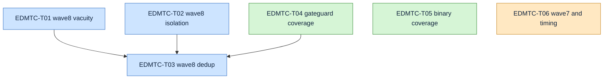

# EDMTC Ticket Pack -- P2 Test-Coverage Debt

Generated From: analysis.md (fix-pack; no SRD -- phases 1, 2, 3 and 5 recorded skipped)

## Legend

| Size | Meaning |
|---|---|
| XS | One assertion plus its control, one file |
| S | Two to four assertions, one file |
| M | A shared helper plus its call sites, or fixture work across files |
| L | Not used in this pack -- any L ticket must be decomposed |

## Cross-cutting acceptance criteria

These bind every ticket in this pack. They are not restated per ticket.

- **CC1**: every assertion added or repaired carries a NEGATIVE CONTROL that proves it can fail --
  inject the defect into a scratch copy and confirm rejection. EDMV4 fixed fifteen findings of the
  "assertion that cannot fail" class; this pack exists because of that class and must not add to it.
- **CC2**: no self-matching scan. A scan whose own comment carries the token it greps for fails on
  the prose describing it (six recorded instances). Strip comment lines or phrase the comment so it
  cannot self-match, and add a positive control injecting a real occurrence on a code line.
- **CC3**: no `var="$(cmd | ...)"` under `set -e` (twelve recorded instances -- it aborts the suite
  mid-run rather than failing an assertion), and no `$?` read after a pipe.
- **CC4**: bash 3.2 floor. No associative arrays, no `${var^^}`, no `mapfile`/`readarray`, no
  process substitution in a loop condition. Required binaries stay `bash`, `jq`, `git`.
- **CC5**: ASCII only. `wave8-smoke.sh` stays executable, and any new band is appended BEFORE the
  file's own `Results:`/`exit` lines.
- **CC6**: the suite total never drops below the fork baseline of 3870 passed / 0 failed across 8
  suites. A lower count after a change is a regression, not a tidy-up.

## Ticket index

| ID | Title | Size | Findings | Target |
|---|---|---|---|---|
| EDMTC-T01 | Repair four wave8 assertions that verify less than they claim | S | CA-068, CA-069, CA-080, CA-099 | `bin/tests/wave8-smoke.sh` |
| EDMTC-T02 | Make wave8 independent of live shared state and of this repository | M | CA-094, CA-095, CA-096, CA-098 | `bin/tests/wave8-smoke.sh` |
| EDMTC-T03 | Consolidate wave8's scratch-dir and extractor duplication | M | CA-104, CA-118, CA-119 | `bin/tests/wave8-smoke.sh` |
| EDMTC-T04 | Cover edm-gateguard's unexercised paths | M | CA-066, CA-127, CA-130, CA-131 | `bin/edm-gateguard` coverage |
| EDMTC-T05 | Cover readiness, hookify list, and stop-gate's died-validate branch | S | CA-128, CA-129, CA-132 | three binaries |
| EDMTC-T06 | Fix wave7's tautological control and host-polluting cases, and timing's blind budget | S | CA-097, CA-102, CA-126 | `wave7-smoke.sh`, `timing.sh` |

Six tickets, 21 findings, no orphans: every ID in `inherited-findings.jsonl` appears exactly once.

## Critical path

T01, T02 and T04 all append bands to `wave8-smoke.sh`, so T03's consolidation runs after them --
deduplicating extractors before the new bands land would leave the new bands re-introducing copies.
T05 and T06 touch disjoint files and are independent.

## Finding coverage map

| Finding | Ticket |
|---|---|
| CA-066 | EDMTC-T04 |
| CA-068 | EDMTC-T01 |
| CA-069 | EDMTC-T01 |
| CA-080 | EDMTC-T01 |
| CA-094 | EDMTC-T02 |
| CA-095 | EDMTC-T02 |
| CA-096 | EDMTC-T02 |
| CA-097 | EDMTC-T06 |
| CA-098 | EDMTC-T02 |
| CA-099 | EDMTC-T01 |
| CA-102 | EDMTC-T06 |
| CA-104 | EDMTC-T03 |
| CA-118 | EDMTC-T03 |
| CA-119 | EDMTC-T03 |
| CA-126 | EDMTC-T06 |
| CA-127 | EDMTC-T04 |
| CA-128 | EDMTC-T05 |
| CA-129 | EDMTC-T05 |
| CA-130 | EDMTC-T04 |
| CA-131 | EDMTC-T04 |
| CA-132 | EDMTC-T05 |
