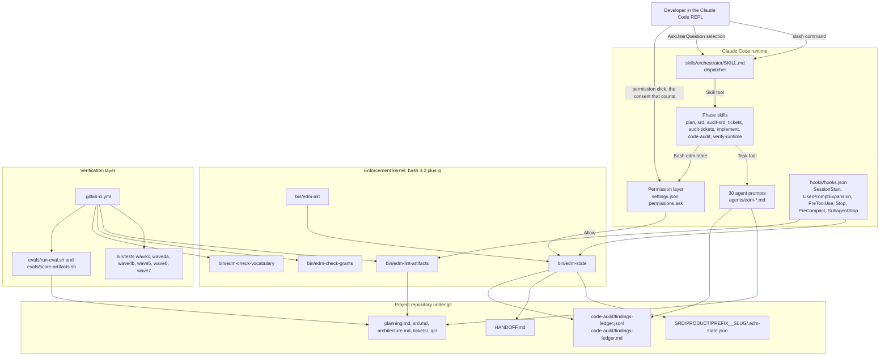
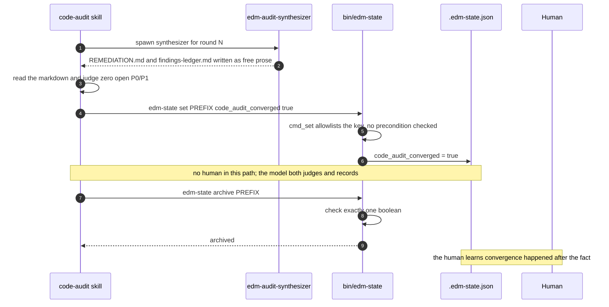
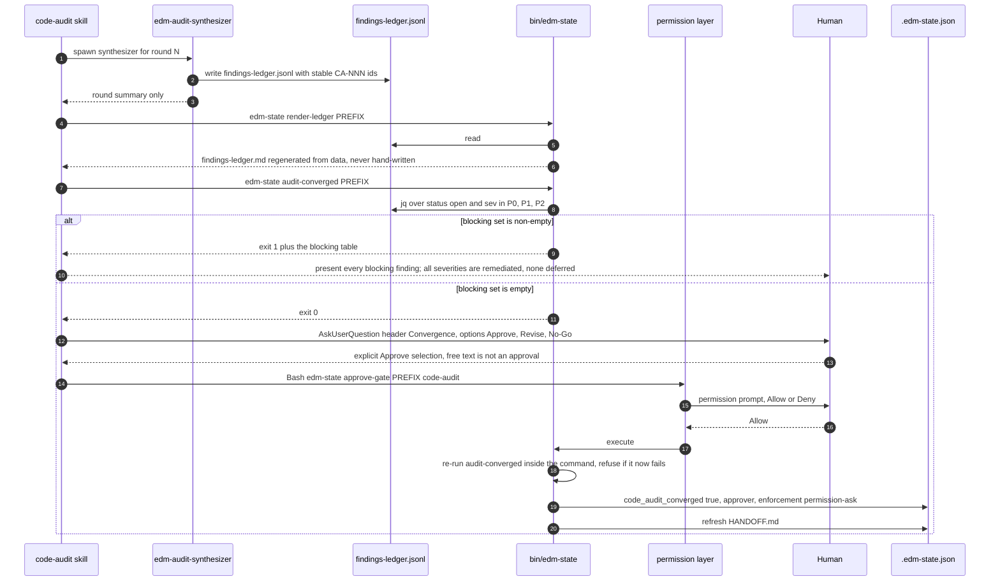
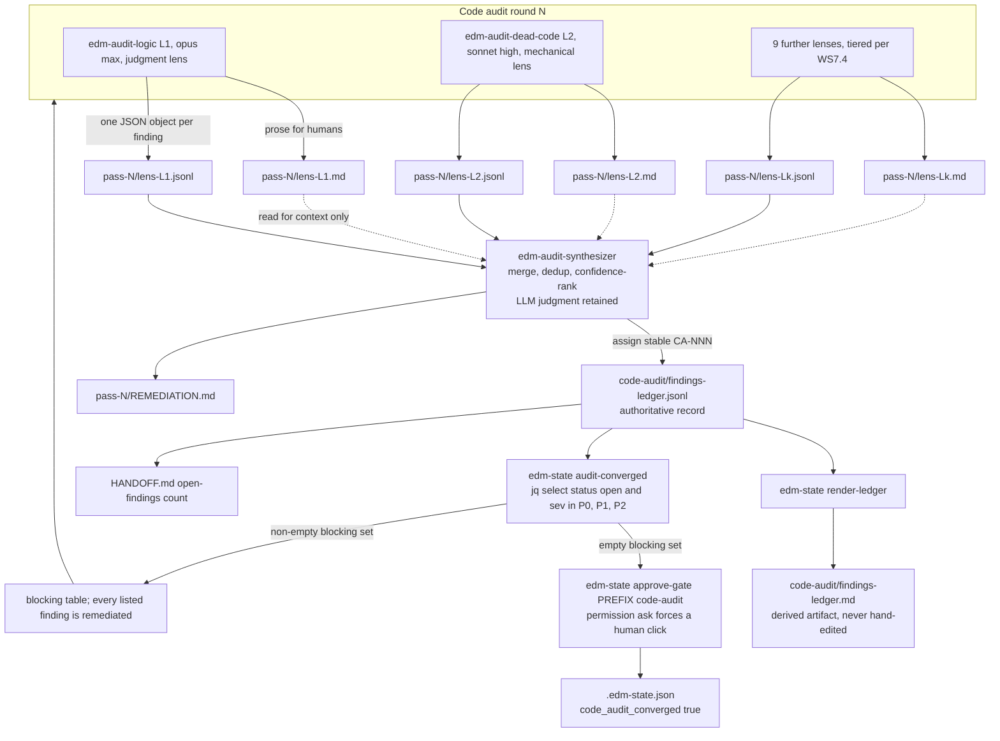
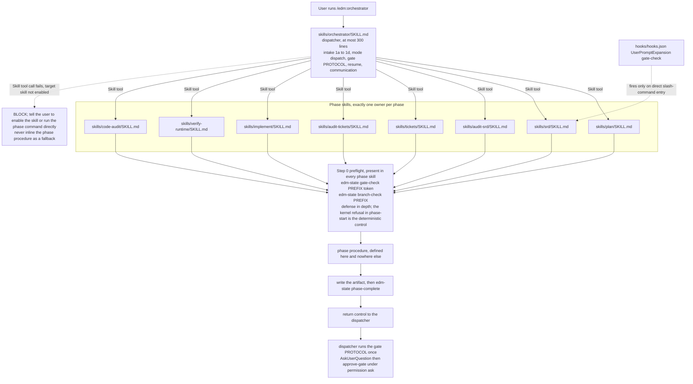
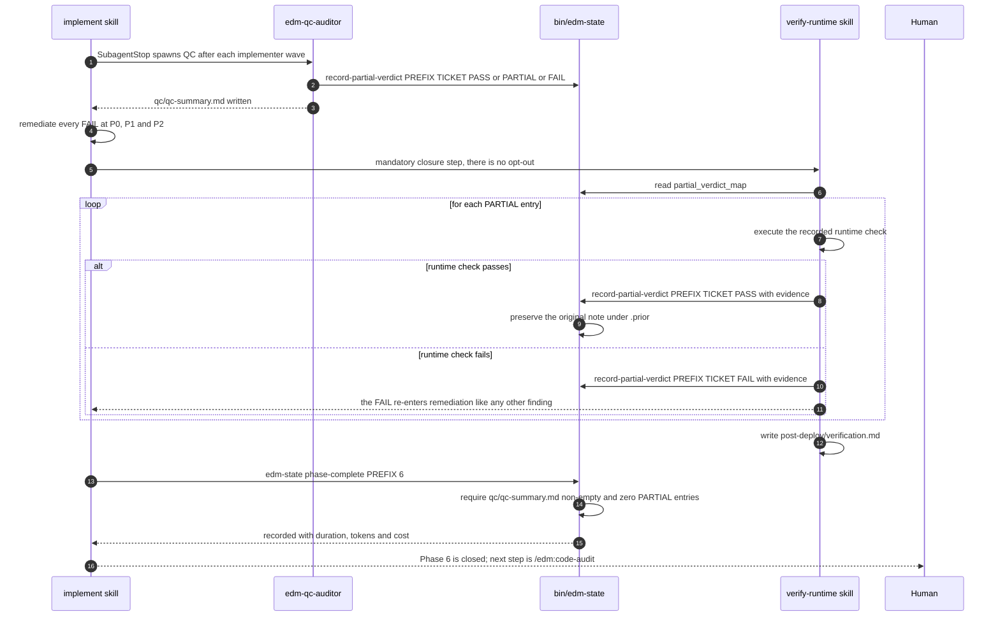
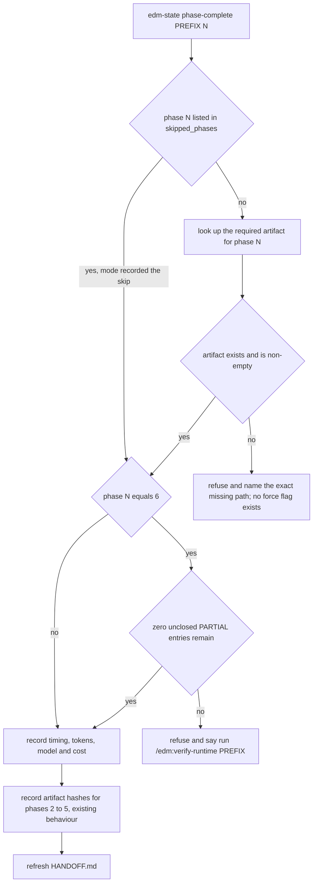
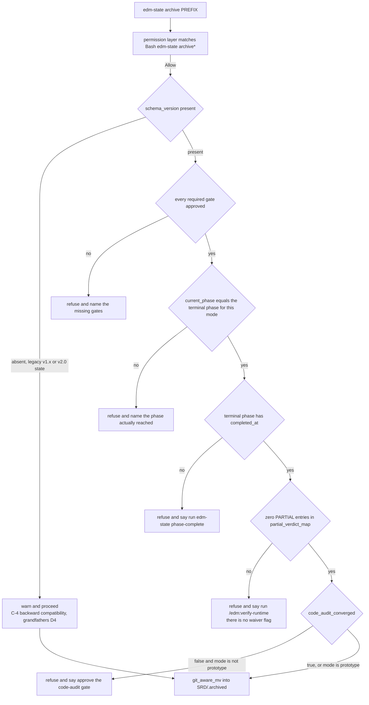
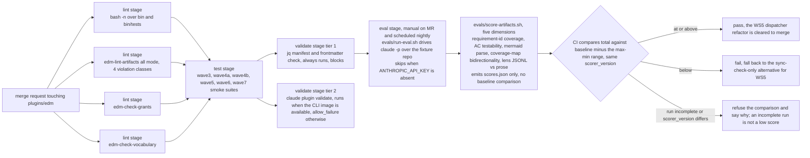

# Target Architecture: EDMV3

**Initiative**: `SRD/edm/EDMV3__prompt-streamline/`
**Subject system**: `plugins/edm/` (EDM Claude Code plugin, v2.0.0)
**Sources**: `planning.md` (Gate-1 approved, WS1-WS10), `EDM-REVIEW.md` (F1-F11 / R1-R8),
`decisions.md` (D1-D15)
**Companion**: this document is referenced by `srd.md` Section 5. Diagrams and decision records
live here, not in the SRD body.
**Revision**: revised 2026-07-25 alongside `srd.md` v1.1.0 to apply the round-1 audit
(`audit-srd.md`, arbitration ruling 15 plus findings B-05, B-10, B-11, B-12, B-15, B-19, B-20,
B-35, B-36, B-37, B-38, B-39, B-40, C-21, C-22, C-25, C-26, C-42). The divergence cluster between
this document and `srd.md` is eliminated: archive terminal-phase derivation, the phase-6 PARTIAL
precondition, the `update-patterns` insertion heading, `schema_version` settability, the gate
header string, the canonical Mermaid section name, the eval's fifth dimension and its threshold,
three new-file paths, and the exit-code contract now agree in both documents.

---

## Architecture Decision

### AD-1 (primary): `bin/edm-state` becomes the enforcement kernel; prompts become the presentation layer

**The decision.** Every methodology invariant that can be checked deterministically moves out of
markdown prose and into `bin/edm-state`, backed by two mechanisms the model cannot talk its way
past: (1) a Claude Code permission `ask` rule on the two state-mutating commands that represent
human consent (`approve-gate`, `archive`), and (2) precondition checks inside the bash commands
themselves. Skills and agents keep exactly one job at the gate boundary -- assemble the summary,
present `AskUserQuestion`, and issue the command. They lose the job of *deciding whether the
transition is legal*.

**Why this and not something else.** The review documents the same defect class three times
(`EDM-REVIEW.md` F1: Gate 3.5 in the 2026-06-10 external audit, the convergence auto-set, and a
live methodology bypass during this very initiative). The common factor is not bad prose -- the
prose is good, `skills/orchestrator/SKILL.md:396-400` and `:645` are precise and correct. The
common factor is that prose is the *only* layer. A three-command bypass exists today and was
reproduced:

```
edm-init --product demo --description branch-test TESTX
edm-state set TESTX code_audit_converged true
edm-state archive TESTX
```

Each of the three steps is defeated by a different piece of AD-1: `edm-init` gains the branch
handshake so first-run works at all, `cmd_set` gains an allowlist that refuses gate-ish keys, and
`cmd_archive` gains lifecycle verification. No prompt change can produce that outcome.

The pattern is not novel to this codebase -- it is already present and working. `cmd_approve_gate`
already stores Gate 3.5 as a dedicated boolean (`bin/edm-state:590-609`), `cmd_phase_complete`
already records artifact hashes for drift detection (`:674-686`), `cmd_gate_check` already refuses
phase entry deterministically (`:1194-1237`), and `bin/edm-lint-artifacts` already blocks commits
on three deterministic violation classes. AD-1 is "do what `bin/edm-state` already does well,
everywhere it is currently missing," not a new paradigm.

**The trade-off accepted.** Enforcement costs an extra physical click per gate, and it costs
strictness: a legitimate exception can no longer be waved through by explaining it to the model.
D13 removes the escape valves this would normally justify (`--force` on `phase-complete`,
`--accept-partials` on `archive`), so the only exemption paths left are structural and recorded in
state: `skipped_phases` entries and the `mode`-derived terminal phase. That is a deliberate
usability cost, paid because the alternative -- an override flag -- is the exact mechanism that
turns an enforced invariant back into a suggestion. The residual risk is that a user with a
genuine edge case edits `.edm-state.json` by hand; that is visible in git diff, which is the
correct place for an exception to surface.

**One honest gap, made measurable rather than hidden.** Permission `ask` rules live in user/project
settings, not in the plugin. A user can delete them. AD-1 therefore does not pretend the click is
guaranteed -- instead `cmd_approve_gate` detects whether the rule is present and records
`enforcement: "permission-ask"` or `enforcement: "prose-only"` on every recorded approval, and
`edm-state validate` / `session-start` warn when the rules are absent. An approval taken without
mechanical enforcement is still recorded, but it is recorded *as such*, permanently, in a
git-committed file. This converts an unfixable gap into an audited one.

### AD-2: findings become data; convergence becomes a query

Lenses emit prose (for humans) *and* JSONL (for machines). The synthesizer keeps its LLM judgment
-- merge, dedup, confidence-rank -- but its authoritative output is
`code-audit/findings-ledger.jsonl`, not markdown. `code-audit/findings-ledger.md` is *rendered
deterministically* by `edm-state render-ledger`, never hand-written. Convergence becomes
`edm-state audit-converged`, a jq predicate over `status == "open" and sev in {P0, P1, P2}`.

The alternative -- keeping markdown and parsing it -- was rejected because a fragile parser over
output we control is strictly worse than controlling the output. The alternative of having the
*synthesizer* write both the JSONL and the markdown was rejected because it recreates the
dual-output drift the plan names as a riskiest assumption; a deterministic renderer makes drift
structurally impossible rather than detectable after the fact.

### AD-3: the orchestrator becomes a dispatcher; the phase skill owns its phase

Per D10. `skills/orchestrator/SKILL.md` keeps intake (Steps 1a-1d), mode dispatch, the gate
PROTOCOL written once, resume logic, and per-phase Skill-tool invocation. Phase procedures move to
the phase skills and exist in exactly one place. Two structural additions make this safe, and both
are new relative to `planning.md`:

1. **Step 0 preflight in every phase skill.** The `UserPromptExpansion` gate-check hooks
   (`hooks/hooks.json:13-78`) fire on *user prompt* expansion of `/edm:srd`, `/edm:audit-srd`,
   `/edm:tickets`, `/edm:audit-tickets`, `/edm:implement`. When the dispatcher invokes a phase
   skill through the Skill tool instead, that hook path is not a user prompt. Without
   compensation, WS5 would *remove* deterministic gate enforcement from the primary flow while
   appearing to strengthen it. Every phase skill therefore begins with its own
   `edm-state gate-check <PREFIX> <phase>` plus `edm-state branch-check <PREFIX>` -- the same
   binary the hook calls, now entry-path independent. The hooks stay as defense in depth for the
   direct-invocation path.
2. **An explicit failure contract for the Skill-tool boundary.** If the call fails (target skill
   not enabled), the dispatcher BLOCKs with a remediation message and stops. It must never fall
   back to inlining the phase procedure -- that fallback is precisely the duplication WS5 exists
   to delete, and it would re-grow silently.

### AD-4: verification is a first-class plane, and it ships before the risky refactor

`.gitlab-ci.yml` plus `plugins/edm/evals/` are not a nice-to-have appended at the end. WS3 lands in
wave A specifically so the WS5 prompt refactor has a before/after number. The eval baseline must be
captured on wave-A code, before any wave-B prompt edit -- otherwise the regression harness measures
nothing.

### Scope boundary (D14)

Phases-as-data (`phases.json` interpreted by a slim orchestrator) is **out of scope for EDMV3** as
a scope boundary, not a deferral. No EDMV3 requirement depends on it and no EDMV3 work is left
incomplete pending it. This architecture is deliberately compatible with it -- the phase artifact
map in AD-1 is its first column and the AD-3 dispatcher is its interpreter -- but that is a
consequence of good factoring, not a commitment.

---

## Component Design

### Plane 1 -- Enforcement kernel (bash 3.2 + jq, no network, no services)

| Component | File path | Responsibility | Interface | Dependencies |
|---|---|---|---|---|
| Convergence gate | `plugins/edm/bin/edm-state` `cmd_approve_gate` (today `:590-609`) | Record a human gate approval, including the new non-numeric `code-audit` gate | In: `<PREFIX> <1\|2\|3\|3.5\|code-audit>`. Out: exit 0 + confirmation line, or exit 1 naming the blocker. Writes `gates_approved[]` (integers only) or `compliance_gate_approved` / `code_audit_converged` booleans, each with `approved_at`, `approver`, `enforcement` | `rmw_state`, `state_file_for`, `write_handoff_internal`, `cmd_audit_converged` (for the `code-audit` branch), `check_permission_rules` |
| Settable-key allowlist | `plugins/edm/bin/edm-state` `cmd_set` (today `:474-496`) | Refuse writes to keys outside an enumerated set; refuse gate-ish keys entirely | In: `<PREFIX> <key> <value>`. Out: exit 1 listing valid keys on unknown key; exit 1 naming `approve-gate` on `code_audit_converged` / `compliance_gate_approved` / `gates_approved`. **`schema_version` is not settable here at all**: it is an integer (1 wave A, 2 wave B, 3 wave C only if shapes change), written by `cmd_init` and advanced only by `cmd_migrate_schema`. Making it a monotonic-increase-only settable key would reopen the hand-flip path the allowlist exists to close (srd.md EDMV3-13) | `rmw_state` |
| Phase artifact verification | `plugins/edm/bin/edm-state` `cmd_phase_complete` (today `:622-689`) | Refuse to record a phase as complete unless its deliverable exists and is non-empty | In: `<PREFIX> <1..6>`. Out: exit 1 naming the exact missing path. Exempt from the **artifact** check only when phase N is in `.skipped_phases[]`. **Phase 6 additionally requires zero unclosed `PARTIAL` entries, and a skipped phase 6 is not exempt from that** -- routing the skip past it would create an unrecorded exemption. srd.md EDMV3-16 carries the matching AC, so the two documents agree. Phase 6 accepts `qc/qc-summary.md` **or** any `qc/qc-shard-*.md`. No force flag exists (D13) | `initiative_dir_for`, `present_or_absent` (`:338-340`), `SRD_FILENAME`, `TICKET_PACK_DIRNAME`, `rmw_state`, `record_artifact_hash` |
| Kernel gate enforcement | `plugins/edm/bin/edm-state` `cmd_gate_check` (`:1194-1237`), `cmd_phase_start` | Make gate enforcement independent of entry path, since the Skill-tool path bypasses the `UserPromptExpansion` hooks | `cmd_gate_check` gains the `plan`, `code-audit` and `verify-runtime` tokens (today they fall through `*) return 0` at `:1201-1209`), a **hard-error default branch** so a typo cannot silently disable enforcement, and mode/skipped-phase awareness via the same derivation `archive` uses. `cmd_phase_start` refuses when the phase's mode-derived prerequisite gate is unapproved. This -- not the Step 0 prose block -- is the deterministic control (srd.md EDMV3-115) | `required_gates_for_mode`, `terminal_phase_for_mode` |
| Archive lifecycle verification | `plugins/edm/bin/edm-state` `cmd_archive` (today `:860-903`) | Refuse to archive unless the full lifecycle actually happened | In: `<PREFIX>`. Checks: required gates approved, `current_phase` equals `terminal_phase_for_mode()`, terminal phase has `completed_at`, zero unclosed `PARTIAL` entries, `code_audit_converged`. The existing `-n "$product_name"` conjunct at `:887` is **deleted**, so a flat-layout initiative is checked too. `prototype` waives the convergence check only, not the others. Out: exit 1 naming the first failed check. Legacy state (no `schema_version`) degrades to warn-and-proceed per C-4. **Wave split**: gates, terminal phase and `completed_at` land in wave A; the PARTIAL and `audit-converged` sub-checks are wired in wave B (srd.md EDMV3-17) | `terminal_phase_for_mode`, `required_gates_for_mode` (NEW), `gated_phase_for_gate` (`:344-346`), `read_bool`, `git_aware_mv`, `initiative_dir_for` |
| Mode derivation | `plugins/edm/bin/edm-state` `terminal_phase_for_mode()`, `required_gates_for_mode()`, `code_audit_required_for_mode()` (NEW helpers) | Answer, in exactly one place, which gates a lifecycle produces and where it ends | In: `mode`, `lifecycle_mode`, `skipped_phases`. Out: terminal phase number; the required gate set; whether a code audit is required. `gated_phase_for_gate` supplies the gate-to-phase half only -- it is mode-blind and cannot answer either question alone. Consumed by `phase-start`, `gate-check`, `phase-complete` and `archive`, so there is one mapping rather than four | `gated_phase_for_gate` (`:344-346`) |
| Schema migration | `plugins/edm/bin/edm-state` `cmd_migrate_schema` (NEW) | Stop every pre-wave-A initiative from being permanently exempt from the kernel | In: `<PREFIX>`. Prints the lifecycle facts it found, requires operator confirmation, then stamps the highest `schema_version` whose shapes the initiative actually satisfies. Never lowers it, never touches `SRD/.archived/`. `state_anomalies` raises informational `SCHEMA_VERSION_MISSING` for any non-archived initiative without it | `rmw_state`, `initiative_dir_for` |
| Computed convergence | `plugins/edm/bin/edm-state` `cmd_audit_converged` (NEW) | Answer "is this audit converged" from data, not opinion | In: `<PREFIX>`. Out: **exit 0** (converged, or no audit required for this mode), **exit 1** (blocking findings remain, the latest round was partial, or a line carries an out-of-enum `status`), **exit 3** (no JSONL ledger). Exit 2 is deliberately unused so it stays reserved for "usage or environment error" across the new `bin/edm-check-*` scripts; 3 also matches `cmd_validate`'s existing convention at `:1252`. Predicate: `jq -s '[.[] \| select(.status=="open" and (.sev=="P0" or .sev=="P1" or .sev=="P2"))] \| length == 0'`, plus a latest-round `round_type == "full"` requirement | `initiative_dir_for`, `jq`, `code-audit/findings-ledger.jsonl` |
| Ledger renderer | `plugins/edm/bin/edm-state` `cmd_render_ledger` (NEW) | Regenerate `findings-ledger.md` from `findings-ledger.jsonl` so the two cannot drift | In: `<PREFIX>`. Out: writes `code-audit/findings-ledger.md` atomically (temp + `mv -f`, mirroring `_rmw_state_body`). Emits the same table shape documented at `agents/edm-audit-synthesizer.md:128-140`, minus the removed `deferred` status | `initiative_dir_for`, `jq` |
| Audit-round accounting | `plugins/edm/bin/edm-state` `cmd_audit_round_complete` (NEW; pairs with `cmd_audit_round_start` `:1394-1406`) | Capture tokens, duration and cost per code-audit round so post-phase-6 audit spend is visible | In: `<PREFIX> <code\|srd\|tickets>`. Out: writes `.audit_round_durations[type][N]` with the same token/cost shape `cmd_phase_complete` uses | `get_session_tokens_since`, `compute_cost_usd`, `rmw_state` |
| Permission-rule detector | `plugins/edm/bin/edm-state` `check_permission_rules()` (NEW helper) | Determine whether the `ask` rules for `approve-gate` and `archive` are configured | In: none. Out: `permission-ask` or `prose-only` on stdout. Scans `.claude/settings.json`, `.claude/settings.local.json`, `~/.claude/settings.json` with jq; unreadable or unparseable files yield `prose-only` plus a warning, never a failure | `jq` |
| Anomaly surface | `plugins/edm/bin/edm-state` `state_anomalies()` (`:419-467`), `cmd_session_start` (`:1349-1388`) | Surface missing permission rules and unclosed PARTIALs where a human will see them | Adds anomaly codes `PERM_RULES_MISSING` and `PARTIAL_UNCLOSED` in the existing `<CODE>  <field>  <description>` line format | `check_permission_rules` |
| Pattern-library writer | `plugins/edm/bin/edm-state` `cmd_update_patterns` (`:1576-1692`) | Insert novel findings under the correct existing `##` heading with `status: pending-review`, never at EOF | In: `<PREFIX> <srd\|ticket\|qc\|code>`. Inserts `###` blocks under **`## Anti-Patterns`, the default target**, in the five audit-type docs only (README.md is not contract-bound); if the heading is absent the command skips with a message rather than appending at EOF. Anti-Patterns is the self-consistent default because srd.md EDMV3-55 places this initiative's own entries there. awk split + reassemble + atomic rename. Existing read-only-plugin skip at `:1622-1625` retained | `docs/audit-patterns/*.md`, `initiative_dir_for` |
| Help-text robustness | `plugins/edm/bin/edm-state` dispatch (`:1977-2023`), help at `:2018` | Stop the help output from silently truncating as subcommands are added | Replace `sed -n '2,39p' "$0"` with a sentinel range from `^# Usage:` to `^set -euo pipefail$`, dropping the last line | none |
| Branch handshake | `plugins/edm/bin/edm-init` (after the branch block at `:168`) | Record the branch the process actually ended up on, so `branch-check` reflects truth | After `:168`: read `git rev-parse --abbrev-ref HEAD` and call `edm-state set "$PREFIX" initiative_branch "$CURRENT"`. Records HEAD, not the intended `$BRANCH`, so the warn-and-continue paths at `:161-166` also record truthfully (D3) | `edm-state cmd_set` allowlist must include `initiative_branch` |
| Mermaid lint class | `plugins/edm/bin/edm-lint-artifacts` (new `build_mermaid_line_set()` + class 4) | Flag a literal `;` inside Mermaid node, edge or message label text | Per line inside a ` ```mermaid ` fence: strip legal `#[0-9]{1,5};` entity refs, extract label spans (`[...]`, `"..."`, `{...}`, `(...)`, `\|...\|`, and sequence-message text after the first `:`), report `mermaid-semicolon` if a `;` survives inside any span. Inverse of the existing `build_ignore_set` (`:69-109`), which skips fenced blocks | existing `report_violation`, `is_ignored_line`, ignore-marker infrastructure |
| Lint all-mode | `plugins/edm/bin/edm-lint-artifacts` (new `--all` flag) | Let CI lint every tracked artifact tree without duplicating the hook's prefix-derivation awk | In: `--all`. Enumerates prefixes the same way `hooks/hooks.json:86` does, then loops the existing per-prefix scan | `edm-state resolve-dir` |
| Agent grant/instruction check | `plugins/edm/bin/edm-check-grants` (NEW) | Assert every agent instructed to write a file has `Write`, and every agent instructed to run a binary has the matching `Bash(...)` grant | In: none (repo-relative). Sources of write-instructions: (a) `agents/*.md` bodies, (b) **launch templates inside `skills/*/SKILL.md`**, (c) hook prompts in `hooks/hooks.json`. Out: one line per violation, exit 1 if any. bash 3.2: flat `name<TAB>tools<TAB>disallowed` temp file, no associative arrays | `plugins/edm/agents/`, `plugins/edm/skills/`, `plugins/edm/hooks/hooks.json` |
| Deferral-vocabulary check | `plugins/edm/bin/edm-check-vocabulary` (NEW) | Give D13(d) a deterministic backstop instead of a prose promise | In: none. Scans `skills/`, `agents/`, `docs/` (incl. `docs/audit-patterns/qc-audit.md`), **`hooks/hooks.json`**, **`monitors/monitors.json`**, `CLAUDE.md`, `README.md` and **`bin/`** for a banned token set (`defer`, `deferred`, `deferral`, `deferred-to-runtime`, `accept-partials`, `maintenance window`, `--force`) minus an allowlist file. Must parse JSON-escaped prompt strings, not only markdown -- `hooks/hooks.json:117` is the highest-leverage occurrence in the tree. Out: `path:line: vocabulary: token: snippet`, exit 0/1/2 | `plugins/edm/bin/vocabulary-prohibited.txt` (NEW), `plugins/edm/bin/vocabulary-allowlist.txt` (NEW) -- both under `bin/`, matching srd.md EDMV3-43 |

### Plane 2 -- Data (git-committed, no database)

| Artifact | Path | Producer | Consumer | Shape change in EDMV3 |
|---|---|---|---|---|
| Initiative state | `SRD/{PRODUCT}/{PREFIX}__{SLUG}/.edm-state.json` | `bin/edm-state` only, always through `rmw_state` under advisory lock (`:312-319`) | every skill, hook and script | Adds `schema_version` (int, absent means legacy), `enforcement` per gate entry, `.prior` on closed PARTIAL entries, `.audit_round_durations`. Removes `lifecycle_mode=partial` from the enum (D12) |
| Lens prose report | `.../code-audit/pass-{N}_{DATE}/lens-L{k}.md` | 11 lens agents | humans, synthesizer (context only) | Unchanged shape; gains a `Confidence` field per finding |
| Lens findings data | `.../code-audit/pass-{N}_{DATE}/lens-L{k}.jsonl` (NEW) | 11 lens agents | synthesizer | One JSON object per line: `{"schema":1,"id":null,"lens":"L1","sev":"P1","confidence":"high","file":"...","line":42,"title":"...","status":"open"}` |
| Findings ledger (authoritative) | `.../code-audit/findings-ledger.jsonl` (NEW) | `edm-audit-synthesizer` | `cmd_audit_converged`, `cmd_render_ledger`, HANDOFF writer | Adds `id` (stable `CA-NNN`), `lenses[]`, `raised_round`, `resolved_round`. Status enum is `open \| fixed \| noted` -- `deferred` is deleted (D13) |
| Findings ledger (human) | `.../code-audit/findings-ledger.md` | `edm-state render-ledger` (was: the synthesizer) | humans, PR reviewers | Becomes a derived artifact. Same canonical path preserved (it is on the review's "genuinely good" list) |
| Runtime verification | `.../post-deploy/verification.md` | `/edm:verify-runtime` | archive check, humans | Promoted from on-demand to **mandatory Phase 6 closure output** (D13) |
| Pattern library | `plugins/edm/docs/audit-patterns/{srd,ticket,qc,code,test-coverage}-audit.md` | `cmd_update_patterns` + humans at the audit gate | `edm-srd-writer`, `edm-ticket-writer`, `edm-implementer` at write time | New entries land under `## Top Recurring Findings` as `###` blocks marked `status: pending-review`. The four-`##` contract (`docs/audit-patterns/README.md:5-20`) is now enforced by the tool, not just documented |

### Plane 3 -- Prompts

| Component | File path | Responsibility | Interface | Dependencies |
|---|---|---|---|---|
| Dispatcher | `plugins/edm/skills/orchestrator/SKILL.md` (645 -> at most 300 lines, derived in srd.md EDMV3-46) | Intake, mode dispatch, the gate PROTOCOL written once, resume, Skill-tool invocation of phase skills | In: `$ARGUMENTS`. Out: Skill-tool calls, `AskUserQuestion` gates, `edm-state approve-gate` invocations. `allowed-tools` gains `Skill` | phase skills, `bin/edm-state`, `bin/edm-init` |
| Phase skills | `plugins/edm/skills/{plan,srd,audit-srd,tickets,audit-tickets,implement,code-audit}/SKILL.md` | Own their phase procedure exclusively; run Step 0 preflight; write the artifact; call `phase-complete`; hand control back for the gate | In: `<PREFIX>`. Step 0: `edm-state gate-check` + `branch-check`. Out: artifact + `phase-complete`. The weak gate text at `skills/plan/SKILL.md:130-132`, `skills/audit-srd/SKILL.md:122-124`, `skills/audit-tickets/SKILL.md:127-129` is deleted | dispatcher gate PROTOCOL by name, `bin/edm-state` |
| Runtime verification skill | `plugins/edm/skills/verify-runtime/SKILL.md` (NEW) | Drive every recorded runtime check to a verdict; close every PARTIAL | In: `<PREFIX>`. Reads `partial_verdict_map`. For each `PARTIAL`: run the check, then `edm-state record-partial-verdict <PREFIX> <ticket> PASS\|FAIL '<evidence>'`. A FAIL re-enters remediation. Writes `post-deploy/verification.md`. Mandatory, no opt-out path | `bin/edm-state`, `qc/qc-summary.md` |
| Lens agents | `plugins/edm/agents/edm-audit-{logic,dead-code,edge-cases,test-quality,runtime,docs,consistency,security,spec,dry,wiring}.md` | Hunt one dimension; emit prose + JSONL; state confidence | `## Output Format` gains the JSONL contract and `Confidence: high\|medium\|low`. Tiering: L1, L3, L4, L8, L9, L11 stay `opus`/`max`; L2, L5, L6, L7, L10 move to `sonnet`/`high`. **`tools:` gains `Write`; `disallowedTools:` keeps `Edit, NotebookEdit`** | pass directory paths from `skills/code-audit/SKILL.md` |
| Synthesizer | `plugins/edm/agents/edm-audit-synthesizer.md` | Merge, dedup, confidence-rank; emit the authoritative JSONL ledger | Writes `findings-ledger.jsonl` only. Filter criterion 4 at `:39` (discard single-lens uncorroborated) is replaced by confidence-ranked retention. The `deferred` status and the "P2 deferred to next maintenance window" example at `:116,137,140` are removed | lens JSONL, prior ledger |
| Grant-corrected agents | `plugins/edm/agents/edm-qc-auditor.md`, `plugins/edm/agents/edm-explorer.md` | Persist their own artifacts | qc-auditor gains `Write, Bash(edm-state *), Bash(mkdir *), Bash(jq *)`, keeps `disallowedTools: Edit, NotebookEdit`. explorer gains `Write` (D5) | `bin/edm-check-grants` enforces the class |
| Canonical conventions | `plugins/edm/CLAUDE.md` | Single home for named-and-referenced rules | New **`## Mermaid diagram conventions (canonical)`** section beside `## Severity vocabulary (canonical)` -- the exact heading string, which a smoke assertion checks and which srd.md EDMV3-53 creates. Severity table P1/P2 rows lose deferral language. `Sec. 2` "Skills don't load other skills" (`:22-23`) is rewritten as the composition pattern plus its failure mode. Model table splits the lens row into two tiers. Platform constraint recorded (D11) | referenced by name from 11 touch points |

### Plane 4 -- Verification

| Component | File path | Responsibility | Interface | Dependencies |
|---|---|---|---|---|
| CI pipeline | `/.gitlab-ci.yml` (NEW, repo root) | Turn "checks that pass when someone remembers" into a gate | Stages: `lint`, `test`, `validate`, `eval`. Scoped with `rules:changes` on `plugins/edm/**` plus always-on for the default branch | all four bin scripts, the smoke suites, `evals/` |
| Enforcement smoke suite | `plugins/edm/bin/tests/wave6-smoke.sh` (NEW) | Prove every AD-1 rule, including the bypass as a must-fail | Sources `_harness.sh` (`:1-33`); scratch `EDM_SRD_ROOT` in `mktemp -d`. Cases: 3-command bypass must fail, `phase-complete` refusal per phase, skip-phase exemption, archive per-check refusal, `cmd_set` allowlist + gate-key refusal, `approve-gate code-audit`, legacy v2.0 state warn-and-proceed | `bin/edm-state`, `bin/edm-init`, `jq` |
| Class smoke suite | `plugins/edm/bin/tests/wave7-smoke.sh` (NEW) | Prove the class-level invariants, not instances | Cases: `edm-check-grants` exits 0, `edm-check-vocabulary` exits 0, every `edm-state set` key appearing in any skill/agent is on the allowlist, rendered ledger byte-matches a fresh `render-ledger` run, Mermaid lint class catches a planted violation | `bin/edm-check-grants`, `bin/edm-check-vocabulary`, `bin/edm-lint-artifacts` |
| Fixture repo | `plugins/edm/evals/fixtures/tiny-svc/` (NEW) | A small synthetic codebase with known, countable gaps | Committed source tree plus `expected.json` describing the gaps a good SRD should surface | none |
| Eval driver | `plugins/edm/evals/run-eval.sh` (NEW) | Execute plan -> srd -> audit headlessly against the fixture | In: `[--out DIR]`. Runs `claude -p` with a frozen initiative description (`evals/initiative.txt`) in a temp clone of the fixture. Out: artifact tree under `evals/out/<run-id>/` | `claude` CLI, `ANTHROPIC_API_KEY` |
| Eval scorer | `plugins/edm/evals/score-artifacts.sh` (NEW) | Score artifacts mechanically, no LLM in the loop | In: `<run-dir>`. **Exactly five dimensions, matching srd.md EDMV3-27 as the single definition**: (1) requirement-ID coverage, (2) AC testability from the vague-AC regexes in `plugins/edm/evals/vague-ac-patterns.txt`, (3) Mermaid parse success and label-rule violations, (4) coverage-map bidirectionality, (5) lens JSONL-versus-prose agreement. "Artifact presence and section floors" is **not** a dimension. Each normalizes 0-100 higher-is-better (dimension 2 inverted); the total is the unweighted mean; `scorer_version` and the ordered dimension list are recorded in the output. Out: `scores.json` only -- **the scorer performs no baseline comparison and never exits non-zero on a low score**. The pass/fail decision belongs to the CI job, which applies the max-minus-min tolerance from `evals/baseline/` (srd.md EDMV3-52); a strict below-baseline threshold here would red the pipeline on run-to-run noise | `jq`, `bin/edm-lint-artifacts` |
| Eval baseline | `plugins/edm/evals/baseline/scores.json` (NEW) | The number WS5 is measured against | Captured on wave-A code, **before** any wave-B prompt edit | `score-artifacts.sh` |

### Plane 5 -- Human consent

| Component | Where | Responsibility |
|---|---|---|
| Semantic consent | `AskUserQuestion` in the dispatcher gate PROTOCOL | Capture *which* decision the human made, with exact options. Free text is never approval (`skills/orchestrator/SKILL.md:396-400`, preserved verbatim, relocated to one place) |
| Mechanical consent | Claude Code permission layer, `permissions.ask` on `Bash(edm-state approve-gate*)` and `Bash(edm-state archive*)` | Guarantee a human interaction occurs before the state mutation, independent of prompt content, entry path, or compaction state |
| Setup documentation | `plugins/edm/README.md` + a shipped `.claude/settings.json` example | State the rules as required setup, not optional hardening |

---

## Diagrams

All diagrams follow the EDMV3 Mermaid rule established by this initiative: a literal semicolon
never appears inside node, edge or message label text. Where one is meant, the character reference
`#59;` (no leading ampersand) is used. End-of-statement separators outside label text remain legal.

### D-1. System context



### D-2. Convergence gate, BEFORE (today)



### D-3. Convergence gate, AFTER (target)



### D-4. Findings data plane



### D-5. Orchestrator as dispatcher, with the Skill-tool boundary



### D-6. Phase 6 close-out with mandatory runtime verification (D13)



### D-7. `phase-complete` artifact verification



The skipped-phase branch routes past the **artifact** check only. It still reaches the phase-6
PARTIAL gate, because a phase 6 entered into `skipped_phases` completing with open PARTIALs would
be an unrecorded exemption -- exactly what D13(b) forbids. `srd.md` EDMV3-16 carries the matching
acceptance criterion.

### D-8. `archive` lifecycle verification, no override edges (D13)



Required-gate derivation lives in `required_gates_for_mode()`, which **uses** `gated_phase_for_gate()`
(`bin/edm-state:344-346`, gate 1 -> phase 1, gate 2 -> phase 3, gate 3 -> phase 5) as its
gate-to-phase half. That helper alone cannot answer the question -- it is entirely mode-blind and
returns the same map for every initiative -- which is why the new helper exists rather than the
callers each calling it directly. Gate G is required if and only if its feeding phase is not in
`skipped_phases` and is at or below `terminal_phase_for_mode()` (`prototype` -> 2, everything else
-> 6, with `lifecycle_mode` affecting which phases are skipped rather than where the lifecycle
ends). Mode adaptations therefore drive enforcement through data already in state rather than
through a second parallel mechanism. `edm-init` and `cmd_set_mode` seed `skipped_phases` from the
mode's phase graph so the array is populated on the initiatives that need it, and `fast-track` and
`fix-pack` record both a `skip-phase 1` entry and a named gate approval for their single review
gate -- without that pairing, gate 1 derives as required while nothing ever records it and the
initiative can never archive.

Note what `prototype` waives in the diagram above: **the convergence check only**, at `C5`. It
still passes `C1` through `C4`. `srd.md` Section 5.4 draws the identical shape.

### D-9. CI and eval pipeline



The four lint jobs run in parallel and converge on the test stage, and the two validate tiers are
independent of each other, per `srd.md` EDMV3-103 AC2. Tier 1 is the deterministic `jq` check that
always runs and blocks; tier 2 is `claude plugin validate`, which needs the CLI image and is
conditional -- making it an unconditional blocking dependency would put wave A's exit criterion at
the mercy of runner image availability. `srd.md` EDMV3-23 specifies the same two-tier split.

---

## Data Flow

### Primary path: a gate approval, end to end

1. **Entry.** The human types `/edm:orchestrator <description>` (or resumes an existing PREFIX).
   `bin/edm-init` scaffolds `SRD/{PRODUCT}/{PREFIX}__{SLUG}/`, calls `edm-state init`, creates and
   checks out the branch, then performs the **post-checkout handshake**: reads
   `git rev-parse --abbrev-ref HEAD` and writes it back through
   `edm-state set <PREFIX> initiative_branch <HEAD>`. This records the branch actually occupied,
   including on the warn-and-continue failure paths at `bin/edm-init:161-166`, so Step 1d's
   `branch-check` reflects reality rather than the pre-checkout snapshot taken at
   `bin/edm-state:510`.
2. **Dispatch.** The dispatcher resolves mode fields from state, runs Step 1d safety checks, and
   invokes the phase skill through the Skill tool.
3. **Phase skill Step 0.** `edm-state gate-check <PREFIX> <phase>` (exit 1 blocks) and
   `edm-state branch-check <PREFIX>` (exit 1 blocks) run inside the skill, so enforcement does not
   depend on which entry path the user took.
4. **Phase body.** Agents are spawned via the Task tool. Each writes its own artifact directly --
   no proxying through the orchestrating context, which is what the grant fixes buy.
5. **Phase completion.** `edm-state phase-complete <PREFIX> N` verifies the artifact exists and is
   non-empty (per D-7), computes tokens and cost from session JSONL, records artifact hashes for
   phases 2-5, and refreshes HANDOFF.md.
6. **Gate presentation.** Control returns to the dispatcher, which renders the summary and calls
   `AskUserQuestion` with exact options. Free text is re-presented, never interpreted.
7. **Mechanical consent.** On an explicit Approve selection the model issues
   `Bash(edm-state approve-gate <PREFIX> N)`. The permission layer matches
   `Bash(edm-state approve-gate*)` and renders a prompt. Nothing executes until the human clicks.
8. **Recording.** `cmd_approve_gate` appends `{gate, approved_at, approver, enforcement}` to
   `gates_approved` (integers only) or sets the dedicated boolean for `3.5` / `code-audit`, then
   calls `write_handoff_internal`.

### Findings path: lens output to convergence

```
lens agent
  -> pass-N/lens-Lk.md      (prose, human-readable, unchanged contract)
  -> pass-N/lens-Lk.jsonl   (one object per finding, id null, confidence set)
       -> edm-audit-synthesizer  (LLM: merge, dedup, confidence-rank, CA-NNN assignment)
            -> code-audit/findings-ledger.jsonl   (authoritative)
                 -> edm-state render-ledger -> code-audit/findings-ledger.md (derived)
                 -> edm-state audit-converged -> exit 0 / exit 1 + blocking table
                 -> HANDOFF.md open-findings count
                 -> edm-state update-patterns code -> pattern library pending-review entries
```

Precedence is stated once and enforced once: **the JSONL is authoritative**. The markdown cannot
disagree with it because the markdown is generated from it, and `wave7-smoke.sh` asserts that a
fresh `render-ledger` reproduces the committed file byte for byte.

### Error paths

| Failure | Detected by | Behaviour |
|---|---|---|
| Artifact missing at phase completion | `cmd_phase_complete` | Exit 1 naming the exact path. The phase stays open. No force flag |
| Phase legitimately not run (mode variant) | `.skipped_phases[]` lookup | Artifact check skipped, timing still recorded. The exemption is a state record, visible in git |
| Unknown key passed to `set` | `cmd_set` allowlist | Exit 1 listing the valid key set |
| Gate-ish key passed to `set` | `cmd_set` refusal branch | Exit 1 naming `edm-state approve-gate <PREFIX> <gate>` |
| Convergence claimed with open findings | `cmd_audit_converged`, called both standalone and inside `cmd_approve_gate` | Exit 1 plus the blocking table. Convergence cannot be recorded |
| No JSONL ledger (legacy initiative) | `cmd_audit_converged` | **Exit 3** plus a warning. When `schema_version` is absent, `cmd_approve_gate code-audit` proceeds on human attestation alone and records `ledger: absent` -- warn-and-proceed per C-4. When `schema_version` is present, a missing ledger is a hard refusal naming `/edm:code-audit`, so a brand-new initiative cannot be approved through the gate without ever auditing (srd.md EDMV3-11 AC4) |
| Latest audit round was partial | `cmd_audit_converged` | Exit 1 naming the lens list that ran. A `--lenses` subset can never compute convergence (srd.md EDMV3-120) |
| Ledger line carries a status outside `open \| fixed \| noted` | `cmd_audit_converged` | Exit 1 naming the line and its CA-NNN id. A legacy `deferred` line is re-opened at its recorded severity, never skipped |
| Mode requires no code audit | `code_audit_required_for_mode()` | Exit 0 with the exemption wording, and the reason recorded in state. Otherwise `fast-track` and `fix-pack` could never archive |
| Unclosed PARTIAL at phase 6 close or archive | `cmd_phase_complete`, `cmd_archive` | Exit 1 pointing at `/edm:verify-runtime`. No waiver flag exists |
| Runtime check fails during verify-runtime | `/edm:verify-runtime` | The PARTIAL becomes a FAIL and re-enters remediation. It is never closed as accepted |
| An AC's runtime environment genuinely does not exist | ticket audit, or `/edm:verify-runtime` at the latest | **D15.** No `BLOCKED` verdict is recorded. The AC is a specification defect: reworked into something verifiable now, or its unverifiable clause moved to a follow-on initiative as a recorded scope boundary through gate change control. See R-G, which previously answered this case with `skip-phase` |
| Legacy state file meets new archive checks | `schema_version` absent | Every lifecycle check degrades to a warning and archive proceeds (C-4, D4). `SCHEMA_VERSION_MISSING` is raised as an informational anomaly for any non-archived initiative, and `cmd_migrate_schema` is the path out |
| State file at a `schema_version` below a check's minimum | per-check minimum version | That check warn-and-proceeds naming itself; checks at or below the recorded version enforce normally. This is the wave-A-created, wave-B-audited class |
| Missing state file at archive | `cmd_archive` | `MISSING_STATE_FILE` anomaly plus a warning, then proceed. Deleting the state file is visible rather than a silent bypass |
| Informational anomaly present, no blocking anomaly | `state_anomalies`, `cmd_validate` | Every anomaly is printed and `cmd_validate` exits **0**. It exits 3 only on a blocking anomaly (srd.md EDMV3-118); without the split, five new warning-only anomalies would each turn `validate` non-zero on a healthy initiative |
| Permission rules absent | `check_permission_rules()` | Approval still recorded, but tagged `enforcement: prose-only`, warned at `session-start` and flagged by `edm-state validate` |
| Skill-tool call fails | Dispatcher | BLOCK with remediation text. The dispatcher never inlines the phase procedure |
| Pattern library read-only (installed plugin) | `cmd_update_patterns` existing guard at `:1622-1625` | Skip with a message. The gate-time curation step also skips |
| Mermaid label contains a raw semicolon | `edm-lint-artifacts` class 4 | `path:line: mermaid-semicolon: snippet`, non-zero exit, pre-commit hook blocks the commit |
| Deferral vocabulary reintroduced | `edm-check-vocabulary` in CI | Job fails naming file and line |
| Concurrent `edm-state` writers | `with_state_lock` (`:359-396`) | flock with 10s timeout, or the mkdir spin-lock fallback with 50 tries. Unchanged |

---

## Integration Points

The ten integration points named in `planning.md` Complexity Estimate, plus the three genuinely
external systems. There are no message queues and no databases; the "protocol" for internal
integrations is process invocation with exit codes plus atomic file I/O.

| # | Integration point | Protocol / mechanism | Trust and auth boundary | Error handling |
|---|---|---|---|---|
| 1 | `edm-state` dispatch and help (`bin/edm-state:1977-2023`, help at `:2018`) | `case` dispatch on `$1`; help emitted by `sed` over the file header | none -- local process | Unknown subcommand dies naming `--help`. The `sed -n '2,39p'` range becomes a sentinel range so added subcommands cannot silently truncate the help text. The same change to `edm-lint-artifacts` `usage()` also restores its already-truncated header lines 20-22 (`sed -n '2,19p'` over a block running to 22) |
| 2 | `cmd_archive` (`:860-903`) | Local process, exit codes, `git mv` via `git_aware_mv` | Guarded by `permissions.ask` on `Bash(edm-state archive*)` | Refuses on the first failed lifecycle check, naming it. Legacy state warns and proceeds. `git mv` falls back to plain `mv` outside a worktree |
| 3 | `cmd_set` (`:474-496`) | Local process, typed jq write under `rmw_state` | Allowlist is the boundary | Unknown key: exit 1 with the valid set. Gate-ish key: exit 1 naming `approve-gate`. `schema_version`: monotonic-increase-only |
| 4 | `cmd_approve_gate` (`:590-609`) | Local process; `AskUserQuestion` upstream, permission prompt at the boundary | Two independent consents -- semantic (option selection) and mechanical (permission click) | For `code-audit`, re-runs `audit-converged` and refuses on a non-empty blocking set. Records `enforcement` honestly when the ask rule is absent |
| 5 | HANDOFF writer (`write_handoff_internal`, `:1700-1975`) | In-process call at every phase, gate, checkpoint and archive | none | Gains sections for open blocking findings, unclosed PARTIALs, pending pattern reviews and enforcement mode. Existing empty-safe rendering (`:1842`) is the pattern to follow for all new fields |
| 6 | Commit lint hook (`hooks/hooks.json:80-89`) | `PreToolUse` matcher on `git commit`; shells to `edm-lint-artifacts` per derived prefix | none | Picks up the new `mermaid-semicolon` class with no hook edit. `--all` must not alter single-prefix behaviour, or the hook regresses |
| 7 | `update-patterns` (`:1576-1692`) | Local process; awk split, reassemble, atomic rename | Plugin install dir may be read-only | Existing not-found and not-writable guards retained. Insert target is the existing **`## Anti-Patterns`** heading; if it is absent the command skips with a message rather than appending at EOF |
| 8 | Living-Library contract (`docs/audit-patterns/README.md:5-20` and the five audit-type docs) | Structural convention enforced by tooling and by `wave7-smoke.sh` | none | Only the five audit-type docs are contract-bound; `README.md` legitimately carries more `##` headings. New content is `###`-level only |
| 9 | `edm-init` handshake (`bin/edm-init:139`, `:148-168`) | Two sequential local process calls (`edm-state init`, then `edm-state set`) | none | If `git rev-parse` fails, no correction is written and the pre-checkout value stands; `branch-check` already tolerates an empty current branch (`:1276-1279`) |
| 10 | Skill-tool composition (dispatcher -> phase skills; `plugins/edm/CLAUDE.md:22-23`) | Claude Code Skill tool. Caller must list `Skill` in `allowed-tools`; precedent at `plugins/git/skills/commit/SKILL.md:6,111` | Plugin-enablement boundary | Target skill not enabled: BLOCK with remediation text, never an inline fallback. Depth behaviour (a skill calling a skill mid-flow, six times, with state handoffs) is validated by the wave-B spike before the refactor commits |
| E1 | git / GitLab | Local `git` CLI; CI over GitLab runners | Developer's existing git credentials; CI job tokens | `git_aware_mv` falls back to `mv`; `git-lock-check` (`:1292-1317`) already handles stale `index.lock` |
| E2 | Anthropic API (eval job only) | HTTPS via the `claude` CLI in headless `-p` mode | `ANTHROPIC_API_KEY` as a masked, protected CI variable | Eval stage is `manual` on MRs and scheduled nightly, never blocking on a missing key. A run failure marks the job failed without gating lint or test stages |
| E3 | Jira via Atlassian MCP (`skills/push-jira/`) | MCP over HTTPS | Existing MCP auth, unchanged | Explicitly untouched by EDMV3. The existing opt-in probe and skip-with-message behaviour stands |

---

## Architectural Risks

### R-A. WS5 rewrites the most-loaded prompt in the system

The dispatcher refactor touches `skills/orchestrator/SKILL.md` (645 lines, loaded on every
initiative) and moves six phase procedures. A regression here is expensive and hard to see.

*Mitigation*: WS3's fixture eval provides a before/after number, and the baseline must be captured
on wave-A code before any wave-B prompt edit. Wave-B isolation means a rollback does not disturb
waves A or C. If the eval regresses, the fallback is the reviewed alternative -- a
`bin/edm-check-skill-sync` script asserting the duplicated blocks stay identical -- which is worse
than deduplication but strictly better than today.

*Assumption this rests on*: that the eval's five mechanical dimensions correlate with the qualities
that actually matter in an SRD. They are proxies. A prompt refactor could score identically and
still produce worse artifacts in ways the scorer cannot see. Treat the number as a regression
tripwire, not a quality score.

### R-B. Skill-tool composition depth is unproven at this shape

The git-plugin precedent is one skill calling one skill, once, at a leaf. WS5 chains
dispatcher -> phase skill across six phases with state handoffs and gate returns between each.

*Mitigation*: the wave-B spike runs first and is a go/no-go for B7.

*Assumption*: that composition behaves identically when the caller is itself a skill mid-flow, and
that context accumulated in the dispatcher survives the round trip. Specifically unvalidated: how
`$ARGUMENTS` and the invoking skill's variables are visible to the callee, and whether the callee's
own `allowed-tools` or the caller's apply.

### R-C. Permission rules are removable, and the plugin cannot ship them

`permissions.ask` lives in user or project settings. A user who removes the rules reopens the
prose-only gap in the one place it matters most, and nothing in the plugin can prevent it.

*Mitigation*: `check_permission_rules()` warns at `session-start` and flags in `edm-state validate`,
and -- more importantly -- every recorded approval carries `enforcement: permission-ask` or
`enforcement: prose-only`. The gap becomes measurable and auditable in a git-committed file.

*Assumption*: that scanning `.claude/settings.json`, `.claude/settings.local.json` and
`~/.claude/settings.json` covers the real precedence chain. If Claude Code resolves permissions
from a source this misses, the detector under-reports and the honest tag becomes dishonest -- a
false "prose-only" is harmless, a false "permission-ask" is not. Bias the detector toward reporting
`prose-only` on any uncertainty.

### R-D. JSONL and prose can still disagree at the lens boundary

Rendering the ledger deterministically removes drift *downstream of the synthesizer*. It does not
remove drift *upstream*: a lens writes both `lens-Lk.md` and `lens-Lk.jsonl` and could describe
different findings in each.

*Mitigation*: the lens `## Output Format` contract states that the JSONL is authoritative and that
every prose finding must have exactly one JSONL line. `score-artifacts.sh` and a wave7 assertion
compare finding counts between the two files for the fixture run.

*Assumption*: that a count match implies a content match. It does not. Content-level drift at the
lens boundary is an accepted residual risk, bounded by the fact that only the JSONL feeds
convergence -- a prose-only finding is invisible to the gate, which is a recall loss, not an
integrity loss.

### R-E. Granting `Write` to eleven read-only audit lenses

This is the largest new attack surface in the design and it is not in `planning.md`. The eleven
`edm-audit-*` lenses all carry `disallowedTools: Write, Edit, NotebookEdit` with no `Write` in
`tools:` (for example `agents/edm-audit-logic.md:8,13`), yet `skills/code-audit/SKILL.md:44,99`
instructs each of them to write its report. F3 is therefore a class of thirteen agents, not two.
WS4.1 asks these same agents to emit a second file. They cannot write the first one.

The chosen fix -- grant `Write`, keep `disallowedTools: Edit, NotebookEdit` -- means an agent whose
mandate is reading code can now create or overwrite files. `Write` can clobber an existing source
file.

*Mitigation*: the lens `## Output` contract names exactly two permitted paths, both under the pass
directory. Audits run on a committed branch, so any stray write shows in `git status` and in the
eval's post-run cleanliness check. `Edit` and `NotebookEdit` stay denied, so in-place source
modification remains impossible.

*Alternative considered and rejected*: keep lenses read-only and have the code-audit skill persist
both files from lens return values. Rejected because it funnels eleven full reports through the
orchestrating context (token cost) and reproduces the exact failure the review observed with
explorers -- agents returning artifacts as prose with apologies instead of writing them.

### R-F. WS1.5's class check as specified would not catch the class

`planning.md` WS1.5 specifies "a smoke check grepping every `agents/*.md` for write-instructions
vs. `Write` grant". The eleven lenses receive their write instruction from
`skills/code-audit/SKILL.md`, not from their own agent files, and `edm-qc-auditor` additionally
receives one from the `SubagentStop` hook prompt (`hooks/hooks.json:117`). A check scoped to
`agents/*.md` passes green while eleven agents remain unable to write.

*Mitigation*: `bin/edm-check-grants` reads write-instructions from three sources -- agent bodies,
skill launch templates, and hook prompts -- and cross-references the grant. This is a required
correction to the WS1 ticket, not an optional improvement.

### R-G. Removing every override flag makes legitimate exceptions expensive

D13 leaves no `--force` and no `--accept-partials`.

**The one case this genuinely did not cover, now resolved (D15).** An AC whose runtime check needs
infrastructure that does not exist yet had no sanctioned path forward: `skip-phase` operates at
phase granularity, not AC granularity, so skipping phase 6 to clear one AC is nonsensical and would
void the phase-6 artifact check as well -- leaving hand-editing `.edm-state.json` as the only
escape, which is the exact behavior the enforcement kernel exists to abolish. The resolution is not
a fourth verdict and not a new recorded-exemption category, either of which would be an override
flag wearing a state field. **An AC that cannot be verified was mis-specified**, and the fix belongs
in the specification: rework it into something verifiable in the environment that does exist, or
move the unverifiable clause to a follow-on initiative as a recorded scope boundary through gate
change control. `srd.md` EDMV3-117 carries the requirement; the loop is closed upstream at ticket
audit, where AC testability is already a review dimension.

*Assumption that remains*: that this friction is worth it, and that `skipped_phases` plus the
mode-derived terminal phase cover the rest of the real exception space. If they do not, the pressure
valve will be hand-edited state files -- which at least remain visible in git diff and in
`edm-state validate`, and a deleted state file now raises `MISSING_STATE_FILE` rather than passing
silently. Watch for this in the first real initiative after wave A.

### R-H. Vocabulary removal breaks existing green tests

D13(d) deletes the token `deferred-to-runtime`, which `bin/tests/wave4b-smoke.sh:36` and `:40`
currently assert is present in `skills/implement/SKILL.md`. **A third assertion in the same file
also goes red**: `:38` asserts the literal sentence `do not require remediation`, which the sweep
removes from `skills/implement/SKILL.md:105`. The replacement token (`runtime-check:`) and **all
three** assertion updates must ship in the same MR as the vocabulary sweep.

Two further assertion sets go red for the same class of reason and are enumerated in `srd.md`
Section 11.2's generic ordering row rather than only here: the Step-7 orchestrator assertions at
`wave4b-smoke.sh:123-125` (`"Impl mode"`, `"TDD"`, `"set-mode <PREFIX> implementation_mode"`), which
WS5 forbids the dispatcher from retaining, and `wave5-smoke.sh:175`, which asserts the
human-baseline `n/a` string that WS8 removes from default `metrics-report` output. Roughly thirty
`$ORCH` assertions are at risk overall.

Related judgment call for the SRD author: `skills/orchestrator/SKILL.md:372` offers a
`"Defer to SRD"` option when resolving open questions at Gate 1. That is question routing, not
finding deferral, but it is deferral vocabulary. Recommended rename: `"Resolve in SRD"` -- identical
behaviour, D13-compliant, and arguably more accurate.

### R-I. `cmd_set` allowlisting can strand an existing prompt

Any skill or agent that calls `edm-state set <PREFIX> <key>` with a key omitted from the allowlist
breaks at runtime -- for instance `test_layer_skipped` (`skills/implement/SKILL.md:149`),
`last_decision` (`skills/orchestrator/SKILL.md:421`) and `estimated_size`.

*Mitigation*: a wave7 assertion greps every `skills/**/SKILL.md` and `agents/*.md` for
`edm-state set` invocations and asserts each key appears in the allowlist. This makes the allowlist
and its callers a checked contract rather than two lists maintained by hand.

### R-J. Grandfathering surface

`schema_version` absence is the legacy signal. Every initiative created before wave A -- including
everything already in `SRD/.archived/` -- takes the warn-and-proceed path through all new checks.

*Assumption*: that no existing tooling reads `.edm-state.json` and chokes on an unknown field.
`read_bool` and the `// default` idiom used throughout `bin/edm-state` make additive fields safe,
which is why the field is additive rather than a restructure. A wave6 case exercises a real v2.0
state file end to end.

### R-K. Cost and cadence of the eval

The eval runs `claude -p` through a full plan -> srd -> audit cycle. That is real money per run and
real wall time, which is why it is manual-on-MR and scheduled nightly rather than blocking.

*Consequence*: the WS5 before/after comparison depends on someone running the manual job. If they
do not, WS5 merges unmeasured and the mitigation for R-A evaporates. The wave-B ticket for WS5 must
name the eval run as an explicit acceptance criterion with the run artifact attached, not as a
CI-will-catch-it assumption.

---

## Build Sequence

Three MR waves matching `planning.md`'s dependency map. Version: 2.0.0 -> 2.1.0 at wave A,
3.0.0 at wave B (dispatcher restructure is a major behavioural change), 3.1.0 at wave C.

### Wave A -- foundation and harness (v2.1.0)

Nothing else is credibly testable while the front door is broken, and nothing risky should land
before the harness exists.

| Step | Work | Blocks | Rationale |
|---|---|---|---|
| A1 | `bin/edm-init` post-checkout handshake (WS1.1) + regression case | A9 | Every fresh initiative currently stalls at Step 1d with actively wrong advice |
| A2 | Agent grants: `edm-qc-auditor`, `edm-explorer`, **and all 11 lenses** (WS1.2, WS1.3, extended per R-E) | B1 | WS4 cannot ship while lenses cannot write |
| A3 | `bin/edm-check-grants` reading **four** instruction sources -- agent bodies, skill launch templates, hook prompt text, and each skill's own body versus its `allowed-tools` (WS1.5, corrected per R-F, fourth source added by EDMV3-113) | A10 | Converts the class into a test instead of a ceremony. The fourth source exists because the same class defect sits one level up: `AskUserQuestion` appears in exactly one `allowed-tools` line in the whole plugin while four wave-A skills are ordered to present gates with it. **The ritual at `skills/implement/SKILL.md:162-172` is not deleted here** -- it is deleted by EDMV3-81 in wave C (step C4), once this check has proven itself in CI. Deleting a protection in the same MR that introduces its replacement is the failure mode the initiative exists to prevent; srd.md EDMV3-07 AC11 and Section 11.2 record the ordering edge |
| A4 | `README.md:11,14` path fix and the macOS/Linux constraint (WS1.4, D11) | -- | Step one of the documented journey currently 404s |
| A5 | `cmd_approve_gate` accepts `code-audit`; records `approver` and `enforcement` (WS2.2, D2) | A6 | Must land **before** A6 or the flow is stranded with no way to record convergence |
| A6 | `cmd_set` allowlist, gate-key refusal, `schema_version` (WS2.5) | A7, A8 | Kills step 2 of the three-command bypass |
| A7 | `cmd_phase_complete` artifact verification, `skipped_phases`-aware, no force path (WS2.3, D13) | A8 | Converts "the model said so" into "the deliverable exists" |
| A8 | `cmd_archive` lifecycle verification driven by **`required_gates_for_mode()`** and `terminal_phase_for_mode()`, with C-4 legacy degradation (WS2.4, D13) | A9 | Kills step 3 of the bypass. The derivation helper is `required_gates_for_mode()`, not `gated_phase_for_gate()`: the latter is a mode-blind gate-to-phase map (`bin/edm-state:344`) that cannot answer "which gates does this initiative require". It survives as the gate-to-phase half **inside** the new helper rather than being replaced -- see the Mode Derivation section above and srd.md EDMV3-114 |
| A9 | `bin/tests/wave6-smoke.sh` including the three-command bypass as a must-fail case (WS2.6) | A10 | The bypass is the acceptance test for the whole wave |
| A10 | `.gitlab-ci.yml` lint, test and validate stages; `--all` on `edm-lint-artifacts` (WS3.1) | A11 | Locks A1-A9 in place |
| A11 | `evals/` fixture, driver, scorer; **capture and commit the baseline on wave-A code** (WS3.2) | B7 | The baseline is worthless if captured after prompt edits begin |
| A12 | `check_permission_rules()`, `PERM_RULES_MISSING` anomaly, documented `.claude/settings.json` setup (WS2.1) | -- | Independent of A5-A9, batch anywhere in the wave |

Wave A exit criterion: the three-command bypass fails, `wave3`/`wave4a`/`wave4b`/`wave5`/`wave6`
are green in CI, and `evals/baseline/scores.json` is committed.

### Wave B -- data plane and structure (v3.0.0)

| Step | Work | Blocks | Rationale |
|---|---|---|---|
| B0 | Skill-tool composition spike (10 minutes) | B7 | Go/no-go for the dispatcher refactor |
| B1 | Lens JSONL contract, `Confidence` field, dual-output rule in all 11 `## Output Format` sections (WS4.1) | B2 | Depends on A2 |
| B2 | Synthesizer emits `findings-ledger.jsonl` only; `cmd_render_ledger` renders the markdown (WS4.2) | B3 | Establishes the authoritative record |
| B3 | `cmd_audit_converged` with the P0+P1+P2 blocking set; wire it into `cmd_approve_gate code-audit` (WS4.3) | B5 | The no-deferral policy becomes one predicate in code |
| B4 | Prompt-side vocabulary sweep: `CLAUDE.md` severity rows, the five restatement sites, the synthesizer worked example, `skills/implement/SKILL.md:95,105`, `wave4b-smoke.sh:36,40`, `bin/edm-check-vocabulary` (WS4.4, D13d, R-H) | -- | **Same MR as B3** -- a split leaves a window where code and prose contradict |
| B5 | `/edm:verify-runtime` skill as a mandatory Phase 6 closure step; `record-partial-verdict` preserves the prior note under `.prior` (WS4.5, D13b) | B7 | Closes F7 and completes the archive precondition from A8 |
| B6 | Step 0 preflight (`gate-check` + `branch-check`) added to every phase skill (new, per AD-3) | B7 | Prerequisite: WS5 otherwise removes deterministic gate enforcement from the primary path |
| B7 | Orchestrator -> dispatcher; phase procedures relocated; gate PROTOCOL written once; weak gate text deleted; step-numbering drift cleaned (WS5.1-5.4) | B8 | The largest prompt change, now protected by A11 and B6 |
| B8 | Re-run the eval; compare against the wave-A baseline; attach the artifact to the MR (WS5.5) | -- | Explicit acceptance criterion per R-K |
| B9 | Mermaid canonical section in `CLAUDE.md`, the 11 named references, and `edm-lint-artifacts` class 4 (WS6) | -- | Independent; the lint class can ship any time |

Wave B exit criterion: convergence is computed rather than asserted, no deferral vocabulary
survives `edm-check-vocabulary`, and the eval total is at or above baseline.

### Wave C -- streamline, economics, hygiene (v3.1.0)

| Step | Work | Rationale |
|---|---|---|
| C1 | WS7 prompt streamline: cadence and length calibration, confidence guidance, structural adoptions, lens model tiering | Strictly after B7 so every edit lands once in the deduplicated skills. Explorer 02 Part D is the guardrail |
| C2 | WS8 economics: wire `phase-complete 6`, add `audit-round-complete`, scope token attribution or relabel it honestly, refresh the pricing table, drop the human-baseline ROI table from default output | A8 already makes a missing `phase-complete 6` impossible to repeat silently |
| C3 | WS9 pattern curation: contract-respecting insertion, `status: pending-review`, gate-time keep/edit/discard review | Closes the harvest half of the feedback loop with a curation half |
| C4 | WS10 delete list: **the manual grant ritual at `skills/implement/SKILL.md:162-172` (EDMV3-81; the deletion is owned by this step, not by A3)**, pptx and docx out of the plugin dir, `.DS_Store` deleted and gitignored, `TaskCompleted` hook and `cmd_record_task_duration`, `lifecycle_mode=partial` (D12), `monitors/watch-impl` decision | Mostly independent and batched opportunistically, with one hard ordering constraint: the ritual deletion runs strictly after A3, because the class-level test must exist and be green in CI before the instance-level ceremony it replaces is removed |

---

## Rejected Alternatives

| Alternative | Rejected because |
|---|---|
| Better prose plus more `wave4b`-style text-presence tests | Three documented recurrences prove prose does not hold, and text-presence tests verify the promise exists, not that it is kept |
| A `--force` escape hatch on `phase-complete` and `--accept-partials` on `archive` | D13. An override flag is the exact mechanism that converts an enforced invariant back into a suggestion. `skipped_phases` plus the mode-derived terminal phase are recorded, auditable exemptions instead |
| Keep markdown findings and parse them with grep | A fragile parser over output we control is strictly worse than controlling the output at the source |
| Have the synthesizer write both `findings-ledger.jsonl` and `findings-ledger.md` | Recreates the dual-output drift the plan names as a riskiest assumption. A deterministic renderer makes the drift impossible rather than detectable |
| Keep the lenses read-only and persist their output from the code-audit skill | Funnels 11 full reports through the orchestrating context and reproduces the observed explorer failure mode of returning artifacts as prose |
| A new state field for the code-audit gate instead of reusing `code_audit_converged` | D2. Reuse keeps one field, one meaning, and mirrors the working Gate 3.5 dedicated-boolean precedent at `bin/edm-state:590-609` |
| Append the `code-audit` gate to `gates_approved` | The array holds integers only; a non-numeric gate would overload the type and break `cmd_gate_check`'s `select(.gate == $g)` comparison |
| `bin/edm-check-skill-sync` (assert the duplicated blocks stay identical) instead of the dispatcher | D10. Deduplication beats sync-checking. Retained only as the documented fallback if the WS3 eval shows the refactor regresses |
| Reorder `edm-init` to create the branch before `edm-state init` | D3. The warn-and-continue failure paths at `bin/edm-init:161-166` leave the user on the old branch; a post-checkout correction records whichever branch is truly occupied |
| A new `bin/edm-doctor` binary for the permission-rule check | Folds into the existing `state_anomalies` and `cmd_session_start` surfaces at no cost, reusing the established `<CODE>  <field>  <description>` format |
| A `.patterns_pending_review` array mirrored in state | The pattern files themselves are the single source of truth. A `grep 'status: pending-review'` over `docs/audit-patterns/` needs no sync and cannot drift |
| A `PreToolUse` hook to enforce gate approvals (plugin-shipped, therefore not removable) | A hook can block but cannot synthesize a human interaction. It would add a second enforcement surface without adding consent. Retained instead: honest `enforcement` tagging per approval |
| Phases-as-data (`phases.json`) in EDMV3 | D14. Out of scope as a boundary, not a deferral. This architecture stays compatible with it -- the phase artifact map is its first column, the dispatcher its interpreter -- without committing to it |
| A fourth `BLOCKED` closure verdict at AC granularity for an unverifiable acceptance criterion | D15. It would be an override flag with a state field instead of a command-line argument, and it would make "every PARTIAL closes" true in letter and false in substance. An AC that cannot be verified is a specification defect: reworked, or rescoped through gate change control. See R-G |
| A monotonic-increase-only settable `schema_version` key in `cmd_set` | It reopens the hand-flip path the allowlist exists to close. `cmd_migrate_schema` advances the version behind an operator confirmation and a shape check, which is the same outcome with a checked precondition |
| Widening `edm-lint-artifacts`' `usage()` `sed` range as part of the Mermaid class | Two requirements would then edit the same line in incompatible directions. The sentinel-delimiter replacement owns it and also restores the three lines already truncated today |
| A second, mode-derived exemption mechanism alongside `skipped_phases` | Two exemption sources drift. `skipped_phases` is the single source, seeded from the mode's phase graph at init and at mode change, so the automatic and manual paths produce the same shape |

---

## Scope Deltas Against `planning.md`

Flagged for the SRD author. Each is an increase in stated scope discovered while grounding the
design in the code, not a change of direction.

| Delta | `planning.md` said | Architecture requires | Why |
|---|---|---|---|
| `edm-state` subcommands | 1 new (`audit-converged`) | **4** new (`audit-converged`, `render-ledger`, `audit-round-complete`, `migrate-schema`) | `render-ledger` is how AD-2 eliminates JSONL/prose drift by construction. `audit-round-complete` is named in WS8.1 but not counted. `migrate-schema` is what stops every pre-wave-A initiative -- including EDMV3 itself -- from being permanently exempt from the kernel |
| New bin scripts | 1 lint helper/class | 3 (`edm-check-grants`, `edm-check-vocabulary`, plus the Mermaid lint class inside `edm-lint-artifacts`) | The grant check must span **four** instruction sources -- agent bodies, skill launch templates, hook prompts, and skill `allowed-tools` (R-F, extended). The vocabulary check is D13(d)'s only deterministic backstop |
| Agent grant fixes | 2 agents (`edm-qc-auditor`, `edm-explorer`) | 13 agents (those two plus all 11 lenses), **plus `AskUserQuestion` grants to 5 gate-presenting skills and a `disallowedTools` line on `edm-audit-synthesizer`** | The write instruction for the lenses lives in `skills/code-audit/SKILL.md:44,99`, not in the agent files (R-E). Separately, five skills are ordered to present `AskUserQuestion` gates without holding the tool, and the synthesizer holds `Edit` with no deny list at all |
| Phase-skill edits | WS5 relocates procedures | WS5 also adds Step 0 preflight to every phase skill, **and gate enforcement moves into the kernel** | The `UserPromptExpansion` gate-check hooks do not cover the Skill-tool path (AD-3). Step 0 alone is prompt text and therefore Tier 3, so `phase-start` and `gate-check` carry the deterministic control instead |
| Smoke-suite edits | 2-4 new test files | 2 new files plus `_harness.sh` helpers plus edits to `wave4b-smoke.sh:36,38,40`, `:123-125`, and `wave5-smoke.sh:175` | Deleting `deferred-to-runtime` breaks **three** currently-green assertions, the dispatcher move breaks the Step-7 set, and the metrics change breaks one more (R-H) |
| Lens tiering | 4 mechanical, 5 judgment (9 of 11 assigned) | L4 judgment (`opus`/`max`), L6 mechanical (`sonnet`/`high`) | L4 test-quality reasons about whether a test tests what it claims. L6 compares local prose against local code. L6 is the one tiering call the eval should confirm |
