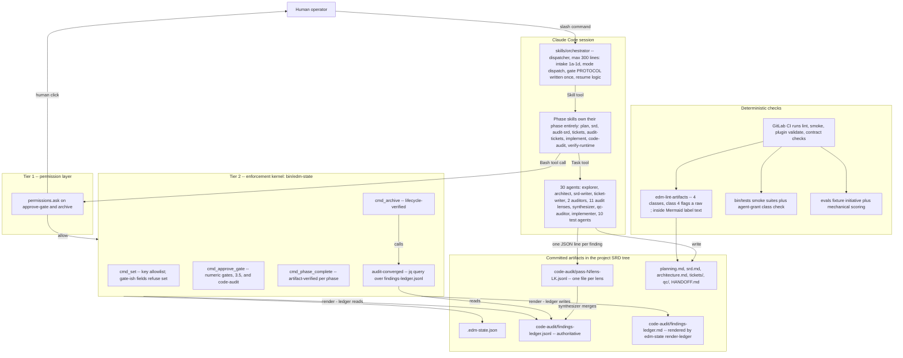
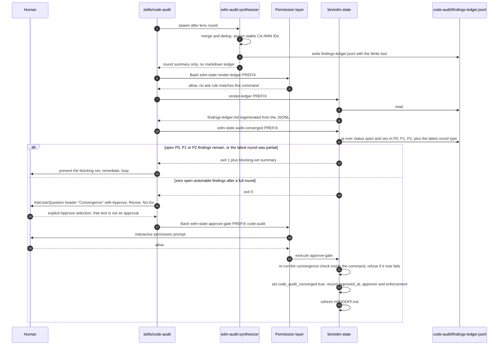
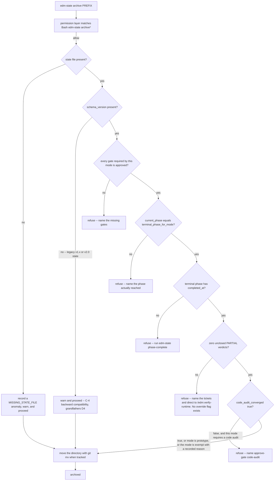
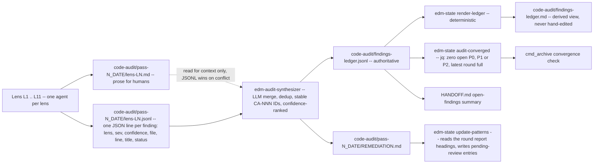

# EDMV3 -- EDM Plugin Hardening and Prompt Streamline: Software Requirements Document

## 1. Document Information

| Field               | Value                                                                                                                                                                                                                                                                                                              |
|---------------------|--------------------------------------------------------------------------------------------------------------------------------------------------------------------------------------------------------------------------------------------------------------------------------------------------------------------|
| Initiative          | EDMV3 -- prompt-streamline                                                                                                                                                                                                                                                                                         |
| Product             | `edm`                                                                                                                                                                                                                                                                                                              |
| Version             | 1.3.0                                                                                                                                                                                                                                                                                                              |
| Status              | Draft                                                                                                                                                                                                                                                                                                              |
| Owner               | Darryl Porter (darryl.porter@scripps.com)                                                                                                                                                                                                                                                                          |
| Last Updated        | 2026-07-26                                                                                                                                                                                                                                                                                                         |
| Generated From      | `planning.md` (Gate 1 approved 2026-07-25)                                                                                                                                                                                                                                                                         |
| Subject codebase    | `plugins/edm/` (EDM plugin v2.0.0)                                                                                                                                                                                                                                                                                 |
| Target versions     | v2.1.0 (wave A) -> v3.0.0 (wave B) -> v3.1.0 (wave C)                                                                                                                                                                                                                                                              |
| Companion documents | `architecture.md` (Target Architecture detail, 9 diagrams, risks R-A..R-K), `planning.md`, `decisions.md` (D1-D16), `EDM-REVIEW.md` (F1-F11, R1-R8), `audit-srd.md` (round-1 audit synthesis and arbitration rulings 1-20), `explorers/01-edm-plugin-current-state.md`, `explorers/02-external-pattern-sources.md` |

### Revision History

| Version | Date       | Author            | Summary                                                                                                                                                                                                                                                                                                                                                                                                                                                                                                                                                                                                                                                                                                                                                                                                                                                                                                                                                                                                                                                                                                                                                                                                                                                                                                                                                                                                                                                                                                                                                                                                                                                                                                                                                                                                                                                                                                                                                                                                                                                                                                                                                                                                          |
|---------|------------|-------------------|------------------------------------------------------------------------------------------------------------------------------------------------------------------------------------------------------------------------------------------------------------------------------------------------------------------------------------------------------------------------------------------------------------------------------------------------------------------------------------------------------------------------------------------------------------------------------------------------------------------------------------------------------------------------------------------------------------------------------------------------------------------------------------------------------------------------------------------------------------------------------------------------------------------------------------------------------------------------------------------------------------------------------------------------------------------------------------------------------------------------------------------------------------------------------------------------------------------------------------------------------------------------------------------------------------------------------------------------------------------------------------------------------------------------------------------------------------------------------------------------------------------------------------------------------------------------------------------------------------------------------------------------------------------------------------------------------------------------------------------------------------------------------------------------------------------------------------------------------------------------------------------------------------------------------------------------------------------------------------------------------------------------------------------------------------------------------------------------------------------------------------------------------------------------------------------------------------------|
| 1.0.0   | 2026-07-25 | edm-srd-writer    | Initial SRD generated from the Gate-1-approved cohesive plan, incorporating D13 (universal no-deferral), D14 (phases-as-data as a scope boundary), and the scope deltas surfaced by `architecture.md`. 111 requirements across 10 workstream epics plus explicit non-goals, security, observability, performance, and cross-cutting non-functional sections.                                                                                                                                                                                                                                                                                                                                                                                                                                                                                                                                                                                                                                                                                                                                                                                                                                                                                                                                                                                                                                                                                                                                                                                                                                                                                                                                                                                                                                                                                                                                                                                                                                                                                                                                                                                                                                                     |
| 1.1.0   | 2026-07-25 | edm-srd-writer    | Round-1 SRD audit remediation (`audit-srd.md`; auditors A, B, C). Every P0, P1 and P2 finding applied per D13 -- nothing skipped, nothing postponed. Findings applied: A-01..A-53, B-01..B-49, C-01..C-49. NOTED items (A-54..A-61, auditor B's NOTED list, C-50..C-55) required no action. The arbitration rulings 1-20 in `audit-srd.md` are binding and are encoded here; `architecture.md` and `planning.md` were reconciled in the same pass. Nine requirements added: EDMV3-112 (`edm-state migrate-schema` backfill), -113 (`AskUserQuestion` grants plus the `verify-runtime` frontmatter contract), -114 (`terminal_phase_for_mode()` and `required_gates_for_mode()`), -115 (kernel gate enforcement with a complete, mode-aware `cmd_gate_check`), -116 (installed-cache resolvability of `CLAUDE.md` by-name references), -117 (D15: an unverifiable AC is a specification defect), -118 (informational versus blocking `state_anomalies`), -119 (`_harness.sh` shared helpers), -120 (round-type recording so a partial round can never compute convergence). Priorities changed: EDMV3-09, -10, -24 and -78 promoted to Must Have; EDMV3-32, -68 and -80 demoted to Should Have. Counts corrected throughout to 30 agents, 13 skills and 7 hook families. Dispatcher cap re-derived at 300 lines. Total 120 requirements. Values chosen inline where the audit left them open and no ruling supplied one: explorer fan-out cap `N = 4`; the recall-drop revert threshold is below 80% of the opus baseline finding count on the same fixture or any missed baseline P0/P1; `audit-converged` exit codes are 0/1/3 (3 = no ledger) while new `bin/edm-check-*` scripts use 0/1/2; `schema_version` is the integer 1 at wave A, 2 at wave B and 3 at wave C only if shapes change; the reference environment for every latency budget is the CI `test` job image.                                                                                                                                                                                                                                                                                                                                    |
| 1.2.0   | 2026-07-25 | edm-ticket-writer | Round-1 **ticket-pack** audit remediation (`tickets/audit.md`; two parallel `edm-ticket-auditor` agents). The pack surfaced seven genuine SRD defects, raised as change requests CR1-CR7 and applied here as CR1-CR6 (CR7 is an `architecture.md` reconciliation, applied there in the same pass). **CR1** -- EDMV3-07 AC11 no longer requires the `skills/implement/SKILL.md:162-172` ritual to be deleted in the same merge request; the deletion belongs to EDMV3-81 in wave C and the ordering edge is recorded in Section 11.2. **CR2** -- EDMV3-26's `Dependencies` drop EDMV3-47, which was a wave-B requirement blocking a wave-A one and made the wave plan unexecutable; the stop-before-gate contract is now re-verified against the final PROTOCOL by EDMV3-52, a material change invalidates the EDMV3-28 baseline, and the soft ordering edge is in Section 11.2. **CR3** -- the cross-wave `Ships-with` between EDMV3-120 (wave B) and EDMV3-71 (wave C) is deleted as literally unsatisfiable and replaced by a `Shared shape:` note naming the audit-round record and its two owners. **CR4** -- EDMV3-91 and EDMV3-96 gain explicit `Wave split` blocks in the shape EDMV3-11, -17, -22 and -113 already use: wave A lands the mechanism, and each later wave's subcommand carries its own help and usage assertion. **CR5** -- EDMV3-45 gains EDMV3-41 as a dependency, and EDMV3-41's Skill-tool invocation clause is reassigned to EDMV3-46 (which owns the `Skill` grant and the dispatcher's per-phase invoke entries) with EDMV3-70 making the call; adding EDMV3-46 to EDMV3-41's `Dependencies` as the audit first proposed would have closed a cycle EDMV3-46 -> EDMV3-41 -> EDMV3-45 -> EDMV3-46 against the DAG property stated above, so the class defect (a Skill invocation shipping ahead of its grant) is closed by ownership instead of by an edge. **CR6** -- EDMV3-27's scorer emits `dimensions_scored` in `scores.json`, comparisons refuse runs whose `dimensions_scored` differ, and the wave-A baseline scores four dimensions and says so. No requirement was added or removed: the totals stay at 120 and the Section 14.1 priority split is unchanged at 85/25/5/5. |
| 1.3.0   | 2026-07-26 | orchestrator      | Gate 3 revise: model/effort assignments (D16). EDMV3-66 rewritten from a hand-picked mechanical/judgment lens split to a measured tiering protocol: three safe downgrades land in wave A (`edm-explorer` and `edm-test-coverage-auditor` to `sonnet`/`high`, `edm-architect` to `opus`/`high`); every contested assignment (eleven lenses, `edm-srd-auditor`, `edm-ticket-auditor`, `edm-qc-auditor`, `edm-audit-synthesizer`) is UNCHANGED until the wave-C tiering matrix runs each agent against the wave-A eval fixture at candidate (model, effort) pairs, with a mechanical promotion rule -- cheapest configuration holding 100% of baseline P0/P1 findings and at least 80% of total findings wins; any P0/P1 miss disqualifies; no qualifying configuration means no change. The `CLAUDE.md` assignments table becomes matrix-derived with a provenance header and a re-run trigger tied to EDMV3-73. Rationale: the v1.2.0 split was unmeasured judgment -- the same prose-not-mechanism defect class this initiative exists to fix. Scope-delta bullet 8 updated to match. No requirement added or removed; totals stay 120 at 85/25/5/5. |

### How to read this document

- Requirements are numbered `EDMV3-NN` and are globally unique within this initiative.
- Every requirement carries exactly one priority: **Must Have**, **Should Have**, **Could Have**, or **Won't Have (this
  release)**.
- `path:line` references are anchored against the tree as of 2026-07-25. **The symbol name (function, section heading)
  is the authoritative anchor; line numbers are indicative and drift as the initiative executes.** Eleven line ranges
  were corrected in v1.1.0 after re-verification against the tree; the symbol names were correct in every case.
- Section 5 summarizes the target architecture with diagrams. `architecture.md` in this same directory is the canonical,
  fuller treatment. As of v1.1.0 the two documents are reconciled and no known divergence remains; where a future edit
  makes them differ, `architecture.md` wins on diagram detail and this SRD wins on requirement wording. Section 5.4
  mirrors `architecture.md` D-8 exactly and the two are maintained together.
- A requirement's `Dependencies:` field records build-order edges only, so the dependency graph is a DAG. Requirements
  that must land in the same merge request but have no build-order relationship carry a separate `Ships-with:` field
  (see Section 11.2).

---

## 2. Executive Summary

The EDM plugin (`plugins/edm/`, v2.0.0) encodes a six-phase, gated software delivery methodology as Claude Code prompts,
four bash scripts, and a committed JSON state file. Its differentiator is **enforced rigor**. An outside-expert review
(`EDM-REVIEW.md`, 2026-07-25) reproduced the central defect: the rigor is *requested in prose*, not *enforced in
mechanism*. A phase-0 initiative with zero gates approved can be archived in three commands (F1). Every fresh initiative
is hard-blocked at orchestrator Step 1d by a branch-snapshot ordering bug, with printed remediation advice that is
actively wrong (F2). Two agents are ordered to write files they have no `Write` grant for (F3). Two different gate
protocols exist, and which one you get depends on which slash command you typed (F4). Convergence is a model's opinion
about markdown, not a computed fact (F5). The flagship initiative's most expensive phase recorded $0.00 (F6).

EDMV3 closes these gaps. It has three explicitly user-mandated changes and seven review-driven workstreams:

1. **`code_audit_converged` becomes human-gated.** The field leaves the `cmd_set` allowlist and is settable only by
   `edm-state approve-gate <PREFIX> code-audit`, following the Gate 3.5 dedicated-boolean precedent
   (`bin/edm-state:590-609`). Existing converged initiatives are grandfathered (D4).
2. **A canonical Mermaid literal-semicolon rule.** A literal `;` inside Mermaid label, node, edge, or message text is
   prohibited; authors write the entity code `#59;` (no leading `&`). The rule lives once as a canonical `CLAUDE.md`
   section, is referenced by name from 11 touch points, and gains a deterministic backstop as a fourth
   `edm-lint-artifacts` violation class.
3. **Universal no-deferral (D13).** Nothing actionable is ever deferred, anywhere in the methodology. (a) Every finding
   at P0, P1, *or* P2 is remediated before convergence. (b) Every PARTIAL verdict is closed by a mandatory
   `/edm:verify-runtime` step before archive; a PARTIAL that fails runtime verification becomes a FAIL and is remediated
   like any other finding. (c) There is no `--accept-partials` flag and no generic `--force` override on the
   `phase-complete` artifact checks -- mode-aware `skip-phase` records are the only exemption path, and they are
   recorded in state. (d) No deferral vocabulary survives in any prompt or template this initiative touches. `NOTED`
   items are unaffected -- they are non-actionable via the False Alarm Filter, not deferred findings. The severity half
   of the policy is one predicate in code (`edm-state audit-converged`), not five prompt restatements.

Around those, the initiative moves the load-bearing invariants out of prose and into `bin/edm-state`: permission-`ask`
rules on `approve-gate` and `archive`, artifact-verified `phase-complete`, lifecycle-verified `archive`, kernel-side
gate enforcement in `phase-start` and `gate-check`, and a `cmd_set` key allowlist. It puts a GitLab CI pipeline and a
fixture eval in front of the only genuinely risky change (collapsing the 645-line orchestrator into a dispatcher of at
most 300 lines that invokes phase skills via the Skill tool). It gives findings a JSONL data representation with a
`confidence` field so recall stops being suppressed by blind corroboration filtering. It makes the economics honest. It
stops the pattern library from appending unreviewed stubs past its own four-heading contract. And it deletes a 708KB of
binaries, a dead hook, a no-op function, a dead enum value, and a manual regression ritual that should always have been
a test.

**Scope**: ~55-60 files, 1 new CI file, 1 new evals tree, **4** new `edm-state` subcommands (`audit-converged`,
`render-ledger`, `audit-round-complete`, `migrate-schema`), **2** new `bin/` check scripts (`edm-check-grants`,
`edm-check-vocabulary`), 1 new lint class, 1 new skill (`/edm:verify-runtime`), 3-5 new smoke-test files, and tool-grant
corrections to **13** agents plus `AskUserQuestion` grants to **5** gate-presenting skills. No new runtime services, no
external service dependencies. **Delivery**: 10 epics in 3 MR waves. **Constraint envelope**: bash 3.2, macOS/Linux
only, ASCII-only artifacts, backward compatible with v1.x/v2.0 state files.

**Scope deltas discovered during architecture grounding and the round-1 audit** -- eight in total, the union of this
section's original list and the table at the end of `architecture.md` (all encoded as requirements below, all increases
in stated scope rather than changes of direction):

1. F3's tool-grant class is 13 agents, not 2, because all eleven `edm-audit-*` lenses carry `disallowedTools: Write`
   with no `Write` grant while `skills/code-audit/SKILL.md:44,99` orders each of them to write a report -- which blocks
   WS4's JSONL emission outright (EDMV3-05).
2. The WS1 class check must span agent bodies, skill launch templates, *and* hook prompts, or it passes green on the
   very class it exists to catch (EDMV3-07). It must additionally span skill `allowed-tools` (EDMV3-113).
3. The WS5 dispatcher moves the primary path off `UserPromptExpansion`, where the deterministic gate-check hooks live,
   so gate enforcement moves into the kernel (EDMV3-115) and every phase skill additionally opens with a Step 0
   preflight as defense in depth (EDMV3-45).
4. D13 (d)'s vocabulary sweep reds **three** currently-green assertions (`bin/tests/wave4b-smoke.sh:36`, `:38`, `:40`)
   plus the Step-7 orchestrator assertions at `wave4b-smoke.sh:123-125` and `wave5-smoke.sh:175`, all of which must be
   re-baselined in the same MR as the text change (EDMV3-43, EDMV3-46, EDMV3-74).
5. The `cmd_set` allowlist can strand live call sites, so the allowlist and its callers become a checked contract
   (EDMV3-15).
6. `edm-state --help` is a hardcoded `sed -n '2,39p'` range, so new subcommands silently truncate help unless the block
   becomes sentinel-delimited (EDMV3-96).
7. `edm-state` subcommands go from 1 new to 4 new and `bin/` check scripts from 1 to 3 (counting the Mermaid class
   inside `edm-lint-artifacts`), because `render-ledger` is how AD-2 eliminates JSONL/prose drift by construction,
   `audit-round-complete` was named but not counted, and `migrate-schema` is what stops every existing initiative from
   being permanently exempt from the enforcement kernel (EDMV3-34, EDMV3-71, EDMV3-112).
8. Model/effort tiering is measurement-derived (D16, Gate 3 revise): three safe downgrades land in wave A
   (`edm-explorer` and `edm-test-coverage-auditor` to `sonnet`/`high`, `edm-architect` to `opus`/`high`); every
   contested assignment -- all eleven lenses, both document auditors, the QC auditor, and the synthesizer -- changes
   only via the wave-C tiering matrix run against the eval fixture, with a mechanical promotion rule (EDMV3-66).

**The single sentence that justifies the initiative**: today EDM *documents* rigor; after EDMV3 it *guarantees* what can
be checked deterministically and *measures* what cannot.

---

## 3. Purpose and Scope

### 3.1 Purpose

Convert the EDM plugin's central promise -- that a gated methodology is actually followed -- from a request into a
property, and streamline the prompt surface so that every future improvement lands once instead of two-to-four times.

### 3.2 In Scope

| #    | Workstream                                    | Epic | Summary                                                                                                                                                                                                                                                                                                 |
|------|-----------------------------------------------|------|---------------------------------------------------------------------------------------------------------------------------------------------------------------------------------------------------------------------------------------------------------------------------------------------------------|
| WS1  | Mechanical fixes                              | E1   | `edm-init` branch correction, **13** agent tool grants, README paths and platform statement, three-source grant class check                                                                                                                                                                             |
| WS2  | Enforcement kernel                            | E2   | Permission `ask` rules, `approve-gate code-audit`, `cmd_set` allowlist plus caller contract test, artifact-verified `phase-complete` (no force path), lifecycle-verified `archive` (no override), mode-derived gate and terminal-phase helpers, kernel-side gate enforcement, `schema_version` backfill |
| WS3  | CI and fixture eval                           | E3   | `.gitlab-ci.yml`, lint `--all`, `plugins/edm/evals/` fixture initiative, mechanical scoring, baseline captured on wave-A code                                                                                                                                                                           |
| WS4  | Structured findings and universal no-deferral | E4   | Per-lens JSONL with `confidence`, `findings-ledger.jsonl` plus deterministic `render-ledger`, `edm-state audit-converged`, P0+P1+P2 blocking set, mandatory `/edm:verify-runtime` PARTIAL closure, deterministic vocabulary sweep                                                                       |
| WS5  | Orchestrator as dispatcher                    | E5   | Orchestrator to at most 300 lines, phase procedures live once, gate protocol written once, Step 0 preflight per phase skill, Skill-tool composition                                                                                                                                                     |
| WS6  | Mermaid rule                                  | E6   | Canonical `CLAUDE.md` section, 11 named references, fourth lint violation class                                                                                                                                                                                                                         |
| WS7  | Prompt streamline                             | E7   | Opus 5 / Sonnet 5 cadence and length calibration, output contracts, decision ladder, carve-outs, lens model tiering                                                                                                                                                                                     |
| WS8  | Economics honesty                             | E8   | Wire `phase-complete 6`, attribution scoping, pricing refresh, drop human-baseline ROI from default output                                                                                                                                                                                              |
| WS9  | Pattern-library curation                      | E9   | `update-patterns` respects the Living-Library Contract, `pending-review` status, human curation at the audit gate                                                                                                                                                                                       |
| WS10 | Delete list                                   | E10  | pptx/docx relocation, `.DS_Store`, the implement ritual, `TaskCompleted` hook, `cmd_record_task_duration`, `lifecycle_mode=partial`                                                                                                                                                                     |

### 3.3 Out of Scope

| Item                                                                                                                                                                                                                          | Rationale                                                                                                                                                                                                                                                                                                                                                                                                                                                                             | Recorded as                    |
|-------------------------------------------------------------------------------------------------------------------------------------------------------------------------------------------------------------------------------|---------------------------------------------------------------------------------------------------------------------------------------------------------------------------------------------------------------------------------------------------------------------------------------------------------------------------------------------------------------------------------------------------------------------------------------------------------------------------------------|--------------------------------|
| Phases-as-data (`phases.json` interpreted by a slim orchestrator; modes as phase-graph variants)                                                                                                                              | **A scope boundary, not a deferral (D14).** Phases-as-data is a separate future initiative to be decided on its own merits. No EDMV3 requirement depends on it, no EDMV3 requirement is partially satisfied by it, and no EDMV3 work is left incomplete pending it. EDMV3 delivers a complete, self-contained result without it. The architecture merely stays compatible: the phase artifact map (EDMV3-16) would be its first column and the dispatcher (EDMV3-46) its interpreter. | EDMV3-86 (Won't Have)          |
| Windows / WSL support                                                                                                                                                                                                         | D11: macOS/Linux only is a stated constraint, not a defect.                                                                                                                                                                                                                                                                                                                                                                                                                           | EDMV3-87 (Won't Have)          |
| Mermaid renderer validation spike / fixture MR                                                                                                                                                                                | D8: the user has confirmed `#59;` renders correctly in org tooling. No validation ticket.                                                                                                                                                                                                                                                                                                                                                                                             | EDMV3-88 (Won't Have)          |
| Forced re-approval of already-converged initiatives                                                                                                                                                                           | D4: grandfathered.                                                                                                                                                                                                                                                                                                                                                                                                                                                                    | EDMV3-89 (Won't Have)          |
| Override flags of any kind (`--force` on `phase-complete`, `--accept-partials` on `archive`)                                                                                                                                  | D13(c): an override flag is the exact mechanism that converts an enforced invariant back into a suggestion. Recorded `skipped_phases` entries are the only sanctioned exemption path.                                                                                                                                                                                                                                                                                                 | EDMV3-90 (Won't Have)          |
| Replacing the synthesizer's LLM merge/dedup with deterministic matching                                                                                                                                                       | Merge/dedup is genuine judgment; only the *record* becomes data.                                                                                                                                                                                                                                                                                                                                                                                                                      | Covered by EDMV3-33 scope note |
| Jira MCP integration changes (`skills/push-jira/`)                                                                                                                                                                            | Untouched by every workstream; no external service dependency in this initiative.                                                                                                                                                                                                                                                                                                                                                                                                     | Not a requirement              |
| Rewriting the QC verdict semantics, the locking discipline, artifact-hash drift detection, state-derived path resolution, CA-NNN ledger IDs, the gate approval rules *text*, the lint infrastructure, or HANDOFF auto-refresh | `EDM-REVIEW.md` "genuinely good" list. Preservation is itself a requirement.                                                                                                                                                                                                                                                                                                                                                                                                          | EDMV3-111 (Must Have)          |
| New agents                                                                                                                                                                                                                    | Zero new agents. The 30-agent roster is unchanged in membership; only frontmatter and prompt bodies change.                                                                                                                                                                                                                                                                                                                                                                           | Not a requirement              |
| A fourth `BLOCKED` closure verdict for an acceptance criterion whose runtime environment does not exist                                                                                                                       | **D15.** An AC that cannot be verified is a specification defect, not a state to record. It is reworked into something verifiable now, or its unverifiable clause moves to a follow-on initiative as a recorded scope boundary through gate change control. `verify-runtime` records PASS or FAIL only.                                                                                                                                                                               | EDMV3-117 (Must Have)          |

### 3.4 Definition of Done

EDMV3 is complete when all of the following hold:

- [ ] All **Must Have** requirements have passing acceptance criteria, evidenced by a smoke test, a CI job, or a file:
  line inspection recorded in the ticket pack QC report.
- [ ] The three-command bypass (`edm-init X` -> `edm-state set X code_audit_converged true` -> `edm-state archive X`)
  fails at the second command with a message naming `approve-gate`, and would fail at the third command on lifecycle
  grounds even if the second succeeded. Both are asserted by smoke tests.
- [ ] A fresh `edm-init` run in a scratch git repo produces a state file whose `initiative_branch` equals
  `git rev-parse --abbrev-ref HEAD`, and `edm-state branch-check` exits 0 immediately afterward.
- [ ] `.gitlab-ci.yml` runs green on the default branch: `bash -n` over `bin/`, all smoke suites, the deterministic `jq`
  manifest-and-frontmatter validation, the agent-grant class check, the vocabulary check, the four-`##` contract check,
  and `edm-lint-artifacts` over tracked artifact trees. `claude plugin validate` runs as the conditional second tier of
  the validate stage (EDMV3-23).
- [ ] The fixture eval produces a numeric score before and after the WS5 dispatcher refactor, and the after-score is at
  or above the wave-A baseline minus the observed run-to-run variance recorded in EDMV3-28, per the comparison in
  EDMV3-52.
- [ ] `edm-state audit-converged <PREFIX>` exits 0 only when zero open findings of severity P0, P1, or P2 remain in
  `findings-ledger.jsonl` **and** the most recent recorded round was a full eleven-lens round.
- [ ] `bin/edm-check-vocabulary` exits 0 over its full scan scope -- `plugins/edm/skills/`, `agents/`, `docs/`
  (including `docs/audit-patterns/qc-audit.md`), `hooks/hooks.json`, `monitors/monitors.json`, `CLAUDE.md`, `README.md`,
  and `bin/` -- with only the documented allowlist entries surviving. No deferral vocabulary survives in any prompt,
  template, or pattern-library doc, and every smoke assertion that referenced the old token
  (`bin/tests/wave4b-smoke.sh:36`, `:38`, `:40`) has been re-baselined in the same MR.
- [ ] `/edm:verify-runtime <PREFIX>` exists, is a mandatory Phase 6 closure step, drives every entry in
  `partial_verdict_map`, records PASS or FAIL per AC (never a third "unverifiable" outcome -- D15, EDMV3-117), and
  writes `post-deploy/verification.md`. `edm-state archive` refuses while any PARTIAL is unclosed, and no flag overrides
  that refusal.
- [ ] `grep -rn -- '--force\|--accept-partials' plugins/edm/bin plugins/edm/skills plugins/edm/agents` returns zero
  results **outside `plugins/edm/bin/tests/`, `plugins/edm/bin/vocabulary-prohibited.txt`,
  `plugins/edm/bin/vocabulary-allowlist.txt`, and the refusal messages themselves**, which are the documented carve-outs
  (EDMV3-12 AC5's wording, applied uniformly).
- [ ] All 13 agents in the F3 grant class (`edm-qc-auditor`, `edm-explorer`, and the eleven `edm-audit-*` lenses) can
  write the artifacts their instructions name, and all five gate-presenting skills hold `AskUserQuestion`;
  `bin/edm-check-grants` exits 0 across all four instruction sources.
- [ ] `edm-state phase-start <PREFIX> <N>` refuses when the phase's mode-derived prerequisite gate is unapproved, and
  `edm-state gate-check` recognizes every phase-skill token with a hard error on an unknown one. Every phase skill
  additionally begins with a Step 0 preflight running `edm-state gate-check` and `edm-state branch-check` as defense in
  depth.
- [ ] `grep -rn 'code_audit_converged true' plugins/edm/skills/` returns zero results (no prompt instructs the model to
  set the flag).
- [ ] `edm-lint-artifacts --all` exits 0 with the fourth (Mermaid) class enabled over the repository's tracked `SRD/`
  artifact trees, which is the mechanical form of the literal-semicolon rule.
- [ ] `plugins/edm/skills/orchestrator/SKILL.md` is at most 300 lines and contains no phase procedure body.
- [ ] `plugins/edm/EDM_Plugin_Presentation.pptx`, `plugins/edm/EDM_Plugin_User_Guide.docx`, and every `.DS_Store` under
  `plugins/edm/` are absent from the plugin directory; `.DS_Store` is gitignored.
- [ ] `CHANGELOG.md` and `.claude-plugin/plugin.json` reflect the wave's version; `CLAUDE.md`'s `bin/` table subcommand
  count and state-field table match reality.
- [ ] `claude plugin validate` passes with no new warnings relative to the v2.0.0 baseline (one pre-existing warning
  about root `CLAUDE.md` not being runtime context is acceptable and unchanged). Separately, EDMV3-116 verifies from an
  installed plugin cache that agents can actually resolve the `CLAUDE.md Sec."..."` references they are told to read --
  the validator warning and the resolvability question are different problems.
- [ ] Every document in this initiative directory is ASCII-only, including the imported `EDM-REVIEW.md` (EDMV3-95).
  Imported documents are ASCII-normalized on import; that is the stated policy, not a one-off fix.

---

## 4. Current State Assessment

### 4.1 Inventory

| Aspect          | Value                                                                                                                                                                                                                                                                                                                                                                                           | Anchor                                                                                                                   |
|-----------------|-------------------------------------------------------------------------------------------------------------------------------------------------------------------------------------------------------------------------------------------------------------------------------------------------------------------------------------------------------------------------------------------------|--------------------------------------------------------------------------------------------------------------------------|
| Plugin version  | 2.0.0                                                                                                                                                                                                                                                                                                                                                                                           | `plugins/edm/.claude-plugin/plugin.json:4`                                                                               |
| Skills          | **13** (`orchestrator`, `plan`, `srd`, `audit-srd`, `tickets`, `audit-tickets`, `implement`, `code-audit`, `test`, `test-plan`, `test-coverage`, `metrics`, `push-jira`); 14 after `verify-runtime` lands in wave B                                                                                                                                                                             | `plugins/edm/skills/*/SKILL.md`, `.claude-plugin/marketplace.json:36-49`                                                 |
| Agents          | **30** definitions: 11 audit lenses + 1 synthesizer (12), 10 `edm-test-*` agents (unit, component, composable, integration, contract, e2e, a11y, scaffold, planner, coverage-auditor), 5 writer/auditor roles (`edm-srd-writer`, `edm-srd-auditor`, `edm-ticket-writer`, `edm-ticket-auditor`, `edm-architect`), plus `edm-explorer`, `edm-implementer`, `edm-qc-auditor`. 12 + 10 + 5 + 3 = 30 | `plugins/edm/agents/*.md` (verified `ls plugins/edm/agents/*.md \| wc -l` = 30), `.claude-plugin/marketplace.json:51-82` |
| Bash scripts    | 4: `edm-state` (~2023 lines, 36 subcommands), `edm-init` (188 lines), `edm-lint-artifacts` (207 lines), `edm-validate-prefix`                                                                                                                                                                                                                                                                   | `plugins/edm/bin/`                                                                                                       |
| Smoke suites    | 4 (`wave3`, `wave4a`, `wave4b`, `wave5`) plus `_harness.sh`; 76/76 pass; run only by hand                                                                                                                                                                                                                                                                                                       | `plugins/edm/bin/tests/`                                                                                                 |
| Hooks           | **7** event families in one file: `SessionStart` (`:3`), `UserPromptExpansion` (`:13`), `PreToolUse` (`:80`), `Stop` (`:91`), `PreCompact` (`:101`), `SubagentStop` (`:111`), `TaskCompleted` (`:122`). EDMV3-82 removes `TaskCompleted`, reducing the count to 6                                                                                                                               | `plugins/edm/hooks/hooks.json`                                                                                           |
| Pattern library | 5 docs + README under a four-`##` Living-Library Contract                                                                                                                                                                                                                                                                                                                                       | `plugins/edm/docs/audit-patterns/`                                                                                       |
| Build / CI      | None                                                                                                                                                                                                                                                                                                                                                                                            | --                                                                                                                       |
| State store     | `SRD/{PRODUCT}/{PREFIX}__{DESC}/.edm-state.json`, jq RMW under advisory lock                                                                                                                                                                                                                                                                                                                    | `bin/edm-state`                                                                                                          |

### 4.2 Verified defects

Each row was reproduced in a scratch repo, confirmed live during this initiative, or confirmed by direct code reading;
every anchor below was re-verified against the tree on 2026-07-25.

| ID  | Defect                                                                                                                                                                                                                                                                                                                                                                                                                                                                                                                                                                                                                                      | Evidence anchor                                                                                                                                                                                                                                                                                                                                     | Consequence                                                                                                                           |
|-----|---------------------------------------------------------------------------------------------------------------------------------------------------------------------------------------------------------------------------------------------------------------------------------------------------------------------------------------------------------------------------------------------------------------------------------------------------------------------------------------------------------------------------------------------------------------------------------------------------------------------------------------------|-----------------------------------------------------------------------------------------------------------------------------------------------------------------------------------------------------------------------------------------------------------------------------------------------------------------------------------------------------|---------------------------------------------------------------------------------------------------------------------------------------|
| F1  | Lifecycle bypassable in three commands. `cmd_archive` checks one boolean and never reads `gates_approved` or `current_phase`. **The single check it does make is additionally conditional on `product_name` being non-empty (`bin/edm-state:887`: `[[ "$converged" == "false" && -n "$product_name" ]]`), so a flat-layout initiative with `code_audit_converged=false` archives today with no refusal at all** -- a second, larger hole than the one the review named. `cmd_set` allowlists `code_audit_converged` as a plain settable boolean, and its generic branch accepts arbitrary keys. Prompts instruct the model to set the flag. | `bin/edm-state:860-903` (`cmd_archive`, check at `:877-889`, `product_name` coupling at `:887`); `bin/edm-state:474-496` (`cmd_set`, allowlist at `:479`, generic branch at `:491-494`); `skills/code-audit/SKILL.md:57`; `skills/orchestrator/SKILL.md:557-558` -- against the plugin's own anti-pattern at `skills/orchestrator/SKILL.md:640-645` | A phase-0 initiative with zero gates archives cleanly. Silent. A flat-layout initiative bypasses even the convergence boolean.        |
| F2a | `edm-init` snapshots the branch before creating it. `edm-state init` reads `git rev-parse --abbrev-ref HEAD` at `bin/edm-state:510` and stores it at `:535`; `edm-init` calls it at `:139`, 25 lines before `git checkout -b` at `:164`.                                                                                                                                                                                                                                                                                                                                                                                                    | `bin/edm-init:139` vs `bin/edm-init:148-168`; `bin/edm-state:510,535`; block behavior at `skills/orchestrator/SKILL.md:296-298`; victim at `bin/edm-state:1264-1286` (`cmd_branch_check`)                                                                                                                                                           | Every fresh initiative hard-BLOCKs at Step 1d with remediation advice (`git checkout main`) that moves the user off their own branch. |
| F2b | README installs a path that no longer exists.                                                                                                                                                                                                                                                                                                                                                                                                                                                                                                                                                                                               | `README.md:11`, `README.md:14` (`./plugins/edm-ai-development`; the directory is `plugins/edm`)                                                                                                                                                                                                                                                     | Step one of the documented journey fails.                                                                                             |
| F3  | Agents ordered to write files they cannot write. `edm-qc-auditor` has `disallowedTools: Write, Edit, NotebookEdit` and no `Bash`, yet is told to write `qc/`, run `mkdir -p`, and call `edm-state`. `edm-explorer` has the same contradiction. The class was fixed once for `edm-test-coverage-auditor` and then encoded as a permanent manual ritual.                                                                                                                                                                                                                                                                                      | `agents/edm-qc-auditor.md:5,10` vs `:23`; `hooks/hooks.json:117` steps 4-6; `agents/edm-explorer.md:5,10` vs `:61`; ritual at `skills/implement/SKILL.md:162-172`                                                                                                                                                                                   | The QC layer cannot deliver its artifact. Confirmed live: both EDMV3 explorers returned text apologies.                               |
| F4  | Two gate protocols. Orchestrator mandates `AskUserQuestion` and "free-text is never approval"; the standalone phase skills accept plain affirmations.                                                                                                                                                                                                                                                                                                                                                                                                                                                                                       | Strong: `skills/orchestrator/SKILL.md:395-402`. Weak: `skills/plan/SKILL.md:130-132`, `skills/audit-srd/SKILL.md:122-124`, `skills/audit-tickets/SKILL.md:127-129`. Drift: duplicate step numbering at `skills/orchestrator/SKILL.md:417-423`, `:432-433`, `:478-479`                                                                               | Gate integrity depends on which slash command the user typed.                                                                         |
| F5  | Free-text findings pipeline. No machine-checkable finding representation. Convergence asserted, not computed. Double False-Alarm filtering with no confidence field.                                                                                                                                                                                                                                                                                                                                                                                                                                                                        | `agents/edm-audit-synthesizer.md:32-41` (second-pass filter, criterion 4 at `:39`); per-lens filters, e.g. `agents/edm-audit-logic.md:43-50`; blocking-set prose at `skills/code-audit/SKILL.md:155`                                                                                                                                                | EDMV2's ledger contradicted state until an external audit reconciled them. Recall suppressed.                                         |
| F6  | Economics not true. EDMV2 Phase 6 recorded 0s / $0.00 despite `audit_rounds.code = 2`. Root cause (D9): `phase-start 6` fired, `phase-complete 6` never did, and archive did not care. Attribution sums every project session JSONL. Pricing table is one model generation stale.                                                                                                                                                                                                                                                                                                                                                           | `SRD/.archived/EDMV2/.edm-state.json`; `bin/edm-state:206-225` (`get_session_tokens_since`); `bin/edm-state:233-262` (`compute_cost_usd`); `CLAUDE.md` "Cost tracking" pricing table (Opus 4.7 / Sonnet 4.6)                                                                                                                                        | The headline ROI claim is built on data that omits the dominant cost.                                                                 |
| F7  | PARTIAL verdicts never close. Excluded from remediation, unchecked by archive, `post-deploy/verification.md` optional. `implement` remediates P0/P1 FAILs only.                                                                                                                                                                                                                                                                                                                                                                                                                                                                             | `skills/implement/SKILL.md:105` (exclusion), `:95` (P0/P1 only); `skills/orchestrator/SKILL.md:565`; `bin/edm-state:1412-1424` (`cmd_record_partial_verdict`)                                                                                                                                                                                       | An initiative can converge, archive, and ship with unverified acceptance criteria and a complete-looking paper trail.                 |
| F8  | Everything runs at maximum spend. Mechanical lenses (L2, L5, L7, L10) run `opus`/`max` alongside judgment lenses. No tiered policy; `--lenses` exists but nothing recommends a strategy.                                                                                                                                                                                                                                                                                                                                                                                                                                                    | `CLAUDE.md` "Model and effort assignments"; `skills/code-audit/SKILL.md:26-30`, `:73-87`                                                                                                                                                                                                                                                            | A full round is 12 `opus`/`max` agents minimum, twice if any finding is found.                                                        |
| F9  | `update-patterns` appends unreviewed stubs at end-of-file, past the fourth `##` section, into files loaded by every future writer prompt. Body is literally "Review and refine: add a one-paragraph description".                                                                                                                                                                                                                                                                                                                                                                                                                           | `bin/edm-state:1576-1692`, append block at `:1668-1675`; contract at `docs/audit-patterns/README.md:5-20`; consumers at `docs/audit-patterns/README.md:34-44`                                                                                                                                                                                       | Uncurated placeholder text accumulates in the highest-leverage prompt inputs in the system.                                           |
| F10 | Nothing is measured. No eval, no CI. Smoke suites verify text presence, not outcomes.                                                                                                                                                                                                                                                                                                                                                                                                                                                                                                                                                       | `plugins/edm/bin/tests/`; `CLAUDE.md` "Testing changes" (manual checklist)                                                                                                                                                                                                                                                                          | Prompt changes ship on vibes.                                                                                                         |
| F11 | Distribution hygiene. 676KB pptx, 32KB docx, and `.DS_Store` files ship inside the plugin directory.                                                                                                                                                                                                                                                                                                                                                                                                                                                                                                                                        | `plugins/edm/EDM_Plugin_Presentation.pptx`, `plugins/edm/EDM_Plugin_User_Guide.docx`, `plugins/edm/.DS_Store`, `plugins/edm/skills/.DS_Store`                                                                                                                                                                                                       | Every installer downloads 708KB of binaries plus macOS metadata.                                                                      |

### 4.3 Dead or unshipped surfaces (delete candidates)

| Surface                             | Anchor                                                                                      | Status                                                         |
|-------------------------------------|---------------------------------------------------------------------------------------------|----------------------------------------------------------------|
| `TaskCompleted` hook                | `hooks/hooks.json:122-131`                                                                  | Wired to a no-op                                               |
| `cmd_record_task_duration`          | `bin/edm-state:753-758`                                                                     | Admitted no-op; dispatch entry at `:1991`; help line at `:13`  |
| `lifecycle_mode=partial`            | `bin/edm-state` `cmd_set_mode` (`:1433`+), enum documented in `CLAUDE.md` state-field table | Legal enum value with no sub-flow anywhere (D12: delete)       |
| `skills/implement/SKILL.md:162-172` | Manual per-initiative grep ritual                                                           | Replaced by a class-level test (EDMV3-07), deleted by EDMV3-81 |
| `monitors/watch-impl` sleep-loop    | `monitors/monitors.json:1-8`; `bin/edm-state:905+` (`cmd_watch_impl`)                       | Lifecycle undocumented; marked `[inferred]` in review          |

### 4.4 Existing patterns this initiative mirrors

| Pattern                                                                      | Anchor                                                                                                                                                                                          | Used by                                                                                                                                   |
|------------------------------------------------------------------------------|-------------------------------------------------------------------------------------------------------------------------------------------------------------------------------------------------|-------------------------------------------------------------------------------------------------------------------------------------------|
| Dedicated-boolean gate for a non-integer gate ID                             | `bin/edm-state:590-609`, special case at `:597-602`; prompt at `skills/orchestrator/SKILL.md:267-285`                                                                                           | EDMV3-11, EDMV3-108                                                                                                                       |
| Canonical `CLAUDE.md` section referenced by name                             | `CLAUDE.md` "Severity vocabulary (canonical)"; consumers at `skills/code-audit/SKILL.md:146`, `skills/audit-srd/SKILL.md:65`, `agents/edm-srd-auditor.md:63`, `agents/edm-ticket-auditor.md:73` | EDMV3-38, EDMV3-47, EDMV3-53, EDMV3-54                                                                                                    |
| Living-Library four-`##` contract                                            | `docs/audit-patterns/README.md:5-20`, structure check at `:14-20`                                                                                                                               | EDMV3-55, EDMV3-76, EDMV3-79, EDMV3-109                                                                                                   |
| Fence-aware lint ignore sets and the 13-line class template                  | `bin/edm-lint-artifacts:69-109` (`build_ignore_set`), `:185-198` (class 3)                                                                                                                      | EDMV3-56                                                                                                                                  |
| Gate-behavior smoke test template                                            | `bin/tests/wave4a-smoke.sh:236-282`                                                                                                                                                             | EDMV3-11, EDMV3-21                                                                                                                        |
| Prompt-text assertion template                                               | `bin/tests/wave4b-smoke.sh:104-109`                                                                                                                                                             | EDMV3-20, EDMV3-58                                                                                                                        |
| Artifact-hash drift detection (mechanical verification applied to one slice) | `bin/edm-state:674-686` (`record_artifact_hash` call at phase-complete, helper at `:110-120`), `:691-751` (`cmd_checkpoint` drift loop)                                                         | Conceptual model for EDMV3-16; **reused literally** by EDMV3-34 to detect a hand-edited rendered ledger                                   |
| Artifact presence idiom                                                      | `present_or_absent()` (`bin/edm-state:338-340`)                                                                                                                                                 | EDMV3-16 (extended to a non-empty variant rather than re-derived)                                                                         |
| Deduplicated initiative enumeration across both layouts, bash-3.2-safe       | `list_state_files()` (`bin/edm-state:53-71`)                                                                                                                                                    | EDMV3-24's `--all` mode consumes it rather than re-implementing it                                                                        |
| Fence-state line walk usable for both the ignore set and its inverse         | `build_ignore_set` (`bin/edm-lint-artifacts:69-109`), which already sees and discards the fence-open info string at `:83`                                                                       | EDMV3-56, EDMV3-102 (one pass emits both line classes)                                                                                    |
| Violation reporting and ignore-marker infrastructure                         | `report_violation` (`bin/edm-lint-artifacts:59-63`), `build_ignore_set` (`:69-109`), `is_ignored_line` (`:112`)                                                                                 | EDMV3-07, EDMV3-15, EDMV3-43, EDMV3-79 (the four new grep-and-report checks source or mirror these rather than re-deriving the file walk) |

---

## 5. Target Architecture

`architecture.md` in this initiative directory is the canonical architecture document; it carries the full diagram set,
component responsibilities, and design decisions. This section states the shape the requirements assume, with the
minimum diagrams needed to read Section 6.

### 5.1 The organizing idea

Every invariant that can be checked deterministically moves out of prompt prose and into `bin/edm-state` plus the Claude
Code permission system. Prompt budget freed by that move -- and by collapsing the orchestrator/phase-skill
duplication -- is spent on judgment work only models can do. Three enforcement tiers result:

| Tier             | Mechanism                                                                                             | Cannot be bypassed by                                | Example                                                                                                                                              |
|------------------|-------------------------------------------------------------------------------------------------------|------------------------------------------------------|------------------------------------------------------------------------------------------------------------------------------------------------------|
| T1 -- Permission | Claude Code `permissions.ask` rules on `Bash(edm-state approve-gate*)` and `Bash(edm-state archive*)` | Prompt drift, compaction, or a persuasive transcript | Human must physically click to approve any gate or archive                                                                                           |
| T2 -- Kernel     | `bin/edm-state` refuses the state mutation                                                            | Any caller, including a shell user                   | `cmd_set` rejects `code_audit_converged`; `cmd_archive` refuses on an incomplete lifecycle; `phase-start` refuses on an unapproved prerequisite gate |
| T3 -- Prose      | Instruction text in skills and agents                                                                 | Nothing -- defense in depth only                     | "Free-text is never approval"                                                                                                                        |

T1's matcher is a **literal Bash prefix match on the issued command string**. It is deliberately *not* claimed to be
bypass-proof against side entry paths: `cd "$INIT_DIR" && edm-state approve-gate X 1`,
`"$CLAUDE_PLUGIN_ROOT"/bin/edm-state approve-gate X 1`, `EDM_SRD_ROOT=./SRD edm-state approve-gate X 1` and
`bash -c '...'` do not match the bare-prefix rule, and the repository's own conventions push toward compound
invocations. EDMV3-08 therefore documents the limitation plainly and recommends a rule set covering the invocation
shapes the plugin itself emits, and EDMV3-15's manual-QA case exercises the compound form. T1 is also a *setting*, so it
can be removed by the user; **EDMV3-09** detects its absence and warns, and **EDMV3-10** records
`enforcement: prose-only` on any approval taken without the rules configured. Note what that tag does and does not mean:
it records **rule presence**, not that a permission prompt actually fired for that specific invocation, so an evaded
approval on a configured machine is still tagged `permission-ask`. T2 is the load-bearing tier and applies to every
caller including a shell user, which is why the kernel -- not the permission layer -- is where the invariants live. T3
remains valuable and is preserved verbatim where the review called the text out as good.

### 5.2 System context



Note the `#59;` occurrences in the `SET` and `LINT` node labels: those are literal semicolons written per the rule this
initiative introduces. A raw `;` in the same position would terminate the Mermaid statement and break the diagram.

Two things the edge directions encode deliberately. First, the permission layer sits **upstream** of the kernel: the
`ask` rule fires on the model's Bash *tool call*, before `bin/edm-state` executes at all. Drawing the kernel as the
caller of the permission layer would make T1 downstream of T2 and therefore worthless. Second, that also means the ask
rule governs the *model*, not a human at a shell -- a developer typing `edm-state archive X` in a terminal sees no
prompt. T2 is what covers that caller, which is why the invariants live in the kernel rather than in the rule set.

### 5.3 The convergence gate (requirement 1)



Two independent human confirmations are required by construction: the `AskUserQuestion` selection (T3, prompt-level) and
the permission prompt (T1, mechanism-level). Neither alone is sufficient in the target design; the permission prompt is
the one that survives prompt drift.

Three actor assignments in this diagram are normative and are the reason it is drawn this way. The **synthesizer writes
only the JSONL** -- it holds `Write` but no `Bash` grant (`agents/edm-audit-synthesizer.md:5`), so it could not invoke
`render-ledger` even if asked, and a synthesizer that writes both files is a failing condition (EDMV3-33 AC2). The
**code-audit skill calls `render-ledger`** immediately after the synthesizer returns (EDMV3-34 AC6). And the
**permission layer sits between the caller and the kernel**, not downstream of it. The re-check inside `approve-gate`
closes the time-of-check-to-time-of-use window between the standalone `audit-converged` call and the approval (EDMV3-11
AC4).

### 5.4 Archive lifecycle verification

This flow is identical in shape to `architecture.md` D-8; the two are maintained together and neither is a summary of
the other.



The diagram has no override edges by construction (D13 (c)). Read the exemptions precisely, because the earlier draft of
this section overstated them:

- **Two non-refusing early exits exist.** A missing state file (which is now *reported* as a `MISSING_STATE_FILE`
  anomaly rather than silently permitted -- deleting `.edm-state.json` is a real bypass surface, equivalent in cost to
  the hand-edit path RK-9 already accepts), and legacy state detected by an absent `schema_version`, which is the C-4
  path and applies only to initiatives created before wave A or backfilled by `edm-state migrate-schema` (EDMV3-112).
- **`mode == prototype` is not an early exit.** It waives exactly one check -- convergence -- and a prototype initiative
  still must satisfy the gate, phase, `completed_at` and PARTIAL checks. This is a deliberate narrowing of the pre-EDMV3
  behavior and is called out in the changelog.
- **Modes that never run a code audit** (`fast-track`, `fix-pack`, and `mini-srd` where no audit round was started) are
  exempt from the convergence check with a recorded reason in state, not by silence (EDMV3-114, EDMV3-36 AC10).
- **Required gates and the terminal phase are derived, never hardcoded**, by the two helpers in EDMV3-114, which are the
  single derivation shared by `phase-start`, `gate-check`, `phase-complete` and `archive`.
- A phase recorded in `skipped_phases` is exempt from that phase's artifact check at `phase-complete` time and from its
  gate at archive time, and that exemption is itself a recorded, git-visible state entry rather than a command-line
  flag.
- The refusal is **independent of `product_name`**: EDMV3-17 deletes the `-n "$product_name"` coupling at
  `bin/edm-state:887`, and EDMV3-21 covers a flat-layout initiative explicitly.

### 5.5 Findings as data



The JSONL is authoritative by definition. Downstream of the synthesizer, disagreement is impossible by construction
because the markdown is rendered from the JSONL rather than written alongside it (EDMV3-34). Upstream, at the lens
boundary, disagreement remains possible: the output contract states the JSONL wins (EDMV3-31), the synthesizer reads
both (prose for context, JSONL for record), and the eval compares per-lens finding counts between the two files
(EDMV3-27 dimension 5).

Two edge sources are worth naming because an earlier draft got them wrong. `render-ledger` is a real node in the
pipeline, not an implicit step -- the JSONL does not become markdown by itself. And `update-patterns` reads `### `
headings from the round's audit report (`bin/edm-state:1678`), **not** from the JSONL; no requirement in this initiative
makes it JSONL-aware, so the diagram draws it from `REMEDIATION.md`.

### 5.6 Prompt topology before and after

| Surface                                            | Before                                                                                                                                                                                                                                                                                                                                 | After                                                                                                                                                                                                                                                                                                                                                                                                                                                                                                                                                                                                                                                                                                                     |
|----------------------------------------------------|----------------------------------------------------------------------------------------------------------------------------------------------------------------------------------------------------------------------------------------------------------------------------------------------------------------------------------------|---------------------------------------------------------------------------------------------------------------------------------------------------------------------------------------------------------------------------------------------------------------------------------------------------------------------------------------------------------------------------------------------------------------------------------------------------------------------------------------------------------------------------------------------------------------------------------------------------------------------------------------------------------------------------------------------------------------------------|
| `skills/orchestrator/SKILL.md`                     | 645 lines containing all six phase procedures inline                                                                                                                                                                                                                                                                                   | Max 300 lines: intake (Steps 1a-1d), mode dispatch, gate PROTOCOL (written once), resume logic, `## Communication` and `<tone_preference>` (EDMV3-59), and per-phase "invoke `/edm:{phase}`, then present Gate N per the PROTOCOL". The three mode sub-flows move to the phase skills and `CLAUDE.md` (EDMV3-46 AC6)                                                                                                                                                                                                                                                                                                                                                                                                      |
| `skills/plan/SKILL.md` and siblings                | Phase procedure duplicated and drifted; weak gate protocol at the tail                                                                                                                                                                                                                                                                 | Sole owner of its phase procedure; ends with "present the gate per the orchestrator gate PROTOCOL"; no local approval-recording text                                                                                                                                                                                                                                                                                                                                                                                                                                                                                                                                                                                      |
| Gate protocol                                      | Two variants (`skills/orchestrator/SKILL.md:395-402` strong, three phase skills weak)                                                                                                                                                                                                                                                  | One variant, one location, referenced by name                                                                                                                                                                                                                                                                                                                                                                                                                                                                                                                                                                                                                                                                             |
| Composition constraint                             | `CLAUDE.md` "Skills don't load other skills -- they each contain their own orchestration"                                                                                                                                                                                                                                              | Documented Skill-tool composition pattern with its failure mode (target skill not enabled) and the required `Skill` entry in `allowed-tools`                                                                                                                                                                                                                                                                                                                                                                                                                                                                                                                                                                              |
| Deterministic gate enforcement on the primary path | `UserPromptExpansion` hooks (`hooks/hooks.json:13-78`) fire when the user types `/edm:srd` and friends -- which is the primary path today. Genuinely deterministic (T1/T2-grade), but they cover only five of the eight phase skills and `cmd_gate_check` silently returns 0 for any token they do not map (`bin/edm-state:1201-1209`) | **Deterministic enforcement moves into the kernel, where entry path cannot reach it**: `edm-state phase-start <PREFIX> <N>` refuses when the phase's mode-derived prerequisite gate is unapproved, and `cmd_gate_check` gains the missing `plan`, `code-audit` and `verify-runtime` tokens plus a hard-error default branch and mode/skipped-phase awareness (EDMV3-115). Every phase skill already calls `phase-start`, so this is T2 and unbypassable. On top of that, each phase skill opens with a Step 0 preflight calling `edm-state gate-check` and `edm-state branch-check` (EDMV3-45), and the `UserPromptExpansion` hooks are retained -- **both are defense in depth, and neither is the deterministic layer** |

---

## 6. Feature Requirements

Requirements are grouped into ten epics, one per workstream. Each requirement states its priority, description,
acceptance criteria, dependencies, and target components. "Target Components" paths are relative to the repository root.

### Epic E1 -- WS1: Mechanical fixes

Rationale: nothing else in this initiative is credibly testable while `edm-init` breaks every fresh initiative and
thirteen agents cannot write the artifacts they are ordered to produce. Wave A, first.

---

#### EDMV3-01: `edm-init` records the branch it actually left the user on

- **Priority**: Must Have
- **Description**: `bin/edm-init` calls `edm-state init` at line 139, which snapshots `initiative_branch` from
  `git rev-parse --abbrev-ref HEAD` (`bin/edm-state:510`, written at `:535`). The branch block that creates and checks
  out the initiative branch runs afterward at `bin/edm-init:148-168`. Per D3, the fix is a post-checkout correction
  rather than a reorder, because the warn-and-continue failure paths at `bin/edm-init:161-166` leave the user on the old
  branch and a naive reorder would record the *intended* branch instead of the *occupied* one.
- **Acceptance Criteria**:
    - [ ] After the branch block at `bin/edm-init:148-168` completes, `edm-init` runs a correction that records the
      branch actually occupied, derived from `git rev-parse --abbrev-ref HEAD` at that point (not from the `$BRANCH`
      variable), guarded so it is a no-op outside a git worktree.
    - [ ] On the success path (new branch created), `.edm-state.json` `initiative_branch` equals the newly created
      branch name.
    - [ ] On the warn-and-continue path (checkout fails, user stays on the original branch), `initiative_branch` equals
      the original branch name, and the scaffold summary still prints the `[warn]` message unchanged.
    - [ ] Immediately after `edm-init` returns, `edm-state branch-check <PREFIX>` exits 0.
    - [ ] The correction uses a **dedicated code path** -- a new `edm-state record-branch <PREFIX>` behavior or an
      equivalent internal call that reads `git rev-parse --abbrev-ref HEAD` itself -- rather than widening the `cmd_set`
      allowlist. `initiative_branch` is therefore **not** a `cmd_set`-settable key, which keeps the allowlist minimal
      and keeps the recorded value derived rather than supplied. The choice is asserted by EDMV3-15's caller contract
      test, which must find zero `edm-state set <PREFIX> initiative_branch` call sites afterward.
    - [ ] `bash -n bin/edm-init` passes and no bash 4+ construct is introduced (EDMV3-105).
- **Dependencies**: none (this is the first change in wave A). Interacts with EDMV3-13 and EDMV3-15.
- **Target Components**: `plugins/edm/bin/edm-init` (lines 139, 148-168), `plugins/edm/bin/edm-state` (`cmd_init`, lines
  498-560)

---

#### EDMV3-02: Regression test for the `edm-init` branch handshake

- **Priority**: Must Have
- **Description**: No test currently covers `edm-init` branch behavior at all. The repro condition is precise: run
  `edm-init` from a branch where `edm/{prefix-lc}-{description}` does not yet exist, which routes through
  `git checkout -b` at `bin/edm-init:164`.
- **Acceptance Criteria**:
    - [ ] A smoke test creates a scratch git repository in a temp directory, commits an initial file, runs
      `edm-init --product demo --description branch-test TESTB` from the default branch, and asserts that the
      `initiative_branch` field in the resulting state file equals the output of `git rev-parse --abbrev-ref HEAD`.
    - [ ] A second case runs `edm-init` when the target branch already exists, and asserts the same equality.
    - [ ] A third case simulates checkout failure (for example by creating the branch name as an existing file reference
      conflict, or by stubbing `git`) and asserts `initiative_branch` equals the branch the user remained on, and that
      `edm-init` exits 0 with a `[warn]` line.
    - [ ] Each case asserts `edm-state branch-check TESTB` exits 0 after the run.
    - [ ] The scratch repository is created under a temp directory and removed on exit, including on failure, so the
      test leaves no residue in the developer's tree.
    - [ ] The test is registered in the CI test stage (EDMV3-23).
- **Dependencies**: EDMV3-01
- **Target Components**: `plugins/edm/bin/tests/wave6-smoke.sh` (new), `plugins/edm/bin/tests/_harness.sh`

---

#### EDMV3-03: `edm-qc-auditor` tool grants match its instructions

- **Priority**: Must Have
- **Description**: `agents/edm-qc-auditor.md:5` grants no `Write` and no `Bash`, and `:10` sets
  `disallowedTools: Write, Edit, NotebookEdit`. Its own prompt orders it to write to `<initiative-dir>/qc/` (`:23`), run
  `mkdir -p` before writing (`:76`), and resolve paths via `edm-state get ... | jq` (`:68`). The `SubagentStop` hook
  additionally orders it to call `edm-state record-partial-verdict` (`hooks/hooks.json:117`, step 6). Every one of those
  operations is impossible under the current grant.
- **Acceptance Criteria**:
    - [ ] `agents/edm-qc-auditor.md` frontmatter `tools:` includes `Write`, `Bash(edm-state *)`, `Bash(mkdir *)`, and
      `Bash(jq *)` in addition to its existing read-only tools.
    - [ ] `disallowedTools:` is exactly `Edit, NotebookEdit` -- `Write` is removed from the deny list.
    - [ ] The agent's `## Output` section names the exact permitted write paths: `<initiative-dir>/qc/qc-summary.md` and
      `<initiative-dir>/qc/qc-shard-{NN}.md`. No other path is permitted.
    - [ ] **Scoped-grant verification precedes the scoped-grant AC.** Every `Bash`-holding agent in the tree today uses
      a bare token (`agents/edm-implementer.md:9`, `agents/edm-test-coverage-auditor.md:10`, and eight more); scoped
      `Bash(...)` syntax is documented for SKILL.md `allowed-tools`, not for agent `tools:`, and has zero precedent in
      this plugin. A five-minute check runs first: grant `Bash(edm-state *)` to one agent, run `claude plugin validate`,
      and confirm the agent can call `edm-state` but not an arbitrary command. The result and date are recorded in
      `decisions.md`.
    - [ ] If the check confirms scoped grants are honored: `Bash` is granted in the narrowest form the frontmatter
      syntax supports, and a bare unrestricted `Bash` grant is a failing condition. If it does not: the bare `Bash`
      token is used, the limitation is recorded in the agent's frontmatter comment and in `decisions.md`, and the blast
      radius is bounded by the `## Output` write-path contract instead. Exactly one of the two branches is implemented,
      and which one is stated in the ticket.
    - [ ] `claude plugin validate` passes with no new warnings.
    - [ ] `bin/edm-check-grants` (EDMV3-07) reports this agent as satisfied, including the instruction that arrives via
      `hooks/hooks.json:117`.
- **Dependencies**: none. Verified by EDMV3-07. The scoped-grant check may be folded into EDMV3-44's spike if that spike
  runs first.
- **Target Components**: `plugins/edm/agents/edm-qc-auditor.md` (frontmatter lines 5, 10; body lines 23, 68, 76),
  `plugins/edm/hooks/hooks.json:117`

---

#### EDMV3-04: `edm-explorer` is granted `Write`

- **Priority**: Must Have
- **Description**: D5. `agents/edm-explorer.md:10` sets `disallowedTools: Write, Edit, NotebookEdit` while `:61` orders
  the agent to write findings to `explorers/{NN}-{slug}.md`. Confirmed live during this very initiative: both EDMV3
  explorer agents returned their reports as chat text with "I have no Write tool" apologies, and the orchestrating
  session persisted them by hand.
- **Acceptance Criteria**:
    - [ ] `agents/edm-explorer.md` frontmatter `tools:` includes `Write`; `disallowedTools:` is exactly
      `Edit, NotebookEdit`.
    - [ ] The agent's output section names the exact permitted write path pattern:
      `<initiative-dir>/explorers/{NN}-{slug}.md`. No other path is permitted.
    - [ ] The orchestrator and `skills/plan` no longer contain any instruction for the calling context to persist
      explorer output on the agent's behalf.
    - [ ] A live or fixture run produces `explorers/*.md` files on disk written by the agent itself, with no proxying
      step in the transcript.
    - [ ] `bin/edm-check-grants` reports this agent as satisfied.
- **Dependencies**: none. Verified by EDMV3-07. Exercised by EDMV3-26.
- **Target Components**: `plugins/edm/agents/edm-explorer.md` (lines 5, 10, 61),
  `plugins/edm/skills/orchestrator/SKILL.md:305` (the spawn step that names `explorers/{NN}-{slug}.md`),
  `plugins/edm/skills/plan/SKILL.md:114-119` (`## AI Execution Pattern`, whose spawn text differs from the
  orchestrator's and must be read on its own terms rather than assumed identical)

---

#### EDMV3-05: All eleven `edm-audit-*` lenses are granted `Write`

- **Priority**: Must Have
- **Description**: Scope delta discovered during architecture grounding (`architecture.md` R-E). All eleven lens agents
  carry `disallowedTools: Write, Edit, NotebookEdit` with no `Write` in `tools:` (for example
  `agents/edm-audit-logic.md:8,13`), while `skills/code-audit/SKILL.md:44` and `:99` instruct each lens to write its raw
  report to `${OUTPUT_DIR}/lens-L{N}.md`. F3 is therefore a class of thirteen agents, not two. This blocks EDMV3-30
  outright: a lens that cannot write its prose report cannot write a second JSONL file either.
- **Acceptance Criteria**:
    - [ ] All eleven `agents/edm-audit-*.md` lens files (`logic`, `dead-code`, `edge-cases`, `test-quality`, `runtime`,
      `docs`, `consistency`, `security`, `spec`, `dry`, `wiring`) grant `Write` in `tools:` and set `disallowedTools:`
      to exactly `Edit, NotebookEdit`.
    - [ ] `agents/edm-audit-synthesizer.md` is corrected for the **opposite** defect: it is over-granted, not
      under-granted. It carries `tools: Read, Write, Edit, Glob, Grep, LS, NotebookRead, WebFetch, TodoWrite, WebSearch`
      at `:5` with **no `disallowedTools:` line at all**, so the "in-place modification of the audited source is
      impossible" argument that RK-4 and EDMV3-93 rest on has a hole in the twelfth code-audit agent -- the one running
      `opus`/`max` over the same source. `agents/edm-audit-synthesizer.md` gains `disallowedTools: Edit, NotebookEdit`
      and an `## Output` contract naming exactly two permitted write paths: `code-audit/findings-ledger.jsonl` and
      `code-audit/pass-N_DATE/REMEDIATION.md`.
    - [ ] Each lens `## Output` section names exactly two permitted write paths, both under the current pass directory:
      `${OUTPUT_DIR}/lens-L{N}.md` and `${OUTPUT_DIR}/lens-L{N}.jsonl`. Writing anywhere else is stated as a contract
      violation.
    - [ ] The contract states the dependency the lenses rely on: `${OUTPUT_DIR}` is created by
      `skills/code-audit/SKILL.md:40` (`mkdir -p "${OUTPUT_DIR}"`) **before** the lenses are spawned, which is why a
      lens needs `Write` but no `Bash(mkdir *)` grant. Removing that `mkdir` would break all eleven lenses, so it is
      named as load-bearing rather than incidental.
    - [ ] `Edit` and `NotebookEdit` remain denied for every lens, so in-place modification of the source under audit is
      impossible (EDMV3-93).
    - [ ] A fixture code-audit round produces eleven `lens-L*.md` files on disk with no proxying step, and `git status`
      after the round shows no files created outside the pass directory.
    - [ ] `bin/edm-check-grants` reports all eleven as satisfied, sourcing the write instruction from
      `skills/code-audit/SKILL.md` rather than the agent bodies.
- **Dependencies**: none. Blocks EDMV3-30. Verified by EDMV3-07. Risk containment in EDMV3-93.
- **Target Components**:
  `plugins/edm/agents/edm-audit-{logic,dead-code,edge-cases,test-quality,runtime,docs,consistency,security,spec,dry,wiring}.md`,
  `plugins/edm/agents/edm-audit-synthesizer.md`, `plugins/edm/skills/code-audit/SKILL.md` (lines 44, 99)

---

#### EDMV3-06: README install path is correct and the platform constraint is stated

- **Priority**: Must Have
- **Description**: `README.md:11` and `:14` install `./plugins/edm-ai-development`, a directory renamed to
  `plugins/edm`. Step one of the documented journey 404s. The stale-path class is two paths, not one:
  `plugins/edm/CLAUDE.md` "Testing changes" separately tells contributors to run `claude plugin validate edm-plugin/`
  and `claude --plugin-dir ./edm-plugin`, and `edm-plugin/` does not exist either. D11 additionally requires the
  macOS/Linux-only constraint to be stated rather than implied.
- **Acceptance Criteria**:
    - [ ] `README.md:11` reads `claude plugin install ./plugins/edm` and `:14` reads
      `claude --plugin-dir ./plugins/edm`.
    - [ ] `plugins/edm/CLAUDE.md` "Testing changes" steps 1 and 2 read `claude plugin validate plugins/edm/` and
      `claude --plugin-dir ./plugins/edm`.
    - [ ] `grep -rn 'edm-ai-development\|edm-plugin/' plugins/edm/` returns zero results outside `CHANGELOG.md` history
      entries.
    - [ ] `README.md` contains a Requirements or Platform section stating: macOS and Linux only; bash 3.2 or newer; `jq`
      required; `git` required. Windows and WSL are named as unsupported.
    - [ ] The same constraint appears once in `plugins/edm/CLAUDE.md` and is not restated a third time anywhere.
    - [ ] A smoke assertion checks that `README.md` contains the string `./plugins/edm` and does not contain
      `edm-ai-development`.
- **Dependencies**: none
- **Target Components**: `plugins/edm/README.md` (lines 11, 14, plus a new Requirements section),
  `plugins/edm/CLAUDE.md`

---

#### EDMV3-07: `bin/edm-check-grants` audits the grant class across all three instruction sources

- **Priority**: Must Have
- **Description**: The tool-grant contradiction was found once for `edm-test-coverage-auditor` (EDMV2-T01) and encoded
  as a permanent manual ritual at `skills/implement/SKILL.md:162-172` instead of a class-level test. Per
  `architecture.md` R-F, the class check specified in `planning.md` WS1.5 -- "grep every `agents/*.md`" -- would pass
  green while eleven lenses remain unable to write, because the lenses receive their write instruction from
  `skills/code-audit/SKILL.md` and `edm-qc-auditor` receives one from `hooks/hooks.json:117`. The check must therefore
  span three instruction sources.
- **Acceptance Criteria**:
    - [ ] A new executable `plugins/edm/bin/edm-check-grants` collects write-instructions from three sources: (1) agent
      bodies under `agents/*.md`, (2) skill launch templates under `skills/*/SKILL.md` that name a target agent and a
      write path, (3) hook prompt text in `hooks/hooks.json`.
    - [ ] For each `(agent, write-instruction)` pair found, the script asserts that agent's frontmatter grants `Write`
      in `tools:` and does not list `Write` in `disallowedTools:`.
    - [ ] The same cross-reference is applied to `Bash` where an instruction names a shell command (for example
      `edm-state`, `mkdir`, `jq`).
    - [ ] **The check runs in both directions.** As well as instruction-without-grant (a failure), it reports
      grant-without-instruction as a **warning**, following the precedent in EDMV3-15 AC4: any agent granting `Write`,
      `Edit` or `Bash` with no corresponding instruction in the four sources is listed so over-granting becomes visible.
      A one-directional check would never have surfaced the synthesizer's unexplained `Edit` grant (EDMV3-05).
    - [ ] Output format is `agent: <name>: <class>: <instruction source path:line>`; exit code is 0 when clean, 1 when
      any pair is unsatisfied, 2 on a usage or environment error (EDMV3-100).
    - [ ] Running the script against the tree *before* EDMV3-03, EDMV3-04, and EDMV3-05 land reports exactly 13
      unsatisfied agents; running it after reports 0. Both states are recorded in the ticket's QC evidence.
    - [ ] The script is bash 3.2 compatible, uses no associative arrays and no `mapfile`, and passes `bash -n`.
    - [ ] The script does not re-implement the file walk, ignore-list handling, or violation reporting that
      `bin/edm-lint-artifacts` already provides. It sources or mirrors `report_violation`
      (`bin/edm-lint-artifacts:59-63`), `build_ignore_set` (`:69-109`) and `is_ignored_line` (`:112`); the same
      instruction applies to EDMV3-15, EDMV3-43 and EDMV3-79, so the four new checks share one reporting idiom rather
      than four near-copies.
    - [ ] The script runs in the CI check stage (EDMV3-23) and in the smoke aggregator.
    - [ ] A smoke assertion ties the documented agent count to reality: the number of agents named in `CLAUDE.md` and in
      this SRD equals `ls plugins/edm/agents/*.md | wc -l`, so the 26-versus-30 drift cannot recur (EDMV3-97 does the
      same for subcommands).
    - [ ] The manual ritual at `skills/implement/SKILL.md:162-172` **is deleted by EDMV3-81 once this check exists**,
      not in the same merge request as this one. EDMV3-07 is wave A and EDMV3-81 is wave C; deleting a protection before
      its replacement has proven itself in CI is the failure mode this initiative exists to prevent. The ordering edge
      is recorded in Section 11.2 ("EDMV3-07 before EDMV3-81"). This requirement's obligation is that the replacement
      exists and covers `edm-test-coverage-auditor`; the deletion obligation is EDMV3-81's.
- **Dependencies**: EDMV3-03, EDMV3-04, EDMV3-05 (must pass after they land). Blocks EDMV3-81. Extended by EDMV3-113 to
  a fourth source (skill `allowed-tools`).
- **Target Components**: `plugins/edm/bin/edm-check-grants` (new), `plugins/edm/agents/*.md` (30 files),
  `plugins/edm/skills/*/SKILL.md`, `plugins/edm/hooks/hooks.json`, `plugins/edm/bin/edm-lint-artifacts` (helper reuse),
  `plugins/edm/skills/implement/SKILL.md:162-172`

---

#### EDMV3-113: Gate-presenting skills are granted `AskUserQuestion`, and the grant check covers skill frontmatter

- **Priority**: Must Have
- **Description**: Five skills are ordered by this initiative to present gates via `AskUserQuestion`, and none of them
  holds the tool. `AskUserQuestion` appears in exactly one `allowed-tools` line in the whole plugin --
  `skills/orchestrator/SKILL.md:8`. `skills/code-audit/SKILL.md:8` is
  `Read, Write, Edit, Bash(edm-state *), Bash(mkdir *), Bash(date *), Glob, Grep, Task, TodoWrite`;
  `skills/plan/SKILL.md:8`, `skills/audit-srd/SKILL.md:8` and `skills/audit-tickets/SKILL.md:8` likewise have none.
  EDMV3-20 requires code-audit to present the convergence gate via `AskUserQuestion`, EDMV3-49 replaces three free-prose
  gates with the canonical PROTOCOL (which mandates it), EDMV3-48 requires each phase skill to function standalone
  *including gate presentation*, and EDMV3-78 adds keep/edit/discard prompts at three gates. Without this requirement
  the gate protocol is physically un-runnable in five skills. The same class defect one level up from F3, so it is
  closed by extending the same checker rather than by a second mechanism.
- **Acceptance Criteria**:
    - [ ] `AskUserQuestion` is added to `allowed-tools` in `skills/code-audit/SKILL.md`, `skills/plan/SKILL.md`,
      `skills/audit-srd/SKILL.md`, `skills/audit-tickets/SKILL.md`, and the new `skills/verify-runtime/SKILL.md`.
      `skills/orchestrator/SKILL.md` already has it and is unchanged.
    - [ ] `skills/verify-runtime/SKILL.md` (EDMV3-41) carries a complete frontmatter contract, stated here so the new
      skill is not created without one: `name`, `description`, `user-invocable: true`, `argument-hint: '<PREFIX>'`, and
      `allowed-tools: Read, Write, Bash(edm-state *), Bash(mkdir *), Glob, Grep, AskUserQuestion, TodoWrite`. No `Edit`,
      no bare `Bash`.
    - [ ] `bin/edm-check-grants` (EDMV3-07) gains a fourth instruction source and a matching assertion: for each
      `skills/*/SKILL.md`, every tool the skill's own body instructs it to use (`AskUserQuestion`, `Task`, `Skill`,
      `Write`, and any `Bash` command name) must appear in that skill's `allowed-tools`. This is the same class check as
      the agent-side one, one level up.
    - [ ] Running the extended checker against the tree *before* this requirement lands reports exactly five skills
      missing `AskUserQuestion` and, after EDMV3-46, one skill (`orchestrator`) requiring `Skill`; running it after
      reports 0. Both states are recorded in the ticket's QC evidence.
    - [ ] `claude plugin validate` passes with no new warnings after the frontmatter edits.
    - [ ] A smoke assertion checks that every skill whose body contains the string `AskUserQuestion` also lists it in
      `allowed-tools`, so a future gate added to a sixth skill cannot ship un-runnable.
- **Dependencies**: EDMV3-07. The four existing-skill grants land in wave A alongside EDMV3-20; the `verify-runtime`
  clause lands in wave B with EDMV3-41.
- **Ships-with**: EDMV3-20 (wave A portion), EDMV3-41 (wave B portion)
- **Target Components**: `plugins/edm/skills/{code-audit,plan,audit-srd,audit-tickets}/SKILL.md` (frontmatter line 8),
  `plugins/edm/skills/verify-runtime/SKILL.md` (new), `plugins/edm/bin/edm-check-grants`

---

### Epic E2 -- WS2: Enforcement kernel

Rationale: this is the product change. Three documented recurrences prove prose does not hold (Gate 3.5 in the
2026-06-10 external audit; the convergence auto-set; a live methodology bypass observed during this initiative). D7
makes it urgent. Wave A.

---

#### EDMV3-08: Permission `ask` rules are documented as required setup

- **Priority**: Must Have
- **Description**: Claude Code's permission system can force an interactive human stop on exactly the gate-mutation
  commands, regardless of which skill ran, which session, what the compaction state was, or how persuasive the
  transcript was. This is Tier 1 in Section 5.1 and is the only mechanism that makes the "free-text is never approval"
  prose defense-in-depth instead of the sole line.
- **Acceptance Criteria**:
    - [ ] The plugin ships a documented settings block for `.claude/settings.json` containing, at minimum,
      `{"permissions": {"ask": ["Bash(edm-state approve-gate*)", "Bash(edm-state archive*)"]}}`.
    - [ ] **The documented rule set additionally covers the invocation shapes the plugin itself emits.** Claude Code
      Bash permission matching is a literal prefix match on the issued command string, so
      `cd "$INIT_DIR" && edm-state approve-gate X 1`, `"$CLAUDE_PLUGIN_ROOT"/bin/edm-state approve-gate X 1`,
      `EDM_SRD_ROOT=./SRD edm-state approve-gate X 1` and `bash -c 'edm-state approve-gate X 1'` all miss the
      bare-prefix rule -- and the repository's own conventions push toward compound invocations. The recommended block
      therefore also lists `Bash(*edm-state approve-gate*)` and `Bash(*edm-state archive*)` where the matcher supports a
      leading wildcard, and named absolute-path and `bash -c` variants where it does not. Which forms the installed
      Claude Code version actually honors is established by the manual-QA case below, and the working set is what ships
      in the documentation.
    - [ ] The block appears in `README.md` under a heading that names it as **required setup**, not optional, with one
      sentence explaining what it buys.
    - [ ] The same block appears once in `plugins/edm/CLAUDE.md` in the hooks or conventions area, cross-referenced from
      README rather than re-explained.
    - [ ] Documentation states explicitly that these are user or project settings, that the plugin cannot ship them
      itself, and that removing them reopens the prose-only gap.
    - [ ] **Documentation states the matcher's limitation plainly**, in the user's own words rather than as a caveat: a
      wrapped, compound, or absolute-path invocation may not match a prefix rule, so T1 is a strong control against
      prompt drift and compaction and a weak one against a caller that is deliberately routing around it. T2 is what
      covers that case. The corresponding claim in Section 5.1 is scoped the same way.
    - [ ] Documentation states the expected user experience: one extra confirmation click per gate approval and per
      archive.
    - [ ] A smoke assertion checks that both base rule strings appear verbatim in `README.md`.
    - [ ] **A wave-A manual-QA case exercises the bypass shapes and records the observed behavior**: with the rules
      configured, run `edm-state approve-gate <PREFIX> 1`, then `cd <dir> && edm-state approve-gate <PREFIX> 1`, then
      the absolute-path form, and record for each whether a permission prompt appeared. The result is written into the
      ticket and into `README.md`'s limitation note. Without this, T1 is documented but never tested and EDMV3-10's tag
      is unverified.
- **Dependencies**: none. Detection in EDMV3-09; honest tagging in EDMV3-10.
- **Target Components**: `plugins/edm/README.md`, `plugins/edm/CLAUDE.md`

---

#### EDMV3-09: `edm-state` detects and warns when the permission rules are absent

- **Priority**: Must Have
- **Description**: `architecture.md` R-C: `permissions.ask` lives in user or project settings and can be removed, and
  nothing in the plugin can prevent it. The gap must at least be visible. Folded into the existing `state_anomalies` and
  `cmd_session_start` surfaces rather than added as a new `bin/edm-doctor` binary. **Promoted to Must Have in v1.1.0**:
  RK-3 is the initiative's joint-highest residual risk and this requirement plus EDMV3-10 are its only two mitigations;
  shipping EDMV3-08's documented setup step with no detection and no honest tagging would leave the risk unmitigated and
  undetected.
- **Acceptance Criteria**:
    - [ ] A `check_permission_rules()` helper in `bin/edm-state` scans `.claude/settings.json`,
      `.claude/settings.local.json`, and `~/.claude/settings.json` for both required `ask` patterns.
    - [ ] The file list is verified against the current Claude Code settings-precedence documentation at implementation
      time -- enterprise or managed-policy settings and CLI-supplied settings are the known candidates this list may
      miss -- and the verified list plus the date of verification is recorded in the function's comment block. If a
      source is found that this list misses, it is either added or its omission is stated in the comment.
    - [ ] When either pattern is missing from all scanned files, `state_anomalies` (`bin/edm-state:419-467`) emits a
      `PERM_RULES_MISSING` entry in the established `<CODE>  <field>  <description>` format, and the description names
      the exact JSON to add.
    - [ ] The anomaly surfaces in `edm-state validate <PREFIX>` and in `edm-state session-start` output.
    - [ ] The detector biases toward reporting missing on any uncertainty (unreadable file, malformed JSON, unexpected
      schema): a false "missing" is harmless, a false "present" is not.
    - [ ] Absence of the settings files is not an error and does not change the exit code of `validate`; it is a warning
      only. **This is only satisfiable because EDMV3-118 splits `state_anomalies` into informational and blocking
      classes** -- `cmd_validate` returns 3 today whenever `state_anomalies` emits any line at all
      (`bin/edm-state:1247-1253`), so without that change this AC and AC2 cannot both hold.
    - [ ] A smoke test creates a temp settings file with and without the rules and asserts the anomaly appears and
      disappears accordingly, and asserts `validate` exit code 0 in both cases.
- **Dependencies**: EDMV3-08, EDMV3-118
- **Target Components**: `plugins/edm/bin/edm-state` (`state_anomalies` at lines 419-467, `cmd_validate` at 1243-1256,
  `cmd_session_start` at 1349-1388)

---

#### EDMV3-10: Every recorded approval carries an honest enforcement tag

- **Priority**: Must Have
- **Description**: Because the permission rules are removable, the *quality* of each approval differs between
  installations. Rather than pretend otherwise, each recorded approval states which tier enforced it, making the gap
  measurable and auditable in a git-committed file. **Promoted to Must Have in v1.1.0** alongside EDMV3-09: EDMV3-11 AC2
  (a Must) records this field, and RK-3's mitigation depends on it.
- **Acceptance Criteria**:
    - [ ] `cmd_approve_gate` records an `enforcement` field alongside `approved_at` and `approver` on every approval it
      writes, with value `permission-ask` when `check_permission_rules()` reports both rules present and `prose-only`
      otherwise.
    - [ ] **The tag's meaning is documented precisely where it is defined and where it is rendered**: it records whether
      the rules were *configured* at approval time, not whether a permission prompt actually fired for that invocation.
      A compound or absolute-path invocation on a configured machine is recorded as `permission-ask` even though no
      prompt appeared (EDMV3-08). Overstating the tag would make it dishonest in exactly the bypass case it exists to
      expose.
    - [ ] The `code-audit` gate branch records `approved_at`, `approver`, and `enforcement` -- closing the gap noted in
      explorer 01 section 1.4 (a), where the existing `3.5` branch records none of them.
    - [ ] The Gate 3.5 branch is extended to record the same three fields **as sibling scalar keys** --
      `compliance_gate_approved_at`, `compliance_gate_approver`, `compliance_gate_enforcement` -- so
      `compliance_gate_approved` stays a scalar boolean and `read_bool` (`bin/edm-state:402-412`) is unaffected. The
      code-audit gate uses the identical shape: `code_audit_gate_approved_at`, `code_audit_gate_approver`,
      `code_audit_gate_enforcement`. Converting either boolean into an object is a failing condition, because it
      would break `read_bool` and the C-4 contract at once.
    - [ ] A smoke assertion confirms `read_bool` on both original booleans returns the same result before and after the
      sibling keys exist.
    - [ ] `HANDOFF.md` renders the enforcement tag next to each approved gate.
    - [ ] Reading a state file that predates this field does not error; the renderer omits the tag when absent
      (EDMV3-107).
    - [ ] A smoke test asserts that an approval recorded with the rules absent carries `enforcement: prose-only`.
- **Dependencies**: EDMV3-09, EDMV3-11
- **Target Components**: `plugins/edm/bin/edm-state` (`cmd_approve_gate` at lines 590-609, `write_handoff_internal` at
  1700+)

---

#### EDMV3-11: `approve-gate` accepts the `code-audit` gate and sets `code_audit_converged`

- **Priority**: Must Have
- **Description**: D2. Requirement 1's mechanism. The gate follows the Gate 3.5 dedicated-boolean precedent at
  `bin/edm-state:590-609` because `gates_approved` holds integers only (EDMV3-108). This must land before EDMV3-12
  removes the field from `cmd_set`, or the flow is stranded with no way to record convergence at all.
- **Acceptance Criteria**:
    - [ ] `cmd_approve_gate` accepts the literal gate token `code-audit` in addition to numeric gates and `3.5`.
    - [ ] On `edm-state approve-gate <PREFIX> code-audit`, the command sets `code_audit_converged = true`, records
      `approved_at`, `approver` (from `${USER:-unknown}`), and `enforcement` (EDMV3-10), updates `last_updated`, and
      calls `write_handoff_internal`.
    - [ ] `gates_approved` gains no entry -- a smoke assertion checks the array length is unchanged and contains no
      non-integer member (EDMV3-108).
    - [ ] The command refuses with a non-zero exit and a message naming the blocking findings when
      `edm-state audit-converged <PREFIX>` reports open actionable findings, so the human gate cannot be used to bypass
      the computed check. The check is re-run **inside** the command rather than trusted from a prior standalone call,
      closing the time-of-check-to-time-of-use window (Section 5.3).
    - [ ] The degradation rule is keyed on two independent signals, not one, and the two must not be conflated. **When
      `schema_version` is absent** (legacy initiative), a missing `findings-ledger.jsonl` degrades to warn-and-proceed
      and the approval records `ledger: absent` alongside its `enforcement` tag, so the reader can see the gate was
      taken on human attestation alone (EDMV3-107). **When `schema_version` is present**, a missing ledger is a hard
      refusal naming `/edm:code-audit <PREFIX>` -- otherwise a brand-new initiative that never ran an audit could be
      approved straight through the convergence gate.
    - [ ] For a mode recorded as exempt from code audit (EDMV3-114), the gate is not presented at all and the exemption
      reason is recorded rather than an approval.
    - [ ] The success message follows the existing style: `approved code-audit gate for <PREFIX> at <timestamp>`.
    - [ ] The `--help` header block and dispatch are updated (EDMV3-96).
    - [ ] Smoke coverage follows the `wave4a-smoke.sh:236-282` template: assert the pre-state is `false`, assert the
      post-state is `true`, assert `gates_approved` gains no entry, assert `archive` flips from refusing to permitting,
      and assert the hard refusal on a `schema_version`-present initiative with no ledger.
- **Dependencies**: blocks EDMV3-12. Depends on EDMV3-36 for the pre-check.
- **Wave split**: the `code-audit` gate token, the state write, the `enforcement` tag and the help/dispatch entries land
  in **wave A**. The `audit-converged` pre-check and the `ledger: absent` degradation are wired in **wave B** when
  EDMV3-36 exists; until then the gate records the approval with `enforcement` and `ledger: absent`, and a wave-A smoke
  case asserts exactly that interim behavior so the gap is tested rather than assumed.
- **Target Components**: `plugins/edm/bin/edm-state` (`cmd_approve_gate` at 590-609, dispatch at 1987, help header at
  2-39)

---

#### EDMV3-12: `code_audit_converged` is removed from the `cmd_set` allowlist

- **Priority**: Must Have
- **Description**: `bin/edm-state:479` allowlists `code_audit_converged` alongside `compliance_enabled` as a settable
  boolean. That line is the actual hole: any agent holding `Bash(edm-state *)` can flip the archive gate. Per explorer
  01 risk R5, the removal must `die` with an explicit redirect rather than fall through to the generic string branch at
  `:491-494`, which would write the *string* `"true"` and silently corrupt the boolean.
- **Acceptance Criteria**:
    - [ ] `code_audit_converged` no longer appears in the boolean allowlist at `bin/edm-state:479`.
    - [ ] `edm-state set <PREFIX> code_audit_converged true` exits non-zero with a message naming
      `edm-state approve-gate <PREFIX> code-audit` as the correct command.
    - [ ] The refusal happens before any state mutation: the state file is byte-identical after the failed command
      (asserted by hash comparison in the smoke test).
    - [ ] The refusal fires regardless of the value supplied (`true`, `false`, or garbage).
    - [ ] `grep -rn 'set .*code_audit_converged' plugins/edm/` returns zero results outside test files and the refusal
      message itself.
- **Dependencies**: EDMV3-11 (must land first or in the same commit)
- **Target Components**: `plugins/edm/bin/edm-state` (`cmd_set` at 474-496, especially line 479)

---

#### EDMV3-13: `cmd_set` enforces a key allowlist and records `schema_version`

- **Priority**: Must Have
- **Description**: The generic branch at `bin/edm-state:491-494` accepts arbitrary keys; the reviewer planted
  `totally_made_up_key` into state with no complaint. An allowlist turns the state schema into a checked contract.
  `schema_version` is added at the same time as the legacy signal for EDMV3-19's grandfathering.
- **Acceptance Criteria**:
    - [ ] `cmd_set` enumerates every legal key. The enumeration covers at minimum every key currently written by any
      prompt or script in the repository, verified by EDMV3-15.
    - [ ] An unknown key is refused with a non-zero exit and a message that prints the full list of valid keys, sorted.
    - [ ] Typed validation is preserved for the existing typed keys: booleans accept only `true` or `false`; numerics
      accept only numbers. The existing error strings for those cases are unchanged.
    - [ ] The refusal happens before any state mutation; the file is byte-identical after a failed command.
    - [ ] **`schema_version` is an integer with a defined value set**: `1` at wave A (gates, mode-derived terminal
      phase, phase-6 `completed_at`, artifact checks, `cmd_set` allowlist), `2` at wave B (JSONL ledger, PARTIAL closure
      representation, round-type recording, `enforcement` tags), and `3` at wave C **only if** a state shape actually
      changes in that wave -- if nothing changes, wave C leaves the value at 2 rather than bumping it for symmetry.
      `cmd_init` writes the value for the wave the running script belongs to.
    - [ ] **Every new check names the minimum `schema_version` it requires**, in one table in `CLAUDE.md`'s state-field
      section (EDMV3-97) and in a comment at the check: EDMV3-16, -17 and -115 require >= 1; EDMV3-18, -36, -42 and -120
      require >= 2.
    - [ ] **A present-but-lower version degrades warn-and-proceed for checks introduced above it, and applies normally
      for checks at or below it.** A wave-A-created initiative (`schema_version: 1`) reaching wave B is therefore
      neither "legacy" nor fully compliant: it is subject to every version-1 check with no warning, and
      warn-and-proceeds through the version-2 checks naming each one, until `edm-state migrate-schema` (EDMV3-112)
      advances it. This is the third class the binary absent/present model stranded.
    - [ ] `schema_version` is readable via `edm-state get`, is **not** settable via `cmd_set`, and is advanced only by
      `cmd_migrate_schema`. Making it a `cmd_set` key would reopen the hand-flip path the allowlist exists to close, so
      the "monotonic-increase-only settable key" alternative is explicitly rejected; `architecture.md` is aligned to
      this.
    - [ ] The allowlist is defined in one place in the script and consumed by both the validation and the error message,
      so the two cannot drift.
    - [ ] Smoke coverage asserts: a known key succeeds, an unknown key fails with the valid-key list in the message,
      `set schema_version` is refused naming `migrate-schema`, and the state file is unchanged after each failure.
- **Dependencies**: EDMV3-12. Verified by EDMV3-15. Enables EDMV3-19, EDMV3-112.
- **Target Components**: `plugins/edm/bin/edm-state` (`cmd_set` at 474-496, `cmd_init` at 498-560)

---

#### EDMV3-14: Gate-bearing fields refuse `set` entirely

- **Priority**: Must Have
- **Description**: R1 (d). EDMV3-12 handles one field; all three gate-bearing fields must behave identically so the
  class is closed rather than one instance of it.
- **Acceptance Criteria**:
    - [ ] `edm-state set <PREFIX> code_audit_converged <any>`, `... compliance_gate_approved <any>`, and
      `... gates_approved <any>` each exit non-zero.
    - [ ] Each refusal message names the specific `approve-gate` invocation that is the legitimate path: `code-audit`,
      `3.5`, and `<gate-num>` respectively.
    - [ ] No state mutation occurs on any of the three refusals.
    - [ ] A single shared refusal code path handles all three, so a fourth gate field added later inherits the behavior
      by adding one token to a list.
    - [ ] Smoke coverage asserts all three refusals and the byte-identity of the state file after each.
- **Dependencies**: EDMV3-13
- **Target Components**: `plugins/edm/bin/edm-state` (`cmd_set` at 474-496)

---

#### EDMV3-15: The `cmd_set` allowlist and its callers are a checked contract

- **Priority**: Must Have
- **Description**: `architecture.md` R-I. Any prompt calling `edm-state set <PREFIX> <key>` with a key omitted from the
  allowlist breaks at runtime. Known live call sites include `test_layer_skipped` (`skills/implement/SKILL.md:149`),
  `last_decision` (`skills/orchestrator/SKILL.md:421`), `initiative_branch` (EDMV3-01), and `estimated_size`.
  Maintaining the allowlist and its callers as two hand-kept lists guarantees eventual divergence.
- **Acceptance Criteria**:
    - [ ] A test greps every `plugins/edm/skills/**/SKILL.md`, `plugins/edm/agents/*.md`,
      `plugins/edm/hooks/hooks.json`, and `plugins/edm/bin/*` for `edm-state set` invocations and extracts the key
      argument.
    - [ ] For each extracted key, the test asserts the key appears in `cmd_set`'s allowlist. Any miss fails the test
      naming both the key and the calling file:line.
    - [ ] Keys that are placeholders in documentation examples (for example `<key>`) are excluded by an explicit,
      documented ignore list rather than by a loose regex.
    - [ ] The test also asserts the inverse direction as a warning, not a failure: allowlisted keys with no caller
      anywhere are reported so dead schema fields become visible.
    - [ ] The test runs in CI (EDMV3-23) and fails the pipeline on a miss.
    - [ ] Running the test at the moment EDMV3-13 lands produces zero misses.
- **Dependencies**: EDMV3-13
- **Target Components**: `plugins/edm/bin/tests/wave7-smoke.sh` (new), `plugins/edm/bin/edm-state`, all skill and agent
  files containing `edm-state set`

---

#### EDMV3-16: `phase-complete` verifies the phase produced its artifact, with no force path

- **Priority**: Must Have
- **Description**: R1 (b). `cmd_phase_complete` (`bin/edm-state:622-689`) currently records timing for whatever the
  caller claims. Per D13 (c) there is **no** `--force` override; the only exemption is a phase already recorded in
  `skipped_phases`, which is an auditable state entry rather than a command-line flag.
- **Acceptance Criteria**:
    - [ ] Before the RMW block, `cmd_phase_complete` resolves the initiative directory via `initiative_dir_for` and
      applies a per-phase non-empty-file check: phase 1 -> `planning.md`; phase 2 -> `${SRD_FILENAME}`; phase 3 ->
      `audit-srd.md`; phase 4 -> `${TICKET_PACK_DIRNAME}/README.md`; phase 5 -> `${TICKET_PACK_DIRNAME}/audit.md`; phase
      6 -> `qc/qc-summary.md` **or any `qc/qc-shard-*.md`**. The check extends the existing `present_or_absent()` helper
      (`bin/edm-state:338-340`) into a non-empty variant rather than defining a sixth presence idiom from scratch.
    - [ ] The three literal filenames (`planning.md`, `audit-srd.md`, and the `qc/` paths) are fixed by the artifact
      layout documented in `plugins/edm/CLAUDE.md` and are **not** user-configurable, unlike `${SRD_FILENAME}` and
      `${TICKET_PACK_DIRNAME}` (`bin/edm-state:43-44`). The AC states this so a reader does not expect a variable that
      does not exist.
    - [ ] **The degenerate phase-6 case is covered.** `qc/qc-summary.md` is produced only after a QC wave, and only
      under sharding-merge (`agents/edm-qc-auditor.md:71-74`). An initiative that reached phase 6 with zero tickets, or
      where every shard is still pending, has no such file -- and with no `--force` flag (D13 (c)) it would otherwise be
      permanently unable to complete phase 6. Accepting any `qc/qc-shard-*.md` covers the sharded case; a zero-ticket
      phase 6 is covered by a `skipped_phases` record with its rationale, which is the sanctioned exemption path and is
      visible in git.
    - [ ] **Phase 6 additionally requires zero unclosed PARTIAL entries in `partial_verdict_map`.** Without this,
      EDMV3-70's ordering ("call `phase-complete 6` after `/edm:verify-runtime` has closed all PARTIALs") is unenforced
      prose, and `archive` becomes the only place the invariant holds. The refusal message names
      `/edm:verify-runtime <PREFIX>`. This check requires `schema_version >= 2` and warn-and-proceeds below it.
      `architecture.md` Plane 1, D-6 and D-7 already specify this behavior; the two documents now agree.
    - [ ] A missing or empty artifact causes a non-zero exit with a message naming the exact expected path and the phase
      number. No timing, token, or cost data is recorded on refusal.
    - [ ] A phase listed in the state's `skipped_phases` array is exempt from **its own artifact check** and completes
      normally; the exemption is visible in `edm-state get` output and in `HANDOFF.md`. **A skipped phase 6 is not
      exempt from the PARTIAL check** -- routing the skip branch past that gate would create an unrecorded exemption in
      which an initiative completes phase 6 with open PARTIALs, which is exactly what D13 (b) forbids.
    - [ ] **Exemptions come from exactly one source: the `skipped_phases` array.** There is no second, mode-derived
      exemption mechanism. Two rules, stated separately because they are different things: (a) a phase in
      `skipped_phases` is exempt from its artifact check; (b) a phase beyond `terminal_phase_for_mode()` (EDMV3-114) is
      never completed at all, so the question does not arise. The earlier conflation of these two was factually wrong
      about `mini-srd`, whose terminal phase is 6, not an early one -- `mini-srd` *skips* phases 2, 4 and 5
      (`plugin.json:119`, `skills/orchestrator/SKILL.md:212-216`) while still reaching phase 6.
    - [ ] `edm-init` and `cmd_set_mode` seed `skipped_phases` from the mode's phase graph with a rationale string at
      creation time (EDMV3-114), so `skipped_phases` is populated on a fresh `mini-srd` or `prototype` initiative rather
      than empty. Today `bin/edm-init` creates directories per mode but never calls `skip-phase`, so the exemption
      mechanism is empty exactly when it is needed and `phase-complete 2` refuses on a `mini-srd` initiative with no
      recorded exemption.
    - [ ] The phase-3 artifact for `mini-srd` is named explicitly: the `mini-srd` sub-flow audits a fused
      planning-plus-SRD file and produces `audit-srd.md` covering it, so the standard phase-3 check applies unchanged.
      If phase 3 is skipped in that mode, it is recorded in `skipped_phases` like any other skip.
    - [ ] No `--force`, `-f`, or equivalent flag exists on `phase-complete`. A test asserts that passing `--force`
      produces an unknown-argument error rather than a bypass. The test file lives under `plugins/edm/bin/tests/`, which
      is carved out of the repository-wide override-flag grep (EDMV3-90 AC2) precisely so this test can contain the
      literal string it must assert on.
    - [ ] Legacy state files with no `schema_version` warn and proceed rather than hard-failing (EDMV3-107).
    - [ ] The artifact-hash recording at `bin/edm-state:674-686` continues to work unchanged for phases 2-5.
    - [ ] Smoke coverage asserts refusal for each of the six phases with the artifact absent, success with the artifact
      present, the shard-only phase-6 case, and the phase-6-with-open-PARTIAL refusal.
- **Dependencies**: EDMV3-13 (for `schema_version`), EDMV3-114 (for the mode derivation and `skipped_phases` seeding).
  Blocks EDMV3-17.
- **Target Components**: `plugins/edm/bin/edm-state` (`cmd_phase_complete` at 622-689, `present_or_absent` at 338-340)

---

#### EDMV3-17: `archive` verifies the whole lifecycle

- **Priority**: Must Have
- **Description**: R1 (c). `cmd_archive` (`bin/edm-state:860-903`) validates exactly one boolean, never reads
  `gates_approved` or `current_phase`, and even that one check fires only when `product_name` is non-empty (`:887`). The
  reviewer's three-command bypass must become impossible. Section 5.4 is the normative decision flow and mirrors
  `architecture.md` D-8.
- **Wave split (this requirement spans two waves and its ACs are split accordingly)**: the archive check is built in
  wave A against wave-A dependencies only, and gains its two wave-B sub-checks when their machinery exists. **Wave A**
  delivers AC1a-AC1d, AC2-AC9. **Wave B** delivers AC1e (PARTIAL closure, needs EDMV3-18/-41/-42) and AC1f (computed
  convergence via `audit-converged`, needs EDMV3-36/-120). This split is what makes wave A buildable: without it, a
  wave-A archive refusal would direct users to `/edm:verify-runtime`, a skill that does not exist until wave B, with no
  override by design.
- **Acceptance Criteria**:
    - [ ] **AC1a (wave A)** -- `cmd_archive` refuses with a non-zero exit unless every gate returned by
      `required_gates_for_mode()` (EDMV3-114) is present in `gates_approved` or recorded as a dedicated-boolean
      approval.
    - [ ] **AC1b (wave A)** -- `current_phase` equals `terminal_phase_for_mode()` (EDMV3-114). The phase number is
      **derived, never hardcoded to 6**: `prototype` terminates at 2, every other mode at 6, and the helper is the
      single source consulted by `phase-start`, `gate-check`, `phase-complete` and `archive` alike.
    - [ ] **AC1c (wave A)** -- the terminal phase's entry in `phase_durations` has a `completed_at` timestamp.
    - [ ] **AC1d (wave A)** -- `code_audit_converged` is `true`, read as a boolean, for any mode that requires a code
      audit.
    - [ ] **AC1e (wave B)** -- `partial_verdict_map` has no unclosed entries and no `FAIL`-closed entries (EDMV3-18).
    - [ ] **AC1f (wave B)** -- `edm-state audit-converged` exits 0, so the boolean is corroborated by the ledger rather
      than trusted alone (EDMV3-36). Until wave B lands, AC1d is the whole convergence condition and a wave-A smoke case
      asserts exactly that.
    - [ ] Each refusal message names the specific unmet condition and the exact command that resolves it -- for example
      a missing gate names `edm-state approve-gate <PREFIX> <N>`, and a missing convergence names
      `edm-state approve-gate <PREFIX> code-audit`. **No wave-A refusal message names a wave-B command.**
    - [ ] **The refusal is unconditional on `product_name`.** The `-n "$product_name"` conjunct at `bin/edm-state:887`
      is deleted. This is a behavior change for flat-layout initiatives (`SRD/{PREFIX}/`), which archive today with
      `code_audit_converged=false` and no refusal at all; it is called out as a behavior change in `CHANGELOG.md`
      (EDMV3-98) and covered by a flat-layout smoke case in EDMV3-21.
    - [ ] Phases recorded in `skipped_phases` do not cause a refusal for their own gate or artifact.
    - [ ] **`mode == prototype` waives the convergence check only**, and its current warning text is preserved. It does
      not waive the gate, phase, `completed_at` or PARTIAL checks. This is a deliberate narrowing of pre-EDMV3 behavior,
      stated here rather than left implicit in "the existing exemption is preserved", which an implementer could read as
      "keep the surrounding conditional shape".
    - [ ] **Modes that never run a code audit are exempt from convergence with a recorded reason**, not by silence:
      `fast-track` and `fix-pack` initiatives, and any initiative whose `audit_rounds.code` is zero under a mode whose
      phase graph contains no audit round, record a `CONVERGENCE_NOT_REQUIRED` reason in state at archive time. Without
      this a `fast-track` initiative could never archive, because convergence would be demanded of a lifecycle that
      never produces it.
    - [ ] **A missing state file is reported, not silently permitted.** `cmd_archive` on a directory under `SRD/` with
      no `.edm-state.json` emits a `MISSING_STATE_FILE` anomaly and a warning before proceeding, so deleting the state
      file is a visible act rather than a silent bypass (Section 5.4, node Z1).
    - [ ] The move itself is unchanged: `git_aware_mv`, product-scoped destination preservation, and the existing
      success message.
    - [ ] No `--force`, `--accept-partials`, or equivalent flag exists. A test asserts each of those arguments produces
      an unknown-argument error; the test lives under `plugins/edm/bin/tests/`, which is carved out of the EDMV3-90
      grep.
- **Dependencies**: EDMV3-11, EDMV3-16, EDMV3-114 (all wave A). Wave-B ACs additionally depend on EDMV3-18 and EDMV3-36.
- **Target Components**: `plugins/edm/bin/edm-state` (`cmd_archive` at 860-903 including the `product_name` conjunct at
  `:887`, `gated_phase_for_gate` at 344-346, the new helpers from EDMV3-114)

---

#### EDMV3-18: `archive` blocks on unclosed PARTIAL verdicts, with no override

- **Priority**: Must Have
- **Description**: F7 plus D13 (b). PARTIAL verdicts are recorded (`cmd_record_partial_verdict`,
  `bin/edm-state:1412-1424`), listed in `exec-report.md`, explicitly excluded from remediation, unchecked by archive,
  and never closed. An initiative can converge, archive, and ship with acceptance criteria nobody and nothing verified.
  There is no waiver flag (D13 (c)); the sanctioned closure path is `/edm:verify-runtime` (EDMV3-41).
- **Wave**: B in its entirety. This requirement was mis-scheduled into wave A in v1.0.0 while depending on two wave-B
  requirements; the archive-side PARTIAL check is now AC1e of EDMV3-17 and lands here with its machinery.
- **Acceptance Criteria**:
    - [ ] `partial_verdict_map` entries gain a closure representation: each entry records the closing verdict (`PASS` or
      `FAIL`), the closing timestamp, and a reference to the `post-deploy/verification.md` section that closed it.
    - [ ] `cmd_archive` refuses when any entry lacks a closure record, listing each open ticket and AC identifier.
    - [ ] The refusal message directs the user to `/edm:verify-runtime <PREFIX>` and states that no override exists.
      Because this refusal only exists from wave B, the skill it names always exists by the time a user can encounter
      it.
    - [ ] An entry closed as `FAIL` also blocks archive, because a failed runtime verification becomes a FAIL finding
      that must be remediated (EDMV3-42). There is no third closure verdict: an AC whose runtime environment does not
      exist is a specification defect, reworked or rescoped through gate change control, never recorded as accepted
      (D15, EDMV3-117).
    - [ ] Legacy initiatives (`schema_version` absent) whose `partial_verdict_map` entries predate the closure
      representation warn and proceed (EDMV3-107); the warning names each such entry. An initiative at
      `schema_version: 1` -- created during wave A -- takes the same warn-and-proceed path for this check, because the
      closure representation is a version-2 shape (EDMV3-13). It is not treated as non-compliant, and it is not asked to
      re-run an eleven-lens audit round.
    - [ ] Smoke coverage asserts refusal with an open PARTIAL, refusal with a `FAIL`-closed PARTIAL, success with all
      entries `PASS`-closed, and warn-and-proceed at `schema_version: 1`.
- **Dependencies**: EDMV3-41, EDMV3-42. Consumed by EDMV3-17 AC1e.
- **Target Components**: `plugins/edm/bin/edm-state` (`cmd_archive` at 860-903, `cmd_record_partial_verdict` at
  1412-1424)

---

#### EDMV3-19: Legacy state files keep working and existing converged initiatives are grandfathered

- **Priority**: Must Have
- **Description**: C-4 plus D4 plus `architecture.md` R-J. Every initiative created before wave A -- including
  everything already under `SRD/.archived/` -- must survive every new check. Absence of `schema_version` is the legacy
  signal.
- **Acceptance Criteria**:
    - [ ] Every new check in EDMV3-16, EDMV3-17, EDMV3-18 and EDMV3-115 degrades to warn-and-proceed when
      `schema_version` is absent from the state file. None of them hard-fails on a legacy file.
    - [ ] Each warning is prefixed `[warn] legacy initiative` and names the check that was skipped, so the degradation
      is visible rather than silent.
    - [ ] An initiative with `code_audit_converged = true` set under the old flow archives without being asked to
      re-approve through the new gate.
    - [ ] New state fields are additive and use the `// default` idiom so `jq` reads on old files never produce `null`
      -propagation errors.
    - [ ] **Grandfathering is bounded rather than open-ended.** It applies to initiatives under `SRD/.archived/` and to
      initiatives whose `last_updated` predates the wave-A merge date. Everything else -- including every in-flight
      initiative on the day wave A ships, and including EDMV3 itself, whose `.edm-state.json` was created 2026-07-24 --
      is expected to be backfilled by `edm-state migrate-schema` (EDMV3-112) rather than left permanently exempt from
      the entire enforcement kernel. A non-archived initiative with no `schema_version` raises the informational
      `SCHEMA_VERSION_MISSING` anomaly until it is migrated.
    - [ ] **The degradation model is three-valued, not binary.** Absent `schema_version` = legacy, warn-and-proceed
      everywhere. Present-but-below-the-check's-minimum = warn-and-proceed for that check only, normal enforcement for
      every check at or below the recorded version. Present and at or above = full enforcement, no warning. The second
      class is the wave-A-created initiative that reaches wave B, which the absent/present model stranded between two
      contradictory rules.
    - [ ] A smoke test copies a real v2.0 state file from `SRD/.archived/EDMV2/.edm-state.json` into a scratch
      initiative and runs `edm-state get`, `validate`, `phase-complete`, and `archive` against it end to end, asserting
      warn-and-proceed at each new check and a successful archive.
    - [ ] A second smoke test asserts the *new* path is not degraded: an initiative created at the current
      `schema_version` is subject to every check with no warn-and-proceed.
    - [ ] A third smoke test covers the middle class: an initiative at `schema_version: 1` running against wave-B code
      is fully enforced on the version-1 checks and warn-and-proceeds, naming each one, on the version-2 checks.
- **Dependencies**: EDMV3-13, EDMV3-16, EDMV3-17, EDMV3-18, EDMV3-112
- **Target Components**: `plugins/edm/bin/edm-state` (`cmd_init`, `cmd_phase_complete`, `cmd_archive`, `read_bool`),
  `plugins/edm/bin/tests/wave6-smoke.sh`

---

#### EDMV3-20: Prompts present the convergence gate instead of setting the flag

- **Priority**: Must Have
- **Description**: Two prompt sites instruct the model to set the flag itself: `skills/code-audit/SKILL.md:57` (Step 10)
  and `skills/orchestrator/SKILL.md:557-558` (Step 8 point 5), both against the orchestrator's own anti-pattern at
  `:640-645`. Explorer 01 section 1.2 also documents an ordering problem: the existing gate in the code-audit skill
  fires *after* convergence is recorded and semantically gates remediation, not convergence. Both the instruction and
  the ordering must change.
- **Acceptance Criteria**:
    - [ ] `skills/code-audit/SKILL.md` Step 10 no longer contains `edm-state set <PREFIX> code_audit_converged true`.
      Instead, on a computed-clean round it presents the convergence gate via `AskUserQuestion` with header
      `"Convergence"` (12 characters or fewer) and options Approve, Revise, No-Go, and runs
      `edm-state approve-gate <PREFIX> code-audit` only on explicit Approve.
    - [ ] The gate is presented **after** the convergence computation and **before** any state mutation, so the sequence
      is compute -> present -> approve -> record. Section 5.3 is the normative sequence.
    - [ ] The gate summary presented to the human states the computed result: counts of open P0, P1, P2, and NOTED
      findings, and the pass number.
    - [ ] `skills/orchestrator/SKILL.md` Step 8 point 5 is replaced by an invocation of the gate protocol, referencing
      it by name rather than restating it (EDMV3-47).
    - [ ] The existing free-prose gate at `skills/code-audit/SKILL.md:193-200` is **upgraded to `AskUserQuestion` and
      retitled the remediation gate**, distinct from the convergence gate, with no ambiguity about which one records
      state. It records no state. EDMV3-49 AC4 is the authority for this line and brings it to the canonical PROTOCOL
      standard; the two requirements now give one instruction rather than two.
    - [ ] `skills/code-audit/SKILL.md` lists `AskUserQuestion` in `allowed-tools` (EDMV3-113), without which both gates
      in this requirement are un-runnable.
    - [ ] The Step 9 completion checklist at `skills/orchestrator/SKILL.md:569-581` names the convergence gate.
    - [ ] The Post-Remediation Closure note at `skills/code-audit/SKILL.md:58-67` is preserved; only its trigger moves
      to after approval.
    - [ ] A prompt-text smoke assertion (the `wave4b-smoke.sh:104-109` pattern) checks for the `"Convergence"` header
      string and the exact `approve-gate <PREFIX> code-audit` command, and checks that `code_audit_converged true`
      appears nowhere in `skills/`.
- **Dependencies**: EDMV3-11, EDMV3-12
- **Target Components**: `plugins/edm/skills/code-audit/SKILL.md` (lines 54-69, 193-200),
  `plugins/edm/skills/orchestrator/SKILL.md` (lines 550-581)

---

#### EDMV3-21: The three-command bypass is a must-fail smoke case

- **Priority**: Must Have
- **Description**: The reviewer's reproduction is the acceptance test for the entire enforcement kernel. Explorer 01
  section 1.6 notes that grepping `bin/tests/` for `archive` or `converged` currently returns zero matches -- there is
  no coverage of `cmd_archive` or the convergence flag at all.
- **Acceptance Criteria**:
    - [ ] A smoke test scaffolds a phase-0 initiative in a scratch repo, then runs the exact three-command sequence:
      `edm-init --product demo --description bypass-test TESTX`, `edm-state set TESTX code_audit_converged true`,
      `edm-state archive TESTX`.
    - [ ] The test asserts command 2 exits non-zero with a message naming `approve-gate`.
    - [ ] The test then forces the flag by direct `jq` edit of the state file (simulating a hand-edit) and asserts
      command 3 still exits non-zero, naming the missing gates and the wrong `current_phase`.
    - [ ] The test asserts the initiative directory still exists at its original path after both refusals -- nothing was
      moved.
    - [ ] Additional must-fail cases cover: `phase-complete` with the artifact absent; `archive` with gates 1 and 2 but
      not 3; `archive` at `current_phase == 5`; `archive` with an unclosed PARTIAL (wave B); `set` with an unknown key;
      `set` on each of the three gate-bearing fields; `set schema_version`; `phase-start` into a phase whose
      prerequisite gate is unapproved (EDMV3-115).
    - [ ] **A flat-layout case is included.** An initiative scaffolded without `--product` at `SRD/{PREFIX}/`, with
      `code_audit_converged=false`, must be refused by `archive`. This case fails against today's code because of the
      `product_name` conjunct at `bin/edm-state:887`, which is exactly why it is here; every other case in this suite
      uses `--product demo` and would have missed it.
    - [ ] **A `fast-track` case is included**, and a `mini-srd` case: each scaffolds under its mode, records the
      `skipped_phases` its mode seeds (EDMV3-114), approves only the gates its mode requires, and asserts a successful
      archive. Without these, the matrix covers only the standard lifecycle and the mode-derivation logic ships
      untested -- and a mode that can never archive would not be caught.
    - [ ] The happy path is also asserted: a fully compliant standard-lifecycle initiative archives successfully, so the
      tests prove refusal is targeted rather than blanket.
    - [ ] Every case uses the shared helpers from EDMV3-119 (`with_scratch_repo`, `check_fails`,
      `check_state_unchanged`) rather than hand-rolling scratch-repo setup, and the suite puts `plugins/edm/bin` on
      `PATH` because `bin/edm-init:139` calls `edm-state` and `:60` calls `edm-validate-prefix` **by bare name**, unlike
      the existing suites which invoke `"$EDM_STATE"` by absolute path.
    - [ ] All cases run in CI (EDMV3-23).
- **Dependencies**: EDMV3-12, EDMV3-13, EDMV3-14, EDMV3-16, EDMV3-17, EDMV3-114, EDMV3-115, EDMV3-119. The PARTIAL case
  additionally depends on EDMV3-18 and lands in wave B.
- **Target Components**: `plugins/edm/bin/tests/wave6-smoke.sh` (new), `plugins/edm/bin/tests/_harness.sh`

---

#### EDMV3-22: HANDOFF and anomalies surface the new lifecycle facts

- **Priority**: Should Have
- **Description**: Explorer 01 section 1.5: the HANDOFF gate list (`bin/edm-state:1783-1788`) renders only
  `gates_approved`, so a dedicated boolean does not appear; `next_action` for phase 6 (`:1749-1779`) emits one generic
  message. `state_anomalies` is a natural home for "converged with no recorded approval".
- **Acceptance Criteria**:
    - [ ] The HANDOFF gate list renders the code-audit gate and the Gate 3.5 compliance gate alongside numeric gates,
      showing approval status, timestamp, approver, and enforcement tag.
    - [ ] The phase-6 `next_action` distinguishes at least four states: implementation in progress, awaiting runtime
      verification of open PARTIALs, awaiting the convergence gate, and ready to archive.
    - [ ] `state_anomalies` gains a `CONVERGED_NO_APPROVAL` entry when `code_audit_converged` is `true` but no approval
      record exists and `schema_version` is present (so legacy files are not flagged).
    - [ ] `state_anomalies` gains an `OPEN_PARTIALS` entry listing unclosed PARTIAL verdicts (wave B).
    - [ ] All anomalies added by this requirement declare their severity class per EDMV3-118, so a warning does not
      silently turn `edm-state validate` into a non-zero exit.
    - [ ] HANDOFF renders an open-findings summary sourced from `findings-ledger.jsonl` when present (wave B).
    - [ ] Existing HANDOFF sections, including the preserved user-editable `## Notes` section, are unchanged.
- **Dependencies**: EDMV3-11, EDMV3-118 (wave A). The `OPEN_PARTIALS` entry and the ledger-sourced summary additionally
  depend on EDMV3-18 and EDMV3-36 and land in wave B.
- **Wave split**: the gate-list rendering, the phase-6 `next_action` states and `CONVERGED_NO_APPROVAL` land in wave A;
  `OPEN_PARTIALS` and the open-findings summary land in wave B.
- **Target Components**: `plugins/edm/bin/edm-state` (`write_handoff_internal` at 1700+, `next_action` at 1749-1779,
  gate list at 1783-1788, `state_anomalies` at 419-467)

---

#### EDMV3-112: `edm-state migrate-schema` backfills `schema_version` on existing initiatives

- **Priority**: Must Have
- **Description**: Without a backfill path, every initiative that exists on the day wave A ships is **permanently**
  exempt from the entire enforcement kernel, because absent `schema_version` is the legacy signal and nothing ever adds
  it. That includes EDMV3 itself: `SRD/edm/EDMV3__prompt-streamline/.edm-state.json` was created 2026-07-24, before wave
  A, so the initiative that builds the kernel would archive with every new check warn-and-proceeded. It also includes
  every other in-flight initiative at the 3.0.0 upgrade. A permanent exemption that grows automatically with the age of
  the repository is not grandfathering; it is a hole with a polite name.
- **Acceptance Criteria**:
    - [ ] A new subcommand `edm-state migrate-schema <PREFIX>` stamps `schema_version` onto an existing state file after
      the operator confirms the initiative's lifecycle facts. It prints what it found (current phase, approved gates,
      whether a terminal-phase `completed_at` exists, whether a findings ledger exists and in which format, how many
      `partial_verdict_map` entries are unclosed) and requires an explicit confirmation before writing.
    - [ ] The version it writes is the highest version whose shape requirements the initiative actually satisfies, never
      higher. An initiative with a markdown-only ledger and pre-closure PARTIAL entries migrates to `1`, not `2`;
      migrating it to `2` would assert compliance it does not have.
    - [ ] It refuses on an initiative that already carries `schema_version`, naming the recorded value, unless the
      recorded value is lower and the shapes for the next version are now satisfied -- in which case it advances by
      exactly one and says so.
    - [ ] It never lowers `schema_version`, and it never touches anything under `SRD/.archived/` (EDMV3-89).
    - [ ] `schema_version` remains unsettable via `cmd_set` (EDMV3-13). `migrate-schema` is the only writer.
    - [ ] `state_anomalies` emits an informational `SCHEMA_VERSION_MISSING` entry for any **non-archived** initiative
      with no `schema_version`, naming `edm-state migrate-schema <PREFIX>` as the remedy. Informational per EDMV3-118:
      it does not change `validate`'s exit code.
    - [ ] Removing `schema_version` by hand from a state file is detectable rather than a silent downgrade that disables
      every new check at once: the same anomaly fires, and `HANDOFF.md` renders the migration prompt.
    - [ ] The subcommand appears in the `--help` block (EDMV3-96), the dispatch table, and the `CLAUDE.md` `bin/` table
      (EDMV3-97).
    - [ ] All state mutation goes through `rmw_state` (EDMV3-92) and the state file is byte-identical after a refused
      migration.
    - [ ] Smoke coverage: migrating a copied legacy v2.0 state file stamps `1`; a second migration attempt refuses; a
      `schema_version: 1` initiative with a JSONL ledger and closed PARTIALs advances to `2`; an archived initiative is
      refused.
- **Dependencies**: EDMV3-13. Consumed by EDMV3-19.
- **Target Components**: `plugins/edm/bin/edm-state` (new `cmd_migrate_schema`, `state_anomalies` at 419-467, dispatch
  at 1980-2023, help header at 2-39), `plugins/edm/CLAUDE.md`

---

#### EDMV3-114: `terminal_phase_for_mode()` and `required_gates_for_mode()` are the single mode derivation

- **Priority**: Must Have
- **Description**: Four separate commands need to answer "which gates does this initiative require, and where does its
  lifecycle end", and the SRD previously pointed all of them at `gated_phase_for_gate()` (`bin/edm-state:344-346`),
  which is a gate-to-phase map and is **entirely mode-blind**:
  `case "$1" in 1) echo 1 ;; 2) echo 3 ;; 3) echo 5 ;; *) echo "null" ;; esac`. It cannot answer either question.
  Building the answer separately in `archive` and in `gate-check` would produce two mappings that drift, which is the
  defect class this whole initiative exists to close. The two axes are also orthogonal and were previously conflated:
  `mode` (`standard`, `mini-srd`, `prototype`, ...) and `lifecycle_mode` (`standard`, `fast-track`, `fix-pack`) are set
  separately (`bin/edm-state:1437-1467`), and both affect the answer.
- **Acceptance Criteria**:
    - [ ] `terminal_phase_for_mode()` takes the initiative's `mode` and `lifecycle_mode` and returns the phase number at
      which that lifecycle ends. The full enum is enumerated in the function with a comment per row -- `prototype` -> 2,
      every other `mode` -> 6 -- and `lifecycle_mode` is stated to not shorten the terminal phase (a `fast-track`
      initiative still ends at 6; it skips middle phases rather than terminating early).
    - [ ] `required_gates_for_mode()` takes the same two inputs plus `skipped_phases` and returns the set of gates the
      lifecycle actually produces. A gate G is required if and only if `gated_phase_for_gate(G)` is not in
      `skipped_phases` and is at or below the terminal phase. `gated_phase_for_gate` is reused as the gate-to-phase half
      of the calculation, not as the whole of it.
    - [ ] **`fast-track` and `fix-pack` record gate 1.** The fast-track sub-flow
      (`skills/orchestrator/SKILL.md:247-263`) today records `skip-phase 2, 3, 5` but not phase 1, and prescribes "a
      single human review gate" without naming any `approve-gate` call -- so gate 1 would be derived as required while
      no code path ever records it, and the initiative could never archive. The sub-flow is corrected to record
      `skip-phase 1` where phase 1 genuinely does not run, **and** to name the exact `approve-gate` invocation for the
      single review gate it does hold. Both, not either.
    - [ ] **`edm-init` and `cmd_set_mode` seed `skipped_phases` from the mode's phase graph** at creation and at mode
      change, each entry carrying a rationale string naming the mode. This makes `skipped_phases` the single exemption
      source that EDMV3-16 and EDMV3-94 already assume, instead of an array that is empty on exactly the initiatives
      that need it.
    - [ ] The two helpers are the **only** derivation. `cmd_phase_start`, `cmd_gate_check`, `cmd_phase_complete` and
      `cmd_archive` all call them; a grep asserts no second mode-to-phase or mode-to-gate mapping exists anywhere in
      `bin/edm-state`.
    - [ ] A mode whose phase graph contains no code-audit round is reported by a third small helper,
      `code_audit_required_for_mode()`, consumed by `cmd_archive` and `cmd_approve_gate` so the convergence exemption is
      derived rather than special-cased twice.
    - [ ] Both helpers are bash 3.2 compatible (no associative arrays) and are covered by unit-style smoke cases
      enumerating every `(mode, lifecycle_mode)` pair the enum permits.
- **Dependencies**: none. Blocks EDMV3-16, EDMV3-17, EDMV3-115.
- **Target Components**: `plugins/edm/bin/edm-state` (new helpers near `gated_phase_for_gate` at 344-346, `cmd_set_mode`
  at 1433+, `cmd_skip_phase` at 1475-1488), `plugins/edm/bin/edm-init`, `plugins/edm/skills/orchestrator/SKILL.md` (mode
  sub-flows at 212-216 and 247-263)

---

#### EDMV3-115: Gate enforcement lives in the kernel, and `gate-check` is complete and mode-aware

- **Priority**: Must Have
- **Description**: The dispatcher refactor moves the primary path off `UserPromptExpansion`, where the only genuinely
  deterministic gate enforcement lives (`hooks/hooks.json:13-78`, a `type: command` hook). Compensating with a Step 0
  instruction in each SKILL.md would trade a T1/T2-grade control for a T3 one and record it as equivalent -- Section 5.1
  classifies prompt text as "cannot be bypassed by: nothing". Worse, the command those hooks and that Step 0 both call
  is already a partial no-op: `cmd_gate_check` (`bin/edm-state:1201-1209`) maps only `srd|audit-srd` -> 1, `tickets` ->
  2, `audit-tickets|implement` -> 3, and falls through to `*) return 0` for everything else, so `plan`, `code-audit` and
  `verify-runtime` are unconditionally allowed. It also has zero mode awareness, so under `fast-track` (which skips
  phases 2, 3 and 5) `gate-check <PREFIX> tickets` still hard-requires gate 2 and blocks. The fix is to put the
  enforcement where entry path cannot reach it.
- **Acceptance Criteria**:
    - [ ] `edm-state phase-start <PREFIX> <N>` refuses with a non-zero exit when the phase's prerequisite gate, derived
      by `required_gates_for_mode()` (EDMV3-114), is unapproved. Every phase skill already calls `phase-start`, so this
      is T2 and applies to every caller including a shell user.
    - [ ] The refusal names the missing gate and the exact `approve-gate` invocation that resolves it, and mutates
      nothing.
    - [ ] `cmd_gate_check` accepts the three missing tokens: `plan` (no prerequisite gate -- it returns 0
      **explicitly**, with a comment saying so, rather than by falling through), `code-audit` (gate 3), and
      `verify-runtime` (gate 3).
    - [ ] **The `*)` default branch becomes a hard error** -- non-zero exit, message naming the unknown gated command
      and listing the valid tokens. A typo in a hook or a Step 0 block must not silently disable enforcement, which is
      what returning 0 does today.
    - [ ] `cmd_gate_check` becomes mode-aware using the **same** derivation as archive (EDMV3-114), not a second one: a
      gate whose feeding phase is in `skipped_phases`, or beyond `terminal_phase_for_mode()`, is not required and the
      check passes.
    - [ ] `cmd_gate_check`'s existing numeric comparison logic is unchanged (EDMV3-108 AC3); this requirement adds
      tokens, a default branch and a mode filter around it, and does not alter how an approved numeric gate is matched.
    - [ ] Legacy state (`schema_version` absent) warn-and-proceeds through the new `phase-start` refusal rather than
      hard-failing (EDMV3-19).
    - [ ] Smoke coverage: each of the eight phase-skill tokens resolves to its documented gate; an unknown token errors;
      `phase-start` refuses without the prerequisite gate and succeeds with it; a `fast-track` initiative passes
      `gate-check tickets` without gate 2.
    - [ ] Nothing in this SRD, in `CLAUDE.md`, or in any skill describes the Step 0 preflight (EDMV3-45) as
      deterministic or as the mechanism that restores enforcement. Step 0 is defense in depth; **this** requirement is
      the enforcement.
- **Dependencies**: EDMV3-114. Blocks EDMV3-45, EDMV3-46.
- **Target Components**: `plugins/edm/bin/edm-state` (`cmd_gate_check` at 1194-1237 especially the case statement at
  1201-1209, `cmd_phase_start`), `plugins/edm/hooks/hooks.json:13-78`

---

#### EDMV3-118: `state_anomalies` distinguishes informational from blocking

- **Priority**: Must Have
- **Description**: `cmd_validate` returns 3 whenever `state_anomalies` emits any line at all (`bin/edm-state:1243-1256`,
  the return at `:1252`). This initiative adds at least five new anomalies that are explicitly warnings --
  `PERM_RULES_MISSING` (EDMV3-09), `SCHEMA_VERSION_MISSING` (EDMV3-112), `MISSING_STATE_FILE` (EDMV3-17),
  `OPEN_AUDIT_ROUND` (EDMV3-71), and the active-exemption reports (EDMV3-94) -- each of which is required not to change
  `validate`'s exit code. As the code stands, every one of those ACs is unsatisfiable, and adding them would turn
  `validate` non-zero on healthy initiatives, which trains people to ignore it.
- **Acceptance Criteria**:
    - [ ] Each anomaly code declares a severity class, `info` or `blocking`, at the point where it is emitted. The class
      is part of the anomaly definition, not inferred by the consumer.
    - [ ] The emitted line format is extended compatibly: the existing `<CODE>  <field>  <description>` shape gains the
      class, and every existing consumer of that format keeps parsing. The change is additive.
    - [ ] `cmd_validate` exits 3 only when at least one **blocking** anomaly is present, exits 0 when only informational
      anomalies are present, and prints every anomaly in both cases. Silence is never how an informational anomaly is
      handled.
    - [ ] Every anomaly that exists today keeps its current effect on the exit code, so this is not a behavior change
      for pre-EDMV3 anomalies. Each existing code is explicitly assigned `blocking` unless the ticket records a reason
      to reclassify it.
    - [ ] `edm-state session-start` renders both classes, visually distinguished.
    - [ ] Smoke coverage asserts: informational-only produces exit 0 with output; one blocking anomaly produces exit 3;
      the two together produce exit 3 and list both.
- **Dependencies**: none. Blocks EDMV3-09, EDMV3-94, EDMV3-112.
- **Target Components**: `plugins/edm/bin/edm-state` (`state_anomalies` at 419-467, `cmd_validate` at 1243-1256,
  `cmd_session_start` at 1349-1388)

---

### Epic E3 -- WS3: CI and fixture eval

Rationale: R7. CI locks WS1 and WS2 in place, and the fixture eval is WS5's regression harness. Both must precede the
dispatcher refactor. Wave A.

---

#### EDMV3-23: GitLab CI pipeline

- **Priority**: Must Have
- **Description**: F10. There is no CI. The four smoke suites (76/76 passing) run only when someone remembers;
  `CLAUDE.md` "Testing changes" is a manual checklist. The plugin that mandates test coverage for its users has none for
  itself.
- **Acceptance Criteria**:
    - [ ] `.gitlab-ci.yml` exists **at the repository root** with at least three stages: `lint`, `test`, `validate`. No
      root pipeline exists today, so this creates one; the file is new rather than an extension.
    - [ ] **The pipeline is scoped so an edm-only initiative does not silently become a cross-plugin gate.** Jobs use
      `rules:changes` on `plugins/edm/**` for merge-request runs, plus an always-on run on the default branch so the
      pipeline cannot rot behind an unrelated merge. The root `CLAUDE.md` is updated in the same MR: its "No build
      process, tests, or CI/CD" statement becomes a description of the pipeline, and `edm` is added to its Current
      Plugins list, where it is currently absent.
    - [ ] **EDMV3-80's file-type ban is confirmed clean across every plugin before it becomes blocking.** That check
      bans `.DS_Store`, `*.pptx` and `*.docx` anywhere under `plugins/`, which binds `git`, `jira`, `ada-tablo`,
      `web-cms` and `myday` as well as `edm`. The ticket records the pre-merge scan result for all six.
    - [ ] The `lint` stage runs `bash -n` over every file in `plugins/edm/bin/` including `bin/tests/*.sh`, and runs
      `edm-lint-artifacts --all` over tracked artifact trees.
    - [ ] The `test` stage runs all smoke suites: `wave3`, `wave4a`, `wave4b`, `wave5`, plus the new suites from
      EDMV3-02, EDMV3-15, and EDMV3-21.
    - [ ] **The `validate` stage is two-tier.** Tier 1 is a deterministic `jq` manifest-and-frontmatter check -- every
      skill and agent on disk appears in `.claude-plugin/marketplace.json` and vice versa, every frontmatter block
      parses, every declared tool name is well-formed -- which needs only `jq`, always runs, and **blocks**. Tier 2 runs
      `claude plugin validate` and fails on any new warning relative to a committed baseline warning count; it runs
      **when the `claude` CLI image is available** and is `allow_failure` otherwise. Making the CLI an unconditional
      blocking dependency would make wave A's exit criterion hostage to runner image availability, which
      `architecture.md` D-9 already hedged and the SRD previously did not.
    - [ ] The `lint` stage also runs `bin/edm-check-grants` (EDMV3-07, EDMV3-113), `bin/edm-check-vocabulary`
      (EDMV3-43), and the four-`##` Living-Library contract check (EDMV3-79).
    - [ ] The pipeline runs on merge requests and on the default branch. A red pipeline blocks merge.
    - [ ] **Job images and dependencies are pinned by digest**: `bash`, `jq`, `git` for every blocking job, and
      additionally the `claude` CLI for validate tier 2 and for the eval job. The `claude` CLI was previously omitted
      from the pinned list while two jobs depended on it.
    - [ ] **The eval job's credential requirement is explicit**: it consumes `ANTHROPIC_API_KEY` as a masked, protected
      CI variable. **When the variable is absent the job skips, it does not fail** -- a missing secret on a fork or a
      contributor pipeline must not present as a broken pipeline.
    - [ ] The eval job (EDMV3-26) is defined in the pipeline but is `when: manual` plus a scheduled nightly run, not a
      blocking job (EDMV3-29).
    - [ ] The pipeline is green on the default branch before wave A merges.
- **Dependencies**: EDMV3-07, EDMV3-24, EDMV3-43, EDMV3-79 (jobs reference them; the pipeline may land first with jobs
  added incrementally within the wave). EDMV3-24 is Must Have precisely because this requirement's `--all` invocation
  depends on it.
- **Target Components**: `.gitlab-ci.yml` (new, repository root), `plugins/edm/bin/tests/`, `plugins/edm/CLAUDE.md`
  (Testing changes section), `CLAUDE.md` (repository root: CI description and Current Plugins list)

---

#### EDMV3-24: Test aggregation and repository-wide lint

- **Priority**: Must Have
- **Description**: Explorer 01 risk R9: new tests written into a harness nobody executes are worthless. The CI job needs
  a single entry point, and `edm-lint-artifacts` currently requires a `PREFIX` argument, which makes a repository-wide
  lint pass awkward to express in CI. **Promoted to Must Have in v1.1.0**: EDMV3-23 (Must) and EDMV3-95 (Must) both
  depend on `--all` existing, so descoping this would silently break two Must requirements.
- **Acceptance Criteria**:
    - [ ] `plugins/edm/bin/tests/run-all.sh` runs every smoke suite in a defined order, prints a per-suite pass/fail
      summary and a total, and exits non-zero if any suite fails.
    - [ ] Adding a new `*-smoke.sh` file to `bin/tests/` causes it to be picked up automatically, or the aggregator
      fails with a message naming the unregistered file. Silent omission is a failing condition.
    - [ ] `edm-lint-artifacts` accepts an `--all` mode that resolves every initiative under the SRD root (both flat and
      product-scoped layouts, excluding `.archived/`) and lints each, exiting non-zero if any initiative has violations.
    - [ ] **`--all` consumes the existing enumeration rather than re-deriving it.** `list_state_files()`
      (`bin/edm-state:53-71`) already enumerates both layouts, deduplicates with a bash-3.2-safe linear seen-array, and
      takes an `--archived` opt-in. A read-only `edm-state list --paths` exposes it, and `--all` calls that.
      Re-implementing the walk here would make three implementations of layout resolution -- this one,
      `list_state_files`, and the hook's awk prefix-derivation at `hooks/hooks.json:86` -- which is precisely what
      EDMV3-111 forbids.
    - [ ] `--all` output groups violations by initiative and preserves the existing `path:line: <class>: <snippet>`
      format per violation.
    - [ ] The existing single-prefix invocation and the `PreToolUse` commit hook behavior at `hooks/hooks.json:86` are
      unchanged.
    - [ ] Both are wired into the CI lint and test stages.
- **Dependencies**: none. Consumed by EDMV3-23, EDMV3-95.
- **Target Components**: `plugins/edm/bin/tests/run-all.sh` (new), `plugins/edm/bin/edm-lint-artifacts`

---

#### EDMV3-25: Fixture initiative for the eval

- **Priority**: Must Have
- **Description**: R7. A small synthetic repository plus a frozen initiative description, checked in, so a headless run
  has a stable subject. This is the caveman/ponytail `evals/` pattern applied to the flagship.
- **Acceptance Criteria**:
    - [ ] `plugins/edm/evals/fixtures/tiny-svc/` contains a small synthetic project: enough source files across at least
      two areas that an explorer has something real to map, plus a README describing the fixture's intent. **This is the
      canonical path** and matches `architecture.md` Plane 4; the earlier `evals/fixture/` spelling is retired.
    - [ ] `plugins/edm/evals/fixtures/tiny-svc/expected.json` describes the known, countable gaps a good SRD should
      surface from this fixture, so the scorer has ground truth rather than only self-consistency checks.
    - [ ] `plugins/edm/evals/initiative.txt` holds a frozen initiative description with a fixed prefix and product,
      committed and never edited without a version bump recorded in the file itself.
    - [ ] The fixture is self-contained: no network access, no external services, no dependency on the marketplace
      repository's own content.
    - [ ] The fixture is small enough that a full plan -> srd -> audit run completes within the budget in EDMV3-104.
    - [ ] **The lint question is about the eval's run directory, not the fixture tree.** `edm-lint-artifacts --all`
      enumerates initiatives under the SRD root (EDMV3-24), and `plugins/edm/evals/` is not under the SRD root, so
      "exclude the fixture from `--all`" would be a no-op dressed as a control. The real question is the eval's
      *output*: the driver writes a full artifact tree into a scratch SRD root (EDMV3-26). Stated policy: eval run
      artifacts **are** linted by the same rules as real artifacts, because a run that produces non-ASCII or malformed
      Mermaid is a genuine signal about the prompts, and lint results feed scorer dimension 3. Committed baseline run
      artifacts (EDMV3-28) live outside the plugin source tree and are excluded from `--all` by location.
    - [ ] The fixture source tree is made to pass `claude plugin validate` scanning cleanly rather than excluded from
      it, since it contains no skills, agents or manifests to confuse the validator.
    - [ ] **A size budget applies to `plugins/edm/evals/`.** The initiative removes 708KB of binaries from the shipped
      plugin directory (EDMV3-80) on the grounds that every installer downloads them; adding an unbounded fixture tree
      to the same directory would undo that. The fixture plus its `expected.json` stays under 100KB, asserted by the
      same CI check that enforces the file-type ban, extended to a total-directory-size assertion for
      `plugins/edm/evals/`.
    - [ ] `plugins/edm/evals/README.md` documents how to run the eval, what it measures, what it does not measure, and
      the cost per run.
- **Dependencies**: none
- **Target Components**: `plugins/edm/evals/` (new tree), `plugins/edm/evals/fixtures/tiny-svc/expected.json` (new)

---

#### EDMV3-26: Headless eval driver

- **Priority**: Must Have
- **Description**: The driver executes the methodology against the fixture without a human, so prompt changes get a
  before/after number instead of vibes.
- **Acceptance Criteria**:
    - [ ] `plugins/edm/evals/run-eval.sh` provisions a scratch copy of the fixture in a temp directory, initializes a
      git repository, and runs `claude -p` through plan -> srd -> audit.
    - [ ] **Gates are handled by a driver-side stop-before-gate contract, and nothing in the production path is
      weakened.** After EDMV3-48 and EDMV3-49, every phase skill *ends* with "present the gate per the PROTOCOL", and
      the PROTOCOL mandates `AskUserQuestion` plus "STOP and WAIT" -- which `claude -p` cannot answer. Pre-seeding
      approvals satisfies the *next* skill's gate check but does nothing about the *current* skill stopping at an
      unanswerable prompt, so the eval would hang or time out on every phase. The driver therefore does both: (a) it
      invokes each phase skill with an explicit instruction to execute the phase body and **stop before gate
      presentation**, returning control to the driver, and (b) it pre-seeds the next phase's approval by calling
      `edm-state approve-gate` from the driver shell between invocations. No eval-only environment marker is read by
      `bin/edm-state`, and no production check is conditional on the eval. Weakening any production check for the eval's
      convenience is a failing condition.
    - [ ] **The `claude -p` invocation is fully specified in the script and in `evals/README.md`**: the model, the
      permission posture (`--permission-mode` and the `--allowedTools` set, chosen so the run cannot mutate anything
      outside the scratch tree), the plugin directory, and a per-phase timeout after which the run is abandoned and
      scored as a failure.
    - [ ] **Credentials are named**: the driver requires `ANTHROPIC_API_KEY` in the environment. Run locally without it,
      the driver exits with a usage message naming the variable; run in CI without it, the job skips rather than fails
      (EDMV3-23).
    - [ ] The driver writes all produced artifacts to a run directory named by timestamp and git SHA.
    - [ ] The driver records the model, the plugin version, and the token and cost totals for the run.
    - [ ] The driver cleans up the scratch tree on exit, including on failure, and never mutates the developer's working
      tree.
    - [ ] A post-run cleanliness check asserts `git status` in the scratch tree shows no files created outside the
      expected artifact paths (this is the containment check for EDMV3-93).
    - [ ] **A partially completed run scores as a failure with a distinct exit code** -- not as a low score, which would
      be indistinguishable from a genuine quality regression, and not as a pass. Exit 0 when the run completes and the
      scorer produces a score; exit 1 when the scorer reports a regression; exit 2 on a usage or environment error; exit
      4 when the run did not reach the final phase. `scores.json` records `complete: false` in that case and CI refuses
      to compare it against the baseline.
    - [ ] **The stop-before-gate contract is re-verified against the final PROTOCOL rather than assumed to survive it.**
      The driver is built in wave A against the gate text that exists then. EDMV3-52 re-verifies the stop-before-gate
      instruction against the wave-B PROTOCOL wording from EDMV3-47 and records the result either way -- a "no material
      change" finding is as useful as a re-capture. **If the re-verification changes driver behavior materially, the
      wave-A baseline (EDMV3-28) is invalidated and re-captured before any comparison is trusted**, which is the same
      treatment EDMV3-28 AC3 already gives a `scorer_version` change.
- **Dependencies**: EDMV3-25. **EDMV3-47 is deliberately not a build-order dependency.** EDMV3-47 is wave B while
  EDMV3-28 requires the baseline to be captured on wave-A code before any wave-B prompt edit, so a hard edge from this
  wave-A requirement to a wave-B one would make the wave plan unexecutable. The soft ordering edge -- build against the
  current gate text, re-verify against the final PROTOCOL -- is recorded in Section 11.2 and discharged by the AC above.
- **Target Components**: `plugins/edm/evals/run-eval.sh` (new), `plugins/edm/evals/README.md`

---

#### EDMV3-27: Mechanical scoring of eval artifacts

- **Priority**: Must Have
- **Description**: The score must be computed by a deterministic script, not by a model, so it is comparable across
  runs.
- **Acceptance Criteria**:
    - [ ] `plugins/edm/evals/score-artifacts.sh` scores a run directory on **exactly five** dimensions -- not "at least
      five", which would leave two runs of different scorer versions incomparable -- and emits a `scores.json` with a
      per-dimension score and a total.
    - [ ] Dimension 1 -- requirement-ID coverage: every `{PREFIX}-NN` ID in the SRD is unique, sequential with no gaps,
      and appears in the audit report's coverage discussion.
    - [ ] Dimension 2 -- AC testability: the count of acceptance criteria matching vague-AC regexes derived from the
      pattern library (for example unquantified "fast", "secure", "graceful degrade", "as needed") divided by total AC
      count.
    - [ ] Dimension 3 -- Mermaid parse success: every ` ```mermaid ` block in the produced artifacts parses, and none
      contains a raw `;` in label text per the EDMV3-56 detection rule.
    - [ ] Dimension 4 -- coverage-map bidirectionality: every requirement maps to at least one ticket and every ticket
      maps to at least one requirement, where the run reached the ticket phase.
    - [ ] Dimension 5 -- lens JSONL and prose agreement: for a run that includes a code-audit round, finding counts in
      `lens-L{N}.md` and `lens-L{N}.jsonl` match per lens (`architecture.md` R-D). This exact membership is the single
      definition; `architecture.md` Plane 4 and D-9 are aligned to it, and "artifact presence and section floors" is
      **not** a dimension.
    - [ ] **Normalization and aggregation are fully specified.** Each dimension normalizes to an integer 0-100 where
      **higher is better**; dimension 2 is inverted at normalization time (`100 * (1 - vague/total)`) so its polarity
      matches the rest. The total is the **unweighted arithmetic mean of the dimensions that produced a number**,
      divided by `dimensions_scored` and rounded to one decimal place. No dimension carries a weight, because no
      evidence exists to justify one. `dimensions_scored` is 5 on a run that includes a code-audit round and 4 on one
      that does not, and the value is recorded in `scores.json` so the denominator is never inferred.
    - [ ] **The dimension set is versioned in `scores.json`** as `scorer_version` plus the ordered dimension name list.
      A comparison between two `scores.json` files with different `scorer_version` values is invalid and the CI
      comparison refuses it with a message saying so rather than producing a misleading delta.
    - [ ] **`scores.json` records `dimensions_scored`: the integer count of dimensions that actually produced a number
      in this run, and the ordered list of their names.** The denominator of the mean is `dimensions_scored`, not the
      constant 5. A dimension that could not be computed -- dimension 5 on a run with no code-audit round is the known
      case -- is emitted with `score: null`, is named in `dimensions_skipped` with a one-line reason, and is excluded
      from both the sum and the denominator. An unstated `null` silently changing the denominator is what makes two runs
      look comparable when they are not.
    - [ ] **A comparison between two `scores.json` files with different `dimensions_scored` is refused** by the CI
      comparison (EDMV3-52) with a message naming the differing dimension sets, on the same footing as a
      `scorer_version` mismatch. Comparing a four-dimension run against a five-dimension run produces a delta with no
      meaning.
    - [ ] **The wave-A baseline scores four dimensions and says so.** The wave-A driver runs plan -> srd -> audit and
      never a code audit (EDMV3-26), so dimension 5 is `null` on every wave-A baseline run. `evals/baseline/scores.json`
      therefore records `dimensions_scored: 4` and `evals/baseline/README.md` states plainly that the baseline is a
      four-dimension figure and that the first five-dimension run establishes a separate baseline rather than being
      compared against this one.
    - [ ] **The scorer emits scores only.** It performs no baseline comparison and never exits non-zero on a low
      score -- exit 0 when it produced a score, non-zero only on a usage or environment error. The pass/fail decision
      belongs to the CI job (EDMV3-52), which applies the variance tolerance from EDMV3-28. A strict "below baseline
      fails" threshold inside the scorer would red the pipeline on run-to-run noise; `architecture.md` Plane 4 is
      aligned to this.
    - [ ] The vague-AC regex set lives in a committed file, `plugins/edm/evals/vague-ac-patterns.txt`, not inline, and
      `architecture.md` names the same path.
    - [ ] The scorer is deterministic: running it twice over the same run directory produces byte-identical output.
    - [ ] The scorer is bash 3.2 plus `jq` only, with no language runtime dependency beyond what CI already provides.
    - [ ] `scores.json` includes the plugin version, git SHA, `scorer_version`, and the `complete` flag from EDMV3-26 so
      scores are attributable and incomplete runs are not silently comparable.
- **Dependencies**: EDMV3-26
- **Target Components**: `plugins/edm/evals/score-artifacts.sh` (new), `plugins/edm/evals/vague-ac-patterns.txt` (new)

---

#### EDMV3-28: Baseline captured on wave-A code and committed

- **Priority**: Must Have
- **Description**: `architecture.md` A11 and R-A: the baseline is worthless if captured after prompt edits begin. It
  must be taken on wave-A code, before any wave-B prompt change.
- **Acceptance Criteria**:
    - [ ] `plugins/edm/evals/baseline/scores.json` is committed, produced by a run against wave-A code, and records the
      plugin version and git SHA of that run.
    - [ ] At least three baseline runs are performed and their variance is recorded in `evals/baseline/README.md`, so
      the regression tolerance in EDMV3-52 is grounded in observed run-to-run noise rather than guessed. **The statistic
      is named, not left as "variance": the tolerance is `max - min` of the total across the three baseline runs**,
      recorded as a single number, and the same figure is recorded per dimension for the per-dimension check in EDMV3-52
      AC3. Three runs are too few for a meaningful sigma, which is why the range is used rather than a standard
      deviation.
    - [ ] The comparison is valid only between runs of the same `scorer_version` (EDMV3-27), and
      `evals/baseline/README.md` states that re-versioning the scorer invalidates the baseline and requires re-capture.
    - [ ] The baseline run artifacts (not just the scores) are committed or archived at a documented location **outside
      `plugins/edm/`**, so a later disagreement about the score can be adjudicated without adding full artifact trees to
      what every installer downloads (EDMV3-25's size budget, EDMV3-80's rationale). `evals/baseline/README.md` records
      the location.
    - [ ] `evals/baseline/README.md` states plainly that the five dimensions are proxies, that a refactor can score
      identically and still produce worse artifacts, and that the number is a regression tripwire rather than a quality
      score (`architecture.md` R-A).
    - [ ] The committed baseline artifact records the wave-A fixture/scorer provenance plus the variance table consumed by
      EDMV3-52, so later tickets verify the artifact itself rather than a chronology claim that expires once later waves
      ship.
- **Dependencies**: EDMV3-27. Blocks EDMV3-52.
- **Target Components**: `plugins/edm/evals/baseline/` (new)

---

#### EDMV3-29: Eval cadence is manual-on-MR plus nightly, and named as an explicit acceptance criterion

- **Priority**: Should Have
- **Description**: `architecture.md` R-K: the eval costs real money and real wall time per run, which is why it cannot
  be a blocking CI job. The consequence is that if nobody runs it, WS5 merges unmeasured and the mitigation for the
  largest risk in the initiative evaporates.
- **Acceptance Criteria**:
    - [ ] The eval job in `.gitlab-ci.yml` is `when: manual` on merge requests and additionally runs on a nightly
      schedule against the default branch.
    - [ ] The nightly job publishes `scores.json` as a pipeline artifact with a retention period of at least 30 days.
    - [ ] `evals/README.md` documents the approximate cost and duration of one run so the decision to trigger it is
      informed.
    - [ ] The WS5 dispatcher ticket (EDMV3-46) carries an explicit acceptance criterion requiring the eval run artifact
      to be attached to the merge request. "CI will catch it" is documented as an invalid justification for skipping the
      run.
    - [ ] A trend view is possible: nightly `scores.json` files are named or tagged such that a simple script can plot
      total score over time.
- **Dependencies**: EDMV3-23, EDMV3-26
- **Target Components**: `.gitlab-ci.yml`, `plugins/edm/evals/README.md`

---

#### EDMV3-119: `_harness.sh` gains the helpers three new suites would otherwise each hand-roll

- **Priority**: Should Have
- **Description**: `bin/tests/_harness.sh` is 33 lines offering `pass`, `fail`, `check` and `check_absent`. Every new
  case in EDMV3-02, EDMV3-15, EDMV3-21 and EDMV3-57 needs the same three things it does not provide: a scratch git
  repository with cleanup on failure, a "this command must exit non-zero with message X" assertion, and a byte-identity
  check on a state file. Writing them three times is the DRY defect lens L10 exists to catch, in the test suite of the
  plugin that ships L10.
- **Acceptance Criteria**:
    - [ ] `_harness.sh` gains `with_scratch_repo <fn>`: creates a temp directory, `git init`s it, commits an initial
      file, runs the supplied function with the directory as the working tree and `EDM_SRD_ROOT` pointed inside it, and
      removes the tree on exit **including on failure and on interrupt**, so a failing test leaves no residue in the
      developer's working tree.
    - [ ] `with_scratch_repo` prepends `plugins/edm/bin` to `PATH`. This is required, not cosmetic: `bin/edm-init:139`
      invokes `edm-state` and `:60` invokes `edm-validate-prefix` **by bare name**, unlike the existing suites which
      call `"$EDM_STATE"` by absolute path, so a scratch-repo test that does not set `PATH` fails for a reason unrelated
      to what it is testing.
    - [ ] `_harness.sh` gains `check_fails <label> <expected-message-substring> <cmd...>`: asserts the command exits
      non-zero **and** that its combined output contains the substring. An assertion on the exit code alone would pass
      on an unrelated failure, which is the failure mode that matters for a suite full of must-fail cases.
    - [ ] `_harness.sh` gains `check_state_unchanged <state-file> <cmd...>`: hashes the file, runs the command,
      re-hashes, and asserts byte identity. EDMV3-12, -13 and -14 each require exactly this.
    - [ ] The four existing helpers keep their current signatures and behavior; the existing suites are not modified by
      this requirement.
    - [ ] The new helpers are bash 3.2 compatible and pass `bash -n`.
    - [ ] The helpers are used by EDMV3-02, EDMV3-15, EDMV3-21 and EDMV3-57 rather than reimplemented; a review of those
      suites confirms no local copy exists.
- **Dependencies**: none. Consumed by EDMV3-02, EDMV3-15, EDMV3-21, EDMV3-57.
- **Target Components**: `plugins/edm/bin/tests/_harness.sh`

---

### Epic E4 -- WS4: Structured findings and universal no-deferral

Rationale: R3 plus requirement 3 as broadened by D13. Convergence becomes a computed fact rather than a model's opinion
about markdown, and the no-deferral policy becomes one predicate in code plus a deterministic vocabulary sweep rather
than five prompt restatements. Wave B.

---

#### EDMV3-30: Every lens emits one JSON line per finding, with a confidence field

- **Priority**: Must Have
- **Description**: F5 plus explorer 02 C2.1. There is no machine-checkable representation of a finding anywhere in the
  pipeline. Both current Anthropic model guides warn that filtering at the finding stage suppresses recall when a
  downstream ranking stage exists; the lenses filter with no confidence signal for the synthesizer to rank on.
- **Acceptance Criteria**:
    - [ ] Each of the eleven `agents/edm-audit-*.md` lens prompts writes, alongside its prose report, a file
      `${OUTPUT_DIR}/lens-L{N}.jsonl` containing exactly one JSON object per line per finding.
    - [ ] The line schema is fixed and documented once:
      `{"schema":1,"id":null,"lens":"L1","round":N,"round_type":"full|partial","sev":"P0|P1|P2|NOTED","confidence":"high|medium|low","file":"path","line":42,"title":"...","status":"open"}`.
      `id` is `null` at the lens stage; the synthesizer assigns CA-NNN. `round` and `round_type` are supplied by the
      code-audit skill from the round it launched and are what let convergence distinguish a full round from a
      `--lenses` subset (EDMV3-120).
    - [ ] **Both enums are stated here, in one place, because four requirements depend on them.** `sev` is exactly one
      of `P0`, `P1`, `P2`, `NOTED`, using the canonical four-level scale from `CLAUDE.md Sec."Severity vocabulary"`; no
      lens defines a divergent local scale. `status` is exactly one of `open`, `fixed`, `noted` -- **`deferred` is not a
      legal value** (D13). Pairing rules: a line with `sev: "NOTED"` carries `status: "noted"` and vice versa;
      `status: "fixed"` may carry any `sev`; `status: "open"` may not carry `sev: "NOTED"`.
    - [ ] Any line whose `status` falls outside that enum is a contract violation. This matters because the live ledger
      schema today is `open`, `fixed`, `deferred` (`agents/edm-audit-synthesizer.md:140`) with a worked row using it
      (`:137`), and `deferred` is documented there as *excluded from the convergence blocking set*. A single surviving
      line with `status: "deferred"` would converge an initiative holding an open P0 -- the no-deferral policy defeated
      by a leftover enum value rather than by anyone deciding anything.
    - [ ] `confidence` is mandatory on every line. A finding with no confidence value is a contract violation.
    - [ ] The instruction states the scope explicitly per Sonnet 5 literal-instruction-following guidance: one line for
      **every** finding, not just the first, and not just the high-confidence ones.
    - [ ] `NOTED` items appear in the JSONL with `sev: "NOTED"` and `status: "noted"` so demotion is recorded as data
      rather than lost.
    - [ ] The lens `## Output Format` section states that the JSONL is authoritative when it and the prose disagree.
    - [ ] Every line is valid JSON: a smoke test runs `jq -e . ` over each line of a fixture lens output file.
    - [ ] The edit is applied to all eleven lens files, not one exemplar, and a smoke assertion counts eleven files
      containing the JSONL contract text.
- **Dependencies**: EDMV3-05 (lenses cannot write anything today)
- **Target Components**:
  `plugins/edm/agents/edm-audit-{logic,dead-code,edge-cases,test-quality,runtime,docs,consistency,security,spec,dry,wiring}.md`
  (`## Output Format` sections), `plugins/edm/skills/code-audit/SKILL.md` (lens launch template at 89-99)

---

#### EDMV3-31: Lens output contract names its permitted paths and its authority

- **Priority**: Must Have
- **Description**: `architecture.md` R-D and R-E. Rendering the ledger deterministically removes drift downstream of the
  synthesizer but not upstream: a lens writes two files and could describe different findings in each. Granting `Write`
  to eleven read-only agents also needs a stated blast radius.
- **Acceptance Criteria**:
    - [ ] Each lens `## Output` section names exactly two permitted write paths, both under the current pass directory,
      and states that writing anywhere else is a contract violation.
    - [ ] The contract states that every prose finding must have exactly one corresponding JSONL line, and that the
      JSONL is authoritative.
    - [ ] The eval scorer (EDMV3-27, dimension 5) compares per-lens finding counts between the prose and JSONL files and
      reports a mismatch.
    - [ ] A smoke assertion checks that all eleven lens files contain the two-path contract text.
    - [ ] The residual risk is documented in the lens prompt itself and in `architecture.md`: a count match does not
      imply a content match, and a prose-only finding is invisible to the gate -- a recall loss, not an integrity loss.
- **Dependencies**: EDMV3-05, EDMV3-30
- **Target Components**: `plugins/edm/agents/edm-audit-*.md` (`## Output` sections)

---

#### EDMV3-32: Lens False Alarm Filters are reframed coverage-first

- **Priority**: Should Have
- **Description**: Explorer 02 C2.2. Each lens has a `## False Alarm Filter` (for example
  `agents/edm-audit-logic.md:43-50`). EDM's version already demotes to `## Noted / Not Actionable` rather than deleting,
  which is the safe property -- but nothing says so, so a future editor could turn it into a delete. The framing
  sentence makes an existing safe property explicit rather than changing behavior. **Demoted to Should Have in v1.1.0**:
  by its own description this is a pure documentation change that alters no behavior, which does not meet the Must bar;
  the behavior-changing half of the pair is EDMV3-35, which remains Must.
- **Acceptance Criteria**:
    - [ ] Each of the eleven `## False Alarm Filter` sections is prefixed with a framing sentence stating: coverage is
      the job at the lens stage; the filter demotes to `## Noted / Not Actionable`, never deletes; the synthesizer is
      the ranking stage.
    - [ ] No filter criterion is removed. This requirement adds framing only; a diff that deletes a criterion is a
      failing condition.
    - [ ] The framing sentence is identical across all eleven files, so it can be asserted by a single grep.
    - [ ] A smoke assertion counts eleven occurrences of the framing sentence.
    - [ ] The corresponding change to the synthesizer's filter is EDMV3-35; the two ship in the same MR so the pipeline
      is never in a state where lenses report everything and the synthesizer still discards blind.
- **Dependencies**: pairs with EDMV3-35
- **Target Components**: `plugins/edm/agents/edm-audit-*.md` (`## False Alarm Filter` sections)

---

#### EDMV3-33: The synthesizer emits `findings-ledger.jsonl` as the authoritative record

- **Priority**: Must Have
- **Description**: R3. The synthesizer's merge, dedup, and cross-round identity work stays LLM judgment -- that is
  genuine judgment and is explicitly not being replaced. What changes is the *record* it produces: a JSONL file with
  stable CA-NNN IDs, from which the human-readable markdown is rendered deterministically.
- **Acceptance Criteria**:
    - [ ] `agents/edm-audit-synthesizer.md` writes `${INIT_DIR}/code-audit/findings-ledger.jsonl` as its authoritative
      output.
    - [ ] The synthesizer does **not** write `findings-ledger.md` directly; the markdown is produced by
      `edm-state render-ledger` (EDMV3-34). A synthesizer that writes both is a failing condition, because that
      recreates the dual-output drift the plan names as a riskiest assumption.
    - [ ] Each JSONL line carries a stable `id` in the existing `CA-NNN` format, preserved across rounds for the same
      finding.
    - [ ] **The `status` enum is exactly `open | fixed | noted`.** `deferred` is deleted from the schema, from the
      worked example, from the summary line, and from the local severity table. Named edit sites in
      `agents/edm-audit-synthesizer.md`: the local P1/P2 severity table at `:60-61` (which restates "defer only with
      rationale" and "explicitly defer otherwise"), the worked remediation example at `:116` ("P2 findings (G8+)
      deferred to next maintenance window"), the ledger row at `:137` (`| CA-003 | P2 | deferred | ...`), the
      status-values sentence at `:140` ("Status values: `open`, `fixed`, `deferred`. ... A `deferred` finding is
      excluded from the convergence blocking set"), and the summary-line template at `:157` (`{D} deferred`). Every one
      of the five is edited; naming only the worked example would leave the schema itself intact.
    - [ ] **Enforcement is at read time, not only at write time.** Any consumer reading a ledger line whose `status` is
      outside the enum treats it as a contract violation: `audit-converged` exits non-zero naming the offending line and
      its ID (EDMV3-36), and a legacy `deferred` entry encountered on first read is **re-opened** -- treated as
      `status: "open"` at its recorded severity -- rather than skipped. A prompt-side sweep alone (EDMV3-43) would red
      the *word* while leaving the *data* able to defeat the gate.
    - [ ] Cross-round semantics are otherwise preserved exactly as today: new findings get new IDs, prior-round findings
      absent from this round are marked `fixed`, findings that reappear are re-opened. Demote-don't-delete False Alarm
      handling is preserved. The only semantic change is the removal of the `deferred` state, which had no legitimate
      successor because there is no legitimate deferral.
    - [ ] Each line carries `round` and `round_type` from the round that produced it (EDMV3-30, EDMV3-120).
    - [ ] Each line carries `confidence`, aggregated from the contributing lens lines, and `lenses` listing every lens
      that reported it.
    - [ ] The synthesizer reads the prior `findings-ledger.jsonl` when present and falls back to reading a legacy
      `findings-ledger.md` when only that exists, so an in-flight initiative is not stranded (EDMV3-107).
    - [ ] A smoke test asserts every line of a fixture ledger is valid JSON and that IDs are unique.
- **Dependencies**: EDMV3-05, EDMV3-30. Blocks EDMV3-34, EDMV3-36.
- **Target Components**: `plugins/edm/agents/edm-audit-synthesizer.md`, `plugins/edm/skills/code-audit/SKILL.md` (lines
  47-53, 140-142)

---

#### EDMV3-34: `edm-state render-ledger` produces the markdown deterministically

- **Priority**: Must Have
- **Description**: Scope delta per `architecture.md`: `planning.md` counted one new subcommand; the design needs
  `render-ledger` because it is how JSONL/prose drift is eliminated by construction rather than merely detected.
- **Acceptance Criteria**:
    - [ ] A new subcommand `edm-state render-ledger <PREFIX>` reads `code-audit/findings-ledger.jsonl` and writes
      `code-audit/findings-ledger.md`.
    - [ ] The rendered markdown preserves the existing human-facing ledger shape: the findings table with CA-NNN IDs,
      severity, lens attribution, component, status, and the `Decisions / Non-Findings` section for demoted items.
    - [ ] Rendering is deterministic: running it twice produces byte-identical output, and ordering is stable (by
      severity then by ID).
    - [ ] The rendered file carries a machine-readable header line stating it is generated from the JSONL and must not
      be hand-edited.
    - [ ] **The rendered ledger's hash is recorded via the existing `record_artifact_hash` helper**
      (`bin/edm-state:110-120`), so the artifact-hash drift loop in `cmd_checkpoint` (`:691-751`) warns a live user when
      the file has been hand-edited out of band. That mechanism already exists and already produces exactly the desired
      user experience; the header line stays as documentation, but the *detection* reuses working code rather than
      relying on a prose warning plus a smoke test.
    - [ ] The rendered output is ASCII-only and passes `edm-lint-artifacts` (EDMV3-110).
    - [ ] The code-audit skill calls `render-ledger` immediately after the synthesizer returns. The synthesizer does not
      and cannot call it: it holds no `Bash` grant (`agents/edm-audit-synthesizer.md:5`).
    - [ ] A smoke test asserts that hand-editing the markdown and re-running `render-ledger` restores the generated
      content, proving the JSONL is the source of truth.
    - [ ] The subcommand appears in the `--help` block (EDMV3-96), the dispatch table, and the `CLAUDE.md` `bin/` table
      (EDMV3-97).
- **Dependencies**: EDMV3-33
- **Target Components**: `plugins/edm/bin/edm-state` (new `cmd_render_ledger`, dispatch at 1980-2023, help header at
  2-39), `plugins/edm/skills/code-audit/SKILL.md`

---

#### EDMV3-35: The synthesizer ranks by confidence instead of discarding by corroboration

- **Priority**: Must Have
- **Description**: F5. `agents/edm-audit-synthesizer.md:32-41` has a `## Second-Pass False Alarm Filter` whose criterion
  4 discards single-lens uncorroborated findings. With no confidence field, the synthesizer discards blind. Both
  Anthropic model guides name this as the recall-suppression pattern to avoid in review harnesses.
- **Acceptance Criteria**:
    - [ ] Criterion 4 (the low-corroboration discard) is replaced by a confidence-and-corroboration *ranking* rule: a
      single-lens finding with `high` confidence is retained at its reported severity; a single-lens finding with `low`
      confidence is retained but demoted to `## Noted / Not Actionable` with its rationale recorded, not deleted.
    - [ ] No finding is removed from the JSONL by the synthesizer. Demotion changes `sev` and `status`, never line
      existence.
    - [ ] The synthesizer's remaining false-alarm criteria (the substantive ones, such as "the code path is unreachable
      in this deployment") are preserved unchanged.
    - [ ] The synthesizer prompt states that the lens stage is the coverage stage and the synthesizer is the ranking
      stage, matching the framing added in EDMV3-32.
    - [ ] Ships in the same MR as EDMV3-32.
    - [ ] A smoke assertion checks that the phrase implementing the blind corroboration discard is absent from the
      synthesizer prompt.
- **Dependencies**: EDMV3-32, EDMV3-33
- **Target Components**: `plugins/edm/agents/edm-audit-synthesizer.md` (lines 32-41, especially 39)

---

#### EDMV3-36: `edm-state audit-converged` computes convergence

- **Priority**: Must Have
- **Description**: R3. Convergence stops being asserted and becomes a query. The EDMV2 ledger-versus-state contradiction
  becomes structurally impossible.
- **Acceptance Criteria**:
    - [ ] A new subcommand `edm-state audit-converged <PREFIX>` runs a `jq` query over
      `code-audit/findings-ledger.jsonl` and exits 0 when no finding has `status == "open"` and a severity in the
      blocking set, and exits 1 otherwise.
    - [ ] **Exit codes are stated once and are deliberately not the generic check-script contract.** `0` converged; `1`
      blocking findings remain, or the latest round was partial, or a line carries an out-of-enum `status`; `3` no JSONL
      ledger exists. `2` is **not** used, because EDMV3-100 reserves 2 for "usage or environment error" across the new
      check scripts and overloading it would make "no ledger" indistinguishable from "you called this wrong". `3` also
      matches the precedent already set by `cmd_validate` (`bin/edm-state:1252`), so `edm-state` subcommands keep one
      convention and the new `bin/edm-check-*` scripts keep another. `architecture.md` is aligned to this.
    - [ ] On exit 1, the command prints a summary: counts by severity, and the ID, severity, and title of each blocking
      finding, so the caller can present the blocking set to the human without re-reading the file.
    - [ ] On exit 0 the command prints a one-line confirmation including the total findings considered and the count of
      `NOTED` items excluded.
    - [ ] **A partial round is never convergent, and this is enforced in code rather than stated in prose.** The command
      reads the latest round's `round_type` (EDMV3-120) and exits 1 naming the lens list that ran when it is `partial`:
      `last round was partial (lenses: L1,L9,L11); a full round is required for convergence`. Without this,
      `/edm:code-audit X --lenses L1,L9,L11` producing zero blocking findings would exit 0, which would pass EDMV3-11's
      pre-check, which would let `approve-gate` succeed, which would satisfy EDMV3-17's convergence condition -- a
      three-lens smoke audit unlocking archive. The mechanism that replaces the prose must not be weaker than the prose
      it replaces.
    - [ ] **A line whose `status` is outside `open | fixed | noted` exits 1 naming the line and its ID** (EDMV3-33), and
      a legacy `deferred` line is counted as open at its recorded severity rather than skipped.
    - [ ] A missing `findings-ledger.jsonl` exits 3 with a message distinguishing "no audit has run" from "findings
      remain open". These must not be conflated.
    - [ ] A legacy initiative (`schema_version` absent, or present and below 2) with only a markdown ledger exits 3 with
      a warning, and its caller degrades per EDMV3-11 rather than the user being told to run a fresh eleven-lens `opus`
      round. Requiring twelve `opus`/`max` agents from every in-flight initiative at the 3.0.0 upgrade is not a
      migration path.
    - [ ] **A mode that requires no code audit is handled explicitly, not by failing.** When
      `code_audit_required_for_mode()` (EDMV3-114) returns false, the command exits 0 with the wording
      `no code audit is required for this mode (<mode>/<lifecycle_mode>)` and the reason is recorded by the caller.
      Otherwise `fast-track`, `fix-pack` and audit-free `mini-srd` initiatives could never archive.
    - [ ] `cmd_approve_gate <PREFIX> code-audit` calls this check and refuses when it fails (EDMV3-11).
    - [ ] `cmd_archive` calls this check as part of lifecycle verification (EDMV3-17 AC1f).
    - [ ] The subcommand appears in the `--help` block, dispatch, and the `CLAUDE.md` `bin/` table.
    - [ ] Smoke coverage: a ledger with an open P0 fails; with an open P1 fails; with an open P2 fails; with only
      `NOTED` and `fixed` entries passes; with an empty ledger passes with the "no findings" wording; with a `deferred`
      line fails naming it; after a partial round fails naming the lens list; with no ledger exits 3; under an
      audit-free mode exits 0 with the exemption wording.
- **Dependencies**: EDMV3-33, EDMV3-37, EDMV3-114, EDMV3-120
- **Target Components**: `plugins/edm/bin/edm-state` (new `cmd_audit_converged`, dispatch, help header)

---

#### EDMV3-37: The blocking set is open P0 plus P1 plus P2, defined in exactly one place

- **Priority**: Must Have
- **Description**: D6 as broadened by D13 (a). The whole point of the data representation is that the no-deferral policy
  becomes one predicate instead of five prompt restatements that can drift apart.
- **Acceptance Criteria**:
    - [ ] The blocking predicate is defined once in `bin/edm-state` as a named constant or single `jq` filter string,
      and every consumer (`audit-converged`, `approve-gate code-audit`, `archive`, HANDOFF rendering) references that
      one definition.
    - [ ] The blocking set is exactly: `status == "open"` and `sev` in `{P0, P1, P2}`.
    - [ ] `NOTED` is excluded from the blocking set, and a comment at the definition states why: `NOTED` is
      non-actionable via the False Alarm Filter, not a deferred finding.
    - [ ] `status == "fixed"` entries are excluded. `status == "noted"` entries are excluded. There is no fourth status
      to consider (EDMV3-33).
    - [ ] **A smoke test exercises all four consumers against one fixture ledger** containing an open P0, an open P2, a
      `noted` entry, a `fixed` entry, and a legacy `deferred` entry, and asserts all four agree on blocking-set
      membership. The previous wording -- "changing the definition in one place changes the behavior of all four
      consumers" -- described a test that cannot exist, because a smoke test cannot mutate the constant inside the
      script under test and remain a smoke test.
    - [ ] **A static assertion replaces the mutation half**: a grep asserts the blocking-predicate string appears
      exactly once in `bin/edm-state`. That is the mechanically checkable form of "defined in exactly one place".
    - [ ] No prompt file restates the blocking set membership; prompts reference `CLAUDE.md Sec."Severity vocabulary"`
      and the `audit-converged` command instead (EDMV3-39).
- **Dependencies**: EDMV3-36
- **Target Components**: `plugins/edm/bin/edm-state`

---

#### EDMV3-38: The canonical severity vocabulary carries no deferral language

- **Priority**: Must Have
- **Description**: D13 (d). `CLAUDE.md`'s canonical Severity vocabulary currently says P1 is "Fix before shipping; defer
  only with explicit written rationale" and P2 is "Fix if low-effort; explicitly defer otherwise". Both contradict the
  policy. This is the canonical section every other site references by name, so it changes first.
- **Acceptance Criteria**:
    - [ ] The P1 row's required action drops "defer only with explicit written rationale" and states that P1 findings
      are remediated before the phase or round may be called complete.
    - [ ] The P2 row's required action drops "explicitly defer otherwise" and states that P2 findings are remediated
      before convergence.
    - [ ] The P0 row is unchanged.
    - [ ] The `NOTED` row is unchanged and explicitly retains its meaning: not actionable, documented in "Decisions /
      Non-Findings", never re-investigated. A one-clause note distinguishes `NOTED` (non-actionable) from deferral
      (actionable but postponed), and states that deferral does not exist in this methodology.
    - [ ] The backward-compatibility mapping from the legacy P1/P2/P3 scale is preserved unchanged.
    - [ ] The section opening sentence ("No agent may define a divergent local scale") is preserved verbatim.
    - [ ] `bin/edm-check-vocabulary` (EDMV3-43) passes over `CLAUDE.md`.
- **Dependencies**: blocks EDMV3-39
- **Target Components**: `plugins/edm/CLAUDE.md` (Severity vocabulary section)

---

#### EDMV3-39: Every severity restatement site matches the canonical scale

- **Priority**: Must Have
- **Description**: D13 (d). The canonical section is referenced by name from several sites, but some restate the table
  locally and would now contradict it. `skills/code-audit/SKILL.md:144-155` is a full local restatement including the
  blocking-set sentence. **The enumeration below is the verified inventory, not an illustrative sample**:
  `grep -rni defer plugins/edm/` returns roughly 40 occurrences across 12 files, and the ticket estimate must be built
  from that number rather than from a six-site list. The catch-all grep in AC8 is normative; the enumeration exists so
  the work is sized correctly.
- **Acceptance Criteria**:
    - [ ] `skills/code-audit/SKILL.md:144-155` -- **the local severity table is deleted** in favor of the existing
      by-name reference at `:146`. It is not corrected in place: a local copy that happens to agree today is the
      mechanism by which it disagrees tomorrow, and this initiative's whole thesis is that a rule should exist once.
    - [ ] `skills/code-audit/SKILL.md:155` -- the "Convergence blocking set" sentence is corrected to name open P0, P1,
      and P2, with `NOTED` excluded, and points at `edm-state audit-converged` as the authority.
    - [ ] `skills/audit-srd/SKILL.md` -- **the anchors are the restatements, not the by-name reference.** `:65` is the
      correct by-name reference and needs no change; the edits are the "Can defer" table row at `:71`, the
      report-template heading `## P2 -- Minor (Can Defer)` at `:98`, and the summary line `P2: N deferred` at `:121`.
    - [ ] `agents/edm-srd-auditor.md` -- likewise: `:63` is the by-name reference and is correct; the edit is the "Can
      defer" row at `:69`.
    - [ ] `agents/edm-ticket-auditor.md:73` is checked; any local restatement is corrected or replaced with the by-name
      reference.
    - [ ] `agents/edm-audit-synthesizer.md` -- five sites, enumerated in EDMV3-33: the local P1/P2 severity table at
      `:60-61`, the worked example at `:116`, the ledger row at `:137`, the status-values sentence at `:140`, and the
      summary template at `:157`.
    - [ ] `skills/orchestrator/SKILL.md` -- four sites: `:372` (the `"Defer to SRD"` option, renamed by EDMV3-43),
      `:387` (the `**Deferred to SRD**` heading in the Gate 1 summary, renamed to `**Resolved in SRD**`), `:444`
      (`P2: N deferred` in the audit-findings summary), and `:525` (the exec-report content list naming "deferred work",
      renamed to "recorded scope boundaries").
    - [ ] `skills/plan/SKILL.md:57` -- **`- **Deferred**: follow-up initiatives` is renamed
      `- **Follow-on initiatives**: recorded scope boundaries`.** This is a substantive ruling, not only vocabulary: the
      planning template's scope bucket survives, because a follow-on initiative decided on its own merits is D14's
      scope-boundary framing and is explicitly not a deferral. Only the word changes; the bucket stays.
    - [ ] `agents/edm-audit-spec.md:57` -- the False Alarm Filter criterion
      `Is the requirement explicitly marked "deferred" or "out of scope" in the ticket?` is **reworded**, not deleted,
      to `Is the requirement explicitly marked out of scope or descoped in the ticket?`. This criterion is about the
      *audited project's* tickets, not EDM's own methodology, so its substance is legitimate -- and EDMV3-32 makes
      deleting any filter criterion a failing condition. The reworded form needs no allowlist entry, which is why
      rewording is preferred over allowlisting the original.
    - [ ] `docs/audit-patterns/README.md` -- two sites: the severity-distribution table's "P2 (can defer)" label at
      `:92`, and the standing-debt prevention sentence at `:76`. The percentages are historical data and are preserved.
    - [ ] **`docs/audit-patterns/qc-audit.md` is edited, and this is the most consequential site in the list.** It is
      loaded into `edm-implementer` at write time (`docs/audit-patterns/README.md:39`), so it actively teaches the
      abolished policy to the agent that implements. Three edits: `:30` (an AC closed "without ever reaching a PASS or
      explicit runtime-deferred decision"), `:68` (the Pre-Flight bullet "PARTIAL verdicts adjudicated: ... or
      explicitly documented in the exec-report with a rationale for deferral", rewritten to "verified at runtime via
      `/edm:verify-runtime` (PASS) or remediated (FAIL)"), and `:76` ("a rationale and runtime-deferred note for
      PARTIAL", rewritten to use the `runtime-check:` token). All three are `###`-level or bullet content under existing
      `##` headings, so EDMV3-109 is satisfied and no new `##` is introduced.
    - [ ] `grep -rni 'defer' plugins/edm/` returns only: the `NOTED`-versus-deferral clarification in `CLAUDE.md`, the
      vocabulary checker's own pattern and allowlist files, and `CHANGELOG.md` history entries. Every other occurrence
      is gone. This grep is the normative check; the enumeration above is the sizing input.
    - [ ] `bin/edm-check-vocabulary` passes over its full scan scope (EDMV3-43).
- **Dependencies**: EDMV3-38
- **Ships-with**: EDMV3-40, EDMV3-43 (one merge request -- the checker, the sweep and the test re-baselines cannot be
  split without leaving a red window). These are same-MR relationships, deliberately recorded here rather than as
  `Dependencies:` edges, which previously formed a 39 -> 43 -> 39 cycle in the graph.
- **Target Components**: `plugins/edm/skills/code-audit/SKILL.md` (144-155), `plugins/edm/skills/audit-srd/SKILL.md`
  (71, 98, 121), `plugins/edm/agents/edm-srd-auditor.md:69`, `plugins/edm/agents/edm-ticket-auditor.md:73`,
  `plugins/edm/agents/edm-audit-synthesizer.md` (60-61, 116, 137, 140, 157), `plugins/edm/agents/edm-audit-spec.md:57`,
  `plugins/edm/skills/orchestrator/SKILL.md` (372, 387, 444, 525), `plugins/edm/skills/plan/SKILL.md:57`,
  `plugins/edm/docs/audit-patterns/README.md` (76, 92), `plugins/edm/docs/audit-patterns/qc-audit.md` (30, 68, 76)

---

#### EDMV3-40: `implement` remediates every FAIL severity and stops excluding PARTIALs

- **Priority**: Must Have
- **Description**: F7 plus D13 (a). `skills/implement/SKILL.md:95` compiles "all P0/P1 FAIL findings" only, so P2 FAILs
  are silently out of scope. `:105` states "PARTIAL findings do not require remediation -- they are deferred to runtime
  verification", which is the deferral the policy abolishes.
- **Acceptance Criteria**:
    - [ ] `skills/implement/SKILL.md:95` reads "Compile all FAIL findings from `qc/qc-summary.md`, at every severity"
      with no severity filter.
    - [ ] `skills/implement/SKILL.md:105` no longer states that PARTIAL findings do not require remediation. It states
      instead that every PARTIAL is closed by the mandatory `/edm:verify-runtime` step before the initiative may be
      archived, and that a PARTIAL failing runtime verification becomes a FAIL and is remediated like any other finding.
    - [ ] The Step 8 "Declare Done" checklist requires all FAIL findings resolved at every severity, not "All P0 QC
      findings resolved".
    - [ ] The Step 8 checklist adds `/edm:verify-runtime` as a mandatory item.
    - [ ] The token `deferred-to-runtime` is replaced throughout with `runtime-check:`; the QC output format at
      `skills/implement/SKILL.md:88-91` is updated accordingly. Every occurrence is edited, including the four the
      original enumeration missed: `:121`, `:130`, `:199` and `:200`.
    - [ ] **`skills/implement/SKILL.md:121`'s `## Deferred Work` section becomes
      `## Out of Scope (recorded boundaries)`**, with a one-line note that a recorded boundary is a decision made on its
      own merits, not a postponed finding -- mirroring D14 and EDMV3-86's framing. The section is not deleted: "items
      not implemented" is a real thing an exec report must state. What changes is that it can only hold decisions, never
      findings, and a FAIL finding placed there is a QC failure.
    - [ ] **`skills/implement/SKILL.md:130`'s exec-report table column `| Ticket | AC | Deferred-to-runtime note |`
      becomes `| Ticket | AC | Runtime-check note |`.**
    - [ ] `skills/implement/SKILL.md:209` ("PARTIAL findings do not appear here -- they are deferred to runtime
      verification") is rewritten to state that PARTIALs appear in the runtime-check table and are closed by
      `/edm:verify-runtime` before archive.
    - [ ] `agents/edm-qc-auditor.md` PARTIAL semantics are preserved verbatim -- "cannot be verified statically", "Never
      invent a PASS for something you cannot verify" -- with only the note token renamed at `:30`, `:56`, `:58`, `:100`,
      `:103`, `:122` and `:152`. The verdict semantics are on the preserve-untouched list (EDMV3-111). The one
      substantive edit is `:113`, which currently says "PARTIAL findings do not require remediation -- they are deferred
      to runtime verification"; that sentence states the abolished policy and is rewritten, not merely re-tokenized.
    - [ ] **Three smoke assertions are re-baselined in the same MR, not two.** `bin/tests/wave4b-smoke.sh:36`
      (`deferred-to-runtime`), `:38` (`do not require remediation` -- the literal sentence AC2 deletes from
      `skills/implement/SKILL.md:105`), and `:40` (`deferred-to-runtime: call the endpoint`, whose target text lives at
      `skills/implement/SKILL.md:200`, a line outside every range the original enumeration listed).
    - [ ] The orchestrator's parallel text at `skills/orchestrator/SKILL.md:565` is updated so
      `post-deploy/verification.md` is no longer described as optional or on-demand.
- **Dependencies**: EDMV3-41
- **Ships-with**: EDMV3-39, EDMV3-43
- **Target Components**: `plugins/edm/skills/implement/SKILL.md` (lines 84, 88-91, 95, 98, 105, 121, 130, 152-161, 199,
  200, 209), `plugins/edm/agents/edm-qc-auditor.md` (30, 56, 58, 100, 103, 113, 122, 152),
  `plugins/edm/skills/orchestrator/SKILL.md:565`, `plugins/edm/hooks/hooks.json:117`,
  `plugins/edm/bin/tests/wave4b-smoke.sh` (36, 38, 40)

---

#### EDMV3-41: `/edm:verify-runtime` is a mandatory Phase 6 closure step

- **Priority**: Must Have
- **Description**: R6 hardened by D13 (b). The QC prompt design already generates a runtime test plan as a side
  effect -- each PARTIAL carries a machine-suggested verification note -- and today that plan is thrown away. This skill
  drives it.
- **Acceptance Criteria**:
    - [ ] A new skill `plugins/edm/skills/verify-runtime/SKILL.md` is invocable as `/edm:verify-runtime <PREFIX>`.
    - [ ] It reads `partial_verdict_map` from state and, for each entry, presents the recorded runtime-check note and
      drives the check.
    - [ ] Each entry is resolved to `PASS` or `FAIL` and recorded in state with a closing timestamp and a reference to
      the section of `post-deploy/verification.md` that documents it.
    - [ ] It writes `post-deploy/verification.md` with one section per PARTIAL: ticket, AC identifier, the runtime check
      performed, the observed result, and the verdict.
    - [ ] A `FAIL` result creates a remediation obligation: the skill states plainly that the AC is now a FAIL finding
      and directs the user back to the implement remediation loop. It does not offer a way to accept the failure, and it
      has **no third verdict** -- an AC whose runtime environment does not exist is handled as a specification defect
      under D15 (EDMV3-117), outside this skill.
    - [ ] **The skill is invoked, not merely named -- and the invocation is owned by the requirement that owns the
      grant.** Naming it as mandatory in three places does not make anything call it. The **orchestrator's Phase 6 entry
      invokes `/edm:verify-runtime` via the Skill tool and then calls `phase-complete 6`**. That orchestrator edit is
      delivered by **EDMV3-46**, which adds `Skill` to the orchestrator's `allowed-tools` (AC4) and writes the per-phase
      invoke-and-gate entries, and the `phase-complete 6` call is wired by **EDMV3-70**. This requirement states the
      ordering and the ownership and does **not** itself add a Skill-tool invocation to the orchestrator body: doing so
      would put a Skill invocation in the tree ahead of the grant that makes it legal, which `bin/edm-check-grants`
      (EDMV3-07, EDMV3-113) reds in CI, and recording it as a dependency on EDMV3-46 would close the cycle EDMV3-46 ->
      EDMV3-41 -> EDMV3-45 -> EDMV3-46. `skills/implement/SKILL.md`'s Declare Done step ends before `phase-complete` and
      states that Phase 6 is closed by the orchestrator's Phase 6 entry. `skills/implement/SKILL.md` is **not** given a
      `Skill` grant, so the ownership is unambiguous and the tool surface stays minimal.
    - [ ] **The direct-invocation path is specified for users who never run the orchestrator**: `README.md`'s command
      table and `skills/implement/SKILL.md` Step 8 both state the two-command sequence -- `/edm:verify-runtime <PREFIX>`
      then `edm-state phase-complete <PREFIX> 6` -- and `phase-complete 6` refuses on open PARTIALs (EDMV3-16), so the
      ordering is enforced rather than requested even on that path.
    - [ ] The skill is named as mandatory in `skills/implement/SKILL.md` Step 8, in the orchestrator's Phase 6 flow, and
      in the `README.md` command table.
    - [ ] The skill carries the full frontmatter contract specified in EDMV3-113, including `AskUserQuestion` in
      `allowed-tools`.
    - [ ] The skill opens with the Step 0 preflight (EDMV3-45), and `edm-state gate-check <PREFIX> verify-runtime`
      resolves to a real gate rather than falling through to an unconditional pass (EDMV3-115).
    - [ ] Running it with an empty `partial_verdict_map` exits 0 with a message stating there is nothing to verify, and
      writes no file. Absence is authoritative.
    - [ ] **The marketplace manifest lists the new skill.** `plugins/edm/.claude-plugin/plugin.json` is **not** edited
      for this purpose: it contains no `skills` or `agents` arrays (its keys are `$schema`, `name`, `version`,
      `description`, `author`, `homepage`, `license`, `keywords`, `userConfig`), and the enumeration lives solely in
      `/.claude-plugin/marketplace.json:36-49`. `plugin.json` is edited only for its `version` field at the wave
      boundary (EDMV3-98). `claude plugin validate` passes.
- **Dependencies**: EDMV3-42, EDMV3-113. Blocks EDMV3-18, EDMV3-40, **EDMV3-45** (the eighth phase skill Step 0 is
  asserted against must exist before the assertion can be satisfied).
- **Target Components**: `plugins/edm/skills/verify-runtime/SKILL.md` (new), `.claude-plugin/marketplace.json` (skills
  list at 36-49), `plugins/edm/README.md`, `plugins/edm/skills/implement/SKILL.md`,
  `plugins/edm/skills/orchestrator/SKILL.md` (Phase 6 entry)

---

#### EDMV3-42: `record-partial-verdict` supports closure without losing the original note

- **Priority**: Must Have
- **Description**: `cmd_record_partial_verdict` (`bin/edm-state:1412-1424`) currently records a verdict and note.
  Closure needs a second write against the same entry, and the original QC-authored runtime-check note must survive it,
  because that note is the evidence of what was supposed to be checked.
- **Acceptance Criteria**:
    - [ ] Recording a closing verdict against an existing entry preserves the original note under a `prior` key rather
      than overwriting it.
    - [ ] The entry after closure contains: the original verdict (`PARTIAL`), the original note, the closing verdict
      (`PASS` or `FAIL`), the closing timestamp, and the verification-document reference.
    - [ ] An entry may be closed only once; a second closure attempt exits non-zero naming the existing closure, unless
      the entry was closed `FAIL` and is being re-closed after remediation, which is permitted and appends to a closure
      history array.
    - [ ] Recording against a non-existent ticket exits non-zero.
    - [ ] Existing single-write callers (the `SubagentStop` hook at `hooks/hooks.json:117`,
      `skills/implement/SKILL.md:98`) work unchanged.
    - [ ] Legacy `partial_verdict_map` entries in the old shape are readable and are reported as unclosed (EDMV3-18,
      EDMV3-107).
    - [ ] Smoke coverage asserts note preservation, single-closure enforcement, and the `FAIL`-then-re-close path.
- **Dependencies**: none. Blocks EDMV3-41, EDMV3-18.
- **Target Components**: `plugins/edm/bin/edm-state` (`cmd_record_partial_verdict` at 1412-1424),
  `plugins/edm/hooks/hooks.json:117`, `plugins/edm/skills/implement/SKILL.md:98`

---

#### EDMV3-43: `bin/edm-check-vocabulary` enforces the no-deferral vocabulary sweep

- **Priority**: Must Have
- **Description**: D13 (d) needs a deterministic backstop, or the vocabulary creeps back the first time someone writes a
  prompt from memory. Per `architecture.md` R-H, the sweep also reds currently-green assertions, so the checker, the
  sweep, and the test re-baselines ship together. The v1.0.0 scan scope was narrower than the corpus and would have
  passed green over two trees that carry the prohibited token today.
- **Acceptance Criteria**:
    - [ ] A new executable `plugins/edm/bin/edm-check-vocabulary` scans, in full: `plugins/edm/skills/`,
      `plugins/edm/agents/`, `plugins/edm/docs/` (**including `docs/audit-patterns/qc-audit.md`**),
      `plugins/edm/hooks/hooks.json`, `plugins/edm/monitors/monitors.json`, `plugins/edm/CLAUDE.md`,
      `plugins/edm/README.md`, and `plugins/edm/bin/`. It looks for a committed list of prohibited deferral tokens, at
      minimum: `defer`, `deferred`, `deferral`, `deferred-to-runtime`, `next maintenance window`, `accept-partials`,
      `--force`.
    - [ ] **`hooks/hooks.json` and `bin/` are in scope because they carry live occurrences.** `hooks/hooks.json:117` is
      a `type: prompt` hook whose text reads "Assign PASS (statically verified), PARTIAL (runtime-only, with
      **deferred-to-runtime** note), or FAIL" -- a prompt the model executes on every implementer completion, squarely
      inside D13 (d)'s "no deferral vocabulary in any prompt or template". `bin/tests/wave4b-smoke.sh:36,40` carry the
      token as assertion strings. A scan that omitted both would report clean while the policy was being taught at
      runtime.
    - [ ] **The checker parses JSON-escaped prompt strings, not only markdown.** A token inside a JSON string value in
      `hooks.json` or `monitors.json` must be found; a scanner that only reads `*.md` would miss the single
      highest-leverage site in the corpus.
    - [ ] The prohibited-token list lives in `plugins/edm/bin/vocabulary-prohibited.txt`, not inline in the script, so
      it can be extended without editing logic.
    - [ ] The allowlist lives in `plugins/edm/bin/vocabulary-allowlist.txt` -- **a sibling of the prohibited list, so
      both files share one location and one lookup**; `architecture.md` is aligned to these two paths. It is used
      sparingly and each entry carries a one-line justification comment. The allowed classes are exactly: the `NOTED`
      -versus-deferral clarification in `CLAUDE.md`; the checker's own two pattern files; `CHANGELOG.md` history
      entries; and `plugins/edm/bin/tests/`, whose negative-test cases must contain `--force` and `--accept-partials`
      verbatim in order to assert that those arguments are rejected (EDMV3-16 AC10, EDMV3-17). Without that last
      carve-out the checker and the required negative tests are mutually unsatisfiable.
    - [ ] Output is `path:line: vocabulary: <token>: <snippet>`; exit 0 clean, 1 on any violation, 2 on a usage or
      environment error (EDMV3-100).
    - [ ] The token `deferred-to-runtime` is replaced with `runtime-check:` everywhere it appears -- including in the
      `hooks/hooks.json:117` prompt text -- and **all three** affected assertions (`bin/tests/wave4b-smoke.sh:36`,
      `:38`, `:40`) are re-baselined to the new text in the same merge request.
    - [ ] `skills/orchestrator/SKILL.md:372`'s open-question routing option `"Defer to SRD"` is renamed
      `"Resolve in SRD"` -- identical behavior, D13-compliant, and more accurate -- and its downstream summary heading
      at `:387` is renamed to match. Any smoke assertion on either old string is updated in the same MR.
    - [ ] The checker sources or mirrors `bin/edm-lint-artifacts`' `report_violation` and ignore-marker helpers rather
      than re-deriving the file walk (EDMV3-07).
    - [ ] The checker is bash 3.2 compatible and runs in the CI lint stage (EDMV3-23).
    - [ ] Running the checker after the sweep returns exit 0 over the full scan scope.
- **Dependencies**: EDMV3-38
- **Ships-with**: EDMV3-39, EDMV3-40 (the sweep's edit sites). Consumed by EDMV3-23.
- **Target Components**: `plugins/edm/bin/edm-check-vocabulary` (new), `plugins/edm/bin/vocabulary-prohibited.txt`
  (new), `plugins/edm/bin/vocabulary-allowlist.txt` (new), `plugins/edm/hooks/hooks.json:117`,
  `plugins/edm/monitors/monitors.json`, `plugins/edm/bin/tests/wave4b-smoke.sh` (lines 36, 38, 40),
  `plugins/edm/skills/orchestrator/SKILL.md` (372, 387), all prompt and doc files carrying deferral vocabulary

---

#### EDMV3-117: An unverifiable acceptance criterion is a specification defect, not a recorded state

- **Priority**: Must Have
- **Description**: **D15.** D13 forbids override flags and requires every PARTIAL to close as PASS or FAIL. That
  combination produces a real dead end: an AC whose runtime environment genuinely does not exist yet cannot be verified,
  cannot be closed PASS honestly, and if closed FAIL blocks archive forever. The only exemption the architecture offered
  was a `skip-phase` record, which operates at phase granularity, not AC granularity -- skipping phase 6 to clear one AC
  is nonsensical and would void EDMV3-16's artifact check as well. That leaves hand-editing `.edm-state.json` as the
  sanctioned escape, which is the exact behavior the enforcement kernel exists to abolish. The resolution is not a
  fourth verdict. **An AC that cannot be verified was mis-specified**, and the correct place to fix it is the
  specification, through the change-control path that already exists: a gate.
- **Acceptance Criteria**:
    - [ ] `verify-runtime` (EDMV3-41) records exactly two verdicts, `PASS` and `FAIL`. No `BLOCKED`, `WAIVED`,
      `N/A-runtime` or equivalent third value exists in `partial_verdict_map`, in `post-deploy/verification.md`, or in
      any prompt. A grep asserts this.
    - [ ] `plugins/edm/CLAUDE.md` gains a short subsection, referenced by name from `skills/verify-runtime/SKILL.md` and
      `agents/edm-qc-auditor.md`, stating the rule and the two sanctioned responses when an AC's runtime environment
      does not exist: **(a) rework the AC** into something verifiable in the environment that does exist -- the usual
      outcome, because an AC that can only be checked in an environment nobody has was not a testable AC to begin with
      (an integration AC becomes a contract-test AC, a "deployed behavior" AC becomes an assertion against the
      deployment manifest); or **(b) move the unverifiable clause out of scope** as a recorded boundary for a follow-on
      initiative, using D14's framing.
    - [ ] **Route (b) is a gate action, not an implementer action.** Removing an AC from a ticket after Gate 3 is a
      scope change, so it goes back through gate change control: the change is presented at the gate with the rationale,
      the human approves or rejects it via the canonical PROTOCOL, and the decision is recorded in `decisions.md` and in
      the ticket's audit trail. An implementer cannot descope an AC by declaring it unverifiable.
    - [ ] Once route (a) or (b) is taken, the AC is verifiable or gone, so `verify-runtime` closes it PASS or it no
      longer exists. **Archive stays hard-blocked until every AC is closed**; nothing in this requirement creates a path
      to archive with an open one.
    - [ ] `docs/audit-patterns/qc-audit.md` gains a `###` entry under `## Anti-Patterns` describing the failure shape --
      an AC written against infrastructure that does not exist, discovered at Phase 6 -- with the fix being to catch it
      at ticket-audit time, where AC testability is already a review dimension. This closes the loop upstream so the
      situation arises rarely rather than being handled gracefully often.
    - [ ] `agents/edm-ticket-auditor.md` and `docs/audit-patterns/ticket-audit.md` add the corresponding pre-flight
      check: an AC whose verification requires an environment the project does not have is a ticket-audit finding, not a
      Phase 6 surprise.
    - [ ] A smoke assertion confirms no third verdict token appears in `bin/edm-state`,
      `skills/verify-runtime/SKILL.md`, or `agents/edm-qc-auditor.md`.
- **Dependencies**: EDMV3-41, EDMV3-42
- **Target Components**: `plugins/edm/CLAUDE.md` (new subsection), `plugins/edm/skills/verify-runtime/SKILL.md`,
  `plugins/edm/agents/edm-qc-auditor.md`, `plugins/edm/agents/edm-ticket-auditor.md`,
  `plugins/edm/docs/audit-patterns/qc-audit.md`, `plugins/edm/docs/audit-patterns/ticket-audit.md`,
  `SRD/edm/EDMV3__prompt-streamline/decisions.md` (D15)

---

#### EDMV3-120: Rounds record their lens set, so a partial round can never compute convergence

- **Priority**: Must Have
- **Description**: `--lenses` already exists (`skills/code-audit/SKILL.md:26-30`) and the skill states at `:54` that
  partial rounds are never convergent -- but that is a prose heading, and this initiative replaces prose with mechanism.
  The ledger carries no round-type field, so once convergence becomes a `jq` query over the JSONL,
  `/edm:code-audit X --lenses L1,L9,L11` returning zero blocking findings computes as converged. The replacement
  mechanism would be strictly weaker than the prose it replaced, in the one place the initiative promises the opposite.
- **Acceptance Criteria**:
    - [ ] `edm-state audit-round-start <PREFIX> code` accepts and records the round's lens set and derived `round_type`
      (`full` when all eleven lenses ran, `partial` otherwise), keyed by audit type and round number, alongside the
      existing round counter (`bin/edm-state:1394-1406`).
    - [ ] The code-audit skill passes the lens set it actually launched, derived from `--lenses` or its absence -- not
      re-declared by the model.
    - [ ] Every JSONL line carries the `round` and `round_type` of the round that produced it (EDMV3-30, EDMV3-33), so
      the ledger is self-describing even if state and ledger are read separately.
    - [ ] `edm-state audit-converged` requires the **latest** round for the audit type to be `full`, and exits 1 naming
      the partial lens list otherwise (EDMV3-36). A full round followed by a partial re-check does not converge; the
      user runs a full round.
    - [ ] The existing partial-round artifacts are unchanged and are the human-facing half of the same fact:
      `ROUND_TYPE=partial`, the `lenses-run.txt` header, and the non-convergent marking in `REMEDIATION.md` all continue
      to be written exactly as today.
    - [ ] `EDMV3-67`'s smoke-audit guidance is factually consistent with this: it describes the trade-off as enforced,
      because after this requirement it is.
    - [ ] Legacy rounds recorded before this field exists are treated as `unknown` and, for an initiative at
      `schema_version >= 2`, block convergence with a message directing the user to run a full round; for an initiative
      below that version they warn and proceed (EDMV3-19).
    - [ ] Smoke coverage: a full round with a clean ledger converges; the same ledger after a recorded partial round
      does not, and the message names the lenses that ran.
- **Dependencies**: EDMV3-30, EDMV3-33. Blocks EDMV3-36.
- **Shared shape**: the **audit-round record**, owned here. EDMV3-71 extends the same record additively in wave C. This
  is deliberately **not** a `Ships-with` relationship: EDMV3-120 is wave B and EDMV3-71 is wave C, so a literal same-MR
  reading is unsatisfiable. This requirement designs the record once -- round number, audit type, lens set,
  `round_type` -- and leaves documented slots for the completion timestamp, duration and cost fields EDMV3-71 adds. The
  shape is recorded in `CLAUDE.md`'s state-field table (EDMV3-97) so the wave-C extension is an addition to a documented
  shape rather than a redesign of an undocumented one.
- **Target Components**: `plugins/edm/bin/edm-state` (`cmd_audit_round_start` at 1394-1406, new `cmd_audit_converged`),
  `plugins/edm/skills/code-audit/SKILL.md` (26-30, 54), `plugins/edm/agents/edm-audit-*.md` (`## Output Format`)

---

### Epic E5 -- WS5: Orchestrator as dispatcher

Rationale: R4 at full scope (D10). Every phase's procedure exists twice today, hand-synced and already divergent at the
gates. Deduplication means every future prompt improvement lands once and the F4 class dies. This is the riskiest change
in the initiative, which is why it lands after the harness. Wave B.

---

#### EDMV3-44: Skill-tool composition depth spike

- **Priority**: Must Have
- **Description**: `architecture.md` R-B. The git-plugin precedent is one skill calling one skill, once, at a leaf. WS5
  chains dispatcher -> phase skill across six phases with state handoffs and gate returns between each. Specifically
  unvalidated: how `$ARGUMENTS` and the caller's variables are visible to the callee, and whether the callee's or the
  caller's `allowed-tools` apply. This is a go/no-go for the refactor.
- **Acceptance Criteria**:
    - [ ] A time-boxed spike (target 10-30 minutes) invokes a phase skill from a skill via the Skill tool and records,
      in a written note committed to the initiative directory: whether the invocation succeeds; whether `$ARGUMENTS`
      reaches the callee; whether variables set by the caller are visible; whose `allowed-tools` govern; what happens
      when the target skill is not enabled; and whether context accumulated in the caller survives the round trip.
    - [ ] The spike tests at least two chained invocations in one session, not one, since the risk is depth.
    - [ ] The spike records the failure mode for a disabled target skill precisely enough to write the
      graceful-degradation instruction required by EDMV3-50.
    - [ ] The result is an explicit GO or NO-GO recommendation. On NO-GO, the documented fallback in EDMV3-52 is adopted
      and EDMV3-46 through EDMV3-49 are rescoped accordingly, with the rescope recorded in `decisions.md`.
    - [ ] The spike runs before any dispatcher edit is committed.
- **Dependencies**: none. Blocks EDMV3-46.
- **Target Components**: `SRD/edm/EDMV3__prompt-streamline/decisions.md`, spike note in the initiative directory

---

#### EDMV3-45: Every phase skill opens with a Step 0 gate and branch preflight

- **Priority**: Must Have
- **Description**: Scope delta per `architecture.md` AD-3. The `UserPromptExpansion` gate-check hooks
  (`hooks/hooks.json:13-78`) fire on user-prompt expansion for five skills. They do not fire when the dispatcher reaches
  a phase skill through the Skill tool. **Step 0 is prompt text, which Section 5.1 classifies as Tier 3 -- "cannot be
  bypassed by: nothing".** It is therefore defense in depth and is described that way everywhere in this document, in
  `CLAUDE.md`, and in the Glossary. The requirement that actually restores deterministic enforcement on the Skill-tool
  path is EDMV3-115, which moves the check into the kernel where entry path cannot reach it. Shipping Step 0 alone would
  trade a T1/T2 control for a T3 one and record the trade as neutral.
- **Acceptance Criteria**:
    - [ ] Every phase skill (`plan`, `srd`, `audit-srd`, `tickets`, `audit-tickets`, `implement`, `code-audit`,
      `verify-runtime`) begins with a Step 0 that runs `edm-state gate-check <PREFIX> <gated-command>` and
      `edm-state branch-check <PREFIX>`.
    - [ ] **The token each skill passes resolves to a real gate.** Three of the eight -- `plan`, `code-audit`,
      `verify-runtime` -- currently fall through `cmd_gate_check`'s `*) return 0` branch and would make Step 0 an
      unconditional no-op exactly where the dispatcher path matters most. EDMV3-115 adds those tokens and turns the
      default branch into a hard error; this AC is satisfiable only after it lands.
    - [ ] A non-zero `gate-check` blocks the phase and surfaces the exact message the command printed.
    - [ ] A non-zero `branch-check` blocks the phase and surfaces the `git checkout <initiative_branch>` instruction it
      printed. This is a BLOCK, matching the current orchestrator Step 1d semantics. **This is a behavior change on the
      standalone-skill path** -- today `branch-check` hard-blocks only at orchestrator Step 1d
      (`skills/orchestrator/SKILL.md:296-298`), so `/edm:code-audit PREFIX` run from `main` works, and reviewing an
      initiative from another branch is a common code-audit posture. It is recorded in `CHANGELOG.md` (EDMV3-98), and
      the sanctioned response is named in the message: check out the initiative branch. That advice is only correct
      because EDMV3-01 fixed the recorded value, which is why this requirement depends on it.
    - [ ] Step 0 is written once as a named block and referenced by the phase skills, not restated eight times, so it
      cannot drift.
    - [ ] The existing `UserPromptExpansion` hooks are retained unchanged, so direct user invocation keeps its hook-side
      check as well.
    - [ ] A smoke assertion checks that all eight phase skills contain the Step 0 reference.
    - [ ] Phases whose gate does not apply under the initiative's mode -- a `skipped_phases` entry, or a gate beyond
      `terminal_phase_for_mode()` -- pass Step 0 rather than blocking. The suppression is computed by `cmd_gate_check`
      itself (EDMV3-115), not restated in eight prompts.
    - [ ] **Neither this requirement's text, nor Section 5.6, nor the Glossary describes Step 0 as deterministic or as
      restoring deterministic gate enforcement.** The phrase used throughout is "defense in depth on the Skill-tool
      path".
- **Dependencies**: EDMV3-01 (branch-check must be truthful first), EDMV3-115 (the tokens must exist), **EDMV3-41** (the
  `verify-runtime` skill is the eighth of the eight skills this requirement asserts Step 0 in, and it does not exist
  until EDMV3-41 creates it -- without the edge, AC1's "all eight" is unsatisfiable and the earlier "land EDMV3-41 first
  or add the block inside it" wording left the build order to the implementer). Blocks EDMV3-46.
- **Target Components**:
  `plugins/edm/skills/{plan,srd,audit-srd,tickets,audit-tickets,implement,code-audit,verify-runtime}/SKILL.md`,
  `plugins/edm/bin/edm-state` (`cmd_gate_check` at 1194-1237), `plugins/edm/hooks/hooks.json:13-78`

---

#### EDMV3-46: The orchestrator becomes a dispatcher of at most 300 lines

- **Priority**: Must Have
- **Description**: D10. `skills/orchestrator/SKILL.md` is 645 lines containing all six phase procedures inline,
  duplicated in the phase skills and already drifted. The dispatcher retains only what genuinely belongs to
  orchestration.
- **The cap is derived, not asserted.** `planning.md` said "~200 lines" and v1.0.0 of this SRD raised it to 220 with no
  recorded rationale; measured against the retained-content list, both figures were unmeetable and the cap was enforced
  by a hard-failing smoke test. Derivation against the current file, with the mode sub-flows moved out per AC6:

  | Retained content | Current lines | Retained estimate |
    |---|---|---|
  | Methodology context | `:11-53` (~43) | ~35 |
  | Intake Steps 1a-1d, plus the Step 1d safety block at `:289-299` | `:55-148` + `:289-299` (~105) | ~90 |
  | Mode dispatch: the mode table and routing only, with the three sub-flow bodies and the Gate 3.5 block moved out (AC6) | `:149-287` (~139) | ~30 |
  | Gate PROTOCOL, canonical, with EDMV3-47's four added statements | `:395-402` (~8) | ~18 |
  | Resume and compaction logic | scattered (~20) | ~20 |
  | Anti-patterns section | `:636-645` (~10) | ~12 |
  | Six invoke-and-gate entries, each with a short gate summary block | `~55` today | ~40 |
  | `## Communication` section plus `<tone_preference>` block (EDMV3-59) | new | ~20 |
  | Frontmatter, headings, blank lines | -- | ~20 |
  | **Total** | | **~285** |

  **The cap is 300**, which is the derived total plus a small margin and no more. The same number appears in this SRD,
  in `architecture.md` and in `planning.md`; there is exactly one figure.
- **Acceptance Criteria**:
    - [ ] `skills/orchestrator/SKILL.md` is at most **300** lines, asserted by a smoke test that fails above the limit.
      The smoke test asserts 300, and the derivation table above is reproduced in the merge request so a future change
      to the retained set re-derives rather than re-guesses.
    - [ ] It retains exactly: methodology context, intake Steps 1a-1d, mode dispatch (table and routing), the gate
      PROTOCOL (EDMV3-47), resume and compaction logic, the anti-patterns section, the `## Communication` section and
      `<tone_preference>` block (EDMV3-59), and per-phase entries of the form "invoke `/edm:{phase}`, then present Gate
      N per the PROTOCOL".
    - [ ] It contains no phase procedure body: no agent spawn templates, no artifact templates, no per-phase step lists
      beyond the invoke-and-gate line.
    - [ ] Phase invocation uses the Skill tool, and `Skill` is added to the orchestrator's `allowed-tools`. No other
      skill gains `Skill` (EDMV3-41).
    - [ ] A target skill that is not enabled is handled gracefully with the failure mode observed in EDMV3-44: the
      orchestrator reports which skill is unavailable and what the user must enable, and does not silently continue. It
      never falls back to inlining the phase procedure.
    - [ ] **The three mode sub-flows (`mini-srd`, `prototype`, `fast-track`) and the Gate 3.5 block move out of the
      dispatcher**, to the phase skills where their steps belong and to `CLAUDE.md` for the mode matrix itself. The
      dispatcher keeps the routing decision and nothing else. The artifact layout block and phase timing guidelines
      likewise move to `CLAUDE.md` with a by-name reference. Each piece of content exists in exactly one place
      afterward, and the merge request lists where each moved.
    - [ ] Resume behavior is preserved: `edm-state current-step` read and write, `SessionStart` resume points, and
      HANDOFF refresh all continue to work.
    - [ ] **The post-restructure `current_step` vocabulary is defined and old values are tolerated.** `current_step`
      values are documented today as orchestrator step IDs (`skills/orchestrator/SKILL.md:127-130`: `1a`, `1b`, `1c`,
      `2` .. `6`, `2.srd`, `4.epic-N`) that only mean anything against the 645-line numbering. A user who upgrades
      mid-initiative holds a stored value like `"2.srd"` pointing into a procedure that has moved. The requirement
      defines the post-restructure vocabulary, publishes a mapping from the 2.x values, and makes an unrecognized
      `current_step` resume at the start of its phase with a warning rather than erroring. The mapping is recorded in
      `CHANGELOG.md` (EDMV3-98).
    - [ ] **Every smoke assertion on relocated orchestrator text is re-baselined in the same merge request.** Around
      thirty `$ORCH` assertions are at risk; the known-red set includes `bin/tests/wave4b-smoke.sh:123` ("Impl mode"),
      `:124` ("TDD"), and `:125` ("set-mode <PREFIX> implementation_mode"), all of which assert Step 7 text this
      requirement forbids the dispatcher from retaining. Each is either re-pointed at the phase skill that now owns the
      text or deleted with a one-line reason in the MR description. CI lands in wave A and blocks merge on red, so an
      unmigrated assertion is a pipeline stop rather than a nuisance.
    - [ ] The eval is run before and after, and its `scores.json` is attached to the merge request (EDMV3-52). "CI will
      catch it" is not a substitute.
- **Dependencies**: EDMV3-44, EDMV3-45, EDMV3-47, EDMV3-48, EDMV3-115
- **Target Components**: `plugins/edm/skills/orchestrator/SKILL.md` (entire file), `plugins/edm/CLAUDE.md`,
  `plugins/edm/bin/tests/wave4b-smoke.sh` (123-125 and the wider `$ORCH` assertion set)

---

#### EDMV3-47: The gate PROTOCOL is written once and referenced by name

- **Priority**: Must Have
- **Description**: F4. The strong protocol at `skills/orchestrator/SKILL.md:395-402` is, in the reviewer's words,
  "sharp, model-aware design" and its *text* is on the preserve-untouched list. What changes is that it stops being one
  of two protocols and becomes the only one, in one location, cited by name from everywhere else -- exactly the pattern
  the Severity vocabulary already proves works.
- **Acceptance Criteria**:
    - [ ] A named section, `## Gate PROTOCOL (canonical)`, exists once in `skills/orchestrator/SKILL.md`.
    - [ ] Its text preserves the four existing rules verbatim: `approve-gate` is called only on the exact "Approve"
      selection; free-text responses are not approvals; re-present on free text with "Please select an option to
      proceed."; never infer intent from sentiment.
    - [ ] It additionally states: STOP and WAIT for the `AskUserQuestion` response; headers are 12 characters or fewer;
      the three standard options are Approve, Revise, No-Go; and the `approve-gate` invocation happens only after the
      selection.
    - [ ] Every gate site in the plugin references it as `` `skills/orchestrator/SKILL.md Sec."Gate PROTOCOL"` `` rather
      than restating it. A grep confirms zero restatements.
    - [ ] Gate 1, Gate 2, Gate 3, Gate 3.5, and the new convergence gate all cite the same section.
    - [ ] A smoke assertion checks the section exists exactly once and that each of the five gate sites contains the
      by-name reference.
- **Dependencies**: blocks EDMV3-46, EDMV3-49
- **Target Components**: `plugins/edm/skills/orchestrator/SKILL.md` (lines 395-402, 267-285, and every gate site)

---

#### EDMV3-48: Each phase skill owns its phase entirely

- **Priority**: Must Have
- **Description**: The phase procedure moves from the orchestrator into its phase skill as the single source of truth.
  This is what makes EDMV3-46 possible and what kills the F4 class permanently.
- **Acceptance Criteria**:
    - [ ] For each of the six phases, the complete procedure -- agent spawn templates, spawn counts, artifact templates,
      output paths, `edm-state` calls -- lives in that phase's SKILL.md and nowhere else. ("Phase skill" means the eight
      skills enumerated in EDMV3-45 and in the Glossary; the six phases map onto seven of them, with `code-audit` and
      `verify-runtime` both belonging to Phase 6.)
    - [ ] Where the orchestrator's copy and the phase skill's copy currently differ, the merged version is a deliberate
      reconciliation, not an accident: each divergence found during the move is listed in the merge request description
      with the resolution chosen and one sentence of rationale (EDMV3-69).
    - [ ] Each phase skill ends with "present the gate per `skills/orchestrator/SKILL.md Sec.\"Gate PROTOCOL\"`" and
      contains no local approval text.
    - [ ] Each phase skill still functions standalone when invoked directly by the user, including Step 0 preflight
      (EDMV3-45) and gate presentation -- which requires the `AskUserQuestion` grant from EDMV3-113, without which
      "functions standalone including gate presentation" is not achievable in four of the eight skills.
    - [ ] `edm-state phase-start` and `phase-complete` calls exist exactly once per phase across the whole plugin.
    - [ ] A smoke assertion verifies that for each phase, the agent spawn template text appears in exactly one file.
    - [ ] Every smoke assertion on text this move relocates is re-baselined in the same merge request (EDMV3-46).
- **Dependencies**: EDMV3-45, EDMV3-47, EDMV3-113. Blocks EDMV3-46.
- **Target Components**:
  `plugins/edm/skills/{plan,srd,audit-srd,tickets,audit-tickets,implement,code-audit,verify-runtime}/SKILL.md`,
  `plugins/edm/skills/orchestrator/SKILL.md`, `plugins/edm/bin/tests/wave4b-smoke.sh`

---

#### EDMV3-49: The weak gate protocol is deleted from the three standalone skills

- **Priority**: Must Have
- **Description**: F4's sharpest edge. Invoke `/edm:audit-srd` directly and a typed "looks good" becomes a recorded Gate
  2 approval; invoke `/edm:orchestrator` and it does not. **The deletion is safe because the canonical PROTOCOL replaces
  it in the same merge request (EDMV3-47) and the phase skills stop containing approval-recording text at all (EDMV3-48
  AC3)** -- not because EDMV3-08 prevents the recording. EDMV3-08 only *documents* a settings block the plugin cannot
  ship (its own AC4), Section 5.1 notes T1 is a removable setting, and `cmd_approve_gate` (`bin/edm-state:590-609`)
  succeeds for any caller on an install without the rules. Where the T1 rules *are* configured, a drifted skill
  additionally cannot record an approval without a human click; that is a second line, not the first. The
  `enforcement: prose-only` tag (EDMV3-10) is what makes the difference visible after the fact.
- **Acceptance Criteria**:
    - [ ] `skills/plan/SKILL.md:130-132`, `skills/audit-srd/SKILL.md:122-124`, and
      `skills/audit-tickets/SKILL.md:127-129` no longer contain free-prose approval questions ("Ask: 'Do you
      approve ...?'" followed by "On approval: `edm-state approve-gate`").
    - [ ] Each is replaced by the by-name reference to the canonical PROTOCOL.
    - [ ] The earlier abbreviated approval lines in the same files (`skills/plan/SKILL.md:40`,
      `skills/audit-srd/SKILL.md:38`, `skills/audit-tickets/SKILL.md:40`) are checked and corrected to the same
      standard.
    - [ ] `skills/code-audit/SKILL.md:193-200`'s free-prose gate is brought to the same standard: upgraded to
      `AskUserQuestion` and retitled the *remediation* gate. EDMV3-20 AC5 gives the identical instruction; the two
      requirements agree rather than offering the implementer a choice.
    - [ ] All four skills list `AskUserQuestion` in `allowed-tools` (EDMV3-113) before this requirement's replacements
      can run.
    - [ ] `grep -rn "Ask: .Do you approve" plugins/edm/skills/` returns zero results.
    - [ ] A smoke assertion checks that no skill file contains an `approve-gate` invocation that is not preceded within
      the same section by the PROTOCOL reference.
- **Dependencies**: EDMV3-47
- **Target Components**: `plugins/edm/skills/plan/SKILL.md` (40, 130-132), `plugins/edm/skills/audit-srd/SKILL.md` (38,
  122-124), `plugins/edm/skills/audit-tickets/SKILL.md` (40, 127-129), `plugins/edm/skills/code-audit/SKILL.md`
  (193-200)

---

#### EDMV3-50: `CLAUDE.md` documents the composition pattern instead of forbidding it

- **Priority**: Must Have
- **Description**: `plugins/edm/CLAUDE.md` architectural rule 2 states "Skills don't load other skills -- they each
  contain their own orchestration." That statement is the documented justification for the duplication this epic
  removes, and it is no longer true of current Claude Code -- this marketplace's own git plugin composes skills.
- **Acceptance Criteria**:
    - [ ] Architectural rule 2 is rewritten to document the Skill-tool composition pattern: the orchestrator dispatches,
      the phase skill owns its phase, and the procedure exists once.
    - [ ] It states the two caller obligations: `Skill` must appear in the caller's `allowed-tools`, and the caller must
      handle target-skill-not-enabled gracefully.
    - [ ] It records the failure mode observed in EDMV3-44 concretely enough to be actionable.
    - [ ] It cites the git plugin as the in-repository precedent.
    - [ ] The old "they each contain their own orchestration" sentence is removed, not merely qualified, so it cannot be
      cited to justify re-introducing duplication.
    - [ ] The `CLAUDE.md` architectural rule about `commands/` (rule 1) and rules 3-4 are unchanged.
    - [ ] Explorer 02 C3.3's intent-to-file index is added or an existing index is extended, so a contributor wanting to
      change explorer behavior is told which file is authoritative rather than guessing among three.
- **Dependencies**: EDMV3-44
- **Target Components**: `plugins/edm/CLAUDE.md` (architectural rule 2)

---

#### EDMV3-51: Accumulated hand-edit drift is cleaned up in the same pass

- **Priority**: Should Have
- **Description**: F4's smaller symptom: duplicate step numbering from hand-editing at
  `skills/orchestrator/SKILL.md:417-423` (two "5." items in Step 3), `:432-433` (Step 4), and `:478-479` (Step 6).
  Harmless individually; collectively they are what unguarded hand-maintained duplication always becomes.
- **Acceptance Criteria**:
    - [ ] Every numbered list in the surviving orchestrator content has strictly ascending numbering with no repeats and
      no gaps.
    - [ ] The same check is applied to every phase skill after the EDMV3-48 move.
    - [ ] A smoke assertion parses numbered lists in `skills/*/SKILL.md` and fails on a repeated or non-ascending number
      within a list.
    - [ ] Any content that was orphaned by a duplicate number (present in one copy but not the other) is preserved in
      the merged version, not dropped. Each such case is listed in the merge request description.
- **Dependencies**: EDMV3-46, EDMV3-48
- **Target Components**: `plugins/edm/skills/orchestrator/SKILL.md` (417-423, 432-433, 478-479), all phase skills

---

#### EDMV3-52: The refactor is gated on an eval comparison, with a documented fallback

- **Priority**: Must Have
- **Description**: `architecture.md` R-A and R-K. The dispatcher rewrites the most-loaded prompt in the system, and a
  regression there is expensive and hard to see. The eval is the tripwire. If nobody runs it, the mitigation evaporates.
- **Acceptance Criteria**:
    - [ ] The eval is run against the post-refactor code and its `scores.json` is attached to the merge request.
    - [ ] The total score is compared against the wave-A baseline (EDMV3-28) **by the CI job, not by the scorer**
      (EDMV3-27). Acceptance requires the total to be at or above
      `baseline_total - (max - min across the three baseline runs)`. The comparison is refused, with a message, when the
      two `scores.json` files carry different `scorer_version` values, when they carry different `dimensions_scored`
      values (EDMV3-27), or when the post-refactor run is flagged `complete: false`.
    - [ ] **The driver's stop-before-gate contract is re-verified against the final PROTOCOL wording** from EDMV3-47,
      and the result is recorded either way -- a "no material change" finding is as useful as a re-capture. If the
      re-verification changes driver behavior materially, the EDMV3-28 baseline is invalidated and re-captured before
      the comparison is trusted. This discharges the soft ordering edge EDMV3-26 records in place of a build-order
      dependency on EDMV3-47.
    - [ ] A per-dimension comparison is included, and any single dimension regressing by more than that dimension's
      recorded baseline range is explained in the merge request description even when the total passes.
    - [ ] "CI will catch it" is documented as an invalid substitute for running the eval; the run artifact is a hard
      acceptance criterion.
    - [ ] `bin/edm-check-skill-sync` is the documented fallback tripwire and may ship even when the full eval gate is
      not yet armed, provided the ticket and decisions ledger record that narrower outcome honestly: it verifies the
      fallback path, catches any future re-introduction of duplicated orchestration prose, and remains strictly weaker
      than deduplication. If the comparison later fails once the baseline exists, the same script remains the fallback
      artifact paired with reverting the dispatcher change.
    - [ ] The fallback decision, if taken, is recorded in `decisions.md` with the score comparison that triggered it,
      and waves A and C proceed unaffected.
- **Dependencies**: EDMV3-28, EDMV3-46
- **Target Components**: `plugins/edm/evals/`, `plugins/edm/bin/edm-check-skill-sync` (fallback tripwire, shipped and also used on the rollback path),
  `SRD/edm/EDMV3__prompt-streamline/decisions.md`

---

### Epic E6 -- WS6: The Mermaid literal-semicolon rule

Rationale: requirement 2. Mermaid reserves `;` as a statement separator, so a literal `;` in label text breaks the
diagram. The fix is the entity code `#59;` with no leading `&`, verified against upstream Mermaid documentation ("Entity
codes to escape characters"; numbers are base 10, so `;` is `#59;`). Rendering in org tooling is confirmed (D8). Wave B,
independent of the dispatcher.

---

#### EDMV3-53: Canonical Mermaid conventions section in `CLAUDE.md`

- **Priority**: Must Have
- **Description**: The rule does not exist anywhere today: tree-wide greps for `#59`, `&#`, and `semicolon` return zero
  matches, and the plugin never ships a literal example diagram -- it only instructs agents to author them. The
  canonical-section-referenced-by-name pattern is proven by the Severity vocabulary. This section must land before the
  11 references, or they dangle.
- **Acceptance Criteria**:
    - [ ] `plugins/edm/CLAUDE.md` gains a section `## Mermaid diagram conventions (canonical)`, placed immediately after
      `## Severity vocabulary (canonical)` and before `## Model and effort assignments`, so the canonical sections stay
      adjacent.
    - [ ] It opens with a sentence in the same register as the Severity section: all EDM agents that author or audit
      Mermaid follow these conventions, and no agent may define a divergent local rule.
    - [ ] It states the problem: `;` is a lexer-level statement separator in Mermaid and is reserved even where it
      appears inside a label.
    - [ ] It states the rule: a literal semicolon in Mermaid label, node, edge, or message text is written `#59;` --
      entity code syntax, `#` followed by **either a base-10 code point or an entity name**, then `;`, with **no leading
      ampersand**. A literal semicolon is `#59;`. The definition covers both forms because the examples use both, and
      defining it as base-10-only would make `#quot;` a violation of the rule it illustrates.
    - [ ] It includes one incorrect and one correct example in adjacent-line form, both inside a fenced block.
    - [ ] It notes that quoting alone is not a reliable substitute across diagram types, and that `sequenceDiagram`
      message text after `:` is unquoted and therefore especially exposed.
    - [ ] It states the exceptions that remain legal and are not violations: a statement-terminating `;` at end of line,
      `;` on a `%%` comment line, and `;` terminating a `classDef`, `style`, or `linkStyle` directive.
    - [ ] It notes that other entity codes follow the same form (`#quot;`, `#35;`) so the rule generalizes.
    - [ ] The section content is ASCII-only.
- **Dependencies**: blocks EDMV3-54, EDMV3-55, EDMV3-56
- **Target Components**: `plugins/edm/CLAUDE.md` (new section, inserted between the Severity vocabulary and Model and
  effort assignments sections)

---

#### EDMV3-54: Eleven touch points reference the rule by name

- **Priority**: Must Have
- **Description**: Explorer 01 section 2.3 inventories the complete Mermaid touch-point set. **The canonical list is the
  eleven-row table below, and it is the only place the cardinality is stated.** The set is eleven, not twelve: nine
  prompt-surface files (three authoring agents, two auditing agents, four skills) receive by-name references under this
  requirement, and the two pattern-library documents receive `###` content entries under EDMV3-55. Every other statement
  of the count in this document, in `architecture.md` and in the smoke assertions points at this table rather than
  restating a number.

  | # | Touch point | Kind | Delivered by |
    |---|---|---|---|
  | 1 | `agents/edm-architect.md` | authoring agent | EDMV3-54 |
  | 2 | `agents/edm-srd-writer.md` | authoring agent | EDMV3-54 |
  | 3 | `agents/edm-ticket-writer.md` | authoring agent | EDMV3-54 |
  | 4 | `agents/edm-srd-auditor.md` | auditing agent | EDMV3-54 |
  | 5 | `agents/edm-ticket-auditor.md` | auditing agent | EDMV3-54 |
  | 6 | `skills/srd/SKILL.md` | skill | EDMV3-54 |
  | 7 | `skills/tickets/SKILL.md` | skill | EDMV3-54 |
  | 8 | `skills/audit-srd/SKILL.md` | skill | EDMV3-54 |
  | 9 | `skills/audit-tickets/SKILL.md` | skill | EDMV3-54 |
  | 10 | `docs/audit-patterns/srd-audit.md` | pattern library | EDMV3-55 |
  | 11 | `docs/audit-patterns/ticket-audit.md` | pattern library | EDMV3-55 |

- **Acceptance Criteria**:
    - [ ] Authoring agents reference the section: `agents/edm-architect.md` (at the existing ASCII carve-out, lines
      85-86, which points at the canonical section rather than growing an inline explanation, plus the diagram
      deliverable at 26-30), `agents/edm-srd-writer.md` (process step 4, line 79), `agents/edm-ticket-writer.md`
      (process step 8, line 99).
    - [ ] Auditing agents reference it and add the literal-`;` check explicitly: `agents/edm-srd-auditor.md` category 3
      Diagram Errors (lines 33-36), `agents/edm-ticket-auditor.md` dimension 6 Diagram Correctness (lines 52-56) and
      process step 4 (line 126).
    - [ ] Skills reference it: `skills/srd/SKILL.md` (the architect spawn prompt at line 153 is the highest-leverage
      site, plus the template at 82), `skills/tickets/SKILL.md:43`, `skills/audit-srd/SKILL.md:48-49`,
      `skills/audit-tickets/SKILL.md:72-75`.
    - [ ] After the WS5 move (EDMV3-48), the skill-side references exist only in the phase-skill copies; the
      orchestrator carries none.
    - [ ] Both forms are byte-identical in *content* and therefore equally correct to cite: the
      identical quoting style already in use, `` `CLAUDE.md Sec."Mermaid diagram conventions"` ``,
      and the plugin-relative fallback, `` `docs/canonical-sections.md` `` (resolved relative to
      the EDM plugin's own root, never the caller's cwd), read the same text, because the latter is
      a generated, byte-identical extract of the former (EDMV3-T41 AC4/AC5). The referenced heading
      is `## Mermaid diagram conventions (canonical)` (EDMV3-53); `architecture.md` uses the same
      name, and a smoke assertion checks the exact heading string, so the two documents cannot
      drift on it.
    - [ ] They are **not** equally correct to rely on for *resolution* from every runtime, which is
      why they are not interchangeable going forward (decisions.md D22, D34): a bare
      `` `CLAUDE.md Sec."..."` `` reference does not resolve from an installed plugin cache --
      disproven by two independent methods and not re-asserted here -- while `docs/canonical-sections.md`
      does, from either a development tree or an installed cache. Existing bare-form references are
      not required to be rewritten (the content is identical either way), but **every new
      prompt-surface reference points at the plugin-relative form**, `docs/canonical-sections.md`,
      as the one that resolves everywhere. `CLAUDE.md Sec."By-name reference resolution..."` records
      which of EDMV3-54's nine touch points have been anchored to the resolvable form so far
      (one of nine, as of D34; the remaining eight are `EDMV4-T04`) and which still carry the bare
      form only.
    - [ ] No touch point restates the rule content; a grep for `#59` outside `CLAUDE.md`, the pattern library entries,
      the linter, and its tests returns only reference lines.
    - [ ] The auditing agents' new check text names what to look for concretely: a raw `;` inside `[...]`, `(...)`,
      `{...}`, `|...|`, `"..."`, or after the `:` in a `sequenceDiagram` message.
- **Dependencies**: EDMV3-53, EDMV3-116
- **Target Components**: `plugins/edm/agents/edm-architect.md` (26-30, 44, 67, 85-86),
  `plugins/edm/agents/edm-srd-writer.md` (34, 58, 79), `plugins/edm/agents/edm-ticket-writer.md` (5, 39, 99),
  `plugins/edm/agents/edm-srd-auditor.md` (33-36), `plugins/edm/agents/edm-ticket-auditor.md` (40-44, 52-56, 126),
  `plugins/edm/skills/srd/SKILL.md` (57, 82, 153), `plugins/edm/skills/tickets/SKILL.md:43`,
  `plugins/edm/skills/audit-srd/SKILL.md` (48-49), `plugins/edm/skills/audit-tickets/SKILL.md` (61-64, 72-75)

---

#### EDMV3-55: Pattern-library entries respect the Living-Library Contract

- **Priority**: Must Have
- **Description**: The two writer-facing pattern docs are loaded at write time by `edm-srd-writer` and
  `edm-ticket-writer`, so an entry there reaches the writers without editing agent prompts. The four-`##` contract
  (`docs/audit-patterns/README.md:5-20`) means the entry must be a `###` under an existing section and must not
  introduce a new `##`.
- **Acceptance Criteria**:
    - [ ] `docs/audit-patterns/srd-audit.md` gains a `###` entry under `## Anti-Patterns` describing the
      literal-semicolon failure with the `#59;` fix, following the existing anti-pattern shape (description then
      `**Fix:**`).
    - [ ] `docs/audit-patterns/ticket-audit.md` gains the equivalent `###` entry under its `## Anti-Patterns` section,
      framed for the critical-path diagram.
    - [ ] Both docs gain one bullet in their `## Pre-Flight Checklist` sections directing the author to scan Mermaid
      fences for raw `;` in label text.
    - [ ] Neither doc gains a new `##` heading. `grep '^## '` over each doc returns exactly the four contract headings,
      in the contract order.
    - [ ] Entry titles are chosen so `cmd_update_patterns`' normalized de-duplication (lowercased, whitespace-collapsed,
      trailing-parens-stripped) will not later auto-append a duplicate.
    - [ ] Entries are ASCII-only; the `#59;` token is ASCII-safe.
    - [ ] The four-`##` structure check (EDMV3-79) passes over both docs.
- **Dependencies**: EDMV3-53
- **Target Components**: `plugins/edm/docs/audit-patterns/srd-audit.md` (Anti-Patterns, Pre-Flight Checklist),
  `plugins/edm/docs/audit-patterns/ticket-audit.md` (Anti-Patterns, Pre-Flight Checklist)

---

#### EDMV3-56: `edm-lint-artifacts` gains a fourth violation class for Mermaid semicolons

- **Priority**: Must Have
- **Description**: This is the only mechanism in the whole change set that gives a hard guarantee; the other eleven
  touch points are prompt text, which is probabilistic. The structural caveat is that `build_ignore_set`
  (`bin/edm-lint-artifacts:69-109`) deliberately emits every in-fence line as ignored, so all three existing classes
  skip exactly the region this class must inspect. An inverse helper is required.
- **Acceptance Criteria**:
    - [ ] **One line-classification pass serves all four classes.** `build_ignore_set` (`bin/edm-lint-artifacts:69-109`)
      already walks every line tracking fence state and already sees the fence-open info string at `:83` before
      discarding it, and `edm-lint-artifacts` currently calls it once per class per file (`:147`, `:166`/`:176`,
      `:192` -- three times per file today). It is refactored once into `build_line_classes <file>`, emitting
      `lineno<TAB>ignored|mermaid`, computed **once per file** and shared by all four classes. This is both the cleanest
      factoring and the cheapest way to meet EDMV3-102's 40% budget, which a fourth independent full pass would not meet
      by construction.
    - [ ] The mermaid line set derived from that pass contains only line numbers inside ` ```mermaid ` fences, using the
      language token the existing loop discarded.
    - [ ] The helper handles nested and unterminated fences without hanging or mis-attributing lines, and treats a fence
      opened with any info string other than `mermaid` as out of scope.
    - [ ] A fourth class, named consistently with the vocabulary chosen in EDMV3-53, flags a `;` occurring inside a
      label span -- `[...]`, `(...)`, `{...}`, `|...|`, or `"..."` -- or after the `:` in a `sequenceDiagram` message
      line.
    - [ ] Negative guards produce zero false positives on: `#<digits>;` and `#<name>;` entity codes including `#59;`,
      `#quot;`, and `#35;`; a trailing statement-terminating `;` at end of line; `;` on a `%%` comment line; and `;`
      terminating a `classDef`, `style`, or `linkStyle` directive.
    - [ ] **The supported escape valve for class 4 is the block form wrapped around the whole fence**:
      `<!-- edm-lint-ignore-start -->` on the line before the ` ```mermaid ` opener and `<!-- edm-lint-ignore-end -->`
      after the closer. The single-line `<!-- edm-lint-ignore -->` marker cannot be used in its usual position for this
      class, because that position is *inside* the fence, where an HTML comment is diagram source and Mermaid's comment
      syntax is `%%` -- the marker would corrupt the diagram it was meant to exempt. A single-line marker placed on the
      fence-open line suppresses the entire fence; anywhere else inside a fence it is explicitly unsupported and the
      linter says so. This is documented in the linter's header block and in RK-10's mitigation, which previously named
      the single-line form.
    - [ ] Output uses the existing `path:line: <class>: <snippet>` format via `report_violation`, and the class
      contributes to the same exit code.
    - [ ] The header comment block at `bin/edm-lint-artifacts:7-11` lists the new class. **The `usage()` range is not
      widened here** -- EDMV3-96 replaces the hardcoded `sed -n '2,19p'` with sentinel delimiters, which is the durable
      fix and owns this line. Widening the range in this requirement while EDMV3-96 deletes it would be two incompatible
      instructions for the same code. Note the hazard is already live: the header block runs to line 22 while `usage()`
      prints only `2,19p`, so lines 20-22 are truncated today, before this initiative adds anything.
    - [ ] The helper and class are bash 3.2 compatible: no associative arrays, no `mapfile`, no `{fd}` redirection.
    - [ ] No hook change is needed; `hooks/hooks.json:80-90` already invokes the linter.
    - [ ] The `CLAUDE.md` `bin/` table description of `edm-lint-artifacts` is updated (EDMV3-97).
- **Dependencies**: EDMV3-53 (for the class name vocabulary). Verified by EDMV3-57.
- **Target Components**: `plugins/edm/bin/edm-lint-artifacts` (header 7-11, `usage()` at 30-33, new helper near 69-109,
  new class after 198), `plugins/edm/CLAUDE.md`

---

#### EDMV3-57: A fixture corpus proves the lint class has zero false positives

- **Priority**: Must Have
- **Description**: Explorer 01 risk R4. Bracket and quote span detection in POSIX grep is approximate, and a false
  positive **blocks a commit**, so the failure mode is high-friction. The class must be proven against a corpus before
  it is trusted on the commit path.
- **Acceptance Criteria**:
    - [ ] A fixture corpus of at least 15 Mermaid diagrams is committed under `plugins/edm/bin/tests/fixtures/mermaid/`,
      split into a `valid/` set that must produce zero violations and an `invalid/` set where every file has a known
      expected violation line.
    - [ ] The `valid/` set covers, at minimum: entity codes `#59;` `#quot;` `#35;`; statement-terminating semicolons;
      `%%` comment lines containing semicolons; `classDef`, `style`, and `linkStyle` directives; a `sequenceDiagram`
      with clean messages; a `flowchart` with quoted labels containing commas and parentheses; a diagram inside a
      non-Mermaid fence that must be ignored entirely.
    - [ ] The `invalid/` set covers, at minimum: a raw `;` inside `[...]`, inside `"..."`, inside an edge `|...|` label,
      inside `{...}`, and in a `sequenceDiagram` message after the `:`.
    - [ ] A smoke test runs the class over the corpus and asserts exactly the expected violation set: zero false
      positives and zero false negatives.
    - [ ] The test fails if any `valid/` file produces a violation. False positives are a release blocker, not a
      warning.
    - [ ] The corpus test runs in CI (EDMV3-23).
    - [ ] Any Mermaid diagram already committed under tracked `SRD/` trees is linted as part of `--all` and either
      passes or is corrected in the same MR.
- **Dependencies**: EDMV3-56
- **Target Components**: `plugins/edm/bin/tests/fixtures/mermaid/` (new), `plugins/edm/bin/tests/wave7-smoke.sh`

---

#### EDMV3-58: Rule-presence smoke assertions prevent silent guidance regression

- **Priority**: Should Have
- **Description**: Explorer 01 risk R3: every touch point except the lint class is prompt text with no verification
  mechanism, and the underlying failure is intermittent, so there is no reliable behavioral signal. Asserting the
  guidance text is present at least prevents the guidance itself from silently regressing. Note the bound on what this
  buys: it verifies the text exists, not that an agent reads it, which is EDMV3-116's question.
- **Acceptance Criteria**:
    - [ ] A smoke test using the `wave4b-smoke.sh:104-109` pattern asserts the canonical section heading
      `## Mermaid diagram conventions (canonical)` exists in `CLAUDE.md`, matching the exact string EDMV3-53 creates.
    - [ ] It asserts the by-name reference or entry appears in each of the eleven touch points in **EDMV3-54's numbered
      table** -- rows 1-9 carry a by-name reference, rows 10-11 carry the `###` entries from EDMV3-55 -- adjusted for
      the post-WS5 file set. The test reads the cardinality from that table rather than hardcoding a number in a second
      place.
    - [ ] It asserts the `#59;` token appears in the canonical section's correct example.
    - [ ] The test names the specific missing file when it fails, not just a count.
    - [ ] The test runs in CI.
- **Dependencies**: EDMV3-53, EDMV3-54
- **Target Components**: `plugins/edm/bin/tests/wave7-smoke.sh`

---

#### EDMV3-116: `CLAUDE.md` by-name references are verified to resolve from an installed plugin cache

- **Priority**: Must Have
- **Description**: F11's second half, which the SRD previously retired as a validator warning. `EDM-REVIEW.md:159` puts
  it plainly: several `CLAUDE.md` sections -- the severity vocabulary, and the Mermaid rules once added -- are
  *referenced by name from agent prompts at runtime*, so the single most-cited canonical document in the system is one
  the runtime never guarantees is present, and whether agents reliably read it is unverified. Section 3.4's Definition
  of Done disposes of "one pre-existing warning about root `CLAUDE.md` not being runtime context is acceptable and
  unchanged", which answers the validator, not the question. EDMV3-54 then adds nine more by-name references on top of
  the existing ones, and EDMV3-56 exists precisely because prompt text is probabilistic -- but "probabilistic" presumes
  the text is read at all. If it is not, the canonical-section pattern is decorative and every requirement resting on it
  is unsupported.
- **Acceptance Criteria**:
    - [ ] **From an installed plugin cache** -- not from the development tree -- an agent is given the string
      `` `CLAUDE.md Sec."Severity vocabulary"` `` in the same form the prompts use, and the run records whether it
      retrieved the section's content, retrieved the wrong file, or could not resolve it at all. The same check is run
      for `` `CLAUDE.md Sec."Mermaid diagram conventions"` ``.
    - [ ] The result, the Claude Code version, the install method and the date are recorded in `decisions.md`. A
      negative result is as useful as a positive one and is not a reason to skip recording.
    - [ ] **If the references resolve**: the pattern is confirmed, the result is noted in `plugins/edm/CLAUDE.md` so a
      future contributor does not re-litigate it, and nothing else changes.
    - [ ] **If they do not resolve**: the canonical sections are relocated or deterministically duplicated into a path
      agents *can* resolve -- the leading candidate being a `docs/` file inside the plugin that agent prompts reference
      by relative path, matching how `docs/audit-patterns/*.md` is already loaded at write time. Duplication, if chosen,
      is one-directional and generated, never hand-maintained in two places.
    - [ ] **If duplication is chosen, a smoke assertion guards the copy**: the duplicated section is byte-identical to
      its source, asserted in CI, so the two cannot drift. An unguarded duplicate would recreate the exact defect the
      canonical-section pattern exists to prevent.
    - [ ] This requirement completes **before EDMV3-54 lands**, so nine new references are not added to a mechanism that
      does not work.
- **Dependencies**: EDMV3-53. Blocks EDMV3-54.
- **Target Components**: `plugins/edm/CLAUDE.md`, `plugins/edm/agents/*.md` (reference form),
  `SRD/edm/EDMV3__prompt-streamline/decisions.md`, `plugins/edm/bin/tests/wave7-smoke.sh` (sync assertion, if
  duplication is chosen)

---

### Epic E7 -- WS7: Prompt streamline

Rationale: D1, the original Large-scope mandate. Applied strictly after WS5 so every edit lands once in the deduplicated
skills rather than twice in duplicated ones. Explorer 02 Part D is the guardrail throughout. Wave C.

---

#### EDMV3-59: Communication cadence guidance for agentic work

- **Priority**: Should Have
- **Description**: Explorer 02 A1.3 and C1.1. Opus 5 narrates readily during agentic work, and the plugin has zero
  communication-cadence guidance across 30 agents and 13 skills. The Opus 5 guide also recommends pairing a long system
  prompt with a short tone reminder near the end.
- **Acceptance Criteria**:
    - [ ] The dispatcher gains a `## Communication` section near the top prescribing cadence: one sentence before the
      first tool call stating what is about to happen; a brief update only on an important finding or a change of
      direction; on finishing, lead with the outcome.
    - [ ] A three-line `<tone_preference>` reminder is placed near the end of the dispatcher, after the anti-patterns
      section.
    - [ ] Both sections are budgeted inside EDMV3-46's 300-line cap, which was re-derived to include them (~20 lines).
      The cap is not re-baselined by this requirement; it already accounts for it.
    - [ ] Both are scoped **explicitly and exclusively** to conversational output. Neither section mentions artifacts,
      deliverables, or file contents (explorer 02 F2 -- conciseness and anti-padding must never appear in the same
      section).
    - [ ] The correction-narration guidance is included: correct an earlier statement only when the error would change
      the user's code, conclusions, or decisions; state corrections plainly and briefly, then continue.
    - [ ] No interim-progress scaffolding is added -- no "summarize every N tool calls" (explorer 02 D4).
    - [ ] A smoke assertion checks that the `## Communication` section and the `<tone_preference>` block both exist and
      that neither contains the words `srd.md`, `artifact`, or `deliverable`.
- **Dependencies**: EDMV3-46 (edit once, in the dispatcher)
- **Target Components**: `plugins/edm/skills/orchestrator/SKILL.md`

---

#### EDMV3-60: Deliverable-length calibration with the length floors preserved

- **Priority**: Should Have
- **Description**: Explorer 02 A1.2 and C2.3 -- the direct tension. EDM prescribes length floors with no ceiling and no
  anti-padding clause (`agents/edm-srd-writer.md:37`, `skills/srd/SKILL.md:61`: "800+ lines major, 200+ focused, 50+
  small change"). A raw line-count floor given to a model with a documented long-deliverable bias is the most likely
  source of filler in EDM's most-read artifact. Explorer 02 F4 warns the floors presumably exist because SRDs *were*
  thin, so removing them risks regressing the original problem.
- **Acceptance Criteria**:
    - [ ] The floors are **preserved verbatim** at both sites. A diff that lowers or removes a floor is a failing
      condition.
    - [ ] Each floor gains the anti-padding clause: match the length of the document to what the task needs; cover the
      substance; do not pad with filler sections, redundant summaries, or boilerplate.
    - [ ] Each floor is reframed as a substance signal rather than a target: a draft below the floor is probably missing
      substance, not merely short.
    - [ ] The same one-line deliverable-length clause is added to the `## Output` section of the eight agents that write
      files to disk: `edm-explorer`, `edm-architect`, `edm-srd-writer`, `edm-ticket-writer`, `edm-audit-synthesizer`,
      `edm-qc-auditor`, `edm-test-planner`, `edm-test-coverage-auditor`.
    - [ ] The clause is identical across all sites so it can be asserted with one grep.
    - [ ] This requirement's text never appears in the same section as EDMV3-59's conversational guidance.
    - [ ] Before touching `agents/edm-srd-writer.md:37`, the executing ticket records a check of archived EDMV2
      artifacts for filler sections, so the change is grounded rather than assumed (explorer 02 F4).
- **Dependencies**: EDMV3-46
- **Target Components**: `plugins/edm/agents/edm-srd-writer.md:37`, `plugins/edm/skills/srd/SKILL.md:61`, and the
  `## Output` sections of the eight file-writing agents

---

#### EDMV3-61: Scope discipline for the widest-mandate agents

- **Priority**: Should Have
- **Description**: Explorer 02 A1.4 and C1.3. Tickets and ACs constrain Phase 6, but nothing constrains the explorer,
  the eleven lenses, or the synthesizer -- the widest-mandate roles, all running `opus` at `effort: max`, which is the
  exact configuration the Opus 5 guide says expands scope and adds unrequested steps.
- **Acceptance Criteria**:
    - [ ] `agents/edm-explorer.md`, all eleven `agents/edm-audit-*.md` lenses, and `agents/edm-audit-synthesizer.md`
      gain a one-line `## Scope` statement: deliver what was asked at the scope intended; make routine judgment calls;
      if a better approach exists, say so in a sentence and continue with the task as asked rather than quietly
      narrowing, widening, or transforming it.
    - [ ] The line is identical across all thirteen files.
    - [ ] The line does not weaken any lens's mandate: a lens still reports everything it finds within its lens, and the
      scope line constrains *what work it does*, not *what it reports* (which is EDMV3-32's territory).
    - [ ] A smoke assertion counts thirteen occurrences.
- **Dependencies**: none
- **Target Components**: `plugins/edm/agents/edm-explorer.md`, `plugins/edm/agents/edm-audit-*.md`,
  `plugins/edm/agents/edm-audit-synthesizer.md`

---

#### EDMV3-62: Output contracts for every artifact-producing agent

- **Priority**: Should Have
- **Description**: Explorer 02 B2.3 and C1.6. Every audit agent already has a `## Output Format`; `edm-implementer` and
  the nine `edm-test-*` writers return free-form prose into the orchestrating context, so their tool results are
  unbounded and unparseable.
- **Acceptance Criteria**:
    - [ ] `agents/edm-implementer.md` and the nine `edm-test-*` agents each gain an `## Output` section with a one-line
      output pattern, mirroring the lens `## Output Format` shape.
    - [ ] Each contract spells out the degenerate cases explicitly: zero results, single result, and the terminating
      summary line.
    - [ ] Each contract states the write paths the agent is permitted to produce, matching EDMV3-07's grant
      cross-reference. **For the artifact-producing agents this is an exact path list. For the nine `edm-test-*` writers
      it is a path *class***, because their whole job is writing test files into arbitrary project trees
      (`plugins/edm/CLAUDE.md` "Testing layer": "Test code itself lives in the project's existing test directories"),
      and an exact list is not achievable or desirable there. Their class is: only under the detected test root or roots
      recorded in `test-plan.md`, plus the agent's own coverage artifact. Anything outside that class is a contract
      violation.
    - [ ] The existing one-line "when this layer is N/A" carve-outs in the test agents are preserved and folded into the
      contract as the documented N/A exit token, so the caller can rely on a uniform signal.
    - [ ] Contracts state their generalization scope explicitly per Sonnet 5 literal-instruction-following: apply the
      format to every item, not just the first.
    - [ ] A smoke assertion checks that all ten agents contain an `## Output` section.
- **Dependencies**: EDMV3-07
- **Target Components**: `plugins/edm/agents/edm-implementer.md`,
  `plugins/edm/agents/edm-test-{unit,component,composable,integration,contract,e2e,a11y,scaffold,planner}.md`

---

#### EDMV3-63: The implementer's core rules become a decision ladder

- **Priority**: Could Have
- **Description**: Explorer 02 C2.6. Implementation decisions are cheapest-first choices (reuse an existing helper, then
  the standard library, then new code), which a stop-at-first-rung ladder encodes and a flat bullet list does not. The
  ponytail bound clause is what keeps the terse rule from becoming an excuse to skip comprehension.
- **Acceptance Criteria**:
    - [ ] `agents/edm-implementer.md` `## Core Rules` becomes a numbered ladder with the instruction "stop at the first
      rung that holds".
    - [ ] The ladder is ordered cheapest-first and each rung is a yes/no test, not a step.
    - [ ] The bound clause is included: the ladder runs *after* the ticket is understood, never instead of understanding
      it.
    - [ ] No existing rule is dropped in the conversion; each surviving rule is traceable to a rung or to a retained
      flat rule below the ladder. The mapping is shown in the merge request description (EDMV3-69).
    - [ ] The ladder does not weaken any AC-satisfaction obligation: satisfying the ticket's acceptance criteria is
      never a rung that can be short-circuited.
- **Dependencies**: EDMV3-46
- **Target Components**: `plugins/edm/agents/edm-implementer.md` (`## Core Rules`)

---

#### EDMV3-64: "When this does NOT apply" carve-outs are normalized across agents

- **Priority**: Could Have
- **Description**: Explorer 02 C2.7 and B2.5. Six test agents already have a one-line N/A carve-out; the pattern is what
  makes an aggressive instruction safe to ship, and a consistent named section lets the caller rely on a uniform exit
  token.
- **Acceptance Criteria**:
    - [ ] Every one of the **30** `agents/*.md` files has a consistently named carve-out section stating when the agent
      does not apply and what it emits in that case.
    - [ ] The exit token is uniform across all 30 agents: a single line of the form `N/A -- <reason>`.
    - [ ] The six existing carve-outs are normalized to the same section name and token without changing their
      substance.
    - [ ] Agents that always apply state so explicitly rather than omitting the section, so absence is never ambiguous.
    - [ ] The N/A behavior already documented in `CLAUDE.md` -- N/A designations recomputed each run, never inherited;
      no placeholder file or coverage row written; absence is authoritative -- is preserved and cross-referenced rather
      than restated per agent.
- **Dependencies**: EDMV3-62
- **Target Components**: all `plugins/edm/agents/*.md`, `plugins/edm/CLAUDE.md`

---

#### EDMV3-65: Explorer fan-out gets a deterministic cap

- **Priority**: Should Have
- **Description**: Explorer 02 A1.6 and C1.5. Explorer spawning is the only uncapped delegation site in the plugin. The
  two sites do not share a literal string and must be read separately: `skills/orchestrator/SKILL.md:305` says "Spawn
  `edm-explorer` agent (s) ... -- parallel if scope spans multiple codebase areas", while `skills/plan/SKILL.md:116`
  (under `## AI Execution Pattern` at `:114`) says "Spawn the `edm-explorer` agent. For initiatives spanning multiple
  codebase areas, launch parallel agents". Neither carries a cap or a criterion. Every other spawn site names an exact
  count, which is precisely the mitigation the Opus 5 guide recommends.
- **Acceptance Criteria**:
    - [ ] The explorer spawn instruction names a deterministic cap: one explorer per genuinely distinct codebase area,
      **maximum 4**. Four is chosen for consistency with the `AskUserQuestion` four-option convention and with the
      existing fan-outs (2 ticket auditors, 2-3 SRD auditors), and because a fifth genuinely distinct area is a signal
      the initiative should be split rather than explored wider.
    - [ ] It states the one-is-enough case explicitly: if one explorer can cover the scope, use one.
    - [ ] The criterion for "genuinely distinct area" is given concretely enough to be applied without further judgment
      (for example distinct top-level source trees, or distinct subsystems named in the initiative description).
    - [ ] After the WS5 move, the instruction exists in `skills/plan/SKILL.md` only; the dispatcher carries no copy.
    - [ ] The existing deterministic caps elsewhere (exactly 2 ticket auditors, 2-3 SRD auditors, 6-10 implementers per
      wave, all 11 lenses) are left unchanged -- explorer 02 D2 forbids reducing them.
- **Dependencies**: EDMV3-48
- **Target Components**: `plugins/edm/skills/plan/SKILL.md` (`## AI Execution Pattern` at 114-119),
  `plugins/edm/skills/orchestrator/SKILL.md:305`

---

#### EDMV3-66: Model/effort assignments are measured, not hand-picked

- **Priority**: Should Have
- **Description**: F8, R5.3, and the Gate 3 revise decision **D16**. Sixteen of thirty agents run `opus`/`max` -- a
  table calibrated by judgment for a prior model generation and never measured against this workload. Hand-picking
  replacement tiers (including v1.2.0's mechanical/judgment lens split) repeats the same sin with newer guesses.
  Three assignments are safe to change immediately because the work is scan/list/writing rather than judgment; every
  other assignment changes only when the eval fixture proves the cheaper configuration loses nothing that matters.
- **Wave split**: wave A lands the three safe downgrades (alongside EDMV3-113's agent-frontmatter pass); wave C runs
  the tiering matrix once the fixture, scorer, baseline, and per-round cost instrumentation exist (EDMV3-27,
  EDMV3-28, EDMV3-70, EDMV3-71).
- **Acceptance Criteria**:
    - [ ] Wave A, the three safe downgrades: `edm-explorer` and `edm-test-coverage-auditor` move from `opus`/`max` to
      `sonnet`/`high`; `edm-architect` moves from `opus`/`max` to `opus`/`high`. No other frontmatter model/effort
      value changes in wave A.
    - [ ] Everything else is UNCHANGED until measured: the eleven lenses, `edm-srd-auditor`, `edm-ticket-auditor`,
      `edm-qc-auditor`, and `edm-audit-synthesizer` keep their current `opus`/`max` values until the wave-C matrix
      reports. A wave-A or wave-B diff changing any of those frontmatter values is a failing condition.
    - [ ] Wave C, the tiering matrix: each agent in the contested set runs the wave-A eval fixture at candidate
      (model, effort) pairs -- at minimum (`sonnet`, `high`) and (`opus`, `high`) against the recorded
      (`opus`, `max`) baseline -- with per-agent finding counts and per-run cost recorded as an agent-by-configuration
      table.
    - [ ] The promotion rule is mechanical, not judgment: the cheapest configuration that reports **100% of the P0/P1
      findings the baseline reported** and **at least 80% of total findings** wins and is written into the agent's
      frontmatter. Any configuration missing a P0 or P1 is disqualified outright. An agent with no qualifying cheaper
      configuration stays at its current assignment. One run per configuration, same fixture, same lens set.
    - [ ] The `CLAUDE.md` "Model and effort assignments" table is regenerated from the matrix results and gains a
      provenance header: "Derived from tiering matrix <date>; re-run when the model generation or pricing table
      changes (EDMV3-73)."
    - [ ] Lens fan-out remains eleven; no lens is merged or removed (explorer 02 D2).
- **Dependencies**: EDMV3-27, EDMV3-28 (fixture, scorer, baseline), EDMV3-70, EDMV3-71 (cost instrumentation)
- **Target Components**: `plugins/edm/agents/edm-explorer.md`, `plugins/edm/agents/edm-test-coverage-auditor.md`,
  `plugins/edm/agents/edm-architect.md` (wave A frontmatter); `plugins/edm/agents/edm-audit-*.md`,
  `plugins/edm/agents/edm-srd-auditor.md`, `plugins/edm/agents/edm-ticket-auditor.md`,
  `plugins/edm/agents/edm-qc-auditor.md` (wave C, matrix-derived); `plugins/edm/CLAUDE.md` (Model and effort
  assignments)

---

#### EDMV3-67: A documented smoke-audit path for small initiatives

- **Priority**: Should Have
- **Description**: R5.3. The `--lenses` machinery already exists (`skills/code-audit/SKILL.md:26-30`) but nothing in the
  flow recommends a tiered strategy, and the "when to use EDM" guidance has nothing between a mini-SRD and the full
  pipeline at the audit stage.
- **Acceptance Criteria**:
    - [ ] `skills/code-audit/SKILL.md` documents a smoke-audit path: `/edm:code-audit <PREFIX> --lenses L1,L9,L11` for
      small initiatives, full eleven for release candidates.
    - [ ] The guidance states the trade-off plainly: a partial round is never convergent, so a smoke audit cannot close
      an initiative. `skills/code-audit/SKILL.md:54` **states** this today -- it is a prose heading and enforces
      nothing -- and EDMV3-120 is what makes it true in code by recording the round's lens set and having
      `audit-converged` refuse on a partial latest round. The guidance text says "enforced by
      `edm-state audit-converged`", not "enforced at line 54".
    - [ ] Selection criteria are concrete (for example ticket count and whether the change touches production behavior),
      not "use judgment".
    - [ ] The `README.md` command table and the phase-timing guidance mention the smoke path.
    - [ ] The existing partial-round semantics -- `ROUND_TYPE=partial`, the `lenses-run.txt` header, the non-convergent
      marking in REMEDIATION.md -- are unchanged.
- **Dependencies**: EDMV3-66, EDMV3-120
- **Target Components**: `plugins/edm/skills/code-audit/SKILL.md` (26-30, 54), `plugins/edm/README.md`

---

#### EDMV3-68: The do-NOT-adopt list is recorded as a standing regression guard

- **Priority**: Should Have
- **Description**: Explorer 02 Part D is the main regression surface for a prompt-only workstream, and its handoff note
  says to carry it into the SRD verbatim. Without a recorded guard, a future reader of the Opus 5 guidance will delete
  EDM's audit architecture in the name of "removing over-verification". **Demoted to Should Have in v1.1.0**: it is a
  documentation subsection in a Wave C epic whose other requirements are Should or Could, and E7 is not Must-gated
  overall. Its value is real but it gates nothing.
- **Acceptance Criteria**:
    - [ ] `plugins/edm/CLAUDE.md` gains a subsection under Model and effort assignments recording the prompt conventions
      adopted (EDMV3-59 through EDMV3-67) as house style, citing the Opus 5 and Sonnet 5 guide URLs, so agents added
      later inherit the conventions rather than rediscover them.
    - [ ] **The same subsection records the licence and URL of every external prompt source this initiative mined**, and
      states that the adoptions are structural (instruction-design patterns) rather than verbatim text. The plugin is
      MIT (`plugins/edm/.claude-plugin/plugin.json:11`) and ships to other teams, so the provenance of adopted material
      is recorded rather than assumed. Three sources: the two Anthropic guides (already cited by URL under this AC) and
      the two external repositories `caveman` and `ponytail` mined for instruction-design patterns (explorer 02, C3). If
      either repository is non-permissively licensed, a clean-room note records that the adoption was pattern-level and
      no text was copied.
    - [ ] The same subsection records the six do-NOT-adopt guards as named, cited rules: (D1) do not strip the audit or
      QC architecture in the name of over-verification guidance -- EDM contains no *self*-verification and its
      independent-agent auditing is the writer-verifier pattern the guide praises; (D2) do not reduce the 11-lens or
      2-auditor fan-out to keep spawn counts low -- the counts are already deterministic, which is the recommended
      mitigation; (D3) do not import terse register into EDM artifacts -- SRDs and tickets are read by humans in merge
      requests; (D4) do not add interim-progress scaffolding; (D5) do not add "think step by step" or anti-thinking
      instructions -- raise effort instead; (D6) do not duplicate the mode matrix into agent prompts -- it is
      state-backed and read at runtime.
    - [ ] Each guard states its cost concretely, in the ponytail pattern, so it survives edge cases its author did not
      anticipate.
    - [ ] A smoke assertion checks the guard subsection exists and contains all six guard identifiers.
    - [ ] `grep` confirms the plugin still contains zero matches for the self-verification phrase family
      (`double-check`, `re-verify`, `verification step`, `verify your own`, `check your work`), so the already-compliant
      state is preserved rather than accidentally regressed by this epic.
- **Dependencies**: none. Guards every other requirement in E7.
- **Target Components**: `plugins/edm/CLAUDE.md` (Model and effort assignments subsection)

---

#### EDMV3-69: Prose changes ship with before/after and a rationale

- **Priority**: Could Have
- **Description**: Explorer 02 C3.1 and B3.4. The entire initiative's diff is prose changes to a mature, already-audited
  prompt set, so a diff with rationale is the only reviewable artifact.
- **Acceptance Criteria**:
    - [ ] Every ticket whose change is prompt text carries an acceptance criterion requiring the merge request to show
      before and after for each changed block plus one sentence on why the new wording is better.
    - [ ] The convention is recorded once in `plugins/edm/CLAUDE.md` under contribution guidance so it outlives this
      initiative.
    - [ ] For EDMV3-48's phase-procedure move, the merge request additionally lists every divergence found between the
      orchestrator copy and the phase-skill copy, with the resolution chosen.
    - [ ] For EDMV3-63's ladder conversion, the merge request shows the rule-to-rung mapping.
- **Dependencies**: none
- **Target Components**: `plugins/edm/CLAUDE.md`, EDMV3 ticket pack acceptance criteria

---

### Epic E8 -- WS8: Economics honesty

Rationale: R5 with root cause established by D9. The plugin's headline claim is built on data that omits its dominant
cost. Wave C; the archive lifecycle check from wave A already makes the omission impossible to repeat silently.

---

#### EDMV3-70: `phase-complete 6` is actually called

- **Priority**: Must Have
- **Description**: D9 settles the root cause: `phase-start 6` fired on EDMV2 at 2026-06-08T08:49:54Z and
  `phase-complete 6` never did, so the implementation phase -- including two full 11-lens code-audit rounds -- recorded
  zero seconds and zero dollars. The fix is to wire the call, not to fix attribution (that is EDMV3-72).
- **Acceptance Criteria**:
    - [ ] **The orchestrator's Phase 6 entry owns the call.** It invokes `/edm:verify-runtime` via the Skill tool, then
      calls `edm-state phase-complete <PREFIX> 6`. `skills/implement/SKILL.md`'s Declare Done step ends after the
      execution report is written and states that Phase 6 closure belongs to the Phase 6 entry; it does **not** call
      `phase-complete 6` itself and is not given a `Skill` grant to chain `verify-runtime` (EDMV3-41). One owner, named,
      rather than an ordering constraint between two skills neither of which can invoke the other.
    - [ ] For the direct-invocation path, `skills/implement/SKILL.md` Step 8 and the `README.md` command table state the
      two-command sequence the user runs instead. The ordering is enforced regardless, because `phase-complete 6`
      refuses on open PARTIALs (EDMV3-16).
    - [ ] `skills/code-audit/SKILL.md` does not call `phase-complete 6`; the responsibility lives in exactly one place,
      and the other skills reference it.
    - [ ] The call is placed after `qc/qc-summary.md` exists, so EDMV3-16's artifact check passes rather than refusing.
    - [ ] The orchestrator's Phase 6 flow reflects the same single call site.
    - [ ] A smoke assertion checks that exactly one `phase-complete <PREFIX> 6` invocation exists across all skill
      files.
    - [ ] A fixture or scratch run produces a non-zero `duration_seconds` and a non-zero `estimated_cost_usd` for
      `6_phase`.
- **Dependencies**: EDMV3-16, EDMV3-41
- **Target Components**: `plugins/edm/skills/implement/SKILL.md` (Step 8), `plugins/edm/skills/code-audit/SKILL.md`,
  `plugins/edm/skills/orchestrator/SKILL.md`

---

#### EDMV3-71: Per-round audit cost is captured

- **Priority**: Should Have
- **Description**: R5.1. `audit-round-start` exists (`bin/edm-state:1394-1406`) and increments the round counter, but
  nothing closes a round, so the cost of an individual code-audit round is invisible even once Phase 6 as a whole is
  measured. This subcommand is named in the plan but was not counted in the new-module estimate.
- **Acceptance Criteria**:
    - [ ] A new subcommand `edm-state audit-round-complete <PREFIX> <code|srd|tickets>` records a completion timestamp,
      duration, and token and cost totals for the round, keyed by audit type and round number.
    - [ ] Token capture reuses the same helper as `phase-complete` so the two cannot compute cost differently.
    - [ ] `skills/code-audit/SKILL.md` calls it at the end of each round, after the synthesizer returns and the ledger
      is rendered.
    - [ ] A round that starts and never completes is visible: `edm-state validate` reports an `OPEN_AUDIT_ROUND`
      anomaly, so the EDMV2 failure mode is detectable rather than silent.
    - [ ] `metrics-report` renders per-round cost below the phase table when round data exists.
    - [ ] The subcommand appears in the `--help` block, dispatch, and the `CLAUDE.md` `bin/` table.
    - [ ] The `OPEN_AUDIT_ROUND` anomaly declares its severity class per EDMV3-118 (informational), so an open round
      does not turn `validate` non-zero.
    - [ ] Legacy state files with rounds recorded but no completions render without error (EDMV3-107).
- **Dependencies**: EDMV3-70, EDMV3-118
- **Shared shape**: the **audit-round record**, owned by EDMV3-120 in wave B and extended additively here in wave C.
  Deliberately **not** a `Ships-with` relationship -- the two waves differ, so a same-MR reading is unsatisfiable.
  Before starting, confirm the record EDMV3-120 wrote still carries the documented slots for completion timestamp,
  duration and cost; if it does not, correct that shape here rather than adding a parallel one.
- **Target Components**: `plugins/edm/bin/edm-state` (new `cmd_audit_round_complete`, `cmd_audit_round_start` at
  1394-1406, `cmd_metrics_report` at 923+, `state_anomalies` at 419-467), `plugins/edm/skills/code-audit/SKILL.md`

---

#### EDMV3-72: Token attribution is scoped or labeled honestly

- **Priority**: Should Have
- **Description**: F6. `get_session_tokens_since` (`bin/edm-state:206-225`) sums *every* session JSONL in the project
  directory since the phase-start timestamp, so any concurrent session inflates a phase's cost. The code path is
  unambiguous even though it has not been tested with two live sessions.
- **Acceptance Criteria**:
    - [ ] Either (a) attribution is scoped to the driving session's JSONL, identified by a mechanism documented in the
      function's comment block, or (b) the number is relabeled everywhere it surfaces as "project activity during phase"
      rather than a phase cost.
    - [ ] Whichever option is taken, the choice and its rationale are recorded in `decisions.md`, and the limitation is
      stated in the function's comment.
    - [ ] If (a): a fallback to the current whole-directory behavior exists when the driving session cannot be
      identified, and the recorded value carries a flag indicating which mode produced it.
    - [ ] If (b): `metrics-report` output, `HANDOFF.md`, `CLAUDE.md` "Cost tracking", and the README timing table all
      use the honest label consistently.
    - [ ] A smoke test with two synthetic session JSONL files in the session directory asserts the chosen behavior.
    - [ ] Existing recorded values in archived state files are not rewritten; the change is forward-looking only.
- **Dependencies**: none
- **Target Components**: `plugins/edm/bin/edm-state` (`get_session_tokens_since` at 206-225, `session_dir_for_cwd`,
  `cmd_metrics_report` at 923+), `plugins/edm/CLAUDE.md` (Cost tracking)

---

#### EDMV3-73: The pricing table is refreshed to the current model generation

- **Priority**: Should Have
- **Description**: F6. The hardcoded pricing table (`bin/edm-state:233-262` and the `CLAUDE.md` Cost tracking section)
  is for Opus 4.7, Sonnet 4.6, and Haiku 4.5 -- one model generation stale -- so every computed cost is wrong even where
  the token counts are right.
- **Acceptance Criteria**:
    - [ ] The pricing constants in `bin/edm-state` are updated to the current published rates for the model generation
      the plugin actually runs on, with input, output, cache-read, and both cache-write TTL rates.
    - [ ] The `CLAUDE.md` pricing table matches the script's constants exactly. A smoke assertion compares the two so
      they cannot drift.
    - [ ] The verification date and source URL in `CLAUDE.md` are updated.
    - [ ] The existing environment-variable override mechanism is preserved, and the override names are updated if model
      identifiers change.
    - [ ] Model-identifier matching in `compute_cost_usd` handles both the previous and current generation identifiers,
      so archived state files with old `model_used` values still render a cost rather than falling through to zero.
    - [ ] An unknown model identifier produces an explicit warning rather than silently costing zero.
- **Dependencies**: none
- **Target Components**: `plugins/edm/bin/edm-state` (`compute_cost_usd` at 233-262), `plugins/edm/CLAUDE.md` (Cost
  tracking)

---

#### EDMV3-74: The human-baseline ROI table leaves the default metrics output

- **Priority**: Should Have
- **Description**: R5.4. A tool that mis-measures its own cost while computing a multiple against a $150/hr human
  baseline invites exactly the scrutiny it cannot survive. The Claude cost is knowable and actionable; the human
  baseline is unknowable per initiative.
- **Acceptance Criteria**:
    - [ ] `edm-state metrics-report` default output shows raw cost and duration per phase and in total, and does not
      show a human-baseline comparison or a multiple.
    - [ ] `human_baseline_usd` continues to be recorded in state so historical data is not lost and the comparison
      remains reconstructable.
    - [ ] An explicit opt-in flag renders the comparison for anyone who wants it, and its output states the baseline
      rate used and that the baseline is an estimate.
    - [ ] `skills/metrics/SKILL.md` is updated to match, and no longer presents the multiple as a headline.
    - [ ] The `README.md` timing table is either regenerated from real data or labeled as an estimate pending
      calibration.
    - [ ] The `human_hourly_rate_usd` userConfig key is retained and its description is updated to reflect that it now
      feeds an opt-in view.
    - [ ] **`bin/tests/wave5-smoke.sh:175` is re-baselined in the same merge request.** It asserts
      `check "metrics-report savings n/a for zero-cost initiative (G8)" "n/a" "$MR_OUT"` against default
      `metrics-report` output; removing the human-baseline comparison from that output reds it. CI lands in wave A and
      blocks merge, so this is a pipeline stop rather than a stale test.
- **Dependencies**: none
- **Target Components**: `plugins/edm/bin/edm-state` (`cmd_metrics_report` at 923+, `human_cost_for_phase` at 268-281),
  `plugins/edm/skills/metrics/SKILL.md`, `plugins/edm/README.md`

---

#### EDMV3-75: Metrics reflect tiering and per-round cost

- **Priority**: Could Have
- **Description**: Once Phase 6 is measured (EDMV3-70), rounds are measured (EDMV3-71), and lenses are tiered
  (EDMV3-66), the metrics surface should make the effect visible, so a cost number can finally steer a decision instead
  of only producing a slide.
- **Acceptance Criteria**:
    - [ ] `metrics-report` renders a code-audit section showing rounds run, lenses per round, and cost per round.
    - [ ] Where tiering data is available, the report shows the cost of the tiered configuration against the untiered
      one for the same lens set.
    - [ ] `--calibrate` continues to work and now has Phase 6 data to calibrate against.
    - [ ] Output remains ASCII-only and passes the artifact lint when written into an initiative directory.
- **Dependencies**: EDMV3-66, EDMV3-70, EDMV3-71
- **Target Components**: `plugins/edm/bin/edm-state` (`cmd_metrics_report` at 923+),
  `plugins/edm/skills/metrics/SKILL.md`

---

### Epic E9 -- WS9: Pattern-library curation

Rationale: F9. The living pattern library seeded from 600 real findings is one of the best ideas in the plugin; the
append mechanism is a prompt-rot vector that violates the library's own contract and feeds unreviewed placeholder text
into the highest-leverage prompt inputs in the system. Wave C.

---

#### EDMV3-76: `update-patterns` inserts under the correct heading and never appends past the contract

- **Priority**: Must Have
- **Description**: `cmd_update_patterns` (`bin/edm-state:1576-1692`) always appends at end-of-file (`:1668-1675`), which
  lands after the fourth `##` section and therefore outside the Living-Library Contract.
- **Acceptance Criteria**:
    - [ ] New entries are inserted as `###` entries under an existing `##` heading, chosen by a documented mapping from
      the finding type. **`## Anti-Patterns` is the default target**, which is the self-consistent choice because
      EDMV3-55 places this initiative's own pattern entries there. `architecture.md` is aligned to this; its earlier
      `## Top Recurring Findings` default is retired.
    - [ ] **If the target heading is absent, the command skips with a message rather than appending at EOF.** Today
      `cmd_update_patterns` appends at EOF with no heading logic at all (`bin/edm-state:1668-1675`), which is the whole
      defect; falling back to EOF when the heading is missing would preserve it in the one case that matters.
    - [ ] No insertion ever occurs after the last `##` section's content boundary in a way that creates a fifth section
      or orphan content.
    - [ ] The four-`##` structure of every pattern doc is unchanged after any number of `update-patterns` runs. A smoke
      test runs the command ten times against a fixture report and asserts `grep '^## '` still returns exactly the four
      contract headings in order.
    - [ ] The existing normalized de-duplication (lowercase, whitespace-collapsed, trailing-parens-stripped,
      `:1632-1666`) is preserved unchanged, so manually added entries remain de-dup-safe.
    - [ ] The existing structural-heading skip list (`summary`, `findings`, `recommendations`, `overview`, `appendix`,
      `legend`) is preserved.
    - [ ] The read-only-plugin graceful skip at `:1622-1625` is preserved unchanged.
    - [ ] Insertion is atomic: a temp file plus rename, matching the discipline used elsewhere in the script, so an
      interrupted run cannot leave a half-written pattern doc.
    - [ ] The state recording block at `:1680-1685` is preserved.
- **Dependencies**: none. Verified by EDMV3-79.
- **Target Components**: `plugins/edm/bin/edm-state` (`cmd_update_patterns` at 1576-1692, especially 1668-1675)

---

#### EDMV3-77: Appended entries are marked `pending-review`

- **Priority**: Must Have
- **Description**: The appended body is literally "Review and refine: add a one-paragraph description explaining the
  finding and how to prevent it" at severity P2, and nothing ever prompts a human to do that. The stub itself is not the
  problem; the stub being indistinguishable from curated content is.
- **Acceptance Criteria**:
    - [ ] Every auto-appended entry carries `status: pending-review` in a machine-greppable form on its own line.
    - [ ] The entry records its provenance: source prefix, audit type, and date, matching the Append Schema documented
      at `docs/audit-patterns/README.md:22-32`.
    - [ ] The stub body text is retained as the review instruction but is clearly delimited so a human can tell curated
      prose from a placeholder.
    - [ ] `grep -c 'status: pending-review' docs/audit-patterns/*.md` is the single source of truth for the pending
      count -- no mirrored state array, which would need syncing and could drift.
    - [ ] Once a human removes the `status: pending-review` line, the entry is curated; nothing re-adds it, and
      de-duplication prevents the same title being re-appended.
    - [ ] `docs/audit-patterns/README.md`'s Append Schema section documents the `pending-review` marker and the curation
      lifecycle.
- **Dependencies**: EDMV3-76
- **Target Components**: `plugins/edm/bin/edm-state` (`cmd_update_patterns`),
  `plugins/edm/docs/audit-patterns/README.md` (Append Schema)

---

#### EDMV3-78: The audit gate presents pending pattern entries for human curation

- **Priority**: Must Have
- **Description**: The missing half of the feedback loop. EDM already harvests findings into writer guidance; what is
  missing is curation. Presenting pending entries at a gate the human is already stopping at costs nothing extra in
  interruptions. **Promoted to Must Have in v1.1.0**: EDMV3-77 ships the mechanism (marked stubs) and this ships the
  value (someone is actually asked to curate them). Split across a Must and a Should, a slipped Should would leave F9
  unfixed while looking fixed -- marked stubs nobody is ever prompted to review. The pair closes the loop in one ticket.
- **Acceptance Criteria**:
    - [ ] At the audit gate presentation (Gate 2 and Gate 3, and the convergence gate), the skill lists any pattern
      entries currently marked `pending-review`, showing the title, source prefix, and target document for each.
    - [ ] The human is offered keep, edit, or discard per entry, alongside the findings review, without a separate
      interaction round.
    - [ ] Discard removes the entry from the pattern document; keep removes the `pending-review` marker; edit prompts
      for the one-paragraph description and then removes the marker.
    - [ ] When there are no pending entries, nothing is shown -- the gate presentation is unchanged.
    - [ ] The curation step never blocks the gate: declining to curate leaves the entries pending and the gate proceeds.
    - [ ] The gate PROTOCOL itself is unchanged; this is additional content in the gate summary, not a change to
      approval semantics (EDMV3-47).
    - [ ] The three skills that present these prompts hold `AskUserQuestion` (EDMV3-113).
- **Dependencies**: EDMV3-77, EDMV3-47, EDMV3-113
- **Target Components**: `plugins/edm/skills/audit-srd/SKILL.md`, `plugins/edm/skills/audit-tickets/SKILL.md`,
  `plugins/edm/skills/code-audit/SKILL.md`

---

#### EDMV3-79: The four-`##` contract is a CI regression guard

- **Priority**: Must Have
- **Description**: The contract already documents a structure check at `docs/audit-patterns/README.md:14-20`, but it is
  a copy-pasteable shell snippet that nobody runs. Making it a test is the difference between a documented contract and
  an enforced one.
- **Acceptance Criteria**:
    - [ ] A test asserts that each of the five pattern documents (`srd-audit`, `ticket-audit`, `code-audit`,
      `test-coverage-audit`, `qc-audit`) contains exactly four `##` headings, in the contract order: Top Recurring
      Findings, Anti-Patterns, Pre-Flight Checklist, then the fourth section.
    - [ ] **The first three headings match exactly; the fourth matches the regex `^## What .*Looks Like$`.** A
      literal-name assertion on the fourth would fail on two of the five contract-compliant documents on day one: the
      actual titles are `## What a Passing First Draft Looks Like` (`srd-audit.md:101`, `ticket-audit.md:95`),
      `## What a Passing QC Round Looks Like` (`qc-audit.md:74`), `## What Passing Code Looks Like`
      (`code-audit.md:125`), and `## What Passing Test Coverage Looks Like` (`test-coverage-audit.md:92`). The regex is
      documented in `docs/audit-patterns/README.md` as the contract for heading four, so the variation is sanctioned
      rather than tolerated.
    - [ ] The test fails naming the offending document and the unexpected or missing heading.
    - [ ] `docs/audit-patterns/README.md` is exempt, being the contract document rather than a library document, and the
      exemption is explicit rather than incidental.
    - [ ] The test runs in the CI lint stage and after every `update-patterns` invocation in the smoke suite.
    - [ ] The test also asserts that no content appears after the last section's expected boundary in a way that would
      constitute an orphan append.
- **Dependencies**: EDMV3-76
- **Target Components**: `plugins/edm/bin/tests/wave7-smoke.sh`, `.gitlab-ci.yml`,
  `plugins/edm/docs/audit-patterns/README.md`

---

### Epic E10 -- WS10: Delete list

Rationale: R8, F11, D12. Every item here is either shipped-to-users dead weight or documentation debt -- a wired no-op
is worse than no wiring because it implies a capability that does not exist. Wave C.

---

#### EDMV3-80: Binaries and OS metadata leave the plugin directory

- **Priority**: Should Have
- **Description**: F11. `EDM_Plugin_Presentation.pptx` (676KB), `EDM_Plugin_User_Guide.docx` (32KB), and `.DS_Store`
  files ship inside the plugin directory to every installer. **Demoted to Should Have in v1.1.0**: relocating two
  binaries and deleting OS metadata is distribution hygiene, and nothing in the initiative depends on it. It is worth
  doing and it is not a release blocker.
- **Acceptance Criteria**:
    - [ ] `EDM_Plugin_Presentation.pptx` and `EDM_Plugin_User_Guide.docx` are moved to a repository `docs/` location
      outside `plugins/edm/`, using `git mv` so history is preserved.
    - [ ] `plugins/edm/README.md` links to their new location so they remain discoverable.
    - [ ] `plugins/edm/.DS_Store` and `plugins/edm/skills/.DS_Store` are deleted from the index and the working tree.
    - [ ] `.DS_Store` is added to the repository `.gitignore`.
    - [ ] A CI check asserts that no file matching `.DS_Store`, `*.pptx`, or `*.docx` exists anywhere under `plugins/`.
      **This binds all six plugins in the marketplace, not only `edm`**, so the ticket records a clean pre-merge scan
      across `git`, `jira`, `ada-tablo`, `web-cms`, `myday` and `edm` before the check becomes blocking (EDMV3-23).
    - [ ] The same check asserts a total-directory-size ceiling for `plugins/edm/evals/` (EDMV3-25), so the tree this
      initiative adds cannot quietly replace the 708KB it removes.
    - [ ] The plugin directory size after the change is recorded in the merge request as evidence.
    - [ ] `claude plugin validate` passes after the move.
- **Dependencies**: none
- **Target Components**: `plugins/edm/EDM_Plugin_Presentation.pptx`, `plugins/edm/EDM_Plugin_User_Guide.docx`,
  `plugins/edm/.DS_Store`, `plugins/edm/skills/.DS_Store`, `.gitignore`, `docs/`, `plugins/edm/README.md`

---

#### EDMV3-81: The per-initiative grant ritual is deleted

- **Priority**: Must Have
- **Description**: R2 and R8. `skills/implement/SKILL.md:162-172` is a permanent manual step in the Phase 6
  done-checklist telling the model to re-grep one agent's frontmatter on every future initiative, forever. It is the
  instance-fix response to a class defect, and it becomes a test.
- **Acceptance Criteria**:
    - [ ] Lines 162-172 of `skills/implement/SKILL.md` are removed entirely, including the two `grep` commands and the
      pass and fail conditions.
    - [ ] The Declare Done checklist retains all other items.
    - [ ] `bin/edm-check-grants` (EDMV3-07) covers `edm-test-coverage-auditor`, so the protection the ritual provided is
      strictly preserved and extended to all **30** agents.
    - [ ] A smoke assertion checks that `skills/implement/SKILL.md` no longer contains `edm-test-coverage-auditor.md`.
    - [ ] The merge request description records the substitution explicitly: ceremony removed, test added, coverage
      widened from 1 agent to **30**. The count is verified against `ls plugins/edm/agents/*.md | wc -l` at merge time
      rather than copied from this document, per EDMV3-07's count assertion.
- **Dependencies**: EDMV3-07 (must land first -- the test replaces the ritual, so the ritual is not removed before its
  replacement exists)
- **Target Components**: `plugins/edm/skills/implement/SKILL.md` (lines 162-172)

---

#### EDMV3-82: The `TaskCompleted` hook and its no-op handler are removed

- **Priority**: Must Have
- **Description**: R8. `hooks/hooks.json:122-131` wires `TaskCompleted` to `edm-state record-task-duration`, and
  `cmd_record_task_duration` (`bin/edm-state:753-758`) is an admitted no-op whose comment says accumulation "is not yet
  implemented". A wired no-op is documentation debt: it implies a capability that does not exist.
- **Acceptance Criteria**:
    - [ ] The `TaskCompleted` block is removed from `hooks/hooks.json`, leaving the remaining hook families structurally
      valid JSON.
    - [ ] `cmd_record_task_duration` is removed from `bin/edm-state`, along with its dispatch entry (`:1991`) and its
      `--help` header line (`:13`).
    - [ ] `record-task-duration` is removed from the `CLAUDE.md` `bin/` table subcommand list and the subcommand count
      is corrected (EDMV3-97).
    - [ ] `CLAUDE.md`'s Hooks behavior table drops the `TaskCompleted` row.
    - [ ] `edm-state record-task-duration` now exits non-zero with the standard unknown-subcommand message.
    - [ ] `grep -rn 'record-task-duration\|TaskCompleted' plugins/edm/` returns only `CHANGELOG.md` history entries.
    - [ ] `claude plugin validate` passes; all smoke suites remain green.
- **Dependencies**: none
- **Target Components**: `plugins/edm/hooks/hooks.json` (lines 122-131), `plugins/edm/bin/edm-state` (lines 13, 753-758,
  1991), `plugins/edm/CLAUDE.md`

---

#### EDMV3-83: The `lifecycle_mode=partial` enum value is removed

- **Priority**: Must Have
- **Description**: D12. A legal enum value accepted by `cmd_set_mode` with no documented sub-flow anywhere -- dead
  value, not an unshipped feature.
- **Acceptance Criteria**:
    - [ ] `partial` is removed from the `lifecycle_mode` enum validation in `cmd_set_mode` (`bin/edm-state:1433`+). The
      remaining values are `standard`, `fast-track`, and `fix-pack`.
    - [ ] `edm-state set-mode <PREFIX> lifecycle_mode partial` exits non-zero listing the valid values.
    - [ ] The `CLAUDE.md` mode-family field table drops `partial` from the `lifecycle_mode` row.
    - [ ] Any existing state file carrying `lifecycle_mode: "partial"` continues to be readable: reads do not error, and
      `edm-state validate` reports it as an anomaly with a remediation instruction rather than hard-failing (EDMV3-107).
    - [ ] `grep -rn 'lifecycle_mode.*partial' plugins/edm/` returns only the validation error message, the anomaly text,
      and `CHANGELOG.md` history.
    - [ ] The distinct and unrelated PARTIAL *verdict* vocabulary is untouched; a smoke assertion confirms
      `partial_verdict_map` and the QC PARTIAL verdict are unaffected.
- **Dependencies**: none
- **Target Components**: `plugins/edm/bin/edm-state` (`cmd_set_mode` at 1433+, `state_anomalies` at 419-467),
  `plugins/edm/CLAUDE.md` (mode-family field table)

---

#### EDMV3-84: The implementation monitor is documented or deleted

- **Priority**: Could Have
- **Description**: R8, marked `[inferred]` in the review: `monitors/monitors.json` registers `edm-impl-progress` running
  `edm-state watch-impl`, which polls `git log` in a loop. Whether the monitor lifecycle is host-managed was not
  confirmed, so the decision requires a check before action.
- **Acceptance Criteria**:
    - [ ] The monitor lifecycle is confirmed: whether Claude Code starts, stops, and reaps `on-skill-invoke` monitors,
      and what happens when the skill ends or the session is compacted. The finding is recorded in `decisions.md`.
    - [ ] If host-managed: `CLAUDE.md` gains a short subsection documenting the monitor's lifecycle, its polling
      interval, and how a user stops it.
    - [ ] If not host-managed: the monitor entry and `cmd_watch_impl` are removed, along with the dispatch entry and the
      `--help` line, and `CLAUDE.md` is updated.
    - [ ] Whichever path is taken, no unkillable-looking loop with no documented owner remains.
    - [ ] The decision and its evidence are recorded before any deletion.
- **Dependencies**: none
- **Target Components**: `plugins/edm/monitors/monitors.json`, `plugins/edm/bin/edm-state` (`cmd_watch_impl` at 905+),
  `plugins/edm/CLAUDE.md`, `SRD/edm/EDMV3__prompt-streamline/decisions.md`

---

#### EDMV3-85: The plugin validates cleanly after every deletion

- **Priority**: Must Have
- **Description**: Deletions touch the manifest surface (hooks, monitors, subcommands, files), and a broken manifest is
  a worse outcome than the debt being removed.
- **Acceptance Criteria**:
    - [ ] `claude plugin validate` passes after each deletion in E10, with no new warnings relative to the recorded
      v2.0.0 baseline.
    - [ ] `.claude-plugin/marketplace.json` and `plugins/edm/.claude-plugin/plugin.json` list exactly the skills and
      agents that exist on disk -- no entry for a deleted file, no file without an entry.
    - [ ] `hooks/hooks.json` is valid JSON and every remaining hook command resolves to an existing subcommand.
    - [ ] All smoke suites remain green.
    - [ ] The CI validate stage covers all of the above.
- **Dependencies**: EDMV3-80, EDMV3-81, EDMV3-82, EDMV3-83, EDMV3-84
- **Target Components**: `plugins/edm/.claude-plugin/plugin.json`, `.claude-plugin/marketplace.json`,
  `plugins/edm/hooks/hooks.json`, `plugins/edm/monitors/monitors.json`

---

### Explicit non-goals recorded as requirements

These are stated as requirements so a future reader can see they were considered and decided, rather than overlooked.

---

#### EDMV3-86: Phases-as-data is not built in EDMV3

- **Priority**: Won't Have (this release)
- **Description**: D14. A `phases.json` interpreted by a slim orchestrator, with modes becoming phase-graph variants, is
  the natural next shape. It is **a scope boundary, not a deferral**: it is a separate future initiative to be decided
  on its own merits, and EDMV3 delivers a complete, self-contained result without it.
- **Acceptance Criteria**:
    - [ ] No EDMV3 requirement depends on phases-as-data, and no EDMV3 requirement is left partially satisfied by its
      absence. Verified by inspection of the dependency graph at ticket-pack time.
    - [ ] No `phases.json`, phase-graph interpreter, or mode-as-graph-variant code is introduced by EDMV3.
    - [ ] The architecture stays compatible without committing: EDMV3-16's per-phase artifact map is the first column
      such a table would need, and EDMV3-46's dispatcher is the interpreter it would need. Neither is built for that
      purpose, and neither is incomplete without it.
    - [ ] The boundary is recorded in `decisions.md` as D14 and referenced from `plugins/edm/CLAUDE.md` so a future
      contributor does not re-derive it.
- **Dependencies**: none
- **Target Components**: none (explicit non-goal)

---

#### EDMV3-87: Windows and WSL are not supported

- **Priority**: Won't Have (this release)
- **Description**: D11. Everything is bash 3.2 plus `jq`. macOS and Linux only is a stated constraint, not a defect, and
  no porting work is undertaken.
- **Acceptance Criteria**:
    - [ ] No Windows or WSL compatibility work is performed.
    - [ ] The constraint is stated once in `README.md` and once in `CLAUDE.md` (EDMV3-06), so a prospective user is not
      left to discover it by failure.
    - [ ] No requirement in this SRD assumes a Windows path separator, a Windows shell, or PowerShell.
- **Dependencies**: EDMV3-06
- **Target Components**: none (explicit non-goal)

---

#### EDMV3-88: No Mermaid renderer validation spike is performed

- **Priority**: Won't Have (this release)
- **Description**: D8. The user has confirmed that `#59;` renders correctly in the organization's tooling, and the
  syntax is verified against upstream Mermaid documentation. Explorer 01's risk R1 recommended a fixture-MR check; the
  decision supersedes it.
- **Acceptance Criteria**:
    - [ ] No fixture merge request, no renderer matrix test, and no ticket for renderer validation is created.
    - [ ] The decision and its basis are recorded in `decisions.md` as D8 so the question is not reopened by a later
      reader of explorer 01.
    - [ ] The deterministic lint class (EDMV3-56) ships regardless, since it validates the *rule* rather than the
      renderer.
- **Dependencies**: none
- **Target Components**: none (explicit non-goal)

---

#### EDMV3-89: Existing converged initiatives are not re-approved

- **Priority**: Won't Have (this release)
- **Description**: D4. Every existing `code_audit_converged = true` flag was set without human approval, but forcing
  re-approval would make previously archivable initiatives un-archivable, breaking C-4.
- **Acceptance Criteria**:
    - [ ] No migration re-opens the convergence gate on an existing initiative.
    - [ ] No archived initiative under `SRD/.archived/` is modified by EDMV3.
    - [ ] The grandfathering behavior is implemented and tested by EDMV3-19; this requirement records the decision that
      it is intentional rather than an oversight.
- **Dependencies**: EDMV3-19
- **Target Components**: none (explicit non-goal)

---

#### EDMV3-90: No override flags are introduced anywhere

- **Priority**: Won't Have (this release)
- **Description**: D13 (c). An override flag is the exact mechanism that converts an enforced invariant back into a
  suggestion. `architecture.md` R-G accepts the resulting friction knowingly: a team hitting a genuine edge case records
  a `skip-phase` entry, which is visible in git diff and in `edm-state validate`.
- **Acceptance Criteria**:
    - [ ] No `--force`, `--accept-partials`, `--skip-checks`, `--yes`, or equivalent bypass flag exists on
      `phase-complete`, `archive`, `approve-gate`, or `audit-converged`.
    - [ ] `grep -rn -- '--force\|--accept-partials' plugins/edm/bin plugins/edm/skills plugins/edm/agents` returns zero
      results **outside the documented carve-outs, asserted in CI**. The carve-outs are `plugins/edm/bin/tests/`,
      `plugins/edm/bin/vocabulary-prohibited.txt`, `plugins/edm/bin/vocabulary-allowlist.txt`, and the refusal messages
      themselves -- the same carve-out wording EDMV3-12 AC5 already uses, applied uniformly here. Without it this AC and
      the negative tests EDMV3-16 AC10 and EDMV3-17 mandate are mutually unsatisfiable: those tests must contain the
      literal strings, they live inside the grepped path, and the CI assertion would fail the moment the required tests
      exist.
    - [ ] Recorded `skipped_phases` entries are the only exemption path, and each carries a rationale string.
    - [ ] **There is no BLOCKED or equivalent third verdict for an unverifiable acceptance criterion** (D15, EDMV3-117).
      A recorded-exemption category at AC granularity would be an override flag with a state field instead of a
      command-line argument; the sanctioned response is to rework the AC or rescope it through gate change control.
    - [ ] The first real initiative run after wave A is watched for hand-edited state files, which would indicate the
      exemption space is under-covered. If hand-edits appear, the recorded response is a new *recorded* exemption
      category, never a force flag (`architecture.md` R-G).
    - [ ] The rationale is recorded in `decisions.md` as D13 so a future contributor does not add a flag "for
      convenience".
- **Dependencies**: EDMV3-16, EDMV3-17, EDMV3-18
- **Target Components**: none (explicit non-goal); enforced by EDMV3-43's vocabulary check and the CI grep

---

## 7. Security and Integrity Requirements

The plugin handles no credentials, opens no network connections, and runs no services. Its security surface is therefore
integrity rather than confidentiality: state files that must not be corrupted, agents that must not write outside their
mandate, and consent that must not be forgeable.

---

#### EDMV3-91: New subcommands handle arguments safely

- **Priority**: Must Have
- **Description**: Three new subcommands and two new check scripts take user-supplied prefixes and paths. The existing
  script's discipline (quoting, `set -euo pipefail`, `die` on bad input) must extend to them rather than being
  re-derived per function.
- **Acceptance Criteria**:
    - [ ] Every new subcommand validates its argument count and exits with a `usage:` message on mismatch, matching the
      existing convention.
    - [ ] Every variable expansion in new code is double-quoted, verified by a **pinned `shellcheck` job in the CI lint
      stage** reporting no unquoted-expansion findings in new code. If `shellcheck` is unavailable in the runner fleet,
      the ticket records why and a documented manual review pass covers the same ground -- the same fallback wording
      EDMV3-106 uses, so the requirement has a default and a named exception rather than a choice.
    - [ ] A prefix argument is validated against the same character class the plugin already enforces
      (`^[A-Z][A-Z0-9_-]*$`) before it is used in any path construction, so a prefix cannot traverse directories.
    - [ ] No new code passes user-supplied strings to `eval`, to a subshell built by string concatenation, or to `jq`
      outside `--arg` and `--argjson` bindings.
    - [ ] Paths written by new code are constructed from `initiative_dir_for` output rather than from raw user input,
      preserving state-derived path resolution (EDMV3-111).
    - [ ] `set -euo pipefail` is present in every new script.
- **Wave split**: the **mechanism lands in wave A** and each later script or subcommand carries its own assertion. Wave
  A delivers the prefix-validation helper, the `set -euo pipefail` requirement, the no-`eval` and bound-`jq` rules, the
  pinned `shellcheck` job and the bash 3.2 construct grep, applied to every script that exists at the wave-A boundary
  (`bin/edm-state`, `bin/edm-init`, `bin/edm-lint-artifacts`, `bin/edm-check-grants`, `bin/tests/*`). Each subject
  landing later -- `render-ledger` and `audit-converged` and `bin/edm-check-vocabulary` in wave B (EDMV3-34, EDMV3-36,
  EDMV3-43), `audit-round-complete` in wave C (EDMV3-71) -- carries its own argument-count, `usage:` and
  prefix-validation acceptance criterion in its own requirement, and is caught by the wave-A CI guards as it lands.
  Landing the guards in wave A is the point: holding them until wave C would let two waves of new bash ship unguarded.
- **Dependencies**: EDMV3-07 (wave A -- `bin/edm-check-grants` is the one new script the wave-A guards must already
  cover). EDMV3-34, EDMV3-36, EDMV3-43 and EDMV3-71 are **content** relationships covered by the wave split above, not
  build-order edges; recording them as edges would make this wave-A requirement depend on wave B and wave C.
- **Target Components**: `plugins/edm/bin/edm-state` (new subcommands), `plugins/edm/bin/edm-check-grants`,
  `plugins/edm/bin/edm-check-vocabulary`, `plugins/edm/bin/edm-lint-artifacts` (new class)

---

#### EDMV3-92: Locking and atomicity discipline is preserved by every new write path

- **Priority**: Must Have
- **Description**: The review singled out the locking and atomicity discipline as "better bash than most production
  bash": advisory `flock` with a portable `mkdir` fallback, read-modify-write under lock as the only write path, atomic
  temp-file renames, and `.bak` snapshots (`bin/edm-state:291-396`). Every new state mutation in this initiative must
  route through it.
- **Acceptance Criteria**:
    - [ ] Every new state mutation uses `rmw_state`. No new code reads a state file, modifies it, and writes it back
      outside the lock.
    - [ ] `cmd_approve_gate`'s new `code-audit` branch, `cmd_phase_complete`'s new checks, `cmd_archive`'s new checks,
      and `cmd_record_partial_verdict`'s closure write all use the existing lock path.
    - [ ] Read-only new commands (`audit-converged`, and the two check scripts) take no lock and mutate nothing, which
      is asserted by a test comparing the state file hash before and after.
    - [ ] `render-ledger` writes its output with a temp-file-plus-rename, matching the discipline, so an interrupted
      render cannot leave a truncated ledger.
    - [ ] `update-patterns`' new insertion path (EDMV3-76) is atomic for the same reason.
    - [ ] A concurrency smoke test runs two `edm-state` mutations against the same prefix and asserts the resulting file
      is valid JSON containing both mutations.
- **Dependencies**: EDMV3-11, EDMV3-16, EDMV3-17, EDMV3-34, EDMV3-42, EDMV3-76
- **Target Components**: `plugins/edm/bin/edm-state` (`rmw_state` and lock helpers at 291-396, all new write paths)

---

#### EDMV3-93: The lens `Write` grant has a bounded and observable blast radius

- **Priority**: Must Have
- **Description**: `architecture.md` R-E names this as the largest new attack surface in the design. Eleven agents whose
  mandate is reading code gain the ability to create and overwrite files, and `Write` can clobber an existing source
  file. The alternative -- keeping lenses read-only and persisting from the skill -- was rejected because it funnels
  eleven full reports through the orchestrating context and reproduces the observed explorer failure mode.
- **Acceptance Criteria**:
    - [ ] `Edit` and `NotebookEdit` are denied for all eleven lenses **and for `edm-audit-synthesizer`**, so in-place
      modification of source under audit is impossible for every agent in the code-audit round. The synthesizer is the
      gap this AC previously left open: it carries `Write` *and* `Edit` with no `disallowedTools` line at all
      (`agents/edm-audit-synthesizer.md:5`), runs `opus`/`max` over the same source, and writes the authoritative ledger
      (EDMV3-05).
    - [ ] Each lens `## Output` contract names exactly two permitted paths, both under the current pass directory
      (EDMV3-31); the synthesizer's names its two (`findings-ledger.jsonl`, `pass-N/REMEDIATION.md`).
    - [ ] The code-audit skill states that audits run against a committed branch, so any stray write is visible in
      `git status`.
    - [ ] The eval's post-run cleanliness check (EDMV3-26) asserts no files were created outside the expected artifact
      paths during a fixture audit round, and fails the run otherwise.
    - [ ] The rejected alternative and the accepted residual risk are recorded in `decisions.md`, so a future reviewer
      sees the trade was deliberate.
    - [ ] The same bounded-path contract is applied to the `edm-explorer` and `edm-qc-auditor` grants (EDMV3-03,
      EDMV3-04).
- **Dependencies**: EDMV3-05, EDMV3-26, EDMV3-31
- **Target Components**: `plugins/edm/agents/edm-audit-*.md`, `plugins/edm/skills/code-audit/SKILL.md`,
  `plugins/edm/evals/run-eval.sh`, `SRD/edm/EDMV3__prompt-streamline/decisions.md`

---

#### EDMV3-94: Every exemption leaves an audit trail

- **Priority**: Must Have
- **Description**: D13 (c) removes override flags, leaving `skipped_phases` and legacy degradation as the only ways a
  check does not apply. Each must be visible in the committed record, or the enforcement kernel becomes unauditable in
  exactly the cases that matter.
- **Acceptance Criteria**:
    - [ ] Every `skipped_phases` entry records the phase number, a non-empty rationale string, and a timestamp. A skip
      recorded with an empty rationale is refused. **This is a breaking change to an existing command** --
      `cmd_skip_phase` (`bin/edm-state:1475-1488`) takes `rationale="${3:-}"` and accepts empty today -- so it is called
      out in `CHANGELOG.md` (EDMV3-98).
    - [ ] **Pre-existing entries with `rationale: ""` are read without error** and surfaced as an informational anomaly
      naming the phase and the initiative, so C-4 holds and the gap is visible rather than either crashing or hiding.
    - [ ] Entries seeded automatically from a mode's phase graph (EDMV3-114) carry a rationale naming the mode, so the
      automatic path satisfies the same rule as the manual one.
    - [ ] Every legacy warn-and-proceed path prints a `[warn] legacy initiative` line naming the skipped check
      (EDMV3-19), and the fact that a check was skipped is recoverable from the state file, not only from transient
      console output.
    - [ ] `HANDOFF.md` renders skipped phases and their rationales.
    - [ ] `edm-state validate` reports every active exemption as an **informational** anomaly (EDMV3-118), so a reviewer
      reading a completed initiative can see which invariants were not enforced without a healthy initiative exiting
      non-zero.
    - [ ] The `prototype` mode exemption on archive continues to print its warning.
    - [ ] Every approval carries its enforcement tag (EDMV3-10), so a reviewer can distinguish a permission-enforced
      approval from a prose-only one.
- **Dependencies**: EDMV3-10, EDMV3-16, EDMV3-19, EDMV3-118
- **Target Components**: `plugins/edm/bin/edm-state` (`cmd_skip_phase` at 1475-1488, `state_anomalies` at 419-467,
  `cmd_validate` at 1243-1256, `write_handoff_internal` at 1700+)

---

#### EDMV3-95: New artifact text passes the existing content lint

- **Priority**: Must Have
- **Description**: The commit-time lint already enforces three classes -- AI-attribution trailers, non-ASCII bytes, and
  leaked tool tags -- over artifact `.md` files. Everything this initiative generates or templates must satisfy it,
  including the new rendered ledger and the new verification report.
- **Acceptance Criteria**:
    - [ ] `render-ledger` output (EDMV3-34) is ASCII-only and contains no attribution trailers or tool tags.
    - [ ] The `post-deploy/verification.md` template (EDMV3-41) satisfies all four lint classes including the new
      Mermaid class.
    - [ ] Every prompt template added or edited by this initiative that produces artifact text specifies ASCII-only
      output.
    - [ ] Commit messages produced during this initiative contain no AI-attribution trailer and use gitmoji shortcodes
      rather than Unicode emoji (EDMV3-110).
    - [ ] **`EDM-REVIEW.md` is ASCII-normalized as part of this remediation.** The imported review document carries 78
      non-ASCII lines (em dashes and arrows). `bin/edm-lint-artifacts` class 2 (`:163-183`) flags non-ASCII outside code
      fences, and the `PreToolUse` commit hook (`hooks/hooks.json:86`) derives the prefix from staged `SRD/` paths and
      blocks the commit -- so **every commit staging an EDMV3 artifact already fails today**, and the `--all` exit-0
      criterion below is unsatisfiable until this is fixed. Em dashes become `--`, arrows become `->`, and the
      document's meaning is unchanged. Wrapping the file in ignore markers is rejected: an exempted document in the
      initiative's own directory is a standing invitation to exempt the next one.
    - [ ] **The policy is stated, not just the fix**: imported third-party documents are ASCII-normalized on import,
      recorded once in `plugins/edm/CLAUDE.md` alongside the ASCII-only convention, so the next imported review does not
      reintroduce the same block.
    - [ ] `edm-lint-artifacts --all` exits 0 over the repository's tracked artifact trees at the end of each wave,
      **including this initiative's own directory**.
- **Dependencies**: EDMV3-24, EDMV3-34, EDMV3-41, EDMV3-56
- **Target Components**: `plugins/edm/bin/edm-lint-artifacts`, `plugins/edm/bin/edm-state` (`render-ledger`),
  `plugins/edm/skills/verify-runtime/SKILL.md`, `SRD/edm/EDMV3__prompt-streamline/EDM-REVIEW.md`,
  `plugins/edm/CLAUDE.md` (import policy)

---

## 8. Observability Requirements

"Observability" here means: can a human reading the repository six months from now tell what the tooling does, what it
did, and whether it is healthy.

---

#### EDMV3-96: `--help` is sentinel-delimited and complete

- **Priority**: Must Have
- **Description**: `edm-state --help` prints `sed -n '2,39p' "$0"` (`bin/edm-state:2018`) over the header comment block,
  and the header block currently ends at line 39. Any new subcommand documented on line 40 or beyond silently vanishes
  from help. Three new subcommands are being added. The same hazard exists in `edm-lint-artifacts`, whose `usage()`
  prints `sed -n '2,19p'`.
- **Acceptance Criteria**:
    - [ ] The `edm-state` header block is delimited by sentinel comment lines, and `usage` extracts between the
      sentinels rather than between hardcoded line numbers.
    - [ ] The same change is applied to `edm-lint-artifacts` `usage()` at lines 30-33, and **it restores the
      currently-truncated lines 20-22**: the header block runs to line 22 while `usage()` prints only `sed -n '2,19p'`,
      so three header lines are already invisible before this initiative adds anything. EDMV3-56 does not widen that
      range; this requirement replaces it, so there is one instruction for the line rather than two.
    - [ ] Every subcommand present in the dispatch `case` statement appears in the help block, and every help entry
      corresponds to a real subcommand. A test asserts both directions and fails naming the mismatch.
    - [ ] `audit-converged`, `render-ledger`, `audit-round-complete`, and `migrate-schema` appear in help with usage
      lines matching the existing style.
    - [ ] `record-task-duration` is absent from help after EDMV3-82.
    - [ ] The help output remains ASCII-only.
    - [ ] The test runs in CI.
- **Wave split**: the **mechanism lands in wave A** and each later subcommand carries its own help and usage assertion.
  Wave A delivers the sentinel-delimited header blocks in `bin/edm-state` and `bin/edm-lint-artifacts`, the restored
  `edm-lint-artifacts` lines 20-22, and the bidirectional help-versus-dispatch test -- which from that moment catches
  every subcommand as it lands, in either direction. `migrate-schema` (EDMV3-112, wave A) is asserted in wave A.
  `render-ledger` and `audit-converged` (EDMV3-34, EDMV3-36, wave B) each carry their own "appears in `--help`, dispatch
  and the `CLAUDE.md` `bin/` table" acceptance criterion and are caught by the wave-A test. `audit-round-complete`
  (EDMV3-71) and the removal of `record-task-duration` (EDMV3-82) are the wave-C instances, checked at the wave-C
  closeout (EDMV3-97). The four-subcommand enumeration in the AC above is therefore satisfied **at the wave-C
  boundary**, not at wave A: at wave A the bidirectional test is the satisfying mechanism and the enumeration is its
  forward-looking statement.
- **Dependencies**: EDMV3-112 (wave A -- the one new subcommand that must already appear in help when the sentinels
  land). EDMV3-34, EDMV3-36, EDMV3-56, EDMV3-71 and EDMV3-82 are covered by the wave split above rather than by
  build-order edges; recording them as edges would make this wave-A requirement depend on waves B and C and would delay
  the sentinel fix past the drift it exists to prevent.
- **Target Components**: `plugins/edm/bin/edm-state` (header 2-39, `usage` at 2017-2019, dispatch 1980-2023),
  `plugins/edm/bin/edm-lint-artifacts` (header 2-22, `usage` at 30-33)

---

#### EDMV3-97: `CLAUDE.md` reference tables match reality

- **Priority**: Must Have
- **Description**: `CLAUDE.md` hardcodes "36 subcommands" and enumerates them, describes the linter's violation classes,
  documents the state-field schema, and lists the hook behaviors. This initiative changes all four. A stale reference
  table is worse than none, because it is cited by name from agent prompts at runtime.
- **Acceptance Criteria**:
    - [ ] The `bin/` table's subcommand count and enumeration match the dispatch table exactly after all waves. A test
      asserts the count and the membership.
    - [ ] The `edm-lint-artifacts` row describes four violation classes.
    - [ ] The state-field table documents every field added by this initiative: `schema_version` (with its integer value
      set and the minimum version each new check requires), the approval `enforcement` tag and its sibling
      `*_approved_at` / `*_approver` keys, the PARTIAL closure representation, audit-round completion data, and
      `round_type`. Each row states its type, default, and C-4 backward-compatibility behavior.
    - [ ] A test asserts the documented agent count matches `ls plugins/edm/agents/*.md | wc -l` (30) and the documented
      skill count matches the `skills` array in `.claude-plugin/marketplace.json` (13, 14 after `verify-runtime`), so
      the counts cannot drift the way 26 and 12 did.
    - [ ] The `lifecycle_mode` row drops `partial` (EDMV3-83) and the Hooks behavior table drops `TaskCompleted`
      (EDMV3-82).
    - [ ] The Testing changes section is updated to describe CI as the primary verification path with the manual
      checklist as a local convenience.
    - [ ] The Model and effort assignments table reflects lens tiering (EDMV3-66).
    - [ ] A test asserts the `CLAUDE.md` pricing table matches the script constants (EDMV3-73).
- **Dependencies**: EDMV3-34, EDMV3-36, EDMV3-56, EDMV3-66, EDMV3-71, EDMV3-73, EDMV3-82, EDMV3-83
- **Target Components**: `plugins/edm/CLAUDE.md` (`bin/` table, state-field table, Hooks behavior table, Testing
  changes, Model and effort assignments, Cost tracking)

---

#### EDMV3-98: Versions and changelog are correct at every wave boundary

- **Priority**: Must Have
- **Description**: Three MR waves with two behavioral breaks. A consumer installing mid-initiative must be able to tell
  what they have.
- **Acceptance Criteria**:
    - [ ] `plugins/edm/.claude-plugin/plugin.json` version is `2.1.0` at the end of wave A, `3.0.0` at the end of wave
      B, and `3.1.0` at the end of wave C.
    - [ ] `.claude-plugin/marketplace.json` version for the `edm` entry matches `plugin.json` at every wave boundary. A
      test asserts the two agree.
    - [ ] `plugins/edm/CHANGELOG.md` gains an entry per wave listing the behavioral changes, the breaking changes, and
      the required user action.
    - [ ] The wave-B entry states plainly that the orchestrator restructure is a major behavioral change and names the
      permission-rule setup as required (EDMV3-08).
    - [ ] The changelog states which changes are backward compatible for existing state files and which are not. Per
      EDMV3-107 the answer should be "all backward compatible", and any exception is called out explicitly.
    - [ ] **Each wave's entry documents its downgrade path, not only its upgrade compatibility.** Forward compatibility
      is the easy half; wave B introduces `findings-ledger.jsonl` as authoritative (EDMV3-33), a PARTIAL closure
      representation (EDMV3-18, EDMV3-42), `enforcement` tags (EDMV3-10) and `schema_version: 2` -- so downgrading to
      2.1.0 afterward means the synthesizer writes `findings-ledger.md` again while a stale JSONL remains on disk and is
      still authoritative for anyone on 3.0.0, closure records become invisible, and `verify-runtime` disappears while
      `partial_verdict_map` closure entries persist. The entry states plainly what breaks, what to do about each item,
      and that the recorded `schema_version` is the signal a downgraded install should refuse to act on rather than
      ignore.
    - [ ] **A wave-B smoke case runs a 2.1.0-era `edm-state` against a 3.0.0-shaped state file** and asserts it reads
      without error and reports the version mismatch, so the documented downgrade story is tested rather than asserted.
    - [ ] The changelog records the behavior changes this initiative makes to existing commands, each named explicitly:
      the `product_name` coupling removed from `cmd_archive` (EDMV3-17), `branch-check` becoming a BLOCK on the
      standalone-skill path (EDMV3-45), `skip-phase` refusing an empty rationale (EDMV3-94), `prototype` mode waiving
      only the convergence check (EDMV3-17), and the `current_step` vocabulary change (EDMV3-46).
    - [ ] Changelog entries contain no AI-attribution trailer and use gitmoji shortcodes only.
    - [ ] The marketplace manifest's `skills` list includes `verify-runtime` from wave B.
- **Dependencies**: EDMV3-41, EDMV3-85
- **Target Components**: `plugins/edm/.claude-plugin/plugin.json`, `.claude-plugin/marketplace.json`,
  `plugins/edm/CHANGELOG.md`

---

#### EDMV3-99: HANDOFF reflects every new lifecycle fact

- **Priority**: Should Have
- **Description**: HANDOFF auto-refresh is on the preserve-untouched list and is the mechanism that gives real
  cross-session and cross-user continuity. It must reflect the lifecycle facts this initiative introduces, or a resuming
  teammate sees a stale picture.
- **Acceptance Criteria**:
    - [ ] HANDOFF renders: the code-audit gate status with approver and enforcement tag; open PARTIAL verdicts and their
      runtime-check notes; skipped phases with rationales; and an open-findings summary from `findings-ledger.jsonl`.
    - [ ] The `next_action` line distinguishes the four phase-6 states named in EDMV3-22.
    - [ ] The user-editable `## Notes` section is still preserved verbatim across regeneration.
    - [ ] HANDOFF regeneration remains automatic at phase-complete, gate approval, and checkpoint, with no new manual
      step.
    - [ ] Regenerating HANDOFF for a legacy initiative omits the new sections rather than rendering empty ones or
      erroring.
    - [ ] HANDOFF output is ASCII-only and passes the artifact lint.
- **Dependencies**: EDMV3-22, EDMV3-33, EDMV3-42
- **Target Components**: `plugins/edm/bin/edm-state` (`write_handoff_internal` at 1700+, `next_action` at 1749-1779,
  gate list at 1783-1788)

---

#### EDMV3-100: CI failures name the fix

- **Priority**: Should Have
- **Description**: A pipeline that fails with a bare non-zero exit trains people to ignore it. Every new check in this
  initiative produces a message that names the file, the problem, and the fix.
- **Acceptance Criteria**:
    - [ ] Every new check script (`edm-check-grants`, `edm-check-vocabulary`, the Mermaid lint class, the allowlist
      contract test, the four-`##` contract test, the help-completeness test) emits `path:line: <class>: <detail>` on
      failure.
    - [ ] Each failure message states the corrective action, not only the violation.
    - [ ] **The CI job summary distinguishes a check failure from an infrastructure failure mechanically**: exit 1 maps
      to the job-summary string `CHECK FAILED: <script>: <n> violations` and exit 2 maps to
      `INFRASTRUCTURE: <script>: <detail>`. A test asserts both strings are produced for both exit codes, so
      "diagnosable without opening the log" is a checkable property rather than an aspiration.
    - [ ] **Exit codes are consistent across all new `bin/edm-check-*` scripts and the lint class: 0 clean, 1 violations
      found, 2 usage or environment error.** This contract binds the new check scripts only. `edm-state` subcommands
      keep their own established convention: `cmd_validate` continues to return 3 for blocking anomalies
      (`bin/edm-state:1252`, EDMV3-118), and `audit-converged` uses 0/1/3 with 3 meaning "no ledger" (EDMV3-36) rather
      than overloading 2. Stating one table for two different families would force one of them to change an existing
      contract for symmetry.
    - [ ] The smoke aggregator (EDMV3-24) reports which suite failed and how many assertions within it.
- **Dependencies**: EDMV3-07, EDMV3-15, EDMV3-23, EDMV3-43, EDMV3-56, EDMV3-79, EDMV3-96
- **Target Components**: all new `plugins/edm/bin/` check scripts, `.gitlab-ci.yml`, `plugins/edm/bin/tests/run-all.sh`

---

## 9. Performance and Cost Targets

The plugin has no runtime service, so "performance" means developer-loop latency: commands invoked inside a Claude Code
turn, a hook on the commit path, and a CI pipeline gating merges.

---

#### EDMV3-101: `edm-state` subcommand latency budget

- **Priority**: Should Have
- **Description**: `edm-state` is invoked many times per phase from inside model turns; a slow subcommand is a directly
  felt cost. The new checks add file reads to hot paths.
- **Reference environment (defined here, not in the ticket)**: the pinned CI `test` job image (EDMV3-23), running on the
  default GitLab shared runner class, against a scratch repository of the stated size. Defining it in the ticket that
  the budget is meant to constrain would let the environment be chosen to fit the number. Local measurements on a
  developer machine are informative and are not the acceptance measurement.
- **Acceptance Criteria**:
    - [ ] `edm-state get`, `resolve-dir`, `branch-check`, and `gate-check` complete in under 250ms at the 95th
      percentile on a repository with 50 initiatives, measured on the reference environment defined above.
    - [ ] `phase-complete` completes in under 2s at p95 excluding token-file reading, and the token-reading step is
      bounded so a large session directory cannot make it unbounded.
    - [ ] `audit-converged` completes in under 500ms at p95 on a ledger of 500 findings.
    - [ ] `render-ledger` completes in under 1s at p95 on a ledger of 500 findings.
    - [ ] `check_permission_rules()` reads at most three small files and adds under 50ms to `session-start`.
    - [ ] Measurements are taken with a committed timing script so the numbers are reproducible, and the results are
      recorded in the ticket.
- **Dependencies**: EDMV3-09, EDMV3-16, EDMV3-34, EDMV3-36
- **Target Components**: `plugins/edm/bin/edm-state`

---

#### EDMV3-102: Commit-hook lint budget

- **Priority**: Should Have
- **Description**: `edm-lint-artifacts` runs on the `git commit` path and blocks the commit on non-zero exit. The fourth
  class adds a second full pass over every `.md` file, because it needs an inverse line set that `build_ignore_set`
  cannot provide.
- **Acceptance Criteria**:
    - [ ] A full lint of a typical initiative directory (30 `.md` files, 10,000 total lines) completes in under 3s on
      the reference environment defined in EDMV3-101.
    - [ ] Adding the Mermaid class increases total lint time by no more than 40% relative to the three-class baseline,
      measured before and after and recorded in the ticket. The one-pass `build_line_classes` refactor in EDMV3-56 is
      what makes this achievable: a fourth independent full pass over every line of every file would not meet it, since
      the existing three classes already call `build_ignore_set` once each per file.
    - [ ] Files containing no ` ```mermaid ` fence short-circuit the new class without a per-line scan.
    - [ ] `--all` mode over a repository with 50 initiatives completes in under 60s, which is a CI budget rather than a
      commit-path budget and is documented as such.
    - [ ] The commit hook's existing behavior of linting only the prefixes derived from staged `SRD/` paths is
      preserved, so commit-path cost stays proportional to what changed.
- **Dependencies**: EDMV3-24, EDMV3-56
- **Target Components**: `plugins/edm/bin/edm-lint-artifacts`, `plugins/edm/hooks/hooks.json:80-90`

---

#### EDMV3-103: CI pipeline duration budget

- **Priority**: Should Have
- **Description**: A pipeline slow enough to be ignored is not a gate. The blocking stages must stay fast; the expensive
  eval is deliberately excluded from them.
- **Acceptance Criteria**:
    - [ ] The blocking pipeline (lint, test, validate tier 1) completes in under 5 minutes wall clock for **a merge
      request touching `plugins/edm/` that triggers every blocking job -- concretely, the fixture-repository pipeline
      run measured at each wave boundary**. "Typical" was undefined and therefore unfalsifiable; the fixture pipeline is
      a fixed, reproducible subject.
    - [ ] Stages run in parallel where they have no dependency: the four lint jobs (`bash -n`,
      `edm-lint-artifacts --all`, `edm-check-grants`, `edm-check-vocabulary`) run concurrently and converge on the test
      stage, rather than chaining.
    - [ ] The eval job is excluded from the blocking path entirely (EDMV3-29) and its duration is not counted against
      this budget.
    - [ ] Pipeline duration is recorded at the end of each wave so regression is visible.
    - [ ] **No blocking job depends on network access beyond image pull**, so blocking duration is not hostage to an
      external service. The eval job and `claude plugin validate` (validate tier 2) both reach the Anthropic API and
      both are outside the blocking path, which is why the constraint is scoped to blocking jobs rather than stated
      unqualified.
- **Dependencies**: EDMV3-23, EDMV3-29
- **Target Components**: `.gitlab-ci.yml`

---

#### EDMV3-104: Code-audit round cost and eval run cost are bounded and known

- **Priority**: Should Have
- **Description**: F8 says a full round is twelve `opus`/`max` agents minimum, twice if any finding is found -- and F6
  means nobody can currently see that cost. Tiering should reduce it, and the eval should be affordable enough that
  people actually run it.
- **Acceptance Criteria**:
    - [ ] After EDMV3-70 and EDMV3-71, the cost of one full code-audit round is measurable from state and is reported by
      `metrics-report`.
    - [ ] **The 25% figure is a measured-and-reported outcome, not a pass/fail threshold, and the requirement says so
      once rather than carrying both readings.** Lens tiering (EDMV3-66) is expected to reduce measured full-round cost
      by roughly 25% relative to the untiered baseline on the same fixture. The **binding** criterion is that the
      reduction is *measured and recorded* against the same fixture and lens set, with no material recall loss on the
      tiered lenses per EDMV3-66's 80%-or-any-P0/P1 threshold. Carrying "at least 25%" alongside "if it does not reach
      25%, record the shortfall" made the requirement pass either way, which is not an acceptance criterion.
    - [ ] The baseline and post-tiering measurements are both recorded in the ticket, taken against the same fixture and
      lens set. A reduction materially below 25% is recorded with the measured figure and triggers a named consequence:
      the lens assignments are re-examined in a follow-on initiative, decided on its own merits (D14 framing), and the
      recorded number becomes that initiative's starting point.
    - [ ] Recall loss on any tiered lens is a **hard** revert of that lens to `opus` (EDMV3-66), which is where the
      binding threshold in this area lives -- cost is the target, recall is the constraint.
    - [ ] One eval run (plan -> srd -> audit against the fixture) completes within 30 minutes wall clock and its cost is
      documented in `evals/README.md` so the decision to trigger it is informed.
- **Dependencies**: EDMV3-27, EDMV3-66, EDMV3-70, EDMV3-71. **Ordering**: EDMV3-70 and EDMV3-71 must land before
  EDMV3-66, because the untiered baseline this requirement compares against is only measurable once Phase 6 and
  per-round cost are instrumented -- a tiering measurement taken before the instrumentation exists measures nothing.
- **Target Components**: `plugins/edm/agents/edm-audit-*.md`, `plugins/edm/bin/edm-state` (`cmd_metrics_report`),
  `plugins/edm/evals/README.md`

---

## 10. Cross-Cutting Constraints (Non-Functional)

These apply to every requirement above. They are numbered because they are testable and because a ticket that violates
one fails regardless of its own acceptance criteria.

---

#### EDMV3-105: bash 3.2 compatibility

- **Priority**: Must Have
- **Description**: macOS ships bash 3.2, and the constraint is already called out in the codebase (`bin/edm-init:170`
  carries a heredoc workaround comment explaining a bash 3.2 limitation).
- **Acceptance Criteria**:
    - [ ] No new or modified bash uses associative arrays (`declare -A`), `mapfile`/`readarray`, `{fd}` redirection,
      `${var^^}`/`${var,,}` case conversion, or negative array indices.
    - [ ] `bash -n` passes over every file in `plugins/edm/bin/` including `bin/tests/*.sh`, run in CI.
    - [ ] Where a bash 4 idiom would be natural, the bash 3.2 workaround carries a comment naming the constraint,
      matching the existing convention.
    - [ ] A CI check greps for the prohibited constructs and fails naming the file and line.
    - [ ] **The CI test stage runs the suites under a pinned bash 3.2 image in addition to the default runner bash, so
      the constraint is enforced rather than asserted.** If a bash 3.2 image is unavailable in the runner fleet, the
      ticket records why and the prohibited-construct grep in AC4 becomes the sole guard -- the same
      default-plus-named-exception shape EDMV3-106 uses, rather than "where practical", which makes the criterion
      unfalsifiable.
- **Dependencies**: applies to EDMV3-01, EDMV3-07, EDMV3-11 through EDMV3-19, EDMV3-24, EDMV3-34, EDMV3-36, EDMV3-42,
  EDMV3-43, EDMV3-56, EDMV3-71 through EDMV3-76, EDMV3-96, EDMV3-112, EDMV3-114, EDMV3-115, EDMV3-118, EDMV3-119,
  EDMV3-120
- **Target Components**: `plugins/edm/bin/*`, `plugins/edm/bin/tests/*`, `.gitlab-ci.yml`

---

#### EDMV3-106: macOS and Linux only

- **Priority**: Must Have
- **Description**: D11. The constraint is stated rather than discovered by failure, and no requirement silently assumes
  otherwise.
- **Acceptance Criteria**:
    - [ ] New scripts use only utilities available on both macOS (BSD) and Linux (GNU) userlands, or detect and branch.
      `sed -i`, `date` format strings, `grep -P`, `find`, and `stat` are the known divergence points and each use is
      checked.
    - [ ] Where `grep -P` is used, the existing PCRE-detection-and-fallback pattern at `bin/edm-lint-artifacts:49-53` is
      followed.
    - [ ] The constraint is documented once in `README.md` and once in `CLAUDE.md` (EDMV3-06).
    - [ ] CI exercises the suites on a macOS runner in addition to Linux; where a macOS runner is unavailable in the
      runner fleet, the ticket records why, the divergence points named in AC1 are covered by targeted assertions, and
      the gap is documented in `CLAUDE.md`.
- **Dependencies**: EDMV3-06
- **Target Components**: `plugins/edm/bin/*`, `.gitlab-ci.yml`, `plugins/edm/README.md`, `plugins/edm/CLAUDE.md`

---

#### EDMV3-107: C-4 backward compatibility

- **Priority**: Must Have
- **Description**: `CLAUDE.md` states that all state fields default safely so v1.x state files without them work
  unchanged. Nothing in this initiative may break an in-flight or archived initiative.
- **Acceptance Criteria**:
    - [ ] Every new state field is additive with a safe default, read through `read_bool` or the `// default` idiom so a
      missing field never produces a `null`-propagation error.
    - [ ] No existing field changes type, meaning, or name.
    - [ ] Every new check degrades to warn-and-proceed on a legacy state file, and on a state file whose
      `schema_version` predates the check (EDMV3-19). No new check hard-fails on the absence of a field it introduced.
      Legacy status is not permanent: `edm-state migrate-schema` (EDMV3-112) is the path out, and a non-archived
      unmigrated initiative is surfaced rather than left silently exempt.
    - [ ] Legacy artifact shapes are read: a markdown-only findings ledger, a `partial_verdict_map` in the pre-closure
      shape, and a state file with `lifecycle_mode: "partial"` are all readable without error.
    - [ ] Both initiative layouts continue to resolve: flat `SRD/{PREFIX}/` and product-scoped
      `SRD/{PRODUCT}/{PREFIX}__{DESC}/`.
    - [ ] A smoke test exercises a real archived v2.0 state file end to end through the new code paths (EDMV3-19).
    - [ ] `edm-state migrate-path` continues to work and is not made a prerequisite for anything.
- **Dependencies**: EDMV3-19
- **Target Components**: `plugins/edm/bin/edm-state` (all new code paths), `plugins/edm/bin/tests/wave6-smoke.sh`

---

#### EDMV3-108: `gates_approved` holds integers only

- **Priority**: Must Have
- **Description**: The array's integer-only contract is documented at `bin/edm-state:595-596` and asserted by
  `wave4a-smoke.sh:262-265`. A non-integer member would overload the type and break `cmd_gate_check`'s numeric
  comparison. This is why the code-audit gate uses the dedicated-boolean pattern.
- **Acceptance Criteria**:
    - [ ] `edm-state approve-gate <PREFIX> code-audit` adds no member to `gates_approved`, asserted by a length
      comparison before and after.
    - [ ] A smoke assertion verifies every member of `gates_approved` is an integer after a full lifecycle run, matching
      the existing `wave4a` assertion pattern.
    - [ ] `cmd_gate_check`'s numeric comparison logic is unchanged.
    - [ ] The metrics gate-review timing loop, which iterates numeric gates only, continues to work and is extended to
      surface the two dedicated-boolean gates separately rather than by adding them to the array.
    - [ ] The design rationale comment at `bin/edm-state:595-596` is extended to name the code-audit gate as the second
      user of the pattern.
- **Dependencies**: EDMV3-11
- **Target Components**: `plugins/edm/bin/edm-state` (`cmd_approve_gate` at 590-609, `cmd_gate_check` at 1194-1237,
  metrics gate timing at 1052-1068), `plugins/edm/bin/tests/wave4a-smoke.sh`

---

#### EDMV3-109: The Living-Library four-`##` contract is never violated

- **Priority**: Must Have
- **Description**: Each pattern document contains exactly four `##` headings in a fixed order
  (`docs/audit-patterns/README.md:5-20`). These files are loaded at write time by three writer agents, so their
  structure is a runtime contract, not a style preference.
- **Acceptance Criteria**:
    - [ ] Every manual edit made by this initiative to a pattern document adds `###`-level content under an existing
      `##` heading only (EDMV3-55).
    - [ ] The tooling respects the contract too (EDMV3-76).
    - [ ] The structure check is automated and runs in CI (EDMV3-79).
    - [ ] `docs/audit-patterns/README.md` remains exempt as the contract document, and the exemption is explicit.
    - [ ] After every wave, `grep '^## '` over each of the five library documents returns exactly the four contract
      headings in contract order.
- **Dependencies**: EDMV3-55, EDMV3-76, EDMV3-79
- **Target Components**: `plugins/edm/docs/audit-patterns/*.md`, `plugins/edm/bin/edm-state` (`cmd_update_patterns`),
  `plugins/edm/bin/tests/`

---

#### EDMV3-110: ASCII-only artifacts, no AI attribution, gitmoji shortcodes only

- **Priority**: Must Have
- **Description**: Repository-wide conventions, enforced at commit time by `edm-lint-artifacts` classes 1 and 2 and by
  the marketplace `CLAUDE.md`. Unicode emoji break GitLab and Jira integrations, which is why shortcodes are mandatory.
- **Acceptance Criteria**:
    - [ ] Every artifact this initiative produces or templates is ASCII-only. `#59;` is ASCII-safe and is the whole
      point of EDMV3-53.
    <!-- edm-lint-ignore-start -->
    - [ ] No commit message produced during this initiative contains `Co-Authored-By`, `Generated-By`,
      `Generated with Claude`, or any equivalent trailer.
    <!-- edm-lint-ignore-end -->
    - [ ] Gitmoji appear as shortcodes (`:sparkles:`, `:bug:`) and never as Unicode glyphs, in commit messages and in
      artifact text alike.
    - [ ] `edm-lint-artifacts` classes 1 and 2 pass over every artifact tree touched by this initiative.
    - [ ] Git commands during execution are run as separate parallel calls rather than chained with `&&`, and files are
      staged by explicit name rather than with `git add -A` or `git add .`, per the repository conventions.
- **Dependencies**: EDMV3-95
- **Target Components**: all artifacts, all commit messages, `plugins/edm/bin/edm-lint-artifacts`

---

#### EDMV3-111: The preserve-untouched list survives intact

- **Priority**: Must Have
- **Description**: The review's "genuinely good -- do not refactor these away" list. This initiative touches nearly
  every file in the plugin, so the risk of collateral damage to the parts that work is real and must be checked rather
  than assumed.
- **Acceptance Criteria**:
    - [ ] **State-derived path resolution** (`state_file_for`, `initiative_dir_for`, `resolve-dir`,
      `bin/edm-state:125-192`) is unchanged in behavior. Both layouts resolve, existing on-disk paths are still
      preferred, and no new code hardcodes a path.
    - [ ] **Locking and atomicity** (`bin/edm-state:291-396`) is unchanged and is used by every new write path
      (EDMV3-92).
    - [ ] **Artifact-hash drift detection** (record at `bin/edm-state:674-686`, detect at `:691-751`) is unchanged in
      behavior; the new `phase-complete` checks run before it and do not disturb it.
    - [ ] **QC verdict semantics** (`agents/edm-qc-auditor.md:26-48`) survive verbatim, including "Never invent a PASS
      for something you cannot verify". Only the note token is renamed (EDMV3-40). The PARTIAL *lifecycle* changes; the
      *semantics* do not.
    - [ ] **The gate approval rules text** (`skills/orchestrator/SKILL.md:395-402`) survives verbatim; it moves into the
      canonical PROTOCOL section without rewording (EDMV3-47).
    - [ ] **Stable CA-NNN ledger IDs and demote-don't-delete False Alarm handling** survive; the ID scheme is carried
      into the JSONL unchanged (EDMV3-33) and demotion never deletes a finding (EDMV3-35).
    - [ ] **The lint infrastructure** -- fence-aware ignore sets, explicit ignore markers, staged-prefix derivation in
      the commit hook -- is extended, not replaced. The three existing classes behave identically after the fourth is
      added.
    - [ ] **HANDOFF auto-refresh and SessionStart resume points** keep working, including preservation of the
      user-editable `## Notes` section (EDMV3-99).
    - [ ] A checklist ticket at the end of each wave verifies each of the eight items explicitly and records the
      evidence, rather than assuming preservation because nothing obviously broke.
- **Dependencies**: applies across every epic
- **Target Components**: `plugins/edm/bin/edm-state` (125-192, 291-396, 674-751), `plugins/edm/agents/edm-qc-auditor.md`
  (26-48), `plugins/edm/skills/orchestrator/SKILL.md` (395-402), `plugins/edm/agents/edm-audit-synthesizer.md`,
  `plugins/edm/bin/edm-lint-artifacts`

---

## 11. Delivery Plan

Three MR waves matching the dependency map in `planning.md` and the build sequence in `architecture.md`.

### 11.1 Wave sequence

| Wave                                | Epics                                    | Version        | Exit criterion                                                                                                                                                                                                                                                                                                                                                                                                        |
|-------------------------------------|------------------------------------------|----------------|-----------------------------------------------------------------------------------------------------------------------------------------------------------------------------------------------------------------------------------------------------------------------------------------------------------------------------------------------------------------------------------------------------------------------|
| A -- foundation and harness         | E1 (WS1), E2 (WS2), E3 (WS3)             | 2.0.0 -> 2.1.0 | **The three-command bypass fails at command 2 and again at command 3 on gate, phase and `completed_at` grounds** (the PARTIAL and computed-convergence sub-checks arrive in wave B per EDMV3-17's wave split, and no wave-A refusal message names a wave-B command); all smoke suites green in CI including the flat-layout, `fast-track` and `mini-srd` cases; `evals/baseline/scores.json` committed on wave-A code |
| B -- data plane and structure       | E4 (WS4), E5 (WS5), E6 (WS6)             | 2.1.0 -> 3.0.0 | Convergence is computed rather than asserted and a partial round cannot compute it; every PARTIAL closes through `/edm:verify-runtime` and `archive` enforces it; `edm-check-vocabulary` finds no deferral vocabulary across its full scan scope; the eval total is at or above baseline minus the recorded run-to-run range                                                                                          |
| C -- streamline, economics, hygiene | E7 (WS7), E8 (WS8), E9 (WS9), E10 (WS10) | 3.0.0 -> 3.1.0 | Prompt conventions recorded and applied once; Phase 6 cost is non-zero on a real run; pattern library respects its contract and pending entries reach a human; delete list executed and `claude plugin validate` clean                                                                                                                                                                                                |

Wave B is a major version bump because the dispatcher restructure is a behavioral change for anyone who invoked phase
skills directly and relied on the local approval path.

**Why wave A's exit criterion is worded the way it is.** In v1.0.0 three wave-A requirements (EDMV3-17, -18, -22)
declared hard dependencies on wave-B requirements (EDMV3-36, -41, -42), so the plan could not be executed in its stated
order, and shipping wave A as written would have stranded any initiative with an open PARTIAL behind an archive refusal
pointing at `/edm:verify-runtime` -- a skill that does not exist until wave B, with no override by design (D13 (c)). The
archive check is now split across the waves rather than the dependency being ignored: wave A lands gates, the
mode-derived terminal phase, phase-6 `completed_at` and the `code_audit_converged` boolean; wave B wires the
PARTIAL-closure and `audit-converged` sub-checks. Every cross-wave edge is in the table below.

### 11.2 Ordering constraints

These are hard; violating one strands the flow or destroys a measurement. Each requirement's wave is stated inline so a
cross-wave edge is visible without cross-referencing Section 14.2.

| Constraint                                                                                                           | Wave(s) | Reason                                                                                                                                                                                                                                                                                                                                                                                                                            |
|----------------------------------------------------------------------------------------------------------------------|---------|-----------------------------------------------------------------------------------------------------------------------------------------------------------------------------------------------------------------------------------------------------------------------------------------------------------------------------------------------------------------------------------------------------------------------------------|
| EDMV3-01 before everything else                                                                                      | A       | Nothing is credibly testable while every fresh initiative hard-blocks at Step 1d                                                                                                                                                                                                                                                                                                                                                  |
| EDMV3-118 before EDMV3-09, EDMV3-94, EDMV3-112                                                                       | A       | Those three require anomalies that do not change `validate`'s exit code, which is impossible until the informational/blocking split exists                                                                                                                                                                                                                                                                                        |
| EDMV3-114 before EDMV3-16, EDMV3-17, EDMV3-115                                                                       | A       | All three derive gates and the terminal phase from mode; without one shared helper they build three mappings that drift                                                                                                                                                                                                                                                                                                           |
| EDMV3-115 before EDMV3-45                                                                                            | A       | Step 0 passes tokens that `cmd_gate_check` must recognize, or it is a no-op in three of eight skills                                                                                                                                                                                                                                                                                                                              |
| EDMV3-13 before EDMV3-112                                                                                            | A       | `migrate-schema` writes a value set that `cmd_init` must already define                                                                                                                                                                                                                                                                                                                                                           |
| EDMV3-11 before EDMV3-12                                                                                             | A       | Removing the field from `cmd_set` before `approve-gate` accepts `code-audit` strands the flow with no way to record convergence                                                                                                                                                                                                                                                                                                   |
| EDMV3-07 (A) before EDMV3-81 (C)                                                                                     | A -> C  | **Cross-wave.** The test must exist before the ritual it replaces is deleted. EDMV3-07 AC11 records the obligation; the deletion itself is EDMV3-81's, in wave C, and is deliberately not a same-MR requirement                                                                                                                                                                                                                   |
| EDMV3-119 before EDMV3-02, EDMV3-15, EDMV3-21                                                                        | A       | The shared harness helpers exist before three suites would otherwise each hand-roll them                                                                                                                                                                                                                                                                                                                                          |
| EDMV3-05 (A) before EDMV3-30 (B)                                                                                     | A -> B  | **Cross-wave.** Lenses cannot emit JSONL while they cannot write at all                                                                                                                                                                                                                                                                                                                                                           |
| EDMV3-113 (A portion) before EDMV3-20 (A) and EDMV3-49 (B)                                                           | A -> B  | **Cross-wave.** A skill cannot present an `AskUserQuestion` gate without the grant                                                                                                                                                                                                                                                                                                                                                |
| EDMV3-17 AC1e and AC1f (B) after EDMV3-18, EDMV3-36 (B)                                                              | A -> B  | **Cross-wave, and the reason for EDMV3-17's AC split.** The wave-A archive check is built without them and gains them when their machinery lands                                                                                                                                                                                                                                                                                  |
| EDMV3-18, EDMV3-41, EDMV3-42 all in wave B together                                                                  | B       | The closure representation, the skill that writes it and the archive check that reads it are one unit; splitting them re-creates the wave-A dead end                                                                                                                                                                                                                                                                              |
| EDMV3-22's `OPEN_PARTIALS` entry and ledger summary (B) after EDMV3-18, EDMV3-36                                     | A -> B  | **Cross-wave.** Same split as EDMV3-17                                                                                                                                                                                                                                                                                                                                                                                            |
| EDMV3-120 before EDMV3-36                                                                                            | B       | Convergence cannot exclude a partial round before rounds record their lens set                                                                                                                                                                                                                                                                                                                                                    |
| EDMV3-116 before EDMV3-54                                                                                            | B       | Nine new by-name references are not added to a resolution mechanism that has not been shown to work                                                                                                                                                                                                                                                                                                                               |
| Epic E3 before Epic E5                                                                                               | A -> B  | The eval is the dispatcher refactor's regression harness; CI locks waves A and B in place                                                                                                                                                                                                                                                                                                                                         |
| EDMV3-28 before the first wave-B commit                                                                              | A -> B  | A baseline captured after prompt edits begin measures nothing                                                                                                                                                                                                                                                                                                                                                                     |
| EDMV3-44 before EDMV3-46                                                                                             | B       | The spike is the go/no-go for the refactor                                                                                                                                                                                                                                                                                                                                                                                        |
| EDMV3-41 before EDMV3-45 before EDMV3-46                                                                             | B       | `verify-runtime` is the eighth skill EDMV3-45 asserts Step 0 in, so it must exist first; Step 0 is the defense-in-depth layer that accompanies the move, and EDMV3-115 is the enforcement layer and lands in wave A. **The chain is one-directional by design.** EDMV3-41's orchestrator-side Skill invocation is owned by EDMV3-46 and wired by EDMV3-70 rather than recorded as EDMV3-41 -> EDMV3-46, which would close a cycle |
| **Soft edge, not a build-order edge**: EDMV3-26's stop-before-gate contract versus EDMV3-47's final PROTOCOL wording | A -> B  | EDMV3-26 is wave A and EDMV3-47 is wave B, while EDMV3-28 requires the baseline captured on wave-A code before any wave-B prompt edit. A hard edge is unexecutable. The driver is built against the current gate text, EDMV3-52 re-verifies it against the final PROTOCOL, and a material change invalidates and re-captures the EDMV3-28 baseline                                                                                |
| EDMV3-36 and EDMV3-37 in the same MR as EDMV3-38 through EDMV3-40 and EDMV3-43                                       | B       | A split leaves a window where the code and the prose contradict each other on the blocking set                                                                                                                                                                                                                                                                                                                                    |
| EDMV3-53 before EDMV3-54                                                                                             | B       | The named references dangle without the canonical section                                                                                                                                                                                                                                                                                                                                                                         |
| Epic E7 strictly after EDMV3-46                                                                                      | B -> C  | Edit once, in the deduplicated skills, not twice                                                                                                                                                                                                                                                                                                                                                                                  |
| EDMV3-32 and EDMV3-35 in the same MR                                                                                 | B       | Otherwise lenses report everything while the synthesizer still discards blind                                                                                                                                                                                                                                                                                                                                                     |
| EDMV3-70 and EDMV3-71 before EDMV3-66                                                                                | C       | A tiering measurement taken before the cost instrumentation exists measures nothing (EDMV3-104)                                                                                                                                                                                                                                                                                                                                   |
| **Any requirement that deletes or relocates asserted prompt text ships with its assertion updates in the same MR**   | all     | CI lands in wave A and blocks merge on red, so a stale assertion is a pipeline stop. Known instances: EDMV3-40 and EDMV3-43 (`wave4b-smoke.sh:36,38,40`), EDMV3-46 and EDMV3-48 (`wave4b-smoke.sh:123-125` and the wider `$ORCH` set), EDMV3-74 (`wave5-smoke.sh:175`), EDMV3-43 (the `"Defer to SRD"` string)                                                                                                                    |

EDMV3-56 (the Mermaid lint class) is independent of the prompt edits and can ship at any point in wave B. Epics E8, E9,
and E10 are mutually independent and can be batched opportunistically after wave A.

**Same-MR relationships are not build-order edges.** EDMV3-39, EDMV3-40 and EDMV3-43 must ship together, as must
EDMV3-32 with EDMV3-35. Recording those as reciprocal `Dependencies:` entries produced cycles (39 -> 43 -> 39, 40 ->
43 -> 40) that would surface as defects in the Phase 4 dependency graph and contradict EDMV3-86's "verified by
inspection of the dependency graph at ticket-pack time". Those requirements carry a `Ships-with:` field, and
`Dependencies:` is a DAG.

**A `Ships-with:` relationship may not span a wave boundary.** Same-MR means one merge request, and two requirements in
different waves are in different merge requests by construction, so the field is unsatisfiable there. The one instance
that did span a boundary -- EDMV3-120 (wave B) with EDMV3-71 (wave C) -- is replaced in v1.2.0 by a `Shared shape:` note
naming the audit-round record, its wave-B owner and its wave-C extender. Every surviving `Ships-with:` pair is within
one wave.

### 11.3 Ticket-pack shaping guidance

- One epic per workstream, ten epics, matching the `planning.md` complexity estimate of 40-60 tickets.
- Requirements with more than about eight acceptance criteria (EDMV3-16, EDMV3-17, EDMV3-27, EDMV3-36, EDMV3-39,
  EDMV3-46, EDMV3-56, EDMV3-111, EDMV3-112, EDMV3-114) will likely split into two or three tickets each.
- EDMV3-17 splits along its stated wave boundary: a wave-A ticket for AC1a-AC1d and AC2-AC9, and a wave-B ticket for
  AC1e and AC1f.
- EDMV3-111 is best expressed as one verification ticket per wave rather than a single ticket at the end.
- Every prompt-text ticket carries the before/after-with-rationale acceptance criterion from EDMV3-69.

---

## 12. Risks and Mitigations

| #     | Risk                                                                                                                                                                               | Likelihood          | Impact | Mitigation                                                                                                                                                                                                                                                                                                                                                                                                                                                                                                                                                                                                                                                                                                                                                                     | Owning requirement                       |
|-------|------------------------------------------------------------------------------------------------------------------------------------------------------------------------------------|---------------------|--------|--------------------------------------------------------------------------------------------------------------------------------------------------------------------------------------------------------------------------------------------------------------------------------------------------------------------------------------------------------------------------------------------------------------------------------------------------------------------------------------------------------------------------------------------------------------------------------------------------------------------------------------------------------------------------------------------------------------------------------------------------------------------------------|------------------------------------------|
| RK-1  | The dispatcher refactor regresses the most-loaded prompt in the system in ways nobody notices                                                                                      | Medium              | High   | Eval before and after with a committed baseline; wave-B isolation so a rollback disturbs nothing else; documented fallback to sync-checking. The eval's five dimensions are proxies and are treated as a tripwire, not a quality score                                                                                                                                                                                                                                                                                                                                                                                                                                                                                                                                         | EDMV3-28, EDMV3-52                       |
| RK-2  | Skill-tool composition behaves differently at depth than the one-skill-calling-one-skill precedent                                                                                 | Medium              | High   | Time-boxed spike first, with an explicit GO/NO-GO and a rescope path recorded in `decisions.md`                                                                                                                                                                                                                                                                                                                                                                                                                                                                                                                                                                                                                                                                                | EDMV3-44                                 |
| RK-3  | A user removes the permission `ask` rules, or invokes `approve-gate` in a shape the prefix matcher does not catch, reopening the prose-only gap in the place it matters most       | Medium              | High   | Both mitigations are **Must Have** as of v1.1.0: detection and warning at `session-start` and in `validate` (EDMV3-09), and an honest `enforcement` tag on every approval so the gap is measurable in a committed file (EDMV3-10). The detector biases toward reporting `prose-only` on any uncertainty. The matcher's prefix limitation is documented plainly, the recommended rule set covers the compound and absolute-path shapes the plugin itself emits, and a wave-A manual-QA case exercises `cd ... && edm-state approve-gate` and records what actually happens (EDMV3-08). Residual and stated: the tag records rule *presence*, not that a prompt fired, so an evaded approval on a configured machine still reads `permission-ask`; T2 is what covers that caller | EDMV3-08, EDMV3-09, EDMV3-10             |
| RK-4  | Granting `Write` to eleven read-only audit lenses -- twelve counting the synthesizer -- lets an agent clobber a source file                                                        | Low                 | High   | `Edit` and `NotebookEdit` stay denied **for all twelve code-audit agents including `edm-audit-synthesizer`, which previously held `Edit` with no deny list at all**, so in-place modification is impossible; the output contract names exactly two permitted paths per agent; audits run on a committed branch so a stray write shows in `git status`; the eval's cleanliness check fails the run; `edm-check-grants` reports grant-without-instruction as a warning so a future over-grant is visible                                                                                                                                                                                                                                                                         | EDMV3-05, EDMV3-31, EDMV3-93             |
| RK-5  | The lens prose report and its JSONL describe different findings                                                                                                                    | Medium              | Medium | The contract states the JSONL is authoritative and that every prose finding has exactly one line; the eval compares counts. Residual risk accepted and documented: a count match does not imply a content match, and a prose-only finding is a recall loss rather than an integrity loss                                                                                                                                                                                                                                                                                                                                                                                                                                                                                       | EDMV3-31, EDMV3-27                       |
| RK-6  | The `cmd_set` allowlist strands a live call site at runtime                                                                                                                        | Medium              | Medium | The allowlist and its callers become a checked contract greped across skills, agents, hooks, and bin scripts, failing CI on a miss                                                                                                                                                                                                                                                                                                                                                                                                                                                                                                                                                                                                                                             | EDMV3-15                                 |
| RK-7  | The WS1 class check passes green while the class is still open                                                                                                                     | High if unaddressed | High   | The check spans three instruction sources, not just agent bodies, and must report exactly 13 unsatisfied agents before the fixes and 0 after                                                                                                                                                                                                                                                                                                                                                                                                                                                                                                                                                                                                                                   | EDMV3-07                                 |
| RK-8  | The vocabulary sweep and the dispatcher move break currently-green tests and red CI                                                                                                | High if unaddressed | Low    | Every affected assertion is enumerated and re-baselined in the same merge request as the text change: `wave4b-smoke.sh:36`, `:38` and `:40` for the vocabulary sweep (**three, not two**); `wave4b-smoke.sh:123-125` and the wider `$ORCH` set for the dispatcher move; `wave5-smoke.sh:175` for the metrics change. A generic ordering row in Section 11.2 covers the class rather than only these instances                                                                                                                                                                                                                                                                                                                                                                  | EDMV3-40, EDMV3-43, EDMV3-46, EDMV3-74   |
| RK-9  | Removing every override flag makes a legitimate exception expensive, pushing users to hand-edit state                                                                              | Medium              | Medium | Accepted knowingly (D13, `architecture.md` R-G). `skipped_phases` plus the mode-derived terminal phase are the recorded exemption space; hand-edits remain visible in git diff and in `validate`, and a deleted state file now raises `MISSING_STATE_FILE` rather than passing silently. The one case the exemption space genuinely did not cover -- an AC whose runtime environment does not exist -- is resolved as a specification defect rather than a new exemption category (D15, EDMV3-117). Watch the first real initiative after wave A; if hand-edits still appear, the response is a recorded exemption, never a force flag                                                                                                                                         | EDMV3-90, EDMV3-94, EDMV3-117            |
| RK-10 | The Mermaid lint class produces a false positive and blocks a commit                                                                                                               | Medium              | Medium | A 15-diagram fixture corpus with explicit negative guards; zero false positives is a release blocker; the **block-form** `<!-- edm-lint-ignore-start -->` / `-end` markers wrapped around the fence remain as the escape valve -- the single-line marker cannot serve here, because its usual position is inside the fence where an HTML comment is diagram source (EDMV3-56)                                                                                                                                                                                                                                                                                                                                                                                                  | EDMV3-56, EDMV3-57                       |
| RK-11 | Grandfathering misses a case and an archived or in-flight initiative breaks, or grandfathering succeeds so thoroughly that live initiatives are permanently exempt from the kernel | Low                 | High   | The model is three-valued -- absent, present-but-below-the-check's-minimum, and current -- so the class created between waves A and B is handled explicitly rather than falling between two rules. `edm-state migrate-schema` is the path out of legacy status, `SCHEMA_VERSION_MISSING` surfaces any non-archived initiative that has not taken it, and three smoke tests cover all three classes end to end                                                                                                                                                                                                                                                                                                                                                                  | EDMV3-13, EDMV3-19, EDMV3-107, EDMV3-112 |
| RK-12 | Anthropic guidance written for direct API prompting does not transfer to Claude Code plugin skills                                                                                 | Medium              | Low    | Conversational cadence guidance is scoped so it can never touch deliverable length -- the two never appear in the same section, and the SRD length floors are preserved verbatim                                                                                                                                                                                                                                                                                                                                                                                                                                                                                                                                                                                               | EDMV3-59, EDMV3-60                       |
| RK-13 | The eval is never run because it is manual, so the mitigation for RK-1 evaporates                                                                                                  | Medium              | High   | The eval run artifact is a hard acceptance criterion on the dispatcher ticket; "CI will catch it" is documented as invalid; a nightly schedule provides a trend even if nobody triggers a run                                                                                                                                                                                                                                                                                                                                                                                                                                                                                                                                                                                  | EDMV3-29, EDMV3-52                       |
| RK-14 | Lens tiering loses recall on a demoted lens                                                                                                                                        | Medium              | Medium | Before-and-after fixture comparison per tiered lens; a material recall drop reverts that lens to `opus`; L6 is flagged in advance as the call most in need of confirmation                                                                                                                                                                                                                                                                                                                                                                                                                                                                                                                                                                                                     | EDMV3-66                                 |
| RK-15 | Ten epics across three waves touch nearly every file, and something on the preserve-untouched list breaks quietly                                                                  | Medium              | High   | An explicit per-wave verification ticket walks all eight preserved behaviors and records evidence, rather than assuming preservation because nothing obviously failed                                                                                                                                                                                                                                                                                                                                                                                                                                                                                                                                                                                                          | EDMV3-111                                |
| RK-16 | Agents cannot actually resolve the `CLAUDE.md Sec."..."` references the canonical-section pattern depends on, making the pattern decorative                                        | Medium              | High   | Verified from an installed plugin cache before nine more references are added, with the result recorded either way; on a negative result the sections are relocated or generated into a resolvable path with a byte-identity smoke assertion guarding the copy                                                                                                                                                                                                                                                                                                                                                                                                                                                                                                                 | EDMV3-116                                |
| RK-17 | A user downgrades from 3.0.0 to 2.1.0 after wave-B state shapes exist, and the older code misreads or silently ignores them                                                        | Low                 | Medium | Each wave's changelog entry documents its downgrade path -- what breaks, what to do -- and a wave-B smoke case runs a 2.1.0-era `edm-state` against a 3.0.0-shaped state file so the documented story is tested                                                                                                                                                                                                                                                                                                                                                                                                                                                                                                                                                                | EDMV3-98                                 |

---

## 13. Glossary

| Term                        | Definition                                                                                                                                                                                                                                                                                                                                                                                 |
|-----------------------------|--------------------------------------------------------------------------------------------------------------------------------------------------------------------------------------------------------------------------------------------------------------------------------------------------------------------------------------------------------------------------------------------|
| **Blocking set**            | The finding severities that prevent code-audit convergence. Under D13 this is open P0, P1, and P2. Defined once in `bin/edm-state` (EDMV3-37)                                                                                                                                                                                                                                              |
| **CA-NNN**                  | The stable, cross-round identifier assigned to a code-audit finding by the synthesizer. Preserved unchanged into the JSONL representation                                                                                                                                                                                                                                                  |
| **C-4**                     | The plugin's backward-compatibility rule: all state fields default safely so v1.x and v2.0 state files work unchanged                                                                                                                                                                                                                                                                      |
| **Convergence**             | The state in which a full code-audit round leaves zero open findings in the blocking set. Under EDMV3 it is computed by `edm-state audit-converged`, then confirmed by a human gate; today it is asserted by a model                                                                                                                                                                       |
| **Dedicated-boolean gate**  | The pattern for a gate whose identifier is not an integer: the approval is stored in its own boolean state field rather than appended to `gates_approved`. Precedent is Gate 3.5 (`bin/edm-state:590-609`)                                                                                                                                                                                 |
| **Deferral**                | Postponing an actionable finding rather than remediating it. Abolished by D13. Distinct from `NOTED`                                                                                                                                                                                                                                                                                       |
| **Dispatcher**              | The post-WS5 orchestrator: intake, mode dispatch, the gate PROTOCOL, resume logic, communication cadence, and per-phase invocation of the owning phase skill. At most 300 lines, derived in EDMV3-46                                                                                                                                                                                       |
| **Enforcement kernel**      | `bin/edm-state` in its post-WS2 role, refusing state mutations that would violate a lifecycle invariant. Tier 2 in Section 5.1                                                                                                                                                                                                                                                             |
| **Entity code**             | Mermaid's escape syntax: `#` plus a base-10 code point plus `;`, with no leading ampersand. A literal semicolon is `#59;`                                                                                                                                                                                                                                                                  |
| **Gate**                    | A human approval checkpoint. Gates 1, 2, and 3 are numeric; Gate 3.5 (compliance) and the code-audit convergence gate use dedicated booleans                                                                                                                                                                                                                                               |
| **Grandfathering**          | D4: initiatives whose `code_audit_converged` was set under the old flow are not required to re-approve through the new gate                                                                                                                                                                                                                                                                |
| **Lens**                    | One of eleven orthogonal code-audit mandates (L1-L11), each implemented as a separate agent with its own hunting brief and false-alarm filter                                                                                                                                                                                                                                              |
| **Living-Library Contract** | The rule that each `docs/audit-patterns/*.md` document contains exactly four `##` headings in a fixed order. New content is `###`-level only                                                                                                                                                                                                                                               |
| **NOTED**                   | A finding classified as not actionable -- intentional, pre-existing, or an accepted trade-off. Documented in "Decisions / Non-Findings" and never re-investigated. Not a deferral, and not in the blocking set                                                                                                                                                                             |
| **PARTIAL**                 | A QC verdict meaning an acceptance criterion cannot be verified statically and needs a live runtime environment. Under D13 every PARTIAL is closed by `/edm:verify-runtime` before archive                                                                                                                                                                                                 |
| **Phases-as-data**          | A future shape in which `phases.json` describes each phase and a slim orchestrator interprets it. Out of EDMV3 scope as a boundary, not a deferral (D14)                                                                                                                                                                                                                                   |
| **`runtime-check:`**        | The replacement token for `deferred-to-runtime`, used in QC output to describe the runtime verification an AC needs                                                                                                                                                                                                                                                                        |
| **`schema_version`**        | The state-file integer added in wave A: `1` at wave A, `2` at wave B, `3` at wave C only if shapes change. Absence identifies a legacy initiative eligible for warn-and-proceed degradation; a present-but-lower value degrades only the checks introduced above it. Advanced solely by `edm-state migrate-schema` (EDMV3-112), never by `cmd_set`                                         |
| **Ships-with**              | A requirement field recording a same-merge-request relationship that is *not* a build-order dependency. Kept separate from `Dependencies:` so the dependency graph stays a DAG                                                                                                                                                                                                             |
| **Skill-tool composition**  | One skill invoking another via the `Skill` tool. The mechanism the dispatcher uses to reach phase skills; the caller must list `Skill` in `allowed-tools`. Only the orchestrator gains it                                                                                                                                                                                                  |
| **Phase skill**             | The eight skills enumerated in EDMV3-45: `plan`, `srd`, `audit-srd`, `tickets`, `audit-tickets`, `implement`, `code-audit`, `verify-runtime`. Six phases map onto them, with `code-audit` and `verify-runtime` both belonging to Phase 6. Used with this meaning in EDMV3-45, -46, -48, -113 and -115                                                                                      |
| **Step 0 preflight**        | The `gate-check` plus `branch-check` block at the head of every phase skill. It is prompt text, therefore Tier 3, therefore **defense in depth** -- it is not the deterministic control. Deterministic gate enforcement on the Skill-tool path comes from the kernel: `phase-start` refuses on an unapproved prerequisite gate and `cmd_gate_check` is complete and mode-aware (EDMV3-115) |
| **Terminal phase**          | The phase at which a given mode's lifecycle ends, returned by `terminal_phase_for_mode()`: 2 for `prototype`, 6 for every other mode. Never hardcoded, and distinct from a *skipped* phase, which a lifecycle passes over on its way to its terminal phase                                                                                                                                 |
| **Synthesizer**             | `edm-audit-synthesizer`, which merges lens output, dedups, assigns CA-NNN IDs, and emits the authoritative findings ledger                                                                                                                                                                                                                                                                 |
| **Wave**                    | One of three merge-request groupings (A, B, C), each ending at a version bump                                                                                                                                                                                                                                                                                                              |

---

## 14. Requirement Index and Traceability

### 14.1 Priority summary

| Priority                  | Count   | Requirement IDs                                                               |
|---------------------------|---------|-------------------------------------------------------------------------------|
| Must Have                 | 85      | 01-21, 23-28, 30, 31, 33-50, 52-57, 70, 76-79, 81-83, 85, 91-98, 105-118, 120 |
| Should Have               | 25      | 22, 29, 32, 51, 58-62, 65-68, 71-74, 80, 99-104, 119                          |
| Could Have                | 5       | 63, 64, 69, 75, 84                                                            |
| Won't Have (this release) | 5       | 86-90                                                                         |
| **Total**                 | **120** |                                                                               |

Arithmetic: 85 + 25 + 5 + 5 = 120. The four ID sets are disjoint and their union is exactly 1..120 with no gaps and no
duplicates. Every requirement carries exactly one priority.

**Priority changes in v1.1.0** (seven, all from the round-1 audit's priority-correctness findings):

| ID       | Was    | Now        | Reason                                                                                                              |
|----------|--------|------------|---------------------------------------------------------------------------------------------------------------------|
| EDMV3-09 | Should | **Must**   | One of only two mitigations for RK-3, the joint-highest residual risk                                               |
| EDMV3-10 | Should | **Must**   | The other one; also required by EDMV3-11 AC2, a Must                                                                |
| EDMV3-24 | Should | **Must**   | EDMV3-23 and EDMV3-95 (both Must) require its `--all` mode                                                          |
| EDMV3-78 | Should | **Must**   | Ships the value of the EDMV3-77 pair; split across priorities, a slipped Should leaves F9 looking fixed and unfixed |
| EDMV3-32 | Must   | **Should** | A documentation-only framing change by its own description; the behavioral half is EDMV3-35, which stays Must       |
| EDMV3-68 | Must   | **Should** | A documentation subsection in a Wave C epic that is not Must-gated overall; it gates nothing                        |
| EDMV3-80 | Must   | **Should** | Distribution hygiene; nothing depends on it                                                                         |

No Must Have requirement depends on a Should Have. Where a Must previously did so through EDMV3-66, -71 or -73 (all
still Should), the dependent AC is now stated conditionally -- "where per-round data exists" -- so the Must is
satisfiable without the Should.

### 14.2 Epic to requirement map

| Epic | Workstream                                        | Requirements                                                     | Count   | Wave       |
|------|---------------------------------------------------|------------------------------------------------------------------|---------|------------|
| E1   | WS1 Mechanical fixes                              | EDMV3-01 .. EDMV3-07, EDMV3-113                                  | 8       | A          |
| E2   | WS2 Enforcement kernel                            | EDMV3-08 .. EDMV3-22, EDMV3-112, EDMV3-114, EDMV3-115, EDMV3-118 | 19      | A          |
| E3   | WS3 CI and fixture eval                           | EDMV3-23 .. EDMV3-29, EDMV3-119                                  | 8       | A          |
| E4   | WS4 Structured findings and universal no-deferral | EDMV3-30 .. EDMV3-43, EDMV3-117, EDMV3-120                       | 16      | B          |
| E5   | WS5 Orchestrator as dispatcher                    | EDMV3-44 .. EDMV3-52                                             | 9       | B          |
| E6   | WS6 Mermaid rule                                  | EDMV3-53 .. EDMV3-58, EDMV3-116                                  | 7       | B          |
| E7   | WS7 Prompt streamline                             | EDMV3-59 .. EDMV3-69                                             | 11      | C          |
| E8   | WS8 Economics honesty                             | EDMV3-70 .. EDMV3-75                                             | 6       | C          |
| E9   | WS9 Pattern-library curation                      | EDMV3-76 .. EDMV3-79                                             | 4       | C          |
| E10  | WS10 Delete list                                  | EDMV3-80 .. EDMV3-85                                             | 6       | C          |
| --   | Explicit non-goals                                | EDMV3-86 .. EDMV3-90                                             | 5       | --         |
| --   | Security and integrity                            | EDMV3-91 .. EDMV3-95                                             | 5       | cross-wave |
| --   | Observability                                     | EDMV3-96 .. EDMV3-100                                            | 5       | cross-wave |
| --   | Performance and cost                              | EDMV3-101 .. EDMV3-104                                           | 4       | cross-wave |
| --   | Cross-cutting constraints                         | EDMV3-105 .. EDMV3-111                                           | 7       | cross-wave |
|      | **Total**                                         |                                                                  | **120** |            |

Arithmetic: 8 + 19 + 8 + 16 + 9 + 7 + 11 + 6 + 4 + 6 + 5 + 5 + 5 + 4 + 7 = 120, matching Section 14.1. Every requirement
appears in exactly one row.

Three requirements sit in an epic other than the one a strict workstream reading would predict, disclosed here rather
than left to be discovered:

- **WS7.2's confidence-usage guidance** is delivered inside E4 (EDMV3-30's `confidence` field and EDMV3-35's ranking
  rule) rather than E7, so the data contract and the guidance that depends on it ship together.
- **EDMV3-22** (HANDOFF and anomalies) sits in E2 rather than the observability group because it is part of the
  enforcement kernel's surfacing story.
- **EDMV3-57 and EDMV3-58** sit in E6 rather than E3 because they verify the Mermaid rule specifically rather than the
  harness generally.

**Wave-A requirements with wave-B portions**, restated from Section 11.2 because a reader sizing wave A needs it here:
EDMV3-11 (pre-check), EDMV3-17 (AC1e, AC1f), EDMV3-22 (`OPEN_PARTIALS`, ledger summary) and EDMV3-113 (`verify-runtime`
frontmatter). EDMV3-18 moved wholly to wave B.

### 14.3 Source coverage

Every user requirement, review finding, decision, and architecture risk maps to at least one requirement. Nothing in the
source set is unaddressed.

| Source                                                                                                                        | Covered by                                                             |
|-------------------------------------------------------------------------------------------------------------------------------|------------------------------------------------------------------------|
| User requirement 1 -- human-gated convergence                                                                                 | EDMV3-11, 12, 14, 20, 22, 108                                          |
| User requirement 2 -- Mermaid literal semicolon                                                                               | EDMV3-53, 54, 55, 56, 57, 58                                           |
| User requirement 3 -- no deferral (D13, universal)                                                                            | EDMV3-18, 30, 32, 33, 35, 36, 37, 38, 39, 40, 41, 42, 43, 90, 117, 120 |
| F1 lifecycle bypassable                                                                                                       | EDMV3-08, 12, 13, 14, 16, 17, 18, 21, 112, 114, 115, 118               |
| F2a `edm-init` branch                                                                                                         | EDMV3-01, 02                                                           |
| F2b README path                                                                                                               | EDMV3-06                                                               |
| F3 tool-grant contradictions (13 agents, plus 5 skills one level up)                                                          | EDMV3-03, 04, 05, 07, 81, 113                                          |
| F4 two gate protocols                                                                                                         | EDMV3-45, 47, 48, 49, 51, 113, 115                                     |
| F5 free-text findings pipeline                                                                                                | EDMV3-30, 31, 33, 34, 35, 36, 120                                      |
| F11 canonical sections referenced by name are never verified to resolve at runtime                                            | EDMV3-116                                                              |
| F6 economics not true                                                                                                         | EDMV3-70, 71, 72, 73, 74, 75                                           |
| F7 PARTIAL verdicts never close                                                                                               | EDMV3-18, 40, 41, 42                                                   |
| F8 everything at max spend                                                                                                    | EDMV3-66, 67, 104                                                      |
| F9 pattern-library stub appends                                                                                               | EDMV3-76, 77, 78, 79, 109                                              |
| F10 nothing is measured                                                                                                       | EDMV3-23, 24, 25, 26, 27, 28, 29                                       |
| F11 distribution hygiene                                                                                                      | EDMV3-80, 85                                                           |
| R1 enforcement kernel                                                                                                         | EDMV3-08 .. EDMV3-22                                                   |
| R2 mechanical fixes                                                                                                           | EDMV3-01 .. EDMV3-07                                                   |
| R3 findings as data                                                                                                           | EDMV3-30 .. EDMV3-37                                                   |
| R4 dispatcher                                                                                                                 | EDMV3-44 .. EDMV3-52                                                   |
| R5 honest economics                                                                                                           | EDMV3-66, 70 .. EDMV3-75                                               |
| R6 close the PARTIAL loop                                                                                                     | EDMV3-18, 41, 42                                                       |
| R7 measure the methodology                                                                                                    | EDMV3-23 .. EDMV3-29                                                   |
| R8 delete list                                                                                                                | EDMV3-80 .. EDMV3-85                                                   |
| D1 Large streamline scope                                                                                                     | Epic E7                                                                |
| D2 convergence gate reuses the field                                                                                          | EDMV3-11, 12                                                           |
| D3 post-checkout branch correction                                                                                            | EDMV3-01                                                               |
| D4 grandfathering                                                                                                             | EDMV3-19, 89                                                           |
| D5 explorer `Write`                                                                                                           | EDMV3-04                                                               |
| D6 no deferral by severity                                                                                                    | EDMV3-37, 38, 39                                                       |
| D7 team adoption                                                                                                              | Epic E2 prioritization; EDMV3-08                                       |
| D8 skip Mermaid renderer validation                                                                                           | EDMV3-88                                                               |
| D9 Phase 6 cost root cause                                                                                                    | EDMV3-70, 71, 72                                                       |
| D10 full dispatcher                                                                                                           | EDMV3-44 .. EDMV3-52                                                   |
| D11 macOS/Linux only                                                                                                          | EDMV3-06, 87, 106                                                      |
| D12 `lifecycle_mode=partial` dead                                                                                             | EDMV3-83                                                               |
| D13 universal no-deferral                                                                                                     | EDMV3-16, 18, 33, 37 .. 43, 90, 117, 120                               |
| D14 phases-as-data out of scope                                                                                               | EDMV3-86                                                               |
| D15 an unverifiable AC is a specification defect, not a BLOCKED verdict                                                       | EDMV3-117, and the no-third-verdict ACs in EDMV3-18, 41, 90            |
| Explorer 02 C1 additive prompt patterns                                                                                       | EDMV3-59, 60, 61, 62, 65, 68                                           |
| Explorer 02 C2 structural prompt edits                                                                                        | EDMV3-30, 32, 35, 60, 63, 64                                           |
| Explorer 02 C3 governance                                                                                                     | EDMV3-50, 68, 69                                                       |
| Explorer 02 Part D do-not-adopt                                                                                               | EDMV3-68                                                               |
| `architecture.md` R-A eval as tripwire                                                                                        | EDMV3-28, 52                                                           |
| `architecture.md` R-B composition depth                                                                                       | EDMV3-44                                                               |
| `architecture.md` R-C removable permissions                                                                                   | EDMV3-09, 10                                                           |
| `architecture.md` R-D lens-boundary drift                                                                                     | EDMV3-31, 27                                                           |
| `architecture.md` R-E lens `Write` grant                                                                                      | EDMV3-05, 93                                                           |
| `architecture.md` R-F class check scope                                                                                       | EDMV3-07                                                               |
| `architecture.md` R-G no override flags                                                                                       | EDMV3-90, 94                                                           |
| `architecture.md` R-H vocabulary breaks tests                                                                                 | EDMV3-43                                                               |
| `architecture.md` R-I stranded `set` callers                                                                                  | EDMV3-15                                                               |
| `architecture.md` R-J grandfathering surface                                                                                  | EDMV3-19, 107                                                          |
| `architecture.md` R-K eval cost and cadence                                                                                   | EDMV3-29, 104                                                          |
| `architecture.md` AD-3 Step 0 preflight and kernel gate enforcement                                                           | EDMV3-45, 115                                                          |
| `architecture.md` scope delta: help truncation                                                                                | EDMV3-96                                                               |
| Preserve-untouched list                                                                                                       | EDMV3-111                                                              |
| Round-1 audit: wave A depends on wave B (A-01, B-01, C-02)                                                                    | EDMV3-17 wave split, Sec 11.1, Sec 11.2                                |
| Round-1 audit: `deferred` status survives the ledger schema (A-02, B-18)                                                      | EDMV3-30, 33, 36, 39                                                   |
| Round-1 audit: a partial round can compute convergence (A-03, A-49)                                                           | EDMV3-120, 36, 67                                                      |
| Round-1 audit: Step 0 prose sold as deterministic; `gate-check` a no-op for 3 of 8 skills (A-04, A-09, B-16, C-05)            | EDMV3-115, 45                                                          |
| Round-1 audit: `schema_version` has no backfill, no value set, and strands a third class (A-07, A-08, A-23, C-07, C-22, C-34) | EDMV3-13, 19, 112                                                      |
| Round-1 audit: five skills present gates without the tool grant (C-04)                                                        | EDMV3-113                                                              |
| Round-1 audit: mode/lifecycle gate matrix undefined (A-10, B-17, B-44, C-06)                                                  | EDMV3-114, 16, 17, 36                                                  |
| Round-1 audit: headless eval cannot complete a run (A-16, A-17, B-10, B-11, C-13, C-18, C-32)                                 | EDMV3-23, 26, 27, 28, 52, 103                                          |
| Round-1 audit: `--force` grep versus required negative tests (A-12, B-08)                                                     | EDMV3-16, 17, 43, 90, Sec 3.4                                          |
| Round-1 audit: informational anomalies cannot coexist with `cmd_validate`'s exit contract (B-09)                              | EDMV3-118                                                              |
| Round-1 audit: harness helpers written three times (C-40)                                                                     | EDMV3-119                                                              |
| Round-1 audit: EDM-REVIEW.md blocks every commit on non-ASCII (C-03)                                                          | EDMV3-95                                                               |
| Round-1 audit: permission rule trivially evadable (B-22, C-15, M19)                                                           | EDMV3-08, 10, Sec 5.1                                                  |

---

**End of document.**
