# EDMV3 Ticket Pack -- EDM Plugin Hardening and Prompt Streamline

Generated From: srd.md v1.3.0

| Field | Value |
|---|---|
| Initiative | EDMV3 -- prompt-streamline |
| Product | `edm` |
| Subject codebase | `plugins/edm/` (EDM plugin v2.0.0) |
| SRD | `../srd.md` v1.3.0 (120 requirements, EDMV3-01 .. EDMV3-120) |
| Companion documents | `../architecture.md`, `../decisions.md` (D1-D15), `../audit-srd.md` (SRD arbitration rulings 1-20), `audit.md` (ticket-pack arbitration rulings 1-20), `../planning.md` |
| Tickets | 67 (`EDMV3-T01` .. `EDMV3-T67`) |
| Epics | 11 files -- 10 workstream epics plus one cross-cutting delivery grouping |
| Waves | A (v2.1.0), B (v3.0.0), C (v3.1.0) |
| Generated | 2026-07-25 |
| Revised | 2026-07-25 -- round-1 ticket-pack audit remediation (`audit.md`, `../audit/ticket-auditor-1.md`, `../audit/ticket-auditor-2.md`). All 11 P1 and all P2 findings applied per D13; nothing skipped, nothing postponed. Ticket IDs are stable: no ticket was added, removed or renumbered. The dependency graph gained nine edges and lost four, so the critical-path statistics, the Mermaid edge set and the sizing distribution below are re-derived rather than carried forward. |

**Epic 11 is a delivery grouping, not an eleventh workstream.** The SRD's Section 14.2 places
EDMV3-91 through EDMV3-111 outside the ten workstream epics (security, observability, performance,
cross-cutting constraints). Those requirements still need owners, so they are collected in
`epics/11-cross-cutting-delivery.md` rather than smeared across the ten workstream files where they
would be invisible to a reader sizing a wave.

---

## Legend

<!-- Inlined verbatim from plugins/edm/docs/templates/ticket-size-legend.md -- single source of truth, do not re-author here -->

# Ticket Size Legend

| Size | Duration | Story Points | Guidance |
|------|----------|-------------|---------|
| XS | < 1 day | 1 pt | Trivial change: single-file fix, config tweak, doc update |
| S | 1-3 days | 2-3 pt | Small feature: one component, 1-3 tests, clear path |
| M | 3-5 days | 5 pt | Medium feature: multiple components, integration work |
| L | 1-2 weeks | 8-13 pt | Large feature: cross-cutting, architectural impact |
| XL | > 2 weeks | -- | **DECOMPOSE** -- must be split before implementation |

## Rules

- No XL tickets may enter a wave. Decompose before starting Phase 6.
- L tickets require explicit justification of why decomposition would add overhead.
- Size is based on implementation effort, not complexity of the problem statement.
- When in doubt, size up (S -> M) rather than down.

<!-- End of inlined ticket-size-legend.md -->

### Ticket field vocabulary

| Field | Meaning |
|---|---|
| `SRD Refs` | The requirement IDs this ticket implements. Every ticket carries at least one. |
| `Depends On` | Build-order edges only. Acyclic by construction. A ticket may not start until each listed ticket is merged. |
| `Ships-with` | Same merge request, no build-order relationship. Per SRD Section 11.2 these are deliberately **not** dependencies -- recording them as edges produced cycles (39 -> 43 -> 39) in the v1.0.0 graph. |
| `Wave` | A (v2.1.0 foundation and harness), B (v3.0.0 data plane and structure), C (v3.1.0 streamline, economics, hygiene). No wave-A ticket depends on a wave-B or wave-C ticket. |
| `Target Components` | Verified `path:line` anchors as of 2026-07-25. The **symbol name is the authoritative anchor**; line numbers drift as the initiative executes. |

### Vocabulary rules that bind this pack (D13, D15)

- **No deferral language anywhere.** Nothing in this pack is "deferred", "postponed", or "punted".
  Work is either in a ticket or it is a recorded scope boundary (SRD Section 3.3, D14). `NOTED`
  findings are non-actionable via the False Alarm Filter, not deferred.
- **No third verdict.** An acceptance criterion that cannot be verified is a specification defect
  (D15, EDMV3-117), reworked or rescoped through gate change control -- never recorded as accepted.
- **High-risk tickets carry a negative AC.** Every ticket that adds or changes a gate, a refusal, an
  allowlist, or a permission boundary carries at least one positive AC (the permitted case succeeds)
  and at least one negative AC (the forbidden case is refused, and nothing mutates).
- **ASCII only.** No em dashes (`--`), no arrows (`->`), no curly quotes, no Unicode emoji.
- **Mermaid literal semicolons.** A literal semicolon inside Mermaid label, node, edge, or message
  text is written `#59;` with no leading ampersand. This is the initiative's own requirement 2
  (EDMV3-53) and this pack obeys it.
- **Verbatim shipped case labels, never a paraphrase (G40/CA-368).** When an AC's `Verify:` clause
  cites a smoke-suite case by name, it must quote the case's shipped `echo`/`pass`/`fail`/`check`
  label text verbatim -- not a shortened or paraphrased summary of it. A paraphrase silently stops
  matching the moment a reader (or a grep) tries to find the cited string in the suite, and this
  pack has already shipped one round of exactly that defect (T07 AC6 cited "exactly one direct
  call site" where the shipped label reads "code_audit_required_for_mode has exactly one direct
  call site"). Cite the case by its label text, never by line number (see the citation-durability
  guard in `plugins/edm/bin/tests/wave7-smoke.sh`, G10/CA-340) -- line numbers drift as the suite
  grows; label text does not.

---

## Cross-Cutting Requirements

<!-- Inlined verbatim from plugins/edm/docs/templates/cross-cutting-ac.md -- single source of truth, do not copy inline into tickets -->

# Cross-Cutting Acceptance Criteria

Every ticket in the pack MUST include these acceptance criteria where applicable:

## Tests (apply to all tickets unless ticket is docs-only)

- [ ] At least one smoke test exercises the main code path
- [ ] Error/edge cases handled and tested
- [ ] Existing tests still pass after the change

## Documentation (apply when the ticket changes user-visible behavior or public API)

- [ ] Project conventions doc (CLAUDE.md, CONTRIBUTING.md, or equivalent) updated if conventions change
- [ ] Public API changes documented with examples
- [ ] Changelog entry written if initiative has a CHANGELOG

## Logging and Observability (apply to tickets that add/change server-side behavior)

- [ ] Errors logged with structured data (correlation ID, context)
- [ ] New metrics/traces added if performance is critical
- [ ] Health check updated if new dependencies are introduced

## CI / Integration (apply to tickets that change the deployment surface)

- [ ] CI passes with the change
- [ ] No new linter warnings introduced
- [ ] Migrations are reversible and tested

## Source: `docs/templates/cross-cutting-ac.md`
## Authority: EDMV2-77 (WS-K) -- single source of truth; do not copy inline

<!-- End of inlined cross-cutting-ac.md -->

### Project-specific reading of the cross-cutting block

This initiative has no server and no deployment surface, so the "Logging and Observability" and
"Migrations are reversible" rows map as follows and are **not** silently skipped:

| Cross-cutting row | How it applies to EDMV3 |
|---|---|
| Smoke test exercises the main path | `plugins/edm/bin/tests/*-smoke.sh`. Every ticket names its suite. |
| Errors logged with structured data | Refusal messages follow `path:line: <class>: <detail>` for check scripts (EDMV3-100) and `die "<command> refused: <reason>"` for `bin/edm-state`. |
| New metrics added | `edm-state metrics-report` (EDMV3-71, EDMV3-75). |
| Health check updated | `edm-state validate` and `state_anomalies` (EDMV3-118). |
| Migrations reversible | State-schema migration is `edm-state migrate-schema` (EDMV3-112). It never lowers `schema_version`, so "reversible" is satisfied by the documented downgrade path in `CHANGELOG.md` (EDMV3-98) rather than by a down-migration. |
| CI passes | `.gitlab-ci.yml` (EDMV3-23), landing in wave A and blocking merge from that point on. |

---

## Ticket Index

### Wave A -- foundation and harness (v2.0.0 -> v2.1.0)

| ID | Title | Epic | Size | Priority | Depends On | SRD Refs |
|---|---|---|---|---|---|---|
| EDMV3-T01 | Correct the `edm-init` branch handshake and cover it with regression tests | E1 | M | Must | T19 | EDMV3-01, EDMV3-02 |
| EDMV3-T02 | Grant `Write` to the thirteen-agent F3 class and bound the blast radius | E1 | M | Must | T22 | EDMV3-03, EDMV3-04, EDMV3-05, EDMV3-66 (wave A), EDMV3-93 |
| EDMV3-T03 | Build `bin/edm-check-grants` over four instruction sources and grant `AskUserQuestion` | E1 | M | Must | T02, T09 | EDMV3-07, EDMV3-113 |
| EDMV3-T04 | Fix the README install path and state the platform constraint | E1 | XS | Must | T09 | EDMV3-06, EDMV3-106 |
| EDMV3-T05 | Split `state_anomalies` into informational and blocking classes | E2 | S | Must | -- | EDMV3-118 |
| EDMV3-T06 | Permission `ask` rules: documented setup, detection, and honest enforcement tags | E2 | M | Must | T05, T08 | EDMV3-08, EDMV3-09, EDMV3-10 |
| EDMV3-T07 | Mode derivation helpers become the single source for gates and terminal phase | E2 | M | Must | -- | EDMV3-114 |
| EDMV3-T08 | `approve-gate` accepts the `code-audit` gate and keeps `gates_approved` integral | E2 | M | Must | T07 | EDMV3-11, EDMV3-108 |
| EDMV3-T09 | `cmd_set` becomes a checked contract: allowlist, gate-field refusals, `schema_version` | E2 | L | Must | T08, T19 | EDMV3-12, EDMV3-13, EDMV3-14, EDMV3-15 |
| EDMV3-T10 | `edm-state migrate-schema` backfills `schema_version` on existing initiatives | E2 | M | Must | T05, T09 | EDMV3-112 |
| EDMV3-T11 | `phase-complete` verifies the phase produced its artifact, with no force path | E2 | M | Must | T07, T09 | EDMV3-16 |
| EDMV3-T12 | `archive` verifies the whole lifecycle (wave-A sub-checks) | E2 | M | Must | T07, T08, T11 | EDMV3-17 |
| EDMV3-T13 | Gate enforcement moves into the kernel and `gate-check` becomes complete | E2 | M | Must | T07 | EDMV3-115 |
| EDMV3-T14 | Legacy state files keep working and converged initiatives are grandfathered | E2 | M | Must | T09, T10, T11, T12 | EDMV3-19, EDMV3-107 |
| EDMV3-T15 | Prompts present the convergence gate instead of setting the flag | E2 | S | Must | T08, T09 | EDMV3-20 |
| EDMV3-T16 | The three-command bypass becomes a must-fail smoke suite | E2 | M | Must | T07, T09, T11, T12, T13, T19 | EDMV3-21 |
| EDMV3-T17 | HANDOFF and anomalies surface the new lifecycle facts (wave A) | E2 | S | Should | T05, T08 | EDMV3-22 |
| EDMV3-T19 | `_harness.sh` gains the helpers three new suites would otherwise hand-roll | E3 | S | Should | -- | EDMV3-119 |
| EDMV3-T20 | Smoke aggregation and repository-wide lint | E3 | S | Must | -- | EDMV3-24 |
| EDMV3-T21 | GitLab CI pipeline: lint, test, and two-tier validate | E3 | M | Must | T03, T20 | EDMV3-23 |
| EDMV3-T22 | Eval fixture and headless driver | E3 | M | Must | -- | EDMV3-25, EDMV3-26 |
| EDMV3-T23 | Mechanical scorer, committed baseline, and eval cadence | E3 | M | Must | T21, T22 | EDMV3-27, EDMV3-28, EDMV3-29 |
| EDMV3-T61 | Script safety, bash 3.2 and macOS portability, and complete `--help` | E11 | L | Must | T09, T21 | EDMV3-91, EDMV3-96, EDMV3-105, EDMV3-106 |
| EDMV3-T62 | Every exemption leaves an audit trail | E11 | S | Must | T05, T06, T11, T14 | EDMV3-94 |
| EDMV3-T63 | Artifact content lint compliance and the ASCII import policy | E11 | S | Must | T20 | EDMV3-95, EDMV3-110 |
| EDMV3-T64 | Wave A closeout: version 2.1.0, changelog, preserve-untouched verification | E11 | S | Must | T16, T21, T23 | EDMV3-92, EDMV3-98, EDMV3-111 |

### Wave B -- data plane and structure (v2.1.0 -> v3.0.0)

| ID | Title | Epic | Size | Priority | Depends On | SRD Refs |
|---|---|---|---|---|---|---|
| EDMV3-T18 | `archive` blocks unclosed PARTIALs and gains its wave-B sub-checks | E2 | M | Must | T12, T17, T28, T32, T33 | EDMV3-17, EDMV3-18, EDMV3-22, EDMV3-99 |
| EDMV3-T24 | Every lens emits JSONL with confidence under a two-path output contract | E4 | S | Must | T02, T23 | EDMV3-30, EDMV3-31 |
| EDMV3-T25 | The synthesizer emits the authoritative JSONL ledger and ranks by confidence | E4 | M | Must | -- | EDMV3-32, EDMV3-33, EDMV3-35 |
| EDMV3-T26 | `edm-state render-ledger` produces the markdown deterministically | E4 | S | Must | T25, T43 | EDMV3-34 |
| EDMV3-T27 | Rounds record their lens set, so a partial round can never compute convergence | E4 | S | Must | T24, T25 | EDMV3-120 |
| EDMV3-T28 | `edm-state audit-converged` computes convergence over one blocking predicate | E4 | M | Must | T07, T25, T27 | EDMV3-36, EDMV3-37 |
| EDMV3-T29 | The canonical severity vocabulary and every restatement site drop deferral language | E4 | M | Must | -- | EDMV3-38, EDMV3-39 |
| EDMV3-T30 | `bin/edm-check-vocabulary` enforces the no-deferral sweep | E4 | M | Must | -- | EDMV3-43 |
| EDMV3-T31 | `implement` and QC remediate every FAIL and stop excluding PARTIALs | E4 | S | Must | T32 | EDMV3-40 |
| EDMV3-T32 | `record-partial-verdict` supports closure without losing the original note | E4 | S | Must | -- | EDMV3-42 |
| EDMV3-T33 | `/edm:verify-runtime` closes every PARTIAL, and an unverifiable AC is a spec defect | E4 | L | Must | T03, T13, T32, T43 | EDMV3-41, EDMV3-113, EDMV3-117 |
| EDMV3-T34 | Skill-tool composition depth spike, and `CLAUDE.md` documents the pattern | E5 | XS | Must | -- | EDMV3-44, EDMV3-50 |
| EDMV3-T35 | The gate PROTOCOL is written once and the weak protocol is deleted | E5 | S | Must | T03 | EDMV3-47, EDMV3-49 |
| EDMV3-T36 | Every phase skill opens with a Step 0 gate and branch preflight | E5 | S | Must | T01, T13, T33 | EDMV3-45 |
| EDMV3-T37 | Each phase skill owns its phase entirely | E5 | L | Must | T03, T35, T36 | EDMV3-48 |
| EDMV3-T38 | The orchestrator becomes a dispatcher of at most 300 lines | E5 | L | Must | T13, T34, T35, T36 | EDMV3-46, EDMV3-51 |
| EDMV3-T39 | The refactor is gated on an eval comparison with a documented fallback | E5 | S | Must | T23, T38 | EDMV3-52 |
| EDMV3-T40 | Canonical Mermaid conventions section in `CLAUDE.md` | E6 | S | Must | -- | EDMV3-53 |
| EDMV3-T41 | `CLAUDE.md` by-name references are verified to resolve from an installed cache | E6 | S | Must | T40 | EDMV3-116 |
| EDMV3-T42 | Eleven touch points carry the rule, and rule presence is asserted | E6 | S | Must | T40, T41 | EDMV3-54, EDMV3-55, EDMV3-58 |
| EDMV3-T43 | `edm-lint-artifacts` gains the Mermaid class on a one-pass line classifier | E6 | M | Must | T40 | EDMV3-56, EDMV3-102 |
| EDMV3-T44 | A fixture corpus proves the lint class has zero false positives | E6 | S | Must | T19, T43 | EDMV3-57 |
| EDMV3-T65 | Wave B closeout: version 3.0.0, downgrade path, and CI failure messaging | E11 | M | Must | T18, T30, T33, T38, T43 | EDMV3-92, EDMV3-95, EDMV3-98, EDMV3-100, EDMV3-111 |

### Wave C -- streamline, economics, hygiene (v3.0.0 -> v3.1.0)

| ID | Title | Epic | Size | Priority | Depends On | SRD Refs |
|---|---|---|---|---|---|---|
| EDMV3-T45 | Communication cadence and deliverable-length calibration | E7 | S | Should | T38 | EDMV3-59, EDMV3-60 |
| EDMV3-T46 | Agent scope, output contracts, decision ladder, and N/A carve-outs | E7 | M | Should | T03, T38 | EDMV3-61, EDMV3-62, EDMV3-63, EDMV3-64 |
| EDMV3-T47 | Explorer fan-out gets a deterministic cap | E7 | XS | Should | T37 | EDMV3-65 |
| EDMV3-T48 | The tiering matrix derives model/effort assignments from fixture measurements, and the smoke path is documented | E7 | M | Should | T23, T27, T50, T51 | EDMV3-66 (wave C), EDMV3-67, EDMV3-104 |
| EDMV3-T49 | The do-NOT-adopt guards and the before/after prose convention are recorded | E7 | S | Should | -- | EDMV3-68, EDMV3-69 |
| EDMV3-T50 | `phase-complete 6` is actually called | E8 | S | Must | T11, T33 | EDMV3-70 |
| EDMV3-T51 | Per-round audit cost is captured | E8 | S | Should | T05, T50 | EDMV3-71 |
| EDMV3-T52 | Token attribution and the pricing table become honest | E8 | S | Should | -- | EDMV3-72, EDMV3-73 |
| EDMV3-T53 | The human-baseline ROI table leaves default output and metrics reflect tiering | E8 | S | Should | T48, T50, T51 | EDMV3-74, EDMV3-75 |
| EDMV3-T54 | `update-patterns` respects the Living-Library Contract and marks entries pending-review | E9 | M | Must | -- | EDMV3-76, EDMV3-77 |
| EDMV3-T55 | The audit gate presents pending pattern entries for human curation | E9 | S | Must | T03, T35, T54 | EDMV3-78 |
| EDMV3-T56 | The four-`##` contract becomes a CI regression guard | E9 | S | Must | T42, T54 | EDMV3-79, EDMV3-109 |
| EDMV3-T57 | Binaries and OS metadata leave the plugin directory | E10 | S | Should | T21 | EDMV3-80 |
| EDMV3-T58 | The grant ritual, the `TaskCompleted` hook, and the no-op handler are deleted | E10 | S | Must | T03 | EDMV3-81, EDMV3-82 |
| EDMV3-T59 | `lifecycle_mode=partial` is removed and the monitor is documented or deleted | E10 | S | Must | -- | EDMV3-83, EDMV3-84 |
| EDMV3-T60 | The plugin validates cleanly after every deletion | E10 | XS | Must | T57, T58, T59, T61 | EDMV3-85 |
| EDMV3-T66 | Wave C closeout: version 3.1.0 and `CLAUDE.md` reference tables match reality | E11 | M | Must | T48, T53, T56, T60 | EDMV3-92, EDMV3-97, EDMV3-98, EDMV3-111 |
| EDMV3-T67 | Performance and cost budgets are measured and recorded | E11 | L | Should | T21, T43, T48, T51 | EDMV3-101, EDMV3-102, EDMV3-103, EDMV3-104 |
| EDMV3-T68 | `approve-gate code-audit --accept-p2-debt` -- sanctioned P2-debt convergence (post-Gate-3 amendment, D57/D58) | E4 | S | Should | T28 | EDMV3-90 (amended) |

---

## Epics Summary

| Epic | Workstream | File | Tickets | Wave(s) | Requirement count |
|---|---|---|---|---|---|
| E1 | WS1 Mechanical fixes | [`epics/01-mechanical-fixes.md`](epics/01-mechanical-fixes.md) | 4 | A | 8 |
| E2 | WS2 Enforcement kernel | [`epics/02-enforcement-kernel.md`](epics/02-enforcement-kernel.md) | 14 | A (13), B (1) | 19 |
| E3 | WS3 CI and fixture eval | [`epics/03-ci-and-fixture-eval.md`](epics/03-ci-and-fixture-eval.md) | 5 | A | 8 |
| E4 | WS4 Structured findings and universal no-deferral | [`epics/04-structured-findings.md`](epics/04-structured-findings.md) | 10 | B | 16 |
| E5 | WS5 Orchestrator as dispatcher | [`epics/05-orchestrator-dispatcher.md`](epics/05-orchestrator-dispatcher.md) | 6 | B | 9 |
| E6 | WS6 Mermaid literal-semicolon rule | [`epics/06-mermaid-rule.md`](epics/06-mermaid-rule.md) | 5 | B | 7 |
| E7 | WS7 Prompt streamline | [`epics/07-prompt-streamline.md`](epics/07-prompt-streamline.md) | 5 | C | 11 |
| E8 | WS8 Economics honesty | [`epics/08-economics-honesty.md`](epics/08-economics-honesty.md) | 4 | C | 6 |
| E9 | WS9 Pattern-library curation | [`epics/09-pattern-library-curation.md`](epics/09-pattern-library-curation.md) | 3 | C | 4 |
| E10 | WS10 Delete list | [`epics/10-delete-list.md`](epics/10-delete-list.md) | 4 | C | 6 |
| E11 | Cross-cutting delivery (security, observability, performance, constraints, wave closeouts) | [`epics/11-cross-cutting-delivery.md`](epics/11-cross-cutting-delivery.md) | 7 | A (4), B (1), C (2) | 26 |
| | **Total** | | **67** | | **120** |

Requirement-count arithmetic: 8 + 19 + 8 + 16 + 9 + 7 + 11 + 6 + 4 + 6 + 26 = 120. The E11 count of
26 is the SRD's non-goals (5), security and integrity (5), observability (5), performance and cost
(4), and cross-cutting constraints (7).

**Footnote on the requirement count.** The `Requirement count` column is the **SRD Section 14.2
ownership count** -- how many requirements the SRD assigns to that epic -- not the number of
requirements this epic's own tickets deliver. The two differ wherever a requirement is delivered
across epics, and E11 is the extreme case: it owns 26 by Section 14.2 while its seven tickets carry
16 in their `SRD Refs`, because five of the 26 are Won't-Have scope boundaries with no implementing
ticket and the rest are split across wave closeouts. Cross-epic deliveries are visible in the SRD
Coverage Map below, which is the bidirectional record; this column is the ownership record. The two
columns are not expected to agree and a reader should not reconcile them.

### Sizing distribution

| Size | Count | Share | Healthy band | Status |
|---|---|---|---|---|
| XS | 4 | 6% | 10-20% | Below band, disclosed below |
| S | 31 | 46% | 40-50% | In band |
| M | 26 | 39% | 30-40% | In band |
| L | 6 | 9% | <= 5% | Above band, disclosed below |
| XL | 0 | 0% | 0% | In band, with one qualification below |
| **Total** | **67** | **100%** | | |

Arithmetic: 4 + 31 + 26 + 6 = 67.

**The XS share is below the healthy band.** This is a hardening initiative against a mature
codebase: almost every requirement carries a bash change plus a smoke case plus a documentation
edit, so there are few genuinely trivial tickets.

**The L share is above the healthy band, and that is the round-1 ticket audit's doing rather than a
drift.** The pack shipped with three L tickets; both auditors found four more that were undersized,
and the honest response to "this M is L-shaped" is to relabel it, not to defend the ratio. Three
were promoted -- **T09** (`cmd_set` contract: 8 direct and 37 transitive dependents, the whole
`schema_version` contract, and `wave7-smoke.sh` created from nothing), **T61** (two-script sentinel
refactor plus three CI job families plus a bash 3.2 image and a macOS runner) and **T67** (a
committed timing harness, a 50-initiative fixture generator and fourteen budgets) -- joining
**T33**, **T37** and **T38**. **T02** went S to M for the same reason (14 agent files, 12
hand-written output contracts, a recorded spike). Each of the six L tickets carries a written
justification in its epic file for why decomposition would add overhead; the three new ones are at
`epics/02` (T09) and `epics/11` (T61, T67). **T22** was examined and stays M, with the reasoning
recorded in its Technical Notes rather than left implicit.

**On the "no XL tickets" claim.** No single ticket is XL. One *delivery unit* is: **T37 and T38 are
a `Ships-with` pair**, which by this pack's own legend means one merge request, and two L tickets in
one MR is 16-21 story points -- an XL by size wearing two L labels. It is not decomposed, for the
reasons in both size justifications (a half-collapsed orchestrator is strictly worse than either
endpoint, and the eval comparison in T39 has no coherent subject). The risk is managed at review
time instead: T38 AC14 requires the merge request to be **exactly two reviewable commits**, each
green on its own, so a reviewer can read and revert either half independently. The combined unit is
recorded as one row in the Same-MR table below rather than left to be inferred from two rows in the
index.

**AC-band deviations.** Nine tickets exceed the pack's 6-12 acceptance-criterion band: T33 (15),
T29 and T67 (14), and T09, T23, T28, T46, T54 and T61 (13). All nine are recorded rather than
silently accepted -- each carries an `AC-band note` in its epic file stating why the count tracks
the number of batched requirements or enumerated branches rather than hidden complexity, and why
splitting would leave one half unverifiable. No ticket in the pack falls below the floor of 6.

---

## Critical Path

Every `Depends On` edge declared by a ticket is drawn below. The graph is acyclic. Node colour
encodes wave, and the three L tickets are outlined so the risk concentration is visible at a glance.

```mermaid
flowchart TD
    subgraph WA["Wave A -- v2.1.0 foundation and harness"]
        T19["T19 harness helpers"]
        T20["T20 aggregator and lint --all"]
        T02["T02 13-agent write grants"]
        T04["T04 README path and platform"]
        T05["T05 anomaly severity classes"]
        T07["T07 mode derivation helpers"]
        T22["T22 eval fixture and driver"]
        T01["T01 edm-init branch handshake"]
        T03["T03 edm-check-grants"]
        T08["T08 approve-gate code-audit"]
        T06["T06 permission rules and tags"]
        T09["T09 cmd_set checked contract"]
        T10["T10 migrate-schema"]
        T11["T11 phase-complete artifacts"]
        T12["T12 archive lifecycle wave A"]
        T13["T13 kernel gate enforcement"]
        T14["T14 grandfathering and C-4"]
        T15["T15 convergence gate prompts"]
        T16["T16 bypass must-fail suite"]
        T17["T17 HANDOFF wave A"]
        T21["T21 GitLab CI pipeline"]
        T23["T23 scorer and baseline"]
        T61["T61 script safety and help"]
        T62["T62 exemption audit trail"]
        T63["T63 artifact lint and ASCII"]
        T64["T64 wave A closeout"]
    end

    subgraph WB["Wave B -- v3.0.0 data plane and structure"]
        T24["T24 lens JSONL contract"]
        T25["T25 synthesizer JSONL ledger"]
        T26["T26 render-ledger"]
        T27["T27 round type recording"]
        T28["T28 audit-converged"]
        T29["T29 severity vocabulary sweep"]
        T30["T30 edm-check-vocabulary"]
        T31["T31 implement FAIL and PARTIAL"]
        T32["T32 partial verdict closure"]
        T33["T33 verify-runtime and D15"]
        T34["T34 composition spike"]
        T35["T35 canonical gate PROTOCOL"]
        T36["T36 Step 0 preflight"]
        T37["T37 phase skills own phases"]
        T38["T38 dispatcher max 300 lines"]
        T39["T39 eval comparison gate"]
        T40["T40 canonical Mermaid section"]
        T41["T41 reference resolvability"]
        T42["T42 eleven touch points"]
        T43["T43 Mermaid lint class"]
        T44["T44 Mermaid fixture corpus"]
        T18["T18 archive PARTIAL block"]
        T65["T65 wave B closeout"]
    end

    subgraph WC["Wave C -- v3.1.0 streamline, economics, hygiene"]
        T45["T45 cadence and length"]
        T46["T46 agent contracts"]
        T47["T47 explorer fan-out cap"]
        T48["T48 lens tiering"]
        T49["T49 do-NOT-adopt guards"]
        T50["T50 phase-complete 6 wired"]
        T51["T51 audit-round-complete"]
        T52["T52 attribution and pricing"]
        T53["T53 ROI opt-in and metrics"]
        T54["T54 update-patterns contract"]
        T55["T55 gate-time curation"]
        T56["T56 four-heading CI guard"]
        T57["T57 binaries leave plugin dir"]
        T58["T58 ritual and hook deleted"]
        T59["T59 partial enum and monitor"]
        T60["T60 validate after deletions"]
        T66["T66 wave C closeout"]
        T67["T67 performance budgets"]
    end

    T19 --> T01
    T22 --> T02
    T02 --> T03
    T09 --> T03
    T09 --> T04
    T05 --> T06
    T08 --> T06
    T07 --> T08
    T08 --> T09
    T19 --> T09
    T09 --> T10
    T05 --> T10
    T09 --> T11
    T07 --> T11
    T08 --> T12
    T11 --> T12
    T07 --> T12
    T07 --> T13
    T09 --> T14
    T11 --> T14
    T12 --> T14
    T10 --> T14
    T08 --> T15
    T09 --> T15
    T09 --> T16
    T11 --> T16
    T12 --> T16
    T07 --> T16
    T13 --> T16
    T19 --> T16
    T05 --> T17
    T08 --> T17
    T03 --> T21
    T20 --> T21
    T21 --> T23
    T22 --> T23
    T09 --> T61
    T21 --> T61
    T05 --> T62
    T06 --> T62
    T11 --> T62
    T14 --> T62
    T20 --> T63
    T16 --> T64
    T21 --> T64
    T23 --> T64

    T02 --> T24
    T23 --> T24
    T25 --> T26
    T43 --> T26
    T24 --> T27
    T25 --> T27
    T25 --> T28
    T27 --> T28
    T07 --> T28
    T32 --> T31
    T32 --> T33
    T03 --> T33
    T13 --> T33
    T43 --> T33
    T12 --> T18
    T17 --> T18
    T28 --> T18
    T32 --> T18
    T33 --> T18
    T03 --> T35
    T01 --> T36
    T13 --> T36
    T33 --> T36
    T35 --> T37
    T36 --> T37
    T03 --> T37
    T34 --> T38
    T35 --> T38
    T36 --> T38
    T13 --> T38
    T23 --> T39
    T38 --> T39
    T40 --> T41
    T40 --> T42
    T41 --> T42
    T40 --> T43
    T43 --> T44
    T19 --> T44
    T18 --> T65
    T30 --> T65
    T33 --> T65
    T38 --> T65
    T43 --> T65

    T38 --> T45
    T03 --> T46
    T38 --> T46
    T37 --> T47
    T23 --> T48
    T27 --> T48
    T50 --> T48
    T51 --> T48
    T11 --> T50
    T33 --> T50
    T50 --> T51
    T05 --> T51
    T48 --> T53
    T50 --> T53
    T51 --> T53
    T54 --> T55
    T35 --> T55
    T03 --> T55
    T54 --> T56
    T42 --> T56
    T21 --> T57
    T03 --> T58
    T57 --> T60
    T58 --> T60
    T59 --> T60
    T61 --> T60
    T60 --> T66
    T53 --> T66
    T56 --> T66
    T48 --> T66
    T21 --> T67
    T43 --> T67
    T51 --> T67
    T48 --> T67

    classDef waveA fill:#cfe8ff,stroke:#1f4e79,stroke-width:1px,color:#0b2545
    classDef waveB fill:#ffe8c2,stroke:#8a5a00,stroke-width:1px,color:#3d2600
    classDef waveC fill:#d8f5d0,stroke:#2d6a2d,stroke-width:1px,color:#123312
    classDef waveALarge fill:#cfe8ff,stroke:#a01414,stroke-width:3px,color:#0b2545
    classDef waveBLarge fill:#ffe8c2,stroke:#a01414,stroke-width:3px,color:#3d2600
    classDef waveCLarge fill:#d8f5d0,stroke:#a01414,stroke-width:3px,color:#123312

    class T01,T02,T03,T04,T05,T06,T07,T08,T10,T11,T12,T13,T14,T15,T16,T17,T19,T20,T21,T22,T23,T62,T63,T64 waveA
    class T18,T24,T25,T26,T27,T28,T29,T30,T31,T32,T34,T35,T36,T39,T40,T41,T42,T43,T44,T65 waveB
    class T45,T46,T47,T48,T49,T50,T51,T52,T53,T54,T55,T56,T57,T58,T59,T60,T66 waveC
    class T09,T61 waveALarge
    class T33,T37,T38 waveBLarge
    class T67 waveCLarge
```

**Every node is coloured, and colour still encodes wave.** All 67 nodes appear in exactly one
`class` line: 26 wave A, 20 wave B, 17 wave C, plus the six L tickets carried by the three
`wave*Large` classes (T09 and T61 wave A, T33/T37/T38 wave B, T67 wave C). Arithmetic:
24 + 20 + 17 + 2 + 3 + 1 = 67. The earlier diagram used a single `large` class whose fill replaced
the wave colour, so the three L tickets read as a fourth wave; the `wave*Large` variants keep the
wave fill and change only the stroke, so an L ticket is visibly both. T53 was declared and edged but
appeared in no `class` line at all -- 66 of 67 coloured -- and is now in the wave-C line.

**T49 and T52 are isolated by design, not by omission.** They are the only nodes with no edge in
either direction. T49 records the do-NOT-adopt guards and the before/after convention -- it guards
every other E7 ticket without depending on any of them, and its own note says to land it early in
wave C so the guards are recorded before the edits they guard are reviewed. T52 makes token
attribution and the pricing table honest inside two functions nothing else in the pack touches, and
its notes state explicitly that it needs neither T50 nor T51. An isolated node in this diagram means
"schedulable at any point in its wave", not "forgotten".

### Longest chain

**123 edges over 67 nodes. The graph is acyclic and wave-monotone, and the longest dependency chain
runs eleven tickets deep across all three waves.** The figures below are re-derived from the
post-audit edge set -- nine edges added by ticket-audit arbitration ruling 1, four removed by ruling
2 -- and supersede the "sixteen deep" and "eight transitive dependents" claims in the pre-audit
pack, both of which were wrong.

There are two chains of length eleven and they share their first eight nodes:

- `T07 -> T08 -> T09 -> T03 -> T21 -> T23 -> T24 -> T27 -> T48 -> T53 -> T66`
- `T07 -> T08 -> T09 -> T03 -> T21 -> T23 -> T24 -> T27 -> T28 -> T18 -> T65`

Both begin in the wave-A kernel, pass through the eval spine, and terminate at a wave closeout. The
shared prefix `T07 -> T08 -> T09 -> T03 -> T21 -> T23 -> T24 -> T27` is the pack's real critical
path: eight tickets, spanning wave A into wave B, with no parallel route around any of them. Two of
its edges are new -- **T09 -> T03** (the grant checker's count-drift guard is a case in
`wave7-smoke.sh`, which T09 creates) and **T23 -> T24** (the lens contract's scorer cross-check
invokes `evals/score-artifacts.sh`, which T23 creates) -- and adding them is what lengthened the
chain from nine to eleven. The chain was nine before those two edges existed and is not longer
because the pack grew; it is longer because two real edges were previously undeclared.

The wave-A-only spine is `T07 -> T08 -> T09 -> T11 -> T12 -> T14 -> T62`, seven deep, and the
structural spine into wave B is `T22 -> T02 -> T03 -> T35 -> T37 -> T38 -> T65`, seven deep. Both
run in parallel with the critical path and neither is binding.

**The single most schedule-critical node is T09** (`cmd_set` becomes a checked contract).
**Eight tickets depend on it directly -- T03, T04, T10, T11, T14, T15, T16, T61 -- and 37 depend on
it transitively**, which is 55% of the pack across all three waves. It is itself gated only by T08
and T19, so it can start early, and it should: it sits at position 3 on both eleven-deep chains, and
every day it slips moves 37 tickets. The pre-audit pack said eight transitive dependents, which
understated the exposure by more than four times; the growth is mostly the new T09 -> T03 edge,
which pulls T03's large downstream cone (T21, T35, T37, T38, T46, T55, T58 and everything below
them) into T09's closure.

The single highest-risk node remains **T38** (the dispatcher), which is why T22, T23 and T39 exist
and why T34 is a go/no-go spike. Risk and schedule criticality are different properties and they sit
on different nodes here.

---

## SRD Coverage Map

Bidirectional. Every requirement in `../srd.md` v1.3.0 appears exactly once below with its
implementing ticket or its recorded disposition. Every ticket `EDMV3-T01` .. `EDMV3-T67` appears in
at least one row.

**Convention for the five Won't-Have requirements (EDMV3-86 .. EDMV3-90).** They are recorded scope
boundaries, so no ticket carries one in its `SRD Refs` -- a `Won't Have` is not delivered by
anything and listing it as a ticket's requirement made the pack's own statistics table contradict
its ticket field tables in five places. The **negative enforcement that keeps each boundary true
stays as an acceptance criterion** on the ticket that could otherwise violate it, and is named in
that boundary's disposition row below. Stripped from `SRD Refs` in this pass: EDMV3-87 from T04,
EDMV3-89 from T14, EDMV3-90 from T09 and T30, EDMV3-86 from T38.

| SRD Req | Priority | Title (abbreviated) | Implementing ticket(s) |
|---|---|---|---|
| EDMV3-01 | Must | `edm-init` records the branch it actually left the user on | T01 |
| EDMV3-02 | Must | Regression test for the `edm-init` branch handshake | T01 |
| EDMV3-03 | Must | `edm-qc-auditor` tool grants match its instructions | T02 |
| EDMV3-04 | Must | `edm-explorer` is granted `Write` | T02 |
| EDMV3-05 | Must | All eleven `edm-audit-*` lenses are granted `Write` | T02 |
| EDMV3-06 | Must | README install path and platform constraint | T04 |
| EDMV3-07 | Must | `bin/edm-check-grants` audits the grant class | T03 |
| EDMV3-08 | Must | Permission `ask` rules documented as required setup | T06 |
| EDMV3-09 | Must | `edm-state` detects and warns when the rules are absent | T06 |
| EDMV3-10 | Must | Every recorded approval carries an honest enforcement tag | T06 |
| EDMV3-11 | Must | `approve-gate` accepts the `code-audit` gate | T08 |
| EDMV3-12 | Must | `code_audit_converged` removed from the `cmd_set` allowlist | T09 |
| EDMV3-13 | Must | `cmd_set` enforces a key allowlist and records `schema_version` | T09 |
| EDMV3-14 | Must | Gate-bearing fields refuse `set` entirely | T09 |
| EDMV3-15 | Must | The `cmd_set` allowlist and its callers are a checked contract | T09 |
| EDMV3-16 | Must | `phase-complete` verifies the phase produced its artifact | T11 |
| EDMV3-17 | Must | `archive` verifies the whole lifecycle | T12 (AC1a-1d, AC2-9, wave A), T18 (AC1e, AC1f, wave B) |
| EDMV3-18 | Must | `archive` blocks on unclosed PARTIAL verdicts | T18 |
| EDMV3-19 | Must | Legacy state files keep working, converged initiatives grandfathered | T14 |
| EDMV3-20 | Must | Prompts present the convergence gate instead of setting the flag | T15 |
| EDMV3-21 | Must | The three-command bypass is a must-fail smoke case | T16 |
| EDMV3-22 | Should | HANDOFF and anomalies surface the new lifecycle facts | T17 (wave A), T18 (wave B) |
| EDMV3-23 | Must | GitLab CI pipeline | T21 |
| EDMV3-24 | Must | Test aggregation and repository-wide lint | T20 |
| EDMV3-25 | Must | Fixture initiative for the eval | T22 |
| EDMV3-26 | Must | Headless eval driver | T22 |
| EDMV3-27 | Must | Mechanical scoring of eval artifacts | T23 |
| EDMV3-28 | Must | Baseline captured on wave-A code and committed | T23 |
| EDMV3-29 | Should | Eval cadence is manual-on-MR plus nightly | T23 |
| EDMV3-30 | Must | Every lens emits one JSON line per finding, with confidence | T24 |
| EDMV3-31 | Must | Lens output contract names its permitted paths and its authority | T24 |
| EDMV3-32 | Should | Lens False Alarm Filters are reframed coverage-first | T25 |
| EDMV3-33 | Must | The synthesizer emits `findings-ledger.jsonl` | T25 |
| EDMV3-34 | Must | `edm-state render-ledger` produces the markdown deterministically | T26 |
| EDMV3-35 | Must | The synthesizer ranks by confidence instead of discarding | T25 |
| EDMV3-36 | Must | `edm-state audit-converged` computes convergence | T28 |
| EDMV3-37 | Must | The blocking set is open P0+P1+P2, defined in exactly one place | T28 |
| EDMV3-38 | Must | The canonical severity vocabulary carries no deferral language | T29 |
| EDMV3-39 | Must | Every severity restatement site matches the canonical scale | T29 |
| EDMV3-40 | Must | `implement` remediates every FAIL and stops excluding PARTIALs | T31 |
| EDMV3-41 | Must | `/edm:verify-runtime` is a mandatory Phase 6 closure step | T33 |
| EDMV3-42 | Must | `record-partial-verdict` supports closure without losing the note | T32 |
| EDMV3-43 | Must | `bin/edm-check-vocabulary` enforces the no-deferral sweep | T30 |
| EDMV3-44 | Must | Skill-tool composition depth spike | T34 |
| EDMV3-45 | Must | Every phase skill opens with a Step 0 preflight | T36 |
| EDMV3-46 | Must | The orchestrator becomes a dispatcher of at most 300 lines | T38 |
| EDMV3-47 | Must | The gate PROTOCOL is written once and referenced by name | T35 |
| EDMV3-48 | Must | Each phase skill owns its phase entirely | T37 |
| EDMV3-49 | Must | The weak gate protocol is deleted from the three standalone skills | T35 |
| EDMV3-50 | Must | `CLAUDE.md` documents the composition pattern | T34 |
| EDMV3-51 | Should | Accumulated hand-edit drift is cleaned up in the same pass | T38 |
| EDMV3-52 | Must | The refactor is gated on an eval comparison, with a fallback | T39 |
| EDMV3-53 | Must | Canonical Mermaid conventions section in `CLAUDE.md` | T40 |
| EDMV3-54 | Must | Eleven touch points reference the rule by name | T42 |
| EDMV3-55 | Must | Pattern-library entries respect the Living-Library Contract | T42 |
| EDMV3-56 | Must | `edm-lint-artifacts` gains a fourth violation class | T43 |
| EDMV3-57 | Must | A fixture corpus proves the lint class has zero false positives | T44 |
| EDMV3-58 | Should | Rule-presence smoke assertions prevent guidance regression | T42 |
| EDMV3-59 | Should | Communication cadence guidance for agentic work | T45 |
| EDMV3-60 | Should | Deliverable-length calibration with the floors preserved | T45 |
| EDMV3-61 | Should | Scope discipline for the widest-mandate agents | T46 |
| EDMV3-62 | Should | Output contracts for every artifact-producing agent | T46 |
| EDMV3-63 | Could | The implementer's core rules become a decision ladder | T46 |
| EDMV3-64 | Could | "When this does NOT apply" carve-outs normalized | T46 |
| EDMV3-65 | Should | Explorer fan-out gets a deterministic cap | T47 |
| EDMV3-66 | Should | Model/effort assignments are measured, not hand-picked (D16) | T02 (wave-A downgrades), T48 (tiering matrix) |
| EDMV3-67 | Should | A documented smoke-audit path for small initiatives | T48 |
| EDMV3-68 | Should | The do-NOT-adopt list is a standing regression guard | T49 |
| EDMV3-69 | Could | Prose changes ship with before/after and a rationale | T49 |
| EDMV3-70 | Must | `phase-complete 6` is actually called | T50 |
| EDMV3-71 | Should | Per-round audit cost is captured | T51 |
| EDMV3-72 | Should | Token attribution is scoped or labeled honestly | T52 |
| EDMV3-73 | Should | The pricing table is refreshed | T52 |
| EDMV3-74 | Should | The human-baseline ROI table leaves default metrics output | T53 |
| EDMV3-75 | Could | Metrics reflect tiering and per-round cost | T53 |
| EDMV3-76 | Must | `update-patterns` inserts under the correct heading | T54 |
| EDMV3-77 | Must | Appended entries are marked `pending-review` | T54 |
| EDMV3-78 | Must | The audit gate presents pending pattern entries for curation | T55 |
| EDMV3-79 | Must | The four-`##` contract is a CI regression guard | T56 |
| EDMV3-80 | Should | Binaries and OS metadata leave the plugin directory | T57 |
| EDMV3-81 | Must | The per-initiative grant ritual is deleted | T58 |
| EDMV3-82 | Must | The `TaskCompleted` hook and its no-op handler are removed | T58 |
| EDMV3-83 | Must | The `lifecycle_mode=partial` enum value is removed | T59 |
| EDMV3-84 | Could | The implementation monitor is documented or deleted | T59 |
| EDMV3-85 | Must | The plugin validates cleanly after every deletion | T60 |
| EDMV3-86 | Won't Have | Phases-as-data is not built in EDMV3 | Recorded scope boundary (D14). No implementation ticket and no `SRD Refs` entry. AC1 ("no EDMV3 requirement depends on phases-as-data, verified by inspection of the dependency graph at ticket-pack time") is discharged by this pack: no ticket references `phases.json` or a phase-graph interpreter. **Negative enforcement: T38 AC12.** |
| EDMV3-87 | Won't Have | Windows and WSL are not supported | Recorded scope boundary (D11). No porting ticket and no `SRD Refs` entry. The macOS/Linux constraint *statement* is EDMV3-106, delivered by T04 (README, `CLAUDE.md`) and enforced in `bin/` by T61. **Negative enforcement: T04 AC7** (no PowerShell or Windows path separator anywhere in `bin/`, `skills/` or `agents/`). |
| EDMV3-88 | Won't Have | No Mermaid renderer validation spike | Recorded scope boundary (D8). No ticket by construction and no `SRD Refs` entry -- the only requirement in the SRD with zero ticket references, which is correct here rather than an orphan. The deterministic lint class ships regardless as T43, and T44's corpus validates the *rule* rather than the renderer. |
| EDMV3-89 | Won't Have | Existing converged initiatives are not re-approved | Recorded scope boundary (D4). No `SRD Refs` entry. The grandfathering behaviour it depends on is EDMV3-19, implemented and tested by T14. **Negative enforcement: T14 AC3** (a pre-set converged flag archives without re-approval) and **T14 AC11** (nothing under `SRD/.archived/` is modified). |
| EDMV3-90 | Won't Have | No override flags are introduced anywhere | Recorded scope boundary (D13c), **amended by D57/D58 for exactly one sanctioned flag**: `approve-gate code-audit --accept-p2-debt` (EDMV3-T68), a user-requested, human-gate-confirmed P2-only convergence override that hard-refuses on any open P0/P1 and leaves a full audit trail in state. The boundary otherwise stands unchanged -- no other override flag exists and none may be added without the same gate change-control route. **Negative enforcement: T09 AC13** (zero literal `--force` in `bin/edm-state`), **T11 AC7** and **T12 AC12** (unknown-argument errors, in the `bin/tests/` carve-out so the negative tests may contain the literal), **T30 AC10** (the repository-wide CI grep with its documented carve-outs), **T33 AC4** (no third verdict) and **T62 AC10** (no environment-variable bypass). |
| EDMV3-91 | Must | New subcommands handle arguments safely | T61 |
| EDMV3-92 | Must | Locking and atomicity preserved by every new write path | T64 (wave A), T65 (wave B), T66 (wave C) |
| EDMV3-93 | Must | The lens `Write` grant has a bounded, observable blast radius | T02 |
| EDMV3-94 | Must | Every exemption leaves an audit trail | T62 |
| EDMV3-95 | Must | New artifact text passes the existing content lint | T63 (wave A: `EDM-REVIEW.md` ASCII normalization, the import policy, `--all` exit 0 over the tracked trees), T65 (wave B: AC13, the generated `render-ledger` and `post-deploy/verification.md` artifacts against all four lint classes) |
| EDMV3-96 | Must | `--help` is sentinel-delimited and complete | T61 |
| EDMV3-97 | Must | `CLAUDE.md` reference tables match reality | T66 |
| EDMV3-98 | Must | Versions and changelog correct at every wave boundary | T64 (wave A), T65 (wave B), T66 (wave C) |
| EDMV3-99 | Should | HANDOFF reflects every new lifecycle fact | T18 |
| EDMV3-100 | Should | CI failures name the fix | T65 |
| EDMV3-101 | Should | `edm-state` subcommand latency budget | T67 |
| EDMV3-102 | Should | Commit-hook lint budget | T43 (the one-pass refactor that makes it achievable), T67 (the measurement) |
| EDMV3-103 | Should | CI pipeline duration budget | T67 |
| EDMV3-104 | Should | Code-audit round cost and eval run cost are bounded | T48 (the tiering measurement), T67 (the budget record) |
| EDMV3-105 | Must | bash 3.2 compatibility | T61 |
| EDMV3-106 | Must | macOS and Linux only | T61 (the enforcement half in `bin/`), T04 (the documentation half in `README.md` and `CLAUDE.md`) |
| EDMV3-107 | Must | C-4 backward compatibility | T14 |
| EDMV3-108 | Must | `gates_approved` holds integers only | T08 |
| EDMV3-109 | Must | The Living-Library four-`##` contract is never violated | T56 |
| EDMV3-110 | Must | ASCII-only artifacts, no AI attribution, gitmoji shortcodes | T63 |
| EDMV3-111 | Must | The preserve-untouched list survives intact | T64 (wave A), T65 (wave B), T66 (wave C) |
| EDMV3-112 | Must | `edm-state migrate-schema` backfills `schema_version` | T10 |
| EDMV3-113 | Must | Gate-presenting skills are granted `AskUserQuestion` | T03 (wave A: four existing skills, checker source 4), T33 (wave B: `verify-runtime` frontmatter) |
| EDMV3-114 | Must | `terminal_phase_for_mode()` and `required_gates_for_mode()` | T07 |
| EDMV3-115 | Must | Gate enforcement lives in the kernel | T13 |
| EDMV3-116 | Must | `CLAUDE.md` by-name references resolve from an installed cache | T41 |
| EDMV3-117 | Must | An unverifiable AC is a specification defect | T33 |
| EDMV3-118 | Must | `state_anomalies` distinguishes informational from blocking | T05 |
| EDMV3-119 | Should | `_harness.sh` gains shared helpers | T19 |
| EDMV3-120 | Must | Rounds record their lens set | T27 |

### Coverage statistics

| Class | Count | Covered by a ticket | Recorded boundary | Orphans |
|---|---|---|---|---|
| Must Have | 85 | 85 | 0 | 0 |
| Should Have | 25 | 25 | 0 | 0 |
| Could Have | 5 | 5 | 0 | 0 |
| Won't Have | 5 | 0 | 5 | 0 |
| **Total** | **120** | **115** | **5** | **0** |

**The Won't-Have row now agrees with the ticket field tables.** Before the round-1 ticket audit this
table said zero Won't-Have requirements were covered by a ticket while five tickets declared a
Won't-Have ID in their `SRD Refs` -- the statistics and the field tables contradicted each other in
five places. One convention is now applied everywhere: a Won't Have appears in no `SRD Refs`, its
negative enforcement is an acceptance criterion, and its disposition row above names that criterion.

**Union check.** The union of every ticket's `SRD Refs` is exactly
`{EDMV3-01 .. EDMV3-120} minus {EDMV3-86, EDMV3-87, EDMV3-88, EDMV3-89, EDMV3-90}` -- 115 IDs, with
no ID appearing that is not an SRD requirement. Reverse direction: all 67 tickets carry at least one
`SRD Refs` entry and all 67 appear in at least one coverage-map row. Zero tickets are unmapped and
zero requirements are orphans.

---

## Same-MR groupings (`Ships-with`)

These are recorded because SRD Section 11.2 makes them mandatory, and recorded as a separate field
because expressing them as `Depends On` edges produces cycles.

**Two rules bind this table, both applied in the round-1 ticket audit pass.** First, a `Ships-with`
pair carries **no** `Depends On` edge between the same two tickets: the fields mean opposite things
("same merge request, no build-order relationship" versus "may not start until merged"), and
declaring both said two contradictory things about one pair. Four such duplicate edges were removed
-- T03 -> T15, T24 -> T25, T29 -> T30 and T37 -> T38 -- and the Mermaid diagram and the
critical-path statistics above are re-derived without them. Second, a `Ships-with` pair may **not
span a wave boundary**, because same-MR across two waves is unsatisfiable by construction.

| Group | Tickets | Combined size | Reason |
|---|---|---|---|
| Blocking-set coherence and the vocabulary sweep | T28, T29, T30, T31 | M + M + M + S = 17-18 pt | **Merged from two rows.** SRD Section 11.2 requires "EDMV3-36 and EDMV3-37 in the same MR as EDMV3-38 through EDMV3-40 and EDMV3-43", and the four tickets each declare the same four-way set in their own `Ships-with` fields. The pre-audit table additionally listed a three-way "vocabulary sweep" group (T29, T30, T31) that no ticket declared, so the table asserted a grouping the tickets did not -- two rows describing one set, one of them fictional. The checker, the prose sweep, the blocking predicate and the smoke re-baselines cannot be split without leaving a window where the code and the prose contradict each other on the blocking set, and without leaving a red CI window. |
| Lens coverage and synthesizer ranking | T24, T25 | S + M = 7-8 pt | Otherwise lenses report everything while the synthesizer still discards blind (SRD EDMV3-32 / EDMV3-35). T25's `Depends On` is now empty: T24 arrives in the same merge request. |
| Dispatcher relocation and its assertions | T37, T38 | **L + L = 16-21 pt -- one L-class delivery unit** | Every relocated `$ORCH` smoke assertion is re-baselined in the same MR as the text move. **This is the pack's largest single delivery unit and by the legend's arithmetic it is XL-sized**, which is why it is recorded here as one unit rather than left to be inferred from two index rows. It is not decomposed -- a half-collapsed orchestrator has neither the old procedures nor the new dispatch, and T39's eval comparison has no coherent subject -- so the risk is managed at review time: **T38 AC14 requires the merge request to be exactly two reviewable commits**, the first the phase-procedure move with every assertion re-baselined and the suite green, the second the 300-line collapse. Each commit is green standalone, so either half can be read and reverted independently. T38's `Depends On` no longer lists T37. |
| Gate-presentation grants | T03, T15 | M + S = 7-8 pt | The wave-A `AskUserQuestion` grants and the first skill that uses them (SRD EDMV3-113 Ships-with EDMV3-20). T15's `Depends On` no longer lists T03. |

**Removed from this table: the T27 / T51 pair.** SRD EDMV3-120 carried `Ships-with: EDMV3-71`, but
T27 is wave B and T51 is wave C, so a literal same-MR reading was unsatisfiable -- the table's own
former entry admitted as much and then kept the row. Both tickets now carry a **`Shared record
shape:`** field instead, naming the audit-round record, its wave-B owner (T27, which designs it with
documented slots) and its wave-C extender (T51, which fills them additively). srd.md v1.2.0 CR3
makes the same change at the requirement level and adds the general rule to Section 11.2. Nothing
about the work changed; the field now describes it accurately.

---

## SRD defects this pack surfaced, and the change requests that closed them

The pre-audit pack listed eight items as "known SRD ambiguities carried into this pack, listed, not
resolved". The round-1 ticket audit found that the list conflated two different things: **five were
genuine SRD defects** -- contradictions that no implementer could satisfy -- and **three were
sanctioned execution-time decisions** with a named owner and a recorded branch, which is a normal
and healthy thing for a specification to contain. Two further defects were undeclared. The list is
split accordingly. All seven defects were raised as change requests and applied in **srd.md v1.2.0**
and **architecture.md**; none is carried into Phase 6 unresolved.

### Closed by srd.md v1.2.0 (CR1-CR6) and architecture.md (CR7)

| CR | Defect | Resolution | Pack effect |
|---|---|---|---|
| CR1 | **EDMV3-07 AC11 required the `skills/implement/SKILL.md:162-172` ritual deleted "in the same MR", but EDMV3-07 is wave A and EDMV3-81 is wave C.** T03 correctly placed the deletion in T58 and thereby silently overrode a Must-Have AC two waves out; architecture.md A3 agreed with the same-MR reading. A Must AC satisfied by no ticket. | AC11 reworded: the ritual is deleted by EDMV3-81 once this check exists, and the ordering edge is recorded in Section 11.2. The wave-C placement stands; the same-MR wording was the defect. | T03 Out of Scope and T58 now cite CR1 rather than contradicting the SRD. architecture.md A3 and C4 reconciled. |
| CR2 | **EDMV3-26 (wave A) declared a build-order dependency on EDMV3-47 (wave B) while EDMV3-28 required the baseline captured on wave-A code first.** Both could not hold; the wave plan was unexecutable as written. | `Dependencies` reduced to EDMV3-25. The ordering survives as a **soft edge** in Section 11.2, discharged by a new EDMV3-26 AC and by EDMV3-52 AC: the contract is re-verified against the final PROTOCOL and a material change invalidates and re-captures the baseline. | T22 and T39 Technical Notes now record it as resolved rather than as an open ambiguity. |
| CR3 | **EDMV3-120 (wave B) carried `Ships-with: EDMV3-71` (wave C).** Same-MR across a wave boundary is unsatisfiable by construction. | Both `Ships-with` fields deleted and replaced by a `Shared shape:` note naming the audit-round record and its two owners. Section 11.2 gains the general rule. | T27 and T51 carry a `Shared record shape` field; the pair is removed from the Same-MR table above. |
| CR4 | **EDMV3-91 and EDMV3-96 both had dependency sets spanning all three waves.** The pack flagged EDMV3-96 and missed EDMV3-91, which had the identical problem -- and that omission is the root cause of T61 AC3/AC5 carrying assertions unsatisfiable at wave-A close. | Both gain an explicit `Wave split` block in the shape EDMV3-11, -17, -22 and -113 already use: wave A lands the mechanism, each later wave's subcommand carries its own help and usage AC. | T61 AC3/AC5 scoped to the wave-A boundary; the four-subcommand enumeration moved to T66 AC3. |
| CR5 | **EDMV3-41 had no dependency on EDMV3-46 (the `Skill` grant) and EDMV3-45 had none on EDMV3-41.** The first would put a Skill-tool invocation in the tree ahead of its grant and red CI for the whole interval; the second left AC1's "all eight phase skills" unsatisfiable because the eighth does not exist yet. | EDMV3-45 gains EDMV3-41. The grant problem is closed by **ownership rather than an edge**: EDMV3-41's orchestrator-side invocation clause is reassigned to EDMV3-46, which owns the grant, with EDMV3-70 wiring the call. Adding EDMV3-46 to EDMV3-41's dependencies would have closed the cycle 46 -> 41 -> 45 -> 46 against the SRD's own DAG property. | T36 gains T33; T33 gains T13 and T43 and drops its orchestrator edit and its Step 0 clause; T38 gains AC13 (the Phase 6 Skill invocation, with its grant, in one MR). |
| CR6 | **EDMV3-27 fixed the total as the mean of "exactly five" dimensions while dimension 5 is `null` on every wave-A run.** T23's own Technical Notes said so and its AC3 divided by 5 regardless, so the baseline and every later run silently used different denominators. | The scorer emits `dimensions_scored` and `dimensions_skipped`; the mean divides by `dimensions_scored`; comparisons refuse runs whose `dimensions_scored` differ; the wave-A baseline records 4 and says so. | T23 AC3/AC4/AC8 and T39 AC3 rewritten. T23 AC3's "adapt the path expression" licence is deleted -- it made the check unfalsifiable. |
| CR7 | **architecture.md Build Sequence stale in three places**: A3 named three instruction sources where the SRD requires four, A3 placed the ritual deletion in wave A, and A8 named the mode-blind `gated_phase_for_gate` as the archive derivation. | A3 rewritten to four sources with the deletion moved to C4; A8 rewritten to `required_gates_for_mode()`, noting that `gated_phase_for_gate` survives as the gate-to-phase half inside it. | None -- the pack already followed srd.md correctly in all three places. |

### Execution-time decisions with a named owner (not defects)

These are **not** ambiguities and are not carried as risk. Each is a decision the specification
deliberately leaves to execution because it depends on a fact that cannot be known at ticket-pack
time, and each names the ticket that must record the answer. A specification that pre-decides these
would be guessing.

1. **EDMV3-13 AC5 leaves the wave-C `schema_version` value conditional** -- "3 only if shapes
   change" is not decidable before wave C's shapes exist. **Owner: T66 AC2**, which makes the
   decision an explicit deliverable and requires it recorded in `CHANGELOG.md` and the `CLAUDE.md`
   state-field table, with the value staying at 2 if nothing changed rather than being bumped for
   symmetry.
2. **EDMV3-03 AC4/AC5 are a sanctioned check-then-decide spike** -- whether Claude Code honours
   scoped `Bash(...)` grants in agent `tools:` has zero precedent in this plugin and takes five
   minutes to establish. **Owner: T02 AC2**, which requires the check to run *before* the edit, one
   branch to be implemented, and the ticket to state which.
3. **EDMV3-72 is an intentional either/or** (scope token attribution, or relabel the number
   honestly) with a recording obligation in its own AC2. **Owner: T52 AC1**, which records the
   branch and its rationale in `decisions.md` rather than pre-deciding it here.
4. **EDMV3-84 is conditional on a monitor-lifecycle finding** that has not been made. **Owner:
   T59 AC7 and AC11**, which make the finding a precondition recorded in `decisions.md` before any
   deletion, and force the branch taken to be named.
5. **EDMV3-116's negative branch names a leading candidate rather than a decision.** This one is
   partially open by design -- the right answer depends on what the installed-cache check finds.
   **Owner: T41 AC4 and AC6**, which carry both branches, name the leading candidate path
   (`plugins/edm/docs/`, matching how `docs/audit-patterns/*.md` already loads at write time), and
   require the ticket to state which branch was taken.
