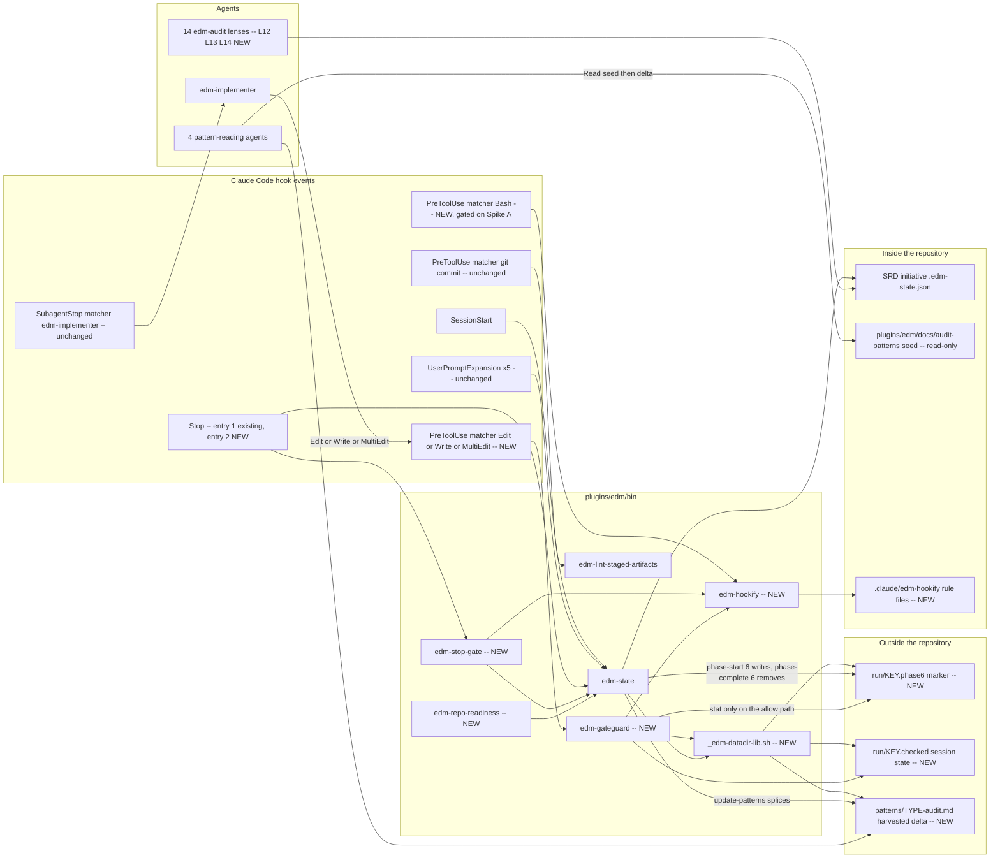
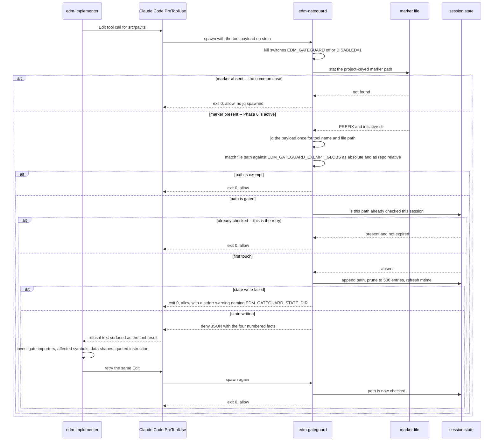
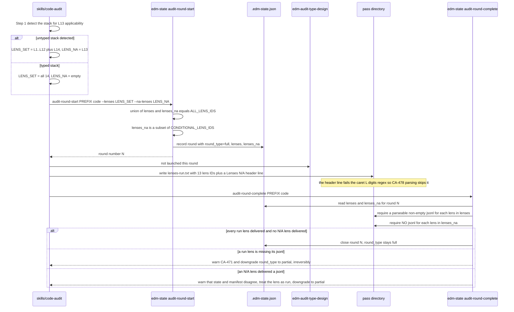
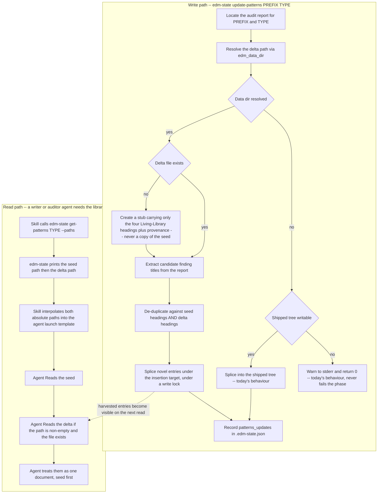

# Target Architecture: EDMV4

Scope: the eleven items Gate 1 kept in EDMV4 (4.1-4.4, 5.2-5.5, T01, T04, T05). 5.1 is a named
follow-on and is not designed here. Every file:line citation is against the working tree explorers
01-04 read and must be re-verified after the D4 rebase.

---

## Architecture Decision

**Extend EDM's existing bash-plus-jq enforcement surface with one new marker-driven `PreToolUse`
gate and one new `Stop` entry, both implemented as standalone `bin/` scripts that never invoke
`edm-state` on their common path. Add no new runtime dependency and vendor no third-party code.**

The initiative's centre of gravity is 4.1: EDM has to start enforcing at per-tool-call cadence,
and it has never done that. Today `PreToolUse` fires exactly once per `git commit`
(`hooks/hooks.json:81-89`), where a 3,000 ms p95 budget is acceptable because a human is already
waiting on the commit. An edit gate fires tens to hundreds of times per Phase 6 wave. Everything
else in this design follows from refusing to pay `edm-state`'s startup cost at that frequency.

The single load-bearing primitive is a **Phase-6 marker file** at a fixed, project-keyed path
outside the repository, written by `edm-state phase-start <PREFIX> 6` and removed by
`phase-complete`/`skip-phase`/`archive`, with SessionStart reconciliation as the self-healing path.
The gate's common case -- "not in Phase 6, allow" -- costs one process exec and one `stat`, with
zero `jq` subprocesses and zero state reads. The rejected alternative (re-running
`cmd_active_initiatives`'s sweep, `bin/edm-state:3900-3916`) costs one `edm-state` startup plus one
`jq` per active initiative on **every** edit, which at the 50-initiative fixture `CLAUDE.md`'s own
latency table already uses is 50 `jq` invocations per keystroke-level operation.

Five sub-decisions carry the rest of the design.

### AD1 -- GateGuard is a bash rewrite scoped to `Edit`/`Write`/`MultiEdit`, not a Node vendoring

Gate 1 (D6) deferred vendor-versus-rewrite to Phase 2. The decision is **rewrite**, and the reason
is a scope observation the source analysis and both explorers treated as fixed: ECC's
`gateguard-fact-force.js` is 1,301 lines and drags in `shell-substitution.js` (482) plus
`gateguard-heredoc.js` (259) **solely to serve its destructive-Bash arm**
(`isDestructiveBash():674-721` is the only consumer of `stripHeredocBodies` and
`explodeSubshells`, per explorer 04 Sec.1). EDM item 4.1 is an *edit* gate. Dropping the
destructive-Bash arm deletes the entire recursive-BFS shell tokenizer that explorer 04 assessed as
"the harder half to port" -- the 741 lines of helper closure go to zero, and what remains is a
fact-forcing state machine plus glob exemption plus session state, which is 250-350 lines of
bash 3.2.

Accepted trade-off: EDM does not get a destructive-Bash gate. That is a real coverage gap, and it
is bounded -- EDM already blocks the one destructive Bash operation its methodology cares about
(`git commit`, via `edm-lint-staged-artifacts`), and a general destructive-command detector is
better served later by 5.3's rule files than by 741 lines of vendored tokenizer nobody in this
plugin can maintain in bash.

Three consequences fall out and each is a benefit: Node never becomes a Phase 6 runtime dependency
(the required-binary list stays `bash`/`jq`/`git`); **DECISION F is closed, not merely deferred** --
nothing from `zunoworks/gateguard` is copied, so its unverified upstream licence stops blocking
4.1; and the clean-room posture matches the `caveman`/`ponytail` precedent already recorded in
`CLAUDE.md Sec."Prompt conventions (house style)"` (mechanism adopted structurally, no text lifted).
The mechanism itself is publicly described in ECC's own MIT-licensed `skills/gateguard/SKILL.md`
prose, which is what is being translated.

Two fixes are applied rather than inherited. ECC's exempt-glob matcher is an unanchored substring
regex, so `**/tests/**` matches `/repo/tests/x.js` but not the bare relative `tests/x.js`
(explorer 04 Sec.1). EDM's matcher tests each glob against **both** the absolute path and the
repository-relative path using bash `case` pattern matching, so one entry covers both forms. And
both kill switches travel: `EDM_GATEGUARD=off` and `EDM_GATEGUARD_DISABLED=1` (the analysis's table
omitted the second).

### AD2 -- The deny mechanism is one function with two back-ends, defaulted to the JSON shape

`permissionDecision` and `hookSpecificOutput` appear **zero times** in this repository (explorer 02
Sec.1.3). EDM has only ever blocked via exit codes, and only on a `Bash`-wrapped tool call. Whether
an exit-code-only hook can deny a native `Edit` is Spike B and is unverified in both directions.

Rather than betting the design on the spike, `bin/edm-gateguard` routes every refusal through a
single `emit_decision deny|allow <reason>` function with two back-ends selected by
`EDM_GATEGUARD_DENY_MODE`:

- `json` (default): print `{"hookSpecificOutput":{"hookEventName":"PreToolUse",
  "permissionDecision":"deny","permissionDecisionReason":"<facts>"}}` on stdout, exit 0.
- `exit-code`: print the fact list on stderr, exit 2 (the code
  `edm-lint-staged-artifacts:7-10` already uses to mean "block").

The default is `json` because it is the only mechanism observed working in a shipped
implementation for these three tools. Spike B flips a default constant and a smoke assertion, not
a rewrite. Exit 1 stays reserved for setup errors and never blocks, matching
`edm-lint-staged-artifacts`'s violation-versus-setup split exactly.

Accepted trade-off: this introduces a second hook response protocol into a plugin whose tooling
(`edm-check-vocabulary`, `edm-lint-artifacts`, the smoke suite) has never reasoned about stdout as
a control channel. Mitigation: the JSON is emitted from exactly one function, and
`bin/tests/wave8-smoke.sh` asserts its shape by parsing it with `jq`, so a malformed emission is a
test failure rather than a silently-unenforced gate.

### AD3 -- One shared data-directory resolver, first `${CLAUDE_PLUGIN_DATA}` consumer in `bin/`

4.1's marker and 4.2's harvested pattern delta both need a writable, plugin-owned, outside-the-repo
directory. Nothing in `bin/` has ever resolved one (`CLAUDE_PLUGIN_DATA` appears only in
`CLAUDE.md:71` prose and in the analysis document). A new `bin/_edm-datadir-lib.sh`, sourced by
`edm-state`, `edm-gateguard` and `edm-hookify`, owns the whole question:

```
edm_data_dir()      ${CLAUDE_PLUGIN_DATA} if absolute and creatable
                 -> ${XDG_DATA_HOME}/edm  if XDG_DATA_HOME is absolute
                 -> ${HOME}/.local/share/edm
                 -> (unresolvable) empty string, callers degrade
edm_project_key()   CLAUDE_PROJECT_DIR if it names a directory
                 -> git rev-parse --show-toplevel
                 -> pwd
                    then '/' and '.' replaced by '-' in pure bash
```

The three-step absolute-only chain with fall-through-on-relative is the structural pattern from
ECC's MIT-licensed `homunculus-dir.sh` (31 lines, explorer 04 Sec.2). The project-key encoding is
EDM's own existing idiom from `session_dir_for_cwd` (`bin/edm-state:307-312`), reimplemented with
bash parameter expansion instead of `tr` so the hook path spawns no subprocess. The
`CLAUDE_PROJECT_DIR`-then-git-toplevel-then-cwd order is the CA-448 precedent from
`check_permission_rules`, so a hook invoked from a subdirectory keys the same marker the
`edm-state` writer created.

Two subdirectories, one durable and one ephemeral: `${data}/patterns/` (harvested audit-pattern
deltas) and `${data}/run/` (markers and GateGuard session state).

### AD4 -- Event ownership: one EDM-authored body per tool family, and the `Stop` event grows a sibling entry rather than a sibling block

EDM has never had two independently-authored blocking hooks compete on one tool call. This design
avoids creating that situation wherever it can, and names the one place it cannot.

- **`Stop`.** 5.4 (validate surfacing) and 5.3 (stop-event rules) both want `Stop`, alongside
  `checkpoint-if-active`. Rather than adding a second matcher block, add a **second entry to the
  existing block's `hooks` array** (`hooks.json:92-99`). The in-repo evidence for that shape is
  strong and specific: every `UserPromptExpansion` block already carries two entries in one `hooks`
  array (a `command` and a `prompt`, e.g. `hooks.json:16-24`) and both demonstrably execute. The
  new entry runs `bin/edm-stop-gate`, a single EDM-authored script that owns the whole Stop
  surface -- it runs `edm-state validate` and honours only the `blocking` class, then evaluates any
  hookify `stop`-event rules. There is exactly one owner of the Stop body, so the combination
  question is never asked.
- **`PreToolUse`, `Edit`/`Write`/`MultiEdit`.** One new matcher block, one entry, running
  `edm-gateguard`. It is matcher-disjoint from the existing `git commit` block (which matches a
  `Bash` invocation), so it does not exercise the unverified case either. GateGuard evaluates
  hookify `file`-event rules in-process after its own decision, so 5.3 never needs its own block
  here.
- **`PreToolUse`, `Bash`.** This is the one genuine collision: a hookify `bash`-rule block with
  matcher `Bash` would overlap the existing `git commit` block on any `git commit` call.
  **Gated on Spike A.** If the host executes every matching block, register the second block. If it
  does not (first-registered-wins, or requires consolidation), the fallback is to fold
  `edm-lint-staged-artifacts` into `edm-hookify`'s Bash dispatcher: one block, matcher `Bash`, one
  script that runs the staged-artifact lint when the command is a `git commit` and then evaluates
  bash rules. That fallback is more invasive -- it touches the plugin's only proven-working
  blocking hook -- which is exactly why it is the contingency and not the plan.

### AD5 -- `round_type` stays a two-value enum. The third state is a new sibling field

`round_type` is read by `audit-converged` (partial is never convergent), `cmd_archive`, HANDOFF,
`metrics-report`, and the CA-471 backstop, and the state-field table in `CLAUDE.md` documents it as
a `full` | `partial` enum with a defined C-4 unknown case. Widening that enum to three values
touches every one of those readers plus roughly 28 smoke assertions.

Instead: `round_type` keeps its two values and its exact meaning ("did this round cover everything
it was supposed to cover"). The new information lives in a new sibling field
`audit_rounds.<type>.rounds[].lenses_na`, an array recorded at `audit-round-start` alongside the
existing `lenses`. The derivation changes from set-equality to:

```
round_type = full   when  (lenses UNION lenses_na) == ALL_LENS_IDS
                    and   lenses_na is a subset of CONDITIONAL_LENS_IDS
             partial otherwise
```

`CONDITIONAL_LENS_IDS="L13"` is a new constant beside `ALL_LENS_IDS` (`bin/edm-state:1613`) with
the same word-membership idiom and its own length self-check. An operator-requested subset produces
an empty `lenses_na` and still reads `partial`, so nothing about today's behaviour changes for
today's inputs. This is the property that makes the design safe: **for every input that exists
today, the new derivation returns the identical answer.**

The anti-abuse property is timing, not policy. `lenses_na` is written by
`audit-round-start`, which `skills/code-audit/SKILL.md` step 4 calls **before** step 7 launches any
lens agent. A lens cannot be declared N/A after it has failed to deliver.

### AD6 -- Pattern library: read-only shipped seed plus a harvested stub delta, path-resolved by `edm-state`, read by two `Read` calls

Explorer 01 identified two read designs. Route (a), four agents doing two `Read`s and merging
in-context, pushes merge order and de-duplication into four prompts -- exactly the duplicated-logic
class `docs/audit-patterns/README.md`'s Append Schema exists to prevent, and the D6 guard's general
shape. Route (b), a new `edm-state get-patterns <type>` subcommand that concatenates to stdout,
centralises the logic but requires a `Bash` grant on `edm-srd-writer` and `edm-ticket-writer`,
**neither of which has one today** (`edm-srd-writer.md:8`, `edm-ticket-writer.md:7`); granting Bash
to two writer agents to read a documentation file is a disproportionate widening of a deliberately
narrow tool surface.

This design takes route (c): `edm-state get-patterns <type> --paths` prints the two resolved
absolute paths, seed first and delta second, one per line. The **launching skill** (which already
has Bash) calls it and interpolates both paths into the agent launch template. The four agents do
two ordinary `Read`s of explicit absolute paths and need no new grant. Merge authority -- which
file, in which order -- lives in `edm-state`, not in four prompts.

This also fixes a defect on the way past. Today all four agents are told to resolve the plugin root
themselves with no named mechanism (`edm-implementer.md:19`), the same unresolvable-reference class
D22 documents for `CLAUDE.md Sec."..."` references. Interpolated absolute paths remove the guess.

Explorer 01's riskiest assumption -- that two documents' guidance can be merged without
double-counting -- is closed structurally: the harvested delta is created as a **stub** carrying
only the four Living-Library contract headings plus a provenance line, never a copy of the seed's
content. Seed and delta are disjoint by construction, so concatenation cannot duplicate an entry.

---

## Component Design

### New components

| Component | File path | Responsibility | Interface | Dependencies |
|---|---|---|---|---|
| Data-dir resolver | `plugins/edm/bin/_edm-datadir-lib.sh` (new) | Resolve the writable plugin data root and the project key, once, for every consumer | Sourced. `edm_data_dir()` prints an absolute dir or empty; `edm_project_key()` prints an encoded project key; `edm_marker_path()` prints `${data}/run/<key>.phase6` | `${CLAUDE_PLUGIN_DATA}`, `${XDG_DATA_HOME}`, `${HOME}`, `${CLAUDE_PROJECT_DIR}`, `git rev-parse` (fallback only) |
| GateGuard edit gate | `plugins/edm/bin/edm-gateguard` (new, ~250-350 lines) | Deny the first `Edit`/`Write`/`MultiEdit` per file per session during Phase 6, with a numbered fact list, and allow the retry | stdin: the host's `PreToolUse` JSON payload. stdout: deny JSON or nothing. stderr: diagnostics. Exit 0 allow or deny-via-JSON, 1 setup error (non-blocking), 2 deny-via-exit-code | `_edm-cli-lib.sh`, `_edm-datadir-lib.sh`, `jq` (only after the marker test passes), `edm-hookify` (optional, file-event rules). **Never `edm-state`** |
| Hookify rule loader and evaluator | `plugins/edm/bin/edm-hookify` (new) | Load enabled JSON rule files once and evaluate all of them against one payload in a single `jq` pass | `edm-hookify list`; `edm-hookify eval <file\|bash\|stop> < payload.json` prints matched `rule_id action message` lines. Exit 0 no match, 1 setup error, 2 at least one `block` action | `_edm-cli-lib.sh`, `jq`, rule files under `.claude/edm-hookify/*.json` |
| Stop-event gate | `plugins/edm/bin/edm-stop-gate` (new) | Own the whole EDM `Stop` surface: surface blocking `validate` anomalies early, then evaluate `stop`-event rules | No arguments. stderr carries all operator text (Stop hooks write to stderr, never stdout). Exit 0 continue, 2 block | `_edm-cli-lib.sh`, `edm-state validate`, `edm-state active-initiatives`, `edm-hookify` |
| Repo-readiness scorecard | `plugins/edm/bin/edm-repo-readiness` (new) | Aggregate signals `edm-state` already computes into named 0-10 categories under a versioned rubric | `edm-repo-readiness [<PREFIX>] [--json <path>]`. Text to stdout, machine-readable JSON to a file. Exit 0 scored at any score, 2 usage or setup error | `_edm-cli-lib.sh`, `edm-state validate`, `edm-state session-start`, `edm-state get-coverage`, `edm-state metrics-report` |
| L12 lens agent | `plugins/edm/agents/edm-audit-silent-failures.md` (new) | Code-audit lens L12, five silent-failure categories, unconditional | Standard lens contract: writes `${OUTPUT_DIR}/lens-L12.md` and `.jsonl` | House lens contract (explorer 03 Sec.1.2), `docs/canonical-sections.md` |
| L13 lens agent | `plugins/edm/agents/edm-audit-type-design.md` (new) | Code-audit lens L13, four type-design dimensions, auto-N/A on an untyped stack | Same, plus: on N/A it writes **nothing** and the round records it in `lenses_na` (absence is authoritative, per the `edm-test-integration.md:21-25` precedent) | As above, plus `skills/code-audit/SKILL.md` Step 1's stack detection as sole applicability authority |
| L14 lens agent | `plugins/edm/agents/edm-audit-behavioral-tests.md` (new) | Code-audit lens L14, behavioural coverage of changed code, unconditional | Same. Its Scope section carries one sentence bounding it against L4 and `edm-test-coverage-auditor` | As above |
| Phase-6 marker | `${data}/run/<project-key>.phase6` (new, not in repo) | Single cheap answer to "is this project in Phase 6" | One line: `PREFIX<TAB>initiative_dir<TAB>started_at` | Written and removed by `edm-state`, read by `edm-gateguard` |
| GateGuard session state | `${data}/run/<project-key>.checked` (new, not in repo) | Which file paths have already been fact-checked this session | Newline-delimited absolute paths, 500-line cap, 30-minute idle expiry by mtime | `edm-gateguard` only |
| Harvested pattern deltas | `${data}/patterns/{srd,ticket,qc,code,test-coverage}-audit.md` (new) | Writable half of the pattern library on a read-only install | Same four Living-Library headings as the seed, created as a stub on first write | `edm-state update-patterns`, read via `get-patterns --paths` |
| GateGuard and Stop smoke suite | `plugins/edm/bin/tests/wave8-smoke.sh` (new) | Regression coverage for every new runtime surface | Standard smoke-suite contract, picked up by `run-all.sh` | `bin/tests/` harness |

### Modified components

| Component | File path | Change | Interface impact | Dependencies |
|---|---|---|---|---|
| `PreToolUse` registrations | `hooks/hooks.json:80-90` | Add one matcher block for `Edit`/`Write`/`MultiEdit` delegating to `edm-gateguard`. Optionally a `Bash` block for hookify, gated on Spike A | New block; existing `git commit` block untouched | `edm-gateguard`, `edm-hookify` |
| `Stop` registration | `hooks/hooks.json:91-100` | Add `edm-stop-gate` as a **second entry in the existing block's `hooks` array**, after `checkpoint-if-active` | Existing entry byte-identical | `edm-stop-gate` |
| `cmd_phase_start` | `bin/edm-state:2508-2562` | After the successful `rmw_state`, write the marker when `phase == 6` | None. Marker write failure warns and proceeds -- it must never fail a phase transition | `_edm-datadir-lib.sh` |
| `cmd_phase_complete` | `bin/edm-state:2564+` | Remove the marker when `phase == 6` | None | `_edm-datadir-lib.sh` |
| `cmd_archive`, `cmd_skip_phase` | `bin/edm-state:3096+`, skip-phase arm | Remove the marker defensively | None | `_edm-datadir-lib.sh` |
| `cmd_session_start` | `bin/edm-state:4347+` | Reconcile: if a marker exists but its named initiative is not at `current_phase == 6`, remove it. Runs inside the sweep that already happens at this cadence | Adds one line of operator output when it fires | existing sweep |
| `ALL_LENS_IDS` and self-check | `bin/edm-state:1613,1615` | 11 -> 14 lens IDs, count assertion and its message to 14. Add `CONDITIONAL_LENS_IDS="L13"` with its own assertion | `--lenses` validation range widens | none |
| `cmd_audit_round_start` | `bin/edm-state:4531-4580`, derivation at `:4552-4573` | Add `--na-lenses <csv>`. Replace set-equality with the union rule in AD5. Record `lenses_na` in the round entry (`:4524`) | New optional flag, backward compatible: omitted means empty `lenses_na` and today's exact behaviour | `ALL_LENS_IDS`, `CONDITIONAL_LENS_IDS` |
| CA-471 completeness backstop | `bin/edm-state:4617-4675` | Read `lenses_na` from the round record. Skip those IDs when requiring a JSONL. Additionally downgrade if a JSONL exists for a lens declared N/A, or if `lenses UNION lenses_na` no longer covers `ALL_LENS_IDS` | Downgrade remains irreversible and warn-loud | round record written at start |
| `cmd_update_patterns` write target | `bin/edm-state:5581-5604` (`patterns_dir` at `:5595`) | Resolve the delta path via `edm_data_dir`, seed-stub it on first use, and splice into the delta rather than the shipped tree | None for callers | `_edm-datadir-lib.sh` |
| Read-only skip branch | `bin/edm-state:5625-5630` | Becomes: try the data dir, then the shipped tree if writable (today's behaviour), then warn-and-skip (today's behaviour). Strictly additive | None | as above |
| Stale caller-count comment | `bin/edm-state:5672` | "four skills" -> the six verified call sites, or reworded to avoid a maintained count | None | none |
| `get-patterns` subcommand | `bin/edm-state` (new arm, dispatch at `:6239+`) | Print the seed and delta paths in read order | `edm-state get-patterns <type> --paths` | `_edm-datadir-lib.sh` |
| Pattern-file read sites | `agents/edm-srd-writer.md:25`, `edm-ticket-writer.md:32`, `edm-implementer.md:24-25`, `edm-test-coverage-auditor.md:40-42` | Read two interpolated absolute paths instead of one plugin-root-relative path. One sentence on merge order, referencing `docs/audit-patterns/README.md` | No new tool grant | launching skills |
| Pattern-launching skills | `skills/{srd,tickets,implement,test-coverage}/SKILL.md` | Call `get-patterns --paths` and interpolate into the launch template | Existing `Bash` grants suffice | `edm-state` |
| Code-audit lens surface | `skills/code-audit/SKILL.md` (12 sites, explorer 03 Sec.1.1 rows 10-20) | 11 -> 14 throughout. New Step 1 stack detection computing the L13 N/A determination. Step 4 passes `--na-lenses`. Step 8 adds a `Lenses N/A:` header line to `lenses-run.txt` | `--lenses` range, `ROUND_TYPE` derivation prose | `edm-state` |
| Orchestrator size classifier | `skills/orchestrator/SKILL.md:103-114` | New Step 1b.5 computing a tier from three signals and annotating "(Recommended)" on the Step 1c.1 mode dialog and the 1c.2 compliance dialog | No new dialog; it selects which existing option is annotated | `MODE_ENUM_LIST`/`LIFECYCLE_MODE_ENUM_LIST` (`bin/edm-state:807-808`) as hard backstop |
| Lens-count assertions | `bin/tests/wave7-smoke.sh` (~28 sites), `wave6-smoke.sh:3440-3448` | Retarget to 14. T47 AC6 and T48 AC6 are deliberately rewritten, not incremented. `wave6-smoke.sh`'s explicit 11-lens full-round call becomes a 14-lens call, plus a new 13-plus-N/A case | Test-only | 4.4 |
| Full-round fixture | `bin/tests/fixtures/code-audit/README.md:33` and the fixture tree | 11 -> 14 lens pairs, plus an N/A fixture with 13 pairs and `lenses_na: ["L13"]` | Test-only | 4.4 |
| By-name reference anchors | 14 files (5 agents, 9 skills -- explorer 03 Sec.4.1) | Append the canonical `Read docs/canonical-sections.md ...` sentence at each bare `CLAUDE.md Sec."..."` citation | None | `docs/canonical-sections.md` |
| Canonical sections generator | `CLAUDE.md`, `docs/canonical-sections.md`, `bin/edm-sync-canonical-sections` | Add "Unverifiable acceptance criteria (D15)" as a third generated section so `edm-qc-auditor.md:39` resolves. Re-run the generator, re-verify `--check` | Generated file grows one section | T04 |
| Explorer prompt (codemap) | `agents/edm-explorer.md` | The first explorer of an initiative writes or refreshes `SRD/.codemap.md` (current architecture, distinct from this file which is target architecture) | New optional output | 5.5 |
| Hook/lint documentation | `plugins/edm/CLAUDE.md` "Hooks behavior", `bin/` helper table, state-field table, agent-colour table | Three new `bin/` rows, a `lenses_na` state-field row, two new hook rows, 11 -> 14 in the colour table | Documentation | all |

---

## Diagrams

### System context after this initiative



### Sequence: a Phase 6 edit through GateGuard



`MultiEdit` iterates the batch and denies on the first still-unchecked `file_path`, so a
three-file batch with three unchecked files needs three retries, not one. That is the mechanical
subtlety correction 10 in `planning.md` records.

### Sequence: round_type derivation with an auto-N/A lens



The third case is what distinguishes "legitimately N/A" from "missing JSONL", and it distinguishes
them without trusting anything written after the lenses ran. `lenses_na` is committed to state
under lock at round-start, before step 7 launches a single agent, so a lens cannot retroactively
excuse its own non-delivery. A lens that was declared N/A but produced output means the skill's
Step 1 detection and the agent disagreed, which is a contract violation in the same shape
`edm-test-integration.md:22-25` already names for the test layer -- so it downgrades rather than
silently accepting either story.

### Flow: pattern library seed plus harvested delta



The two sides must land in one commit. A seed-only read against a delta-only write silently loses
everything harvested, and the loss is invisible because `update-patterns` reports success.

---

## Data Flow

### GateGuard, entry to output

1. **Entry.** The host serialises the `Edit`/`Write`/`MultiEdit` call as JSON on the hook's stdin
   and execs the block's command, which is `command -v edm-gateguard >/dev/null 2>&1 || exit 0;
   exec edm-gateguard`. The path resolution and marker test live in the script, not in the JSON
   string -- CA-436 is the recorded reason a one-line JSON hook body is the wrong place for logic.
2. **Kill switches.** `EDM_GATEGUARD` in `0|false|off|disabled|disable`, or
   `EDM_GATEGUARD_DISABLED=1`, exits 0 before anything else.
3. **Marker test.** `edm_marker_path` is pure string work over `${CLAUDE_PROJECT_DIR}` or the
   git toplevel. One `test -f`. Absent, exit 0. **No `jq` has run and no state file has been
   opened.** This is the branch that executes on every edit outside Phase 6 and on every edit in
   any project that is not running EDM at all.
4. **Payload parse.** One `jq -r` extracting `tool_name` and `tool_input.file_path` (or the
   `edits[].file_path` list for `MultiEdit`). A parse failure is a setup error: warn on stderr,
   exit 1, do not block.
5. **Exemption match.** Each `EDM_GATEGUARD_EXEMPT_GLOBS` entry is tested with bash `case` against
   the absolute path and against the path relative to the project root. `**` normalises to `*`.
   Match, exit 0.
6. **First-touch decision.** The session-state file is read once. If its mtime is older than 30
   minutes it is treated as empty and truncated. Path present means retry, allow. Path absent means
   first touch: append, prune to the newest 500 entries, then deny.
7. **Deny output.** `emit_decision deny` renders the four numbered facts for `Edit` (importers,
   affected public symbols, data-file shape with redacted values, the quoted user instruction) or
   the `Write` variant (naming callers, confirming no existing file serves the purpose) through the
   AD2 back-end.
8. **Rule evaluation.** On an allow, and only inside Phase 6, `edm-hookify eval file` is invoked
   with the same payload. Its exit 2 escalates to a deny through the same `emit_decision`.
9. **Exit.** 0 allow or deny-as-JSON, 1 setup error non-blocking, 2 deny-as-exit-code.

Error paths, all fail-open by design:

- Data dir unresolvable -> `edm_marker_path` returns empty -> treated as marker absent -> allow.
- Marker present but its named initiative directory is gone (branch switch, `git clean`) -> allow,
  and SessionStart reconciliation removes the marker on the next session.
- Session-state write fails (read-only `$HOME`, full disk) -> allow with a stderr warning naming
  `EDM_GATEGUARD_STATE_DIR`. Never deny on a state failure: a gate that cannot record what it has
  already asked would otherwise deny the same edit forever.
- Denial budget: after `EDM_GATEGUARD_MAX_DENIALS` (default 3) full denials in one session, the
  gate degrades to a stderr advisory and allows, so a pathological loop cannot wedge a wave.
- `jq` missing -> exit 1, non-blocking, matching the CA-298 convention that a setup condition never
  blocks.

### Latency argument

| Design | Per-edit cost outside Phase 6 | Per-edit cost inside Phase 6 |
|---|---|---|
| Sweep `cmd_active_initiatives` per edit | 1 `edm-state` startup (approximately 6,300 lines parsed) + 1 `jq` per active initiative -- 50 `jq` at the fixture size `CLAUDE.md:816-824` uses | same |
| `edm-state get <PREFIX> current_phase` | not available -- the hook receives no `PREFIX` | not available |
| **Marker file (chosen)** | 1 exec of a ~300-line script, 1 `stat`, 0 `jq`, 0 state reads | 1 exec, 2-3 `stat`, 1 `jq`, 1 small append |

`cmd_checkpoint` (`bin/edm-state:2735+`) is the ceiling example of what must not run here: it takes
a write lock and computes a SHA-256 over every tracked artifact per active initiative. It runs at
`Stop`/`PreCompact` cadence, a handful of times per conversation. Running anything of that shape
per edit is the failure mode this design exists to avoid.

There is no timing fixture for a per-edit hook today the way `bin/tests/timing.sh` measures
`edm-lint-artifacts`. `timing.sh` gains a `--gateguard` mode measuring p95 for both branches
against a generated fixture, with a stated budget of **50 ms p95 on the allow path** quoted
together with its input size, per the rule in `CLAUDE.md Sec."edm-lint-artifacts latency budgets"`
that a bare millisecond ceiling with no fixture is meaningless.

### `round_type`, entry to output

Entry is `skills/code-audit/SKILL.md` Step 1. Stack detection produces `LENS_SET` and `LENS_NA`.
Step 4 passes both to `audit-round-start`, which validates the union against `ALL_LENS_IDS` and
`lenses_na` against `CONDITIONAL_LENS_IDS`, derives `round_type`, and writes the round record under
lock. Step 8 writes `lenses-run.txt` (run lenses, one per line, plus a `Lenses N/A:` header the
existing `^L[0-9]+$` filter already skips). `audit-round-complete` re-reads the round record from
state -- not from the manifest -- and applies the three-way CA-471 check.

Error paths:

- `--na-lenses` naming a lens outside `CONDITIONAL_LENS_IDS` -> `die` at round-start. A lens is not
  conditional because a caller says so.
- `--na-lenses` omitted on an untyped stack -> `lenses_na` is empty, the union misses L13, the round
  records `partial`, and `audit-converged` refuses. The failure is loud and conservative.
- A pre-existing round with no `lenses_na` key -> reads as `[]` via jq `//`, so every round recorded
  before this change derives exactly as it does today (C-4).
- A round whose pass directory or manifest is absent -> the backstop does not fire at all, unchanged
  from today.

---

## Integration Points

| System | Protocol | Auth | Error handling |
|---|---|---|---|
| Claude Code `PreToolUse` | Process exec. JSON payload on stdin. Decision by JSON on stdout or by exit code (AD2) | None. Host-managed, same trust tier as the existing hooks | Exit 1 setup error never blocks (CA-298 convention). `command -v` guard so a missing binary exits 0. Unparseable payload warns and allows |
| Claude Code `Stop` | Process exec, no stdin contract. **All operator text to stderr, never stdout** | None | `edm-stop-gate` exits 0 on any internal error. Only a `blocking`-class `validate` anomaly or a hookify `block` action returns 2 |
| Claude Code `SessionStart` | Process exec, existing registration | None | Unchanged `&& ... || true` -- never fails a session. Marker reconciliation inherits that |
| Plugin data directory | POSIX filesystem under `${CLAUDE_PLUGIN_DATA}` or the XDG fallback | OS file permissions | Every write is best-effort. Unresolvable or unwritable degrades to the current shipped-tree behaviour, then to warn-and-skip. Nothing in this design fails a phase because a cache could not be written |
| `.edm-state.json` | `edm-state` subcommands only, `rmw_state` under `with_state_lock` | Filesystem | Unchanged. The marker is a derived cache, never a second source of truth -- SessionStart reconciles it against state, never the reverse |
| Hookify rule files | JSON under `.claude/edm-hookify/*.json`, read with `jq` | Project-local, no network | A malformed rule file is a setup error: named on stderr, skipped, exit 1 from `edm-hookify`, which never escalates to a block. A rule that is valid and fires with `action: block` produces exit 2 |
| Git | `git rev-parse --show-toplevel` in the project-key fallback only, plus the unchanged `edm-lint-staged-artifacts` path | Local repo | Not a repository -> fall back to `pwd`. Never fatal |
| Anthropic API | Only `evals/run-eval.sh`, unchanged and out of this design's runtime path | `ANTHROPIC_API_KEY`, human-owned | T05's baseline capture stays a human credential decision (D9). `edm-compare-eval` exits 3 "NOT ARMED" meanwhile |

There are no message queues, databases, or network services in this design. That is deliberate:
every new integration point is a file or a process on the local machine, which is what keeps the
per-edit budget achievable and the failure modes enumerable.

---

## Architectural Risks

### The three unverified assumptions

**R1. Multi-hook-per-event combination semantics (Spike A).** The design avoids the unknown
everywhere it can -- `Stop` becomes a second entry in one block (a shape `hooks.json:16-24` already
proves executes), and the new `PreToolUse` block is matcher-disjoint from `git commit`. The one
place it cannot be avoided is hookify's `bash` rules, which need a `Bash` matcher that overlaps the
`git commit` block. **If false**, that block either never fires or suppresses the commit lint --
the second outcome is the dangerous one, because it would silently disable the plugin's only
working blocking hook. **Fallback**: fold `edm-lint-staged-artifacts` into `edm-hookify`'s Bash
dispatcher so there is one block on `Bash`, one owner, and the lint runs first. **Detection**:
Spike A must specifically test two blocks on the same event where the first allows and the second
denies, and assert which decision the host takes. Until Spike A lands, hookify ships with `file`
and `stop` events only, both of which have single owners.

**R2. Exit codes cannot deny a native `Edit` (Spike B).** **If false in the JSON direction** (the
host ignores `hookSpecificOutput`), GateGuard denies nothing and the fact-forcing mechanism is
inert while appearing to work -- the worst failure shape, because the allow path is silent.
**Fallback**: `EDM_GATEGUARD_DENY_MODE=exit-code`, a one-constant change per AD2. **Detection**:
`bin/tests/wave8-smoke.sh` asserts the emitted JSON parses and carries
`permissionDecision == "deny"`, which catches a malformed emission but cannot catch a host that
parses it and ignores it. Only Spike B, run against the live host, can catch that. **4.1 must not
be ticketed before Spike B**, per the Gate 1 condition.

**R3. `${CLAUDE_PLUGIN_DATA}` writability and persistence across plugin upgrades.** Zero existing
consumers in `bin/`; the variable is prose in `CLAUDE.md:71` only. Two distinct sub-risks. **If
unwritable**, `edm_data_dir` falls through to XDG and then to `${HOME}/.local/share/edm`, and if all
three fail it returns empty: the marker is treated as absent (GateGuard degrades to today's
behaviour, which is no gate at all) and `update-patterns` degrades to today's behaviour (shipped
tree if writable, warn-and-skip otherwise). Nothing regresses. **If not persistent across plugin
upgrades**, the marker's loss is harmless -- it is ephemeral by design and SessionStart reconciles
it -- but the **harvested pattern delta would be silently erased on every upgrade**, which is the
real exposure and is invisible: `update-patterns` would keep reporting successful appends into a
directory that periodically empties. **Fallback**: `${data}/patterns/` records a
`harvest-provenance.json` with a write count and first-write timestamp; `edm-state validate` gains
an informational anomaly when the shipped seed's mtime is newer than the delta's first-write
timestamp, which is the observable signature of an upgrade having cleared the delta. **Mitigation
if it proves true**: move `${data}/patterns/` to `${XDG_DATA_HOME:-$HOME/.local/share}/edm`
unconditionally and reserve `${CLAUDE_PLUGIN_DATA}` for `run/` only, which is exactly the
durable-versus-ephemeral split AD3's two subdirectories were designed to make cheap.

### Other risks this design rests on

**R4. A per-edit `stat` is actually cheap enough at EDM's real Phase 6 edit frequency.** Plausible
and standard, but unmeasured for this plugin -- no per-edit timing fixture exists today. Mitigated
by the `timing.sh --gateguard` mode and the stated 50 ms p95 allow-path budget. If the budget
cannot be met, the remaining lever is collapsing the hook to a marker test with no separate process
at all, which means inlining logic into the hook's JSON string -- the thing CA-436 exists to
prevent -- so the budget is worth defending.

**R5. The ~28 `wave7-smoke.sh` assertions are the complete set.** Found by grep, not by reading a
7,000-line file. A bare `-eq 11` with no nearby "eleven" token could have been missed. Mitigated by
a mandatory second pass grepping `-eq 11` and `== 11` before the 4.4 inventory is considered
closed, which `planning.md` already records as an assumption to re-check.

**R6. Two initiatives simultaneously in Phase 6 in one repository.** The marker is per-project, not
per-initiative, and holds the most recent Phase 6 entry. GateGuard's gate is repository-scoped
anyway -- it gates all edits while any Phase 6 is active -- so this is correct rather than
merely tolerable. It does mean `phase-complete` on the second initiative removes a marker the first
still wants. Mitigation: `phase-complete` removes the marker only when its recorded PREFIX matches,
and SessionStart reconciliation restores it if another initiative is still at phase 6.

**R7. Four pattern-reading agents now depend on their launching skill interpolating two paths.** If
a skill is edited to spawn the agent without the interpolation, the agent gets no paths and
silently reads nothing. Mitigated by `bin/edm-check-grants`, which already checks skill launch
templates as one of its four sources, gaining an assertion that every launch template spawning one
of the four agents carries both interpolated paths.

**R8. The size classifier can only recommend one of eight enum values.** This is a backstop, not a
risk -- `cmd_set_mode` (`bin/edm-state:5063-5114`) hard-refuses anything outside
`MODE_ENUM_LIST`/`LIFECYCLE_MODE_ENUM_LIST`. The residual risk is that ECC's four-tier scheme does
not bijection onto EDM's two orthogonal enum families, and `fast-track` and `fix-pack` are
currently documented as behaviourally identical (one shared row in the mode matrix), so the
classifier cannot distinguish "small" from "trivial" without splitting that row. **Decision**: it
does not try. The classifier emits three recommendations -- `fix-pack`, `mini-srd`, `standard` --
and says so in one line the user can override.

**R9. GateGuard's reported effect size does not generalise.** n=2, self-reported, unblinded, no
published rubric. The *mechanism* (forced investigation beats self-assessment) matches EDM's own
audit premise and is why it is being adopted. The *number* must not appear in any ticket AC as a
target. `/edm:metrics` is the honest instrument: measure Phase 6 QC FAIL rate before and after.

---

## Build Sequence

**Phase 0 -- Unblock (nothing else starts until these land).**

1. The D4 rebase onto `origin/main`. Every citation in this document is against a pre-rebase tree.
2. Spike A: two `PreToolUse` blocks matching one call, first allows, second denies. Record as a
   decision.
3. Spike B: can an exit-code-only `PreToolUse` hook deny a native `Edit`. Record as a decision.

Spikes A and B are mechanical, small, and follow the D21/D22/D24 precedent. They do not block
Phase 1.

**Phase 1 -- Foundations and the three quick wins (parallel with the spikes).**

4. `bin/_edm-datadir-lib.sh` plus its smoke coverage. Everything in 4.1 and 4.2 depends on it and
   nothing depends on the spikes.
5. **4.2 in one commit**: write-target resolution, seed-stub creation, `get-patterns --paths`, the
   four agent read sites, the four launching skills, and the stale `:5672` comment. Splitting the
   write side from the read side silently loses harvested content.
6. **T04**: all 14 files, plus D15 as a third canonical section, plus re-running
   `edm-sync-canonical-sections` and re-verifying `--check`.
7. **4.3**: the orchestrator Step 1b.5 classifier.
8. **T01**: re-frame the Mermaid budget as an absolute ceiling plus a sized ratio against
   `timing.sh --generate-fixture`. **T05**: re-verify CA-532 and CA-490, record the baseline
   boundary. Neither needs new harness code.

**Phase 2 -- 4.4, the widest blast radius.** Must precede anything else touching
`wave7-smoke.sh`.

9. `ALL_LENS_IDS` 11 -> 14, `CONDITIONAL_LENS_IDS`, the `--na-lenses` flag, the union derivation,
   and the three-way CA-471 backstop -- with their tests, before any prose changes.
10. `skills/code-audit/SKILL.md`'s 12 sites plus Step 1 stack detection.
11. The three lens agent files.
12. The ~28 `wave7-smoke.sh` assertions and `wave6-smoke.sh:3440-3448`. T47 AC6 and T48 AC6 are
    rewritten deliberately, with the rewrite stated as its own acceptance criterion. Fixtures grow
    to 14 pairs plus a 13-plus-N/A case.
13. The documentation sweep: `CLAUDE.md`, `README.md`, `.claude-plugin/plugin.json`,
    `agents/edm-audit-synthesizer.md`, `evals/README.md`, a new `CHANGELOG.md` entry.

**Phase 3 -- 4.1 GateGuard.** Requires Phase 0's spikes and step 4.

14. Marker producers and removers in `edm-state`, plus SessionStart reconciliation. Ship and verify
    this alone first -- it is independently testable and carries no user-visible behaviour.
15. `bin/edm-gateguard` with `EDM_GATEGUARD_DENY_MODE` defaulted per Spike B.
16. The `hooks.json` `Edit|Write|MultiEdit` block, `wave8-smoke.sh`, and `timing.sh --gateguard`.

**Phase 4 -- 5.4 Stop gate.** Requires the `hooks.json` shape established in Phase 3.

17. `bin/edm-stop-gate` surfacing only `blocking`-class `validate` anomalies. `OPEN_PARTIALS`
    already blocks at `validate` (`bin/edm-state:1827-1847`), so this is wiring, not new policy.
    `OPEN_AUDIT_ROUND` and `SPEC_SWEEP_PENDING` stay warn-only, matching their current `validate`
    classification.
18. The second entry in the existing `Stop` block.
19. The "phase started with no `completed_at`" anomaly is **descoped**. It does not exist today
    (explorer 02 Sec.3.1), a phase legitimately stays started for hours, and a naive presence check
    would block on ordinary long-running work. Recorded as a named scope boundary, not silently
    dropped.

**Phase 5 -- 5.2 scorecard.** Value depends on 4.3 (Phase 1), construction does not.

20. `bin/edm-repo-readiness` aggregating `validate`, `session-start` and `get-coverage` signals into
    named categories under `READINESS_RUBRIC_VERSION`, following `score-artifacts.sh:139`'s
    `SCORER_VERSION` precedent. It re-detects nothing `edm-state` already computes.

**Phase 6 -- 5.3 hookify.** Requires Spike A for the `bash` event only.

21. `bin/edm-hookify` with `list` and `eval`, JSON rule files per D7, one `jq` pass over all enabled
    rules per call -- the direct analogue of `edm-lint-artifacts`'s one-classify-pass and N
    projections (`edm-lint-artifacts:303-448`), so per-call cost does not multiply with rule count.
22. Wire `file` events into `edm-gateguard` and `stop` events into `edm-stop-gate`. Both have single
    owners and need no spike.
23. `bash` events, per AD4, only after Spike A resolves.

**Phase 7 -- 5.5 codemap interim.**

24. `agents/edm-explorer.md` writes or refreshes `SRD/.codemap.md`. No generator is built.

---

## Rejected Alternatives

| Alternative | Rejected because |
|---|---|
| Vendor ECC's three GateGuard Node files as-is | Adds Node as a Phase 6 runtime dependency, imports 741 lines of shell tokenizer that only the descoped destructive-Bash arm needs, and leaves the unverified `zunoworks/gateguard` licence as a live blocker |
| Resolve "is Phase 6 active" by re-running `cmd_active_initiatives` per edit | Cost scales with total active initiatives across the whole `SRD/` tree -- 50 `jq` subprocesses per edit at the fixture size `CLAUDE.md` already uses for a different budget |
| Put the Phase-6 marker inside the repository, under `SRD/` | It would be committed and would mark Phase 6 active for every teammate on the branch. `CLAUDE.md` rule 3 reserves `SRD/` for artifacts that are deliberately source-controlled |
| A single consolidated hook dispatcher process, the way ECC solves its own 23-registration problem | EDM's problem is one registration at high frequency, not many registrations. The ECC fix does not address it, and consolidation would put the plugin's one proven blocking hook behind new untested code |
| Widen `round_type` to a three-value enum | Touches `audit-converged`, `archive`, HANDOFF, `metrics-report`, the state-field table and roughly 28 assertions, to express information that fits cleanly in an orthogonal field |
| Let the L13 agent self-declare N/A at run time and have the backstop trust it | A lens could then excuse its own non-delivery after the fact, which is exactly the CA-471 failure the backstop exists to catch |
| Route (a): four agents each merge the seed and delta in-context by their own rule | Four copies of merge-order and de-duplication logic, the duplicated-logic class the Append Schema and the D6 guard both exist to prevent |
| Route (b): `edm-state get-patterns` concatenating to stdout, called by the agents | Requires granting `Bash` to `edm-srd-writer` and `edm-ticket-writer`, neither of which has it, to read a documentation file |
| YAML hookify rule files matching ECC's format | Zero YAML parsing anywhere in `bin/`, and ECC has no evaluator to stay compatible with (explorer 04 Sec.7) -- only the format was ever reusable, so there is nothing to be compatible with. Settled at Gate 1 as D7 |
| Add a second `Stop` matcher block beside `checkpoint-if-active` | Exercises the unverified multi-block combination case for no benefit, when a second entry in the existing block's `hooks` array has direct in-repo precedent |
| Build the "phase started with no `completed_at`" anomaly for 5.4 | Does not exist today, and a naive presence check blocks on ordinary long-running phases. Recorded as a scope boundary rather than designed under time pressure |
| Port ECC's `GAN_EVAL_CRITERIA` knob | Documented but dead -- `gan-harness.sh` never reads it (explorer 04 Sec.5) |
| Build a codemap generator | ECC's emits literal template placeholders for its two most valuable sections (`generate.ts:225-231`), and the value premise is unmeasured. Settled at Gate 1 as D11 |
