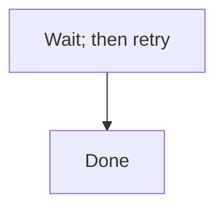

# EDM Plugin -- Conventions for Contributors

This file documents the architectural rules, naming conventions, and configuration model for the EDM Claude Code plugin.
Read this before making changes -- it captures decisions that aren't otherwise visible in the code.

## Architectural rules (do not violate)

### 1. `skills/` is the only entry point -- there is no `commands/`

Per the Claude Code plugin docs, `commands/` is the legacy location for skills-as-flat-files. New plugins use `skills/`.
Both invoke the same way (`/edm:name`), so maintaining both is pure duplication. **Do not re-introduce a `commands/`
directory.**

### 2. Skills are the source of truth for orchestration

Each phase skill (`skills/orchestrator/SKILL.md`, `skills/plan/SKILL.md`, etc.) contains:

- Methodology context (what is EDM, when to use it)
- Step-by-step operational orchestration
- The HITL gate prompts

Agents are invoked from skills, not the other way around.

**Skill-tool composition** (EDMV3-T34; spike recorded as decision D21 in
`SRD/edm/EDMV3__prompt-streamline/decisions.md` and `spike-skill-composition.md`): skills DO load
other skills, via the `Skill` tool. This marketplace's own **git plugin is the in-repository
precedent** -- `skills/commit/SKILL.md` invokes the `jira` plugin's `search-jira` skill exactly
this way today. The orchestrator dispatches; each phase skill owns its phase's complete procedure
exactly once, never duplicated in the orchestrator. Two obligations fall on any caller:

1. **`Skill` must appear in the caller's `allowed-tools`.** The callee's own `allowed-tools`
   governs what the callee itself may do while it runs -- grants are not inherited from, or
   intersected with, the caller's (confirmed live in the D21 spike: a `Bash`-less caller's callee
   ran `Bash` successfully because the callee's own frontmatter granted it).
2. **The caller must handle a target-skill-not-enabled failure gracefully.** An unavailable
   target fails the Skill-tool call with a `tool_use_error: Unknown skill: <name>` -- a clean,
   nameable error, not a silent no-op or a hang (confirmed live in the D21 spike). The caller must
   report the unavailable skill by name and stop; it must never fall back to silently inlining the
   target's procedure.

Context accumulated by the caller (its own reasoning, anything it has read or written this turn)
is visible to the callee automatically -- the callee runs within the **same conversation**, not an
isolated sub-agent context the way a `Task`-spawned agent (`edm-explorer`, `edm-implementer`,
etc.) does.

#### Intent-to-file index

Some behaviors are described in more than one file with no indication which is authoritative
(explorer 02 C3.3). When in doubt about **which file is authoritative**, this table wins:

| I want to change... | Edit this file (authoritative) |
|---|---|
| What a phase does, step by step | `skills/{phase}/SKILL.md` |
| What the explorer agent explores and how it reports | `agents/edm-explorer.md` -- `skills/plan/SKILL.md`'s "AI Execution Pattern" only names when/how many to spawn |
| Gate approval behavior (STOP/WAIT, free-text rejection, options) | `skills/orchestrator/SKILL.md Sec."Gate PROTOCOL"` -- every other gate site references it by name, never restates it |
| Severity definitions (P0/P1/P2/NOTED) | `CLAUDE.md Sec."Severity vocabulary"` -- every other site references it by name |
| A `bin/edm-state` subcommand's behavior | `bin/edm-state` itself -- the `bin/` table below only indexes it |
| An audit lens's mandate | `agents/edm-audit-{lens}.md` -- `skills/code-audit/SKILL.md`'s lens table only summarizes |

### 3. Artifacts live in the project's `SRD/` directory and are committed to git

Every artifact EDM produces -- planning notes, SRDs, ticket packs, audit reports, code-audit remediation plans, *
*and `.edm-state.json`** -- is a project deliverable that lives in the repository's `SRD/` directory. Source control IS
the feature:

- A teammate reviews the SRD in a PR before any code is written
- Ticket pack changes show up in code review
- Audit findings are inspectable in commit history
- Multiple developers see the same in-flight initiative state

`${CLAUDE_PLUGIN_DATA}` is reserved for plugin-internal caches only (convention detection, prefix lookup tables). It
does NOT hold initiative artifacts or initiative state.

### 4. State is in the project, not the plugin

`SRD/{PRODUCT}/{PREFIX}__{DESCRIPTION}/.edm-state.json` (or `SRD/{PREFIX}/.edm-state.json` for legacy flat initiatives)
is committed by default. Teams that want per-developer state can add it to `.gitignore` (controlled by the
`commit_state_file` user-config option).

## Project artifact layout

The **canonical layout** (v2.0+) places each initiative inside a product subdirectory:

```
SRD/                              <- project root, committed to git
+-- {PRODUCT}/                    <- one directory per product area (e.g. "edm", "auth", "billing")
    +-- {PREFIX}__{DESCRIPTION}/  <- initiative directory (double-underscore separator)
        |
        +-- planning.md               <- Phase 1 (Must/always-present)
        +-- srd.md                    <- Phase 2 output (filename configurable) (Must/always-present)
        +-- architecture.md           <- Phase 2: edm-architect diagrams and decisions (Must/always-present)
        +-- explorers/                <- Phase 1: parallel explorer findings, one file per focus area (Must/always-present)
        |   +-- 01-{slug}.md, 02-{slug}.md, ...
        +-- decisions.md              <- running key-decisions and finding-to-commit ledger (Must/always-present)
        +-- audit-srd.md              <- Phase 3 audit findings
        +-- tickets/                  <- Phase 4 (dirname configurable)
        |   +-- README.md             <- index, legend, critical path, coverage map, version-linkage header
        |   +-- audit.md              <- Phase 5 ticket-pack audit
        |   +-- epics/
        |       +-- 01-{epic}.md
        |       +-- 02-{epic}.md
        +-- test-plan.md              <- /edm:test (stack + AC coverage map)
        +-- test-coverage.md          <- /edm:test (coverage by layer + AC<->test cross-ref)
        +-- qc/                       <- Phase 6 QC reports (always-present after first wave)
        |   +-- qc-summary.md         <- merged QC verdict table (single auditor or merged shards)
        |   +-- qc-shard-{NN}.md      <- per-shard reports when ticket count > qc_shard_threshold
        +-- code-audit/               <- /edm:code-audit output
        |   +-- findings-ledger.md    <- persistent cross-round findings ledger (stable CA-NNN IDs)
        |   +-- pass-{N}_{YYYY-MM-DD}/ <- one directory per audit round (N = monotonic counter)
        |       +-- lens-L1.md ... lens-L11.md
        |       +-- lenses-run.txt    <- lens set for this round (full vs. partial)
        |       +-- REMEDIATION.md
        +-- ROLLBACK.md               <- rollback runbook (Should/on-demand; structure: trigger, revert steps, verify, owner)
        +-- exec-report.md            <- post-Phase-6 execution report with mode field (Should/on-demand)
        |   (per-epic variant: epicN-execution-report.md)
        +-- post-deploy/              <- post-deploy verification + analysis-input docs (Could/on-demand)
        |   +-- verification.md       <- smoke-test / deploy verification report
        |   +-- analysis/             <- rate-limit-analysis.md, source-triage.md, cost-analysis.md
        +-- HANDOFF.md                <- auto-generated cross-user resume doc (updated at every phase/gate/stop)
        +-- .edm-state.json           <- gate approvals, phase timestamps, mode fields (committed by default)
```

**Slot annotations**:
- `always-present` -- scaffolded by `edm-init` or written early in the phase flow
- `on-demand` -- created by its owning phase/agent only when the initiative needs it
- `Must/Should/Could` -- priority per SRD EDMV2-38..43

**Canonical artifact homes** (all paths derived from state via `initiative_dir_for()`, never hardcoded):
- `architecture.md` -- canonical home for `edm-architect` diagrams and architecture decisions (EDMV2-38)
- `explorers/` -- canonical home for parallel explorer reports; synthesized into `planning.md` (EDMV2-39)
- `decisions.md` -- initiative-wide key-decisions + finding-to-commit ledger; distinct from `code-audit/findings-ledger.md` which is the code-audit cross-round ledger (EDMV2-40)
- `ROLLBACK.md` -- on-demand rollback runbook; template: trigger conditions, ordered revert steps, verification-after-rollback, owner/contact (EDMV2-41)
- `exec-report.md` -- post-Phase-6 execution report; `mode` field = run mode (e.g., `live-db`, not the adaptation profile) (EDMV2-42)
- `post-deploy/` -- post-deploy verification and analysis-input documents (EDMV2-43)

**Concrete example**: `SRD/edm/EDMV2__enhance-edm-plugin/`

- The **double-underscore** (`__`) separates the PREFIX from the description slug -- never use a single underscore.
- The description slug is lowercase-hyphenated (e.g. `enhance-edm-plugin`, `user-auth-rewrite`).
- PREFIX is **globally unique** across ALL product subdirectories -- two products may not share a PREFIX (see Naming conventions below).

**Existing flat initiatives (`SRD/{PREFIX}/`) continue to work unchanged** (EDMV2-90 backward compat). The resolver
(`state_file_for` in `bin/edm-state`) detects the layout automatically and prefers an existing on-disk path so
in-flight initiatives are never relocated without explicit `edm-state migrate-path` invocation.

Migration from flat to product-scoped is **opt-in** per initiative:

```bash
edm-state migrate-path --product edm --description enhance-edm-plugin EDMV2
```

This uses `git mv` when the initiative is git-tracked, then updates `product_name` and `initiative_description` in state.

The plugin reads root paths from `userConfig`, so teams can relocate the entire tree:

- `${user_config.srd_root}` (default `./SRD`)
- `${user_config.srd_filename}` (default `srd.md`)
- `${user_config.ticket_pack_dirname}` (default `tickets`)

### Existing repository conventions (informational)

The project may contain an `/SRD/` directory with initiatives that pre-date the plugin and use older patterns. The
plugin does NOT migrate these -- they keep their current format. New initiatives created via the plugin use the
product-scoped canonical layout above (or flat layout when `--product`/`--description` are omitted).

## Naming conventions

### Initiative prefix

3-6 uppercase characters, e.g., `AUTH`, `MIGR`, `TIPS`, `PERF`. Validated by `bin/edm-validate-prefix` for
**global uniqueness** across ALL product subdirectories in `SRD/` (not just one product). This ensures the PREFIX
is unambiguous in commit scopes, ticket IDs, HANDOFF references, and Jira scopes -- two products sharing a PREFIX
would make all of these ambiguous. Configurable hint: `${user_config.prefix_format_hint}`.

### Requirement IDs (in SRDs)

`{PREFIX}-{NN}` -- e.g., `AUTH-01`, `AUTH-02`, ..., `AUTH-37`.

### Ticket IDs (in ticket packs)

`{PREFIX}-T{NN}` -- e.g., `AUTH-T01`, `AUTH-T02`, ..., `AUTH-T48`.

The `T` prefix distinguishes tickets from SRD requirements and prevents global collision across initiatives. **Never use
the legacy `TICK-NN` format**; the plan ID disambiguates initiatives in cross-initiative coverage maps.

### Version-linkage in ticket packs

Every ticket pack `README.md` body's first line MUST be:

```
Generated From: ${user_config.srd_filename} v{srd_version}
```

The `srd_version` is read from `.edm-state.json`. The `edm-ticket-auditor` (Dimension 8 -- Version Alignment) verifies
this against the current SRD version and flags drift as a P0 finding.

## Agent color scheme (semantic)

| Color     | Agent(s)                                              | Meaning                                 |
|-----------|-------------------------------------------------------|-----------------------------------------|
| `yellow`  | `edm-explorer`                                        | Phase 1 -- discovery                     |
| `blue`    | `edm-architect`, `edm-srd-writer`                     | Phase 2 -- writing                       |
| `orange`  | `edm-srd-auditor`, `edm-ticket-auditor`               | Phase 3 & 5 -- pre-implementation audits |
| `magenta` | `edm-ticket-writer`                                   | Phase 4 -- writing tickets               |
| `green`   | `edm-implementer`                                     | Phase 6 -- building                      |
| `red`     | `edm-qc-auditor`                                      | Phase 6 QC -- final gate                 |
| `cyan`    | all 11 `edm-audit-*` lenses + `edm-audit-synthesizer` | Code audit (one logical operation)      |

When adding a new agent, choose a color that matches the phase. Lens agents always share `cyan`.

## Severity vocabulary (canonical)

All EDM audit agents use the following four-level scale. No agent may define a divergent local scale.

| Level | Meaning | Required action |
|---|---|---|
| **P0** | Critical -- blocks implementation, security/legal issue, production failure, or architecturally wrong | Fix before this phase may be called complete |
| **P1** | Significant -- material gap, factual error, missing requirement, or behavior that must be corrected before shipping | Remediated before the phase or round may be called complete |
| **P2** | Minor -- polish, edge-case, improvement, or nice-to-have | Remediated before convergence |
| **NOTED** | Not actionable -- the issue is intentional, pre-existing, or a known accepted trade-off | Document in "Decisions / Non-Findings"; do not re-investigate |

`NOTED` is not actionable and is distinct from deferral -- a deferral is an actionable finding
postponed to later, and deferral does not exist in this methodology. Every P0, P1 and P2 finding
is remediated before convergence; `NOTED` is the only status that closes a finding without a fix.

**Backward-compatibility mapping** (from the synthesizer's legacy P1/P2/P3 scale used before v2.0):
- Legacy P1 (production failure / security) -> **P0**
- Legacy P2 (operational friction / must-fix) -> **P1**
- Legacy P3 (defensive improvement / nice-to-have) -> **P2**
- NOTED -> unchanged

## Mermaid diagram conventions (canonical)

All EDM agents that author or audit Mermaid diagrams follow these conventions. No agent may define a divergent local rule.

Mermaid's `;` is a lexer-level statement separator, and this is reserved even where the `;` appears inside label text -- the parser does not distinguish "inside a label" from "between statements," so a literal semicolon inside a node, edge or message label breaks the diagram.

**The rule:** a literal semicolon in Mermaid label, node, edge or message text is written as the entity code `#59;` -- `#` followed by either a base-10 code point or an entity name, then `;`, with no leading ampersand. `&#59;` is not this project's convention; `#59;` is correct.

Before (raw semicolon inside a label -- breaks the diagram):

<!-- edm-lint-ignore-start -->

<!-- edm-lint-ignore-end -->

After (entity code, no leading ampersand -- renders correctly):


Quoting label text is not a reliable substitute for the entity code across every diagram type. A `sequenceDiagram` message's text after the `:` is unquoted, so it is especially exposed to this failure -- there is no quote to protect it there.

The following remain legal and are **not** violations of this rule:
- A statement-terminating `;` at the end of a line, outside any label.
- `;` on a `%%` comment line.
- `;` terminating a `classDef`, `style`, or `linkStyle` directive.

Other entity codes follow the same form, so the rule generalizes: `#quot;` (double quote), `#35;` (`#`), and so on.

This section's heading string, `## Mermaid diagram conventions (canonical)`, is referenced by name from the eleven touch points inventoried in `architecture.md` and asserted by a smoke test -- do not rename it without updating every reference.
## Unverifiable acceptance criteria (D15)

An unverifiable acceptance criterion -- one whose stated runtime environment does not exist in
the project (no staging deploy, no live database, no browser harness) -- is a specification
defect, not a fourth verdict. `/edm:verify-runtime` (EDMV3-T33) records exactly two closing
verdicts, PASS or FAIL, for every entry in `partial_verdict_map`; there is no `BLOCKED`,
`WAIVED`, or `N/A-runtime` value anywhere in this methodology.

When an AC's runtime environment genuinely does not exist, there are exactly two sanctioned
responses:

1. **Rework the AC** into something verifiable in the environment that does exist -- the usual
   outcome. Most "PARTIAL forever" ACs are testable with a narrower, still-meaningful claim.
2. **Move the unverifiable clause out of scope** as a recorded boundary for a follow-on
   initiative, using the D14 scope-boundary framing -- a decision made on its own merits, not a
   postponed finding.

Both routes are a scope change to an approved ticket, so both go through gate change control:
presented at the relevant gate with the rationale, approved or rejected by the human via the
canonical `skills/orchestrator/SKILL.md Sec."Gate PROTOCOL"`, and recorded in `decisions.md` and
the ticket's audit trail. **The implementer cannot descope an AC by declaring it unverifiable** --
only a human, at a gate, can accept route (1) or (2). Archive stays hard-blocked until every AC in
`partial_verdict_map` carries a `closing_verdict` of PASS or FAIL.

## By-name reference resolution from an installed plugin cache (EDMV3-T41)

**Verified NOT to resolve deterministically (decisions.md D22, Claude Code 2.1.220,
2026-07-28).** `claude plugin validate` confirms plugin-root `CLAUDE.md` is never loaded as
runtime context ("use a skill instead"), and an installed plugin's cache directory is not
path-adjacent to whatever project it is installed into, so a bare `` `CLAUDE.md Sec."..."` ``
reference in a prompt has no plugin-relative anchor to resolve against from there -- it either
fails to resolve, or (since "CLAUDE.md" is itself a common convention) silently resolves to the
target project's own unrelated `CLAUDE.md` instead. Both the Severity vocabulary section and
the Mermaid diagram conventions section above are additionally generated, byte-identical, into
`docs/canonical-sections.md` (regenerate via `edm-sync-canonical-sections` after editing either
section above) -- the plugin-relative path new prompt-surface references point at instead of the
bare `CLAUDE.md Sec."..."` form.

**Current position (decisions.md D34): the negative branch is now the shipped default, not a
future one.** EDMV3-T42's eleven bare-form touch points landed before this fallback existed
(decisions.md D22); that ordering gap is now closed. `agents/edm-audit-synthesizer.md`,
`agents/edm-srd-auditor.md`, and all eleven `agents/edm-audit-*.md` lens definitions now carry an
explicit `Read docs/canonical-sections.md` instruction anchored to the plugin's own root (never
the caller's cwd) alongside their `CLAUDE.md Sec."..."` citation, so both forms resolve for a
consumer reading this file. Residual scope -- auditing whether the remaining prompt-surface
files (skills and any agent not yet touched) also need the same anchor -- is opened as a named
follow-on ticket, `EDMV4-T04` (the next unused ticket number in `EDMV4__lint-and-pipeline-budgets`;
`EDMV4-T02` and `EDMV4-T03` are already closed per decisions.md D29), rather than left as an
unnamed candidate (D34).

## Model and effort assignments

Derived from tiering matrix <date>; re-run when the model generation or pricing table changes
(EDMV3-73). **Status: NOT yet matrix-derived.** The tiering matrix (`evals/tiering-matrix.sh`,
EDMV3-T48) is built and unit-verified against synthetic fixtures, but has not been run against
real data: the wave-A eval baseline it would measure against does not exist yet (decisions.md
D23). Until that baseline is captured and the matrix runs for real, the table below is the same
judgment-calibrated set of tiers from Gate 3 (D16), unchanged except the three wave-A downgrades
EDMV3-T02 already applied on their own, independently-argued merits (D16). See decisions.md D28
for the exact command that closes this gap and replaces this note with a real run date.

| Role / Agent(s) | Model | Effort | Rationale |
|---|---|---|---|
| Contested audit set -- 11 code-audit lenses, `edm-audit-synthesizer`, `edm-srd-auditor`, `edm-ticket-auditor`, `edm-qc-auditor` (15 agents) | `opus` | `max` | Judgment-heavy work -- surface subtle issues. UNCHANGED pending the tiering matrix (D16): no hand-picked downgrade is taken here -- only a measured, mechanical promotion (EDMV3-T48 AC3) may retier this set |
| `edm-explorer` | `sonnet` | `high` | Scan/list work, not judgment-heavy synthesis; downgraded from `opus`/`max` EDMV3-T02 (D16 wave-A safe downgrade) |
| `edm-test-coverage-auditor` | `sonnet` | `high` | Read-only coverage parse and AC cross-reference, not judgment-heavy; downgraded from `opus`/`max` EDMV3-T02 (D16 wave-A safe downgrade) |
| `edm-architect` | `opus` | `high` | Writing work; downgraded from `opus`/`max` EDMV3-T02 (D16 wave-A safe downgrade) |
| Writing (`edm-srd-writer`, `edm-ticket-writer`) | `opus` | `high` | High-stakes artifacts the rest of the methodology depends on; opus catches missed requirements and weak ACs that sonnet sometimes misses |
| Implementation (`edm-implementer`) | `sonnet` | `high` | Throughput work -- well-specified by tickets |
| Jira sync (optional) | `sonnet` | `high` | Mechanical mapping -- ticket pack already exists; this just translates fields |

Skills mirror the split: `skills/orchestrator/`, `skills/plan/`, `skills/srd/`, `skills/audit-srd/`, `skills/tickets/`, `skills/audit-tickets/`, `skills/implement/`, `skills/code-audit/` are all on `opus`. The two writers run at `effort: high`; planning, audits, and QC run at `effort: max`. `skills/push-jira/` and `skills/metrics/` run on `sonnet`/`high`.

### Prompt conventions (house style)

The prompt-engineering conventions adopted across EDMV3-59 through EDMV3-67 (communication
cadence, deliverable-length calibration, agent scope statements, output contracts, the
implementer's decision ladder, N/A carve-outs, and the explorer fan-out cap) are **house style**
for this plugin: an agent or skill added later inherits them rather than rediscovering them from
scratch. The adoptions are **structural** (instruction-design patterns -- a shape of section, a
kind of clause) and never verbatim text lifted from a source.

**Four sources, with licence and location, matching the enumeration this subsection uses**:

- **opus-5** -- the Opus 5 prompting guide:
  `https://platform.claude.com/docs/en/build-with-claude/prompt-engineering/prompting-claude-opus-5`
  (Anthropic documentation; publicly readable; guidance mined for structure, not copied verbatim).
- **sonnet-5** -- the Sonnet 5 prompting guide:
  `https://platform.claude.com/docs/en/build-with-claude/prompt-engineering/prompting-claude-sonnet-5`
  (Anthropic documentation; publicly readable; guidance mined for structure, not copied verbatim).
- **caveman** -- `skills/caveman/SKILL.md` and `CONTRIBUTING.md` in the `caveman` repository:
  `https://github.com/JuliusBrussee/caveman` (**MIT**). Licence verified 2026-07-28 by direct
  inspection of the local clone at `/Users/darryl.porter/projects/caveman`: a top-level `LICENSE`
  file reading "MIT License / Copyright (c) 2026 Julius Brussee", `"license": "MIT"` in
  `package.json`, and a shields.io licence badge in `README.md`. The URL above is that clone's
  `origin` remote, not a link re-fetched over the network from this environment. Clean-room note:
  the adoption here is pattern-level only (persistence framing, the before/after PR convention,
  output-contract shape) -- no text was copied from either file.
- **ponytail** -- `skills/ponytail/SKILL.md` and `ARCHITECTURE.md` in the `ponytail` repository:
  `https://github.com/DietrichGebert/ponytail` (**MIT**). Licence verified 2026-07-28 by direct
  inspection of the local clone at `/Users/darryl.porter/projects/ponytail`: a top-level `LICENSE`
  file reading "MIT License / Copyright (c) 2026 DietrichGebert", `"license": "MIT"` in
  `package.json`, and a `## License` section in `README.md` reading "[MIT](LICENSE)". The URL
  above is that clone's `origin` remote, not a link re-fetched over the network from this
  environment. Clean-room note: the adoption here is pattern-level only (the numbered decision
  ladder, the "when NOT to" carve-out, the "cost of ignoring this" clause) -- no text was copied
  from either file.

The clean-room posture on both is deliberately unchanged now that the licences are known: MIT
would have permitted verbatim reuse with attribution, but structural adoption was what this
initiative actually did, and restating it as a licence consequence would misdescribe the work.

#### Do-NOT-adopt guards

Explorer 02 Part D is the main regression surface for a prompt-only workstream -- these six
guards are recorded so a future contributor applying Opus 5 / Sonnet 5 guidance does not regress
EDM's audit architecture in the name of "improving" it. Each names its cost, in the ponytail
pattern, so it survives edge cases its author did not anticipate:

- **(D1)** Do not strip the audit or QC architecture in the name of over-verification guidance.
  EDM contains no *self*-verification -- its independent-agent auditing (writer/verifier
  separation across `edm-implementer` -> `edm-qc-auditor` -> the 11 code-audit lenses) is exactly
  the pattern the guide praises, not the anti-pattern it warns against. The cost of ignoring this is
  silent regression of the initiative's entire quality gate -- FAIL findings ship undetected.
- **(D2)** Do not reduce the 11-lens or 2-auditor fan-out to keep spawn counts low. Those counts
  are already deterministic, unlike the explorer's uncapped fan-out that EDMV3-T47 just fixed. The
  cost of ignoring this is coverage loss disguised as an efficiency gain -- a lens or audit lane
  silently stops existing and nobody notices until the gap it used to catch ships.
- **(D3)** Do not import terse register into EDM artifacts. SRDs and tickets are read by humans in
  merge requests, not consumed as a single agent's scratch context. The cost of ignoring this is
  reviewer confusion and slower human sign-off -- the opposite of what EDM's gates exist to speed
  up.
- **(D4)** Do not add interim-progress scaffolding (e.g. "summarize every N tool calls").
  The cost of ignoring this is exactly the padding EDMV3-T45 spent effort removing from the
  other direction -- a narrated tool-call log nobody asked for.
- **(D5)** Do not add "think step by step" or anti-thinking instructions -- raise `effort` instead.
  The cost of ignoring this is a prompt that fights the model's own extended-thinking budget
  instead of using the `effort` field this plugin already exposes for exactly that purpose.
- **(D6)** Do not duplicate the mode matrix into agent prompts, since it is state-backed and read
  at runtime (`CLAUDE.md Sec."EDM mode matrix"`). The cost of ignoring this is the same drift this
  whole epic exists to remove -- two copies of the same behavior-governing text disagree, silently,
  the next time one of them is edited.

#### Contribution convention: before/after with rationale

Because this initiative's entire diff is prose changes to a mature, already-audited prompt set, a
diff with rationale is the only reviewable artifact. **Every merge request that changes prompt
text in this plugin -- any `SKILL.md`, any `agents/*.md`, this file -- shows before and after for each changed block, plus one sentence on why the new wording is better.**
This convention outlives EDMV3: apply it to any future prompt-text change in this plugin, not
only this initiative's own tickets.

## Cost tracking

Every `phase-complete` (and, EDMV3-T51, `audit-round-complete`) invocation captures token usage from the project's
session JSONL files (`~/.claude/projects/<encoded-cwd>/*.jsonl`) and computes Claude API cost using current
Anthropic pricing. The state schema's `phase_durations[N_phase]` entry includes:

- `tokens.{input, output, cache_read, cache_write}` -- raw counts
- `model_used` -- the model that handled most of the phase work (last assistant message)
- `estimated_cost_usd` -- computed from tokens x per-million-token rates
- `attribution_mode` -- `"scoped"` or `"whole-directory"` (EDMV3-T52); see below
- `human_baseline_usd` -- computed from Phase Timing Guidelines median hours x `${user_config.human_hourly_rate_usd}` (
  default $150/hr); recorded on every phase but shown by default only via `metrics-report --with-human-baseline`
  (EDMV3-T53)

**Token attribution (EDMV3-T52, decisions.md D25):** token/cost figures are scoped to the *driving session* -- the
single most-recently-modified `*.jsonl` file in the sessions directory at read time, since Claude Code appends to
its own session's JSONL as the conversation proceeds, making it always the most recently touched file on disk. This
prevents a second Claude Code window open on the same project from inflating a phase's or audit round's figures.
`attribution_mode` records `"scoped"` when this succeeded, or `"whole-directory"` on the pre-T52 fallback (sums
every session JSONL) if the sessions directory has no readable file at read time.

Pricing constants (per million tokens, USD) are baked in but env-overridable. Current generation (the model
generation this plugin's agents actually run on, see "Model and effort assignments" above):

| Model | Input | Output | Cache Read | Cache Write 5m | Cache Write 1h |
|---|---|---|---|---|---|
| Opus 4.8 | $6 | $30 | $0.60 | $7.50 | $12.00 |
| Sonnet 4.7 | $4 | $20 | $0.40 | $5.00 | $8.00 |
| Haiku 4.6 | $1.20 | $6.00 | $0.12 | $1.50 | $2.40 |

Verified 2026-07-28 against [docs.anthropic.com/en/docs/about-claude/pricing](https://docs.anthropic.com/en/docs/about-claude/pricing).

Previous-generation rates (frozen, not env-overridable -- EDMV3-T52 AC9) are kept so a state file recorded before
this refresh is never silently repriced on a later read:

| Model | Input | Output | Cache Read | Cache Write 5m | Cache Write 1h |
|---|---|---|---|---|---|
| Opus 4.7 | $5 | $25 | $0.50 | $6.25 | $10.00 |
| Sonnet 4.6 | $3 | $15 | $0.30 | $3.75 | $6.00 |
| Haiku 4.5 | $1 | $5 | $0.10 | $1.25 | $2.00 |

Override the current-generation rates with `EDM_OPUS_INPUT_RATE`, `EDM_SONNET_OUTPUT_RATE`, `EDM_HAIKU_CACHE_READ_RATE`, `EDM_OPUS_CACHE_WRITE_5M_RATE`, `EDM_OPUS_CACHE_WRITE_1H_RATE`, etc. when rates change.

**How `compute_cost_usd` picks a rate row after D32.** D32 removed the bare family wildcards. The
`case` in `bin/edm-state` now has eight explicit arms, in this order:

1. previous-generation frozen rows: `*opus-4-7*|*opus-4.7*`, `*sonnet-4-6*|*sonnet-4.6*`,
   `*haiku-4-5*|*haiku-4.5*`
2. current-generation explicit rows: `*opus-4-8*|*opus-4.8*`, `*haiku-4-6*|*haiku-4.6*`,
   `*sonnet-4-7*|*sonnet-4.7*`
3. the literal `unknown` sentinel from `get_session_tokens_since` (silent placeholder pricing at
   current Sonnet-tier rates; tokens are already zero in that path)
4. final `*)` fallback: warn on stderr and also price at current Sonnet-tier rates as a clearly
   suspect placeholder

The important behavioral change is the opposite of the pre-D32 contract: an unrecognized model in a
known family no longer matches silently. `claude-opus-5-20260501`, `claude-sonnet-9`, or any other
identifier outside the six explicit version arms now falls through to `*)`, emits the warning, and
gets placeholder Sonnet-tier pricing until a human updates the table. Cross-check `model_used`
against the two tables above before quoting a cost figure from a run driven by a model generation
newer than this section's "Verified" date.

Cache writes are tracked separately by TTL (5-minute vs 1-hour) because they have different rates. Claude Code typically uses 1-hour caching for system prompts and tool definitions, so `cache_write_1h` is usually the dominant figure.

Token reading depends on the path encoding `~/.claude/projects/{cwd_with_slashes_and_dots_as_hyphens}/*.jsonl`. The
`session_dir_for_cwd` helper in `bin/edm-state` handles this.

## Testing layer

`/edm:test <PREFIX>` runs comprehensive multi-layer test coverage after Phase 6 implementation. It
is user-invocable, not auto-triggered. The `/edm:orchestrator` flow suggests it at the end of
Phase 6, but the user decides whether to run it.

### Test artifacts (project-resident, source-controlled)

Two new artifacts are added to `SRD/{PREFIX}/`:

| File | Written by | Purpose |
|------|-----------|---------|
| `test-plan.md` | `edm-test-planner` | Stack detection, AC<->layer mapping, writer task assignments |
| `test-coverage.md` | `edm-test-coverage-auditor` | Coverage by layer vs. targets, AC<->test cross-reference, P0/P1/P2 gaps |

Test code itself lives in the project's existing test directories -- `SRD/` artifacts document
*intent and coverage*, not the tests themselves.

### Testing layer agent inventory

| Agent | Model/Effort | Color | maxTurns | Role |
|-------|-------------|-------|---------|------|
| `edm-test-planner` | opus / high | yellow | 30 | Detect stack; map tickets -> test layers; write `test-plan.md` |
| `edm-test-scaffold` | sonnet / high | blue | 30 | Install missing test deps, write config files |
| `edm-test-unit` | sonnet / high | green | 50 | Pure-function unit tests, mock-isolated |
| `edm-test-component` | sonnet / high | green | 50 | UI component tests (RTL, Vue Test Utils, etc.) |
| `edm-test-composable` | sonnet / high | green | 50 | React hooks / Vue composables |
| `edm-test-integration` | sonnet / high | green | 50 | Multi-module / real DB / HTTP tests |
| `edm-test-contract` | sonnet / high | green | 50 | API contract tests (OpenAPI/GraphQL-driven) |
| `edm-test-e2e` | sonnet / high | green | 60 | Playwright/Cypress full user journeys |
| `edm-test-a11y` | sonnet / high | green | 30 | axe-core + keyboard nav, WCAG 2.1 AA |
| `edm-test-coverage-auditor` | sonnet / high | cyan | 25 | Read-only: parse coverage, cross-ref AC, find gaps |

`edm-test-coverage-auditor` is `cyan` (read-only audit lens, like the code-audit lenses). Test
writers are `green` (build code, like `edm-implementer`). Planner is `yellow` (discovery, like
`edm-explorer`). Scaffold is `blue` (writes infrastructure, like `edm-architect`).

`edm-test-coverage-auditor` has `disallowedTools: Edit, NotebookEdit` (Write is required -- it writes `test-coverage.md`).

### Coverage targets (userConfig)

| Key | Default | Description |
|-----|---------|-------------|
| `coverage_target_unit_pct` | 80 | Minimum unit test coverage % |
| `coverage_target_component_pct` | 70 | Minimum component test coverage % |
| `coverage_target_integration_pct` | 60 | Minimum integration test coverage % |
| `coverage_target_e2e_critical_paths_pct` | 100 | % of critical paths with E2E coverage |
| `test_framework_unit_override` | `""` | Pin unit framework (e.g., `jest`, `vitest`, `pytest`) |
| `test_framework_component_override` | `""` | Pin component framework |
| `test_framework_e2e_override` | `""` | Pin E2E framework (`playwright` or `cypress`) |

### State schema additions

`.edm-state.json` gains these top-level fields (added by `edm-state init`, defaults shown):

```json
{
  "test_frameworks_detected": { "unit": "pytest", "component": null, "e2e": "playwright" },
  "coverage_by_layer": {
    "unit": { "pct": 82.4, "measured_at": "2026-05-01T..." },
    "integration": { "pct": 65.1, "measured_at": "2026-05-01T..." }
  },
  "coverage_by_epic": {
    "auth": {
      "unit": { "pct": 84.1, "measured_at": "2026-05-01T..." }
    },
    "dashboard": {
      "unit": { "pct": 75.0, "measured_at": "2026-05-01T..." }
    }
  },
  "parent_prefix": "",
  "related_prefixes": []
}
```

`test_frameworks_detected` is keyed by epic slug for multi-stack initiatives (e.g.,
`{"auth":{"unit":"pytest"},"dashboard":{"unit":"vitest","component":"@testing-library/vue"}}`),
or flat for single-stack initiatives.

`coverage_by_layer` holds whole-initiative coverage for single-stack initiatives.
`coverage_by_epic` holds per-epic coverage for multi-stack initiatives (additive; keyed by epic slug).

`parent_prefix` is the bare PREFIX of the parent initiative in a product line (set via
`edm-state set-parent <PREFIX> <PARENT>`; validated to exist).

`related_prefixes` is an append-only list of related initiative prefixes (set via
`edm-state add-related <PREFIX> <RELATED>`; idempotent).

`phase_durations[N_phase]` gains `tests_added` (total) and `tests_by_layer` (per layer) counts
when `edm-state record-tests-added` is called.

### New bin/edm-state subcommands

| Subcommand | Usage |
|-----------|-------|
| `record-test-coverage <PREFIX> <layer> <pct> [<epic>]` | Record coverage % for one layer (with epic = per-epic, without = whole-initiative) |
| `record-tests-added <PREFIX> <phase> <layer> <count>` | Increment test count for phase+layer |
| `get-coverage <PREFIX>` | Print coverage summary (whole-initiative and per-epic) |
| `set-parent <PREFIX> <PARENT>` | Set parent_prefix (validates PARENT exists) |
| `add-related <PREFIX> <RELATED>` | Append to related_prefixes (idempotent) |

`metrics-report <PREFIX>` now includes a test coverage table below the cost/time table if
coverage data has been recorded -- both whole-initiative and per-epic when available.

### When to invoke /edm:test

Run it after all Phase 6 implementation waves complete and before declaring the initiative done.
For `--fill-gaps` mode (fill ALL gaps -- P0, P1, and P2 -- in an existing coverage report), pass the flag:
`/edm:test {PREFIX} --fill-gaps`.

### Layers that are N/A and per-epic test plans

Each test-writer agent self-identifies when its layer doesn't apply and exits cleanly:
- `component`, `composable`, `a11y`, `e2e` are N/A for backend-only or CLI-only epics.
- `contract` is N/A for epics without an API schema.
- `composable` is N/A for epics without React hooks or Vue composables.

N/A designations are recomputed each run -- never inherited from a previous plan. When a layer
is N/A, no placeholder file or coverage row is written (absence is authoritative).

**Per-epic test plan filename convention** (multi-stack initiatives):
- `test-plan-{epic-slug}.md` -- per-epic plan file (e.g., `test-plan-auth.md`, `test-plan-dashboard.md`)
- `test-plan.md` -- top-level index listing each epic, its stack, and a link to its per-epic plan

**Per-epic coverage filename convention** (multi-stack initiatives):
- `test-coverage-{epic-slug}.md` -- per-epic coverage report
- `test-coverage.md` -- top-level summary with cross-epic coverage table

The epic slug is derived from the epic ticket-pack filename: `epics/NN-{slug}.md` -> `{slug}`.

When all epics share the same stack (single-stack initiative), the planner produces only
`test-plan.md` and the coverage auditor produces only `test-coverage.md` -- v1.x behavior is preserved.

## Optional: Jira synchronization

`skills/push-jira/SKILL.md` (invoked as `/edm:push-jira <PREFIX> [PROJECT_KEY]`) optionally pushes the ticket pack to Jira via the Atlassian MCP. It is **strictly opt-in**:

- The skill checks `mcp__{jira_mcp_namespace}__atlassianUserInfo` first (namespace defaults to `plugin_jira_atlassian-mcp-server`; override via `${user_config.jira_mcp_namespace}`); if unavailable, it skips with a friendly message.
- Tickets are tracked in Jira via labels (`edm-{prefix}-t{nn}`) -- no custom Jira fields required.
- Re-running is idempotent: existing issues are updated, not duplicated.
- Status, comments, and worklog on Jira issues are preserved across re-runs.
- Dependencies become Issue Links of type `Blocks` (or `Relates` if `Blocks` isn't available).
- Each ticket file gets a Jira link appended after first push: `## AUTH-T01: ...  ([MCP-1234](https://....atlassian.net/browse/MCP-1234))`.
- A summary of all sync actions is written to `${user_config.srd_root}/{PREFIX}/${user_config.ticket_pack_dirname}/jira-sync.md`.

The skill does NOT push during active implementation (Phase 6) -- let the markdown ticket pack stay authoritative. Re-sync after the initiative completes if desired.

The `userConfig.jira_project_key` value provides a default; otherwise the user must pass `<PROJECT_KEY>` as the second argument.

## Hooks behavior

`hooks/hooks.json` configures:

| Event                                                                                  | Effect                                                        |
|----------------------------------------------------------------------------------------|---------------------------------------------------------------|
| `SessionStart`                                                                         | Emit Resume Point for active initiatives via `edm-state session-start` |
| `UserPromptExpansion` matching `edm:(srd\|audit-srd\|tickets\|audit-tickets\|implement)` | Block expansion if the prerequisite HITL gate isn't approved  |
| `PreToolUse` matching `git commit`                                                     | For staged paths under the derived `srd_root` (`EDM_SRD_ROOT` / `CLAUDE_PLUGIN_OPTION_SRD_ROOT`, default `./SRD`), resolve a prefix per discovered initiative and skip it if it has no resolvable state (CA-011); run `edm-lint-artifacts <PREFIX>` for each survivor. Exit 1 (a real violation) sets the code that actually blocks the commit; exit 2 (a setup/usage error, e.g. no initiative for that prefix) is reported to stderr but does not block (CA-011) |
| `Stop` and `PreCompact`                                                                | Checkpoint state via `edm-state checkpoint-if-active`         |
| `SubagentStop` matching `edm-implementer`                                              | Auto-spawn `edm-qc-auditor`; write verdict to `qc/qc-summary.md`; persist PARTIAL verdicts via `edm-state record-partial-verdict` |

These are part of the methodology -- do not disable them in normal operation.

`edm-lint-artifacts` and the git-commit hook now both honor `${user_config.srd_root}` through
`EDM_SRD_ROOT` / `CLAUDE_PLUGIN_OPTION_SRD_ROOT` (CA-023) -- a relocated `srd_root` scopes the
automatic commit-path enforcement the same way it scopes a direct `edm-lint-artifacts`
invocation, with no separate hook-matcher update required.

## Monitors behavior (EDMV3-T59, D24)

`monitors/monitors.json` declares `edm-impl-progress`, running `edm-state watch-impl`. This is
**host-managed**: Claude Code arms plugin-declared monitors as persistent background Monitor
tasks (same trust tier as hooks), confirmed by direct inspection of the installed CLI (D24,
`SRD/edm/EDMV3__prompt-streamline/decisions.md`).

- **Arm trigger**: `on-skill-invoke:implement` -- the host arms the monitor the first time
  `/edm:implement` is dispatched in a session (via the Skill tool or the slash command). Repeat
  invocations of `/edm:implement` in the same session do not spawn a duplicate; the host dedupes
  on the monitor's name.
- **Polling interval**: `cmd_watch_impl` polls `git log` every 5 seconds (`sleep 5`) for new
  commits referencing a `{PREFIX}-T{NN}` ticket ID, emitting one line per new commit so the host
  surfaces it as a notification.
- **Lifecycle / how to stop it**: a persistent monitor runs for the lifetime of the Claude Code
  session, not just for the duration of the triggering skill -- it is not restarted or killed by
  context compaction. It stops when the session ends, or can be stopped early via the host's
  `TaskStop` mechanism. There is no separate EDM-side kill switch; this is intentional -- the
  monitor is a read-only `git log` poll with no state mutation, so leaving it running for the
  rest of the session is inert.

## Artifact content conventions

Every artifact this plugin produces or templates is **ASCII-only**: no em dashes, no arrows (use `->`), no smart
quotes, no emoji glyphs.

**What actually enforces it, and what does not.** `edm-lint-artifacts` class 2 (`unicode`) is the
check, but its reach is narrower than the rule:

- **It scans initiative directories only.** Prefix mode resolves one initiative directory via
  `edm-state resolve-dir`; `--all` walks the initiative directories `edm-state list --paths`
  returns. Both then call `collect_md_files`, a plain `find` for `*.md` excluding `.git/` and
  `.archived/`. Git is never consulted, so "tracked" is not a property the scan can observe -- an
  untracked `.md` file sitting in an initiative directory is scanned exactly like a committed one.
- **Lines inside fenced code blocks are skipped**, as are lines under an `edm-lint-ignore` marker.
- **This plugin's own source tree is scanned by no invocation the hook or CI makes.** The
  `PreToolUse` git-commit hook runs prefix mode; the `lint:artifacts` CI job runs `--all`. Neither
  reaches `plugins/edm/skills/`, `plugins/edm/agents/`, `plugins/edm/docs/` (including
  `docs/templates/`, named as "templates" in the rule above), `plugins/edm/evals/`, this file, or
  `README.md`. Em dashes have in fact landed in `skills/` and `agents/` and survived there
  undetected, found only by hand -- the rule holds for the plugin's own prose, but nothing
  automatic is checking it.

To check a tree the automatic invocations miss, run `edm-lint-artifacts --path <dir>` by hand; it
is read-only and calls no state resolution.

**Imported third-party documents are ASCII-normalized on import** -- when an external document (a design review, a
vendor report, a pasted analysis) is copied into an initiative's directory, the person or agent performing the
import replaces non-ASCII characters (em dashes become `--`, arrows become `->`, smart quotes become straight quotes)
before it is committed, so the document's meaning is unchanged but its bytes pass the same lint the rest of the
initiative's artifacts pass. Wrapping an imported document in `edm-lint-ignore` markers instead of normalizing it is
not an acceptable substitute -- an exempted document in an initiative's own directory is a standing invitation to
exempt the next one.
## Required setup: permission `ask` rules (EDMV3-T06)

See `README.md`'s "Required setup: permission ask rules" section for the full rationale, the
matcher-limitation note, and the wave-A manual-QA record -- not re-explained here. The
required block, added to `.claude/settings.json` (or `.claude/settings.local.json`):

```json
{
  "permissions": {
    "ask": [
      "Bash(edm-state approve-gate*)",
      "Bash(edm-state archive*)"
    ]
  }
}
```

`check_permission_rules()` in `bin/edm-state` scans for these two patterns and feeds the
result into the `enforcement` field (`permission-ask` | `prose-only`) recorded on every gate
approval, and into the informational `PERM_RULES_MISSING` anomaly when absent.

## `bin/` helper scripts

Scripts in `bin/` are added to PATH while the plugin is enabled. Skills call them by bare name.

| Script                | Purpose                                                                                                                                                                                                                                     |
|-----------------------|---------------------------------------------------------------------------------------------------------------------------------------------------------------------------------------------------------------------------------------------|
| `edm-state`           | Read/write `.edm-state.json` files; 40 subcommands: `init`, `get`, `set`, `list`, `active-initiatives`, `migrate-path`, `migrate-schema`, `approve-gate`, `phase-start`, `phase-complete`, `checkpoint-if-active`, `record-test-coverage`, `record-tests-added`, `get-coverage`, `srd-version`, `archive`, `write-handoff`, `watch-impl`, `metrics-report`, `validate`, `gate-check`, `branch-check`, `record-branch`, `git-lock-check`, `current-step`, `session-start`, `audit-round-start`, `audit-round-complete`, `render-ledger`, `audit-converged`, `record-partial-verdict`, `set-mode`, `skip-phase`, `set-supersedes`, `set-forked-from`, `resolve-dir`, `set-parent`, `add-related`, `update-patterns`, `lint` |
| `edm-init`            | Scaffold a new initiative directory (`SRD/{PREFIX}/` or `SRD/{PRODUCT}/{PREFIX}__{desc}/`) with empty state file |
| `edm-validate-prefix` | Verify a proposed prefix doesn't collide with existing initiatives across all product subdirectories |
| `edm-lint-artifacts`  | Scan initiative artifact markdown for four violation classes -- attribution trailers, non-ASCII bytes, leaked tool-invocation tags, and a literal `;` inside Mermaid label/edge/message text; called by the `PreToolUse` git-commit hook |
| `edm-sync-canonical-sections` | Regenerate `docs/canonical-sections.md` from this file's "Severity vocabulary" and "Mermaid diagram conventions" sections (byte-identical, one-directional); `--check` exits 1 on drift. See the note below the Mermaid section for why this file exists (EDMV3-T41). |

### `edm-lint-artifacts` latency budgets (EDMV3-T67 AC5/AC7)

`edm-lint-artifacts` has **two separate latency budgets and they are not interchangeable**. They
are documented here, with the script, rather than beside the CI job table below, because both are
properties of this one binary: a contributor who changes its scanning cost needs both numbers in
one place, and only one of the two is a CI concern at all.

| Budget | Invocation | Ceiling | Fixture the ceiling is stated against | Where it binds |
|---|---|---|---|---|
| **Commit-path** | `edm-lint-artifacts <PREFIX>`, from the `PreToolUse` git-commit hook | **3,000 ms** p95 | one initiative directory of 30 `.md` files / 9,990 lines | Every `git commit` that stages anything under the hook's derived `srd_root` scope (CA-023). A human is waiting on this one, so it is the budget that must stay small |
| **CI** | `edm-lint-artifacts --all`, inside the blocking `lint:artifacts` job | **60,000 ms** | a 50-initiative repository | The CI lint stage only. `--all` walks every active initiative directory `edm-state list --paths` returns, so it is roughly 50x the work at 20x the ceiling -- a commit-path number must never be compared against it, or vice versa |

Both are measured by `bin/tests/timing.sh` (`--lint` and `--all-lint`) against generated fixtures,
never by an ad hoc one-off number. **Always quote a budget together with its input size.** A bare
millisecond ceiling (or a bare ratio) with no stated fixture is dominated by fixed process
overhead: it reads differently on every machine, and it moves when unrelated code gets faster.

### `.edm-state.json` mode-family fields

The heading string is fixed -- `skills/orchestrator/SKILL.md`'s resume step names it -- but the
table below is the whole state-field reference, not only the mode family: the mode-family rows
come first, then the EDMV3 gate-enforcement, audit-round, and PARTIAL-closure fields. Every row
states what a reader does when the field is absent (C-4 backward compatibility); a v1.x or wave-A
state file that predates a field is never an error.

| Field | Type | Default | Purpose | C-4 when absent |
|---|---|---|---|---|
| `mode` | string enum | `standard` | Adaptation profile: `standard`, `mini-srd`, `iac`, `data-ml`, `prototype` | Read as `standard` |
| `lifecycle_mode` | string enum | `standard` | Lifecycle variant: `standard`, `fast-track`, `fix-pack` (a fourth legacy enum value was removed by the delete-list epic, D12/EDMV3-T57..T60) | Read as `standard`; a state file still carrying the removed legacy value reads without error |
| `compliance_enabled` | boolean | `false` | When true, adds Gate 3.5 compliance review and regulatory-traceability columns | Read as `false` |
| `implementation_mode` | string enum | `standard` | Phase 6 mode: `standard` or `tdd` (Red-Green-Refactor per ticket) | Read as `standard` |
| `skipped_phases` | array of objects | `[]` | Intentionally skipped phases; each: `{phase: N, rationale: "..."}` | Read as `[]` (nothing skipped) |
| `supersedes` | string | `""` | Prefix of the initiative this supersedes (provenance link) | Read as `""` (no link) |
| `forked_from` | string | `""` | Prefix of the initiative this forked from (provenance link) | Read as `""` (no link) |
| `gates_approved[].enforcement` | string enum: `permission-ask` \| `prose-only` | no seeded default -- `cmd_approve_gate` writes it on **every** numeric-gate approval, from `check_permission_rules()` | The honesty tag (EDMV3-T06): `permission-ask` when BOTH `Bash(edm-state approve-gate*)` and `Bash(edm-state archive*)` were found across the three scanned settings files at approval time, `prose-only` otherwise. It records that the rules were **configured**, never that a prompt actually fired -- see README.md's matcher-limitation note for the bypass shapes a configured rule still misses | Absent on entries written before EDMV3-T06. An absent tag reads as "unknown", never as `permission-ask`; nothing fails on absence |
| `gates_approved[].approved_at`, `gates_approved[].approver` | string (ISO-8601 UTC), string | written with the entry; `approver` is `$USER`, falling back to the literal `unknown` when unset | Who approved a numeric HITL gate and when. Written as sibling scalars inside the `gates_approved[]` entry object | Absent on pre-EDMV3 entries; renderers show `?` rather than failing |
| `code_audit_gate_approved_at` / `_approver` / `_enforcement` / `_ledger`, and `compliance_gate_approved_at` / `_approver` / `_enforcement` | strings; `_enforcement` is the same enum as above | the four `code_audit_gate_*` keys are seeded `""` by `edm-state init`; the three `compliance_gate_*` keys are created on first approval | Sibling scalars for the two dedicated-boolean gates (`code-audit` and 3.5). The boolean itself stays a plain boolean -- `metrics-report` and HANDOFF both depend on that -- so the metadata hangs beside it rather than converting it to an object. `code_audit_gate_enforcement` additionally carries the sentinel `CONVERGENCE_NOT_REQUIRED` when the initiative's phase graph skips the code-audit round because of its `mode` or `lifecycle_mode`, keeping an exemption distinguishable from an approval. `_ledger` holds the real `findings-ledger.jsonl` path or the literal `absent` | Empty string and absent both read as "not approved"; no check fails on either |
| `audit_rounds.<type>.rounds[].round_type` | string enum: `full` \| `partial` | `full` when `audit-round-start` is called without `--lenses` | Derived at `edm-state audit-round-start` (EDMV3-T27): `full` when the lens set equals all eleven lens IDs, or when `--lenses` was omitted (matching `skills/code-audit/SKILL.md`'s "absence of `--lenses` means run all 11"); `partial` otherwise. A partial round is **never convergent** -- `edm-state audit-converged` exits 1 when the latest round is `partial` | `audit_rounds.<type>` may still be a bare integer in a file written before the `{count, rounds: [...]}` widening; every reader coerces via `coerce_round_entry` and no existing file is rewritten. A round carrying no `round_type` reads as `unknown`: blocking at `schema_version >= 2`, warn-and-proceed below that |
| `audit_rounds.<type>.rounds[].completed_at` / `duration_seconds` / `tokens` / `model_used` / `estimated_cost_usd` / `attribution_mode` | string (ISO-8601 UTC) / number (seconds) / object `{input, output, cache_read, cache_write_5m, cache_write_1h}` / string / number (USD) / string enum `scoped` \| `whole-directory` | written only by `edm-state audit-round-complete`; on a round with no recorded `started_at` the token counts stay `0`, `model_used` stays `unknown`, `estimated_cost_usd` stays `0.0000`, `attribution_mode` stays `whole-directory` | Per-round duration and cost for one audit round (EDMV3-T51), computed with the same `get_session_tokens_since` / `compute_cost_usd` pair `phase-complete` uses, so audit-round cost can never diverge from phase cost via a second implementation. `metrics-report` renders them as its code-audit section. A double completion is refused before any write | Additive extension of the wave-B round shape -- **no `schema_version` bump** (stays `2`, EDMV3-T66 AC2). Every reader reads these with jq `//` defaults, so a round closed before T51 simply has none of them; a round never closed at all surfaces as the informational `OPEN_AUDIT_ROUND` anomaly on `edm-state validate` rather than staying invisible |
| `partial_verdict_map.<ticket>.closing_verdict` | string enum: `PASS` \| `FAIL` | absent while the entry is open | The closing verdict written by `edm-state record-partial-verdict <PREFIX> <ticket> close <PASS\|FAIL> <ref>`, driven by `/edm:verify-runtime`. There is no third value -- no `BLOCKED`, `WAIVED` or `N/A-runtime` (D15). `archive` hard-blocks on any entry that is unclosed or FAIL-closed. An entry may be closed once, the sole exception being re-closure of a FAIL after remediation | Absent means still open; the blocking `OPEN_PARTIALS` anomaly names the ticket. The entire pre-closure entry is preserved under `prior` rather than overwritten, and a re-closure appends to `closure_history` so the FAIL record is never lost |
| `partial_verdict_map.<ticket>.verification_ref` | string, non-empty (enforced -- `close` refuses an empty value) | absent while the entry is open | The evidence pointer for the closure: the command, `file:line`, or run that produced the PASS or FAIL. Recorded alongside `closing_verdict` and `closed_at` | Absent alongside `closing_verdict` on an open entry. `edm-state validate` renders `(no ref)` for a closed entry that somehow lacks one rather than failing on it |

All fields default safely so v1.x state files without them work unchanged (C-4 backward compatibility).

**`mode` vs `lifecycle_mode`** -- orthogonal: an initiative can be `mode=iac` AND `lifecycle_mode=fast-track` simultaneously. Set independently via `edm-state set-mode <PREFIX> mode|lifecycle_mode <value>`.

### `.edm-state.json` `schema_version` contract (EDMV3-T09)

`schema_version` is an integer, written once by `cmd_init` for the wave the running plugin version
belongs to, and advanced only by `edm-state migrate-schema` -- never by `cmd_set` (making it
`cmd_set`-settable would reopen the hand-flip path the `SETTABLE_KEYS` allowlist exists to close).
Absent `schema_version` is the legacy pre-EDMV3 signal (grandfathered, C-4).

| Version | Wave | Shape it certifies | Minimum version required by |
|---|---|---|---|
| `1` | A | gates, mode-derived terminal phase, phase-6 `completed_at`, artifact checks, `cmd_set` allowlist | EDMV3-16, EDMV3-17, EDMV3-115 (`>= 1`) |
| `2` | B | JSONL findings ledger, PARTIAL closure representation, audit round-type recording, gate `enforcement` tags | EDMV3-18, EDMV3-36, EDMV3-42, EDMV3-120 (`>= 2`) |
| `3` | C | **not assigned (EDMV3-T66 decision)** -- wave C's only state-shape work (EDMV3-T51) is an additive extension of the wave-B round-record shape (adds `completed_at`, `duration_seconds`, `tokens`, `model_used`, `estimated_cost_usd`, `attribution_mode` to an existing `rounds[]` entry), not a new shape a reader must recognize; every wave-C check that consults these fields reads them with `//` defaults, so no check requires `schema_version >= 3`. The value stays at `2` rather than bumping for symmetry | none -- no check requires `>= 3` |

**Three-valued degradation.** A present-but-lower `schema_version` is a distinct state from both
"legacy/absent" (no enforcement at all) and "fully compliant" (every check applies normally): a
check whose required version is *above* the recorded `schema_version` degrades to warn-and-proceed
naming the check; a check *at or below* the recorded version applies normally. The standard for a
check that consults `schema_version` is to record its own minimum in a `# requires schema_version
>= N` comment at the check in `bin/edm-state`. Five of the eight `schema_at_least()` call sites in
`bin/edm-state` carry that comment today; three do not, and adding them is outstanding work rather
than a sanctioned exception:

- `cmd_approve_gate`'s code-audit convergence precheck (needs `>= 2`) -- the surrounding comment
  explains the gating in prose but does not use the canonical form.
- `cmd_archive`'s wave-B sub-check block (needs `>= 2`) -- reads "gated on schema_version >= 2",
  which is the right number in the wrong shape, so a grep for the canonical string misses it.
- `cmd_audit_converged` (needs `>= 2`) -- no schema comment at all.

Until those three are brought into line, do not treat "no `# requires schema_version >= N` comment
here" as evidence that a check is version-independent; check the `schema_at_least()` call itself.
EDMV3-T09 defines this contract and lands the one such comment for
the check that exists as of wave A (EDMV3-115, `cmd_gate_check`); the degradation *behaviour*
itself is implemented per-check by the ticket that owns that check. EDMV3-T14 wires the shared
`schema_at_least()` helper into the wave-A checks (`cmd_phase_complete`, `cmd_archive`) and tests
the whole class end to end, including the real archived EDMV2 fixture; EDMV3-T18 (wave B) is where
the version-2 checks themselves are built.

**`decisions.md` vs `code-audit/findings-ledger.md`** -- distinct files with distinct scopes:
- `decisions.md` = initiative-wide key decisions and finding-to-commit ledger (written by orchestrator at gates and Phase 6)
- `code-audit/findings-ledger.md` = cross-round code audit findings ledger with stable CA-NNN IDs (written by `edm-audit-synthesizer`)

Operates against the project's working directory (no plugin-relative paths). All scripts must be POSIX-compatible bash (
`#!/bin/bash` or `#!/usr/bin/env bash`).

## EDM mode matrix (EDMV3-T38)

`skills/orchestrator/SKILL.md` Step 1c presents this selection interactively and records the
routing; the descriptive matrix and each mode's sub-flow **procedure** live here and in the phase
skill that owns each step, never restated in the dispatcher (EDMV3-T37).

| `mode` | What changes | Owning phase skill(s) |
|---|---|---|
| `standard` | Full six-phase flow, file-path vocabulary, standard QC (Recommended) | all eight, unmodified |
| `mini-srd` | Phases 2-5 fuse into one audited file; no separate ticket pack; a merged `"Gate 2+3"` replaces Gate 2 and Gate 3 | `skills/srd/SKILL.md` (fused file), `skills/audit-srd/SKILL.md` (merged gate + `skip-phase 4/5`) |
| `iac` | Resource-path vocabulary in Target Components; QC verifies `terraform plan` / drift | `skills/srd/SKILL.md`, `skills/tickets/SKILL.md` |
| `data-ml` | Requires a `## Data Requirements` SRD section; QC validates model metrics | `skills/srd/SKILL.md` |
| `prototype` | Stops after Phase 2 (SRD); Phases 3-6 recorded `skip-phase`; no convergence gate required to archive | `skills/srd/SKILL.md` (the stop message and skip-phase recording) |

| `lifecycle_mode` | What changes | Owning phase skill(s) |
|---|---|---|
| `standard` | No change from the `mode` behavior above | -- |
| `fast-track` / `fix-pack` | Tickets generated directly from an analysis document; Phases 1, 2, 3, 5 recorded `skip-phase`; a single ticket-pack review gate, header `"Gate 3"`, replaces the normal Gate 2 -> Phase 4 -> Gate 3 sequence; no convergence gate required to archive (`cmd_archive` exempts both `lifecycle_mode` values regardless of `mode` and records `archive_exemptions: ["CONVERGENCE_NOT_REQUIRED"]`) | `skills/tickets/SKILL.md` ("Fast-Track / Fix-Pack Mode" section) |

`compliance_enabled=true` inserts **Gate 3.5** (a compliance review, distinct from the `mode` and
`lifecycle_mode` families above) between Gate 3 and Phase 6, and adds regulatory-traceability
columns to ticket ACs -- owned by `skills/audit-tickets/SKILL.md` (the gate) and
`skills/tickets/SKILL.md` (the columns).

Mode suppression for gates and phases (which gate applies, which phase is terminal) is computed by
`cmd_gate_check`/`cmd_branch_check`/`terminal_phase_for_mode()` in `bin/edm-state`, per each phase
skill's Step 0 preflight (`skills/plan/SKILL.md Sec."Step 0 -- Gate and Branch Preflight"`) -- never
restated as prose in a phase skill or in the dispatcher.

## Phase Timing Guidelines (EDMV3-T38)

| Initiative Size        | Planning | SRD | Audit | Tickets | Audit | Impl   | Total     |
|------------------------|----------|-----|-------|---------|-------|--------|-----------|
| Small (10-20 tickets)  | 30m      | 2h  | 1h    | 1h      | 30m   | 4-8h   | 1-2 days  |
| Medium (30-50 tickets) | 1h       | 4h  | 2h    | 3h      | 1h    | 12-24h | 3-5 days  |
| Large (50-85 tickets)  | 2h       | 8h  | 4h    | 6h      | 2h    | 24-48h | 5-10 days |

Run `/edm:metrics --calibrate` periodically and use the printed medians to update these guidelines.

## `userConfig` reference

Prompted at install time. See `.claude-plugin/plugin.json` for the live schema. Keys:

- `srd_root` -- output root directory (default `./SRD`)
- `srd_filename` -- SRD file inside the initiative directory (default `srd.md`)
- `ticket_pack_dirname` -- ticket pack subdirectory name (default `tickets`)
- `prefix_format_hint` -- hint shown when prompting for a prefix (default `UPPERCASE 3-6 chars (AUTH, MIGR, TIPS)`)
- `commit_state_file` -- whether `.edm-state.json` is git-tracked (default `true`)
- `human_hourly_rate_usd` -- human developer rate for cost comparison in `/edm:metrics` (default `150`)
- `jira_project_key` -- default Jira project key for `/edm:push-jira`; leave empty to require explicit arg (default `""`)
- `jira_mcp_namespace` -- MCP namespace for Atlassian tools (default `plugin_jira_atlassian-mcp-server`)
- `coverage_target_unit_pct` -- minimum unit test coverage % (default `80`)
- `coverage_target_component_pct` -- minimum component test coverage % (default `70`)
- `coverage_target_integration_pct` -- minimum integration test coverage % (default `60`)
- `coverage_target_e2e_critical_paths_pct` -- % of critical paths requiring E2E coverage (default `100`)
- `test_framework_unit_override` -- pin unit test framework, e.g. `jest`, `pytest` (default `""`)
- `test_framework_component_override` -- pin component test framework (default `""`)
- `test_framework_e2e_override` -- pin E2E framework, e.g. `playwright`, `cypress` (default `""`)
- `mode` -- default initiative mode: `standard`, `mini-srd`, `iac`, `data-ml`, `prototype` (default `standard`)
- `compliance_enabled` -- enforce compliance checkpoints when true (default `false`)
- `qc_shard_threshold` -- ticket count above which QC spawns multiple `edm-qc-auditor` shards (default `20`)
- `implementation_mode` -- Phase 6 mode: `standard` or `tdd` Red-Green-Refactor (default `standard`)

Skills reference values as `${user_config.srd_root}` etc.

## Testing changes

macOS and Linux only (bash 3.2+, `jq`, `git` required). Windows and WSL are unsupported.

**CI is the primary verification path** (EDMV3-T66 AC7): the GitLab pipeline below runs the full
smoke suite on both the pinned image and a `bash:3.2` image, the manifest/CLI validators, and
`edm-state validate` across every tracked initiative on every merge request that touches
`plugins/edm/**`. A contributor's own local run is a fast local-convenience check before opening
an MR -- it catches the same regressions sooner, but the MR does not merge on the strength of a
local run; it merges on the pipeline's own green result. After modifying any plugin component,
as a local convenience before pushing:

1. `claude plugin validate plugins/edm/` -- schema and frontmatter check
2. Test in a sandbox: `claude --plugin-dir ./plugins/edm`
3. Run `/reload-plugins` to pick up changes without restarting
4. Verify agents appear in `/agents`, skills in `/help`
5. Run `bash plugins/edm/bin/tests/run-all.sh` locally before pushing -- this is the same
   command CI runs and is the fastest way to catch a regression before opening an MR.

### CI (EDMV3-T21)

A GitLab CI pipeline (`.gitlab-ci.yml`, repository root) runs automatically on every merge
request whose changes touch `plugins/edm/**`, and on every pipeline on the default branch
regardless of what changed (so the pipeline cannot go stale behind an unrelated merge). It has
four stages:

| Stage | Job | Blocking? | What it does |
|---|---|---|---|
| `lint` | `lint:bash-syntax` | Yes | `bash -n` over every file in `bin/` (incl. `bin/tests/*.sh`) |
| `lint` | `lint:artifacts` | Yes | `edm-lint-artifacts --all` (the 60,000 ms CI budget above, not the commit-path budget) |
| `lint` | `lint:grants` | Yes | `edm-check-grants` -- the four-source grant/instruction contract |
| `lint` | `lint:vocabulary` | Yes | `edm-check-vocabulary` -- the abolished-vocabulary and override-flag backstop (EDMV3-T30) |
| `lint` | `lint:file-type-ban` | Yes (blocking since EDMV3-T57 AC10 -- carries no `allow_failure`) | Scans **git-tracked** files under `plugins/` for banned types (`.pptx`, `.docx`, `.DS_Store`) -- a developer's own untracked local artifact is never flagged. Also enforces the documented 100KB directory-size ceiling on `plugins/edm/evals/` (EDMV3-T22 AC3), so a new fixture or a bloated baseline capture cannot land silently |
| `lint` | `lint:shellcheck` (EDMV3-T61) | Yes | `shellcheck` over every file directly in `bin/`, scoped to the unquoted-expansion class of findings (SC2086/SC2046/SC2048/SC2068) -- pre-existing style findings outside that class are out of scope |
| `lint` | `lint:pattern-library-contract` (EDMV3-T56) | Yes | Enforces the Living-Library four-`##`-heading contract (`docs/audit-patterns/README.md Sec."Living-Library Contract"`) over every `docs/audit-patterns/*.md` except the two exempt documents (`README.md`, the contract itself; `SOURCES.md`, the provenance document): exactly four `##` headings, in the fixed order `## Top Recurring Findings`, `## Anti-Patterns`, `## Pre-Flight Checklist`, and a fourth matching `^## What .*Looks Like$`, with no `###` heading appended under the fourth section (the orphan-append case). This is the authoritative copy of the check; the smoke aggregator's twin in `test:smoke` also exercises the negative cases. It lives in `lint` rather than `test` because it is cheap and should fail fast |
| `test` | `test:smoke` | Yes | `bash plugins/edm/bin/tests/run-all.sh` -- the single aggregator invocation; no suite is enumerated in the pipeline file, so a new `*-smoke.sh` suite runs in CI automatically (this is where `wave7-smoke.sh`'s help-completeness case, EDMV3-T61 AC2/AC13, runs) |
| `test` | `test:smoke-bash32` (EDMV3-T61) | Yes | The same `run-all.sh` aggregator run a second time under a pinned `bash:3.2` image, proving the bash-3.2 compatibility constraint (EDMV3-91/106) end-to-end rather than only asserting it by grep |
| `test` | `test:state-validate` | Yes | `edm-state validate` across every tracked, non-archived initiative; informational anomalies are reported, a blocking anomaly fails the job |
| `validate` | `validate:manifest` | Yes (tier 1) | Deterministic `jq`-only check: every skill/agent on disk is declared in `.claude-plugin/marketplace.json` and vice versa, every `SKILL.md`/agent frontmatter block parses, every declared tool name is well-formed |
| `validate` | `validate:plugin-cli` | No (`allow_failure: true`, tier 2) | `claude plugin validate plugins/edm/`, compared against the committed warning-count baseline in `.gitlab/edm-validate-baseline.txt`; skips cleanly if the `claude` CLI isn't in the runner image |
| `eval` | `eval:nightly` | No (`allow_failure: true`) | Runs the headless eval driver (`plugins/edm/evals/run-eval.sh`) against the `tiny-svc` fixture, then scores the run (`evals/score-artifacts.sh`) and compares the result against the committed baseline via `bin/edm-compare-eval` -- the threshold comparison lives here in CI, not in the scorer (EDMV3-T39 AC2), so a scoring change and a threshold change stay separately reviewable; exit 3 means no baseline is committed yet and is reported, never silently treated as a pass. `when: manual` on a normal pipeline; runs automatically on a scheduled nightly pipeline. Skipped outright (not failed) when `ANTHROPIC_API_KEY` is unset. Run artifacts under `evals/runs/` are kept 30 days |

**Job graph (EDMV3-T67 AC10).** The four checks above split across `lint:bash-syntax`,
`lint:artifacts`, `lint:grants` and `lint:vocabulary` were previously four sequential script lines
inside a single `lint:shell-and-artifacts` job. That cost twice over: their wall-clock times
summed, and because the block ran under `set -e` the first failure suppressed the results of every
check after it. Every `lint` job now carries `needs: []`, which starts it at pipeline start rather
than at the head of its stage, so the runner fleet executes all seven concurrently and each
reports its own pass/fail. The three `test` jobs carry `needs: ["lint:bash-syntax"]` -- a syntax
error means the suite cannot run meaningfully, while the artifact, grant and vocabulary checks are
orthogonal to whether it passes and must not hold it up. The pinned image and shared rule set live
in one `.alpine_edm` anchor so a digest refresh stays a single-line change across all seven jobs.

All job images are pinned by digest (`@sha256:...`) rather than a floating tag, with one
documented, explicitly authorized exception: `test:smoke-bash32`'s `bash:3.2` image (EDMV3-T61,
re-confirmed EDMV3 wave-A QC remediation) is not yet digest-pinned -- no registry-connected
environment was available to capture its digest while that ticket was implemented (the same
constraint that left the alpine/node digests as placeholder captures, per the header note at the
top of `.gitlab-ci.yml`). It MUST be pinned to a real `@sha256:...` digest, using the digest
refresh procedure documented at the top of `.gitlab-ci.yml`, before this job is first relied on
against a live GitLab runner fleet.

**macOS runner (EDMV3-T61 AC12, named exception taken):** CI does not currently exercise the
suites on a macOS runner in addition to Linux -- no macOS runner class is confirmed registered
against this project's GitLab runner fleet, and (unlike a Docker Hub image) a macOS runner is
real hardware that must already be provisioned and tagged, not something a pipeline-file edit can
create. The macOS/Linux divergence points this would have caught (`sed -i`, `grep -P` family,
`stat -c`/`stat -f`, and the `shasum`/`sha256sum` choice) are instead covered by targeted
assertions: `bin/tests/wave7-smoke.sh`'s "T61 AC11" case greps for every divergence point outside
its one documented detection branch, and `bin/tests/_harness.sh`'s `_harness_hash_file` already
branches on `shasum` vs `sha256sum` availability. Revisit adding a macOS runner once one is
confirmed available in this project's fleet.

## Related documentation

- `README.md` -- user-facing install + usage
- `CHANGELOG.md` -- version history
- The official Claude Code plugin docs: `code.claude.com/docs/en/plugins`, `code.claude.com/docs/en/plugins-reference`
- Existing initiatives at `/SRD/` -- informational reference for the legacy convention
