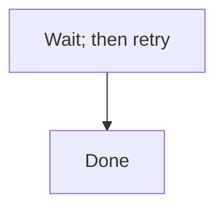

# EDM Plugin -- Conventions for Contributors

This file documents the architectural rules, naming conventions, and configuration model for the EDM Claude Code plugin.
Read this before making changes -- it captures decisions that aren't otherwise visible in the code.

## Architectural rules (do not violate)

### 1. `skills/` is the only entry point -- there is no `commands/`

Per the Claude Code plugin docs, `commands/` is the legacy location for skills-as-flat-files. New plugins use `skills/`.
Both invoke the same way (`/edm:name`), so maintaining both is pure duplication. **Do not re-introduce a `commands/`
directory.**

### 2. Skills are the source of truth for orchestration

Each phase skill (`skills/orchestrator/SKILL.md`, `skills/plan/SKILL.md`, etc.) contains:

- Methodology context (what is EDM, when to use it)
- Step-by-step operational orchestration
- The HITL gate prompts

Agents are invoked from skills, not the other way around.

**Skill-tool composition** (EDMV3-T34; spike recorded as decision D21 in
`SRD/edm/EDMV3__prompt-streamline/decisions.md` and `spike-skill-composition.md`): skills DO load
other skills, via the `Skill` tool. This marketplace's own **git plugin is the in-repository
precedent** -- `skills/commit/SKILL.md` invokes the `jira` plugin's `search-jira` skill exactly
this way today. The orchestrator dispatches; each phase skill owns its phase's complete procedure
exactly once, never duplicated in the orchestrator. Two obligations fall on any caller:

1. **`Skill` must appear in the caller's `allowed-tools`.** The callee's own `allowed-tools`
   governs what the callee itself may do while it runs -- grants are not inherited from, or
   intersected with, the caller's (confirmed live in the D21 spike: a `Bash`-less caller's callee
   ran `Bash` successfully because the callee's own frontmatter granted it).
2. **The caller must handle a target-skill-not-enabled failure gracefully.** An unavailable
   target fails the Skill-tool call with a `tool_use_error: Unknown skill: <name>` -- a clean,
   nameable error, not a silent no-op or a hang (confirmed live in the D21 spike). The caller must
   report the unavailable skill by name and stop; it must never fall back to silently inlining the
   target's procedure.
3. **No skill in this plugin may set `disable-model-invocation: true`.** That flag rejects every
   `Skill`-tool call to the skill, the dispatcher's included -- `Skill edm:plan cannot be used
   with Skill tool due to disable-model-invocation` -- which breaks the composition this whole
   section rests on. Phase skills set `user-invocable: true` and keep Claude from auto-firing
   through their descriptions ("Invoked explicitly via `/edm:<name>`"), not through that flag.
   `bin/edm-check-skill-sync` enforces this.

Context accumulated by the caller (its own reasoning, anything it has read or written this turn)
is visible to the callee automatically -- the callee runs within the **same conversation**, not an
isolated sub-agent context the way a `Task`-spawned agent (`edm-explorer`, `edm-implementer`,
etc.) does.

#### Intent-to-file index

Some behaviors are described in more than one file with no indication which is authoritative
(explorer 02 C3.3). When in doubt about **which file is authoritative**, this table wins:

| I want to change... | Edit this file (authoritative) |
|---|---|
| What a phase does, step by step | `skills/{phase}/SKILL.md` |
| What the explorer agent explores and how it reports | `agents/edm-explorer.md` -- `skills/plan/SKILL.md`'s "AI Execution Pattern" only names when/how many to spawn |
| Gate approval behavior (STOP/WAIT, free-text rejection, options) | `skills/orchestrator/SKILL.md Sec."Gate PROTOCOL"` -- every other gate site references it by name, never restates it |
| Severity definitions (P0/P1/P2/NOTED) | `CLAUDE.md Sec."Severity vocabulary"` -- every other site references it by name |
| A `bin/edm-state` subcommand's behavior | `bin/edm-state` itself -- the `bin/` table below only indexes it |
| An audit lens's mandate | `agents/edm-audit-{lens}.md` -- `skills/code-audit/SKILL.md`'s lens table only summarizes |

### 3. Artifacts live in the project's `SRD/` directory and are committed to git

Every artifact EDM produces -- planning notes, SRDs, ticket packs, audit reports, code-audit remediation plans, *
*and `.edm-state.json`** -- is a project deliverable that lives in the repository's `SRD/` directory. Source control IS
the feature:

- A teammate reviews the SRD in a PR before any code is written
- Ticket pack changes show up in code review
- Audit findings are inspectable in commit history
- Multiple developers see the same in-flight initiative state

`${CLAUDE_PLUGIN_DATA}` is reserved for plugin-internal caches only (convention detection, prefix lookup tables). It
does NOT hold initiative artifacts or initiative state.

### 4. State is in the project, not the plugin

`SRD/{PRODUCT}/{PREFIX}__{DESCRIPTION}/.edm-state.json` (or `SRD/{PREFIX}/.edm-state.json` for legacy flat initiatives)
is committed by default. Teams that want per-developer state can add it to `.gitignore` (controlled by the
`commit_state_file` user-config option).

## Project artifact layout

The **canonical layout** (v2.0+) places each initiative inside a product subdirectory:

```
SRD/                              <- project root, committed to git
+-- .codemap.md                   <- current-architecture map (Should/on-demand); written and
|                                     refreshed by the first explorer of each initiative
|                                     (agents/edm-explorer.md); shared across every initiative
+-- {PRODUCT}/                    <- one directory per product area (e.g. "edm", "auth", "billing")
    +-- {PREFIX}__{DESCRIPTION}/  <- initiative directory (double-underscore separator)
        |
        +-- planning.md               <- Phase 1 (Must/always-present)
        +-- srd.md                    <- Phase 2 output (filename configurable) (Must/always-present)
        +-- architecture.md           <- Phase 2: edm-architect diagrams and decisions (Must/always-present)
        +-- explorers/                <- Phase 1: parallel explorer findings, one file per focus area (Must/always-present)
        |   +-- 01-{slug}.md, 02-{slug}.md, ...
        +-- decisions.md              <- running key-decisions and finding-to-commit ledger (Must/always-present)
        +-- audit-srd.md              <- Phase 3 audit findings
        +-- tickets/                  <- Phase 4 (dirname configurable)
        |   +-- README.md             <- index, legend, critical path, coverage map, version-linkage header
        |   +-- audit.md              <- Phase 5 ticket-pack audit
        |   +-- epics/
        |       +-- 01-{epic}.md
        |       +-- 02-{epic}.md
        +-- test-plan.md              <- /edm:test (stack + AC coverage map)
        +-- test-coverage.md          <- /edm:test (coverage by layer + AC<->test cross-ref)
        +-- qc/                       <- Phase 6 QC reports (always-present after first wave)
        |   +-- qc-summary.md         <- merged QC verdict table (single auditor or merged shards)
        |   +-- qc-shard-impl-{NN}.md <- per-implementer hook shards ({NN} = lowest ticket in range)
        |   +-- qc-shard-pass-w{WW}-{NN}.md <- post-wave threshold shards ({WW} = wave number, {NN} = shard ordinal within that wave); disjoint from qc-shard-impl-*
        +-- code-audit/               <- /edm:code-audit output
        |   +-- findings-ledger.jsonl <- authoritative cross-round findings ledger (stable CA-NNN IDs)
        |   +-- findings-ledger.md    <- deterministic render of findings-ledger.jsonl (`edm-state render-ledger`)
        |   +-- pass-{N}_{YYYY-MM-DD}/ <- one directory per audit round (N = monotonic counter)
        |       +-- lens-L1.jsonl ... lens-L14.jsonl  <- authoritative per-lens findings (schema in skills/code-audit/SKILL.md)
        |       +-- lens-L1.md ... lens-L14.md
        |       +-- lenses-run.txt    <- lens set for this round (full vs. partial)
        |       +-- tooling-notes.md  <- on-demand (CA-388/CA-466): per-lens stall counts and truncation caveats; absent when the round's delivery was clean
        |       +-- REMEDIATION.md
        +-- ROLLBACK.md               <- rollback runbook (Should/on-demand; structure: trigger, revert steps, verify, owner)
        +-- exec-report.md            <- post-Phase-6 execution report with mode field (Should/on-demand)
        |   (per-epic variant: epicN-execution-report.md)
        +-- post-deploy/              <- post-deploy verification + analysis-input docs (Could/on-demand)
        |   +-- verification.md       <- smoke-test / deploy verification report
        |   +-- analysis/             <- rate-limit-analysis.md, source-triage.md, cost-analysis.md
        +-- HANDOFF.md                <- auto-generated cross-user resume doc (updated at every phase/gate/stop)
        +-- .edm-state.json           <- gate approvals, phase timestamps, mode fields (committed by default)
```

**Slot annotations**:
- `always-present` -- scaffolded by `edm-init` or written early in the phase flow
- `on-demand` -- created by its owning phase/agent only when the initiative needs it
- `Must/Should/Could` -- priority per SRD EDMV2-38..43

**Canonical artifact homes** (all paths derived from state via `initiative_dir_for()`, never hardcoded):
- `SRD/.codemap.md` -- the repository's **current** architecture, distinct from any one
  initiative's `architecture.md` (its **target** architecture): the two never duplicate or
  contradict each other because they answer different questions. Lives at the `srd_root` root, not
  inside an initiative directory, because it is shared and refreshed across initiatives rather than
  scoped to one (D11, `EDMV4-T48`). No generator produces or validates it -- it is written by hand
  by the first explorer of each initiative (`agents/edm-explorer.md`).
- `architecture.md` -- canonical home for `edm-architect` diagrams and architecture decisions (EDMV2-38)
- `explorers/` -- canonical home for parallel explorer reports; synthesized into `planning.md` (EDMV2-39)
- `decisions.md` -- initiative-wide key-decisions + finding-to-commit ledger; distinct from `code-audit/findings-ledger.md` which is the code-audit cross-round ledger (EDMV2-40)
- `ROLLBACK.md` -- on-demand rollback runbook; template: trigger conditions, ordered revert steps, verification-after-rollback, owner/contact (EDMV2-41)
- `exec-report.md` -- post-Phase-6 execution report; `mode` field = run mode (e.g., `live-db`, not the adaptation profile) (EDMV2-42)
- `post-deploy/` -- post-deploy verification and analysis-input documents (EDMV2-43)

**Concrete example**: `SRD/edm/EDMV2__enhance-edm-plugin/`

- The **double-underscore** (`__`) separates the PREFIX from the description slug -- never use a single underscore.
- The description slug is lowercase-hyphenated (e.g. `enhance-edm-plugin`, `user-auth-rewrite`).
- PREFIX is **globally unique** across ALL product subdirectories -- two products may not share a PREFIX (see Naming conventions below).

**Existing flat initiatives (`SRD/{PREFIX}/`) continue to work unchanged** (EDMV2-90 backward compat). The resolver
(`state_file_for` in `bin/edm-state`) detects the layout automatically and prefers an existing on-disk path so
in-flight initiatives are never relocated without explicit `edm-state migrate-path` invocation.

Migration from flat to product-scoped is **opt-in** per initiative:

```bash
edm-state migrate-path --product edm --description enhance-edm-plugin EDMV2
```

This uses `git mv` when the initiative is git-tracked, then updates `product_name` and `initiative_description` in state.

The plugin reads root paths from `userConfig`, so teams can relocate the entire tree:

- `${user_config.srd_root}` (default `./SRD`)
- `${user_config.srd_filename}` (default `srd.md`)
- `${user_config.ticket_pack_dirname}` (default `tickets`)

### Existing repository conventions (informational)

The project may contain an `/SRD/` directory with initiatives that pre-date the plugin and use older patterns. The
plugin does NOT migrate these -- they keep their current format. New initiatives created via the plugin use the
product-scoped canonical layout above (or flat layout when `--product`/`--description` are omitted).

## Naming conventions

### Initiative prefix

3-6 uppercase characters, e.g., `AUTH`, `MIGR`, `TIPS`, `PERF`. Validated by `bin/edm-validate-prefix` for
**global uniqueness** across ALL product subdirectories in `SRD/` (not just one product). This ensures the PREFIX
is unambiguous in commit scopes, ticket IDs, HANDOFF references, and Jira scopes -- two products sharing a PREFIX
would make all of these ambiguous. Configurable hint: `${user_config.prefix_format_hint}`.

### Requirement IDs (in SRDs)

`{PREFIX}-{NN}` -- e.g., `AUTH-01`, `AUTH-02`, ..., `AUTH-37`.

### Ticket IDs (in ticket packs)

`{PREFIX}-T{NN}` -- e.g., `AUTH-T01`, `AUTH-T02`, ..., `AUTH-T48`.

The `T` prefix distinguishes tickets from SRD requirements and prevents global collision across initiatives. **Never use
the legacy `TICK-NN` format**; the plan ID disambiguates initiatives in cross-initiative coverage maps.

### Version-linkage in ticket packs

Every ticket pack `README.md` body's first line MUST be:

```
Generated From: ${user_config.srd_filename} v{srd_version}
```

The `srd_version` is read from `.edm-state.json`. The `edm-ticket-auditor` (Dimension 8 -- Version Alignment) verifies
this against the current SRD version and flags drift as a P0 finding.

## Agent color scheme (semantic)

| Color     | Agent(s)                                              | Meaning                                 |
|-----------|-------------------------------------------------------|-----------------------------------------|
| `yellow`  | `edm-explorer`                                        | Phase 1 -- discovery                     |
| `blue`    | `edm-architect`, `edm-srd-writer`                     | Phase 2 -- writing                       |
| `orange`  | `edm-srd-auditor`, `edm-ticket-auditor`               | Phase 3 & 5 -- pre-implementation audits |
| `magenta` | `edm-ticket-writer`                                   | Phase 4 -- writing tickets               |
| `green`   | `edm-implementer`                                     | Phase 6 -- building                      |
| `red`     | `edm-qc-auditor`                                      | Phase 6 QC -- final gate                 |
| `cyan`    | all 14 `edm-audit-*` lenses + `edm-audit-synthesizer` | Code audit (one logical operation)      |

When adding a new agent, choose a color that matches the phase. Lens agents always share `cyan`.

## Severity vocabulary (canonical)

All EDM audit agents use the following four-level scale. No agent may define a divergent local scale.

| Level | Meaning | Required action |
|---|---|---|
| **P0** | Critical -- blocks implementation, security/legal issue, production failure, or architecturally wrong | Fix before this phase may be called complete |
| **P1** | Significant -- material gap, factual error, missing requirement, or behavior that must be corrected before shipping | Remediated before the phase or round may be called complete |
| **P2** | Minor -- polish, edge-case, improvement, or nice-to-have | Remediated before convergence |
| **NOTED** | Not actionable -- the issue is intentional, pre-existing, or a known accepted trade-off | Document in "Decisions / Non-Findings"; do not re-investigate |

`NOTED` is not actionable and is distinct from deferral -- a deferral is an actionable finding
postponed to later, and deferral does not exist in this methodology. Every P0, P1 and P2 finding
is remediated before convergence; `NOTED` is the only status that closes a finding without a fix.

**Backward-compatibility mapping** (from the synthesizer's legacy P1/P2/P3 scale used before v2.0):
- Legacy P1 (production failure / security) -> **P0**
- Legacy P2 (operational friction / must-fix) -> **P1**
- Legacy P3 (defensive improvement / nice-to-have) -> **P2**
- NOTED -> unchanged

**Sanctioned exception -- P2 debt acceptance at convergence (EDMV3-T68).** "Remediated before
convergence" above still holds by default; the one sanctioned exception is an explicit human
choice at the convergence gate, never a silent policy weakening. When a code-audit round's
blocking set is P0=0, P1=0 and P2>0, `skills/code-audit/SKILL.md`'s convergence gate (Sec."10.
Convergence gate") offers **Converge now**, which runs `edm-state approve-gate <PREFIX>
code-audit --accept-p2-debt`. That command hard-refuses if any P0 or P1 is open -- the override
is P2-only, never P0/P1 -- and otherwise records `code_audit_converged=true` plus
`code_audit_p2_debt_accepted`/`_count`/`_round`/`_accepted_at`/`_accepted_by` in state. The
ledger itself is left unchanged: accepted P2s still show as open findings in
`findings-ledger.md`/`.jsonl`, and HANDOFF's code-audit gate row names the accepted count and
round so a teammate sees debt was knowingly carried, not silently missed. `edm-state archive`
re-verifies P0/P1 are still 0 and refuses if a newer full audit round has completed since
acceptance (the debt has gone stale -- re-run `--accept-p2-debt` or fix the remaining findings
first). The override reads the blocking set straight from `findings-ledger.jsonl`, so it does
not itself require that a full fourteen-lens round was ever recorded (CA-426): on an initiative
with zero recorded code-audit rounds the convergence check warns on stderr and proceeds, and the
flag can engage. It asserts only that no P0 or P1 is open in the ledger as it stands, never that
the ledger is complete. The gate also offers **Fix low-hanging fruit first**: remediate the P2s
whose
REMEDIATION.md prescription is a single self-contained change, then re-present the gate with the
smaller remaining set -- a middle ground between converging immediately and re-treating every
open P2 as blocking.

## Mermaid diagram conventions (canonical)

All EDM agents that author or audit Mermaid diagrams follow these conventions. No agent may define a divergent local rule.

Mermaid's `;` is a lexer-level statement separator, and this is reserved even where the `;` appears inside label text -- the parser does not distinguish "inside a label" from "between statements," so a literal semicolon inside a node, edge or message label breaks the diagram.

**The rule:** a literal semicolon in Mermaid label, node, edge or message text is written as the entity code `#59;` -- `#` followed by either a base-10 code point or an entity name, then `;`, with no leading ampersand. `&#59;` is not this project's convention; `#59;` is correct.

Before (raw semicolon inside a label -- breaks the diagram):

<!-- edm-lint-ignore-start -->

<!-- edm-lint-ignore-end -->

After (entity code, no leading ampersand -- renders correctly):


Quoting label text is not a reliable substitute for the entity code across every diagram type. A `sequenceDiagram` message's text after the `:` is unquoted, so it is especially exposed to this failure -- there is no quote to protect it there.

The following remain legal and are **not** violations of this rule:
- A statement-terminating `;` at the end of a line, outside any label.
- `;` on a `%%` comment line.
- `;` terminating a `classDef`, `style`, or `linkStyle` directive.

Other entity codes follow the same form, so the rule generalizes: `#quot;` (double quote), `#35;` (`#`), and so on.

This section's heading string, `## Mermaid diagram conventions (canonical)`, is referenced by name from the eleven touch points inventoried in `architecture.md` and asserted by a smoke test -- do not rename it without updating every reference.
## Audit lens house contract (canonical, EDMV4-T28)

Every `agents/edm-audit-*.md` lens file -- the eleven pre-EDMV4 lenses and the three EDMV4 lenses
alike (L12 Silent Failures, L13 Type Design, L14 Behavioral Test Coverage) -- shares one
structural contract, verified in full against `edm-audit-logic.md` (L1) and
`edm-audit-security.md` (L8). A new lens agent conforms to all nine parts below, not most of them;
several are **machine-enforced**, not merely conventional, by the "EDMV4-T28: house lens contract"
banded section in `bin/tests/wave8-smoke.sh`, which derives the lens file set **live** (a glob
over `agents/edm-audit-*.md` excluding the synthesizer) rather than from a hardcoded name list, so
a fifteenth lens is checked automatically rather than silently escaping coverage the way a fourth
hardcoded list would (the exact defect `EDMV4-T30`'s own Technical Notes record having to
re-inventory once already).

1. **Frontmatter**, byte-identical apart from `name`/`description`: `tools: Glob, Grep, LS, Read,
   NotebookRead, WebFetch, TodoWrite, WebSearch, Write`, `model: opus`, `effort: max`,
   `maxTurns: 30`, `color: cyan`, `disallowedTools: Edit, NotebookEdit` -- structurally read-only
   apart from `Write`, matching the "Contested audit set" row of "Model and effort assignments"
   above. No hand-picked downgrade is taken; only a measured, mechanical promotion may retier it.
2. **Opening frame**: `You are executing **EDM Code Audit Lens L{N}: {Name}**.` immediately
   followed by the mandate-narrowing sentence, `Your mandate is ONLY this lens. Do not audit other
   dimensions -- other agents handle those.`
3. **`## Scope`** carries the verbatim house scope-statement paragraph, byte-identical across
   every lens.
4. **`## What You Hunt For`** -- the lens-specific hunt taxonomy; this is the one section every
   lens's content is unique.
5. **`## False Alarm Filter`** carries the identical framing sentence plus exactly three numbered,
   lens-specific criteria -- never more, never fewer.
6. **`## Output`** states the two permitted write paths (`${OUTPUT_DIR}/lens-L{N}.md` and
   `${OUTPUT_DIR}/lens-L{N}.jsonl`), the ASCII-only reminder, the `mkdir -p` rationale for why
   `Write` is granted without `Bash(mkdir *)`, and the "JSONL file is authoritative on conflict"
   sentence.
7. **`## Output Format`** cites `CLAUDE.md Sec."Severity vocabulary"` and carries the
   `Read docs/canonical-sections.md` anchoring instruction verbatim, including the "resolved
   relative to the EDM plugin's own root ... never the caller's cwd" qualifier -- the C6
   enforcement point that keeps every lens citing the one closed severity scale.
8. **`## JSONL Line Format`** restates the fixed schema verbatim (modulo the lens ID), the five
   field-rule bullets (`id`, `round`/`round_type`, `sev`, `confidence`, `status`), and the
   residual-risk paragraph.
9. **`## When this does NOT apply`** is present in every lens. An unconditional lens (every member
   outside `CONDITIONAL_LENS_IDS`) uses the standard sentence, "This agent always applies once the
   code-audit skill selects lens L{N} for the round." The sole conditional lens (`L13`) carries the
   `EDMV4-T26` exception form instead: inapplicability framed explicitly, cost named as never a
   legitimate reason to skip (guard D2), and an explicit agreement clause with
   `skills/code-audit/SKILL.md` Step 1's determination rather than a self-declared exemption.

Diff a new lens file against `edm-audit-logic.md` section-by-section -- every heading, in order,
must match -- rather than re-authoring this contract from memory.

## Verifier completion sentinel (canonical)

Every read-only verifier agent in this plugin -- `edm-srd-auditor`, `edm-ticket-auditor`,
`edm-qc-auditor`, `edm-test-coverage-auditor` -- can stop at its `maxTurns` ceiling mid-audit.
Nothing detects this by default: the consumer that reads the verifier's output has no way to tell
a truncated run from a finished one, and treats a partial result as complete. This section is the
single contract all four verifier prompts and their four consumers implement against, so an agent
emitting a marker that differs even slightly from what its consumer checks for does not silently
reintroduce the exact defect this contract exists to close.

### Grammar

A single-line HTML comment, ASCII only, with exactly one space on either side of both comment
delimiters (`<!--` and `-->`), and no line continuation:

```
<!-- {MARKER}-COMPLETE range={ASSIGNMENT} assigned={M} audited={N} -->
```

`{MARKER}` is one of the four marker tokens below; `{ASSIGNMENT}`, `{M}` and `{N}` are described
under "Fields" below. The sentinel carries no timestamp, no agent name, and no host metadata --
anything a truncated agent could plausibly emit early in its run is excluded by construction, so
an early, incomplete emission can never masquerade as the finished sentinel.

### The four markers

| Marker | Terminates |
|---|---|
| `QC-SHARD-COMPLETE` | `qc/qc-shard-impl-*.md` and `qc/qc-shard-pass-*.md` (file form) |
| `SRD-AUDIT-COMPLETE` | `edm-srd-auditor`'s returned text (returned-text form) |
| `TICKET-AUDIT-COMPLETE` | `edm-ticket-auditor`'s returned text (returned-text form) |
| `TEST-COVERAGE-COMPLETE` | `test-coverage.md` and any `test-coverage-{epic}.md` (file form) |

### Fields

- `range=` names the assignment the dispatcher handed the agent (for example `T01-T08`, a
  section group, or a lane name). It contains no whitespace. It is a human-readable label only --
  no consumer parses it to derive a count, so it is free to take any assignment-specific shape
  (a ticket range, a section group, a lane name) without complicating the check.
- `assigned=` is a base-10 count, supplied by the dispatcher at spawn time, of the units the
  agent was assigned to cover. This is what makes the short-count comparison a plain integer
  comparison instead of a parse of `range=`: the dispatcher already knows this number when it
  spawns the agent, because it is the same number it used to construct `range=`.
- `audited=` is a base-10 count of the units the agent actually covered -- tickets, sections,
  files, whatever the marker's artifact counts in -- as of when the agent finished, not the
  count it was assigned.

### The check: `tail -1`, and nothing else

The consumer checks `tail -1` of the artifact (or, for the two returned-text markers where there
is no file to `tail`, the last non-empty line of the returned text) and nothing else. This is the
whole check, deliberately: a truncated agent stops mid-sentence and cannot emit a trailing line it
never reached, so a well-formed sentinel found anywhere other than the last line proves nothing
about completion and must be rejected exactly as if no sentinel were present at all. A consumer
that instead grepped the whole artifact for the marker string would accept a sentinel written into
a header, or a placeholder written before the work started, which destroys the property this
contract exists to provide.

### Two refusal conditions

The consumer enforces exactly two conditions, and both refuse loudly, naming the offending
artifact path rather than failing silently or falling back to partial acceptance:

1. **Missing or misplaced sentinel.** The last line does not carry the marker in the exact
   grammar above. This catches outright truncation.
2. **Short count.** The marker is present and well-formed, but `audited=` is less than
   `assigned=` -- a pure integer comparison (`N < M`), identical for all four markers, that
   requires no consumer to parse `range=` or know anything about what a given verifier's
   assignment semantics mean. This catches the clean-but-incomplete case -- an agent that
   terminated normally having covered, for example, six of eight assigned tickets -- which the
   completion check alone would miss entirely.

### No new binary dependency

The check introduces no binary beyond this plugin's existing `bash`, `jq`, `git` contract --
`tail`, `grep`, and `sed` are the only tools any implementation of it needs beyond `bash` itself
-- and every implementation is bash 3.2 compatible (the floor both macOS and Linux ship as
`/bin/bash`).

### Turn budget parity

Each of the four read-only verifiers named at the top of this section runs at parity with --
at least equal to -- the producer agent whose output it checks; parity is a per-pair relationship,
not one shared literal `maxTurns` value across the whole set of four. `edm-srd-auditor` and
`edm-ticket-auditor` stay at `maxTurns: 50`, matching `edm-srd-writer`'s and `edm-ticket-writer`'s
own `maxTurns: 50`. `edm-qc-auditor` runs at `maxTurns: 150`, matching `edm-implementer`'s
`maxTurns: 200` -- both raised together (from 50 and 60 respectively) by `EDMV4-T55`, calibrated
against measured Phase 6 wave-1 usage (decisions.md D30), after the pre-raise ceilings proved too
low at real scale. `edm-test-coverage-auditor` stays at `maxTurns: 50`, at parity with the
test-writer layer it checks. Verification is not cheaper than production: a verifier must read the
artifact under audit **and** cross-reference it against the codebase, which is strictly more work
than writing the artifact in the first place. Do not "tidy" any of these four down toward a lower
shared number to make them look uniform -- each verifier's parity obligation is with its own
producer, never with the other three verifiers, and the plugin's `maxTurns: 30` code-audit-lens
floor (which has no evidence of truncation and is unrelated to this parity) is never the right
target for any of the four. (CA-032: this section previously asserted a single `maxTurns: 50`
figure for all four verifiers after `EDMV4-T55` had already raised two of them; it is phrased
above per-pair, naming each current value, so a future raise to one pair cannot silently falsify
a blanket claim about the other three.) The completion sentinel above is what makes a higher
budget safe: it is what still catches a truncated run even though truncation becomes rarer at a
higher ceiling than at a lower one.

### Scope of this section

This is a documentation-only contract: nothing in the plugin reads this section at runtime, and it
changes no behavior on its own. It is deliberately not added to `docs/canonical-sections.md`'s
generated, byte-identical set -- that generator's `--check` mode is a separate concern with its
own regression surface, and adding a third section to it is out of scope here. The four verifier
agent prompts inline this grammar as a literal string rather than referencing this section by
name, because a bare `` `CLAUDE.md Sec."..."` `` reference is known not to resolve from an
installed plugin cache (D22, above). The executable check, the four prompt edits, and the four
consumer-side checks that implement this contract are the subject of later tickets in this
initiative; this section exists so all of them target one fixed grammar instead of re-deriving it
independently.

## Unverifiable acceptance criteria (D15)

An unverifiable acceptance criterion -- one whose stated runtime environment does not exist in
the project (no staging deploy, no live database, no browser harness) -- is a specification
defect, not a fourth verdict. `/edm:verify-runtime` (EDMV3-T33) records exactly two closing
verdicts, PASS or FAIL, for every entry in `partial_verdict_map`; there is no `BLOCKED`,
`WAIVED`, or `N/A-runtime` value anywhere in this methodology.

When an AC's runtime environment genuinely does not exist, there are exactly two sanctioned
responses:

1. **Rework the AC** into something verifiable in the environment that does exist -- the usual
   outcome. Most "PARTIAL forever" ACs are testable with a narrower, still-meaningful claim.
2. **Move the unverifiable clause out of scope** as a recorded boundary for a follow-on
   initiative, using the D14 scope-boundary framing -- a decision made on its own merits, not a
   postponed finding.

Both routes are a scope change to an approved ticket, so both go through gate change control:
presented at the relevant gate with the rationale, approved or rejected by the human via the
canonical `skills/orchestrator/SKILL.md Sec."Gate PROTOCOL"`, and recorded in `decisions.md` and
the ticket's audit trail. **The implementer cannot descope an AC by declaring it unverifiable** --
only a human, at a gate, can accept route (1) or (2). Archive stays hard-blocked until every AC in
`partial_verdict_map` carries a `closing_verdict` of PASS or FAIL.

## By-name reference resolution from an installed plugin cache (EDMV3-T41)

**Verified NOT to resolve deterministically (decisions.md D22, Claude Code 2.1.220,
2026-07-28).** `claude plugin validate` confirms plugin-root `CLAUDE.md` is never loaded as
runtime context ("use a skill instead"), and an installed plugin's cache directory is not
path-adjacent to whatever project it is installed into, so a bare `` `CLAUDE.md Sec."..."` ``
reference in a prompt has no plugin-relative anchor to resolve against from there -- it either
fails to resolve, or (since "CLAUDE.md" is itself a common convention) silently resolves to the
target project's own unrelated `CLAUDE.md` instead. The Severity vocabulary section, the Mermaid
diagram conventions section, the Unverifiable acceptance criteria (D15) section above, and four
more sections resolved by `EDMV4-T04` (`Project artifact layout`, `Optional: Jira
synchronization`, `EDM mode matrix (EDMV3-T38)`, `Phase Timing Guidelines (EDMV3-T38)`) -- seven
sections total, derived from `edm-sync-canonical-sections`' own generation block at edit time, not
assumed -- are additionally generated, byte-identical, into `docs/canonical-sections.md`
(regenerate via `edm-sync-canonical-sections` after editing any section above) -- the
plugin-relative path new prompt-surface references point at instead of the bare
`CLAUDE.md Sec."..."` form. The `Verifier completion sentinel (canonical)` section above is the
sole deliberate exception: it documents, in its own "Scope of this section" paragraph, why it is
never added to this generated set.

**Current position (decisions.md D34, extended by `EDMV4-T04`): the negative branch is now the
shipped default across the full verified set, not a narrower one.** `agents/edm-audit-synthesizer.md`,
`agents/edm-srd-auditor.md`, all fourteen `agents/edm-audit-*.md` lens definitions, and all
fourteen files `EDMV4-T04` anchored (`agents/edm-architect.md`, `agents/edm-srd-writer.md`,
`agents/edm-ticket-writer.md`, `agents/edm-ticket-auditor.md`, `agents/edm-qc-auditor.md`,
`skills/srd/SKILL.md`, `skills/tickets/SKILL.md`, `skills/audit-srd/SKILL.md`,
`skills/audit-tickets/SKILL.md`, `skills/verify-runtime/SKILL.md`, `skills/push-jira/SKILL.md`,
`skills/orchestrator/SKILL.md`, `skills/metrics/SKILL.md`, `skills/code-audit/SKILL.md`) now carry
an explicit `Read docs/canonical-sections.md` instruction anchored to the plugin's own root (never
the caller's cwd) alongside their `CLAUDE.md Sec."..."` citation, so both forms resolve for a
consumer reading any of these files. **`EDMV4-T04` has landed**: the residual scope opened as a
named follow-on ticket by D34 (originally the eight-file subset of `srd.md`'s nine EDMV3-54
prompt-surface touch points not already covered by the lens/synthesizer set) is closed, and the
verified set turned out to be fourteen files (5 agents + 9 skills), not eight -- `CLAUDE.md`'s own
prior list missed `edm-qc-auditor.md`, `verify-runtime/`, `push-jira/`, `orchestrator/`,
`metrics/` and `code-audit/SKILL.md`, all of which carried the identical D22 defect
(decisions.md D10). That work lives in `SRD/edm/EDMV4__ecc-integration/` -- the initiative that
absorbed the never-created `EDMV4__lint-and-pipeline-budgets` name D1 retired, along with its
three pre-claimed ticket IDs `EDMV4-T01`, `EDMV4-T04` and `EDMV4-T05`. `EDMV4-T02` and
`EDMV4-T03` were closed inside EDMV3 and are retired; the numbering gap between `T01` and `T04`
is intentional (`EDMV4-T09`).

## Model and effort assignments

Derived from tiering matrix <date>; re-run when the model generation or pricing table changes
(EDMV3-73). **Status: NOT yet matrix-derived.** The tiering matrix (`evals/tiering-matrix.sh`,
EDMV3-T48) is built and unit-verified against synthetic fixtures, but has not been run against
real data: the wave-A eval baseline it would measure against does not exist yet (decisions.md
D23). Until that baseline is captured and the matrix runs for real, the table below is the same
judgment-calibrated set of tiers from Gate 3 (D16), unchanged except the three wave-A downgrades
EDMV3-T02 already applied on their own, independently-argued merits (D16). See decisions.md D28
for the exact command that closes this gap and replaces this note with a real run date.

| Role / Agent(s) | Model | Effort | Rationale |
|---|---|---|---|
| Contested audit set -- 14 code-audit lenses, `edm-audit-synthesizer`, `edm-srd-auditor`, `edm-ticket-auditor`, `edm-qc-auditor` (18 agents) | `opus` | `max` | Judgment-heavy work -- surface subtle issues. UNCHANGED pending the tiering matrix (D16): no hand-picked downgrade is taken here -- only a measured, mechanical promotion (EDMV3-T48 AC3) may retier this set |
| `edm-explorer` | `sonnet` | `high` | Scan/list work, not judgment-heavy synthesis; downgraded from `opus`/`max` EDMV3-T02 (D16 wave-A safe downgrade) |
| `edm-test-coverage-auditor` | `sonnet` | `high` | Read-only coverage parse and AC cross-reference, not judgment-heavy; downgraded from `opus`/`max` EDMV3-T02 (D16 wave-A safe downgrade) |
| `edm-architect` | `opus` | `high` | Writing work; downgraded from `opus`/`max` EDMV3-T02 (D16 wave-A safe downgrade) |
| Writing (`edm-srd-writer`, `edm-ticket-writer`) | `opus` | `high` | High-stakes artifacts the rest of the methodology depends on; opus catches missed requirements and weak ACs that sonnet sometimes misses |
| Implementation (`edm-implementer`) | `sonnet` | `high` | Throughput work -- well-specified by tickets |
| Jira sync (optional) | `sonnet` | `high` | Mechanical mapping -- ticket pack already exists; this just translates fields |

Skills mirror the split: `skills/orchestrator/`, `skills/plan/`, `skills/srd/`, `skills/audit-srd/`, `skills/tickets/`, `skills/audit-tickets/`, `skills/implement/`, `skills/code-audit/`, `skills/test/`, and `skills/test-plan/` are all on `opus`. The two writers (`skills/srd/`, `skills/tickets/`) and `skills/test-plan/` run at `effort: high`; `skills/orchestrator/`, `skills/plan/`, the audit skills, `skills/implement/`, `skills/code-audit/`, and `skills/test/` run at `effort: max`. `skills/push-jira/`, `skills/metrics/`, `skills/test-coverage/`, and `skills/verify-runtime/` run on `sonnet`/`high`. All 14 skills are accounted for above.

### Prompt conventions (house style)

The prompt-engineering conventions adopted across EDMV3-59 through EDMV3-67 (communication
cadence, deliverable-length calibration, agent scope statements, output contracts, the
implementer's decision ladder, N/A carve-outs, and the explorer fan-out cap) are **house style**
for this plugin: an agent or skill added later inherits them rather than rediscovering them from
scratch. The adoptions are **structural** (instruction-design patterns -- a shape of section, a
kind of clause) and never verbatim text lifted from a source.

**Six sources, with licence and location, matching the enumeration this subsection uses**:

- **opus-5** -- the Opus 5 prompting guide:
  `https://platform.claude.com/docs/en/build-with-claude/prompt-engineering/prompting-claude-opus-5`
  (Anthropic documentation; publicly readable; guidance mined for structure, not copied verbatim).
- **sonnet-5** -- the Sonnet 5 prompting guide:
  `https://platform.claude.com/docs/en/build-with-claude/prompt-engineering/prompting-claude-sonnet-5`
  (Anthropic documentation; publicly readable; guidance mined for structure, not copied verbatim).
- **caveman** -- `skills/caveman/SKILL.md` and `CONTRIBUTING.md` in the `caveman` repository:
  `https://github.com/JuliusBrussee/caveman` (**MIT**). Licence verified 2026-07-28 by direct
  inspection of the local clone at `/Users/darryl.porter/projects/caveman`: a top-level `LICENSE`
  file reading "MIT License / Copyright (c) 2026 Julius Brussee", `"license": "MIT"` in
  `package.json`, and a shields.io licence badge in `README.md`. The URL above is that clone's
  `origin` remote, not a link re-fetched over the network from this environment. Clean-room note:
  the adoption here is pattern-level only (persistence framing, the before/after PR convention,
  output-contract shape) -- no text was copied from either file.
- **ponytail** -- `skills/ponytail/SKILL.md` and `ARCHITECTURE.md` in the `ponytail` repository:
  `https://github.com/DietrichGebert/ponytail` (**MIT**). Licence verified 2026-07-28 by direct
  inspection of the local clone at `/Users/darryl.porter/projects/ponytail`: a top-level `LICENSE`
  file reading "MIT License / Copyright (c) 2026 DietrichGebert", `"license": "MIT"` in
  `package.json`, and a `## License` section in `README.md` reading "[MIT](LICENSE)". The URL
  above is that clone's `origin` remote, not a link re-fetched over the network from this
  environment. Clean-room note: the adoption here is pattern-level only (the numbered decision
  ladder, the "when NOT to" carve-out, the "cost of ignoring this" clause) -- no text was copied
  from either file.

- **ECC** -- `everything-claude-code`: `https://github.com/affaan-m/everything-claude-code`
  (**MIT**). Licence verified 2026-08-31 by direct inspection of the local clone's `LICENSE:1-3`
  ("MIT License / Copyright (c) 2026 Affaan Mustafa"), clone revision `ca185ef5` (re-confirmed
  2026-09-02). Clean-room note: L12's taxonomy source (`ECC/agents/silent-failure-hunter.md`) was
  read for its five-category structure only, per `EDMV4-T25` -- no text was copied.
- **GateGuard** -- `https://github.com/zunoworks/gateguard` (**MIT**, upstream is Python). ECC
  vendored a JavaScript port of it at `scripts/hooks/gateguard-fact-force.js`, evidenced by that
  file's own header at `:19-20` ("Full package with config support: pip install gateguard-ai" /
  "Repo: https://github.com/zunoworks/gateguard") and by `ECC/skills/gateguard/SKILL.md:5` marking
  `metadata: origin: community`. Licence verified 2026-08-31 by direct inspection of
  `https://raw.githubusercontent.com/zunoworks/gateguard/main/LICENSE` -- a fetched URL, not a
  local clone -- which reads "MIT License / Copyright (c) 2026 Hirokazu Seto / ZUNO WORKS K.K."
  (decisions.md D13). Clean-room note: per AD1 as ratified at Gate 2 (decisions.md D14,
  2026-09-02), EDM's `bin/edm-gateguard` is a bash rewrite, not a vendoring of either upstream --
  what carries over is the mechanism (deny first touch, demand facts, allow on retry), the same
  pattern-level adoption posture recorded above for `caveman` and `ponytail`; no text was copied
  from either the Python upstream or ECC's JavaScript port.

The strict MIT NOTICE obligation these two entries would otherwise carry is **dormant**: it binds
only on verbatim reuse, and AD1's ratified bash rewrite produces none. It is re-raised to Must
Have if AD1 is ever reversed to vendoring **by any route** -- `EDMV4-59` rejected at a later gate,
or any subsequent decision directing vendoring -- and on that reversal three things bind together:
the vendored files retain their original copyright headers unmodified; a new `plugins/edm/NOTICE`
file names ZUNO WORKS K.K. and Affaan Mustafa with their MIT licence texts; and `EDMV4-56`'s
required-binary set is re-presented at the gate as an explicit dependency addition.

The clean-room posture on `caveman`, `ponytail`, ECC and GateGuard is deliberately unchanged now
that all four licences are known: MIT would have permitted verbatim reuse with attribution, but
structural adoption was what this initiative actually did, and restating it as a licence
consequence would misdescribe the work.

#### Do-NOT-adopt guards

Explorer 02 Part D is the main regression surface for a prompt-only workstream -- these six
guards are recorded so a future contributor applying Opus 5 / Sonnet 5 guidance does not regress
EDM's audit architecture in the name of "improving" it. Each names its cost, in the ponytail
pattern, so it survives edge cases its author did not anticipate:

- **(D1)** Do not strip the audit or QC architecture in the name of over-verification guidance.
  EDM contains no *self*-verification -- its independent-agent auditing (writer/verifier
  separation across `edm-implementer` -> `edm-qc-auditor` -> every code-audit lens, enumerated
  live by `ALL_LENS_IDS` in `bin/edm-state`) is exactly the pattern the guide praises, not the
  anti-pattern it warns against. The cost of ignoring this is silent regression of the
  initiative's entire quality gate -- FAIL findings ship undetected.
- **(D2)** Do not reduce the code-audit lens fan-out (every ID in `ALL_LENS_IDS`, `bin/edm-state`)
  or the SRD/ticket 2-auditor fan-out to keep spawn counts low. Those counts are already
  deterministic, unlike the explorer's uncapped fan-out that EDMV3-T47 just fixed. The cost of
  ignoring this is coverage loss disguised as an efficiency gain -- a lens or audit lane silently
  stops existing and nobody notices until the gap it used to catch ships. (CA-021: this guard's
  own text still read "11-lens" after the lens set grew to fourteen; it is deliberately phrased
  above with no lens count at all, so growing or shrinking `ALL_LENS_IDS` again can never make
  this sentence wrong.)
- **(D3)** Do not import terse register into EDM artifacts. SRDs and tickets are read by humans in
  merge requests, not consumed as a single agent's scratch context. The cost of ignoring this is
  reviewer confusion and slower human sign-off -- the opposite of what EDM's gates exist to speed
  up.
- **(D4)** Do not add interim-progress scaffolding (e.g. "summarize every N tool calls").
  The cost of ignoring this is exactly the padding EDMV3-T45 spent effort removing from the
  other direction -- a narrated tool-call log nobody asked for.
- **(D5)** Do not add "think step by step" or anti-thinking instructions -- raise `effort` instead.
  The cost of ignoring this is a prompt that fights the model's own extended-thinking budget
  instead of using the `effort` field this plugin already exposes for exactly that purpose.
- **(D6)** Do not duplicate the mode matrix into agent prompts, since it is state-backed and read
  at runtime (`CLAUDE.md Sec."EDM mode matrix"`). The cost of ignoring this is the same drift this
  whole epic exists to remove -- two copies of the same behavior-governing text disagree, silently,
  the next time one of them is edited.

#### Contribution convention: before/after with rationale

Because this initiative's entire diff is prose changes to a mature, already-audited prompt set, a
diff with rationale is the only reviewable artifact. **Every merge request that changes prompt
text in this plugin -- any `SKILL.md`, any `agents/*.md`, this file -- shows before and after for each changed block, plus one sentence on why the new wording is better.**
This convention outlives EDMV3: apply it to any future prompt-text change in this plugin, not
only this initiative's own tickets.

## Cost tracking

Every `phase-complete` (and, EDMV3-T51, `audit-round-complete`) invocation captures token usage from the project's
session JSONL files (`~/.claude/projects/<encoded-cwd>/*.jsonl`) and computes Claude API cost using current
Anthropic pricing. The state schema's `phase_durations[N_phase]` entry includes:

- `tokens.{input, output, cache_read, cache_write_5m, cache_write_1h}` -- raw counts (no bare `cache_write` key
  exists; cache writes are split by TTL, see below)
- `model_used` -- the model that handled most of the phase work (last assistant message)
- `estimated_cost_usd` -- computed from tokens x per-million-token rates
- `attribution_mode` -- `"scoped"` or `"whole-directory"` (EDMV3-T52); see below. A strict two-value enum -- it never
  carries a third value for a parse failure (G10); see `unparseable_lines` below for that.
- `unparseable_lines` -- count of session-JSONL lines that failed to parse as JSON while summing tokens for this
  phase (G10); a torn/truncated line is routine while Claude Code is still appending to the driving session, not
  corrupted state. Surfaced as the informational `TORN_TOKEN_LINES` anomaly on `edm-state validate` when non-zero.
- `human_baseline_usd` -- computed from Phase Timing Guidelines median hours x `${user_config.human_hourly_rate_usd}` (
  default $150/hr); recorded on every phase but shown by default only via `metrics-report --with-human-baseline`
  (EDMV3-T53)

**Token attribution (EDMV3-T52, decisions.md D25):** token/cost figures are scoped to the *driving session* -- the
single most-recently-modified `*.jsonl` file in the sessions directory at read time, since Claude Code appends to
its own session's JSONL as the conversation proceeds, making it always the most recently touched file on disk. This
prevents a second Claude Code window open on the same project from inflating a phase's or audit round's figures.
`attribution_mode` records `"scoped"` when this succeeded, or `"whole-directory"` on the pre-T52 fallback (sums
every session JSONL) if the sessions directory has no readable file at read time.

Pricing constants (per million tokens, USD) are baked in but env-overridable. Current generation (the model
generation this plugin's agents actually run on, see "Model and effort assignments" above):

| Model | Input | Output | Cache Read | Cache Write 5m | Cache Write 1h |
|---|---|---|---|---|---|
| Opus 4.8, Opus 5 | $6 | $30 | $0.60 | $7.50 | $12.00 |
| Sonnet 4.7 | $4 | $20 | $0.40 | $5.00 | $8.00 |
| Haiku 4.6 | $1.20 | $6.00 | $0.12 | $1.50 | $2.40 |

Verified 2026-07-28 against [docs.anthropic.com/en/docs/about-claude/pricing](https://docs.anthropic.com/en/docs/about-claude/pricing).

Previous-generation rates (frozen, not env-overridable -- EDMV3-T52 AC9) are kept so a state file recorded before
this refresh is never silently repriced on a later read:

| Model | Input | Output | Cache Read | Cache Write 5m | Cache Write 1h |
|---|---|---|---|---|---|
| Opus 4.7 | $5 | $25 | $0.50 | $6.25 | $10.00 |
| Sonnet 4.6 | $3 | $15 | $0.30 | $3.75 | $6.00 |
| Haiku 4.5 | $1 | $5 | $0.10 | $1.25 | $2.00 |

Override the current-generation rates with `EDM_OPUS_INPUT_RATE`, `EDM_SONNET_OUTPUT_RATE`, `EDM_HAIKU_CACHE_READ_RATE`, `EDM_OPUS_CACHE_WRITE_5M_RATE`, `EDM_OPUS_CACHE_WRITE_1H_RATE`, etc. when rates change.

**How `compute_cost_usd` picks a rate row after D32.** D32 removed the bare family wildcards. The
`case` in `bin/edm-state` now has eight explicit arms:

- previous-generation frozen rows: `*opus-4-7*|*opus-4.7*`, `*sonnet-4-6*|*sonnet-4.6*`,
  `*haiku-4-5*|*haiku-4.5*`
- current-generation explicit rows: `*opus-4-8*|*opus-4.8*|*opus-5*`, `*haiku-4-6*|*haiku-4.6*`,
  `*sonnet-4-7*|*sonnet-4.7*` -- Opus 5 shares the Opus arm at the same rates and the same
  `EDM_OPUS_*` overrides
- the literal `unknown` sentinel from `get_session_tokens_since` (silent placeholder pricing at
  current Sonnet-tier rates; tokens are already zero in that path)
- final `*)` fallback: warn on stderr and also price at current Sonnet-tier rates as a clearly
  suspect placeholder

Two invariants matter here, not the arms' literal position in the file: every explicit version arm
precedes the final `*)` fallback, and no bare family wildcard (e.g. a bare `*opus*`) may be
introduced ahead of `*)` -- that is the exact silent-guess regression D32 removed. The `unknown`
sentinel only has to precede `*)` too; it is not required to sit after every version arm, and today
it does not -- it is arm 6 of 8, between the `*haiku-4-6*` and `*sonnet-4-7*` current-generation
arms. A contributor adding a new version arm (e.g. Sonnet 5) just needs it ahead of `*)`; where it
lands relative to `unknown` is immaterial.

The important behavioral change is the opposite of the pre-D32 contract: an unrecognized model in a
known family no longer matches silently. `claude-opus-9-20260501`, `claude-sonnet-9`, or any other
identifier outside the six explicit version arms now falls through to `*)`, emits the warning, and
gets placeholder Sonnet-tier pricing until a human updates the table. Cross-check `model_used`
against the two tables above before quoting a cost figure from a run driven by a model generation
newer than this section's "Verified" date.

Cache writes are tracked separately by TTL (5-minute vs 1-hour) because they have different rates. Claude Code typically uses 1-hour caching for system prompts and tool definitions, so `cache_write_1h` is usually the dominant figure.

Token reading depends on the path encoding `~/.claude/projects/{cwd_with_slashes_and_dots_as_hyphens}/*.jsonl`. The
`session_dir_for_cwd` helper in `bin/edm-state` handles this.

## Testing layer

`/edm:test <PREFIX>` runs comprehensive multi-layer test coverage after Phase 6 implementation. It
is user-invocable, not auto-triggered. The `/edm:orchestrator` flow suggests it at the end of
Phase 6, but the user decides whether to run it.

### Test artifacts (project-resident, source-controlled)

Two new artifacts are added to `SRD/{PREFIX}/`:

| File | Written by | Purpose |
|------|-----------|---------|
| `test-plan.md` | `edm-test-planner` | Stack detection, AC<->layer mapping, writer task assignments |
| `test-coverage.md` | `edm-test-coverage-auditor` | Coverage by layer vs. targets, AC<->test cross-reference, P0/P1/P2 gaps |

Test code itself lives in the project's existing test directories -- `SRD/` artifacts document
*intent and coverage*, not the tests themselves.

### Testing layer agent inventory

| Agent | Model/Effort | Color | maxTurns | Role |
|-------|-------------|-------|---------|------|
| `edm-test-planner` | opus / high | yellow | 30 | Detect stack; map tickets -> test layers; write `test-plan.md` |
| `edm-test-scaffold` | sonnet / high | blue | 30 | Install missing test deps, write config files |
| `edm-test-unit` | sonnet / high | green | 50 | Pure-function unit tests, mock-isolated |
| `edm-test-component` | sonnet / high | green | 50 | UI component tests (RTL, Vue Test Utils, etc.) |
| `edm-test-composable` | sonnet / high | green | 50 | React hooks / Vue composables |
| `edm-test-integration` | sonnet / high | green | 50 | Multi-module / real DB / HTTP tests |
| `edm-test-contract` | sonnet / high | green | 50 | API contract tests (OpenAPI/GraphQL-driven) |
| `edm-test-e2e` | sonnet / high | green | 60 | Playwright/Cypress full user journeys |
| `edm-test-a11y` | sonnet / high | green | 30 | axe-core + keyboard nav, WCAG 2.1 AA |
| `edm-test-coverage-auditor` | sonnet / high | cyan | 50 | Read-only: parse coverage, cross-ref AC, find gaps |

`edm-test-coverage-auditor` is `cyan` (read-only audit lens, like the code-audit lenses). Test
writers are `green` (build code, like `edm-implementer`). Planner is `yellow` (discovery, like
`edm-explorer`). Scaffold is `blue` (writes infrastructure, like `edm-architect`).

`edm-test-coverage-auditor` has `disallowedTools: Edit, NotebookEdit` (Write is required -- it writes `test-coverage.md`).

### Coverage targets (userConfig)

| Key | Default | Description |
|-----|---------|-------------|
| `coverage_target_unit_pct` | 80 | Minimum unit test coverage % |
| `coverage_target_component_pct` | 70 | Minimum component test coverage % |
| `coverage_target_integration_pct` | 60 | Minimum integration test coverage % |
| `coverage_target_e2e_critical_paths_pct` | 100 | % of critical paths with E2E coverage |
| `test_framework_unit_override` | `""` | Pin unit framework (e.g., `jest`, `vitest`, `pytest`) |
| `test_framework_component_override` | `""` | Pin component framework |
| `test_framework_e2e_override` | `""` | Pin E2E framework (`playwright` or `cypress`) |

### State schema additions

`.edm-state.json` gains these top-level fields (added by `edm-state init`, defaults shown):

```json
{
  "test_frameworks_detected": { "unit": "pytest", "component": null, "e2e": "playwright" },
  "coverage_by_layer": {
    "unit": { "pct": 82.4, "measured_at": "2026-05-01T..." },
    "integration": { "pct": 65.1, "measured_at": "2026-05-01T..." }
  },
  "coverage_by_epic": {
    "auth": {
      "unit": { "pct": 84.1, "measured_at": "2026-05-01T..." }
    },
    "dashboard": {
      "unit": { "pct": 75.0, "measured_at": "2026-05-01T..." }
    }
  },
  "parent_prefix": "",
  "related_prefixes": []
}
```

`test_frameworks_detected` is keyed by epic slug for multi-stack initiatives (e.g.,
`{"auth":{"unit":"pytest"},"dashboard":{"unit":"vitest","component":"@testing-library/vue"}}`),
or flat for single-stack initiatives.

`coverage_by_layer` holds whole-initiative coverage for single-stack initiatives.
`coverage_by_epic` holds per-epic coverage for multi-stack initiatives (additive; keyed by epic slug).

`parent_prefix` is the bare PREFIX of the parent initiative in a product line (set via
`edm-state set-parent <PREFIX> <PARENT>`; validated to exist, and refreshes `HANDOFF.md`).

`related_prefixes` is an append-only list of related initiative prefixes (set via
`edm-state add-related <PREFIX> <RELATED>`; idempotent, validated to exist, and refreshes
`HANDOFF.md`). The two provenance links `supersedes` and `forked_from` also refresh `HANDOFF.md`
(CA-504) but deliberately skip the exists-validation -- see their rows in the state-field table
below for why.

`phase_durations[N_phase]` gains `tests_added` (total) and `tests_by_layer` (per layer) counts
when `edm-state record-tests-added` is called.

### New bin/edm-state subcommands

| Subcommand | Usage |
|-----------|-------|
| `record-test-coverage <PREFIX> <layer> <pct> [<epic>]` | Record coverage % for one layer (with epic = per-epic, without = whole-initiative) |
| `record-tests-added <PREFIX> <phase> <layer> <count>` | Increment test count for phase+layer |
| `get-coverage <PREFIX>` | Print coverage summary (whole-initiative and per-epic) |
| `set-parent <PREFIX> <PARENT>` | Set parent_prefix (validates PARENT exists) |
| `add-related <PREFIX> <RELATED>` | Append to related_prefixes (idempotent) |

`metrics-report <PREFIX>` now includes a test coverage table below the cost/time table if
coverage data has been recorded -- both whole-initiative and per-epic when available.

### When to invoke /edm:test

Run it after all Phase 6 implementation waves complete and before declaring the initiative done.
For `--fill-gaps` mode (fill ALL gaps -- P0, P1, and P2 -- in an existing coverage report), pass the flag:
`/edm:test {PREFIX} --fill-gaps`.

### Layers that are N/A and per-epic test plans

Each test-writer agent self-identifies when its layer doesn't apply and exits cleanly:
- `component`, `composable`, `a11y`, `e2e` are N/A for backend-only or CLI-only epics.
- `contract` is N/A for epics without an API schema.
- `composable` is N/A for epics without React hooks or Vue composables.
- `integration` is N/A only when Target Components cross no module or service boundary -- no API
  routes, no database interactions, and no cross-module workflows (`agents/edm-test-planner.md`
  is the sole authority for this determination; `edm-test-integration`'s own N/A exit must agree
  with it, not substitute for it).

N/A designations are recomputed each run -- never inherited from a previous plan. When a layer
is N/A, no placeholder file or coverage row is written (absence is authoritative).

**Per-epic test plan filename convention** (multi-stack initiatives):
- `test-plan-{epic-slug}.md` -- per-epic plan file (e.g., `test-plan-auth.md`, `test-plan-dashboard.md`)
- `test-plan.md` -- top-level index listing each epic, its stack, and a link to its per-epic plan

**Per-epic coverage filename convention** (multi-stack initiatives):
- `test-coverage-{epic-slug}.md` -- per-epic coverage report
- `test-coverage.md` -- top-level summary with cross-epic coverage table

The epic slug is derived from the epic ticket-pack filename: `epics/NN-{slug}.md` -> `{slug}`.

When all epics share the same stack (single-stack initiative), the planner produces only
`test-plan.md` and the coverage auditor produces only `test-coverage.md` -- v1.x behavior is preserved.

## Optional: Jira synchronization

`skills/push-jira/SKILL.md` (invoked as `/edm:push-jira <PREFIX> [PROJECT_KEY]`) optionally pushes the ticket pack to Jira via the Atlassian MCP. It is **strictly opt-in**:

- The skill checks `mcp__{jira_mcp_namespace}__atlassianUserInfo` first (namespace defaults to `plugin_jira_atlassian-mcp-server`; override via `${user_config.jira_mcp_namespace}`); if unavailable, it skips with a friendly message.
- Tickets are tracked in Jira via labels (`edm-{prefix}-t{nn}`) -- no custom Jira fields required.
- Re-running is idempotent: existing issues are updated, not duplicated.
- Status, comments, and worklog on Jira issues are preserved across re-runs.
- Dependencies become Issue Links of type `Blocks` (or `Relates` if `Blocks` isn't available).
- Each ticket file gets a Jira link appended after first push: `## AUTH-T01: ...  ([MCP-1234](https://....atlassian.net/browse/MCP-1234))`.
- A summary of all sync actions is written to `${user_config.srd_root}/{PREFIX}/${user_config.ticket_pack_dirname}/jira-sync.md`.

The skill does NOT push during active implementation (Phase 6) -- let the markdown ticket pack stay authoritative. Re-sync after the initiative completes if desired.

The `userConfig.jira_project_key` value provides a default; otherwise the user must pass `<PROJECT_KEY>` as the second argument.

## Hookify rule format (canonical)

EDM's enforcement was, before this section, entirely hardcoded bash (`edm-lint-artifacts`,
`edm-check-grants`, `edm-check-vocabulary`, the gate hooks). A team with its own conventions had
no way to add enforcement without editing the plugin and carrying a fork. This section is the
**format half** of a rules-as-data layer that closes that gap: the schema, the rule directory, the
naming convention and the documented failure modes. It is deliberately format-only -- no evaluator
reads these files yet, no subcommand consumes them, and no hook fires because of them. A later
initiative wires an `eval` consumer against this exact schema.

**JSON, read with `jq` only.** This plugin's required binaries are `bash`, `jq`, and `git` and
nothing else. There is no YAML parser anywhere in `bin/`, so a YAML-based rule format would need
either a from-scratch bash/awk YAML-subset parser or a new required binary -- neither is
acceptable. Every rule file is plain JSON; no YAML file, YAML-to-JSON converter, or YAML-aware
tooling is part of this format.

### Rule directory and discovery

Rule files live at `.claude/edm-hookify/*.json`, relative to the **project root** -- not the
plugin root, and not the caller's working directory. The project root is resolved exactly the way
`check_permission_rules()` already resolves it for the permission-rule scan (CA-448 precedent), so
a future consumer never has to invent a second resolution procedure:

1. `CLAUDE_PROJECT_DIR`, when it names a real directory.
2. Otherwise, `git rev-parse --show-toplevel`.
3. Otherwise, `.` (the current working directory).

The rule directory is **source-controlled, not gitignored, in the project that adopts it**. This
is a deliberate divergence from a `.local.md`-plus-gitignore convention: a rule file changes what
gets enforced for every teammate, so it is reviewed in a merge request the same way an SRD is --
source control IS the
feature (see "Artifacts live in the project's `SRD/` directory and are committed to git" above,
the same principle applied to a second artifact class). The plugin ships the format and (in a
later initiative) the reader; it does not ship any default rule file. `.claude/edm-hookify/` is a
project-owned directory that does not exist until a project's own team adds a rule to it.

**Precision on "not gitignored" (wave-1 QC, `EDMV4-T42` AC6).** The obligation binds the
**consuming** project, which is where rule files actually live and where losing one to
`.gitignore` would silently disable enforcement. It does not bind this marketplace repository,
whose own `.gitignore` excludes `.claude/` for local Claude Code configuration and which ships no
rule files. A reader running `git check-ignore -v .claude/edm-hookify/x.json` here gets a hit, and
that is correct rather than a contradiction -- but the earlier absolute wording ("never
gitignored") made it read as one. Adopting projects must ensure their own `.gitignore` does not
swallow the directory; `.claude/` blanket-ignores are the common way it happens.

### Schema

Each rule file is a single JSON object carrying **exactly** these top-level keys. An unknown
top-level key is a setup error naming the rule file and the offending key -- it never fires as if
it were a recognized field, and it never silently disables the rest of the rule set:

| Key | Type | Required | Notes |
|---|---|---|---|
| `name` | string | yes | Human-readable rule identifier, referenced in evaluator output |
| `enabled` | boolean | yes | `false` skips the rule entirely -- it is neither evaluated nor counted |
| `event` | string | yes | Exactly one of `file`, `stop`, `bash` |
| `action` | string | no | `warn` or `block`; **defaults to `warn` when the key is absent** |
| `conditions` | array | yes | See "Conditions" below; may be empty (an empty array matches unconditionally) |
| `message` | string | yes | Shown when the rule fires |

**`action` defaulting to `warn` on absence is a property of the format, not of any evaluator.**
Any consumer that reads a rule file -- today's format reader, and any future one -- treats an
absent `action` key identically: as `warn`. A rule blocks only when it carries the literal
`"action": "block"` explicitly. This is load-bearing for the two-tier exit contract a later
initiative pins: a rules layer that could block by default would hand every contributor the
ability to wedge every other contributor's edits with one committed file.

### Conditions

Each element of `conditions` is an object carrying `field`, `operator`, and `pattern`:

```json
{ "field": "new_text", "operator": "contains", "pattern": "console.log" }
```

**All conditions in a rule's `conditions` array must match for the rule to fire (AND semantics).**
A rule with two conditions where only one matches does not fire; the two-condition example under
"Worked example" below only fires when both its conditions are true simultaneously.

**Exactly six operators are supported.** Any other operator string is a setup error whose stderr
line names both the rule file path and the offending operator:

| Operator | Meaning |
|---|---|
| `regex_match` | `pattern` is a regular expression tested against `field`'s value |
| `contains` | `field`'s value contains `pattern` as a substring |
| `not_contains` | `field`'s value does NOT contain `pattern` as a substring |
| `equals` | `field`'s value equals `pattern` exactly |
| `starts_with` | `field`'s value starts with `pattern` |
| `ends_with` | `field`'s value ends with `pattern` |

`regex_match` is evaluated with `jq`'s `test()`, which uses the **Oniguruma** regex engine, not
POSIX ERE. A rule author who assumes `grep -E` semantics (POSIX character classes, backreference
support, or anchoring behavior that differs between the two engines) can write a pattern that
silently matches something different than intended. Test a `regex_match` pattern against `jq -r
'test("...")'` directly, not against `grep -E`, before committing it.

**`field` values are constrained per event, and a field that does not belong to the rule's own
event is a setup error** naming the rule, the event, and the offending field:

| Event | Valid `field` values |
|---|---|
| `file` | `file_path`, `new_text`, `old_text`, `content` |
| `bash` | `command` |
| `stop` | (none -- the `stop` event currently defines no matchable fields) |

The per-event constraint is the cheapest guard against the largest class of authoring mistake: a
`command` field on a `file` rule would otherwise silently never match, which reads identically to
"my rule is fine and nothing violated it" -- exactly the failure a rule author cannot detect by
inspection. Because `stop` defines zero fields today, a `stop`-event rule's `conditions` array must
be empty (matching unconditionally, per the AND-semantics rule above) or it fires a setup error on
every field it names; a future initiative may add fields to this event without changing anything
about this contract.

### Naming convention (verb-first, human-facing only)

Rule filenames follow a verb-first convention so a teammate reviewing a merge request can guess a
rule's intent from its name alone:

- `warn-*.json` -- the rule's `action` is `warn` (or absent)
- `block-*.json` -- the rule's `action` is `block`
- `require-*.json` -- the rule documents an expectation (commonly phrased as a `not_contains` or
  `contains` condition naming what should or should not be present)

**This is documentation for humans only. No evaluator reads the filename to determine behavior.**
The `action` key inside the file body is the only thing any consumer reads; a file named
`block-foo.json` whose body carries `"action": "warn"` behaves as `warn`, precisely because the
naming convention carries no logic.

### Worked example

`warn-no-console-log.json`:

```json
{
  "name": "warn-no-console-log",
  "enabled": true,
  "event": "file",
  "action": "warn",
  "conditions": [
    { "field": "new_text", "operator": "contains", "pattern": "console.log" },
    { "field": "file_path", "operator": "not_contains", "pattern": "/tests/" }
  ],
  "message": "Avoid leaving console.log statements in non-test source files."
}
```

Both conditions must match for this rule to fire (AND semantics): the new text must contain
`console.log`, AND the file path must not contain `/tests/`. A change that adds `console.log` only
inside a `/tests/` file does not trigger this rule.

### Documented failure modes

A rule author writes a `pattern` the same way anyone writes a search string, and three failure
modes recur often enough to name explicitly rather than let a rule author rediscover them the hard
way:

1. **Patterns too broad.** `contains` matching the bare string `log` matches "login" and "dialog"
   as well as the intended "console.log" -- a rule meant to catch one thing fires on unrelated
   text. Prefer `console.log(` or a `regex_match` with a word boundary over a short bare substring.
2. **Patterns too specific.** A `regex_match` pattern anchored to one exact code shape (for
   example, `console\.log\(['"]debug['"]\)`) stops matching the moment a contributor reformats the
   call (`console.log('debug', extra)`) or renames a variable, and the rule silently stops firing
   with no error -- it looks identical to "nothing violated it" from the outside.
3. **Shell/JSON escaping traps in `pattern` values.** A `pattern` value is JSON string content
   first: a literal backslash in a `regex_match` pattern must be escaped as `\\` inside the JSON
   string (`"pattern": "rm\\s+-rf"` for the regex `rm\s+-rf`), and a literal double quote inside a
   pattern must be escaped as `\"`. A rule author who pastes a raw shell-escaped string (for
   example `rm\ -rf` with a shell-style backslash-space) into a JSON `pattern` value has written a
   regex that does not mean what it looks like it means, and the rule fails closed with no
   diagnostic pointing at the escaping itself.

### Malformed rule files are a setup error, never a block

A malformed rule file -- invalid JSON, a missing required key, an unknown operator, or an
out-of-event field -- is a **setup error**: its path is named on stderr, that file alone is
skipped, every other valid rule file in the directory is still loaded, and a consumer that reads
the rule set exits non-zero for the setup condition. A malformed file must never block anything
(setup errors are never blocking, by the same two-tier reasoning `edm-lint-staged-artifacts`
already applies to lint violations versus lint setup errors) and must never silently disable the
rest of the rule set -- one contributor's typo in one rule file cannot take down every other
contributor's rules.

## Hooks behavior

`hooks/hooks.json` configures:

| Event                                                                                  | Effect                                                        |
|----------------------------------------------------------------------------------------|---------------------------------------------------------------|
| `SessionStart`                                                                         | Emit Resume Point for active initiatives via `edm-state session-start` |
| `UserPromptExpansion` matching `edm:(srd\|audit-srd\|tickets\|audit-tickets\|implement)` | Block expansion if the prerequisite HITL gate isn't approved. Exit-code contract (CA-298, G1): a missing `edm-state` binary or an unresolvable prefix (no state file yet -- the legitimate first-invocation case) exits **0**, non-blocking; an invalid prefix argument or an actual `edm-state gate-check` refusal exits **2**, blocking. Only a real gate refusal blocks -- a setup condition never does |
| `PreToolUse` matching `git commit`                                                     | Delegates to `bin/edm-lint-staged-artifacts` (extracted from the former inline one-liner -- CA-436/CA-413/CA-414; the hook itself only degrades to exit 0 when the delegate is off PATH). The script: for staged paths under the derived `srd_root` (`EDM_SRD_ROOT` / `CLAUDE_PLUGIN_OPTION_SRD_ROOT`, default `./SRD`, physically normalized so a symlinked repo path still relativizes), resolve a prefix per discovered initiative and skip it if it has no resolvable state (CA-011); run `edm-lint-artifacts <PREFIX>` for each survivor. `edm-lint-artifacts` exit 1 (a real violation) makes the script exit **2**, the code that actually blocks the commit; `edm-lint-artifacts` exit 2 (a setup/usage error, e.g. no initiative for that prefix) is reported to stderr but not blocking (CA-011). **CA-521 (known gap):** which prefixes to scan is decided from the git INDEX (`git diff --cached`), but `edm-lint-artifacts` itself reads the WORKING TREE -- a file staged with a violation and then fixed unstaged commits clean, and an unstaged violation elsewhere in the same initiative's tree can block an otherwise-clean staged commit. This is a fast local gate with a known worktree/index gap; `edm-lint-artifacts --all` remains available as a manual full-repo sweep (`edm-lint-artifacts --all` or `--path <dir>`) if the escaped case is ever suspected |
| `PreToolUse` matching `Edit\|Write\|MultiEdit`                                          | Delegates to `bin/edm-gateguard` (guarded the same way as the git-commit block: `command -v edm-gateguard >/dev/null 2>&1 \|\| exit 0` before exec, `EDMV4-T11`). A repository with no active Phase 6 marker allows immediately -- one process exec, one marker file test, zero `jq` subprocesses (`EDMV4-T07` AC8). Once a marker is present, every decision -- deny and allow alike -- is emitted by the single `emit_decision` function (`EDMV4-T13`), never by a second call site: `EDM_GATEGUARD_DENY_MODE` selects one of two back-ends, defaulting to `json` per Spike B's recorded outcome (decisions.md D26, evidence-backed for `Edit`/`Write`; `MultiEdit` was untestable on that host). The `json` back-end prints `{"hookSpecificOutput":{"hookEventName":"PreToolUse","permissionDecision":"deny","permissionDecisionReason":"<facts>"}}` on stdout and exits **0** for a denial, and writes nothing to stdout for an allow. The `exit-code` back-end writes the fact list to stderr and exits **2** for a denial -- the same code `edm-lint-staged-artifacts:7-10,150-158` already spends to mean "block" -- and writes nothing for an allow. Any other value of `EDM_GATEGUARD_DENY_MODE` is a setup error (stderr warning naming both legal values, exit **1**, never blocking), matching this file's own CA-298 convention: a setup condition never blocks, only a real refusal does. `EDMV4-T14` wired the four-fact `Edit`/swapped-fact `Write` denial content and the per-file `MultiEdit` loop; `EDMV4-T15` added the kill switches (`EDM_GATEGUARD`, `EDM_GATEGUARD_DISABLED`), exempt-glob matching (`EDM_GATEGUARD_EXEMPT_GLOBS`), the capped/stale session-state checked-file, and the per-session denial budget (`EDM_GATEGUARD_MAX_DENIALS`) that together decide whether a first-touch denial fires at all. `EDMV4-T45` additionally evaluates enabled `file`-event hookify rules exactly once, on the allow path only (after this gate's own decision, reusing the payload already parsed) -- a matched `block` rule denies through the same `emit_decision` function |
| `PreToolUse` matching `Bash`                                                           | Delegates to `bin/edm-bash-gate` (`EDMV4-T45`, guarded the same way: `command -v edm-bash-gate >/dev/null 2>&1 \|\| exit 0` before exec). Matcher-disjoint from the `git commit` block above -- both fire on their own matcher independently, per Spike A's confirmed result that two `PreToolUse` blocks run without either suppressing the other. Absent `edm-hookify`, absent `jq`, no payload, or an unparseable payload all allow (exit **0**); otherwise the command projects into hookify's `bash`-event field shape and evaluates via `edm-hookify eval bash`. A matched `block` rule prints the match line to stderr and exits **2**; exit 1 (a hookify setup error) never escalates. This block ships only because Spike A (decisions.md D25) recorded a positive multi-hook-per-event result; the `git commit` block itself is never modified |
| `Stop`                                                                                 | Two entries in one `hooks` array (AD4; two `"type": "command"` entries in one array, confirmed on the live host by Spike A / decisions.md D25 -- both run regardless of ordering, and a deny from either is honored even when the other exits 0). Entry 1 (unmodified, byte-identical): checkpoint state via `edm-state checkpoint-if-active`. Entry 2 (`EDMV4-T46`): `edm-stop-gate` -- resolves every active initiative via `edm-state active-initiatives`, runs `edm-state validate <PREFIX>` for each, and exits **2** if any returns a blocking-class anomaly (`validate` itself exits **3** for that condition, never 1); does not classify which anomalies block beyond what `edm-state` already emits (`EDMV4-T47`). When at least one initiative is active, `EDMV4-T45` additionally evaluates enabled `stop`-event hookify rules exactly once per invocation (not once per initiative -- the `stop` event defines no per-initiative field), translating a matched `block` rule into the same exit **2**. Every internal/setup condition (edm-state or jq absent, no resolvable initiative, `validate` itself dying) exits **0**, never blocking. Zero active initiatives is silent (zero bytes on both streams, and hookify is not evaluated either); an informational-only result collapses to one `[EDM] <N> informational anomalies (run: edm-state validate <PREFIX>)` line per initiative rather than printing each anomaly |
| `PreCompact`                                                                           | Checkpoint state via `edm-state checkpoint-if-active` (single entry, unchanged)         |
| `SubagentStop` matching `edm-implementer`                                              | Auto-spawn `edm-qc-auditor`; write a per-implementer verdict shard to `qc/qc-shard-impl-{NN}.md` ({NN} = lowest ticket number in the implementer's range -- never `qc-summary.md` directly, CA-440: concurrent auditors on one shared file silently overwrite each other's FAIL verdicts). The `qc-shard-impl-` prefix is mandatory and must stay disjoint from `qc-shard-pass-w{WW}-{NN}.md`, the namespace `/edm:implement`'s own post-wave threshold shards use ({WW} = wave number, {NN} = shard ordinal within that wave) -- CA-473: a shared `qc-shard-{NN}.md` key space collides deterministically (threshold shard 1 vs the implementer starting at T01) and the losing writer's FAIL verdicts vanish. The wave component in the threshold-shard name additionally closes CA-515: without it, an ordinal-only name collides across waves whenever two waves each write a single shard 1. `/edm:implement` merges all `qc-shard-impl-*.md` **and** `qc-shard-pass-*.md` into `qc/qc-summary.md` after the wave drains; persist PARTIAL verdicts via `edm-state record-partial-verdict` |

These are part of the methodology -- do not disable them in normal operation.

### `edm-hookify`'s two-tier exit contract (EDMV4-T44)

`edm-hookify eval` (see "Hookify rule format (canonical)" above for the rule schema it reads) uses
the same violation-versus-setup-error split `edm-lint-staged-artifacts` already applies to `git
commit`: a rule that fires and says "block" is a categorically different event from a rule file
that is malformed or unreadable, and conflating them would let one team's typo silently block
another team's commits.

| Exit code | Meaning |
|---|---|
| `0` | Clean -- no enabled rule matched, or only `warn` rules matched |
| `1` | Setup error (malformed rule file, unknown operator, out-of-event field, or `jq` missing) -- **never blocking** |
| `2` | At least one enabled rule matched with the literal `"action": "block"` |

There is no fourth code. `action` defaults to `warn` when absent (EDMV4-T42 AC2), so a rule blocks
only by explicit opt-in. A `warn` match's `<rule_id> warn <message>` line goes to stderr and never
raises the exit code above 0 on its own; a `block` match's `<rule_id> block <message>` line stays
on stdout, and a block always wins the exit code over a concurrent, unrelated setup error in a
different rule file, without suppressing a concurrent warn.

The two consumers this contract feeds translate exit 2 through their own existing mechanism --
neither introduces a third refusal path: `edm-gateguard` translates it into a refusal through its
own `emit_decision deny` function (AD2); `edm-stop-gate` translates it into its own exit 2 (the
same code its `edm-state validate` blocking-class path already uses -- see the `Stop` row above).
Exit 1 never escalates to a block in either consumer. `EDMV4-T45` wires both call sites: `file`
events evaluate on `edm-gateguard`'s allow path (see the `PreToolUse Edit\|Write\|MultiEdit` row
above), `stop` events evaluate once per `edm-stop-gate` invocation (see the `Stop` row above), and
`bash` events -- the one surface that could not avoid overlapping the `git commit` matcher -- ship
via a third, matcher-disjoint `PreToolUse Bash` block (`bin/edm-bash-gate`) only because Spike A
(decisions.md D25) recorded a positive multi-hook-per-event result. Per AD4, hookify registers no
`PreToolUse` or `Stop` block of its own for `file` or `stop` events -- each of those two surfaces
has exactly one EDM-authored owner.

`edm-lint-artifacts` and the git-commit hook now both honor `${user_config.srd_root}` through
`EDM_SRD_ROOT` / `CLAUDE_PLUGIN_OPTION_SRD_ROOT` (CA-023) -- a relocated `srd_root` scopes the
automatic commit-path enforcement the same way it scopes a direct `edm-lint-artifacts`
invocation, with no separate hook-matcher update required. The value must be repository-relative
with no trailing slash: the hook normalizes any trailing slash away, but an absolute `srd_root`
cannot match git's repository-relative staged paths, so the hook logs a diagnostic and exits
without linting or blocking rather than silently enforcing nothing.

## Monitors behavior (EDMV3-T59, D24)

`monitors/monitors.json` declares `edm-impl-progress`, running `edm-state watch-impl`. This is
**host-managed**: Claude Code arms plugin-declared monitors as persistent background Monitor
tasks (same trust tier as hooks), confirmed by direct inspection of the installed CLI (D24,
`SRD/edm/EDMV3__prompt-streamline/decisions.md`).

- **Arm trigger**: `on-skill-invoke:implement` -- the host arms the monitor the first time
  `/edm:implement` is dispatched in a session (via the Skill tool or the slash command). Repeat
  invocations of `/edm:implement` in the same session do not spawn a duplicate; the host dedupes
  on the monitor's name.
- **Polling interval**: `cmd_watch_impl` polls `git log` every 5 seconds (`sleep 5`) for new
  commits referencing a `{PREFIX}-T{NN}` ticket ID, emitting one line per new commit so the host
  surfaces it as a notification.
- **Lifecycle / how to stop it**: a persistent monitor runs for the lifetime of the Claude Code
  session, not just for the duration of the triggering skill -- it is not restarted or killed by
  context compaction. It stops when the session ends, or can be stopped early via the host's
  `TaskStop` mechanism. There is no separate EDM-side kill switch; this is intentional -- the
  monitor is a read-only `git log` poll with no state mutation, so leaving it running for the
  rest of the session is inert.

## Artifact content conventions

Every artifact this plugin produces or templates is **ASCII-only**: no em dashes, no arrows (use `->`), no smart
quotes, no emoji glyphs.

**What actually enforces it, and what does not.** `edm-lint-artifacts` class 2 (`unicode`) is the
check, but its reach is narrower than the rule:

- **It scans initiative directories only.** Prefix mode resolves one initiative directory via
  `edm-state resolve-dir`; `--all` walks the initiative directories `edm-state list --paths`
  returns. Both then call `collect_md_files`, a plain `find` for `*.md` excluding `.git/` and
  `.archived/`. Git is never consulted, so "tracked" is not a property the scan can observe -- an
  untracked `.md` file sitting in an initiative directory is scanned exactly like a committed one.
- **Lines inside fenced code blocks are skipped**, as are lines under an `edm-lint-ignore` marker.
- **This plugin's own source tree is scanned by no invocation the hook makes.** The
  `PreToolUse` git-commit hook runs prefix mode, which never
  reaches `plugins/edm/skills/`, `plugins/edm/agents/`, `plugins/edm/docs/` (including
  `docs/templates/`, named as "templates" in the rule above), `plugins/edm/evals/`, this file, or
  `README.md`. Em dashes have in fact landed in `skills/` and `agents/` and survived there
  undetected, found only by hand -- the rule holds for the plugin's own prose, but nothing
  automatic is checking it.
- **`collect_md_files` filters to `-name '*.md'`, so this is a second, independent gap on top of
  the reach gap above -- present in every mode INCLUDING the manual `--path` sweep just below.**
  A `.sh` file or an extensionless `bin/` helper is never collected, regardless of which directory
  it lives under or which mode collects it. `edm-lint-artifacts --path plugins/edm/` therefore
  cannot see `bin/edm-gateguard`, `bin/edm-hookify`, `bin/edm-stop-gate`, `bin/edm-bash-gate`,
  `bin/_edm-datadir-lib.sh`, or any other non-`.md` file under `bin/` -- not because they are
  out of scope for the ASCII rule, but because the collector's own file-type filter excludes
  them. `bin/tests/wave8-smoke.sh` closes this half with a direct `LC_ALL=C` byte scan over
  `find plugins/edm/bin -type f` (EDMV4-T52) instead of widening `collect_md_files` itself, which
  would add a per-commit cost to a scanner every `git commit` already runs (see this ticket's own
  "Out of Scope"). The `--path` sweep and the byte scan are deliberately two separate mechanisms
  covering two disjoint file sets, not one mechanism with two modes -- do not assume a clean
  `--path plugins/edm/` run says anything about `bin/`'s own scripts.

To check a tree the automatic invocations miss, run `edm-lint-artifacts --path <dir>` by hand; it
is read-only and calls no state resolution. This sweep is **manual** -- no hook or CI step runs
it -- so a later reader must not assume the commit-path hook's own prefix-mode scan already covers
`plugins/edm/`'s own source tree just because a commit succeeded.

**Hookify rule files (`.claude/edm-hookify/*.json`) are ASCII-only by the same rule above, and the
gap in their automatic coverage is a stated fact, not an assumption of closure (EDMV4-T44).**
Nothing reaches `.claude/edm-hookify/` through any automatic invocation, for two independent
reasons: `edm-lint-artifacts`'s `collect_md_files` (`bin/edm-lint-artifacts:251-260`) is a plain
`find` for `-name '*.md'`, so a `.json` rule file is skipped in every mode this plugin runs
automatically, including the manual `--path` sweep named just above; and `edm-check-vocabulary`'s
`SCOPE_ROOTS` (`bin/edm-check-vocabulary:98-107`) are all `${PLUGIN_ROOT}`-anchored, so a
project's own rule directory sits outside its scope entirely regardless of file extension. A rule
author must keep a rule file's `name`, `message`, and `pattern` values ASCII by hand; this gap is
`EDMV4-57`'s to close, not closed here.

**Imported third-party documents are ASCII-normalized on import** -- when an external document (a design review, a
vendor report, a pasted analysis) is copied into an initiative's directory, the person or agent performing the
import replaces non-ASCII characters (em dashes become `--`, arrows become `->`, smart quotes become straight quotes)
before it is committed, so the document's meaning is unchanged but its bytes pass the same lint the rest of the
initiative's artifacts pass. Wrapping an imported document in `edm-lint-ignore` markers instead of normalizing it is
not an acceptable substitute -- an exempted document in an initiative's own directory is a standing invitation to
exempt the next one.
## Required setup: permission `ask` rules (EDMV3-T06)

See `README.md`'s "Required setup: permission ask rules" section for the full rationale, the
matcher-limitation note, and the wave-A manual-QA record -- not re-explained here. The
required block, added to `.claude/settings.json` (or `.claude/settings.local.json`):

```json
{
  "permissions": {
    "ask": [
      "Bash(edm-state approve-gate*)",
      "Bash(edm-state archive*)"
    ]
  }
}
```

`check_permission_rules()` in `bin/edm-state` scans for these two patterns and feeds the
result into the `enforcement` field (`permission-ask` | `prose-only`) recorded on every gate
approval, and into the informational `PERM_RULES_MISSING` anomaly when absent.

It scans three files: `<project-root>/.claude/settings.local.json`,
`<project-root>/.claude/settings.json`, and `${HOME}/.claude/settings.json`. The two project-level
paths are anchored to the **project root**, not to the caller's working directory (CA-448):
`CLAUDE_PROJECT_DIR` when the host exports it and it names a directory, else `git rev-parse
--show-toplevel`, else `.` as the pre-CA-448 fallback. Anchoring matters in both directions -- a
cwd-relative probe from a subdirectory misses a correctly-configured install and downgrades an
honest approval to `prose-only`, and a cwd inside an unrelated project would let that project's
settings stamp `permission-ask` on this one's approval. `CLAUDE_PROJECT_DIR` is currently accepted
on a bare directory test with no cross-check against the git toplevel, so it remains a one-token
override of the resolved root (CA-500, open).

## `bin/` helper scripts

Scripts in `bin/` are added to PATH while the plugin is enabled. Skills call them by bare name.

| Script                | Purpose                                                                                                                                                                                                                                     |
|-----------------------|---------------------------------------------------------------------------------------------------------------------------------------------------------------------------------------------------------------------------------------------|
| `edm-state`           | Read/write `.edm-state.json` files; 41 subcommands: `init`, `get`, `set`, `list`, `active-initiatives`, `migrate-path`, `migrate-schema`, `approve-gate`, `phase-start`, `phase-complete`, `checkpoint-if-active`, `record-test-coverage`, `record-tests-added`, `get-coverage`, `srd-version`, `archive`, `write-handoff`, `watch-impl`, `metrics-report`, `validate`, `gate-check`, `branch-check`, `record-branch`, `git-lock-check`, `current-step`, `session-start`, `audit-round-start`, `audit-round-complete`, `render-ledger`, `audit-converged`, `record-partial-verdict`, `set-mode`, `skip-phase`, `set-supersedes`, `set-forked-from`, `resolve-dir`, `set-parent`, `add-related`, `update-patterns`, `get-patterns`, `detect-conditional-lenses` (`EDMV4-T24`: `detect-conditional-lenses [<PREFIX>]` prints a CSV of `CONDITIONAL_LENS_IDS` members genuinely N/A -- inapplicable, never skipped for cost, guard D2 -- for the current repository's TRACKED files; empty output, exit 0, means none are N/A. `skills/code-audit/SKILL.md` Step 1 is the sole authority that calls it, per the same N/A-determination precedent this file's "Layers that are N/A and per-epic test plans" section documents for the test layer; the marker list itself lives only in `bin/edm-state`, never restated here) |
| `_edm-datadir-lib.sh` | Sourced-only shared data-directory resolver (EDMV4-T17, architecture.md AD3), never executed directly. Three functions: `edm_data_dir()` (resolves a writable plugin data root: `${CLAUDE_PLUGIN_DATA}` if absolute and creatable, else `${XDG_DATA_HOME}/edm` if absolute, else `${HOME}/.local/share/edm`, else the empty string), `edm_project_key()` (encodes the current project root -- `${CLAUDE_PROJECT_DIR}`, else `git rev-parse --show-toplevel`, else `pwd` -- replacing `/` and `.` with `-`), and `edm_marker_path()` (prints `${data}/run/<key>.phase6`). Sourced by its two consumers, `edm-state` and `edm-gateguard`, guarded so a missing file degrades the sourcing script rather than aborting it. |
| `edm-init`            | Scaffold a new initiative directory (`SRD/{PREFIX}/` or `SRD/{PRODUCT}/{PREFIX}__{desc}/`) with empty state file |
| `edm-validate-prefix` | Verify a proposed prefix doesn't collide with existing initiatives across all product subdirectories |
| `edm-lint-artifacts`  | Scan initiative artifact markdown for violation classes including attribution trailers, non-ASCII bytes, leaked tool-invocation tags, and a literal `;` inside Mermaid label/edge/message text; run `edm-lint-artifacts --help` for the authoritative, current class list rather than a count hardcoded here (a count drifts as classes are added). Called per resolved prefix by `edm-lint-staged-artifacts` |
| `edm-lint-staged-artifacts` | Commit-time artifact lint over git-staged initiative paths -- the extracted body of the `PreToolUse` git-commit hook (CA-436: a one-line JSON-string hook had no place for a shellcheck directive; extraction also fixed the lexical symlink-defeated relativization, CA-413, and the interpreter-dependent `echo` of staged paths, CA-414). Derives `srd_root`, maps staged paths to prefixes, and runs `edm-lint-artifacts <PREFIX>` per resolvable initiative; exit 2 = violation (blocks the commit), exit 1 = setup error (non-blocking), exit 0 = clean or nothing staged |
| `edm-sync-canonical-sections` | Regenerate `docs/canonical-sections.md` from this file's "Severity vocabulary" and "Mermaid diagram conventions" sections (byte-identical, one-directional); `--check` exits 1 on drift. See the note below the Mermaid section for why this file exists (EDMV3-T41). |
| `edm-check-grants`    | Four-source grant/instruction contract checker (EDMV3-T03/T07/T113): scans agent bodies, skill launch templates, hook prompt text and `AskUserQuestion`/`Skill`/`Write` grants together, so an instruction living in a skill's launch template or a hook prompt rather than the agent's own body is still caught. Run `edm-check-grants --help` for the full source list. |
| `edm-check-vocabulary` | Deterministic backstop for the abolished-vocabulary policy (EDMV3-T29/T30; see this file's "Severity vocabulary" section for the policy itself). Scans `skills/`, `agents/`, `docs/`, `hooks/hooks.json`, `monitors/monitors.json`, `CLAUDE.md`, `README.md` and `bin/` against `bin/vocabulary-prohibited.txt`, honoring the documented `bin/vocabulary-allowlist.txt` carve-outs. |
| `edm-compare-eval`    | Compares a post-change eval run's `scores.json` against the committed wave-A baseline (EDMV3-T39/EDMV3-52), applying the `baseline_total - variance.total_range` acceptance threshold and refusing (not silently passing) on a `scorer_version` or `dimensions_scored` mismatch, or a `complete: false` candidate. The scorer itself never compares; this script owns the comparison. |
| `edm-check-skill-sync` | Regression tripwire (EDMV3-T39 AC7, amended per CA-089) run unconditionally by `bin/tests/run-all.sh`: asserts the dispatcher (`skills/orchestrator/SKILL.md`) holds no phase procedure body, that every phase skill still owns its own `## Operational Orchestration` section, and that no skill carries `disable-model-invocation: true` (which would block the dispatcher's Skill-tool call to it). |
| `edm-check-verifier-sentinel` | Consumer-side check (VERIF-T03) for the completion-sentinel contract in this file's "Verifier completion sentinel (canonical)" section: `edm-check-verifier-sentinel <MARKER> <file> [expected-count]` reads only `tail -1` of `<file>` and refuses (exit 2) when the marker is missing/misplaced/malformed, or when `audited=` is below the expected count (from the sentinel's own `assigned=` field, an explicit `[expected-count]` argument, or a parsed `T{a}-T{b}` range). Exit 0 = complete; exit 2 = refusal; exit 1 = usage/setup error. Invoked from `skills/implement/SKILL.md`'s QC-shard merge step over every `qc/qc-shard-impl-*.md` and `qc/qc-shard-pass-*.md` before any content is written to `qc/qc-summary.md`. |
| `edm-repo-readiness`  | `edm-repo-readiness [<PREFIX>] [--json <path>]` (EDMV4-T38) -- scores the repository EDM is about to work in, aggregating signals `edm-state` already computes into named, versioned readiness categories, feeding the 4.3 size classifier. This ticket landed the `bin/` scaffold only (`--help`, `SCRIPT_DIR`, `die()`, the exit-code contract, the text-to-stdout / JSON-to-file split, one real deterministic check); the six-category 0-10 rubric and `READINESS_RUBRIC_VERSION` are `EDMV4-T39`'s, wiring categories to `edm-state validate`/`session-start`/`get-coverage`/`metrics-report` is `EDMV4-T40`'s, and `EDMV4-T41` feeds the score into `skills/plan/SKILL.md`'s optional Phase 1 step and into the Step 1b.5 classifier -- see "Repository readiness feeds planning.md and the classifier (EDMV4-T41)" below. Exit 0 = repository scored (at any score); exit 2 = usage or setup error (unknown flag, `--json` with no path, `jq` missing). |
| `edm-gateguard`       | `PreToolUse` `Edit\|Write\|MultiEdit` gate (EDMV4-T07/T11/T13/T14/T15) implementing GateGuard's deny-first-touch/demand-facts/allow-on-retry pattern as a bash rewrite (AD1) -- see "Hooks behavior" below for the marker-file precondition, the `emit_decision` single-emit-point contract, the `json`/`exit-code` deny-back-end choice (`EDM_GATEGUARD_DENY_MODE`), and the `EDM_GATEGUARD_*` kill-switch/exempt-glob/denial-budget knob family documented under "Testing changes" below. |
| `edm-hookify`         | `edm-hookify list` \| `edm-hookify eval <file\|bash\|stop>` (EDMV4-T43; two-tier exit contract EDMV4-T44) -- the evaluator for the hookify rule format ("Hookify rule format (canonical)" above). `eval` reads a JSON payload on stdin and evaluates every enabled rule for the named event in a single `jq` invocation (one classify pass, N per-rule projections from it) so per-call cost never multiplies with rule count. Each field a rule's conditions are matched against is truncated to 65536 characters (64 KiB for ASCII content) before evaluation -- a documented input-size cap, not a `timeout(1)` call (absent on stock macOS). Prints one `<rule_id> <action> <message>` line per matched rule: a `warn` match's line goes to stderr and never raises the exit code on its own; a `block` match's line stays on stdout. Exit 0 = clean (no rule matched, or only `warn` rules matched, including zero rule files, e.g. an absent `.claude/edm-hookify/`); exit 1 = setup error (malformed rule file, unknown operator, out-of-event field, or `jq` missing) -- a malformed file is skipped and named on stderr, never blocking and never disabling the rest of the rule set; exit 2 = at least one enabled rule matched with the literal `"action": "block"` (a rule blocks only by explicit opt-in -- an absent `action` key defaults to `warn`, EDMV4-T42 AC2). A block always outranks a concurrent, unrelated setup error in the exit code (one contributor's typo must never mask another rule's legitimate block), and a block is reported alongside any concurrent warn rather than suppressing it. See "Hooks behavior" below for how `edm-gateguard`, `edm-stop-gate` and `edm-bash-gate` translate this contract (`EDMV4-T45` wired all three). |
| `edm-stop-gate`       | Stop-hook completion gate (`EDMV4-T46`), the second entry in the `Stop` block's `hooks` array -- see "Hooks behavior" below for its full exit-code and noise-suppression contract; `EDMV4-T45` added its `stop`-event hookify evaluation. |
| `edm-bash-gate`       | `PreToolUse` `Bash`-matcher hookify consumer (`EDMV4-T45`), registered only because Spike A (decisions.md D25) confirmed a second `PreToolUse` block runs alongside `git commit` without suppressing it -- see "Hooks behavior" below for its full exit-code contract. |

### Repository readiness feeds planning.md and the classifier (EDMV4-T41)

A reader who finds a `## Repository Readiness` section in a `planning.md` can trace it here: it
is produced by `bin/edm-repo-readiness` (see the table row above), run **optionally** at
`skills/plan/SKILL.md` Step 6 during Phase 1. When the command is on PATH and exits 0, the skill
records the `Rubric version:` and `Overall score:` lines from its stdout together in that
section, so a score is always traceable to the `READINESS_RUBRIC_VERSION` that produced it. When
the command is not on PATH, or exits non-zero, Phase 1 proceeds unchanged: no error is raised and
no placeholder section is written -- absence is authoritative, matching how EDM handles N/A test
layers.

The score is advisory in both directions. `skills/orchestrator/SKILL.md` Step 1b.5 (the 4.3 size
classifier) may consult a recorded score only as an additional input to its **design-ambiguity**
signal -- never as a fourth signal, and never as an input to the files-touched or
new-dependency-or-contract signals -- and the classifier still produces a recommendation from its
three signals alone when no score exists. `EDMV4-T36`'s security-trigger tie-breaker takes
precedence over any score-driven adjustment: its `standard` floor always wins, and the score can
never lower or override it.

### `edm-lint-artifacts` latency budgets (EDMV3-T67 AC5/AC7)

`edm-lint-artifacts` has **two separate latency budgets and they are not interchangeable**. They
are documented here, with the script, because both are properties of this one binary: a
contributor who changes its scanning cost needs both numbers in one place.

| Budget | Invocation | Ceiling | Fixture the ceiling is stated against | Where it binds |
|---|---|---|---|---|
| **Commit-path** | `edm-lint-artifacts <PREFIX>`, from the `PreToolUse` git-commit hook | **3,000 ms** p95 | one initiative directory of 30 `.md` files / 9,990 lines | Every `git commit` that stages anything under the hook's derived `srd_root` scope (CA-023). A human is waiting on this one, so it is the budget that must stay small |
| **Full-repo sweep** | `edm-lint-artifacts --all`, run manually | **60,000 ms** | a 50-initiative repository | A manual sweep across every active initiative directory `edm-state list --paths` returns. `--all` is roughly 50x the work at 20x the commit-path ceiling -- the two numbers must never be compared against each other |
| **Mermaid-class overhead** | `edm-lint-artifacts`'s Mermaid class, cross-checked via `timing.sh --mermaid-ratio` | **Conditional (EDMV4-T01):** below the floor, **<= 1,000 ms** absolute added overhead (p95, with-Mermaid minus no-Mermaid baseline); at or above the floor, **<= 1.40x** ratio (with-Mermaid p95 / baseline p95) | 30 `.md` files / 9,990 lines, single initiative, 20-sample nearest-rank p95 -- the same fixture the commit-path row above already uses | Every manual `--mermaid-ratio` re-measurement. The floor **is** this row's own fixture size (30 files / 9,990 lines): at or above it the ratio binds; below it only the absolute ceiling applies |

Both of the first two are measured by `bin/tests/timing.sh` (`--lint` and `--all-lint`) against
generated fixtures, never by an ad hoc one-off number. **Always quote a budget together with its
input size.** A bare millisecond ceiling (or a bare ratio) with no stated fixture is dominated by
fixed process overhead: it reads differently on every machine, and it moves when unrelated code
gets faster.

**Why the Mermaid row is a conditional, not a single number (EDMV4-T01).** A bare ratio is
dominated by fixed process overhead below **30 files / 9,990 lines** -- the reference fixture size
stated above, in both files and lines -- because a small corpus is mostly bash/awk fork-exec cost
rather than per-line Mermaid scanning; the `ratio=UNMEASURABLE` refusal that `timing.sh`'s
Mermaid-ratio measurement emits when timer resolution is too coarse to compute either baseline
(G37/CA-197; cited here by name rather than by line number after CA-059 found the prior line-range
citation had already drifted) is the extreme case of exactly this, where a 1-file/1-line fixture can measure 0 ms on
either side and a ratio computed from it is meaningless. Below that floor, only the absolute
added-overhead ceiling (<= 1,000 ms p95) applies; at or above it, the corpus is large enough that
per-line Mermaid scanning is the dominant cost and the ratio ceiling (<= 1.40x, unchanged from its
prior value -- it was never the number that was wrong) becomes the meaningful, binding constraint.
`timing.sh --mermaid-ratio` measures against exactly this reference fixture size and prints both
halves of the conditional so a reader never has to guess which one bound. Re-measured under this
ticket at a median of **1.21x** (three runs: 1.10x, 1.21x, 1.25x) against the 30-file / 9,990-line
fixture -- comfortably inside the 1.40x ratio ceiling. This differs from the EDMV3-T67 AC6 figure
of 1.12x; the difference reflects host-to-host and run-to-run variance on this measuring
environment (the Mermaid class itself is unchanged -- `git diff --stat` against
`bin/edm-lint-artifacts` across this ticket's commits is empty), not a regression, and the
1.12x figure should be treated as superseded rather than still current.

**Currency with respect to the D4 branch reconciliation (`EDMV4-03`).** The 1.12x figure was
measured before the Phase 4 fast-forward that took this branch 25 commits forward to
`origin/main`. That reconciliation changed `bin/edm-state`, the smoke suites and `plugin.json`,
but **not** `bin/edm-lint-artifacts` -- so the Mermaid class under measurement is byte-identical
across it, and 1.12x was never invalidated *by the reconciliation*. It is superseded because it
was re-measured on this host, not because the tree moved underneath it. Both figures are
reproducible: quote either only with its fixture size, per the rule this section exists to state.

### `.edm-state.json` mode-family fields

The heading string is fixed -- `skills/orchestrator/SKILL.md`'s resume step names it -- but the
table below is the whole state-field reference, not only the mode family: the mode-family rows
come first, then the EDMV3 gate-enforcement, audit-round, and PARTIAL-closure fields. Every row
states what a reader does when the field is absent (C-4 backward compatibility); a v1.x or wave-A
state file that predates a field is never an error.

| Field | Type | Default | Purpose | C-4 when absent |
|---|---|---|---|---|
| `mode` | string enum | `standard` | Adaptation profile: `standard`, `mini-srd`, `iac`, `data-ml`, `prototype` | Read as `standard` |
| `lifecycle_mode` | string enum | `standard` | Lifecycle variant: `standard`, `fast-track`, `fix-pack` (a fourth legacy enum value was removed by the delete-list epic, D12/EDMV3-T57..T60) | Read as `standard`; a state file still carrying the removed legacy value reads without error |
| `compliance_enabled` | boolean | `false` | When true, adds Gate 3.5 compliance review and regulatory-traceability columns | Read as `false` |
| `implementation_mode` | string enum | `standard` | Phase 6 mode: `standard` or `tdd` (Red-Green-Refactor per ticket) | Read as `standard` |
| `skipped_phases` | array of objects | `[]` | Intentionally skipped phases; each: `{phase: N, rationale: "..."}` | Read as `[]` (nothing skipped) |
| `supersedes` | string | `""` | Prefix of the initiative this supersedes (provenance link; set via `edm-state set-supersedes <PREFIX> <OTHER>`). Both provenance links go through the shared `_cmd_set_provenance_field` writer (CA-419), which now refreshes `HANDOFF.md` on every write (CA-504) -- the field never lags a stale value the way it did before that fix. The **target prefix is still deliberately not validated to exist**, unlike `parent_prefix`/`related_prefixes` below: a provenance link may legitimately name a not-yet-created follow-on initiative (e.g. "this will supersede EDMV4 once it exists"), where `parent_prefix`/`related_prefixes` assume the linked initiative already exists in the same product line | Read as `""` (no link) |
| `forked_from` | string | `""` | Prefix of the initiative this forked from (provenance link; set via `edm-state set-forked-from <PREFIX> <OTHER>`). Same unvalidated-target, HANDOFF-refreshing contract as `supersedes` above | Read as `""` (no link) |
| `gates_approved[].enforcement` | string enum: `permission-ask` \| `prose-only` | no seeded default -- `cmd_approve_gate` writes it on **every** numeric-gate approval, from `check_permission_rules()` | The honesty tag (EDMV3-T06): `permission-ask` when BOTH `Bash(edm-state approve-gate*)` and `Bash(edm-state archive*)` were found across the three scanned settings files at approval time (the two project-level files are anchored to the resolved project root, not the caller's cwd -- CA-448; see Sec."Required setup: permission `ask` rules (EDMV3-T06)"), `prose-only` otherwise. It records that the rules were **configured**, never that a prompt actually fired -- see README.md's matcher-limitation note for the bypass shapes a configured rule still misses | Absent on entries written before EDMV3-T06. An absent tag reads as "unknown", never as `permission-ask`; nothing fails on absence |
| `gates_approved[].approved_at`, `gates_approved[].approver` | string (ISO-8601 UTC), string | written with the entry; `approver` is `$USER`, falling back to the literal `unknown` when unset | Who approved a numeric HITL gate and when. Written as sibling scalars inside the `gates_approved[]` entry object | Absent on pre-EDMV3 entries; renderers show `?` rather than failing |
| `code_audit_gate_approved_at` / `_approver` / `_enforcement` / `_ledger`, and `compliance_gate_approved_at` / `_approver` / `_enforcement` | strings; `_enforcement` is the same enum as above | the four `code_audit_gate_*` keys are seeded `""` by `edm-state init`; the three `compliance_gate_*` keys are created on first approval | Sibling scalars for the two dedicated-boolean gates (`code-audit` and 3.5). The boolean itself stays a plain boolean -- `metrics-report` and HANDOFF both depend on that -- so the metadata hangs beside it rather than converting it to an object. `code_audit_gate_enforcement` additionally carries the sentinel `CONVERGENCE_NOT_REQUIRED` when the initiative's phase graph skips the code-audit round because of its `mode` or `lifecycle_mode`, keeping an exemption distinguishable from an approval. `_ledger` holds the real `findings-ledger.jsonl` path or the literal `absent` | Empty string and absent both read as "not approved"; no check fails on either |
| `code_audit_p2_debt_accepted` / `_count` / `_round` / `_accepted_at` / `_accepted_by` | boolean / number / number / string (ISO-8601 UTC) / string | none seeded -- all five written together by `approve-gate <PREFIX> code-audit --accept-p2-debt` (EDMV3-T68, D57/D58) | The sanctioned P2-debt acceptance record: `_count` open P2s carried forward from round `_round`, accepted by `_accepted_by` at `_accepted_at`. The ledger itself is left unchanged (accepted P2s still show open); HANDOFF's code-audit gate row renders all four metadata values (CA-429), and `edm-state archive` compares `_round` against the current `audit_rounds.code.count` to refuse on stale debt | Absent means no debt was ever accepted; every reader uses jq `//` defaults and nothing fails on absence (C-4) |
| `audit_rounds.<type>.rounds[].round_type` | string enum: `full` \| `partial` | `full` when `audit-round-start` is called without `--lenses` | Derived at `edm-state audit-round-start` (EDMV3-T27; the derivation rule itself replaced by the lenses-union-`lenses_na` rule, EDMV4-T22, AD5): `full` iff `(lenses UNION lenses_na) == ALL_LENS_IDS` **and** `lenses_na` is a subset of `CONDITIONAL_LENS_IDS`; `partial` otherwise. `round_type` itself stays a two-value enum per AD5 -- widening it to a third value would touch `audit-converged`, `cmd_archive`, HANDOFF, `metrics-report` and the C-4 unknown case below to express information that fits cleanly in the orthogonal `lenses_na` field instead. When `--lenses` is omitted, `lenses` is **materialized** to the full `ALL_LENS_IDS` list (in `ALL_LENS_IDS` order) rather than recorded as `[]` -- this is load-bearing: an empty `lenses` array would make the union rule wrongly compute `partial` for every `srd`/`tickets` round (neither of which ever passes `--lenses`), and `audit-converged` would refuse forever. A partial round is **never convergent** -- `edm-state audit-converged` exits 1 when the latest round is `partial`. `audit-round-complete` additionally runs a **three-way completeness check** (EDMV4-T23) against a code round at completion, reading `lenses`/`lenses_na` from the **round record in state** -- never from `lenses-run.txt`, which is a rendering, not a source of truth (`lenses-run.txt`'s only remaining role is the gate TRIGGER: the check runs only when the round's pass directory and manifest both exist, C-4, exactly as before). All three checks apply `read_round_lenses($all)`'s C-4 substitution first, so a historical round record carrying `lenses: []` with `round_type: "full"` is read as the full `ALL_LENS_IDS` set, never as "no lenses required" (the pass-7 incident this backstop exists to catch): (1) for each lens in `lenses`, a non-empty, parseable `lens-L{N}.jsonl` is required, exactly as before; (2) for each lens in `lenses_na`, NO `lens-L{N}.jsonl` may exist -- one present is a contract violation between Step 1's applicability determination and the agent's own behaviour (the `agents/edm-test-integration.md:21-25` shape); (3) **scoped to rounds recorded `round_type: "full"` only**, `lenses UNION lenses_na` must still cover the CURRENT `ALL_LENS_IDS` at completion time (guards against `ALL_LENS_IDS` growing between round start and completion) -- this check never fires on a legitimate operator-requested partial round (e.g. `--lenses L1,L9,L11`), since that union is not `ALL_LENS_IDS` by construction. Any of the three DOWNGRADES the round to `partial`, each with its own distinct message prefix so the three reasons are distinguishable in operator output. That downgrade is irreversible for the round it fires on: `audit-round-complete` refuses a second completion of the same round, so persisting the missing/removing the stray JSONL afterwards does not restore `full` -- only a new round can converge. **Known residual gap (accepted, recorded in `decisions.md`):** a round that produces NO manifest at all -- arguably the strongest non-delivery signal there is -- escapes this backstop entirely, exactly as it did before this ticket; closing it means deciding what a missing pass directory means for a round that legitimately skipped one, which is new design out of this ticket's scope | `audit_rounds.<type>` may still be a bare integer in a file written before the `{count, rounds: [...]}` widening; every reader coerces via `coerce_round_entry` and no existing file is rewritten. A round carrying no `round_type` reads as `unknown`: blocking at `schema_version >= 2`, warn-and-proceed below that. **C-4 read rule (EDMV4-T22):** a round record whose `lenses` is empty and whose recorded `round_type` is `full` -- the shape every pre-EDMV4-T22 omitted-`--lenses` round has -- is substituted with `ALL_LENS_IDS` on read, never read as "no lenses required"; every consumer that inspects a round's lens set reads through the shared `read_round_lenses($all)` jq def in `bin/edm-state` rather than `.lenses` directly, so the substitution lives in one place. **C-4 read rule (EDMV4-T22, sibling):** a round record with no `lenses_na` key at all reads as `[]` via `read_round_lenses_na`'s jq `//` default |
| `audit_rounds.<type>.rounds[].lenses_na` | array of string enum, each a member of `CONDITIONAL_LENS_IDS` | `[]` | Recorded at `edm-state audit-round-start` (EDMV4-T22) via the optional `--na-lenses <comma-list>` flag, alongside `lenses` in the same `_rmw_state_body` write under the existing `with_state_lock` acquisition -- declares which conditional lenses were genuinely inapplicable to the target stack for this round (guard D2: never a lens excluded to save audit cost), and feeds the `round_type` union rule above. `audit-round-start` is the **sole** writer anywhere in `bin/edm-state`: no later code path (`audit-round-complete` included) writes, appends to, or mutates it, so a lens cannot retroactively excuse its own non-delivery -- an invalid `--na-lenses` ID (one outside `CONDITIONAL_LENS_IDS`) is a hard `die` at round-start, before any state write | **C-4 read rule (EDMV4-T22):** a round record carrying no `lenses_na` key at all -- every round recorded before this ticket -- reads as `[]` via a jq `//` default (`read_round_lenses_na` in `bin/edm-state`). No existing state file is rewritten in place, and `schema_version` is **not** bumped: this is an additive extension of the wave-B round shape exactly like the EDMV3-T51 cost fields (see this file's "`.edm-state.json` `schema_version` contract" section) |
| `audit_rounds.<type>.rounds[].completed_at` / `duration_seconds` / `tokens` / `model_used` / `estimated_cost_usd` / `attribution_mode` | string (ISO-8601 UTC) / number (seconds) / object `{input, output, cache_read, cache_write_5m, cache_write_1h}` / string / number (USD) / string enum `scoped` \| `whole-directory` | written only by `edm-state audit-round-complete`; on a round with no recorded `started_at` the token counts stay `0`, `model_used` stays `unknown`, `estimated_cost_usd` stays `0.0000`, `attribution_mode` stays `whole-directory` | Per-round duration and cost for one audit round (EDMV3-T51), computed with the same `get_session_tokens_since` / `compute_cost_usd` pair `phase-complete` uses, so audit-round cost can never diverge from phase cost via a second implementation. `metrics-report` renders them as its code-audit section. A double completion is refused before any write | Additive extension of the wave-B round shape -- **no `schema_version` bump** (stays `2`, EDMV3-T66 AC2). Every reader reads these with jq `//` defaults, so a round closed before T51 simply has none of them; a round never closed at all surfaces as the informational `OPEN_AUDIT_ROUND` anomaly on `edm-state validate` rather than staying invisible |
| `phase_durations[N_phase].unparseable_lines` / `audit_rounds.<type>.rounds[].unparseable_lines` | number (count) | `0` | Count of session-JSONL lines `get_session_tokens_since` could not parse as JSON while summing tokens for this phase or audit round (G10, round-3 Wave 7c) -- a torn/truncated line is routine while Claude Code is still appending to the driving session, not corrupted state. Kept strictly separate from `attribution_mode`, which stays a two-value `scoped` \| `whole-directory` enum regardless of this count, so a parse failure never overloads the field that exists to record which token-attribution path was taken | C-4: absent reads as `0`. Non-zero surfaces as the informational `TORN_TOKEN_LINES` anomaly on `edm-state validate`; it never flips `validate`'s exit code |
| `partial_verdict_map.<ticket>.closing_verdict` | string enum: `PASS` \| `FAIL` | absent while the entry is open | The closing verdict written by `edm-state record-partial-verdict <PREFIX> <ticket> close <PASS\|FAIL> <ref>`, driven by `/edm:verify-runtime`. There is no third value -- no `BLOCKED`, `WAIVED` or `N/A-runtime` (D15). `archive` hard-blocks on any entry that is unclosed or FAIL-closed. An entry may be closed once, the sole exception being re-closure of a FAIL after remediation | Absent means still open; the blocking `OPEN_PARTIALS` anomaly names the ticket. The entire pre-closure entry is preserved under `prior` rather than overwritten, and a re-closure appends to `closure_history` so the FAIL record is never lost |
| `partial_verdict_map.<ticket>.verification_ref` | string, non-empty (enforced -- `close` refuses an empty value) | absent while the entry is open | The evidence pointer for the closure: the command, `file:line`, or run that produced the PASS or FAIL. Recorded alongside `closing_verdict` and `closed_at` | Absent alongside `closing_verdict` on an open entry. `edm-state validate` renders `(no ref)` for a closed entry that somehow lacks one rather than failing on it |
| `spec_swept` (**not a state field** -- a `code-audit/findings-ledger.jsonl` entry field; listed here because the same enforcement kernel reads it) | string enum: `yes` \| `n/a` \| `no` | none seeded -- written by `edm-audit-synthesizer` on every entry it marks `status: "fixed"` | The same-commit documentation sweep record (CA-416): `yes` = the remediating commit updated every AC, comment and doc passage naming the changed behavior; `n/a` = the fix names no documented behavior; `no` = the sweep is known outstanding. Enforced, not advisory -- a `fixed` entry carrying the explicit `no` makes `edm-state audit-converged` exit 1 naming the blocking IDs (once the blocking set is otherwise clear) and makes `edm-state approve-gate <PREFIX> code-audit` refuse, `--accept-p2-debt` included (that override carries open P2 *severity* forward, never an undone sweep). `edm-state validate` reports the same set as the informational `SPEC_SWEEP_PENDING` anomaly so the debt is visible mid-round | Absent reads as "predates the field" and NEVER blocks (C-4) -- only the explicit string `no` blocks, and most of the ledger's historical entries carry no `spec_swept` at all. Do not backfill; set it going forward |

All fields default safely so v1.x state files without them work unchanged (C-4 backward compatibility).

**`mode` vs `lifecycle_mode`** -- orthogonal: an initiative can be `mode=iac` AND `lifecycle_mode=fast-track` simultaneously. Set independently via `edm-state set-mode <PREFIX> mode|lifecycle_mode <value>`.

### `.edm-state.json` `schema_version` contract (EDMV3-T09)

`schema_version` is an integer, written once by `cmd_init` (`_cmd_init_render` in `bin/edm-state`
always writes the literal `1`, regardless of which wave the running plugin version actually
belongs to), and advanced only by `edm-state migrate-schema` -- never by `cmd_set` (making it
`cmd_set`-settable would reopen the hand-flip path the `SETTABLE_KEYS` allowlist exists to close).
Because `cmd_init` never writes anything above `1`, a brand-new initiative created today by the
current (wave-C) plugin version starts at `schema_version: 1` and warn-and-proceeds through every
wave-B (`>= 2`) check -- the enforcement kernel degrades rather than blocks -- until an operator
explicitly runs `edm-state migrate-schema <PREFIX>` to bump it. This is deliberate: `cmd_init`
scaffolds the minimal always-valid shape every wave certifies, and letting a fresh initiative
silently start "ahead" at the plugin's current wave would mean a state file whose recorded version
was never itself verified against that initiative's actual on-disk shape. Absent `schema_version`
is the separate legacy pre-EDMV3 signal (grandfathered, C-4).

| Version | Wave | Shape it certifies | Minimum version required by |
|---|---|---|---|
| `1` | A | gates, mode-derived terminal phase, phase-6 `completed_at`, artifact checks, `cmd_set` allowlist | EDMV3-16, EDMV3-17, EDMV3-115 (`>= 1`) |
| `2` | B | JSONL findings ledger, PARTIAL closure representation, audit round-type recording, gate `enforcement` tags | EDMV3-18, EDMV3-36, EDMV3-42, EDMV3-120 (`>= 2`) |
| `3` | C | **not assigned (EDMV3-T66 decision)** -- wave C's only state-shape work (EDMV3-T51) is an additive extension of the wave-B round-record shape (adds `completed_at`, `duration_seconds`, `tokens`, `model_used`, `estimated_cost_usd`, `attribution_mode` to an existing `rounds[]` entry), not a new shape a reader must recognize; every wave-C check that consults these fields reads them with `//` defaults, so no check requires `schema_version >= 3`. The value stays at `2` rather than bumping for symmetry | none -- no check requires `>= 3` |

**Three-valued degradation.** A present-but-lower `schema_version` is a distinct state from both
"legacy/absent" (no enforcement at all) and "fully compliant" (every check applies normally): a
check whose required version is *above* the recorded `schema_version` degrades to warn-and-proceed
naming the check; a check *at or below* the recorded version applies normally. The standard for a
check that consults `schema_version` is to record its own minimum in a `# requires schema_version
>= N` comment at the check in `bin/edm-state`. **Four of the six `schema_at_least()` call sites**
in `bin/edm-state` carry that comment today (`cmd_phase_start`, `cmd_phase_complete`'s artifact-
verification precheck, `cmd_archive`'s wave-B-class check, `cmd_gate_check`); **two do not**, and
adding them is outstanding work rather than a sanctioned exception (G25/CA-342, round 6 --
re-derived from the tree: G2/CA-333's round-6 fix made `cmd_phase_complete`'s phase-6 PARTIAL
refusal and `cmd_archive`'s AC1e/AC1f wave-B sub-checks run unconditionally, removing their
`schema_at_least()` calls entirely rather than adding the canonical comment to them -- the
original eight-site, three-missing count this passage stated is stale; two call sites were
retired, not fixed):

- `cmd_approve_gate`'s code-audit convergence precheck -- G1/CA-182 made this precheck run
  UNCONDITIONALLY; `schema_version >= 2` no longer gates whether it runs at all, only whether
  its exit-3 ("no JSONL findings ledger") arm degrades to a warning (pre-wave-B initiative) or
  hard-refuses (wave-B and later). The surrounding comment explains this in prose but does not
  use the canonical `# requires schema_version >= N` form.
- `cmd_audit_converged` (needs `>= 2`) -- no schema comment at all.

Until those two are brought into line, do not treat "no `# requires schema_version >= N` comment
here" as evidence that a check is version-independent; check the `schema_at_least()` call itself.
**Durability (G25/CA-342):** `bin/tests/wave7-smoke.sh` carries the computed assertions, under its
`G25/CA-342: CLAUDE.md's schema_at_least() call-site count is computed, not self-describing prose`
banner, so a future edit that adds or removes a call site without updating this passage fails a
test instead of silently drifting stale a fifth time. THREE things are machine-checked there:
`grep -c 'schema_at_least "'` over `bin/edm-state` equals 6 (the call form with its opening quote
is the pattern that matches only real call sites -- `schema_at_least(` matches the definition and
the prose mentions instead, and no call site at all); `grep -c '# requires schema_version >= '`
equals 5; and this file literally contains the string `Four of the six`. CA-407/CA-487: what is
NOT machine-checked is the MAPPING from comment to call site -- nothing verifies that the five
comments sit at four of the six call sites, so an edit that drops the comment from one call site
and adds one at another leaves all three totals green while this paragraph's four-with /
two-without split goes silently stale.
EDMV3-T09 defines this contract and lands the one such comment for
the check that exists as of wave A (EDMV3-115, `cmd_gate_check`); the degradation *behaviour*
itself is implemented per-check by the ticket that owns that check. EDMV3-T14 wires the shared
`schema_at_least()` helper into the wave-A checks (`cmd_phase_complete`, `cmd_archive`) and tests
the whole class end to end, including the real archived EDMV2 fixture; EDMV3-T18 (wave B) is where
the version-2 checks themselves are built.

**`decisions.md` vs `code-audit/findings-ledger.md`** -- distinct files with distinct scopes:
- `decisions.md` = initiative-wide key decisions and finding-to-commit ledger (written by orchestrator at gates and Phase 6)
- `code-audit/findings-ledger.md` = cross-round code audit findings ledger with stable CA-NNN IDs (rendered by `edm-state render-ledger` from the authoritative `code-audit/findings-ledger.jsonl`, which `edm-audit-synthesizer` writes)

Operates against the project's working directory (no plugin-relative paths). All scripts must be POSIX-compatible bash (
`#!/bin/bash` or `#!/usr/bin/env bash`).

## EDM mode matrix (EDMV3-T38)

`skills/orchestrator/SKILL.md` Step 1c presents this selection interactively and records the
routing; the descriptive matrix and each mode's sub-flow **procedure** live here and in the phase
skill that owns each step, never restated in the dispatcher (EDMV3-T37).

| `mode` | What changes | Owning phase skill(s) |
|---|---|---|
| `standard` | Full six-phase flow, file-path vocabulary, standard QC (Recommended) | all eight, unmodified |
| `mini-srd` | Phases 2-5 fuse into one audited file; no separate ticket pack; a merged `"Gate 2+3"` replaces Gate 2 and Gate 3 | `skills/srd/SKILL.md` (fused file), `skills/audit-srd/SKILL.md` (merged gate + `skip-phase 4/5`) |
| `iac` | Resource-path vocabulary in Target Components; QC verifies `terraform plan` / drift | `skills/srd/SKILL.md`, `skills/tickets/SKILL.md` |
| `data-ml` | Requires a `## Data Requirements` SRD section; QC validates model metrics | `skills/srd/SKILL.md` |
| `prototype` | Stops after Phase 2 (SRD); Phases 3-6 recorded `skip-phase`; no convergence gate required to archive | `skills/srd/SKILL.md` (the stop message and skip-phase recording) |

| `lifecycle_mode` | What changes | Owning phase skill(s) |
|---|---|---|
| `standard` | No change from the `mode` behavior above | -- |
| `fast-track` / `fix-pack` | Tickets generated directly from an analysis document; Phases 1, 2, 3, 5 recorded `skip-phase`; a single ticket-pack review gate, header `"Gate 3"`, replaces the normal Gate 2 -> Phase 4 -> Gate 3 sequence; no convergence gate required to archive (`cmd_archive` exempts both `lifecycle_mode` values regardless of `mode` and records `archive_exemptions: ["CONVERGENCE_NOT_REQUIRED"]`) | `skills/tickets/SKILL.md` ("Fast-Track / Fix-Pack Mode" section) |

`compliance_enabled=true` inserts **Gate 3.5** (a compliance review, distinct from the `mode` and
`lifecycle_mode` families above) between Gate 3 and Phase 6, and adds regulatory-traceability
columns to ticket ACs -- owned by `skills/audit-tickets/SKILL.md` (the gate) and
`skills/tickets/SKILL.md` (the columns).

Mode suppression for gates and phases (which gate applies, which phase is terminal) is computed by
`cmd_gate_check`/`cmd_branch_check`/`terminal_phase_for_mode()` in `bin/edm-state`, per each phase
skill's Step 0 preflight (`skills/plan/SKILL.md Sec."Step 0 -- Gate and Branch Preflight"`) -- never
restated as prose in a phase skill or in the dispatcher.

## Phase Timing Guidelines (EDMV3-T38)

| Initiative Size        | Planning | SRD | Audit | Tickets | Audit | Impl   | Total     |
|------------------------|----------|-----|-------|---------|-------|--------|-----------|
| Small (10-20 tickets)  | 30m      | 2h  | 1h    | 1h      | 30m   | 4-8h   | 1-2 days  |
| Medium (30-50 tickets) | 1h       | 4h  | 2h    | 3h      | 1h    | 12-24h | 3-5 days  |
| Large (50-85 tickets)  | 2h       | 8h  | 4h    | 6h      | 2h    | 24-48h | 5-10 days |

Run `/edm:metrics --calibrate` periodically and use the printed medians to update these guidelines.

## `userConfig` reference

Prompted at install time. See `.claude-plugin/plugin.json` for the live schema. Keys:

- `srd_root` -- output root directory (default `./SRD`)
- `srd_filename` -- SRD file inside the initiative directory (default `srd.md`)
- `ticket_pack_dirname` -- ticket pack subdirectory name (default `tickets`)
- `prefix_format_hint` -- hint shown when prompting for a prefix (default `UPPERCASE 3-6 chars (AUTH, MIGR, TIPS)`)
- `commit_state_file` -- whether `.edm-state.json` is git-tracked (default `true`)
- `human_hourly_rate_usd` -- human developer rate for cost comparison in `/edm:metrics` (default `150`)
- `jira_project_key` -- default Jira project key for `/edm:push-jira`; leave empty to require explicit arg (default `""`)
- `jira_mcp_namespace` -- MCP namespace for Atlassian tools (default `plugin_jira_atlassian-mcp-server`)
- `coverage_target_unit_pct` -- minimum unit test coverage % (default `80`)
- `coverage_target_component_pct` -- minimum component test coverage % (default `70`)
- `coverage_target_integration_pct` -- minimum integration test coverage % (default `60`)
- `coverage_target_e2e_critical_paths_pct` -- % of critical paths requiring E2E coverage (default `100`)
- `test_framework_unit_override` -- pin unit test framework, e.g. `jest`, `pytest` (default `""`)
- `test_framework_component_override` -- pin component test framework (default `""`)
- `test_framework_e2e_override` -- pin E2E framework, e.g. `playwright`, `cypress` (default `""`)
- `mode` -- default initiative mode: `standard`, `mini-srd`, `iac`, `data-ml`, `prototype` (default `standard`)
- `compliance_enabled` -- enforce compliance checkpoints when true (default `false`)
- `qc_shard_threshold` -- ticket count above which QC spawns multiple `edm-qc-auditor` shards
  (default `6` -- lowered from `20` by decisions.md D30/EDMV4-T55 after Phase 6 wave 1 measured
  roughly four tickets, about 40 acceptance criteria, as one `edm-qc-auditor`'s realistic budget
  even after its `maxTurns` raise; a 12-ticket shard had exhausted it. This value must match
  `plugin.json`'s `qc_shard_threshold.default` -- CA-023 found the two disagreeing 20-vs-6)
- `implementation_mode` -- Phase 6 mode: `standard` or `tdd` Red-Green-Refactor (default `standard`)

Skills reference values as `${user_config.srd_root}` etc.

## Testing changes

macOS and Linux only (bash 3.2+, `jq`, `git` required). Windows and WSL are unsupported.

**There is no separate CI pipeline for this plugin** -- EDM's own local mechanisms already catch
what a CI pipeline would, before an MR is ever opened: `edm-lint-artifacts`/`edm-check-grants`/
`edm-check-vocabulary` run as part of the git-commit hook and the 14-lens code-audit methodology
audits the plugin's own bin/ scripts, skills and agents on every code-audit round (this
initiative's own history is exactly that self-referential audit). Running the local smoke suite
below is therefore the actual enforcement, not a convenience check ahead of a pipeline that no
longer exists. After modifying any plugin component:

1. `claude plugin validate plugins/edm/` -- schema and frontmatter check
2. Test in a sandbox: `claude --plugin-dir ./plugins/edm`
3. Run `/reload-plugins` to pick up changes without restarting -- but see "Plugin distribution:
   three locations and the push-to-observe constraint" immediately below before trusting this on
   an unpushed branch
4. Verify agents appear in `/agents`, skills in `/help`
5. Run `bash plugins/edm/bin/tests/run-all.sh` before pushing -- the full smoke suite, and the
   fastest way to catch a regression before opening an MR.

### Plugin distribution: three locations and the push-to-observe constraint (EDMV4-T56)

Step 3 above (`/reload-plugins`) and `/plugin update` each read a different on-disk copy of this
plugin, and **neither one is the working tree** steps 1-5 above operate on. This is worth stating
plainly because it has already cost real debugging time once: a defect was fixed in
`bin/edm-state` on this initiative's branch, committed, and the running session kept exhibiting
it. `/plugin update` answered "edm is already at the latest version" while the corrected code sat,
committed, in the very working tree the session was editing.

Three separate locations are in play:

| Location | Path | Read by |
|---|---|---|
| Working tree | this repository (`plugins/edm/`) | nothing at runtime |
| Marketplace clone | `~/.claude/plugins/marketplaces/stg-marketplace` | `/plugin update` |
| Unpacked cache | `~/.claude/plugins/cache/stg-marketplace/edm/<version>/` | `/reload-plugins` |

`<version>` above is a directory per installed version, not a specific number to pin -- read the
"Unpacked cache" path as a pattern, not a frozen literal.

The marketplace clone is a git clone of `https://gitlab.com/scripps/public/marketplace.git`,
confirmed by running the command directly against the clone rather than assuming it, and
repeatable the same way by any later reader:

```
git -C ~/.claude/plugins/marketplaces/stg-marketplace remote get-url origin
```

It is not a symlink to this working tree and not any local path. **Neither `/plugin update` nor
`/reload-plugins` reads the working tree at any point.** A working-tree change therefore reaches
the running session only after it is committed AND pushed to that remote -- an author on an
unpushed branch has no refresh path at all. The failure mode is silent and actively misleading:
`/plugin update`'s "already at the latest version" is true of the remote and false of the change
just made, so the natural reading -- "my fix is live" -- is exactly wrong, and the next stretch of
work goes into debugging code that was never loaded.

**While developing against an unpushed branch, do not rely on either refresh command.** Invoke
this plugin's own scripts by explicit repo-relative path instead of a bare name on PATH -- `bash
plugins/edm/bin/edm-state ...`, `bash plugins/edm/bin/edm-lint-artifacts --all`, and so on -- so
the command under test runs the code just changed, not whatever last reached the marketplace
clone by a push.

This section is documentation and diagnosability only; it changes nothing about how plugin loading
works. It sits beside `decisions.md` D37's record of the same underlying hazard seen from its
other side: D37 tracks two facts about this plugin (its version number, its lens count) that went
stale in the repository root `CLAUDE.md` precisely because the marketplace clone and this working
tree can silently disagree -- this section names that gap directly, once, rather than leaving each
future instance of it to be rediscovered fact by fact.

**`EDM_RUN_ALL_*` and `EDM_EVAL_*` knob families (G30/CA-275).** Two small families of
environment-variable overrides exist for the test/eval tooling itself, distinct from the
`userConfig` keys below (which configure the plugin's runtime behavior, not its own test harness).
Unset (the default) is byte-identical to prior behavior for every one of them.

- `EDM_RUN_ALL_SUITE_DIR`, `EDM_RUN_ALL_PREFERRED_ORDER`, `EDM_RUN_ALL_MIN_SUITE_COUNT`
  (`bin/tests/run-all.sh`): let `harness-smoke.sh` point the smoke aggregator at a scratch
  directory of throwaway stub suites and exercise its own PASS/FAIL/CRASH/missing-summary
  accounting without touching the real suite set. When `EDM_RUN_ALL_SUITE_DIR` is set, the three
  real-repo-anchored standalone checks (`edm-check-grants`/`-skill-sync`/`-vocabulary`) are also
  skipped, since they are meaningless against a scratch suite set.
- `EDM_EVAL_KEEP_RUNS` (`evals/run-eval.sh`): retention count for run-shaped directories kept
  under the eval driver's output root (oldest pruned first); defaults to `10`. A non-numeric
  value falls back to the default; `0` is clamped to `1` with a warning (CA-443 -- `0` otherwise
  pruned the run the invocation had just written, leaving a green result with no eval at all).
- `EDM_EVAL_PHASE_TIMEOUT_SECONDS` (`evals/run-eval.sh`): per-phase wall-clock ceiling, default
  `2700`. Validated beside its default and exits 2 on anything that is not a positive whole
  number (CA-444 -- the driver runs without `set -e`, so an unvalidated value silently disabled
  the phase timeout instead of aborting, leaving the `claude -p` child unbounded).
- `EDM_EVAL_MAX_BUDGET_USD` (`evals/run-eval.sh`): per-run spend ceiling, default `15`. **Not**
  validated -- unlike the timeout knob above, a non-numeric value here is still taken as-is.
- `EDM_EVAL_MODEL` (`evals/run-eval.sh`): model the eval driver invokes.
- `EDM_EVAL_PRUNE_EXPLICIT_OUT` (`evals/run-eval.sh`): whether an explicitly-passed output root
  is subject to retention pruning.

See `CHANGELOG.md`'s `[3.1.0]` entry (G44/CA-275, G30/CA-275) for the full record, including
`EDM_SRD_ROOT` / `CLAUDE_PLUGIN_OPTION_SRD_ROOT`, which is a plugin-runtime knob (documented above
under "Hooks behavior" and "Artifact content conventions") rather than a member of either family
here.

**`EDM_GATEGUARD_*` knob family (EDMV4-T15).** Six environment variables tune `bin/edm-gateguard`'s
operational safety controls, distinct from both families above (these are plugin-runtime knobs,
not test-harness knobs). Each is genuinely optional -- leaving it unset means the shipped default
below applies, not that the corresponding control is absent:

- `EDM_GATEGUARD` -- kill switch; any of `0`, `false`, `off`, `disabled`, `disable` exits the gate
  before anything else runs. Unset (the default) leaves the gate active.
- `EDM_GATEGUARD_DISABLED` -- a second, independent kill switch recognizing the literal `1` only
  (`true`/`yes` do NOT disable it). Unset (the default) leaves the gate active.
- `EDM_GATEGUARD_DENY_MODE` -- selects the deny back-end, `json` or `exit-code`; defaults to
  `json` (Spike B's recorded outcome, decisions.md D26). Unset uses the default.
- `EDM_GATEGUARD_EXEMPT_GLOBS` -- comma-separated glob list tested against the target path;
  defaults to a set covering `SRD/`, common test trees, and generated output (`dist`, `build`,
  `node_modules`, `.git`). Unset uses the shipped default list, never an empty list.
- `EDM_GATEGUARD_STATE_DIR` -- overrides where session state (the checked-file and the denial
  budget counter) is written; defaults to the resolved plugin data directory's `run/`
  subdirectory. Unset uses that resolved default.
- `EDM_GATEGUARD_MAX_DENIALS` -- caps full denials per session; defaults to `3`. Past the budget
  the gate allows with a stderr advisory rather than denying forever. Unset uses the default of 3.

## Related documentation

- `README.md` -- user-facing install + usage
- `CHANGELOG.md` -- version history
- The official Claude Code plugin docs: `code.claude.com/docs/en/plugins`, `code.claude.com/docs/en/plugins-reference`
- Existing initiatives at `/SRD/` -- informational reference for the legacy convention
