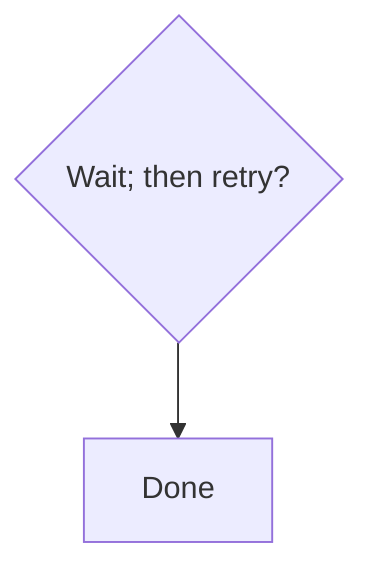

<!-- expected-line: 8 -->
# Invalid: raw semicolon inside a {...} decision-node label

The decision node label below contains a raw `;` instead of the `#59;` entity code.

```mermaid
flowchart TD
    A{Wait; then retry?} --> B[Done]
```
