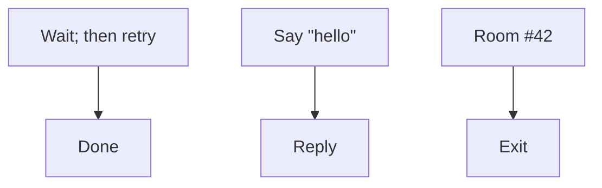

# Valid: entity codes (base-10 and named)

Covers `#59;` (semicolon), `#quot;` (double quote), and `#35;` (`#`) -- all legal per
`CLAUDE.md Sec."Mermaid diagram conventions"`.

```mermaid
flowchart TD
    A[Wait#59; then retry] --> B[Done]
    C[Say #quot;hello#quot;] --> D[Reply]
    E[Room #35;42] --> F[Exit]
```
