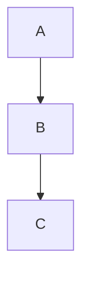

# Valid: statement-terminating semicolons at end of line

A trailing `;` outside any label is a legal statement terminator, not a label boundary.

```mermaid
flowchart TD
    A --> B;
    B --> C;
```
