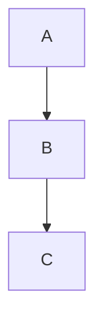

# Valid: %% comment lines containing semicolons

Mermaid's own comment syntax (`%%`) makes the rest of the line inert; a `;` there is legal.

```mermaid
flowchart TD
    %% this comment; has a semicolon; and another one; all fine
    A --> B
    %% TODO: revisit this edge; low priority
    B --> C
```
