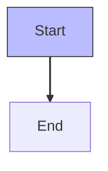

# Valid: classDef, style, and linkStyle directives

Each directive's trailing `;` is a statement terminator, never a label boundary.

```mermaid
flowchart TD
    A[Start] --> B[End]
    classDef done fill:#f9f,stroke:#333,stroke-width:2px;
    style A fill:#bbf,stroke:#333,stroke-width:1px;
    linkStyle 0 stroke:#333,stroke-width:2px;
```
