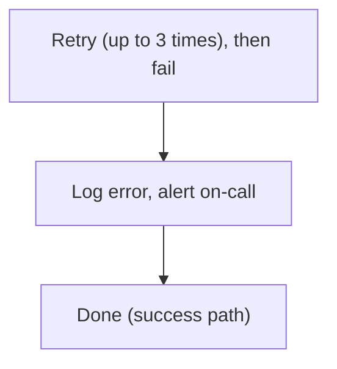

# Valid: flowchart with quoted labels containing commas and parentheses

Commas and parentheses inside a quoted label are unrelated to the semicolon rule.

```mermaid
flowchart TD
    A["Retry (up to 3 times), then fail"] --> B["Log error, alert on-call"]
    B --> C["Done (success path)"]
```
