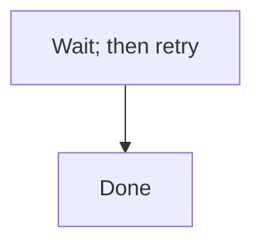

# Valid: block-form ignore markers suppress a genuine violation

The fence below contains a raw `;` inside a label, which would normally violate the rule --
but it is wrapped in the block-form escape valve (EDMV3-T43 AC6), so it is legal here.

<!-- edm-lint-ignore-start -->

<!-- edm-lint-ignore-end -->
