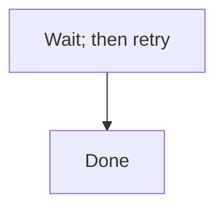

# Valid: a single-line marker on the fence-open line suppresses the whole fence

Per EDMV3-T43 AC6, `<!-- edm-lint-ignore -->` placed on the fence-open line itself (not
inside the fence) suppresses this one fence's Mermaid membership entirely.

