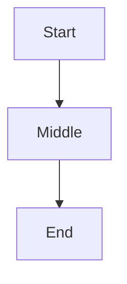
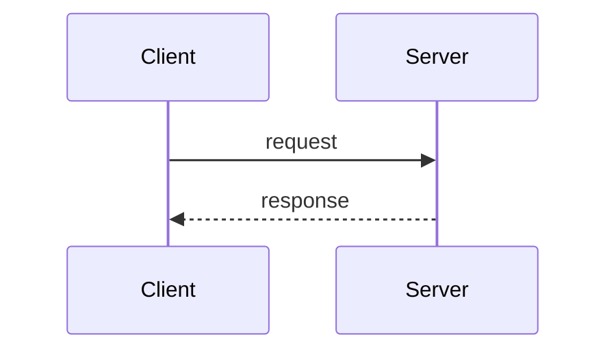

# Valid: multiple diagrams in one file, all clean

A file with several Mermaid fences and ordinary prose between them, none of which contain a
raw semicolon.

Some prose in between, discussing the diagram above; this sentence has a semicolon too, but
it's outside any fence so the Mermaid class never looks at it.

