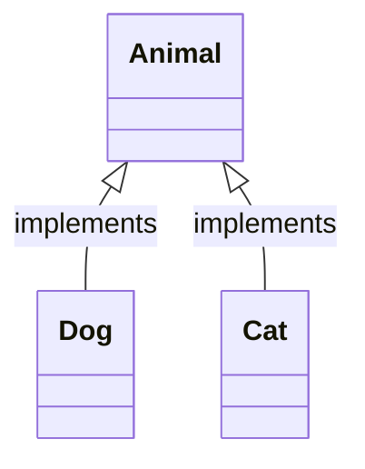

# Valid: a classDiagram relationship line with a colon, no semicolon

Proves the sequenceDiagram-message heuristic (raw `;` after a `:` on an arrow line) does not
false-positive on an unrelated diagram type's colon usage when there is no semicolon present.

