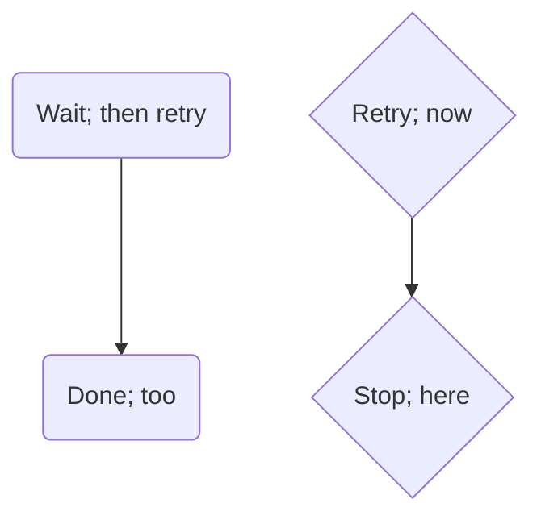

# Valid: paren and curly labels with an entity inside plus a real terminator outside

Each statement below carries a `#59;` entity INSIDE a `(...)` or `{...}` label, plus a real
statement-terminating `;` OUTSIDE the label (at the end of the line) -- proving the label
boundary is drawn correctly in both directions: the internal entity never counts as a violation,
and the external terminator is recognized as a statement terminator, not a label byte.

