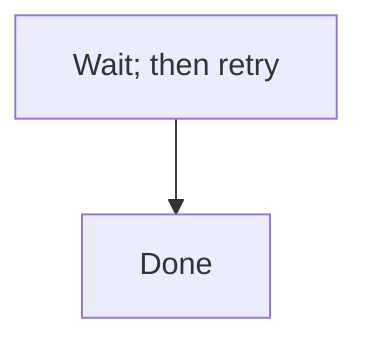

<!-- GENERATED FILE. This file is generated from CLAUDE.md by edm-sync-canonical-sections;
     do not hand-edit -- edits are overwritten on the next run and a stale hand-edit fails
     the byte-identity smoke assertion in CI (EDMV3-T41, decisions.md D22).

     Plugin-root CLAUDE.md is confirmed by 'claude plugin validate' NOT to be loaded as
     runtime context, so a bare 'CLAUDE.md Sec."..."' reference in a prompt has no
     resolvable path from an installed plugin cache. Reference the sections below by this
     file's plugin-relative path (docs/canonical-sections.md) instead. -->

## Severity vocabulary (canonical)

All EDM audit agents use the following four-level scale. No agent may define a divergent local scale.

| Level | Meaning | Required action |
|---|---|---|
| **P0** | Critical -- blocks implementation, security/legal issue, production failure, or architecturally wrong | Fix before this phase may be called complete |
| **P1** | Significant -- material gap, factual error, missing requirement, or behavior that must be corrected before shipping | Remediated before the phase or round may be called complete |
| **P2** | Minor -- polish, edge-case, improvement, or nice-to-have | Remediated before convergence |
| **NOTED** | Not actionable -- the issue is intentional, pre-existing, or a known accepted trade-off | Document in "Decisions / Non-Findings"; do not re-investigate |

`NOTED` is not actionable and is distinct from deferral -- a deferral is an actionable finding
postponed to later, and deferral does not exist in this methodology. Every P0, P1 and P2 finding
is remediated before convergence; `NOTED` is the only status that closes a finding without a fix.

**Backward-compatibility mapping** (from the synthesizer's legacy P1/P2/P3 scale used before v2.0):
- Legacy P1 (production failure / security) -> **P0**
- Legacy P2 (operational friction / must-fix) -> **P1**
- Legacy P3 (defensive improvement / nice-to-have) -> **P2**
- NOTED -> unchanged

**Sanctioned exception -- P2 debt acceptance at convergence (EDMV3-T68).** "Remediated before
convergence" above still holds by default; the one sanctioned exception is an explicit human
choice at the convergence gate, never a silent policy weakening. When a code-audit round's
blocking set is P0=0, P1=0 and P2>0, `skills/code-audit/SKILL.md`'s convergence gate (Sec."10.
Convergence gate") offers **Converge now**, which runs `edm-state approve-gate <PREFIX>
code-audit --accept-p2-debt`. That command hard-refuses if any P0 or P1 is open -- the override
is P2-only, never P0/P1 -- and otherwise records `code_audit_converged=true` plus
`code_audit_p2_debt_accepted`/`_count`/`_round`/`_accepted_at`/`_accepted_by` in state. The
ledger itself is left unchanged: accepted P2s still show as open findings in
`findings-ledger.md`/`.jsonl`, and HANDOFF's code-audit gate row names the accepted count and
round so a teammate sees debt was knowingly carried, not silently missed. `edm-state archive`
re-verifies P0/P1 are still 0 and refuses if a newer full audit round has completed since
acceptance (the debt has gone stale -- re-run `--accept-p2-debt` or fix the remaining findings
first). The override reads the blocking set straight from `findings-ledger.jsonl`, so it does
not itself require that a full fourteen-lens round was ever recorded (CA-426): on an initiative
with zero recorded code-audit rounds the convergence check warns on stderr and proceeds, and the
flag can engage. It asserts only that no P0 or P1 is open in the ledger as it stands, never that
the ledger is complete. The gate also offers **Fix low-hanging fruit first**: remediate the P2s
whose
REMEDIATION.md prescription is a single self-contained change, then re-present the gate with the
smaller remaining set -- a middle ground between converging immediately and re-treating every
open P2 as blocking.


## Mermaid diagram conventions (canonical)

All EDM agents that author or audit Mermaid diagrams follow these conventions. No agent may define a divergent local rule.

Mermaid's `;` is a lexer-level statement separator, and this is reserved even where the `;` appears inside label text -- the parser does not distinguish "inside a label" from "between statements," so a literal semicolon inside a node, edge or message label breaks the diagram.

**The rule:** a literal semicolon in Mermaid label, node, edge or message text is written as the entity code `#59;` -- `#` followed by either a base-10 code point or an entity name, then `;`, with no leading ampersand. `&#59;` is not this project's convention; `#59;` is correct.

Before (raw semicolon inside a label -- breaks the diagram):

<!-- edm-lint-ignore-start -->

<!-- edm-lint-ignore-end -->

After (entity code, no leading ampersand -- renders correctly):


Quoting label text is not a reliable substitute for the entity code across every diagram type. A `sequenceDiagram` message's text after the `:` is unquoted, so it is especially exposed to this failure -- there is no quote to protect it there.

The following remain legal and are **not** violations of this rule:
- A statement-terminating `;` at the end of a line, outside any label.
- `;` on a `%%` comment line.
- `;` terminating a `classDef`, `style`, or `linkStyle` directive.

Other entity codes follow the same form, so the rule generalizes: `#quot;` (double quote), `#35;` (`#`), and so on.

This section's heading string, `## Mermaid diagram conventions (canonical)`, is referenced by name from the eleven touch points inventoried in `architecture.md` and asserted by a smoke test -- do not rename it without updating every reference.

## Unverifiable acceptance criteria (D15)

An unverifiable acceptance criterion -- one whose stated runtime environment does not exist in
the project (no staging deploy, no live database, no browser harness) -- is a specification
defect, not a fourth verdict. `/edm:verify-runtime` (EDMV3-T33) records exactly two closing
verdicts, PASS or FAIL, for every entry in `partial_verdict_map`; there is no `BLOCKED`,
`WAIVED`, or `N/A-runtime` value anywhere in this methodology.

When an AC's runtime environment genuinely does not exist, there are exactly two sanctioned
responses:

1. **Rework the AC** into something verifiable in the environment that does exist -- the usual
   outcome. Most "PARTIAL forever" ACs are testable with a narrower, still-meaningful claim.
2. **Move the unverifiable clause out of scope** as a recorded boundary for a follow-on
   initiative, using the D14 scope-boundary framing -- a decision made on its own merits, not a
   postponed finding.

Both routes are a scope change to an approved ticket, so both go through gate change control:
presented at the relevant gate with the rationale, approved or rejected by the human via the
canonical `skills/orchestrator/SKILL.md Sec."Gate PROTOCOL"`, and recorded in `decisions.md` and
the ticket's audit trail. **The implementer cannot descope an AC by declaring it unverifiable** --
only a human, at a gate, can accept route (1) or (2). Archive stays hard-blocked until every AC in
`partial_verdict_map` carries a `closing_verdict` of PASS or FAIL.


## Project artifact layout

The **canonical layout** (v2.0+) places each initiative inside a product subdirectory:

```
SRD/                              <- project root, committed to git
+-- .codemap.md                   <- current-architecture map (Should/on-demand); written and
|                                     refreshed by the first explorer of each initiative
|                                     (agents/edm-explorer.md); shared across every initiative
+-- {PRODUCT}/                    <- one directory per product area (e.g. "edm", "auth", "billing")
    +-- {PREFIX}__{DESCRIPTION}/  <- initiative directory (double-underscore separator)
        |
        +-- planning.md               <- Phase 1 (Must/always-present)
        +-- srd.md                    <- Phase 2 output (filename configurable) (Must/always-present)
        +-- architecture.md           <- Phase 2: edm-architect diagrams and decisions (Must/always-present)
        +-- explorers/                <- Phase 1: parallel explorer findings, one file per focus area (Must/always-present)
        |   +-- 01-{slug}.md, 02-{slug}.md, ...
        +-- decisions.md              <- running key-decisions and finding-to-commit ledger (Must/always-present)
        +-- audit-srd.md              <- Phase 3 audit findings
        +-- tickets/                  <- Phase 4 (dirname configurable)
        |   +-- README.md             <- index, legend, critical path, coverage map, version-linkage header
        |   +-- audit.md              <- Phase 5 ticket-pack audit
        |   +-- epics/
        |       +-- 01-{epic}.md
        |       +-- 02-{epic}.md
        +-- test-plan.md              <- /edm:test (stack + AC coverage map)
        +-- test-coverage.md          <- /edm:test (coverage by layer + AC<->test cross-ref)
        +-- qc/                       <- Phase 6 QC reports (always-present after first wave)
        |   +-- qc-summary.md         <- merged QC verdict table (single auditor or merged shards)
        |   +-- qc-shard-impl-w{WW}-{NN}.md <- per-implementer hook shards ({WW} = wave number, {NN} = lowest ticket in range); wave component mandatory, CA-010
        |   +-- qc-shard-pass-w{WW}-{NN}.md <- post-wave threshold shards ({WW} = wave number, {NN} = shard ordinal within that wave); disjoint from qc-shard-impl-*
        +-- code-audit/               <- /edm:code-audit output
        |   +-- findings-ledger.jsonl <- authoritative cross-round findings ledger (stable CA-NNN IDs)
        |   +-- findings-ledger.md    <- deterministic render of findings-ledger.jsonl (`edm-state render-ledger`)
        |   +-- pass-{N}_{YYYY-MM-DD}/ <- one directory per audit round (N = monotonic counter)
        |       +-- lens-L1.jsonl ... lens-L14.jsonl  <- authoritative per-lens findings (schema in skills/code-audit/SKILL.md)
        |       +-- lens-L1.md ... lens-L14.md
        |       +-- lenses-run.txt    <- lens set for this round (full vs. partial)
        |       +-- tooling-notes.md  <- on-demand (CA-388/CA-466): per-lens stall counts and truncation caveats; absent when the round's delivery was clean
        |       +-- REMEDIATION.md
        +-- ROLLBACK.md               <- rollback runbook (Should/on-demand; structure: trigger, revert steps, verify, owner)
        +-- exec-report.md            <- post-Phase-6 execution report with mode field (Should/on-demand)
        |   (per-epic variant: epicN-execution-report.md)
        +-- post-deploy/              <- post-deploy verification + analysis-input docs (Could/on-demand)
        |   +-- verification.md       <- smoke-test / deploy verification report
        |   +-- analysis/             <- rate-limit-analysis.md, source-triage.md, cost-analysis.md
        +-- HANDOFF.md                <- auto-generated cross-user resume doc (updated at every phase/gate/stop)
        +-- .edm-state.json           <- gate approvals, phase timestamps, mode fields (committed by default)
```

**Slot annotations**:
- `always-present` -- scaffolded by `edm-init` or written early in the phase flow
- `on-demand` -- created by its owning phase/agent only when the initiative needs it
- `Must/Should/Could` -- priority per SRD EDMV2-38..43

**Canonical artifact homes** (all paths derived from state via `initiative_dir_for()`, never hardcoded):
- `SRD/.codemap.md` -- the repository's **current** architecture, distinct from any one
  initiative's `architecture.md` (its **target** architecture): the two never duplicate or
  contradict each other because they answer different questions. Lives at the `srd_root` root, not
  inside an initiative directory, because it is shared and refreshed across initiatives rather than
  scoped to one (D11, `EDMV4-T48`). No generator produces or validates it -- it is written by hand
  by the first explorer of each initiative (`agents/edm-explorer.md`).
- `architecture.md` -- canonical home for `edm-architect` diagrams and architecture decisions (EDMV2-38)
- `explorers/` -- canonical home for parallel explorer reports; synthesized into `planning.md` (EDMV2-39)
- `decisions.md` -- initiative-wide key-decisions + finding-to-commit ledger; distinct from `code-audit/findings-ledger.md` which is the code-audit cross-round ledger (EDMV2-40)
- `ROLLBACK.md` -- on-demand rollback runbook; template: trigger conditions, ordered revert steps, verification-after-rollback, owner/contact (EDMV2-41)
- `exec-report.md` -- post-Phase-6 execution report; `mode` field = run mode (e.g., `live-db`, not the adaptation profile) (EDMV2-42)
- `post-deploy/` -- post-deploy verification and analysis-input documents (EDMV2-43)

**Concrete example**: `SRD/edm/EDMV2__enhance-edm-plugin/`

- The **double-underscore** (`__`) separates the PREFIX from the description slug -- never use a single underscore.
- The description slug is lowercase-hyphenated (e.g. `enhance-edm-plugin`, `user-auth-rewrite`).
- PREFIX is **globally unique** across ALL product subdirectories -- two products may not share a PREFIX (see Naming conventions below).

**Existing flat initiatives (`SRD/{PREFIX}/`) continue to work unchanged** (EDMV2-90 backward compat). The resolver
(`state_file_for` in `bin/edm-state`) detects the layout automatically and prefers an existing on-disk path so
in-flight initiatives are never relocated without explicit `edm-state migrate-path` invocation.

Migration from flat to product-scoped is **opt-in** per initiative:

```bash
edm-state migrate-path --product edm --description enhance-edm-plugin EDMV2
```

This uses `git mv` when the initiative is git-tracked, then updates `product_name` and `initiative_description` in state.

The plugin reads root paths from `userConfig`, so teams can relocate the entire tree:

- `${user_config.srd_root}` (default `./SRD`)
- `${user_config.srd_filename}` (default `srd.md`)
- `${user_config.ticket_pack_dirname}` (default `tickets`)

### Existing repository conventions (informational)

The project may contain an `/SRD/` directory with initiatives that pre-date the plugin and use older patterns. The
plugin does NOT migrate these -- they keep their current format. New initiatives created via the plugin use the
product-scoped canonical layout above (or flat layout when `--product`/`--description` are omitted).


## Optional: Jira synchronization

`skills/push-jira/SKILL.md` (invoked as `/edm:push-jira <PREFIX> [PROJECT_KEY]`) optionally pushes the ticket pack to Jira via the Atlassian MCP. It is **strictly opt-in**:

- The skill checks `mcp__{jira_mcp_namespace}__atlassianUserInfo` first (namespace defaults to `plugin_jira_atlassian-mcp-server`; override via `${user_config.jira_mcp_namespace}`); if unavailable, it skips with a friendly message.
- Tickets are tracked in Jira via labels (`edm-{prefix}-t{nn}`) -- no custom Jira fields required.
- Re-running is idempotent: existing issues are updated, not duplicated.
- Status, comments, and worklog on Jira issues are preserved across re-runs.
- Dependencies become Issue Links of type `Blocks` (or `Relates` if `Blocks` isn't available).
- Each ticket file gets a Jira link appended after first push: `## AUTH-T01: ...  ([MCP-1234](https://....atlassian.net/browse/MCP-1234))`.
- A summary of all sync actions is written to `${user_config.srd_root}/{PREFIX}/${user_config.ticket_pack_dirname}/jira-sync.md`.

The skill does NOT push during active implementation (Phase 6) -- let the markdown ticket pack stay authoritative. Re-sync after the initiative completes if desired.

The `userConfig.jira_project_key` value provides a default; otherwise the user must pass `<PROJECT_KEY>` as the second argument.


## EDM mode matrix (EDMV3-T38)

`skills/orchestrator/SKILL.md` Step 1c presents this selection interactively and records the
routing; the descriptive matrix and each mode's sub-flow **procedure** live here and in the phase
skill that owns each step, never restated in the dispatcher (EDMV3-T37).

| `mode` | What changes | Owning phase skill(s) |
|---|---|---|
| `standard` | Full six-phase flow, file-path vocabulary, standard QC (Recommended) | all eight, unmodified |
| `mini-srd` | Phases 2-5 fuse into one audited file; no separate ticket pack; a merged `"Gate 2+3"` replaces Gate 2 and Gate 3 | `skills/srd/SKILL.md` (fused file), `skills/audit-srd/SKILL.md` (merged gate + `skip-phase 4/5`) |
| `iac` | Resource-path vocabulary in Target Components; QC verifies `terraform plan` / drift | `skills/srd/SKILL.md`, `skills/tickets/SKILL.md` |
| `data-ml` | Requires a `## Data Requirements` SRD section; QC validates model metrics | `skills/srd/SKILL.md` |
| `prototype` | Stops after Phase 2 (SRD); Phases 3-6 recorded `skip-phase`; no convergence gate required to archive | `skills/srd/SKILL.md` (the stop message and skip-phase recording) |

| `lifecycle_mode` | What changes | Owning phase skill(s) |
|---|---|---|
| `standard` | No change from the `mode` behavior above | -- |
| `fast-track` / `fix-pack` | Tickets generated directly from an analysis document; Phases 1, 2, 3, 5 recorded `skip-phase`; a single ticket-pack review gate, header `"Gate 3"`, replaces the normal Gate 2 -> Phase 4 -> Gate 3 sequence; no convergence gate required to archive (`cmd_archive` exempts both `lifecycle_mode` values regardless of `mode` and records `archive_exemptions: ["CONVERGENCE_NOT_REQUIRED"]`) | `skills/tickets/SKILL.md` ("Fast-Track / Fix-Pack Mode" section) |

`compliance_enabled=true` inserts **Gate 3.5** (a compliance review, distinct from the `mode` and
`lifecycle_mode` families above) between Gate 3 and Phase 6, and adds regulatory-traceability
columns to ticket ACs -- owned by `skills/audit-tickets/SKILL.md` (the gate) and
`skills/tickets/SKILL.md` (the columns).

Mode suppression for gates and phases (which gate applies, which phase is terminal) is computed by
`cmd_gate_check`/`cmd_branch_check`/`terminal_phase_for_mode()` in `bin/edm-state`, per each phase
skill's Step 0 preflight (`skills/plan/SKILL.md Sec."Step 0 -- Gate and Branch Preflight"`) -- never
restated as prose in a phase skill or in the dispatcher.


## Phase Timing Guidelines (EDMV3-T38)

| Initiative Size        | Planning | SRD | Audit | Tickets | Audit | Impl   | Total     |
|------------------------|----------|-----|-------|---------|-------|--------|-----------|
| Small (10-20 tickets)  | 30m      | 2h  | 1h    | 1h      | 30m   | 4-8h   | 1-2 days  |
| Medium (30-50 tickets) | 1h       | 4h  | 2h    | 3h      | 1h    | 12-24h | 3-5 days  |
| Large (50-85 tickets)  | 2h       | 8h  | 4h    | 6h      | 2h    | 24-48h | 5-10 days |

Run `/edm:metrics --calibrate` periodically and use the printed medians to update these guidelines.

