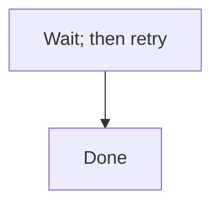

<!-- GENERATED FILE. This file is generated from CLAUDE.md by edm-sync-canonical-sections;
     do not hand-edit -- edits are overwritten on the next run and a stale hand-edit fails
     the byte-identity smoke assertion in CI (EDMV3-T41, decisions.md D22).

     Plugin-root CLAUDE.md is confirmed by 'claude plugin validate' NOT to be loaded as
     runtime context, so a bare 'CLAUDE.md Sec."..."' reference in a prompt has no
     resolvable path from an installed plugin cache. Reference the sections below by this
     file's plugin-relative path (docs/canonical-sections.md) instead. -->

## Severity vocabulary (canonical)

All EDM audit agents use the following four-level scale. No agent may define a divergent local scale.

| Level | Meaning | Required action |
|---|---|---|
| **P0** | Critical -- blocks implementation, security/legal issue, production failure, or architecturally wrong | Fix before this phase may be called complete |
| **P1** | Significant -- material gap, factual error, missing requirement, or behavior that must be corrected before shipping | Remediated before the phase or round may be called complete |
| **P2** | Minor -- polish, edge-case, improvement, or nice-to-have | Remediated before convergence |
| **NOTED** | Not actionable -- the issue is intentional, pre-existing, or a known accepted trade-off | Document in "Decisions / Non-Findings"; do not re-investigate |

`NOTED` is not actionable and is distinct from deferral -- a deferral is an actionable finding
postponed to later, and deferral does not exist in this methodology. Every P0, P1 and P2 finding
is remediated before convergence; `NOTED` is the only status that closes a finding without a fix.

**Backward-compatibility mapping** (from the synthesizer's legacy P1/P2/P3 scale used before v2.0):
- Legacy P1 (production failure / security) -> **P0**
- Legacy P2 (operational friction / must-fix) -> **P1**
- Legacy P3 (defensive improvement / nice-to-have) -> **P2**
- NOTED -> unchanged

## Mermaid diagram conventions (canonical)

All EDM agents that author or audit Mermaid diagrams follow these conventions. No agent may define a divergent local rule.

Mermaid's `;` is a lexer-level statement separator, and this is reserved even where the `;` appears inside label text -- the parser does not distinguish "inside a label" from "between statements," so a literal semicolon inside a node, edge or message label breaks the diagram.

**The rule:** a literal semicolon in Mermaid label, node, edge or message text is written as the entity code `#59;` -- `#` followed by either a base-10 code point or an entity name, then `;`, with no leading ampersand. `&#59;` is not this project's convention; `#59;` is correct.

Before (raw semicolon inside a label -- breaks the diagram):

<!-- edm-lint-ignore-start -->

<!-- edm-lint-ignore-end -->

After (entity code, no leading ampersand -- renders correctly):

Quoting label text is not a reliable substitute for the entity code across every diagram type. A `sequenceDiagram` message's text after the `:` is unquoted, so it is especially exposed to this failure -- there is no quote to protect it there.

The following remain legal and are **not** violations of this rule:
- A statement-terminating `;` at the end of a line, outside any label.
- `;` on a `%%` comment line.
- `;` terminating a `classDef`, `style`, or `linkStyle` directive.

Other entity codes follow the same form, so the rule generalizes: `#quot;` (double quote), `#35;` (`#`), and so on.

This section's heading string, `## Mermaid diagram conventions (canonical)`, is referenced by name from the eleven touch points inventoried in `architecture.md` and asserted by a smoke test -- do not rename it without updating every reference.
